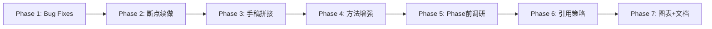

# Roadmap: clinpub

**7 phases** | **17 requirements mapped** | All v1 requirements covered ✓

| # | Phase | Goal | Requirements | 工作量 |
|---|-------|------|-------------|--------|
| 1 | Bug Fixes | 修 hook 正则 + 数据联动更新 | BUG-01, BUG-02 | 小 |
| 2 | 断点续做 | `/clinpub-do` + `/clinpub-next-step` + clear 提醒 | NEXT-01, NEXT-02, NEXT-03 | 中 |
| 3 | 手稿拼接 | IMRAD 各段独立撰写 + 拼接为终稿 | WRITE-01, WRITE-02 | 大 |
| 4 | 方法增强 | 未知方法搜索 + 组间对比方法固化 | METH-01, METH-02 | 中 |
| 5 | Phase 前调研流程 | 调研→建议→讨论→执行 的标准化流程 | FLOW-01 | 中 |
| 6 | 引用策略 | 默认 50 篇/近 5 年 + 引用前讨论 | CITE-01, CITE-02 | 小 |
| 7 | 图表+文档优化 | 图表质量 + WAVE 说明中文/改名 | CHART-01, DOC-01, DOC-02 | 小 |

---

## Phase Details

**Phase 1: Bug Fixes**
Goal: 修复影响基础可用性的两个 bug
Requirements: BUG-01, BUG-02
Success criteria:
1. Hook 正则在 STATE.md 写 `- 阶段：Phase N` 时正确识别，不回退到 Phase 0
2. 用户修改清洗数据需求时，Phase 1 所有关联文件（profile、spec 等）自动联动更新

**Phase 2: 断点续做**
Goal: 支持工作中断后恢复，无需从头摸索上下文
Requirements: NEXT-01, NEXT-02, NEXT-03
Success criteria:
1. `/clinpub-do` 读取工作区状态（STATE.md 和当前文件结构），自动路由到合适的命令
2. `/clinpub-next-step` 自动推进到下一 Phase 或 Wave
3. Phase/Wave 结束时自动提示 clear 并输出下一步提示

**Phase 3: 手稿拼接**
Goal: IMRAD 各段独立撰写引用后拼接为终稿
Requirements: WRITE-01, WRITE-02
Success criteria:
1. Introduction/Methods/Results/Discussion 各段独立完成引用和撰写
2. 终稿由各段拼接生成，非重写
3. 引用在合并时统一整理，不重复不遗漏

**Phase 4: 方法增强**
Goal: 处理未知方法和标准组间对比
Requirements: METH-01, METH-02
Success criteria:
1. 用户提到未知统计方法时自动搜索，总结后与用户讨论
2. 组间对比自动按组数选择标准检验 → 输出到分析报告中

**Phase 5: Phase 前调研流程**
Goal: 每个 Phase 前有标准调研→讨论→执行流程
Requirements: FLOW-01
Success criteria:
1. 每个 Phase 前自动调研相关领域和技术方案
2. 以建议方式与用户讨论，收集反馈后再执行

**Phase 6: 引用策略**
Goal: 文献引用策略标准化
Requirements: CITE-01, CITE-02
Success criteria:
1. 默认引用约 50 篇、近 5 年文献
2. 引用前与用户讨论各部分引用数量、时间范围、IF 偏好

**Phase 7: 图表+文档优化**
Goal: 图表美观 + 文档中文本地化
Requirements: CHART-01, DOC-01, DOC-02
Success criteria:
1. 图表参考优质案例优化，统一风格
2. WAVE 下 README 全部为中文，改名为"方法说明"

---

## Requirement Mapping Validation

| Category | Count | Mapped | Unmapped |
|----------|-------|--------|----------|
| Bug Fixes | 2 | 2 (Phase 1) | 0 ✓ |
| 断点续做 | 3 | 3 (Phase 2) | 0 ✓ |
| 手稿拼接 | 2 | 2 (Phase 3) | 0 ✓ |
| 方法增强 | 2 | 2 (Phase 4) | 0 ✓ |
| Phase 前调研 | 1 | 1 (Phase 5) | 0 ✓ |
| 引用策略 | 2 | 2 (Phase 6) | 0 ✓ |
| 图表+文档 | 3 | 3 (Phase 7) | 0 ✓ |
| **Total** | **17** | **17** | **0 ✓** |

## Phases

---
*Roadmap created: 2026-05-05*
