# AI代理系统

<cite>
**本文档引用的文件**
- [README.md](file://README.md)
- [AGENTS.md](file://AGENTS.md)
- [docs/ARCHITECTURE.md](file://docs/ARCHITECTURE.md)
- [agents/analyst-agent.md](file://agents/analyst-agent.md)
- [agents/clinpub-executor.md](file://agents/clinpub-executor.md)
- [agents/clinpub-planner.md](file://agents/clinpub-planner.md)
- [agents/clinpub-verifier.md](file://agents/clinpub-verifier.md)
- [agents/modify-agent.md](file://agents/modify-agent.md)
- [agents/reference-agent.md](file://agents/reference-agent.md)
- [agents/topic-miner-agent.md](file://agents/topic-miner-agent.md)
- [agents/writer-agent.md](file://agents/writer-agent.md)
- [pipeline/workflows/analysis.md](file://pipeline/workflows/analysis.md)
- [pipeline/workflows/data-prep.md](file://pipeline/workflows/data-prep.md)
- [pipeline/workflows/writing.md](file://pipeline/workflows/writing.md)
- [pipeline/references/analysis_methods.md](file://pipeline/references/analysis_methods.md)
- [pipeline/references/r_patterns.md](file://pipeline/references/r_patterns.md)
</cite>

## 目录
1. [简介](#简介)
2. [项目结构](#项目结构)
3. [核心组件](#核心组件)
4. [架构总览](#架构总览)
5. [详细组件分析](#详细组件分析)
6. [依赖分析](#依赖分析)
7. [性能考量](#性能考量)
8. [故障排查指南](#故障排查指南)
9. [结论](#结论)
10. [附录](#附录)

## 简介
clinpub 是面向SCI Q1/Q2期刊的端到端临床数据分析与发表加速器。系统以“资深医学统计学家 + 学术写作顾问”的双重角色为理念，围绕患者级数据（每行一个患者，每列一个变量）构建从数据准备、统计分析、图表生成到论文撰写的完整流水线。系统采用三层架构：Commands（用户命令）→ Workflows（阶段编排）→ Agents（专业化AI代理），并通过严格的阶段门控与验证机制保障质量。

## 项目结构
项目采用模块化组织，关键目录与文件如下：
- commands/clinpub/：用户命令入口（Skill接口）
- agents/：专业化AI代理角色卡片（7个代理）
- pipeline/workflows/：阶段编排逻辑（6个阶段）
- pipeline/references/：参考文档（11个）
- pipeline/templates/：模板文件（14个，含方法说明模板）
- pipeline/contexts/：上下文配置
- scripts/：工具脚本（Python数据画像）
- hooks/：Claude Code Hooks（工作流保护）
- docs/：教程与指南
- examples/：示例数据与配置

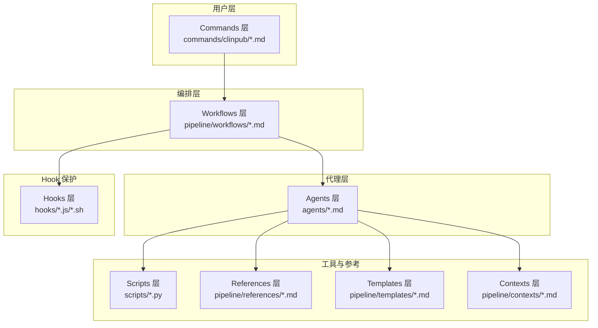

**图表来源**
- [docs/ARCHITECTURE.md:9-43](file://docs/ARCHITECTURE.md#L9-L43)
- [README.md:20-35](file://README.md#L20-L35)

**章节来源**
- [README.md:82-94](file://README.md#L82-L94)
- [docs/ARCHITECTURE.md:7-43](file://docs/ARCHITECTURE.md#L7-L43)

## 核心组件
系统包含8个专业化代理，每个代理具备明确的语言能力、职责分工与协作边界：
- Topic Miner Agent：Python，负责数据画像、文献扫描与选题生成
- Analyst Agent：R为主/Python辅助，负责数据清洗、统计分析与图表生成
- Reference Agent：Python，负责文献检索、PDF全文读取与引用管理
- Writer Agent：中文论文撰写，遵循IMRAD结构与反AI模板规则
- Clinpub Planner：研究分析规划，生成可执行的PLAN.md（波次依赖图）
- Clinpub Executor：分析执行，原子提交、偏差处理与SUMMARY.md生成
- Clinpub Verifier：跨阶段验证，15种验证模式
- Modify Agent：分析输出修改，支持样式与方法变更

语言与工具能力：
- Analyst/Executor/Verifier：R/Python脚本执行
- Topic Miner/Reference：Python脚本与外部技能（ncbi-search、pdf-reader）
- Writer：中文写作与反AI模板规则
- Planner：无编程，专注规划与契约

协作机制：
- 每个阶段四步：DISCUSS → PLAN → EXECUTE → VERIFY
- 阶段间通过Milestone评审与门控
- 代理间通过文件系统传递上下文，无共享内存

**章节来源**
- [README.md:47-58](file://README.md#L47-L58)
- [AGENTS.md:72-84](file://AGENTS.md#L72-L84)
- [docs/ARCHITECTURE.md:67-83](file://docs/ARCHITECTURE.md#L67-L83)

## 架构总览
系统采用三层架构，代理间通过标准化文件与清单（MANIFEST.yaml）进行上下文传递，确保隔离与可追溯性。

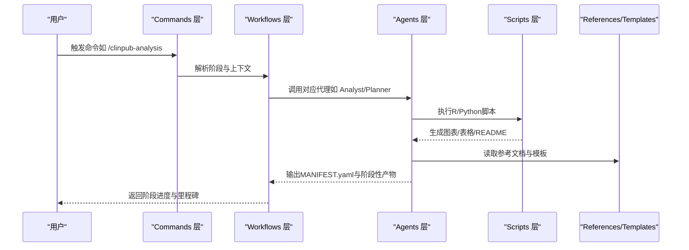

**图表来源**
- [docs/ARCHITECTURE.md:45-87](file://docs/ARCHITECTURE.md#L45-L87)
- [AGENTS.md:22-44](file://AGENTS.md#L22-L44)

**章节来源**
- [docs/ARCHITECTURE.md:45-104](file://docs/ARCHITECTURE.md#L45-L104)

## 详细组件分析

### Topic Miner Agent（选题挖掘）
- 语言能力：Python
- 职责：数据画像、文献扫描、选题生成
- 工作流程：
  1) 数据画像：变量类型、缺失率、分布、相关性矩阵
  2) 文献扫描：并行子代理搜索PubMed，识别研究空白
  3) 选题生成：结合数据与文献，生成3-5候选主题与可行性评分
  4) 生成项目配置：自动生成project_config.yml供后续阶段使用
- 输出产物：data_profile.md、literature_scan.md、选题报告.md、to_project_config.yml
- 关键规则：变量角色需用户确认；文献必须有DOI；不可编造数据

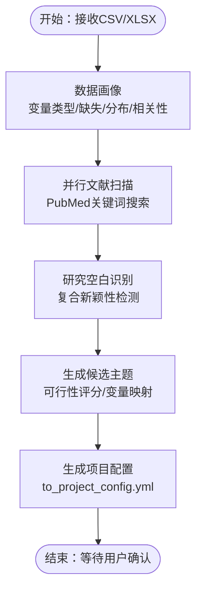

**图表来源**
- [agents/topic-miner-agent.md:19-183](file://agents/topic-miner-agent.md#L19-L183)
- [pipeline/workflows/data-prep.md:19-58](file://pipeline/workflows/data-prep.md#L19-L58)

**章节来源**
- [agents/topic-miner-agent.md:1-320](file://agents/topic-miner-agent.md#L1-L320)
- [pipeline/workflows/data-prep.md:1-184](file://pipeline/workflows/data-prep.md#L1-L184)

### Analyst Agent（统计分析）
- 语言能力：R为主/Python辅助
- 职责：数据准备（Phase 1）与统计分析（Phase 2）
- 工作流程：
  1) Phase 1：缺失值处理（分层策略）、异常值检测、衍生变量、数据质量报告
  2) Phase 2：按PLAN.md执行分析，生成figure+table+方法说明
- 输出产物：cleaned.csv、各方法目录（含README）、MANIFEST.yaml
- 关键规则：严格出版级标准（分辨率、字体、配色、尺寸）、报告效应量+95%CI+p值

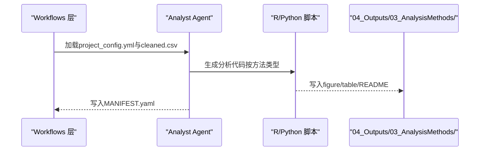

**图表来源**
- [agents/analyst-agent.md:17-107](file://agents/analyst-agent.md#L17-L107)
- [pipeline/workflows/analysis.md:187-222](file://pipeline/workflows/analysis.md#L187-L222)

**章节来源**
- [agents/analyst-agent.md:1-141](file://agents/analyst-agent.md#L1-L141)
- [pipeline/workflows/analysis.md:1-289](file://pipeline/workflows/analysis.md#L1-L289)

### Reference Agent（文献检索与引用管理）
- 语言能力：Python
- 职责：PubMed检索、PDF全文读取、引用管理（Vancouver格式）
- 工作流程：
  1) 检查ncbi-search技能可用性
  2) 按阶段需求执行搜索（研究空白确认/写作前/审稿补充）
  3) 方法搜索与技术调研（可选）
  4) 生成citation_map.md与references.bib
- 输出产物：Reference/目录下的结构化引用与清单
- 关键规则：每条引用必须有DOI；不可编造文献

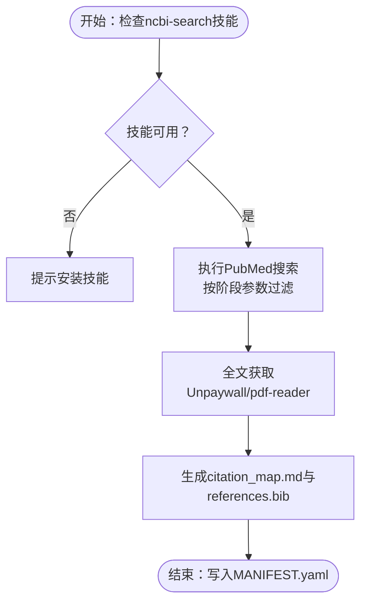

**图表来源**
- [agents/reference-agent.md:14-274](file://agents/reference-agent.md#L14-L274)

**章节来源**
- [agents/reference-agent.md:1-321](file://agents/reference-agent.md#L1-L321)

### Writer Agent（论文撰写）
- 语言能力：中文写作（英文图表/表格）
- 职责：IMRAD结构撰写、反AI模板规则、模拟审稿与修订
- 工作流程：
  1) 加载项目配置与上游产物清单
  2) 按顺序撰写Introduction/Methods/Results/Discussion
  3) 每段前Reference Agent预搜索，后Writer Agent撰写，再用户审阅
  4) 终稿拼接与MANIFEST.yaml生成
- 输出产物：05_Manuscript/sections/与最终manuscript.md
- 关键规则：引用必须有DOI；图表/表格必须存在；反AI模板检查

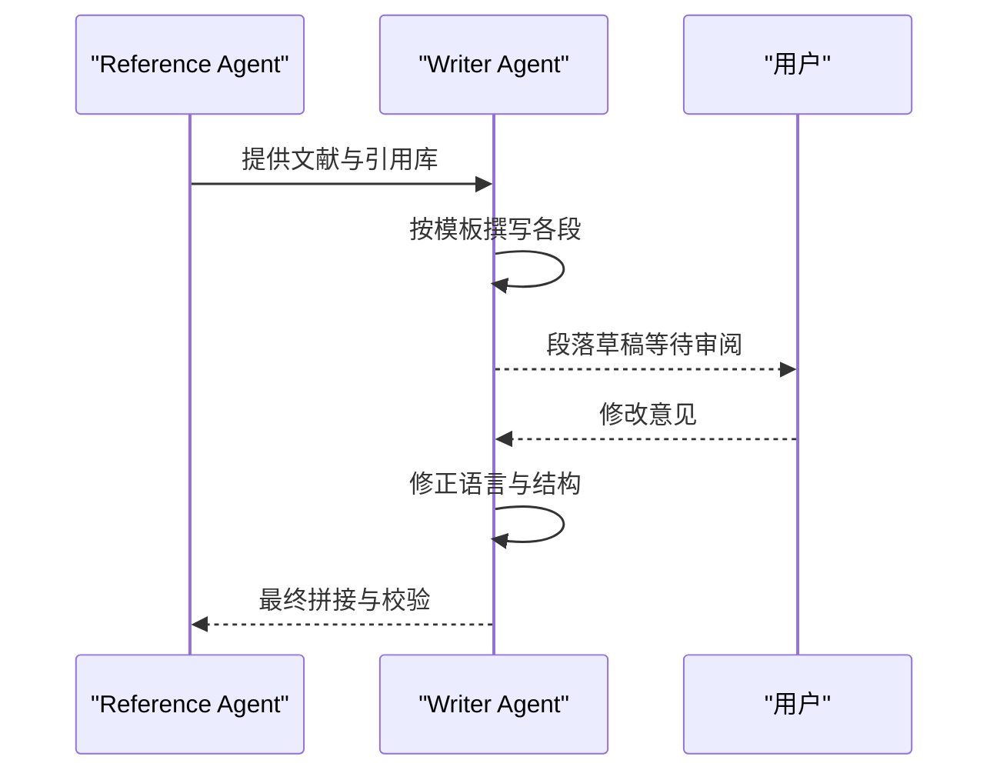

**图表来源**
- [agents/writer-agent.md:15-106](file://agents/writer-agent.md#L15-L106)
- [pipeline/workflows/writing.md:82-161](file://pipeline/workflows/writing.md#L82-L161)

**章节来源**
- [agents/writer-agent.md:1-166](file://agents/writer-agent.md#L1-L166)
- [pipeline/workflows/writing.md:1-330](file://pipeline/workflows/writing.md#L1-L330)

### Clinpub Planner（研究分析规划）
- 语言能力：无编程，专注规划
- 职责：分解分析阶段为可执行计划，构建依赖图，导出PLAN.md
- 工作流程：
  1) 读取项目配置与分析方法参考库
  2) 构建依赖图（波次顺序）
  3) 将每个计划拆分为2-3个任务（输入准备/核心分析/文档）
  4) 导出PLAN.md并写入must-haves与验证标准
- 输出产物：.clinpub/phases/XX-name/PLAN.md
- 关键规则：严格遵循波次结构与依赖顺序

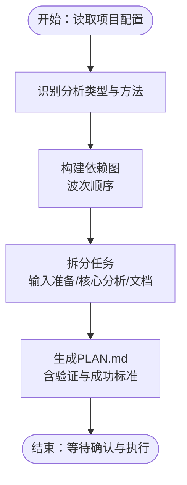

**图表来源**
- [agents/clinpub-planner.md:22-113](file://agents/clinpub-planner.md#L22-L113)
- [pipeline/references/analysis_methods.md:58-77](file://pipeline/references/analysis_methods.md#L58-L77)

**章节来源**
- [agents/clinpub-planner.md:1-131](file://agents/clinpub-planner.md#L1-L131)
- [pipeline/references/analysis_methods.md:1-311](file://pipeline/references/analysis_methods.md#L1-L311)

### Clinpub Executor（分析执行）
- 语言能力：R/Python脚本执行
- 职责：原子化执行PLAN.md，创建任务提交，处理偏差，生成SUMMARY.md
- 工作流程：
  1) 加载项目状态与PLAN.md
  2) 判断执行模式（自动/检查点/续跑）
  3) 逐任务执行：运行代码→验证输出→提交
  4) 生成SUMMARY.md并更新STATE.md
- 输出产物：SUMMARY.md、更新的STATE.md
- 关键规则：自动修复错误与数据问题；严格出版级标准

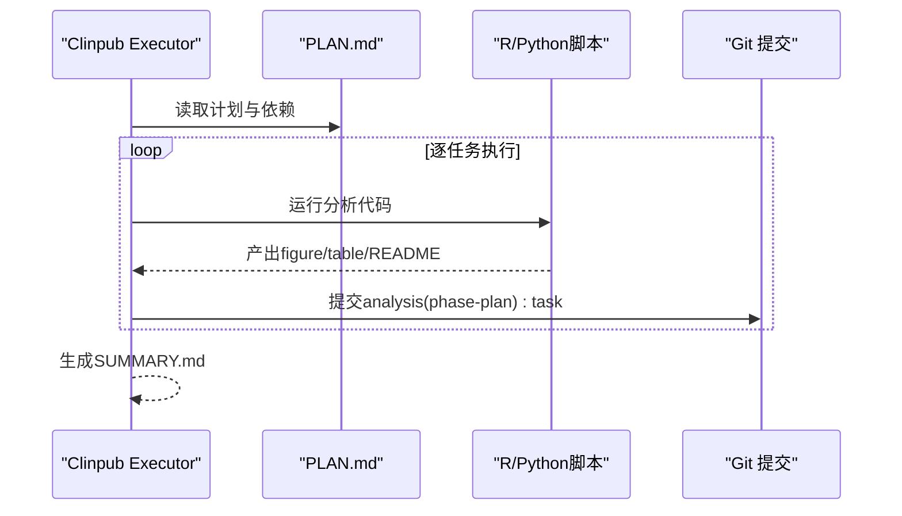

**图表来源**
- [agents/clinpub-executor.md:17-95](file://agents/clinpub-executor.md#L17-L95)

**章节来源**
- [agents/clinpub-executor.md:1-128](file://agents/clinpub-executor.md#L1-L128)

### Clinpub Verifier（跨阶段验证）
- 语言能力：无编程，专注验证
- 职责：按阶段应用15种验证模式，确保数据质量、统计有效性与论文完整性
- 工作流程：
  1) 阶段检测（根据STATE.md或目录内容）
  2) 应用相应验证模式（数据质量/统计/论文）
  3) 输出VERIFICATION.md并判定状态（passed/gaps_found/human_needed）
- 输出产物：.clinpub/phases/XX-name/XX-VERIFICATION.md
- 关键规则：不信任SUMMARY声明，必须核验实际输出文件

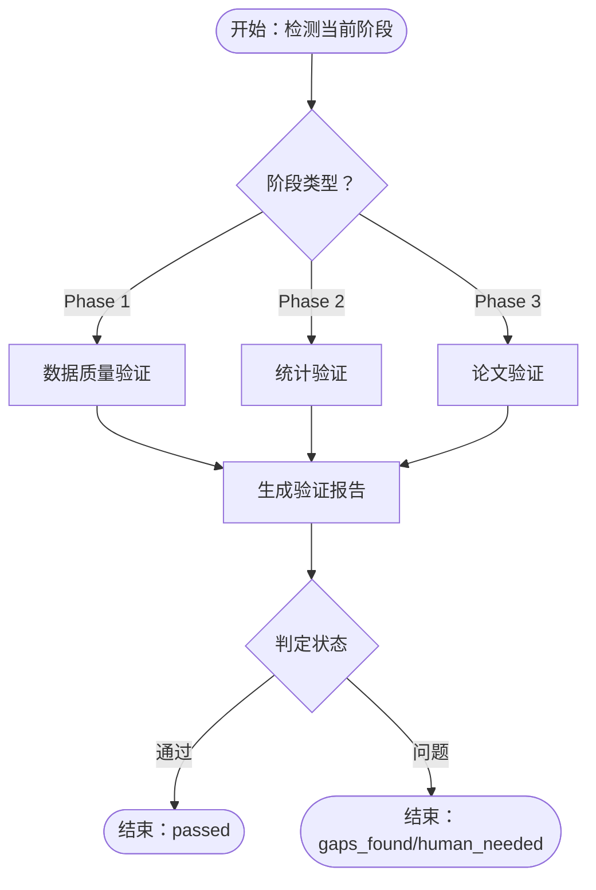

**图表来源**
- [agents/clinpub-verifier.md:33-311](file://agents/clinpub-verifier.md#L33-L311)

**章节来源**
- [agents/clinpub-verifier.md:1-439](file://agents/clinpub-verifier.md#L1-L439)

### Modify Agent（分析输出修改）
- 语言能力：R/Python脚本修改
- 职责：修改图表样式、变量与统计方法，追加新分析，并记录历史
- 工作流程：
  1) 加载现有分析计划与cleaned.csv
  2) 构建方法清单并定义修改范围
  3) 执行修改（样式/变量/方法/新增）
  4) 验证并更新PLAN.md修改历史
- 输出产物：更新的04_Outputs/与03_AnalysisMethods/，PLAN.md修改记录
- 关键规则：仅修改分析产物目录；最大5次修改；严格出版级标准

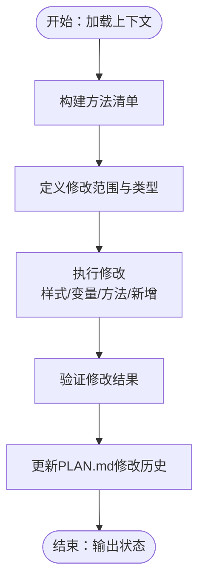

**图表来源**
- [agents/modify-agent.md:19-154](file://agents/modify-agent.md#L19-L154)

**章节来源**
- [agents/modify-agent.md:1-176](file://agents/modify-agent.md#L1-L176)

## 依赖分析
- 代理耦合与内聚：代理通过文件系统传递上下文，无共享内存，耦合度低；每个代理职责清晰，内聚度高
- 直接与间接依赖：
  - Analyst/Executor/Verifier依赖R/Python生态与主题规范（r_patterns.md）
  - Reference/Topic Miner依赖外部技能（ncbi-search、pdf-reader）
  - Writer依赖引用库与模板
- 外部依赖与集成点：PubMed（ncbi-search）、Unpaywall（开放获取）、pdf-reader（PDF解析）

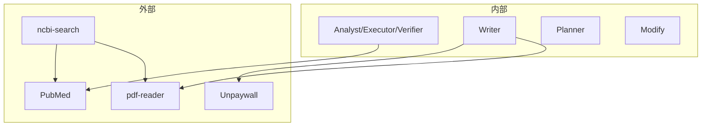

**图表来源**
- [agents/reference-agent.md:16-45](file://agents/reference-agent.md#L16-L45)
- [agents/writer-agent.md:17-51](file://agents/writer-agent.md#L17-L51)

**章节来源**
- [AGENTS.md:109-115](file://AGENTS.md#L109-L115)
- [docs/ARCHITECTURE.md:130-139](file://docs/ARCHITECTURE.md#L130-L139)

## 性能考量
- 代码独立性：每个R/Python脚本必须自包含，避免全局状态与跨文件隐式依赖，确保可重现与隔离
- 执行模式：Executor采用原子化任务提交，便于并行与回溯
- 验证效率：Verifier使用grep/file检查而非重跑分析，提升验证速度
- 图表标准：统一主题与分辨率，减少后期调整成本
- 依赖管理：严格版本与包管理，确保环境一致性

[本节为通用指导，无需特定文件引用]

## 故障排查指南
- 阶段顺序违规：Hooks阻止越阶段写文件。若出现权限或路径错误，请检查STATE.md与hooks配置
- 缺失DOI引用：Writer/Verifier要求每条引用必须有DOI。请通过Reference Agent重新检索或手动补充
- 图表分辨率不足：Verifier要求≥300 DPI。请在分析脚本中应用主题与分辨率标准
- 数据质量问题：Verifier Phase 1检查cleaned.csv完整性与数据类型。请回到Phase 1修正
- 统计假设未测试：Verifier要求报告正态性、方差齐性等假设检验。请在分析脚本中添加相应测试
- MANIFEST缺失：各阶段完成后需生成MANIFEST.yaml。请检查agents输出目录并补写

**章节来源**
- [AGENTS.md:37-44](file://AGENTS.md#L37-L44)
- [agents/clinpub-verifier.md:415-428](file://agents/clinpub-verifier.md#L415-L428)

## 结论
clinpub通过专业化代理与阶段化编排，实现了从数据准备到论文发表的自动化与标准化。代理间通过文件系统传递上下文，配合严格的验证与门控机制，确保结果的可重现性与出版级质量。系统支持扩展新的研究类型与Agent，具备良好的可维护性与演进空间。

[本节为总结性内容，无需特定文件引用]

## 附录

### 阶段化流程与产出
- Phase 0：init → 项目框架、目录结构、项目配置
- Phase 1：data-prep → cleaned.csv + 数据质量报告
- Phase 2：analysis → 动态分析方案（图+表+方法说明）
- Phase 3：writing → IMRAD各章节草稿
- Phase 4：review → 审稿意见+回复信+修订稿

**章节来源**
- [README.md:59-69](file://README.md#L59-L69)

### 质量门控
- IRB/Ethics Gate（Phase 0→1）：伦理批准、数据去标识化、知情同意
- Data Quality Gate（Phase 1→2）：cleaned.csv完整、缺失率受控、样本量充足
- Analysis Validity Gate（Phase 2→3）：方法已执行、效应量报告、假设检验
- Submission Gate（Phase 4→Submit）：IMRAD完整、图表≥300 DPI、引用全有DOI

**章节来源**
- [README.md:112-122](file://README.md#L112-L122)

### 扩展指南
- 添加新研究类型：在templates/study_types/添加模板，更新analysis_methods.md并在analyst-agent中添加方法
- 添加新Agent：在agents/创建角色卡片，更新相关Workflow的Agent引用，并在references/agent-contracts.md添加契约
- 性能优化：统一应用主题与分辨率标准，减少后期调整；使用原子化任务与清单管理，提升可追踪性

**章节来源**
- [docs/ARCHITECTURE.md:140-153](file://docs/ARCHITECTURE.md#L140-L153)