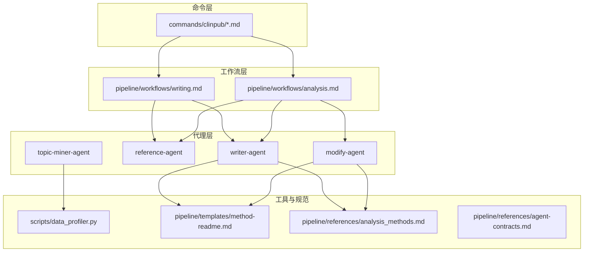
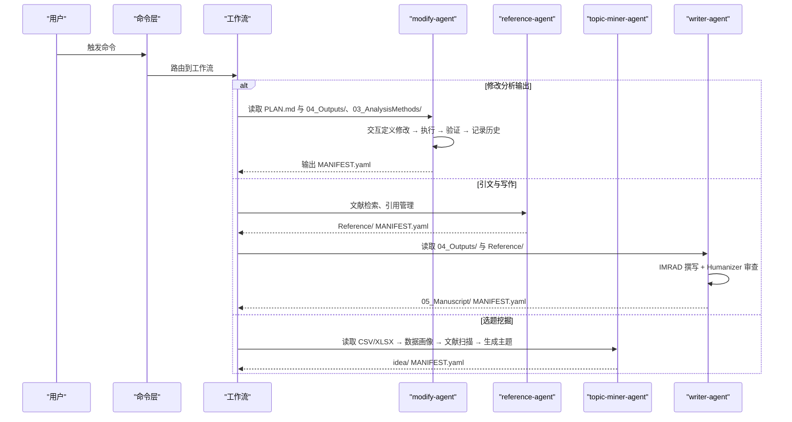
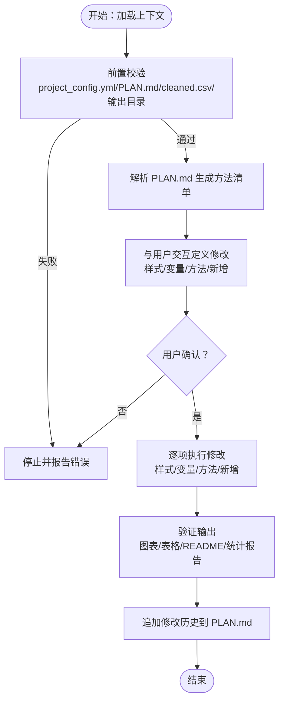
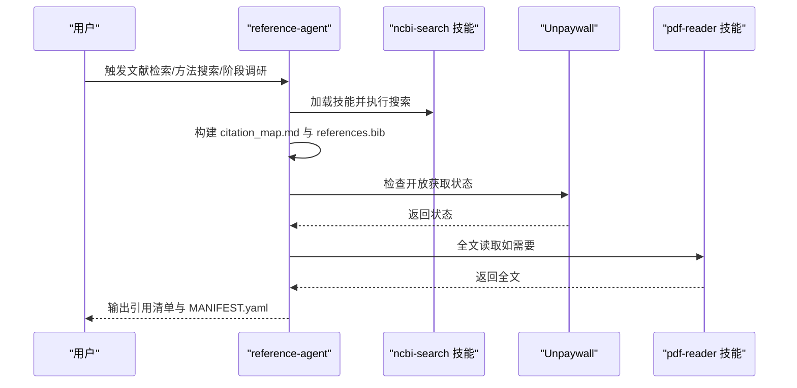
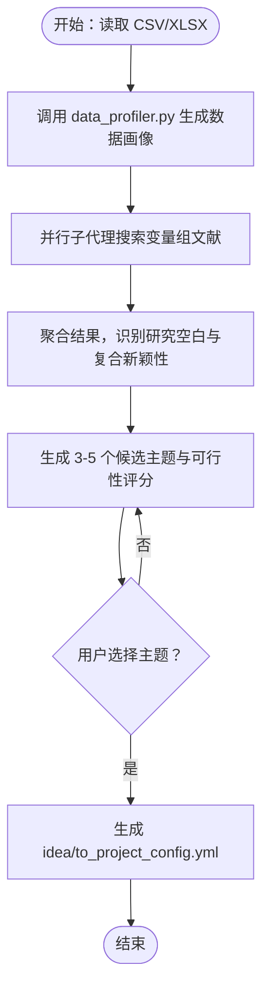
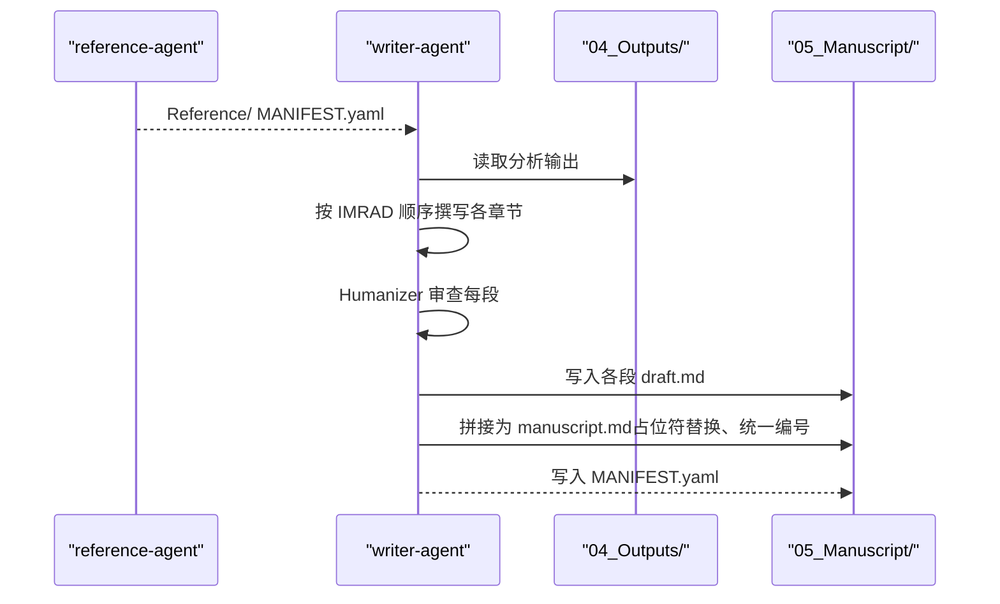
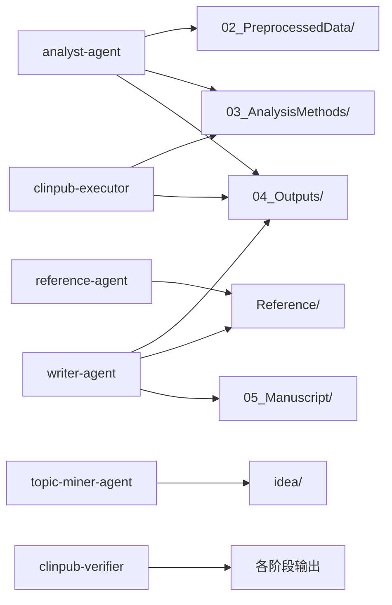

# 专业代理

<cite>
**本文引用的文件**   
- [modify-agent.md](file://agents/modify-agent.md)
- [reference-agent.md](file://agents/reference-agent.md)
- [topic-miner-agent.md](file://agents/topic-miner-agent.md)
- [writer-agent.md](file://agents/writer-agent.md)
- [ARCHITECTURE.md](file://docs/ARCHITECTURE.md)
- [CONFIGURATION.md](file://docs/CONFIGURATION.md)
- [AGENTS.md](file://AGENTS.md)
- [analysis_methods.md](file://pipeline/references/analysis_methods.md)
- [agent-contracts.md](file://pipeline/references/agent-contracts.md)
- [method-readme.md](file://pipeline/templates/method-readme.md)
- [analysis.md](file://pipeline/workflows/analysis.md)
- [writing.md](file://pipeline/workflows/writing.md)
- [data_profiler.py](file://scripts/data_profiler.py)
- [project_config.example.yml](file://examples/project_config.example.yml)
</cite>

## 目录
1. [简介](#简介)
2. [项目结构](#项目结构)
3. [核心组件](#核心组件)
4. [架构总览](#架构总览)
5. [详细组件分析](#详细组件分析)
6. [依赖分析](#依赖分析)
7. [性能考虑](#性能考虑)
8. [故障排查指南](#故障排查指南)
9. [结论](#结论)
10. [附录](#附录)

## 简介
本文件面向 clinpub 的“专业代理”体系，聚焦 modify-agent（修改代理）、reference-agent（参考代理）、topic-miner-agent（主题挖掘代理）与 writer-agent（写作者代理）四大核心角色。文档系统性阐述每个代理的职责边界、执行流程、数据与文件约定、质量标准与成功指标，并结合管线工作流说明它们如何协同完成从数据画像、方法规划、分析执行到论文撰写的全流程。同时提供配置选项、集成要点与实际应用案例，帮助用户高效利用代理能力。

## 项目结构
clinpub 采用三层架构：Commands（命令）→ Workflows（工作流）→ Agents（代理）。代理通过文件系统进行无耦合通信，每个代理负责单一职责并通过 MANIFEST.yaml 明确输出契约。核心目录与职责如下：
- commands/clinpub/*.md：用户命令入口，路由到相应工作流
- pipeline/workflows/*.md：阶段编排（init、data-prep、analysis、writing、review、milestone、data2idea）
- agents/*.md：专业化 AI 代理角色卡片（含 modify、reference、topic-miner、writer 等）
- scripts/*.py：工具脚本（如数据画像 data_profiler.py）
- hooks/*.js/*.sh：工作流保护钩子
- pipeline/templates/* 与 pipeline/references/*：模板与参考规范

**图表来源**
- [ARCHITECTURE.md: 45-104:45-104](file://docs/ARCHITECTURE.md#L45-L104)
- [AGENTS.md: 11-22:11-22](file://AGENTS.md#L11-L22)

**章节来源**
- [ARCHITECTURE.md: 1-160:1-160](file://docs/ARCHITECTURE.md#L1-L160)
- [AGENTS.md: 1-123:1-123](file://AGENTS.md#L1-L123)

## 核心组件
- modify-agent：负责分析输出的修改与验证，涵盖样式调整、变量替换、方法变更与新增分析方法，严格限定修改范围与质量标准。
- reference-agent：专注文献检索、引用管理与方法搜索，统一使用 ncbi-search 技能，输出结构化引用清单与格式化参考文献。
- topic-miner-agent：基于数据画像与文献扫描，生成候选主题与可行性评估，输出可直接用于启动项目的配置文件。
- writer-agent：按照研究类型模板与 IMRAD 结构撰写中文手稿，英文图表表格，强制执行 anti-AI 模板规则（Humanizer）。

**章节来源**
- [modify-agent.md: 1-176:1-176](file://agents/modify-agent.md#L1-L176)
- [reference-agent.md: 1-321:1-321](file://agents/reference-agent.md#L1-L321)
- [topic-miner-agent.md: 1-320:1-320](file://agents/topic-miner-agent.md#L1-L320)
- [writer-agent.md: 1-166:1-166](file://agents/writer-agent.md#L1-L166)

## 架构总览
代理协作遵循“文件系统契约 + MANIFEST 清单”的无共享内存模式。每个阶段的上游代理完成输出后，下游代理读取并校验清单，确保数据与引用的可追溯性与一致性。关键门控（IRB、数据质量、分析有效性、提交）贯穿阶段转换，保障质量。

**图表来源**
- [agent-contracts.md: 20-122:20-122](file://pipeline/references/agent-contracts.md#L20-L122)
- [writing.md: 69-161:69-161](file://pipeline/workflows/writing.md#L69-L161)
- [analysis.md: 187-235:187-235](file://pipeline/workflows/analysis.md#L187-L235)

**章节来源**
- [agent-contracts.md: 125-156:125-156](file://pipeline/references/agent-contracts.md#L125-L156)
- [writing.md: 1-330:1-330](file://pipeline/workflows/writing.md#L1-L330)
- [analysis.md: 1-289:1-289](file://pipeline/workflows/analysis.md#L1-L289)

## 详细组件分析

### modify-agent（修改代理）
- 角色定位：分析输出修改专家，负责在 03_AnalysisMethods/ 与 04_Outputs/ 目录范围内执行样式、变量与方法层面的修改，追加修改历史到 PLAN.md。
- 关键流程：
  - 加载上下文与前置校验（project_config.yml、分析计划、cleaned.csv、输出目录存在性）
  - 构建方法清单（从 PLAN.md 解析），与用户交互定义修改范围
  - 执行修改（样式/变量/方法/新增），失败重试与记录
  - 输出验证（图表分辨率、标签、统计报告完整性、脚本自包含）
  - 追加修改历史到 PLAN.md，并更新诊断文件
- 质量与规则：
  - 仅修改 03/04 目录，禁止改动 05_Manuscript/ 与 Reference/
  - 图表 ≥300 DPI、英文标签、统一主题；报告包含效应量、95%CI、精确 p 值
  - 每个 R/Python 脚本自包含，设置随机种子，最多一次会话 5 项修改
- 成功指标：
  - 修改范围明确、执行与验证通过、历史记录完整、无越界修改

**图表来源**
- [modify-agent.md: 19-154:19-154](file://agents/modify-agent.md#L19-L154)

**章节来源**
- [modify-agent.md: 1-176:1-176](file://agents/modify-agent.md#L1-L176)

### reference-agent（参考代理）
- 角色定位：文献检索与引用管理专家，统一使用 ncbi-search 技能进行 PubMed 搜索，输出结构化引用清单与 Vancouver 格式参考文献。
- 关键流程：
  - 检查 ncbi-search 技能可用性与 NCBI_API_KEY 环境变量
  - 文献检索（按阶段与策略：研究空白确认、写作前全面检索、章节写作期间补充检索、审稿阶段针对性检索）
  - 方法搜索（当用户提及未知统计方法时，自动搜索方法学文献并提供摘要/深入教程）
  - 阶段调研（Phase 前调研，双轨制：领域调研 Track A 与技术调研 Track B）
  - 全文获取（Unpaywall + pdf-reader 技能）
  - 输出：citation_map.md 与 references.bib，并写入 MANIFEST.yaml
- 质量与规则：
  - 每条引用必须有 DOI；未找到结果不编造
  - 控制输出深度（摘要级首轮，追问后展开）
  - 不修改 GSD 框架文件，只操作产品层文件

**图表来源**
- [reference-agent.md: 14-274:14-274](file://agents/reference-agent.md#L14-L274)

**章节来源**
- [reference-agent.md: 1-321:1-321](file://agents/reference-agent.md#L1-L321)

### topic-miner-agent（主题挖掘代理）
- 角色定位：基于患者级数据的选题挖掘顾问，不进行统计分析或论文写作，专注于数据驱动的主题发现与可行性评估。
- 关键流程：
  - 数据画像：调用 data_profiler.py 生成变量清单、分布摘要、缺失模式、相关性与研究类型预判
  - 文献扫描：并行子代理搜索每个变量组，识别研究空白与复合新颖性
  - 主题生成：综合数据画像与文献扫描，生成 3-5 个候选主题，包含可行性评分、变量映射、分析方法、目标期刊与风险提示
  - 配置生成：将选定主题映射为 project_config.yml，供后续 Phase 0 初始化使用
- 质量与规则：
  - 数据画像仅描述分布与组合，不臆造变量
  - 每个主题必须经 PubMed 初步扫描验证研究空白
  - 变量角色自动检测为建议，需用户确认
  - 生成的配置文件需用户审阅与确认

**图表来源**
- [topic-miner-agent.md: 19-294:19-294](file://agents/topic-miner-agent.md#L19-L294)
- [data_profiler.py: 1-353:1-353](file://scripts/data_profiler.py#L1-L353)

**章节来源**
- [topic-miner-agent.md: 1-320:1-320](file://agents/topic-miner-agent.md#L1-L320)
- [data_profiler.py: 1-353:1-353](file://scripts/data_profiler.py#L1-L353)

### writer-agent（写作者代理）
- 角色定位：IMRAD 手稿撰写专家，中文正文、英文图表表格，遵循研究类型模板与期刊标准，强制执行 anti-AI 模板规则（Humanizer）。
- 关键流程：
  - 上下文加载：读取 project_config.yml、04_Outputs/、Reference/ 与研究类型模板
  - 章节撰写：Methods → Results → Introduction → Discussion（按顺序）
  - 引用策略：与 reference-agent 协作，使用共享引用库进行去重与占位符交叉引用
  - 人类化审查：每段撰写前执行 Humanizer checklist，避免 AI 模板痕迹
  - 终稿拼接：按 Concatenation Protocol 合并段落、替换占位符、生成统一 References 区
  - 输出：05_Manuscript/ MANIFEST.yaml，声明 verifer 为消费者
- 质量与规则：
  - IMRAD 结构完整；所有引用有 DOI；图表/表格与文本一一对应
  - 中文正文、英文图表表格；STROBE/CONSORT 覆盖
  - 严禁编造引用或数据

**图表来源**
- [writer-agent.md: 15-108:15-108](file://agents/writer-agent.md#L15-L108)
- [writing.md: 69-260:69-260](file://pipeline/workflows/writing.md#L69-L260)

**章节来源**
- [writer-agent.md: 1-166:1-166](file://agents/writer-agent.md#L1-L166)
- [writing.md: 1-330:1-330](file://pipeline/workflows/writing.md#L1-L330)

## 依赖分析
- 代理间依赖与读写矩阵：
  - analyst-agent → 02_PreprocessedData/（写）、03_AnalysisMethods/（写）、04_Outputs/（写）
  - reference-agent → Reference/（写）
  - writer-agent → 04_Outputs/（读）、Reference/（读）、05_Manuscript/（写）
  - topic-miner-agent → idea/（写）
  - clinpub-executor → 03_AnalysisMethods/（读）、04_Outputs/（写）
  - clinpub-verifier → 所有阶段输出（读）
- 文件系统契约：
  - 代理间通信仅通过文件系统，每个输出目录仅允许单一作者代理
  - 每个代理在完成后写入 MANIFEST.yaml，下游代理消费前先校验清单

**图表来源**
- [agent-contracts.md: 140-156:140-156](file://pipeline/references/agent-contracts.md#L140-L156)

**章节来源**
- [agent-contracts.md: 125-156:125-156](file://pipeline/references/agent-contracts.md#L125-L156)

## 性能考虑
- 修改代理：
  - 限制单次会话最多 5 项修改，避免上下文溢出
  - R/Python 脚本失败最多尝试 3 次，失败项记录历史并继续
- 文献检索：
  - ncbi-search 技能自带速率限制；可通过 NCBI_API_KEY 提升（3→10 请求/秒）
  - 方法搜索与阶段调研采用摘要级首轮输出，按需展开深入层
- 数据画像与并行扫描：
  - data_profiler.py 对数值变量超过 30 个时仅发出相关性警告，避免大矩阵计算开销
  - topic-miner-agent 并行调度子代理，提高文献扫描覆盖率与效率

[本节为通用性能建议，不直接分析具体文件]

## 故障排查指南
- modify-agent
  - 症状：修改失败或输出不符合标准
  - 排查：检查 cleaned.csv 是否来自预处理阶段；确认脚本自包含、随机种子设置；核对 FIGURE_DPI、主题与统计报告完整性
  - 参考：[modify-agent.md: 156-176:156-176](file://agents/modify-agent.md#L156-L176)
- reference-agent
  - 症状：ncbi-search 技能不可用或搜索无结果
  - 排查：确认技能已安装；检查 NCBI_API_KEY；核对搜索关键词与过滤参数；确保每条引用有 DOI
  - 参考：[reference-agent.md: 16-45:16-45](file://agents/reference-agent.md#L16-L45)
- topic-miner-agent
  - 症状：变量角色自动检测与用户预期不符
  - 排查：确认 data_profiler.py 输出；在生成主题前进行用户确认；若变量模糊，生成配置文件中标注 TODO
  - 参考：[topic-miner-agent.md: 286-307:286-307](file://agents/topic-miner-agent.md#L286-L307)
- writer-agent
  - 症状：引用无 DOI、图表缺失、AI 模板痕迹
  - 排查：核对 Reference/ MANIFEST.yaml；确保 04_Outputs/ 中存在引用的图表/表格；执行 Humanizer checklist
  - 参考：[writer-agent.md: 149-166:149-166](file://agents/writer-agent.md#L149-L166)

**章节来源**
- [modify-agent.md: 156-176:156-176](file://agents/modify-agent.md#L156-L176)
- [reference-agent.md: 16-45:16-45](file://agents/reference-agent.md#L16-L45)
- [topic-miner-agent.md: 286-307:286-307](file://agents/topic-miner-agent.md#L286-L307)
- [writer-agent.md: 149-166:149-166](file://agents/writer-agent.md#L149-L166)

## 结论
modify-agent、reference-agent、topic-miner-agent 与 writer-agent 四位专业代理分别承担“修改与验证”、“文献与引用”、“选题与配置”、“撰写与拼接”的关键职责。它们通过严格的文件系统契约、MANIFEST 清单与质量门控，确保从数据画像到论文发表的全流程自动化与可追溯。配合工作流与参考规范，用户可高效地完成复杂学术任务，获得智能化、高质量的科研产出。

[本节为总结性内容，不直接分析具体文件]

## 附录

### 配置选项与集成要点
- 项目配置（project_config.yml）
  - 基本信息：研究标题、类型、目标期刊、报告标准
  - 变量映射：ID、结局、暴露、时间、协变量等
  - 路径与分析：数据路径、显著性水平、多重比较校正、图表配置
  - 示例：参见 [project_config.example.yml:1-68](file://examples/project_config.example.yml#L1-L68)
- 环境与外部技能
  - R 与 Python 包需求、版本要求与安装建议
  - Claude Code Hooks 注册与验证
  - 外部技能：ncbi-search、pdf-reader、tavily
- 分析方法参考
  - 方法选择决策树、场景参考库与依赖顺序
  - 方法说明模板（中文）与输出规范

**章节来源**
- [CONFIGURATION.md: 1-270:1-270](file://docs/CONFIGURATION.md#L1-L270)
- [analysis_methods.md: 1-311:1-311](file://pipeline/references/analysis_methods.md#L1-L311)
- [method-readme.md: 1-38:1-38](file://pipeline/templates/method-readme.md#L1-L38)

### 实际应用案例
- 选题挖掘（data2idea）
  - 输入：CSV/XLSX 患者级数据
  - 流程：数据画像 → 文献扫描 → 候选主题 → 生成 project_config.yml
  - 输出：idea/to_project_config.yml（用户确认后重命名为 project_config.yml）
  - 参考：[topic-miner-agent.md: 19-294:19-294](file://agents/topic-miner-agent.md#L19-L294)
- 修改分析输出（modify）
  - 输入：04_Outputs/ 与 03_AnalysisMethods/、PLAN.md、cleaned.csv
  - 流程：交互定义修改 → 执行 → 验证 → 历史记录
  - 输出：更新后的图表/表格/README 与 PLAN.md
  - 参考：[modify-agent.md: 19-154:19-154](file://agents/modify-agent.md#L19-L154)
- 引文与写作（writing）
  - 输入：04_Outputs/、Reference/、研究类型模板
  - 流程：引用策略讨论 → 文献预搜索 → IMRAD 逐段撰写 → Humanizer 审查 → 终稿拼接
  - 输出：05_Manuscript/ 完整终稿与 MANIFEST.yaml
  - 参考：[writing.md: 69-304:69-304](file://pipeline/workflows/writing.md#L69-L304)

**章节来源**
- [topic-miner-agent.md: 19-294:19-294](file://agents/topic-miner-agent.md#L19-L294)
- [modify-agent.md: 19-154:19-154](file://agents/modify-agent.md#L19-L154)
- [writing.md: 69-304:69-304](file://pipeline/workflows/writing.md#L69-L304)