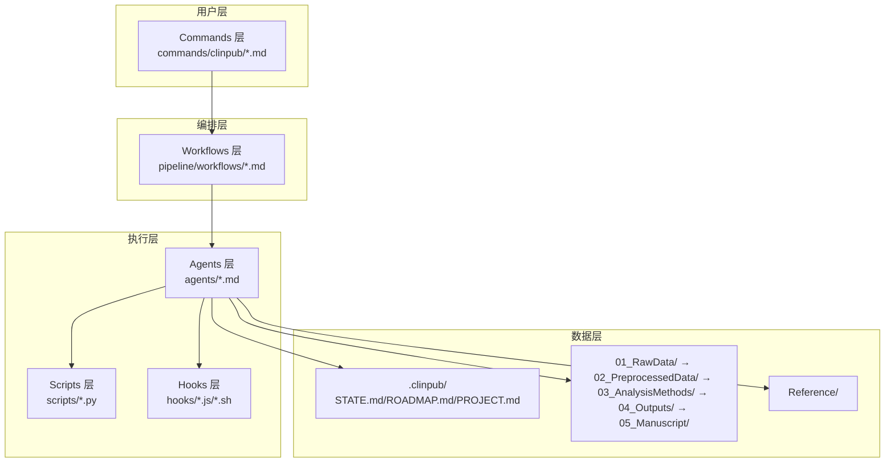
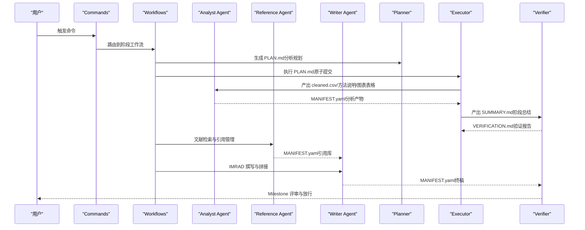
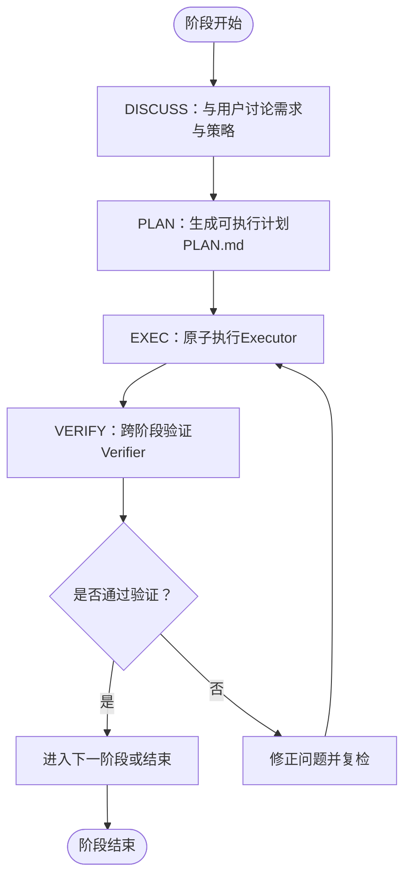
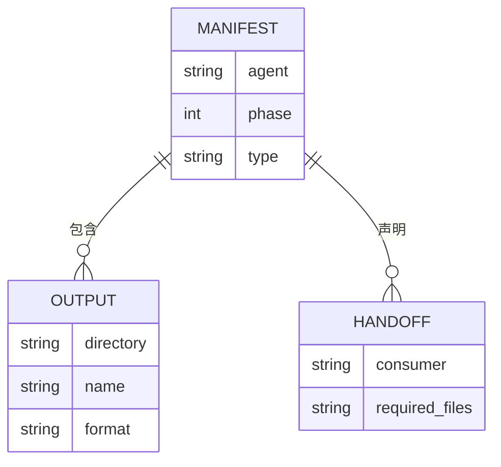
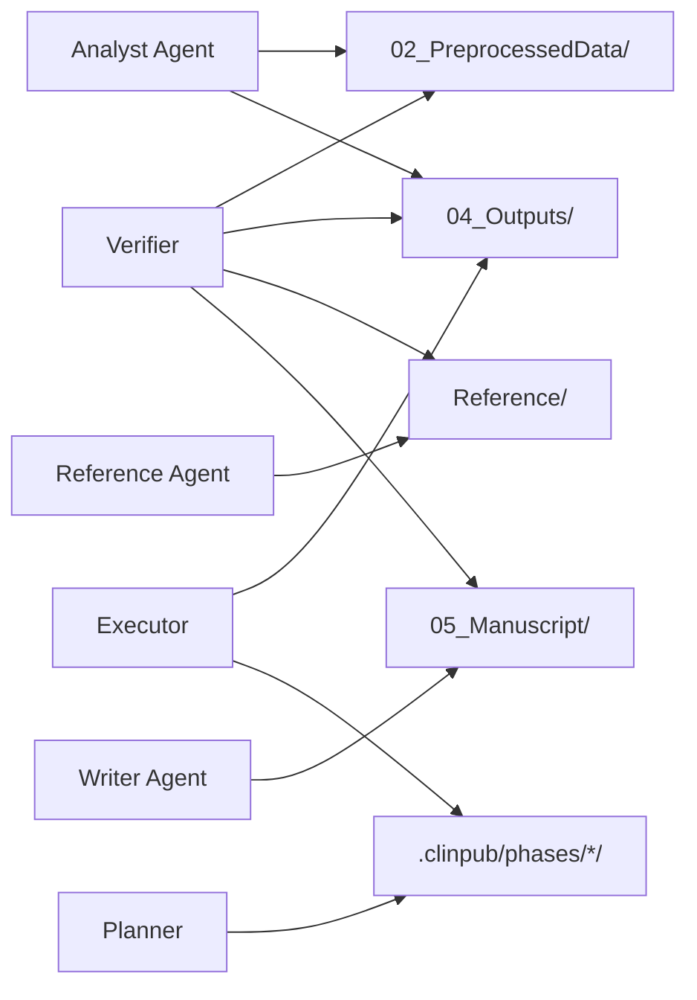
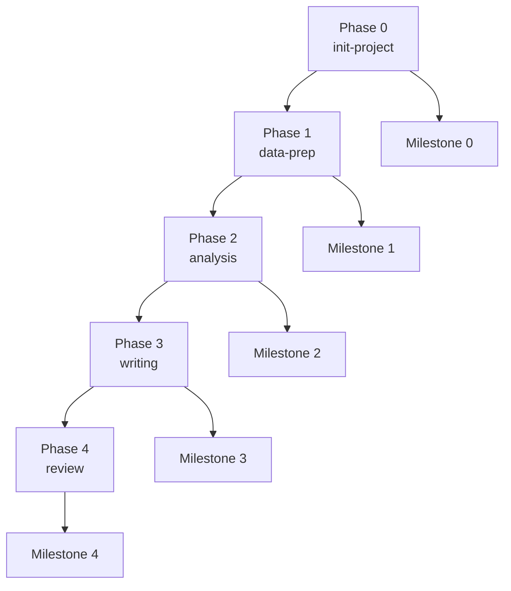

# 代理协作机制

<cite>
**本文档引用的文件**
- [README.md](file://README.md)
- [AGENTS.md](file://AGENTS.md)
- [docs/ARCHITECTURE.md](file://docs/ARCHITECTURE.md)
- [docs/CONFIGURATION.md](file://docs/CONFIGURATION.md)
- [pipeline/workflows/analysis.md](file://pipeline/workflows/analysis.md)
- [pipeline/workflows/data-prep.md](file://pipeline/workflows/data-prep.md)
- [pipeline/workflows/writing.md](file://pipeline/workflows/writing.md)
- [pipeline/workflows/init-project.md](file://pipeline/workflows/init-project.md)
- [pipeline/workflows/milestone.md](file://pipeline/workflows/milestone.md)
- [agents/topic-miner-agent.md](file://agents/topic-miner-agent.md)
- [agents/analyst-agent.md](file://agents/analyst-agent.md)
- [agents/reference-agent.md](file://agents/reference-agent.md)
- [agents/writer-agent.md](file://agents/writer-agent.md)
- [agents/clinpub-planner.md](file://agents/clinpub-planner.md)
- [agents/clinpub-executor.md](file://agents/clinpub-executor.md)
- [agents/clinpub-verifier.md](file://agents/clinpub-verifier.md)
- [agents/modify-agent.md](file://agents/modify-agent.md)
- [pipeline/references/agent-contracts.md](file://pipeline/references/agent-contracts.md)
- [pipeline/references/manifest-format.md](file://pipeline/references/manifest-format.md)
- [hooks/clinpub-workflow-guard.js](file://hooks/clinpub-workflow-guard.js)
</cite>

## 目录
1. [引言](#引言)
2. [项目结构](#项目结构)
3. [核心组件](#核心组件)
4. [架构总览](#架构总览)
5. [详细组件分析](#详细组件分析)
6. [依赖分析](#依赖分析)
7. [性能考虑](#性能考虑)
8. [故障排查指南](#故障排查指南)
9. [结论](#结论)
10. [附录](#附录)

## 引言
本文件系统性阐述 clinpub 的代理协作机制，围绕五阶段工作流（init → data-prep → analysis → writing → review）中八个 AI 代理的职责边界、上下文传递、任务分配与执行策略展开。重点解析代理间通过文件系统进行的“无共享内存”协作模式，以及通过 MANIFEST.yaml、里程碑（Milestone）与 Hooks 的质量门控与阶段强制机制。文档同时提供协作最佳实践、故障处理策略与性能优化建议，并给出复杂科学任务中的协作案例研究。

## 项目结构
clinpub 采用三层架构：Commands（用户命令）→ Workflows（阶段编排）→ Agents（专业化代理）。代理通过独立角色卡片定义职责、输入输出与工具权限，所有变量与脚本均要求自包含、无跨文件隐式依赖，确保代理隔离与可重复性。

**图表来源**
- [docs/ARCHITECTURE.md: 45-160:45-160](file://docs/ARCHITECTURE.md#L45-L160)
- [AGENTS.md: 9-22:9-22](file://AGENTS.md#L9-L22)

**章节来源**
- [README.md: 20-45:20-45](file://README.md#L20-L45)
- [docs/ARCHITECTURE.md: 7-43:7-43](file://docs/ARCHITECTURE.md#L7-L43)

## 核心组件
- 主持者与编排者：Commands 与 Workflows
  - Commands 提供用户入口（/clinpub、/clinpub-init-project 等），Workflows 定义阶段四步法（DISCUSS → PLAN → EXECUTE → VERIFY）与里程碑评审。
- 七位专业代理（八代理协作体系）
  - Topic Miner Agent：数据画像与文献扫描，生成候选主题与项目配置草稿。
  - Analyst Agent：数据清洗、统计分析、图表表格生成。
  - Reference Agent：文献检索、PDF 全文读取、引用管理。
  - Writer Agent：IMRAD 撰写、图表整合、模拟审稿。
  - Clinpub Planner：研究分析规划，生成可执行 PLAN.md。
  - Clinpub Executor：原子提交执行 PLAN.md，生成 SUMMARY.md。
  - Clinpub Verifier：跨阶段验证（数据质量、统计、手稿），15 种验证模式。
  - Modify Agent：分析输出修改与新增方法，维护 PLAN.md 修改历史。
- 质量门控与阶段强制
  - Hooks 保障阶段顺序与目录访问控制；Milestone 评审确保阶段成功标准达成。

**章节来源**
- [README.md: 47-81:47-81](file://README.md#L47-L81)
- [AGENTS.md: 58-84:58-84](file://AGENTS.md#L58-L84)
- [docs/ARCHITECTURE.md: 67-87:67-87](file://docs/ARCHITECTURE.md#L67-L87)

## 架构总览
代理协作遵循“文件系统即总线”的无共享内存模式。每个代理在自身阶段内读取上游 MANIFEST.yaml，校验所需产物后消费；完成后写入自己的 MANIFEST.yaml，供下游代理验证。阶段间通过 Milestone 与 Hooks 强制顺序与质量门槛。

**图表来源**
- [pipeline/workflows/analysis.md: 17-253:17-253](file://pipeline/workflows/analysis.md#L17-L253)
- [pipeline/workflows/writing.md: 23-306:23-306](file://pipeline/workflows/writing.md#L23-L306)
- [agents/clinpub-planner.md: 22-113:22-113](file://agents/clinpub-planner.md#L22-L113)
- [agents/clinpub-executor.md: 17-68:17-68](file://agents/clinpub-executor.md#L17-L68)
- [agents/clinpub-verifier.md: 33-311:33-311](file://agents/clinpub-verifier.md#L33-L311)

## 详细组件分析

### 代理协作模式与任务分配
- 任务分解与依赖
  - Analyst Agent 在 Phase 1 产出 cleaned.csv 与数据质量报告；在 Phase 2 基于用户确认的 PLAN.md 动态分解为多波次（Wave）执行，每波内方法可并行，波间严格顺序。
  - Clinpub Planner 将用户确认的方法清单转化为可执行 PLAN.md，构建依赖图与任务清单；Clinpub Executor 逐任务原子提交，遇到检查点暂停等待用户决策。
- 上下文传递与数据共享
  - 代理间通过文件系统传递，不共享内存。每个阶段产物目录仅允许单一作者代理写入，下游代理通过 MANIFEST.yaml 验证产物完整性与质量。
  - 代理独立运行，脚本自包含，避免跨文件隐式依赖。
- 质量控制
  - Clinpub Verifier 以“假设分析错误直到证据证明正确”的对抗式思维，对 Phase 1（数据质量）、Phase 2（统计有效性）、Phase 3（手稿完整性）分别应用 15 种验证模式，输出 VERIFICATION.md。
  - Milestone 流程在阶段结束时收集决策、核验成功标准、生成里程碑报告并更新 ROADMAP/STATE。

**图表来源**
- [pipeline/workflows/analysis.md: 17-253:17-253](file://pipeline/workflows/analysis.md#L17-L253)
- [pipeline/workflows/writing.md: 23-306:23-306](file://pipeline/workflows/writing.md#L23-L306)
- [pipeline/workflows/milestone.md: 15-154:15-154](file://pipeline/workflows/milestone.md#L15-L154)

**章节来源**
- [pipeline/workflows/analysis.md: 66-222:66-222](file://pipeline/workflows/analysis.md#L66-L222)
- [pipeline/workflows/writing.md: 69-196:69-196](file://pipeline/workflows/writing.md#L69-L196)
- [agents/clinpub-planner.md: 46-111:46-111](file://agents/clinpub-planner.md#L46-L111)
- [agents/clinpub-executor.md: 48-66:48-66](file://agents/clinpub-executor.md#L48-L66)
- [agents/clinpub-verifier.md: 33-311:33-311](file://agents/clinpub-verifier.md#L33-L311)

### 代理间通信协议与依赖关系
- 通信协议
  - 文件系统契约：每个代理在完成输出后写入 MANIFEST.yaml，声明生产者、类型、产物清单与下游消费者，下游代理在消费前读取并校验。
  - 读写矩阵：明确各代理对目录的读写权限，避免多代理并发写同一目录。
- 依赖关系
  - 数据依赖：cleaned.csv 为 Phase 2 的唯一数据源；Reference/ 与 04_Outputs/ 为 Phase 3 的输入。
  - 阶段依赖：Phase 0 → 1 → 2 → 3 → 4，阶段间通过 Milestone 与 Hooks 强制顺序。
  - 任务依赖：PLAN.md 明确方法间依赖（如多变量模型依赖单变量分析结果），Executor 严格按依赖顺序执行。

**图表来源**
- [pipeline/references/manifest-format.md: 13-47:13-47](file://pipeline/references/manifest-format.md#L13-L47)

**章节来源**
- [pipeline/references/agent-contracts.md: 125-156:125-156](file://pipeline/references/agent-contracts.md#L125-L156)
- [pipeline/references/manifest-format.md: 149-187:149-187](file://pipeline/references/manifest-format.md#L149-L187)

### Topic Miner Agent：选题挖掘与项目配置生成
- 执行流程
  - 数据画像：读取 CSV/XLSX，生成变量字典、缺失模式、相关性矩阵与变量角色预测。
  - 文献扫描：并行子代理搜索 PubMed，识别研究空白与复合新颖性。
  - 主题生成：综合画像与扫描结果生成 3-5 个候选主题，包含变量映射、推荐方法与目标期刊。
  - 配置生成：输出 to_project_config.yml，供用户确认后重命名为 project_config.yml 启动 Phase 0。
- 关键规则
  - 严禁统计分析或手稿写作；变量角色自动识别需用户确认；必须验证 ncbi-search 技能可用。

**章节来源**
- [agents/topic-miner-agent.md: 19-320:19-320](file://agents/topic-miner-agent.md#L19-L320)

### Analyst Agent：数据清洗与统计分析
- 执行流程
  - Phase 1：缺失值分级处理（<5% 删除/填充、5-20% MICE、>20% 用户确认）、异常值检测、派生变量与编码、训练/验证分割、数据质量报告。
  - Phase 2：按 PLAN.md 执行方法，生成 figure + table + 方法说明，应用 publication-grade 标准（分辨率、字体、配色、尺寸、主题）。
- 关键规则
  - 每个方法必须输出 figure + table + 方法说明；代码自包含、独立可重现；报告效应量 + 95%CI + 精确 p 值；多重比较校正；目录编号按用户确认顺序。

**章节来源**
- [agents/analyst-agent.md: 17-141:17-141](file://agents/analyst-agent.md#L17-L141)
- [pipeline/workflows/data-prep.md: 100-145:100-145](file://pipeline/workflows/data-prep.md#L100-L145)

### Reference Agent：文献检索与引用管理
- 执行流程
  - 技能可用性检查：确保 ncbi-search 技能存在；可选 NCBI_API_KEY 提升速率。
  - 文献搜索：按阶段与策略过滤（年份、IF、文章类型），获取 DOI；必要时使用 pdf-reader 与 Unpaywall 获取全文。
  - 引用管理：生成 Vancouver 格式 references.bib 与 citation_map.md，写入 MANIFEST.yaml。
  - 方法搜索：当用户询问未知统计方法时，提供摘要级与深入层教程。
- 关键规则
  - 每条引用必须有 DOI；禁止伪造；首轮输出摘要级，追问后展开。

**章节来源**
- [agents/reference-agent.md: 14-321:14-321](file://agents/reference-agent.md#L14-L321)

### Writer Agent：IMRAD 撰写与拼接
- 执行流程
  - 上下文加载：读取 project_config.yml、04_Outputs/、Reference/ 与 study_types 模板，校验 MANIFEST.yaml。
  - 章节撰写：按 IMRAD 顺序（Introduction → Methods → Results → Discussion）逐段撰写，使用占位符进行交叉引用。
  - 人类化审查：应用 Humanizer 规则，避免 AI 模板痕迹。
  - 终稿拼接：按协议合并段落、替换占位符、统一引用编号、生成 frontmatter。
- 关键规则
  - 中文正文、英文图表；IMRAD 结构完整；无 AI 模板模式；引用去重且有 DOI。

**章节来源**
- [agents/writer-agent.md: 15-166:15-166](file://agents/writer-agent.md#L15-L166)
- [pipeline/workflows/writing.md: 69-306:69-306](file://pipeline/workflows/writing.md#L69-L306)

### Clinpub Planner：分析规划与依赖建模
- 执行流程
  - 读取项目状态与 ROADMAP，加载 analysis_methods.md 与 r_patterns.md。
  - 构建依赖图：基于方法类型与变量选择确定波次与并行度。
  - 任务拆分：输入准备、核心分析、文档生成，每任务指定文件、动作、验证与完成标准。
  - 必要产物：列出可验证的输出文件与链接，确保与手稿引用一致。
- 关键规则
  - PLAN.md 必须遵循波次结构；任务不超过 3 个；必须引用 r_patterns.md。

**章节来源**
- [agents/clinpub-planner.md: 22-131:22-131](file://agents/clinpub-planner.md#L22-L131)

### Clinpub Executor：原子执行与偏差处理
- 执行流程
  - 读取 PLAN.md 与 cleaned.csv，检查依赖满足情况。
  - 执行模式：完全自动化、带检查点（决策/人工验证）与续跑。
  - 偏差处理：自动修复代码错误、数据问题、缺失输出；方法变更需创建检查点。
  - 总结报告：生成 SUMMARY.md，记录任务哈希、偏差与已知问题。
- 关键规则
  - 每任务独立提交；随机种子设置；严格 publication-grade 标准；脚本自包含。

**章节来源**
- [agents/clinpub-executor.md: 17-128:17-128](file://agents/clinpub-executor.md#L17-L128)

### Clinpub Verifier：跨阶段验证与对抗式审查
- 执行流程
  - 阶段检测：从 STATE.md 或目录内容推断当前阶段。
  - 验证模式：Phase 1（数据质量）、Phase 2（统计有效性）、Phase 3（手稿完整性）分别应用相应模式。
  - 抗式审查：不信任 SUMMARY.claims，实际读取输出文件；交叉比对 figure 与 table；检查假设检验与可重现性。
  - 报告输出：VERIFICATION.md，分类为 passed/gaps_found/human_needed。
- 关键规则
  - 每张图 ≥300 DPI；交叉比对数值；假设检验必须测试；引用必须有 DOI；AI 模板模式检测。

**章节来源**
- [agents/clinpub-verifier.md: 33-439:33-439](file://agents/clinpub-verifier.md#L33-L439)

### Modify Agent：输出修改与新增分析
- 执行流程
  - 上下文加载：读取 project_config.yml、01-PLAN.md、cleaned.csv 与现有方法清单。
  - 修改定义：用户选择方法与修改类型（style/variable/method/new），输出结构化摘要并等待确认。
  - 执行与验证：逐项修改并验证输出；失败最多尝试 3 次；记录失败项。
  - 历史更新：将修改记录追加到 PLAN.md，必要时更新诊断记录。
- 关键规则
  - 仅修改 03/04 目录；最大 5 次修改；严格 publication-grade 标准；脚本自包含。

**章节来源**
- [agents/modify-agent.md: 19-176:19-176](file://agents/modify-agent.md#L19-L176)

## 依赖分析
- 组件耦合与内聚
  - 代理内聚高：各自职责清晰，输入输出明确；跨阶段耦合通过 MANIFEST.yaml 与 Milestone 解耦。
  - 外部依赖：R/Python 包、Claude Code 技能（ncbi-search、pdf-reader、tavily）。
- 阶段强制与目录访问
  - Hooks 通过读取 STATE.md 与目录归属，阻止越阶段写入；Always-Accessible 目录用于基础设施与共享资源。
- 代理读写矩阵
  - 每个输出目录仅允许单一作者代理写入，避免竞态与隐式依赖。

**图表来源**
- [pipeline/references/agent-contracts.md: 140-156:140-156](file://pipeline/references/agent-contracts.md#L140-L156)
- [hooks/clinpub-workflow-guard.js: 16-77:16-77](file://hooks/clinpub-workflow-guard.js#L16-L77)

**章节来源**
- [pipeline/references/agent-contracts.md: 125-156:125-156](file://pipeline/references/agent-contracts.md#L125-L156)
- [hooks/clinpub-workflow-guard.js: 1-134:1-134](file://hooks/clinpub-workflow-guard.js#L1-L134)

## 性能考虑
- 代理并行化
  - Phase 2 波次内方法可并行执行，减少总耗时；Executor 在任务间最小化等待，优先处理可并行任务。
- I/O 与缓存
  - MANIFEST.yaml 作为轻量契约，避免下游代理重复扫描与类型检查；引用库与数据质量报告可复用。
- 脚本自包含
  - R/Python 脚本无全局状态与跨文件隐式依赖，便于并行与重试；失败自动修复与重试上限控制风险扩散。
- Hooks 与 Milestone
  - Hooks 防止无效写入与越阶操作，减少回滚成本；Milestone 早期发现缺口，降低后期返工。

[本节为通用指导，无需特定文件分析]

## 故障排查指南
- 阶段越界与目录访问
  - 现象：尝试写入未来阶段目录被阻断。
  - 处理：完成当前阶段 Milestone 并获得签名；检查 STATE.md 格式与正则匹配。
- MANIFEST.yaml 缺失或不匹配
  - 现象：下游代理拒绝消费，提示缺少文件或质量不达标。
  - 处理：检查 producing agent 是否正确写出 MANIFEST.yaml；核对 required_files 与 required_quality 条件。
- 文献检索失败
  - 现象：ncbi-search 技能不可用或搜索无结果。
  - 处理：安装 ncbi-search 技能；检查 NCBI_API_KEY；必要时改用其他检索入口。
- 统计分析失败
  - 现象：脚本报错、输出缺失、假设检验未执行。
  - 处理：Executor 自动修复与重试；若失败，创建检查点并人工介入；Verifier 对比 figure 与 table 数值一致性。
- 手稿拼接问题
  - 现象：占位符未替换、引用编号混乱、图表缺失。
  - 处理：确认占位符替换协议；检查 references.bib 与 reference_library.json；确保所有引用有 DOI。

**章节来源**
- [hooks/clinpub-workflow-guard.js: 25-77:25-77](file://hooks/clinpub-workflow-guard.js#L25-L77)
- [pipeline/references/manifest-format.md: 149-187:149-187](file://pipeline/references/manifest-format.md#L149-L187)
- [agents/reference-agent.md: 16-45:16-45](file://agents/reference-agent.md#L16-L45)
- [agents/clinpub-executor.md: 70-86:70-86](file://agents/clinpub-executor.md#L70-L86)
- [agents/clinpub-verifier.md: 415-428:415-428](file://agents/clinpub-verifier.md#L415-L428)
- [pipeline/workflows/writing.md: 198-277:198-277](file://pipeline/workflows/writing.md#L198-L277)

## 结论
clinpub 的代理协作机制以“文件系统即总线”为核心，通过 MANIFEST.yaml、Milestone 与 Hooks 形成强约束的质量门控与阶段强制。八个代理在五阶段工作流中各司其职：从选题挖掘、数据清洗、统计分析、文献管理到手稿撰写与审稿模拟，形成闭环。该设计确保了代理隔离、可重复性与可审计性，适合复杂科学任务的规模化协作与持续优化。

[本节为总结，无需特定文件分析]

## 附录

### 五阶段协作流程图

**图表来源**
- [docs/ARCHITECTURE.md: 57-65:57-65](file://docs/ARCHITECTURE.md#L57-L65)
- [pipeline/workflows/milestone.md: 32-40:32-40](file://pipeline/workflows/milestone.md#L32-L40)

### 代理协作最佳实践
- 任务分解
  - Phase 2 采用波次结构，先描述性分析，再逐步引入复杂模型；波内方法并行，波间严格顺序。
- 上下文传递
  - 严格使用 MANIFEST.yaml；下游代理在消费前验证 required_files 与 required_quality。
- 质量控制
  - 每阶段 Milestone 前进行阶段性验证；Phase 2/3 使用 Verifier 的 15 种验证模式；Humanizer 规则贯穿撰写过程。
- 故障处理
  - Executor 自动修复与重试；无法解决的问题创建检查点；Verifier 对比实际输出与 CLAIMS。
- 性能优化
  - 并行执行可并行任务；脚本自包含减少隐式依赖；Hooks 防止无效写入。

[本节为通用指导，无需特定文件分析]