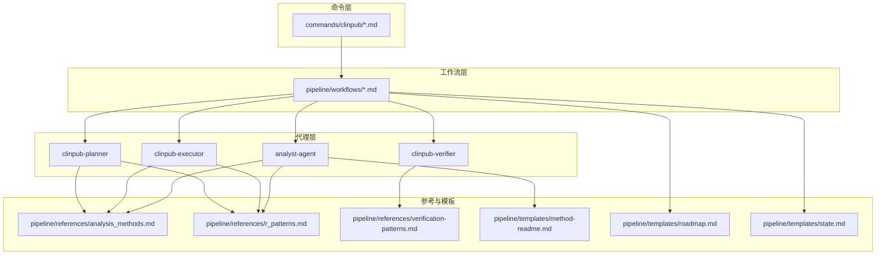
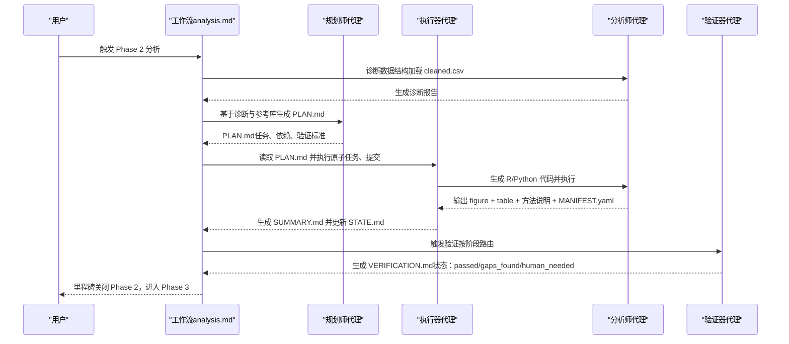
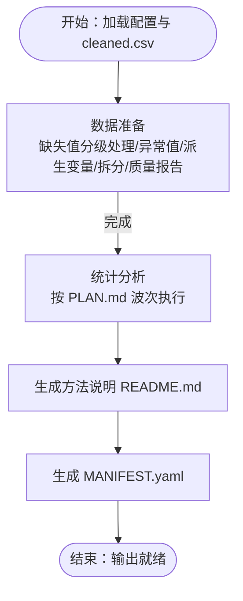
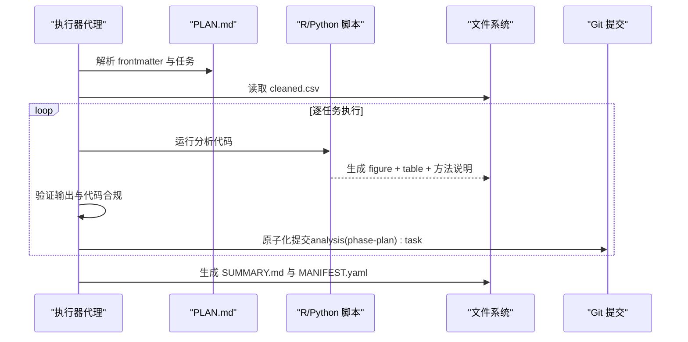
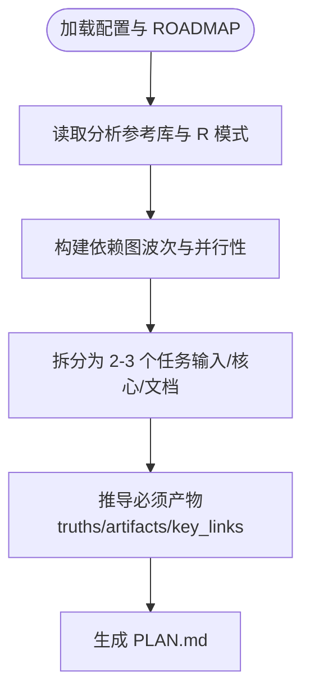
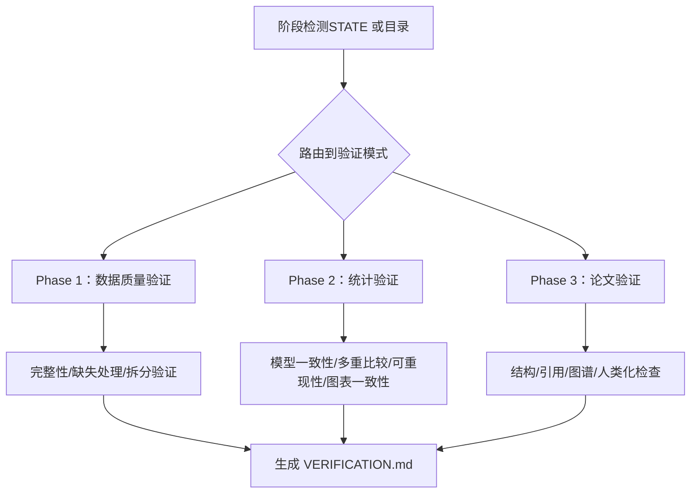

# 核心代理

<cite>
**本文引用的文件**
- [analyst-agent.md](file://agents/analyst-agent.md)
- [clinpub-executor.md](file://agents/clinpub-executor.md)
- [clinpub-planner.md](file://agents/clinpub-planner.md)
- [clinpub-verifier.md](file://agents/clinpub-verifier.md)
- [AGENTS.md](file://AGENTS.md)
- [analysis_methods.md](file://pipeline/references/analysis_methods.md)
- [r_patterns.md](file://pipeline/references/r_patterns.md)
- [verification-patterns.md](file://pipeline/references/verification-patterns.md)
- [gates.md](file://pipeline/references/gates.md)
- [analysis.md](file://pipeline/workflows/analysis.md)
- [method-readme.md](file://pipeline/templates/method-readme.md)
- [roadmap.md](file://pipeline/templates/roadmap.md)
- [state.md](file://pipeline/templates/state.md)
- [ARCHITECTURE.md](file://docs/ARCHITECTURE.md)
</cite>

## 目录
1. [引言](#引言)
2. [项目结构](#项目结构)
3. [核心组件](#核心组件)
4. [架构总览](#架构总览)
5. [详细组件分析](#详细组件分析)
6. [依赖分析](#依赖分析)
7. [性能考量](#性能考量)
8. [故障排查指南](#故障排查指南)
9. [结论](#结论)
10. [附录](#附录)

## 引言
本文件面向开发者与使用者，系统化阐述 clinpub 的“核心代理”：analyst-agent（分析师代理）、clinpub-executor（执行器代理）、clinpub-planner（规划师代理）与 clinpub-verifier（验证器代理）。我们将从功能特性、语言能力、任务流程、输出产物、协作机制与最佳实践等维度展开，帮助读者快速理解并高效扩展该管线。

## 项目结构
clinpub 采用三层架构：Commands（命令）→ Workflows（工作流）→ Agents（代理）。核心代理位于第三层，承接工作流编排，完成数据准备、分析执行、规划与验证等关键任务。代理间通过标准化文件系统接口（如 cleaned.csv、MANIFEST.yaml、方法说明）协作，确保可复现与可审计。

**图示来源**
- [ARCHITECTURE.md:45-104](file://docs/ARCHITECTURE.md#L45-L104)
- [AGENTS.md:9-22](file://AGENTS.md#L9-L22)

**章节来源**
- [ARCHITECTURE.md:1-160](file://docs/ARCHITECTURE.md#L1-L160)
- [AGENTS.md:1-123](file://AGENTS.md#L1-L123)

## 核心组件
- 分析师代理（analyst-agent）：R 主、Python 次，负责数据准备（缺失值处理、异常值检测、衍生变量、数据质量报告）与统计分析（按波次执行，生成出版级图表与表格，并产出方法说明与 MANIFEST.yaml）。
- 执行器代理（clinpub-executor）：原子化执行 PLAN.md，逐任务提交，处理决策检查点，自动生成 SUMMARY.md，并更新 STATE.md。
- 规划师代理（clinpub-planner）：基于数据诊断与用户确认，构建可执行的阶段计划（PLAN.md），分解任务、建立依赖图、推导“必须产物”，遵循波次结构。
- 验证器代理（clinpub-verifier）：跨阶段验证（数据质量、统计分析、论文完整性），采用对抗式思维，按阶段自动路由到相应验证模式，输出 VERIFICATION.md。

**章节来源**
- [analyst-agent.md:1-141](file://agents/analyst-agent.md#L1-L141)
- [clinpub-executor.md:1-128](file://agents/clinpub-executor.md#L1-L128)
- [clinpub-planner.md:1-131](file://agents/clinpub-planner.md#L1-L131)
- [clinpub-verifier.md:1-439](file://agents/clinpub-verifier.md#L1-L439)

## 架构总览
核心代理围绕 Phase 2（分析）形成“诊断→规划→执行→验证”的闭环。工作流在每个阶段结束时通过里程碑（milestone）与门控（gates）进行质量把关，确保阶段间平滑过渡。

**图示来源**
- [analysis.md:17-253](file://pipeline/workflows/analysis.md#L17-L253)
- [analyst-agent.md:17-107](file://agents/analyst-agent.md#L17-L107)
- [clinpub-executor.md:17-107](file://agents/clinpub-executor.md#L17-L107)
- [clinpub-verifier.md:33-311](file://agents/clinpub-verifier.md#L33-L311)

**章节来源**
- [analysis.md:1-289](file://pipeline/workflows/analysis.md#L1-L289)
- [gates.md:1-112](file://pipeline/references/gates.md#L1-L112)

## 详细组件分析

### 分析师代理（analyst-agent）
- 专业技能
  - 数据清洗：缺失值分级处理（<5% 删除/填充、5-20% MICE、>20% 用户确认）、异常值检测（IQR/Z-score、类别变量异常值）、派生变量与编码。
  - 统计分析：按波次执行用户确认的分析计划，覆盖基线表、组间比较、重复测量、回归、生存分析、相关性、ROC、LASSO 与机器学习等。
  - 出版级可视化：统一应用主题与色彩规范，满足分辨率、字体、尺寸与标注规则。
- 语言能力
  - R 为主（ggplot2、survival、lme4、glmnet、pROC、gtsummary、flextable、openxlsx 等），Python 为辅（数据处理与脚本工具）。
- 任务流程
  - 加载项目配置与清洗后数据 → 数据准备（变量字典、缺失处理、异常值、派生变量、拆分、数据质量报告）→ 统计分析（按 PLAN.md 的波次与方法执行）→ 生成 README 与 MANIFEST.yaml。
- 输出产物
  - 02_PreprocessedData/data/cleaned.csv、02_PreprocessedData/reports/ 报告、03_AnalysisMethods/XX_MethodName/README.md、04_Outputs/XX_MethodName/figure + table、MANIFEST.yaml。
- 关键约束
  - 每个方法必须输出 figure + table + README；严格按 cleaned.csv 读取；报告效应量、95%CI 与精确 p 值；多重比较校正；目录编号按确认顺序动态编号。

**图示来源**
- [analyst-agent.md:17-141](file://agents/analyst-agent.md#L17-L141)
- [analysis_methods.md:107-276](file://pipeline/references/analysis_methods.md#L107-L276)
- [r_patterns.md:66-152](file://pipeline/references/r_patterns.md#L66-L152)

**章节来源**
- [analyst-agent.md:1-141](file://agents/analyst-agent.md#L1-L141)
- [analysis_methods.md:1-311](file://pipeline/references/analysis_methods.md#L1-L311)
- [r_patterns.md:1-532](file://pipeline/references/r_patterns.md#L1-L532)

### 执行器代理（clinpub-executor）
- 专业技能
  - 原子化执行 PLAN.md，逐任务提交，处理决策检查点与人工复核检查点，自动生成 SUMMARY.md 并更新 STATE.md。
  - 自动修复：语法错误、包缺失、路径错误、数据问题、缺失输出等；若方法变更超出计划，创建决策检查点。
- 语言能力
  - R/Python（通过 Rscript、python 执行脚本），输出统一至 04_Outputs/XX_MethodName/。
- 任务流程
  - 加载项目状态与 cleaned.csv → 读取 PLAN.md 并解析（frontmatter、任务、验证标准）→ 判断执行模式（自主/带检查点/继续）→ 逐任务执行（自动/决策/人工复核）→ 提交原子化变更 → 生成 SUMMARY.md。
- 输出产物
  - .clinpub/phases/XX-name/XX-SUMMARY.md、更新 STATE.md、MANIFEST.yaml（在执行阶段生成）。
- 关键约束
  - 每次分析读取 cleaned.csv；R 脚本末尾输出 sessionInfo()；Python 记录包版本；≥300 DPI；figure + table + README；随机种子设定；自动化无手工步骤；效应量+95%CI+p 值。

**图示来源**
- [clinpub-executor.md:17-128](file://agents/clinpub-executor.md#L17-L128)

**章节来源**
- [clinpub-executor.md:1-128](file://agents/clinpub-executor.md#L1-L128)

### 规划师代理（clinpub-planner）
- 专业技能
  - 基于项目配置与分析参考库，将分析阶段分解为可执行计划（PLAN.md），构建依赖图（并行/串行），使用目标回溯法推导“必须产物”，确保波次结构与方法依赖正确。
- 语言能力
  - 无编程语言，专注规划与文档生成。
- 任务流程
  - 加载项目状态与配置 → 识别阶段（Phase 2 读取分析参考库）→ 构建依赖图（基于分析方法的波次规则）→ 将每个计划拆分为 2-3 个任务（输入准备/核心分析/文档）→ 推导“必须产物”（truths/artifacts/key_links）→ 写入 PLAN.md。
- 输出产物
  - .clinpub/phases/XX-name/XX-PLAN.md（包含 frontmatter、目标、上下文、任务、验证与成功标准）。
- 关键约束
  - PLAN 必须读 cleaned.csv；遵循波次结构；每个计划最多 3 个任务；必须包含可验证的产物；引用 R 编码约定；不得在未获用户确认的情况下规划分析方法。

**图示来源**
- [clinpub-planner.md:22-131](file://agents/clinpub-planner.md#L22-L131)
- [analysis_methods.md:242-276](file://pipeline/references/analysis_methods.md#L242-L276)

**章节来源**
- [clinpub-planner.md:1-131](file://agents/clinpub-planner.md#L1-L131)
- [analysis_methods.md:242-276](file://pipeline/references/analysis_methods.md#L242-L276)

### 验证器代理（clinpub-verifier）
- 专业技能
  - 跨阶段验证：数据质量（Phase 1）、统计分析（Phase 2）、论文完整性（Phase 3）。采用对抗式思维，不信任 SUMMARY.claims，以实际文件为准。
  - 自动路由：根据 STATE.md 或目录内容判断当前阶段，应用相应验证模式（1-15）。
- 语言能力
  - 无编程语言，专注验证与报告。
- 任务流程
  - 阶段检测（STATE.md 或目录推断）→ 路由到对应验证模式（数据质量/统计/论文）→ 逐一执行验证（完整性、统计有效性、可重现性、图表一致性）→ 生成 VERIFICATION.md（状态 passed/gaps_found/human_needed）。
- 输出产物
  - .clinpub/phases/XX-name/XX-VERIFICATION.md（结构化报告，包含检查项、问题与总体状态）。
- 关键约束
  - 不信任 SUMMARY；≥300 DPI；图表一致性；假设检验完整；无数据泄漏；随机种子；按阶段应用模式；缺失 DOIs 为阻断项；AI 模板模式检测。

**图示来源**
- [clinpub-verifier.md:33-439](file://agents/clinpub-verifier.md#L33-L439)
- [verification-patterns.md:1-358](file://pipeline/references/verification-patterns.md#L1-L358)

**章节来源**
- [clinpub-verifier.md:1-439](file://agents/clinpub-verifier.md#L1-L439)
- [verification-patterns.md:1-358](file://pipeline/references/verification-patterns.md#L1-L358)

## 依赖分析
- 代理耦合与协作
  - 规划师代理产出 PLAN.md，执行器代理读取并原子化执行，分析师代理按 PLAN 执行具体分析，验证器代理在各阶段进行跨阶段验证。
  - 数据流：02_PreprocessedData/data/cleaned.csv 为单一真实来源；03_AnalysisMethods/ 与 04_Outputs/ 为分析产物；MANIFEST.yaml 用于声明下游消费者（如 writer-agent）。
- 外部依赖
  - R/Python 包与环境变量（NCBI_API_KEY、TAVILY_API_KEY）；Claude Code 技能（ncbi-search、pdf-reader、tavily）。
- 质量门控
  - 4 道门控（IRB/Ethics、Data Quality、Analysis Validity、Submission）贯穿阶段转换，任一失败均阻断进入下一阶段。

**图示来源**
- [gates.md:1-112](file://pipeline/references/gates.md#L1-L112)
- [AGENTS.md:109-123](file://AGENTS.md#L109-L123)

**章节来源**
- [gates.md:1-112](file://pipeline/references/gates.md#L1-L112)
- [AGENTS.md:102-123](file://AGENTS.md#L102-L123)

## 性能考量
- 代码独立性：每个 R/Python 脚本必须自包含，避免全局状态与跨文件隐性依赖，确保代理隔离与可复现。
- 执行效率：PLAN.md 将分析分解为 2-3 个原子任务，便于并行与回滚；执行器代理逐任务提交，减少大范围失败成本。
- 验证速度：验证器代理优先使用文件与 grep 检查，避免重跑分析；仅在必要时进行统计一致性验证。
- 输出标准化：统一主题与分辨率，减少后期调整成本。

**章节来源**
- [AGENTS.md:26-44](file://AGENTS.md#L26-L44)
- [clinpub-executor.md:40-96](file://agents/clinpub-executor.md#L40-L96)
- [clinpub-verifier.md:422-428](file://agents/clinpub-verifier.md#L422-L428)

## 故障排查指南
- 常见问题与对策
  - 清洗后数据不一致：检查 cleaned.csv 行/列数、变量类型与缺失率，确认数据质量报告与清理代码可复现。
  - 统计结果不一致：交叉比对图注与表数据、效应量与置信区间、p 值与显著性标注；检查多重比较校正。
  - 可重现性问题：确认脚本从 cleaned.csv 读取、随机种子设定、包版本记录、无硬编码路径。
  - 门控阻断：对照门控清单逐项核查，补齐缺失项或获得用户签核。
- 验证器检查重点
  - Phase 1：缺失处理策略、MICE 参数文档、拆分比例与分层一致性。
  - Phase 2：模型一致性、假设检验、图表一致性、可重现性。
  - Phase 3：IMRAD 结构、引用完整性（DOI）、图谱引用与分辨率、人类化检查。

**章节来源**
- [verification-patterns.md:1-358](file://pipeline/references/verification-patterns.md#L1-L358)
- [gates.md:1-112](file://pipeline/references/gates.md#L1-L112)

## 结论
analyst-agent、clinpub-executor、clinpub-planner 与 clinpub-verifier 四位核心代理分工明确、流程清晰：规划师负责“如何做”，执行器负责“按计划做”，分析师负责“高质量地做”，验证器负责“验证是否做好”。通过标准化文件接口、严格的出版级规范与门控机制，该管线实现了可复现、可审计、可扩展的科学分析流水线。

## 附录

### 使用示例与最佳实践
- 使用示例
  - 初始化项目：/clinpub-init-project → 生成 ROADMAP 与 STATE。
  - 数据准备：/clinpub-data-prep → 产出 cleaned.csv 与数据质量报告。
  - 统计分析：/clinpub-analysis → 诊断数据 → 用户确认 → PLAN.md → 执行 → SUMMARY.md → 验证 → 里程碑。
  - 论文撰写：/clinpub-writing → IMRAD 撰写 → 引用与图谱核对 → 人类化检查。
- 最佳实践
  - 严格遵循 cleaned.csv 为唯一数据源；每个分析方法输出 figure + table + README；MANIFEST.yaml 声明下游消费者。
  - 在 PLAN.md 中明确任务、验证与成功标准；在方法说明中记录参数、假设与软件版本。
  - 遇到方法变更或数据异常，及时创建检查点并等待用户决策；确保可重现性（随机种子、包版本、相对路径）。
  - 重视多重比较校正与假设检验；图注与表数据必须一致；≥300 DPI，英文标签。

**章节来源**
- [analysis.md:17-289](file://pipeline/workflows/analysis.md#L17-L289)
- [method-readme.md:1-38](file://pipeline/templates/method-readme.md#L1-L38)
- [roadmap.md:1-19](file://pipeline/templates/roadmap.md#L1-L19)
- [state.md:1-19](file://pipeline/templates/state.md#L1-L19)