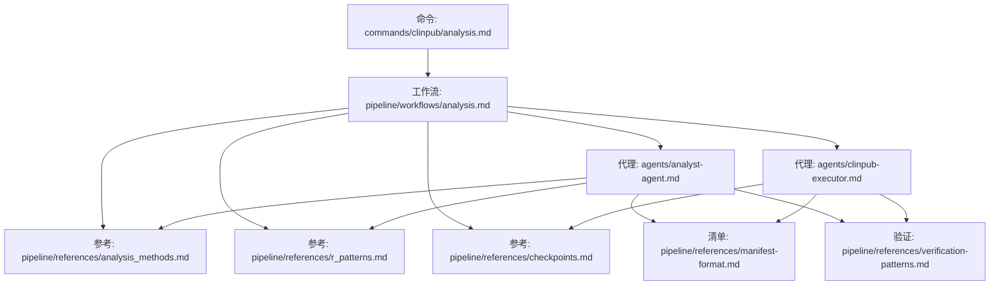
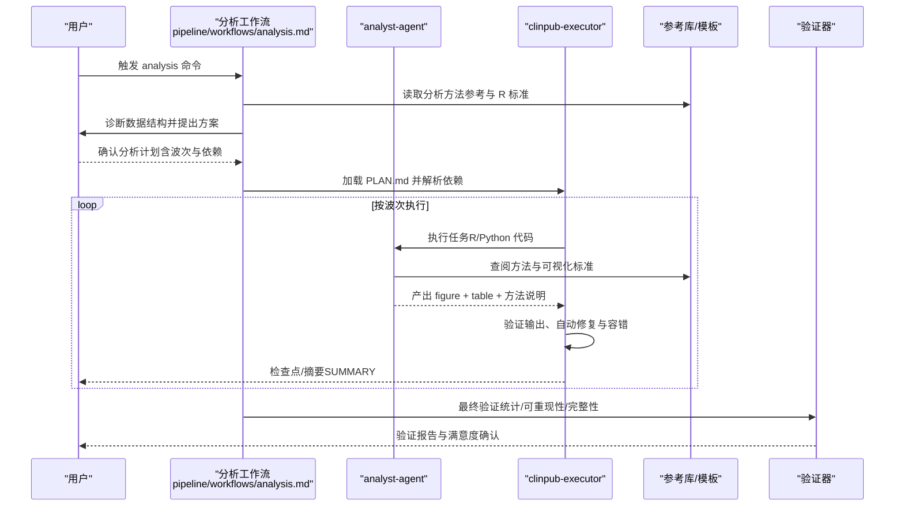
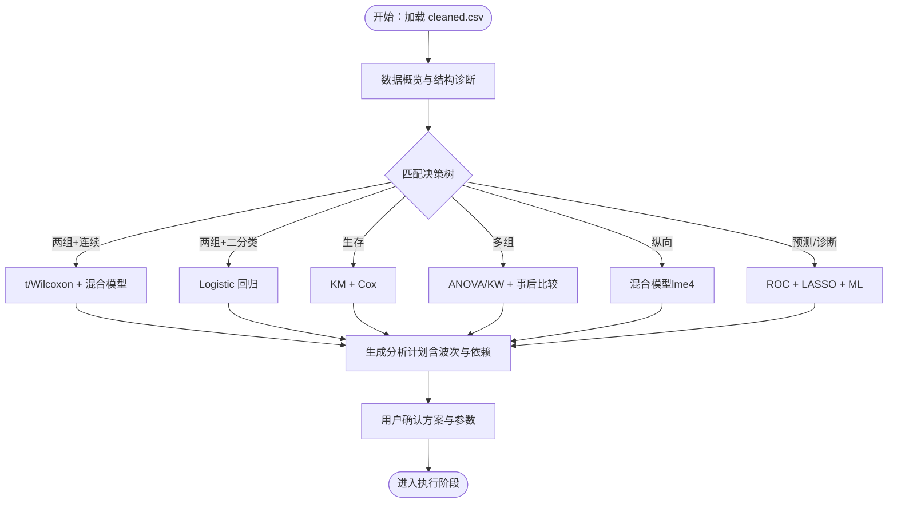
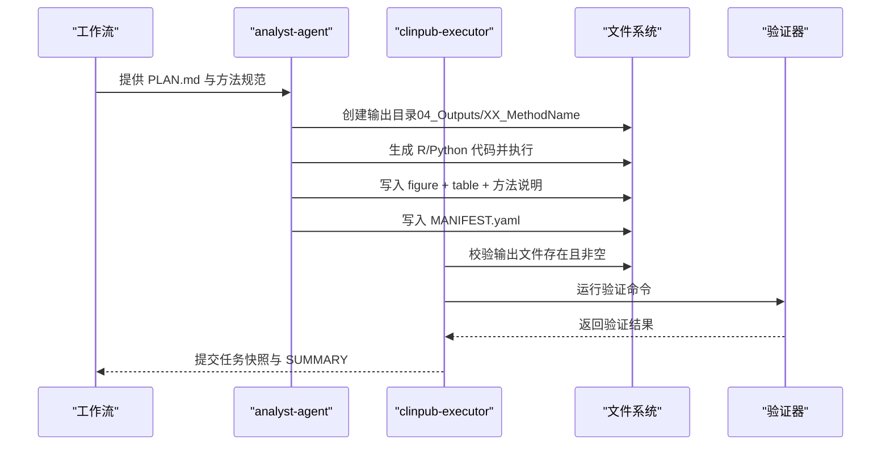
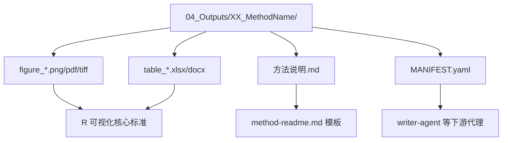
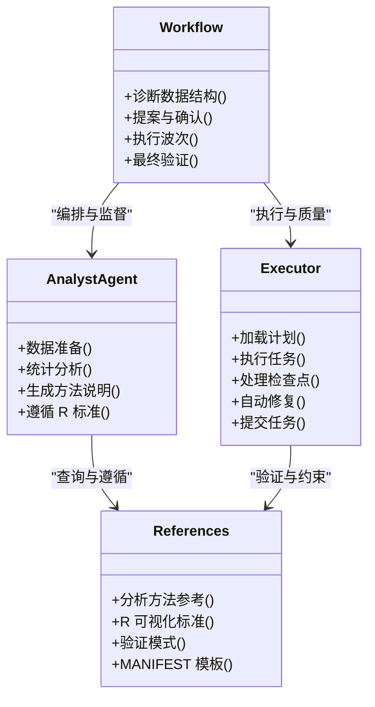
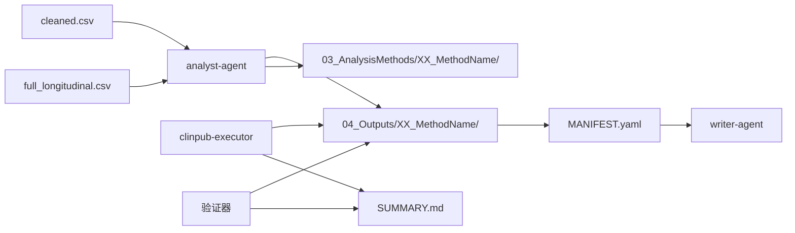

# analysis 统计分析命令

<cite>
**本文档引用的文件**
- [analysis.md](file://commands/clinpub/analysis.md)
- [analysis.md](file://pipeline/workflows/analysis.md)
- [analyst-agent.md](file://agents/analyst-agent.md)
- [clinpub-executor.md](file://agents/clinpub-executor.md)
- [analysis_methods.md](file://pipeline/references/analysis_methods.md)
- [r_patterns.md](file://pipeline/references/r_patterns.md)
- [checkpoints.md](file://pipeline/references/checkpoints.md)
- [verification-patterns.md](file://pipeline/references/verification-patterns.md)
- [manifest-format.md](file://pipeline/references/manifest-format.md)
- [method-readme.md](file://pipeline/templates/method-readme.md)
- [comparison-methods.md](file://pipeline/references/comparison-methods.md)
- [verification-report.md](file://pipeline/templates/verification-report.md)
</cite>

## 目录
1. [简介](#简介)
2. [项目结构](#项目结构)
3. [核心组件](#核心组件)
4. [架构总览](#架构总览)
5. [详细组件分析](#详细组件分析)
6. [依赖关系分析](#依赖关系分析)
7. [性能考量](#性能考量)
8. [故障排查指南](#故障排查指南)
9. [结论](#结论)
10. [附录](#附录)

## 简介
本文件面向 clinpub 的 analysis 命令，系统化阐述统计分析阶段的完整流程：从数据结构诊断、方法推荐、计划确认，到执行与验证。重点说明与 AI 代理的协作机制（analyst-agent 与 clinpub-executor 的职责分工）、分析方法的选择逻辑、R/Python 脚本生成与执行过程、分析结果的存储格式与质量控制检查点、验证模式、统计软件集成与错误处理策略，并提供实际分析示例与结果解读指南。

## 项目结构
analysis 命令位于命令目录，其执行由工作流与参考库共同驱动，代理负责具体实现与质量把关。

**图示来源**
- [analysis.md:1-37](file://commands/clinpub/analysis.md#L1-L37)
- [analysis.md:1-289](file://pipeline/workflows/analysis.md#L1-L289)
- [analyst-agent.md:1-141](file://agents/analyst-agent.md#L1-L141)
- [clinpub-executor.md:1-128](file://agents/clinpub-executor.md#L1-L128)
- [analysis_methods.md:1-311](file://pipeline/references/analysis_methods.md#L1-L311)
- [r_patterns.md:1-532](file://pipeline/references/r_patterns.md#L1-L532)
- [checkpoints.md:1-120](file://pipeline/references/checkpoints.md#L1-L120)
- [verification-patterns.md:1-358](file://pipeline/references/verification-patterns.md#L1-L358)
- [manifest-format.md:1-187](file://pipeline/references/manifest-format.md#L1-L187)

**章节来源**
- [analysis.md:1-37](file://commands/clinpub/analysis.md#L1-L37)
- [analysis.md:1-289](file://pipeline/workflows/analysis.md#L1-L289)

## 核心组件
- 命令入口：analysis 命令定义了 Phase 2 的目标、工具权限、执行上下文与成功标准，强调“自适应统计分析”和“按依赖顺序执行”的波次（wave）机制。
- 工作流：analysis 工作流定义了“诊断 → 提案 → 讨论确认 → 执行 → 验证 → 用户满意度检查 → 关卡里程碑”的端到端流程。
- 代理协作：
  - analyst-agent：承担数据准备与统计分析，生成 publication-grade 图表、表格与方法说明，遵循统一的 R 可视化标准与输出规范。
  - clinpub-executor：原子化执行 PLAN.md，处理决策/人工验证检查点，自动修复与容错，提交任务快照并生成 SUMMARY。
- 参考库与模板：
  - 分析方法参考库：提供方法选择决策树、场景参考与依赖顺序规则。
  - R 可视化核心标准：统一色彩、主题、分辨率、尺寸、显著性标注、拼图布局等。
  - 验证模式：覆盖统计一致性、生存分析、ROC/AUC、多重比较校正、可重现性、数据完整性链、图表一致性等。
  - MANIFEST.yaml：跨阶段文件系统契约，声明产出、统计指标与下游消费者。
  - 方法说明模板：标准化方法文档结构，确保可追溯与可复现。

**章节来源**
- [analysis.md:1-37](file://commands/clinpub/analysis.md#L1-L37)
- [analyst-agent.md:1-141](file://agents/analyst-agent.md#L1-L141)
- [clinpub-executor.md:1-128](file://agents/clinpub-executor.md#L1-L128)
- [analysis_methods.md:1-311](file://pipeline/references/analysis_methods.md#L1-L311)
- [r_patterns.md:1-532](file://pipeline/references/r_patterns.md#L1-L532)
- [verification-patterns.md:1-358](file://pipeline/references/verification-patterns.md#L1-L358)
- [manifest-format.md:1-187](file://pipeline/references/manifest-format.md#L1-L187)
- [method-readme.md:1-38](file://pipeline/templates/method-readme.md#L1-L38)

## 架构总览
analysis 命令的执行由“工作流编排 + 代理执行 + 参考库与模板 + 质量控制”构成闭环。

**图示来源**
- [analysis.md:1-289](file://pipeline/workflows/analysis.md#L1-L289)
- [analyst-agent.md:1-141](file://agents/analyst-agent.md#L1-L141)
- [clinpub-executor.md:1-128](file://agents/clinpub-executor.md#L1-L128)
- [analysis_methods.md:1-311](file://pipeline/references/analysis_methods.md#L1-L311)
- [r_patterns.md:1-532](file://pipeline/references/r_patterns.md#L1-L532)
- [verification-patterns.md:1-358](file://pipeline/references/verification-patterns.md#L1-L358)

## 详细组件分析

### 分析方法选择逻辑与波次组织
- 数据诊断：从 cleaned.csv 与 full_longitudinal.csv 读取，识别分组数量/名称、时间点、结局类型（二分类/连续/生存/有序）、协变量、缺失模式、纵向标志与暴露变量。
- 决策树推荐：依据数据特征匹配推荐方向（如两组+连续结局推荐 t/Wilcoxon + 混合模型；生存分析推荐 KM + Cox；ROC/LASSO 用于诊断/预测等）。
- 波次组织：将推荐方法按依赖关系组织为动态波次，前序结果可用于后序变量筛选与模型构建；波次数不限，从简单描述性到复杂预测/诊断均可。
- 用户确认：方案与参数（变量选择、颜色、校正方法、显著性水平、outcome 转换等）需经用户确认，方可进入执行阶段。

**图示来源**
- [analysis.md:19-117](file://pipeline/workflows/analysis.md#L19-L117)
- [analysis_methods.md:18-104](file://pipeline/references/analysis_methods.md#L18-L104)

**章节来源**
- [analysis.md:19-117](file://pipeline/workflows/analysis.md#L19-L117)
- [analysis_methods.md:18-104](file://pipeline/references/analysis_methods.md#L18-L104)

### R/Python 脚本生成与执行流程
- 代码生成：analyst-agent 根据方法类型、公式与变量，结合分析方法参考与 R 可视化标准生成 R/Python 代码；严格遵循目录先行规则，确保输出目录存在后再写文件。
- 执行与验证：clinpub-executor 以原子化方式执行任务，验证输出文件存在且非空，运行验证命令，自动修复语法/包缺失/路径错误等问题，必要时创建检查点等待用户决策。
- 产出与清单：每个方法生成 figure + table + 方法说明，并在输出目录写入 MANIFEST.yaml，声明统计指标与下游消费者（如 writer-agent）。

**图示来源**
- [analyst-agent.md:45-105](file://agents/analyst-agent.md#L45-L105)
- [clinpub-executor.md:48-95](file://agents/clinpub-executor.md#L48-L95)
- [manifest-format.md:1-187](file://pipeline/references/manifest-format.md#L1-L187)
- [verification-patterns.md:1-358](file://pipeline/references/verification-patterns.md#L1-L358)

**章节来源**
- [analyst-agent.md:45-105](file://agents/analyst-agent.md#L45-L105)
- [clinpub-executor.md:48-95](file://agents/clinpub-executor.md#L48-L95)
- [manifest-format.md:1-187](file://pipeline/references/manifest-format.md#L1-L187)

### 分析结果存储格式与质量控制
- 存储位置与命名：
  - cleaned.csv 为唯一数据源，位于 02_PreprocessedData/data/。
  - 方法输出位于 04_Outputs/XX_MethodName/，方法说明位于 03_AnalysisMethods/XX_MethodName/。
  - 目录编号按用户确认顺序动态编号，遵循 r_patterns 的目录先行规则。
- 图表标准：≥300 DPI，主题统一应用 theme_pub()，字体 Arial ≥8pt，颜色方案色盲友好，尺寸符合单/双栏规范。
- 表格与方法说明：采用标准化模板，包含目的、方法、输入变量、输出文件、参数设置、注意事项与软件版本。
- MANIFEST.yaml：声明 agent、phase、type、outputs、handoffs、decisions 等字段，确保下游消费前的质量门禁。
- 验证模式：涵盖描述性统计交叉核对、模型输出一致性、生存分析一致性、ROC/AUC 有效性、多重比较校正、代码可重现性、数据完整性链、图表一致性等。

**图示来源**
- [analyst-agent.md:14-15](file://agents/analyst-agent.md#L14-L15)
- [r_patterns.md:66-152](file://pipeline/references/r_patterns.md#L66-L152)
- [method-readme.md:1-38](file://pipeline/templates/method-readme.md#L1-L38)
- [manifest-format.md:1-187](file://pipeline/references/manifest-format.md#L1-L187)

**章节来源**
- [analyst-agent.md:14-15](file://agents/analyst-agent.md#L14-L15)
- [r_patterns.md:66-152](file://pipeline/references/r_patterns.md#L66-L152)
- [method-readme.md:1-38](file://pipeline/templates/method-readme.md#L1-L38)
- [manifest-format.md:1-187](file://pipeline/references/manifest-format.md#L1-L187)

### 代理协作机制：analyst-agent 与 clinpub-executor
- analyst-agent 职责：
  - 数据准备：缺失值处理（分级策略）、异常值检测、衍生变量与编码、训练/验证划分、数据质量报告。
  - 统计分析：按用户确认的计划执行，生成 publication-grade 图表与表格，遵循 R 可视化标准与输出规范。
  - 方法说明：使用模板生成标准化文档，记录变量、方法、参数、软件版本与解释要点。
- clinpub-executor 职责：
  - 执行 PLAN.md：解析 frontmatter（phase、plan、type、wave、depends_on）、目标与任务、验证/成功标准。
  - 检查点与容错：支持决策/人工验证检查点；自动修复代码错误、数据问题与缺失输出；限制修复尝试次数。
  - 任务提交：按任务粒度提交，记录摘要与哈希，更新状态文件。

**图示来源**
- [analyst-agent.md:1-141](file://agents/analyst-agent.md#L1-L141)
- [clinpub-executor.md:1-128](file://agents/clinpub-executor.md#L1-L128)
- [analysis.md:1-289](file://pipeline/workflows/analysis.md#L1-L289)
- [analysis_methods.md:1-311](file://pipeline/references/analysis_methods.md#L1-L311)
- [r_patterns.md:1-532](file://pipeline/references/r_patterns.md#L1-L532)
- [verification-patterns.md:1-358](file://pipeline/references/verification-patterns.md#L1-L358)
- [manifest-format.md:1-187](file://pipeline/references/manifest-format.md#L1-L187)

**章节来源**
- [analyst-agent.md:1-141](file://agents/analyst-agent.md#L1-L141)
- [clinpub-executor.md:1-128](file://agents/clinpub-executor.md#L1-L128)
- [analysis.md:1-289](file://pipeline/workflows/analysis.md#L1-L289)

### 实际分析示例与结果解读指南
- 示例场景：RCT 两组比较（cTBS vs Sham），结局为 HAMD 总分，包含基线描述、组间比较（Wilcoxon）、重复测量混合模型（交互效应）、多因素回归（调整协变量）等。
- 结果解读要点：
  - 描述性统计：关注组间均衡性（基线表）与分布特征（描述统计）。
  - 组间比较：报告效应量（如 r = Z/√N 或 η²）与 95%CI，显著性标注与 p 值一致性。
  - 混合模型：关注 time×group 交互项，报告边际均值与残差正态性检查。
  - 回归模型：报告 β/SE/CI/p，VIF 检查共线性，Hosmer-Lemeshow 检验与 ROC。
  - 生存分析：KM 曲线与 log-rank 检验，Cox 回归与 PH 假设检验。
  - ROC/AUC：AUC 及 Wilson CI，Youden 最佳阈值，敏感度/特异度 CI。
- 方法说明模板：用于记录变量、方法、参数、软件版本与解释要点，便于复现与审阅。

**章节来源**
- [analysis_methods.md:107-311](file://pipeline/references/analysis_methods.md#L107-L311)
- [method-readme.md:1-38](file://pipeline/templates/method-readme.md#L1-L38)

## 依赖关系分析
- 数据依赖：所有分析严格从 cleaned.csv 读取，避免硬编码路径；纵向分析使用 full_longitudinal.csv。
- 任务依赖：按波次与方法间依赖自动排序，前序输出作为后序输入；波次在用户确认后推进。
- 代理依赖：analyst-agent 产出 MANIFEST.yaml，供 writer-agent 等下游代理消费；executor 负责任务提交与状态更新。
- 质量依赖：验证模式贯穿执行前后，确保统计一致性、可重现性与数据完整性链。

**图示来源**
- [analyst-agent.md:14-15](file://agents/analyst-agent.md#L14-L15)
- [manifest-format.md:1-187](file://pipeline/references/manifest-format.md#L1-L187)
- [verification-patterns.md:1-358](file://pipeline/references/verification-patterns.md#L1-L358)

**章节来源**
- [analyst-agent.md:14-15](file://agents/analyst-agent.md#L14-L15)
- [manifest-format.md:1-187](file://pipeline/references/manifest-format.md#L1-L187)
- [verification-patterns.md:1-358](file://pipeline/references/verification-patterns.md#L1-L358)

## 性能考量
- 代码可重现性：脚本从 cleaned.csv 读取，避免中间文件耦合；随机算法设置种子并记录。
- 输出一致性：统一主题与分辨率，减少后期排版与渲染开销。
- 并行与串行：波次间串行推进，波内方法按依赖顺序执行；复杂方法（如 LASSO、ROC）建议分步验证，降低失败重试成本。
- 资源控制：合理设置 R/Python 包版本与系统资源上限，避免长时间运行任务阻塞流水线。

## 故障排查指南
- 常见问题与处理：
  - 缺失值策略：>20% 缺失变量需用户决策；MICE 插补需记录参数与日志；删除策略需与排除文档一致。
  - 数据不满足前提：正态性/方差齐性/理论频数不足时，依据决策树切换非参数或稳健方法。
  - 输出缺失：检查代码是否创建输出目录、是否正确写入文件；executor 会自动修复但有限次尝试。
  - 方法变更：若分析需要变更方法，executor 将创建决策检查点，等待用户确认。
- 验证报告：使用验证模板生成结构化报告，定位统计不一致、多重比较未校正、可重现性问题与数据完整性链断裂等。

**章节来源**
- [clinpub-executor.md:70-128](file://agents/clinpub-executor.md#L70-L128)
- [verification-patterns.md:1-358](file://pipeline/references/verification-patterns.md#L1-L358)
- [verification-report.md:1-85](file://pipeline/templates/verification-report.md#L1-L85)

## 结论
analysis 命令通过“工作流编排 + 代理协作 + 参考库与模板 + 质量控制”的体系，实现了面向数据特征的自适应统计分析。analyst-agent 负责高质量的统计分析与可视化，clinpub-executor 负责原子化执行、检查点与容错，二者协同确保结果可复现、可验证、可交接。建议在执行前明确变量与方法参数，在执行后按验证模式进行复检，以达到发表级标准。

## 附录
- 统计软件集成：R 脚本末尾调用 sessionInfo() 记录版本；Python 脚本记录包版本；统一在方法说明中体现。
- 错误处理策略：executor 自动修复语法/包缺失/路径错误；数据问题按策略处理或创建检查点；缺失输出自动修复但有限次尝试。
- 结果解读要点：始终报告效应量 + 95%CI + 精确 p 值；多重比较应用 FDR/Bonferroni 校正；假设检验（正态性、方差齐性、PH 假设）需报告与处置。