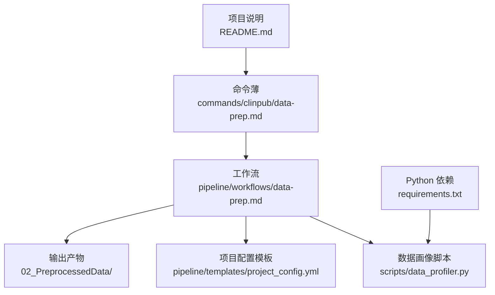
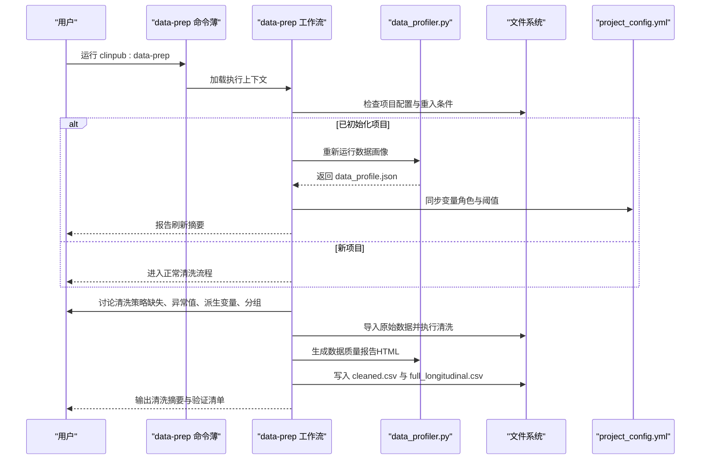
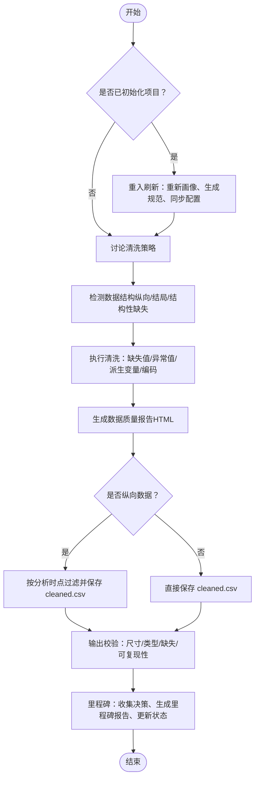
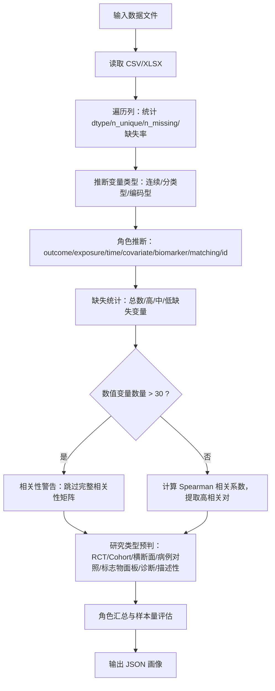
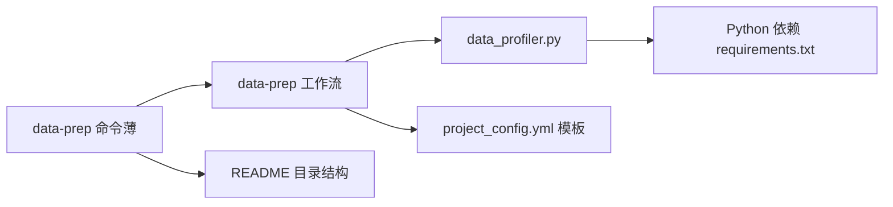

# data-prep 数据准备命令

<cite>
**本文引用的文件**
- [commands/clinpub/data-prep.md](file://commands/clinpub/data-prep.md)
- [pipeline/workflows/data-prep.md](file://pipeline/workflows/data-prep.md)
- [scripts/data_profiler.py](file://scripts/data_profiler.py)
- [pipeline/templates/project_config.yml](file://pipeline/templates/project_config.yml)
- [README.md](file://README.md)
- [requirements.txt](file://requirements.txt)
- [pipeline/references/verification-patterns.md](file://pipeline/references/verification-patterns.md)
- [agents/analyst-agent.md](file://agents/analyst-agent.md)
</cite>

## 目录
1. [简介](#简介)
2. [项目结构](#项目结构)
3. [核心组件](#核心组件)
4. [架构总览](#架构总览)
5. [详细组件分析](#详细组件分析)
6. [依赖关系分析](#依赖关系分析)
7. [性能考虑](#性能考虑)
8. [故障排查指南](#故障排查指南)
9. [结论](#结论)
10. [附录](#附录)

## 简介
本文件为 clinpub 的 data-prep 数据准备命令提供系统化、可操作的技术文档。它覆盖从原始数据导入、数据清洗、变量转换、质量控制，到数据档案生成、缺失值处理、异常值检测、数据格式标准化，以及与 data_profiler.py 的集成与自动化数据质量评估。文档还明确了预处理数据目录结构与输出文件格式、数据验证规则与质量标准、清理策略，并提供实际处理示例与调试技巧。

## 项目结构
clinpub 采用“命令薄（commands）→工作流（workflows）→脚本（scripts）→模板（templates）→参考（references）”的分层组织方式。data-prep 命令作为 Phase 1 的入口，驱动工作流完成数据准备与质量报告生成；data_profiler.py 用于自动化数据画像与研究类型预判；project_config.yml 提供项目级配置与分析阈值；README 展示整体目录结构与阶段化流程。

**图表来源**
- [commands/clinpub/data-prep.md:1-50](file://commands/clinpub/data-prep.md#L1-L50)
- [pipeline/workflows/data-prep.md:1-184](file://pipeline/workflows/data-prep.md#L1-L184)
- [scripts/data_profiler.py:1-353](file://scripts/data_profiler.py#L1-L353)
- [pipeline/templates/project_config.yml:1-97](file://pipeline/templates/project_config.yml#L1-L97)
- [README.md:82-94](file://README.md#L82-L94)
- [requirements.txt:1-8](file://requirements.txt#L1-L8)

**章节来源**
- [README.md:82-94](file://README.md#L82-L94)
- [commands/clinpub/data-prep.md:1-50](file://commands/clinpub/data-prep.md#L1-L50)

## 核心组件
- data-prep 命令薄：定义 Phase 1 的目标、执行上下文、重入检测与成功标准，触发工作流执行。
- data-prep 工作流：定义数据准备的端到端流程，包括重入刷新、清洗策略讨论、数据结构检测、清洗执行、输出校验与里程碑。
- data_profiler.py：自动化数据画像，输出变量字典、缺失模式、相关性、研究类型预判与样本量评估。
- 项目配置模板：提供变量角色、路径、分析阈值等配置项，支撑清洗策略与后续分析。
- 验证模式：定义 Phase 1 的质量验证模式与失败指标，保障清洗产物符合下游分析要求。

**章节来源**
- [commands/clinpub/data-prep.md:14-50](file://commands/clinpub/data-prep.md#L14-L50)
- [pipeline/workflows/data-prep.md:6-184](file://pipeline/workflows/data-prep.md#L6-L184)
- [scripts/data_profiler.py:1-353](file://scripts/data_profiler.py#L1-L353)
- [pipeline/templates/project_config.yml:1-97](file://pipeline/templates/project_config.yml#L1-L97)
- [pipeline/references/verification-patterns.md:158-191](file://pipeline/references/verification-patterns.md#L158-L191)

## 架构总览
data-prep 命令薄负责“入口与重入检测”，工作流负责“流程编排与质量门控”，脚本负责“数据画像与预判”，模板负责“配置与阈值”。整体以“讨论-计划-执行-验证”的闭环推进，确保清洗过程透明、可复现、可追溯。

**图表来源**
- [commands/clinpub/data-prep.md:25-40](file://commands/clinpub/data-prep.md#L25-L40)
- [pipeline/workflows/data-prep.md:19-58](file://pipeline/workflows/data-prep.md#L19-L58)
- [scripts/data_profiler.py:201-325](file://scripts/data_profiler.py#L201-L325)

## 详细组件分析

### 命令薄：data-prep 命令
- 目标与职责：将原始数据转化为分析就绪的 cleaned.csv，并生成完整的数据质量报告。
- 重入检测：若项目配置存在且关键字段有效，则自动刷新画像、规范与配置，再进入讨论环节。
- 成功标准：cleaned.csv 存在于预处理目录、生成 HTML 质量报告、按层级策略处理缺失值、记录异常值、生成派生变量并编码、清洗代码可独立复现。

**章节来源**
- [commands/clinpub/data-prep.md:14-50](file://commands/clinpub/data-prep.md#L14-L50)

### 工作流：data-prep 流程
- 重入刷新（reinit_data_prep）：重新运行数据画像、生成 spec 模板、同步 project_config.yml 的变量角色字段。
- 清洗策略讨论（discuss_cleaning_strategy）：确认缺失值处理阈值、异常值处理方法、变量编码、派生变量与训练/验证拆分。
- 数据结构检测（detect_data_structure）：识别纵向/重复测量数据、结局类型、结构性缺失，记录结构化笔记。
- 清洗执行（execute_cleaning）：导入数据、处理缺失值、检测异常值、生成派生变量与编码、生成数据质量报告（HTML）、纵向数据过滤至分析时点。
- 输出校验（validate_output）：核对 cleaned.csv 存在与行列数、高缺失变量处理、数据类型正确性、清洗代码可复现、输出清洗摘要。
- 里程碑（milestone）：收集清洗决策、生成里程碑报告、更新路线图与状态、请求用户签核。

**图表来源**
- [pipeline/workflows/data-prep.md:19-155](file://pipeline/workflows/data-prep.md#L19-L155)

**章节来源**
- [pipeline/workflows/data-prep.md:17-155](file://pipeline/workflows/data-prep.md#L17-L155)

### 数据画像脚本：data_profiler.py
- 输入：CSV 或 Excel 文件（支持指定工作表）。
- 输出：结构化数据画像 JSON，包含变量字典、缺失统计、相关性警告、研究类型预判、角色汇总与样本量评估。
- 关键能力：
  - 变量角色推断：基于变量名模式识别 outcome、exposure、time、covariate、biomarker、matching、id 等角色。
  - 研究类型预判：综合结局、暴露、时间、匹配与标志物数量，给出多种研究类型的置信度与方法建议。
  - 缺失模式与相关性：统计缺失比例、高相关变量对（Spearman），并给出变量超过一定数量时的相关性矩阵警告。
  - 样本量评估：依据样本量区间给出分析能力评估。

**图表来源**
- [scripts/data_profiler.py:201-325](file://scripts/data_profiler.py#L201-L325)

**章节来源**
- [scripts/data_profiler.py:1-353](file://scripts/data_profiler.py#L1-L353)

### 项目配置模板：project_config.yml
- 项目元信息：名称、描述、设计类型、样本量、目标期刊、报告标准。
- 变量角色：结局、结局类型、暴露、协变量、时间变量、事件变量、分组变量、ID 变量。
- 路径约定：原始数据、预处理、分析方法、输出、参考、手稿、进度、全局目录。
- 分析阈值：缺失率阈值（低/中/高）、显著性水平、多重比较校正方法。
- 语言与质量：论文语言、图表语言、统计语言、图像分辨率与格式、字体与字号。

**章节来源**
- [pipeline/templates/project_config.yml:1-97](file://pipeline/templates/project_config.yml#L1-L97)

### 验证模式：Phase 1 数据质量验证
- 清洗产物完整性：校验 cleaned.csv 尺寸、变量类型、类别水平、派生变量可重现性、质量报告存在且非空。
- 缺失值处理验证：高缺失变量（>20%）需有用户确认处理策略；MICE 插补需记录模型与预测变量；删除策略需与预期排除一致；测试集插补不得泄露训练集信息；缺失报告与清洗后数据一致。

**章节来源**
- [pipeline/references/verification-patterns.md:158-191](file://pipeline/references/verification-patterns.md#L158-L191)

## 依赖关系分析
- 命令薄依赖工作流：通过执行上下文加载 data-prep 工作流。
- 工作流依赖脚本与模板：使用 data_profiler.py 生成画像，使用 project_config.yml 作为阈值与变量角色来源。
- 脚本依赖 Python 库：pandas、numpy、openpyxl 等。
- 项目结构依赖 README：定义目录布局与阶段化流程。

**图表来源**
- [commands/clinpub/data-prep.md:21-23](file://commands/clinpub/data-prep.md#L21-L23)
- [pipeline/workflows/data-prep.md:22-28](file://pipeline/workflows/data-prep.md#L22-L28)
- [requirements.txt:1-8](file://requirements.txt#L1-L8)
- [README.md:82-94](file://README.md#L82-L94)

**章节来源**
- [requirements.txt:1-8](file://requirements.txt#L1-L8)
- [README.md:82-94](file://README.md#L82-L94)

## 性能考虑
- 大表处理：data_profiler.py 对数值变量超过一定数量时会发出相关性矩阵警告，避免完整相关性计算导致内存与时间开销过大。
- I/O 优化：工作流中尽量减少重复读取，先运行画像再生成规范与同步配置，降低后续步骤的重复成本。
- 并行与缓存：在外部工具链中可考虑缓存 data_profile.json 与生成的规范文件，避免频繁重复计算。

## 故障排查指南
- 缺失值处理异常
  - 症状：高缺失变量（>20%）未处理即进入下游分析。
  - 排查：确认工作流中缺失值处理策略讨论步骤已完成，检查 data_profile.json 的缺失统计与阈值设置。
  - 参考：验证模式中关于缺失值处理的检查项。
- 异常值误判
  - 症状：异常值检测过多或过少。
  - 排查：调整 IQR/Z-score 阈值，确认连续变量与分类型变量的区分是否正确。
  - 参考：工作流中异常值检测与记录流程。
- 横纵向数据混淆
  - 症状：基线表重复计数或混合模型误用。
  - 排查：确认数据结构检测步骤的分析时点决策，纵向数据需过滤到单一时间点后再保存 cleaned.csv。
  - 参考：工作流中数据结构检测与纵向过滤步骤。
- 质量报告缺失或为空
  - 症状：02_PreprocessedData/reports/ 下缺少 HTML 报告。
  - 排查：确认工作流执行到生成报告步骤，检查脚本输出路径与权限。
  - 参考：验证模式中关于质量报告的存在性与非空性检查。
- Python 依赖缺失
  - 症状：运行 data_profiler.py 报错提示缺少 pandas/openpyxl。
  - 排查：安装 requirements.txt 中的 Python 依赖。
  - 参考：requirements.txt。

**章节来源**
- [pipeline/references/verification-patterns.md:158-191](file://pipeline/references/verification-patterns.md#L158-L191)
- [requirements.txt:1-8](file://requirements.txt#L1-L8)

## 结论
data-prep 命令通过“讨论-计划-执行-验证”的闭环，结合 data_profiler.py 的自动化数据画像与研究类型预判，实现了从原始数据到分析就绪数据的高质量交付。配合 project_config.yml 的阈值与变量角色配置，以及严格的验证模式，确保清洗过程透明、可复现、可追溯，为后续 Phase 2 的统计分析打下坚实基础。

## 附录

### 预处理数据目录结构与输出文件
- 目录结构（示例）
  - 01_RawData/：原始数据（只读）
  - 02_PreprocessedData/
    - data/：cleaned.csv、full_longitudinal.csv
    - reports/：数据质量报告（HTML）
  - 03_AnalysisMethods/：分析规范（spec.md）
  - project_config.yml：项目配置
- 输出文件
  - cleaned.csv：清洗后的分析就绪数据
  - full_longitudinal.csv：纵向全数据（用于混合模型）
  - data_profile.json：数据画像（由 data_profiler.py 生成）
  - 数据质量报告（HTML）：变量摘要、缺失矩阵、分布图、异常值文档、拆分摘要（如适用）

**章节来源**
- [README.md:82-94](file://README.md#L82-L94)
- [pipeline/workflows/data-prep.md:116-127](file://pipeline/workflows/data-prep.md#L116-L127)

### 数据验证规则与质量标准
- 产物完整性：cleaned.csv 存在且行列数符合预期；质量报告存在且非空。
- 缺失值处理：按阈值策略处理，高缺失变量需有用户确认记录；MICE 插补需记录模型与预测变量；测试集插补不得泄露训练集信息。
- 异常值处理：记录并文档化所有异常值；选择 IQR 或 Z-score 方法之一并统一应用。
- 派生变量与编码：派生变量可由源变量重现；因子水平与参考类别明确；连续变量可选变换（如对数、Box-Cox）。
- 可复现性：清洗代码可独立从原始数据执行，步骤清晰、参数明确。

**章节来源**
- [pipeline/references/verification-patterns.md:158-191](file://pipeline/references/verification-patterns.md#L158-L191)
- [pipeline/workflows/data-prep.md:175-183](file://pipeline/workflows/data-prep.md#L175-L183)

### 实际数据处理示例与调试技巧
- 示例场景：某队列研究数据含缺失率约 15% 的连续变量与少量缺失率超 20% 的变量
  - 步骤：先运行 data_profiler.py 获取 data_profile.json；在工作流中确认缺失值处理策略（15% 使用 MICE，20% 以上讨论）；执行清洗并生成质量报告；校验 cleaned.csv 与报告一致性。
- 调试技巧
  - 逐步验证：先检查变量角色与缺失统计，再执行缺失值处理与异常值检测，最后生成报告。
  - 纵向数据：确认分析时点（如 baseline），过滤后保存 cleaned.csv，保留 full_longitudinal.csv 用于后续模型。
  - 阈值校准：根据项目配置模板调整缺失率阈值与多重比较校正方法，确保与研究设计一致。

**章节来源**
- [scripts/data_profiler.py:201-325](file://scripts/data_profiler.py#L201-L325)
- [pipeline/workflows/data-prep.md:60-130](file://pipeline/workflows/data-prep.md#L60-L130)
- [pipeline/templates/project_config.yml:72-78](file://pipeline/templates/project_config.yml#L72-L78)