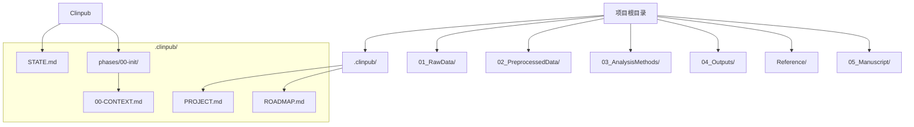
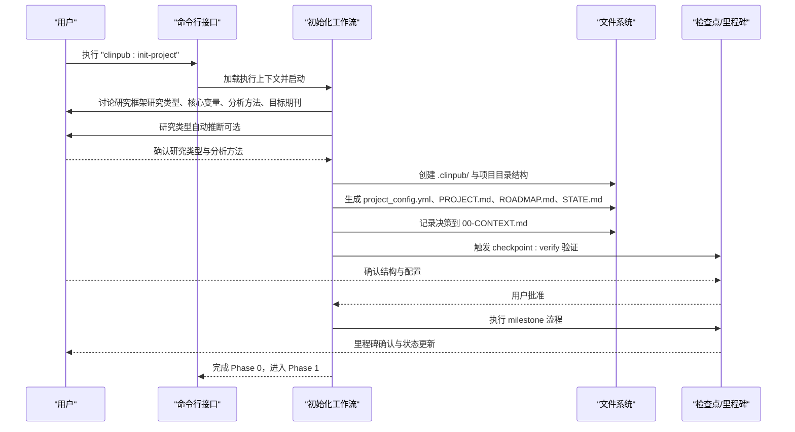
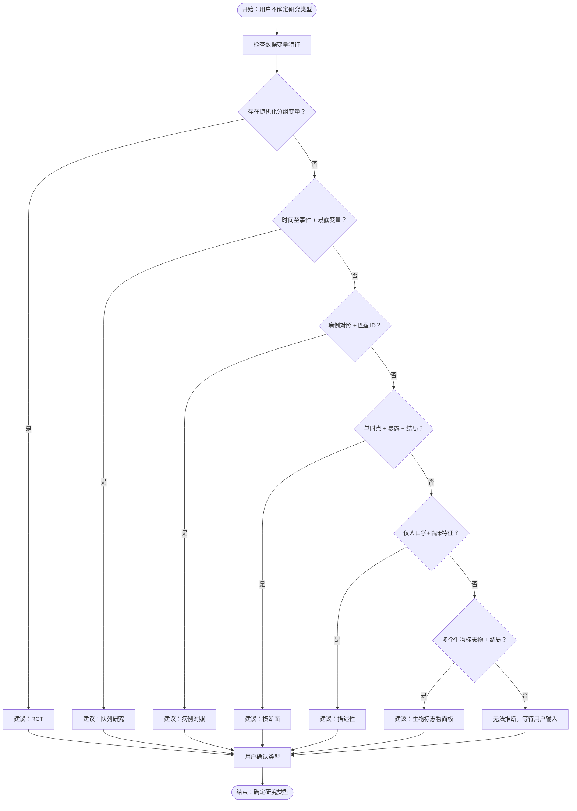
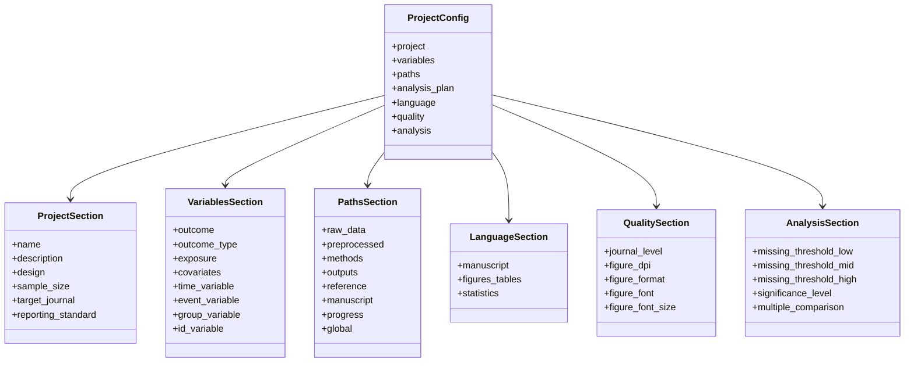
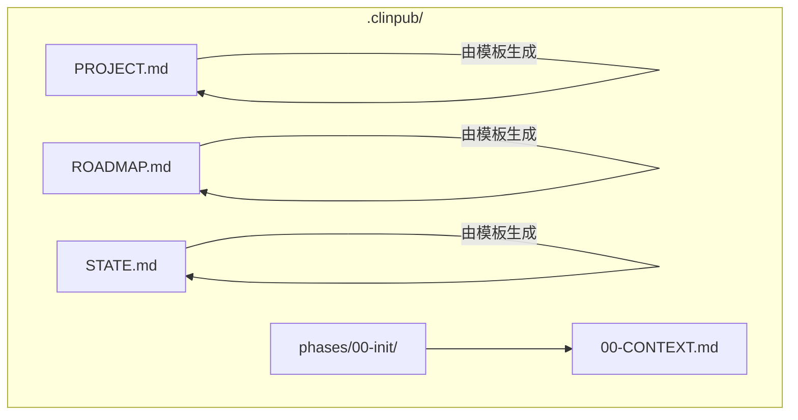
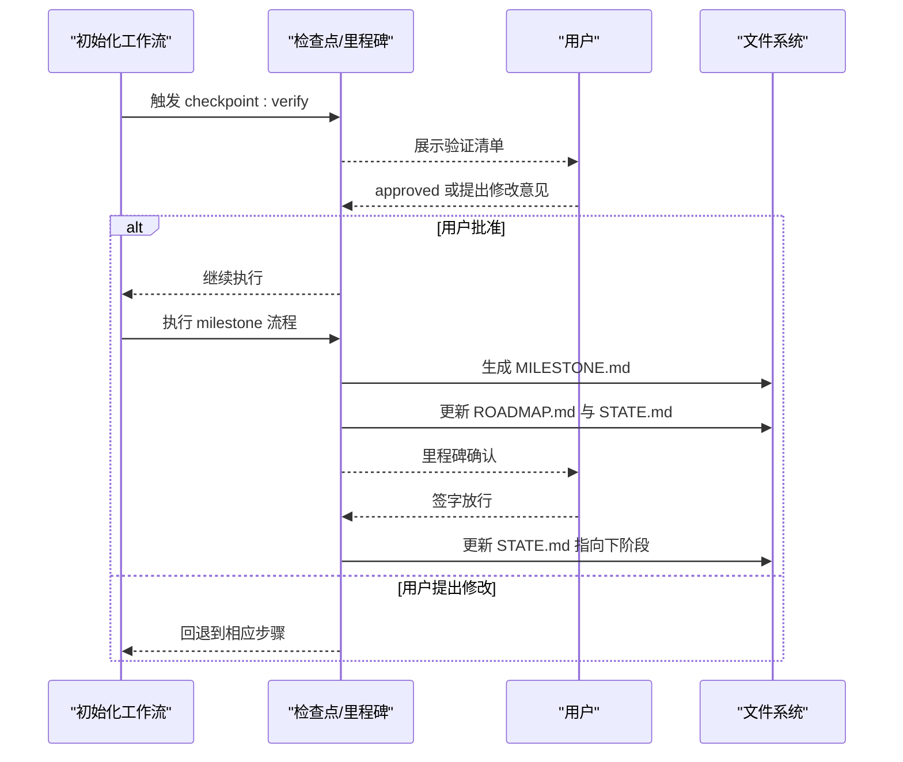
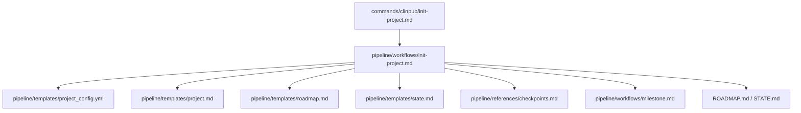

# init-project 初始化项目命令

<cite>
**本文引用的文件**
- [commands/clinpub/init-project.md](file://commands/clinpub/init-project.md)
- [pipeline/workflows/init-project.md](file://pipeline/workflows/init-project.md)
- [pipeline/templates/project_config.yml](file://pipeline/templates/project_config.yml)
- [examples/project_config.example.yml](file://examples/project_config.example.yml)
- [pipeline/templates/project.md](file://pipeline/templates/project.md)
- [pipeline/templates/roadmap.md](file://pipeline/templates/roadmap.md)
- [pipeline/templates/state.md](file://pipeline/templates/state.md)
- [.clinpub/STATE.md](file://.clinpub/STATE.md)
- [.clinpub/ROADMAP.md](file://.clinpub/ROADMAP.md)
- [pipeline/references/checkpoints.md](file://pipeline/references/checkpoints.md)
- [pipeline/workflows/milestone.md](file://pipeline/workflows/milestone.md)
- [.clinpub/config.json](file://.clinpub/config.json)
</cite>

## 目录
1. [简介](#简介)
2. [项目结构](#项目结构)
3. [核心组件](#核心组件)
4. [架构概览](#架构概览)
5. [详细组件分析](#详细组件分析)
6. [依赖关系分析](#依赖关系分析)
7. [性能考虑](#性能考虑)
8. [故障排除指南](#故障排除指南)
9. [结论](#结论)
10. [附录](#附录)

## 简介
本文件面向 clinpub 的 init-project 命令，系统性阐述项目初始化阶段的全流程设计与实现要点。该命令负责在正式开始研究工作之前，与用户进行充分讨论，明确研究框架与分析计划，并据此生成项目配置、目录结构以及 .clinpub 状态文件。其核心目标是确保后续各阶段（数据准备、统计分析、论文撰写等）建立在清晰、可追溯且可复现的研究框架之上。

## 项目结构
init-project 命令在执行时会创建以下层次化的项目结构：
- 顶层目录层：包含 .clinpub/ 规划与状态层、数据层（01_RawData、02_PreprocessedData）、分析层（03_AnalysisMethods）、输出层（04_Outputs）、文献层（Reference）、手稿层（05_Manuscript）等。
- .clinpub/ 层：包含 PROJECT.md、ROADMAP.md、STATE.md 以及 phases/00-init/00-CONTEXT.md 等关键文件，用于记录研究愿景、路线图、阶段状态与初始化讨论决策。
- 配置层：project_config.yml，承载项目元信息、变量定义、路径映射、分析方法集合、语言与质量要求、统计参数等。

**图表来源**
- [pipeline/workflows/init-project.md:39-65](file://pipeline/workflows/init-project.md#L39-L65)
- [pipeline/templates/project.md:1-30](file://pipeline/templates/project.md#L1-L30)
- [pipeline/templates/roadmap.md:1-19](file://pipeline/templates/roadmap.md#L1-L19)
- [pipeline/templates/state.md:1-19](file://pipeline/templates/state.md#L1-L19)

**章节来源**
- [pipeline/workflows/init-project.md:39-65](file://pipeline/workflows/init-project.md#L39-L65)
- [pipeline/templates/project.md:1-30](file://pipeline/templates/project.md#L1-L30)
- [pipeline/templates/roadmap.md:1-19](file://pipeline/templates/roadmap.md#L1-L19)
- [pipeline/templates/state.md:1-19](file://pipeline/templates/state.md#L1-L19)

## 核心组件
- 命令入口与执行上下文
  - 命令定义位于 commands/clinpub/init-project.md，声明了允许使用的工具集（读取、写入、编辑、全局匹配、文本搜索、Shell、用户问答），并指定执行上下文为 pipeline/workflows/init-project.md。
  - 执行流程要求先与用户讨论研究框架，再生成配置与目录结构，最后通过里程碑流程正式关闭 Phase 0 并进入 Phase 1。
- 初始化工作流
  - 初始化工作流（pipeline/workflows/init-project.md）定义了四个关键步骤：研究框架讨论、项目结构创建、配置生成、决策记录与验证确认。
  - 工作流还包含研究类型自动推断逻辑（当用户不确定时），但最终类型必须由用户确认。
- 配置模板与示例
  - 项目配置模板（pipeline/templates/project_config.yml）定义了 project、variables、paths、analysis_plan、language、quality、analysis 等关键字段。
  - 示例配置（examples/project_config.example.yml）提供了具体字段的示例值，便于快速理解与参考。
- 状态与路线图模板
  - PROJECT.md、ROADMAP.md、STATE.md 模板分别用于记录项目愿景、阶段路线与当前状态，配合 .clinpub/ 中的状态文件共同构成项目的“心智模型”。
- 里程碑与检查点协议
  - checkpoints.md 定义了 decision、verify、milestone 三类检查点的设计原则与格式；milestone.md 描述了里程碑流程的验证清单、决策汇总、里程碑文件生成与状态更新。

**章节来源**
- [commands/clinpub/init-project.md:1-34](file://commands/clinpub/init-project.md#L1-L34)
- [pipeline/workflows/init-project.md:18-97](file://pipeline/workflows/init-project.md#L18-L97)
- [pipeline/templates/project_config.yml:1-97](file://pipeline/templates/project_config.yml#L1-L97)
- [examples/project_config.example.yml:1-68](file://examples/project_config.example.yml#L1-L68)
- [pipeline/templates/project.md:1-30](file://pipeline/templates/project.md#L1-L30)
- [pipeline/templates/roadmap.md:1-19](file://pipeline/templates/roadmap.md#L1-L19)
- [pipeline/templates/state.md:1-19](file://pipeline/templates/state.md#L1-L19)
- [pipeline/references/checkpoints.md:1-120](file://pipeline/references/checkpoints.md#L1-L120)
- [pipeline/workflows/milestone.md:15-154](file://pipeline/workflows/milestone.md#L15-L154)

## 架构概览
init-project 命令采用“讨论—生成—记录—验证”的闭环架构。用户通过命令与系统交互，系统在内部调用初始化工作流，后者按步骤完成研究框架讨论、目录结构创建、配置生成与决策记录，并通过检查点与里程碑机制确保每一步都得到用户确认与审计。

**图表来源**
- [commands/clinpub/init-project.md:20-26](file://commands/clinpub/init-project.md#L20-L26)
- [pipeline/workflows/init-project.md:18-97](file://pipeline/workflows/init-project.md#L18-L97)
- [pipeline/workflows/milestone.md:15-154](file://pipeline/workflows/milestone.md#L15-L154)

## 详细组件分析

### 命令入口与执行上下文
- 命令名称与描述：明确 Phase 0 的职责是与用户讨论研究框架，并生成项目配置、目录结构与 .clinpub 资产。
- 工具集限制：限定为读取、写入、编辑、全局匹配、文本搜索、Shell、用户问答等，确保命令在受控环境中运行。
- 执行上下文：直接委托给 pipeline/workflows/init-project.md，保证行为的一致性与可审计性。

**章节来源**
- [commands/clinpub/init-project.md:1-34](file://commands/clinpub/init-project.md#L1-L34)

### 研究框架讨论与自动推断
- 讨论内容四要素：研究基础（标题、类型、目标、假设）、数据概览（来源、样本量、关键变量）、分析方法（候选池）、预期产出（目标期刊、图表类型、语言偏好）。
- 自动推断规则：当用户不确定研究类型时，系统根据数据特征给出建议（如随机化分组→RCT、生存分析+暴露→队列、病例对照+匹配→病例对照、横断面、描述性、多生物标志物+结局→生物标志物面板），但最终类型必须由用户确认。

**图表来源**
- [pipeline/workflows/init-project.md:28-36](file://pipeline/workflows/init-project.md#L28-L36)

**章节来源**
- [pipeline/workflows/init-project.md:20-37](file://pipeline/workflows/init-project.md#L20-L37)

### 项目结构创建与目录约定
- 目录层级：.clinpub/（状态与规划）、01_RawData（原始数据）、02_PreprocessedData（清洗与报告）、03_AnalysisMethods（仅包含用户确认的方法目录）、04_Outputs（图表与表格）、Reference（文献）、05_Manuscript（章节草稿与回复信）。
- 关键约束：03_AnalysisMethods/ 与 04_Outputs/ 仅包含用户确认的分析方法目录，避免冗余与混淆。

**章节来源**
- [pipeline/workflows/init-project.md:39-65](file://pipeline/workflows/init-project.md#L39-L65)

### 配置生成与 project_config.yml 结构
- 配置模板字段概览：
  - project：name、description、design、sample_size、target_journal、reporting_standard
  - variables：outcome、outcome_type、exposure、covariates、time_variable、event_variable、group_variable、id_variable
  - paths：raw_data、preprocessed、methods、outputs、reference、manuscript、progress、global
  - analysis_plan：波次与方法的动态结构（Phase 2 由诊断→提议→确认流程动态填充）
  - language：manuscript、figures_tables、statistics
  - quality：journal_level、figure_dpi、figure_format、figure_font、figure_font_size
  - analysis：missing_threshold_low、missing_threshold_mid、missing_threshold_high、significance_level、multiple_comparison
- 示例配置：examples/project_config.example.yml 提供了 RCT 示例与字段取值，便于快速理解与迁移。

**图表来源**
- [pipeline/templates/project_config.yml:6-78](file://pipeline/templates/project_config.yml#L6-L78)
- [examples/project_config.example.yml:8-67](file://examples/project_config.example.yml#L8-L67)

**章节来源**
- [pipeline/templates/project_config.yml:1-97](file://pipeline/templates/project_config.yml#L1-L97)
- [examples/project_config.example.yml:1-68](file://examples/project_config.example.yml#L1-L68)

### .clinpub 状态文件与决策记录
- PROJECT.md：记录项目愿景、研究类型、核心变量、需求与约束，以及决策记录表格。
- ROADMAP.md：列出各阶段目标、成功标准与状态，当前阶段标注为 Phase 0。
- STATE.md：记录当前阶段、步骤、波次、已完成/待完成分析、文献数量、最近决策与下一步行动。
- 00-CONTEXT.md：记录初始化阶段的所有关键决策（研究类型与理由、变量角色与定义、选定分析方法、目标期刊与质量要求、延期或开放问题）。

**图表来源**
- [pipeline/templates/project.md:1-30](file://pipeline/templates/project.md#L1-L30)
- [pipeline/templates/roadmap.md:1-19](file://pipeline/templates/roadmap.md#L1-L19)
- [pipeline/templates/state.md:1-19](file://pipeline/templates/state.md#L1-L19)
- [pipeline/workflows/init-project.md:80-87](file://pipeline/workflows/init-project.md#L80-L87)

**章节来源**
- [pipeline/templates/project.md:1-30](file://pipeline/templates/project.md#L1-L30)
- [pipeline/templates/roadmap.md:1-19](file://pipeline/templates/roadmap.md#L1-L19)
- [pipeline/templates/state.md:1-19](file://pipeline/templates/state.md#L1-L19)
- [pipeline/workflows/init-project.md:80-87](file://pipeline/workflows/init-project.md#L80-L87)

### 验证确认与里程碑流程
- checkpoint:verify：在结构与配置生成后，向用户展示验证清单（项目结构、配置反映决策、路线图状态），若用户请求变更则回退，否则进入里程碑。
- milestone 流程：正式验证 Phase 0 成功标准，汇总关键决策与产出，生成 MILESTONE.md，更新 ROADMAP.md 状态为“完成”，更新 STATE.md 指向下阶段，等待用户签字放行。

**图表来源**
- [pipeline/workflows/init-project.md:89-97](file://pipeline/workflows/init-project.md#L89-L97)
- [pipeline/workflows/milestone.md:15-154](file://pipeline/workflows/milestone.md#L15-L154)

**章节来源**
- [pipeline/workflows/init-project.md:89-97](file://pipeline/workflows/init-project.md#L89-L97)
- [pipeline/workflows/milestone.md:15-154](file://pipeline/workflows/milestone.md#L15-L154)

## 依赖关系分析
- 命令到工作流：commands/clinpub/init-project.md 通过执行上下文直接委托 pipeline/workflows/init-project.md。
- 工作流到模板：初始化工作流引用 project_config.yml、project.md、roadmap.md、state.md 模板与检查点协议。
- 工作流到里程碑：初始化完成后调用 milestone 流程，依赖 checkpoints.md 与 milestone.md 模板。
- 状态文件：.clinpub/STATE.md 与 .clinpub/ROADMAP.md 作为全局状态与路线图，贯穿整个生命周期。

**图表来源**
- [commands/clinpub/init-project.md:20-22](file://commands/clinpub/init-project.md#L20-L22)
- [pipeline/workflows/init-project.md:10-16](file://pipeline/workflows/init-project.md#L10-L16)
- [pipeline/workflows/milestone.md:10-13](file://pipeline/workflows/milestone.md#L10-L13)

**章节来源**
- [commands/clinpub/init-project.md:20-22](file://commands/clinpub/init-project.md#L20-L22)
- [pipeline/workflows/init-project.md:10-16](file://pipeline/workflows/init-project.md#L10-L16)
- [pipeline/workflows/milestone.md:10-13](file://pipeline/workflows/milestone.md#L10-L13)

## 性能考虑
- 交互式讨论与自动推断：在用户不确定时提供自动推断，减少歧义与来回沟通成本，提高初始化效率。
- 条件创建：仅创建用户确认的分析方法目录，避免不必要的磁盘占用与后续清理成本。
- 模板驱动：通过模板集中管理配置与文档结构，降低手工维护成本并提升一致性。
- 持久化状态：.clinpub/ 层的文件确保状态可追溯、可审计，便于后续阶段快速恢复上下文。

## 故障排除指南
- 研究类型无法推断
  - 现象：用户不确定研究类型，系统无法自动推断。
  - 处理：根据数据特征（随机化分组、生存分析、病例对照匹配、横断面、描述性、多生物标志物）逐一核对，必要时人工引导用户选择。
  - 参考：[pipeline/workflows/init-project.md:28-36](file://pipeline/workflows/init-project.md#L28-L36)
- 配置未反映用户决策
  - 现象：project_config.yml 与讨论结果不一致。
  - 处理：回退到讨论步骤，修正配置模板中的字段值，重新生成配置并再次验证。
  - 参考：[pipeline/workflows/init-project.md:67-78](file://pipeline/workflows/init-project.md#L67-L78)
- 目录结构不符合约定
  - 现象：03_AnalysisMethods/ 或 04_Outputs/ 包含未确认的方法目录。
  - 处理：清理未确认目录，仅保留用户确认的方法目录，确保后续分析可追踪。
  - 参考：[pipeline/workflows/init-project.md:64](file://pipeline/workflows/init-project.md#L64)
- 里程碑未通过
  - 现象：里程碑验证失败，提示缺少交付物或决策未记录。
  - 处理：根据 milestone 流程的验证清单逐项补齐，重新生成 MILESTONE.md 并更新 ROADMAP.md/STATE.md。
  - 参考：[pipeline/workflows/milestone.md:42-81](file://pipeline/workflows/milestone.md#L42-L81)

**章节来源**
- [pipeline/workflows/init-project.md:28-36](file://pipeline/workflows/init-project.md#L28-L36)
- [pipeline/workflows/init-project.md:67-78](file://pipeline/workflows/init-project.md#L67-L78)
- [pipeline/workflows/init-project.md:64](file://pipeline/workflows/init-project.md#L64)
- [pipeline/workflows/milestone.md:42-81](file://pipeline/workflows/milestone.md#L42-L81)

## 结论
init-project 命令通过“讨论—生成—记录—验证”的闭环流程，确保研究框架在项目初期即被清晰定义与可追溯。借助模板化的配置与状态文件，系统实现了从研究设计到目录结构与配置生成的自动化与规范化，为后续 Phase 1 及更高阶段奠定了坚实基础。严格的质量控制与里程碑机制进一步保障了交付物的完整性与可审计性。

## 附录

### 参数说明与前置条件
- 命令名称：clinpub:init-project
- 允许工具：Read、Write、Edit、Glob、Grep、Bash、AskUserQuestion
- 前置条件：
  - 项目根目录为空或全新仓库
  - 用户具备研究背景与数据概况
  - 系统具备文件读写权限与 Shell 执行能力
- 成功标准：
  - 研究框架已讨论并记录
  - 项目目录结构已创建（.clinpub/、01_RawData/、02_PreprocessedData/、03_AnalysisMethods/、04_Outputs/、Reference/、05_Manuscript/）
  - project_config.yml 已生成并反映用户决策
  - 用户决策已记录在 .clinpub/ 中

**章节来源**
- [commands/clinpub/init-project.md:5-12](file://commands/clinpub/init-project.md#L5-L12)
- [commands/clinpub/init-project.md:28-33](file://commands/clinpub/init-project.md#L28-L33)
- [pipeline/workflows/init-project.md:117-123](file://pipeline/workflows/init-project.md#L117-L123)

### 实际使用示例
- 示例场景一：RCT 抑郁症研究
  - 输入：研究标题、RCT 设计、样本量、主要结局（HAMD）、暴露变量（治疗分组）、协变量（年龄、性别、BMI、生物标志物）、目标期刊（Molecular Psychiatry）、报告规范（CONSORT）。
  - 输出：project_config.yml（包含 project、variables、paths、language、quality、analysis 等字段）、目录结构、.clinpub/ 文件。
  - 参考：[examples/project_config.example.yml:8-67](file://examples/project_config.example.yml#L8-L67)
- 示例场景二：队列研究（生存分析）
  - 输入：研究类型（队列）、时间变量（随访时间）、事件变量（终点事件）、暴露变量（干预/危险因素）、协变量（人口学与临床特征）。
  - 输出：project_config.yml（包含 time_variable、event_variable 等字段）、目录结构、.clinpub/ 文件。
  - 参考：[pipeline/templates/project_config.yml:19-22](file://pipeline/templates/project_config.yml#L19-L22)

**章节来源**
- [examples/project_config.example.yml:8-67](file://examples/project_config.example.yml#L8-L67)
- [pipeline/templates/project_config.yml:19-22](file://pipeline/templates/project_config.yml#L19-L22)

### .clinpub 状态文件维护机制
- PROJECT.md：由 project.md 模板生成，记录项目愿景、研究类型、核心变量、需求与约束、决策记录。
- ROADMAP.md：由 roadmap.md 模板生成，列出各阶段目标、成功标准与状态，当前阶段标注为 Phase 0。
- STATE.md：由 state.md 模板生成，记录当前位置、关键指标、最近决策与下一步行动。
- 00-CONTEXT.md：记录初始化阶段的关键决策，作为里程碑与后续阶段的审计依据。
- .clinpub/config.json：全局配置，控制工作流模式、粒度、并行化、提交策略与模型配置继承。

**章节来源**
- [pipeline/templates/project.md:1-30](file://pipeline/templates/project.md#L1-L30)
- [pipeline/templates/roadmap.md:1-19](file://pipeline/templates/roadmap.md#L1-L19)
- [pipeline/templates/state.md:1-19](file://pipeline/templates/state.md#L1-L19)
- [pipeline/workflows/init-project.md:80-87](file://pipeline/workflows/init-project.md#L80-L87)
- [.clinpub/config.json:1-15](file://.clinpub/config.json#L1-L15)