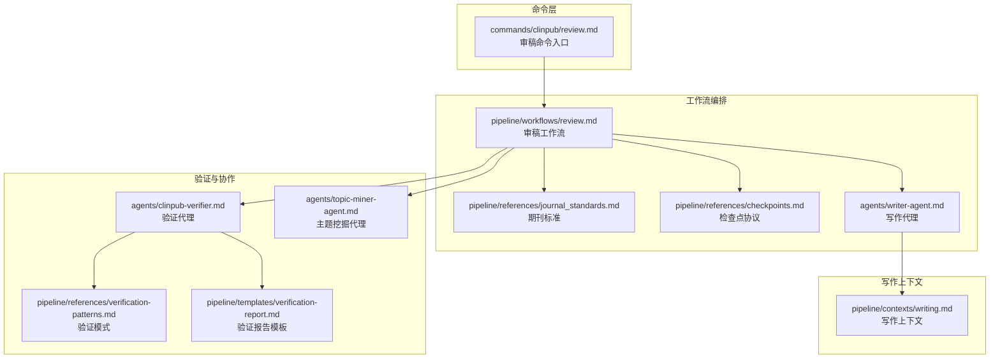
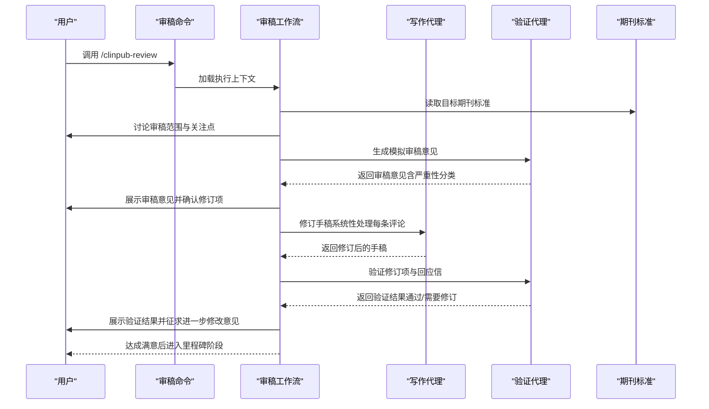
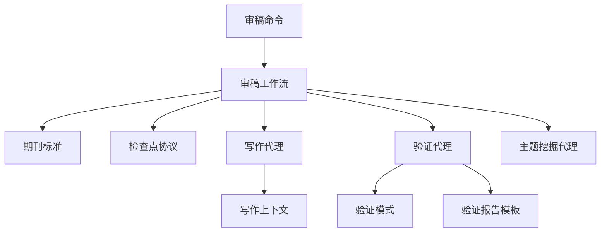

# review 审稿模拟命令

<cite>
**本文档引用的文件**
- [commands/clinpub/review.md](file://commands/clinpub/review.md)
- [pipeline/workflows/review.md](file://pipeline/workflows/review.md)
- [agents/writer-agent.md](file://agents/writer-agent.md)
- [agents/clinpub-verifier.md](file://agents/clinpub-verifier.md)
- [agents/topic-miner-agent.md](file://agents/topic-miner-agent.md)
- [pipeline/references/journal_standards.md](file://pipeline/references/journal_standards.md)
- [pipeline/references/checkpoints.md](file://pipeline/references/checkpoints.md)
- [pipeline/references/verification-patterns.md](file://pipeline/references/verification-patterns.md)
- [pipeline/templates/verification-report.md](file://pipeline/templates/verification-report.md)
- [pipeline/contexts/writing.md](file://pipeline/contexts/writing.md)
</cite>

## 目录
1. [简介](#简介)
2. [项目结构](#项目结构)
3. [核心组件](#核心组件)
4. [架构概览](#架构概览)
5. [详细组件分析](#详细组件分析)
6. [依赖关系分析](#依赖关系分析)
7. [性能考虑](#性能考虑)
8. [故障排除指南](#故障排除指南)
9. [结论](#结论)
10. [附录](#附录)

## 简介
本文件详细说明了 clinpub 系统中的 review 审稿模拟命令，涵盖同行评议模拟、质量检查和修订建议的完整流程。文档重点解释审稿人视角的质量评估、合规性检查和改进建议生成机制，并阐述与 AI 代理（特别是 clinpub-verifier 和 topic-miner-agent）的协作方式。同时，文档提供了审稿检查点、质量标准、修订流程以及最终版本准备指南，帮助用户高效完成学术论文的审稿模拟与修订。

## 项目结构
review 命令位于命令目录下，其执行由工作流编排文件驱动，配合多个参考文件和代理实现端到端的审稿模拟与修订流程。

**图表来源**
- [commands/clinpub/review.md:1-35](file://commands/clinpub/review.md#L1-L35)
- [pipeline/workflows/review.md:1-134](file://pipeline/workflows/review.md#L1-L134)
- [agents/writer-agent.md:1-166](file://agents/writer-agent.md#L1-L166)
- [agents/clinpub-verifier.md:1-439](file://agents/clinpub-verifier.md#L1-L439)
- [agents/topic-miner-agent.md:1-320](file://agents/topic-miner-agent.md#L1-L320)
- [pipeline/references/journal_standards.md:1-78](file://pipeline/references/journal_standards.md#L1-L78)
- [pipeline/references/checkpoints.md:1-120](file://pipeline/references/checkpoints.md#L1-L120)
- [pipeline/references/verification-patterns.md](file://pipeline/references/verification-patterns.md)
- [pipeline/templates/verification-report.md:1-85](file://pipeline/templates/verification-report.md#L1-L85)
- [pipeline/contexts/writing.md:1-49](file://pipeline/contexts/writing.md#L1-L49)

**章节来源**
- [commands/clinpub/review.md:1-35](file://commands/clinpub/review.md#L1-L35)
- [pipeline/workflows/review.md:1-134](file://pipeline/workflows/review.md#L1-L134)

## 核心组件
- 审稿命令入口：定义审稿目标、允许工具集、执行上下文和成功标准。
- 审稿工作流：定义审稿模拟的完整步骤，包括讨论审稿范围、生成审稿意见、确认修订项、修订手稿、生成回应信、验证与循环、里程碑关闭。
- 写作代理：负责按照研究类型模板生成 IMRAD 结构的手稿，强制执行反 AI 模板规则。
- 验证代理：以对抗性思维验证数据质量、统计分析和手稿完整性，提供分类化的验证报告。
- 主题挖掘代理：在项目早期进行主题发现与文献扫描，为审稿提供背景支持。
- 期刊标准与检查点：提供目标期刊的质量要求与审稿检查点规范。
- 验证模式与报告模板：定义验证的具体模式与标准化报告格式。

**章节来源**
- [commands/clinpub/review.md:14-35](file://commands/clinpub/review.md#L14-L35)
- [pipeline/workflows/review.md:6-134](file://pipeline/workflows/review.md#L6-L134)
- [agents/writer-agent.md:7-166](file://agents/writer-agent.md#L7-L166)
- [agents/clinpub-verifier.md:1-439](file://agents/clinpub-verifier.md#L1-L439)
- [agents/topic-miner-agent.md:1-320](file://agents/topic-miner-agent.md#L1-L320)
- [pipeline/references/journal_standards.md:1-78](file://pipeline/references/journal_standards.md#L1-L78)
- [pipeline/references/checkpoints.md:1-120](file://pipeline/references/checkpoints.md#L1-L120)
- [pipeline/references/verification-patterns.md](file://pipeline/references/verification-patterns.md)
- [pipeline/templates/verification-report.md:1-85](file://pipeline/templates/verification-report.md#L1-L85)

## 架构概览
审稿模拟命令采用"工作流编排 + 代理协作 + 标准化检查"的架构。命令入口加载工作流，工作流协调多个代理完成审稿模拟、修订与验证，最终形成可提交的最终版本。

**图表来源**
- [commands/clinpub/review.md:20-26](file://commands/clinpub/review.md#L20-L26)
- [pipeline/workflows/review.md:18-121](file://pipeline/workflows/review.md#L18-L121)
- [agents/writer-agent.md:138-147](file://agents/writer-agent.md#L138-L147)
- [agents/clinpub-verifier.md:415-428](file://agents/clinpub-verifier.md#L415-L428)
- [pipeline/references/journal_standards.md:1-78](file://pipeline/references/journal_standards.md#L1-L78)

## 详细组件分析

### 审稿命令入口（commands/clinpub/review.md）
- 目标：在目标期刊级别进行严格的同行评议模拟，随后迭代修订手稿。
- 覆盖范围：统计方法、样本量、混杂因素、结果解释、语言、引文、图表。
- 成功标准：生成审稿意见（含重大/轻微分类）、逐项处理修订、修订反映在手稿中、生成逐点回应信、最终手稿置于 final/ 目录且用户满意。

**章节来源**
- [commands/clinpub/review.md:14-35](file://commands/clinpub/review.md#L14-L35)

### 审稿工作流（pipeline/workflows/review.md）
- 目的：在目标期刊级别模拟严格同行评议，然后迭代修订手稿。
- 步骤：
  1) 讨论审稿范围：审稿严格程度、关注领域、补充文献搜索。
  2) 生成审稿：生成模拟审稿意见，分为重大和轻微两类，每条评论包含位置、问题描述、修订建议和严重性。
  3) 确认修订项：向用户展示所有审稿意见，确认需要处理的项目，可添加额外修订请求。
  4) 修订手稿：系统性处理每条评论，跟踪每条评论的变更；重大评论可能需要补充分析或额外文献搜索；轻微评论直接编辑手稿。
  5) 生成回应信：逐点回应审稿意见，包含致谢、解释变更原因、未变更时的合理理由以及修订稿中的具体位置引用。
  6) 验证与循环：验证所有确认的项目均已处理、回应信完整，向用户展示，若用户要求进一步修改则回到修订步骤，否则进入里程碑。
  7) 里程碑：正式关闭第四阶段，收集审稿决定、生成里程碑文件、更新路线图与状态、向用户呈现项目完成摘要。

- 成功标准：生成重大/轻微分类的审稿意见；用户确认修订项；所有确认项在手稿中得到处理；逐点回应信完整；新增引文加入 references.bib；最终手稿位于 05_Manuscript/final/；用户对修订满意。

**章节来源**
- [pipeline/workflows/review.md:6-134](file://pipeline/workflows/review.md#L6-L134)

### 写作代理（agents/writer-agent.md）
- 角色：IMRAD 手稿写作专家，遵循研究类型模板，使用中文撰写正文，图表/表格使用英文。
- 执行流程：
  - 加载上下文：读取项目配置、输出清单、参考文献与研究类型模板。
  - 草拟方法：遵循 STROBE/CONSORT（视情况而定），报告研究设计、人群、变量定义、统计方法与软件版本。
  - 草拟结果：自然地在文本流程中引用图表/表格，报告效应量+95%CI+精确 p 值，先主结局后次要分析。
  - 草拟引言：漏斗结构（背景→已知→空白→目标）。
  - 草拟讨论：总结→比较→机制→临床意义→局限→结论与未来方向。
  - 草拟摘要：最后撰写，结构化摘要。
  - 写清单：完成手稿并通过反 AI 模板检查后，在 05_Manuscript/ 中写入 MANIFEST.yaml 并声明验证代理为消费者。
- 反 AI 模板规则：避免公式化段落、重复过渡词、句式单一、空洞结论、僵硬引用与过度解释统计方法。

**章节来源**
- [agents/writer-agent.md:15-166](file://agents/writer-agent.md#L15-L166)

### 验证代理（agents/clinpub-verifier.md）
- 角色：跨阶段验证代理，以对抗性思维验证数据质量（第一阶段）、统计分析（第二阶段）与手稿完整性（第三阶段）。
- 验证过程：
  - 阶段检测：根据 STATE.md 或目录内容判断当前阶段，路由到适用的验证模式。
  - 第一阶段验证：验证 cleaned.csv 完整性、应用数据质量模式（缺失值处理、数据分割完整性）、检查数据质量报告。
  - 第二阶段验证：验证输出完整性、应用统计有效性模式（描述性交叉检查、模型输出一致性、ROC/AUC 验证、多重比较检查）、检查可重现性与数据完整性、核对图表与表格一致性。
  - 第三阶段验证：验证手稿结构（IMRAD）、引文完整性（Vancouver 格式、DOI）、图表引用与分辨率、反 AI 检查（Humanizer）。
  - 总结：基于阶段特定状态确定总体结果（通过/存在缺口/需要人工审核）。
- 输出：在 .clinpub/phases/XX-name/ 生成 VERIFICATION.md 报告，包含检查清单、问题发现与总体状态。

**章节来源**
- [agents/clinpub-verifier.md:33-439](file://agents/clinpub-verifier.md#L33-L439)

### 主题挖掘代理（agents/topic-miner-agent.md）
- 角色：临床研究主题挖掘顾问，读取患者水平数据，生成变量档案，扫描 PubMed 发现研究空白，提出 3-5 个结构化候选论文主题与可行性评分。
- 执行流程：
  - 数据档案：生成变量清单、分布摘要、缺失模式、相关矩阵，自动推断变量角色，预测研究类型，评估样本量。
  - 文献扫描：并行子代理搜索 PubMed，识别高影响论文、研究趋势与研究空白，寻找复合新颖性。
  - 生成主题：综合数据档案与文献扫描，生成 3-5 个候选主题，包含研究问题与假设、变量映射、分析方法、新颖性、目标期刊与风险提示。
  - 生成项目配置：根据用户选择的主题生成 project_config.yml，指导启动完整分析管线。
- 关键规则：不进行统计分析或手稿写作；每个主题必须经 PubMed 文献验证；变量角色自动检测仅为建议，需用户确认；如实报告生成能力，若数据无法支撑某主题类型则明确指出。

**章节来源**
- [agents/topic-miner-agent.md:19-320](file://agents/topic-miner-agent.md#L19-L320)

### 期刊标准与检查点
- 期刊标准：提供目标期刊（如 Alzheimer's & Dementia、Molecular Psychiatry）的方法学要求、报告规范、统计报告要求、新颖性与影响力、常见拒稿原因与图表技术规范。
- 检查点协议：定义决策、验证与里程碑三类检查点，确保每个检查点有明确的恢复信号与状态持久化，里程碑记录包含成功标准验证、关键决策、产出文件、未解决问题与用户签字。

**章节来源**
- [pipeline/references/journal_standards.md:1-78](file://pipeline/references/journal_standards.md#L1-L78)
- [pipeline/references/checkpoints.md:1-120](file://pipeline/references/checkpoints.md#L1-L120)

### 验证模式与报告模板
- 验证模式：定义统计有效性检查、可重现性验证、数据完整性链与图表一致性核对等模式。
- 验证报告模板：标准化报告格式，包含检查项、问题发现、可重现性确认与数据流验证，支持签名确认与结果标注。

**章节来源**
- [pipeline/references/verification-patterns.md](file://pipeline/references/verification-patterns.md)
- [pipeline/templates/verification-report.md:1-85](file://pipeline/templates/verification-report.md#L1-L85)

## 依赖关系分析
审稿命令与工作流依赖于多个参考文件与代理，形成清晰的耦合与协作关系。

**图表来源**
- [commands/clinpub/review.md:20-26](file://commands/clinpub/review.md#L20-L26)
- [pipeline/workflows/review.md:10-14](file://pipeline/workflows/review.md#L10-L14)
- [agents/writer-agent.md:12-13](file://agents/writer-agent.md#L12-L13)
- [agents/clinpub-verifier.md:10-12](file://agents/clinpub-verifier.md#L10-L12)
- [agents/topic-miner-agent.md:3-4](file://agents/topic-miner-agent.md#L3-L4)
- [pipeline/references/journal_standards.md:1-2](file://pipeline/references/journal_standards.md#L1-L2)
- [pipeline/references/checkpoints.md:1-2](file://pipeline/references/checkpoints.md#L1-L2)
- [pipeline/references/verification-patterns.md](file://pipeline/references/verification-patterns.md)
- [pipeline/templates/verification-report.md:1-2](file://pipeline/templates/verification-report.md#L1-L2)
- [pipeline/contexts/writing.md:1-2](file://pipeline/contexts/writing.md#L1-L2)

**章节来源**
- [commands/clinpub/review.md:20-26](file://commands/clinpub/review.md#L20-L26)
- [pipeline/workflows/review.md:10-14](file://pipeline/workflows/review.md#L10-L14)

## 性能考虑
- 快速验证：验证代理强调使用 grep/文件检查而非重新运行分析，以提高验证效率。
- 并行文献扫描：主题挖掘代理通过并行子代理扫描 PubMed，确保深度覆盖与复合新颖性检测。
- 循环优化：审稿工作流通过用户确认与验证反馈形成闭环，避免无效重复工作。
- 可重现性优先：验证代理要求随机种子、路径与版本信息明确，减少调试成本。

[本节为一般性指导，无需引用具体文件]

## 故障排除指南
- 审稿意见未生成：检查工作流是否正确加载期刊标准与写作代理，确认命令入口允许的工具集是否满足需求。
- 修订项未处理：检查修订步骤是否系统性处理每条评论，重大评论是否需要补充分析或文献搜索。
- 回应信不完整：确认逐点回应信包含致谢、变更解释、未变更理由与修订稿位置引用。
- 验证失败：根据验证报告模板逐项检查问题发现与可重现性确认，修复后重新验证。
- 里程碑未完成：检查成功标准是否全部满足，关键决策与产出文件是否齐全，用户签字是否完成。

**章节来源**
- [pipeline/workflows/review.md:125-133](file://pipeline/workflows/review.md#L125-L133)
- [agents/clinpub-verifier.md:415-428](file://agents/clinpub-verifier.md#L415-L428)
- [pipeline/templates/verification-report.md:25-85](file://pipeline/templates/verification-report.md#L25-L85)

## 结论
review 审稿模拟命令通过严谨的工作流编排与多代理协作，实现了从审稿模拟、修订建议到最终版本准备的全流程管理。结合期刊标准、检查点协议与验证代理的对抗性验证，能够有效提升论文质量与投稿成功率。建议在每次审稿循环中严格执行验证与用户确认流程，确保重大与轻微问题均得到妥善处理。

[本节为总结性内容，无需引用具体文件]

## 附录

### 审稿检查点与质量标准
- 统计方法：适当性与完整性、样本量与统计效能、混杂控制、结果解释与过度解读、研究设计局限。
- 语言与格式：语法与拼写、引文完整性与相关性、图表格式与清晰度、报告规范（STROBE/CONSORT）合规。
- 目标期刊要求：效应量+95%CI、精确 p 值、多重比较校正、软件版本、假设检验结果、数据公开。

**章节来源**
- [pipeline/workflows/review.md:29-46](file://pipeline/workflows/review.md#L29-L46)
- [pipeline/references/journal_standards.md:28-35](file://pipeline/references/journal_standards.md#L28-L35)

### 修订流程与策略
- 系统性处理：逐条处理审稿意见，重大评论优先，必要时补充分析或文献搜索。
- 变更追踪：保持原始与修订版本对比，更新引文并在 references.bib 中添加新条目。
- 回应信编写：逐点回应，包含致谢、解释与位置引用，未变更时提供合理理由。
- 最终准备：确保手稿位于 final/ 目录，用户满意后进入里程碑阶段。

**章节来源**
- [pipeline/workflows/review.md:58-98](file://pipeline/workflows/review.md#L58-L98)

### 实际审稿示例与质量提升技巧
- 示例结构：重大评论优先，包含位置、问题描述、修订建议与严重性；轻微评论聚焦语言、引文与图表格式。
- 质量提升技巧：在写作阶段强制执行反 AI 模板规则，确保段落流畅、句式多样、引用自然；在验证阶段严格检查图表分辨率与一致性；在修订阶段保持与审稿意见的逐点对应。

**章节来源**
- [pipeline/workflows/review.md:27-46](file://pipeline/workflows/review.md#L27-L46)
- [agents/writer-agent.md:110-136](file://agents/writer-agent.md#L110-L136)
- [agents/clinpub-verifier.md:417-426](file://agents/clinpub-verifier.md#L417-L426)