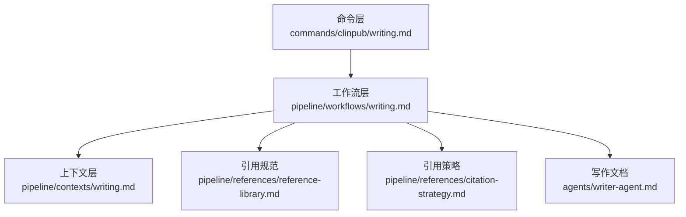
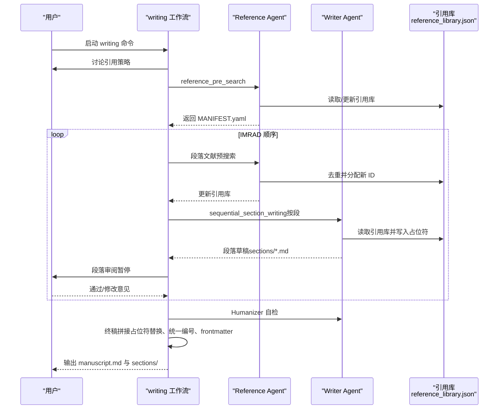
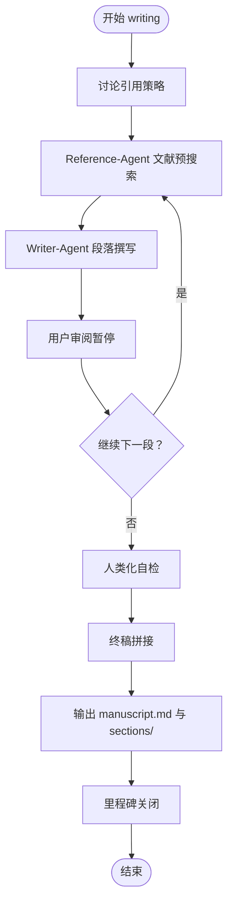
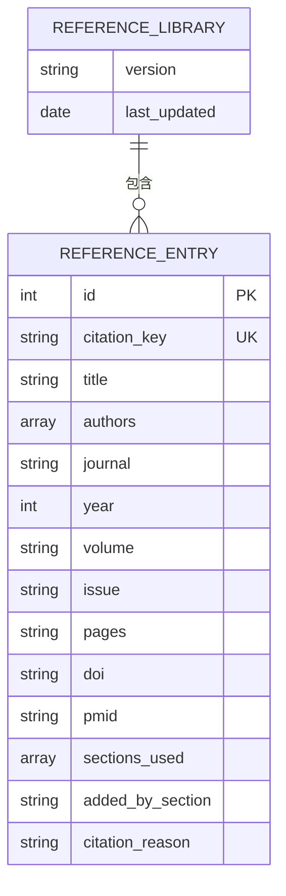
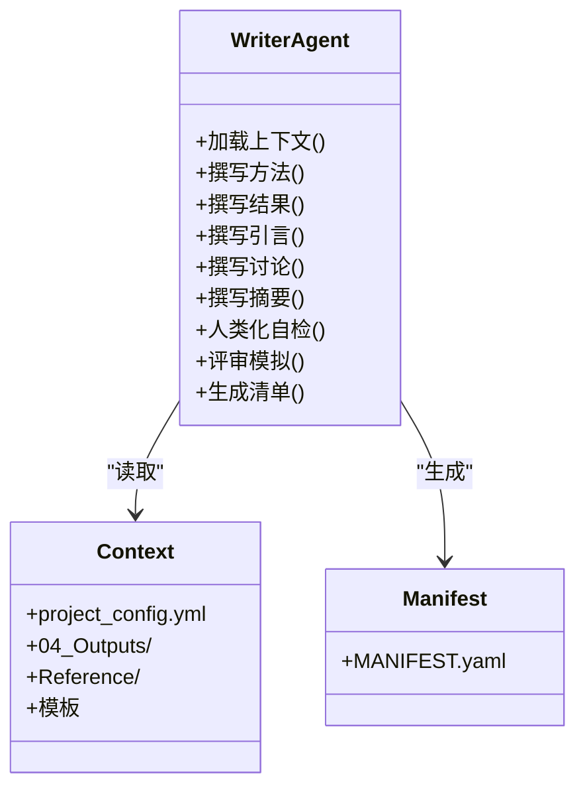
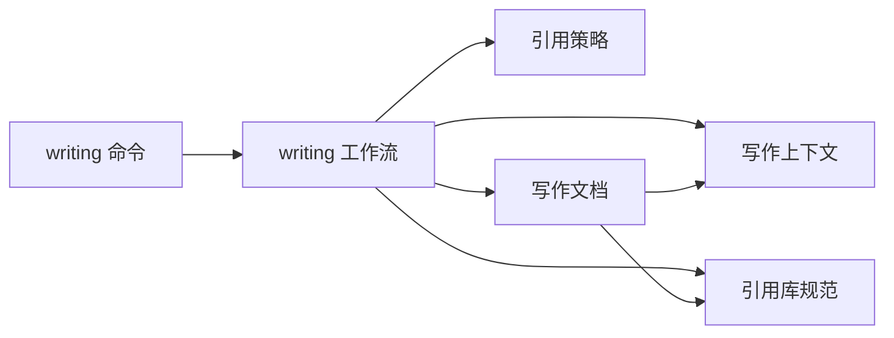

# writing 论文写作命令

<cite>
**本文档引用的文件**
- [commands/clinpub/writing.md](file://commands/clinpub/writing.md)
- [agents/writer-agent.md](file://agents/writer-agent.md)
- [pipeline/workflows/writing.md](file://pipeline/workflows/writing.md)
- [pipeline/references/citation-strategy.md](file://pipeline/references/citation-strategy.md)
- [pipeline/references/reference-library.md](file://pipeline/references/reference-library.md)
- [pipeline/contexts/writing.md](file://pipeline/contexts/writing.md)
</cite>

## 目录
1. [简介](#简介)
2. [项目结构](#项目结构)
3. [核心组件](#核心组件)
4. [架构总览](#架构总览)
5. [详细组件分析](#详细组件分析)
6. [依赖关系分析](#依赖关系分析)
7. [性能考量](#性能考量)
8. [故障排查指南](#故障排查指南)
9. [结论](#结论)
10. [附录](#附录)

## 简介
本文件系统化阐述 clinpub 的 writing 命令，覆盖论文写作阶段的完整流程：IMRAD 结构化写作、模板应用与文档生成；详述 writer-agent 与 reference-agent 的协作机制及 AI 辅助写作的规范；解释论文草稿生成、图表插入、引用管理与格式标准化；并提供模板使用方法、写作质量标准、期刊适配策略与格式调整指南，辅以实际写作示例与编辑技巧。

## 项目结构
writing 命令位于命令层，编排工作流在 pipeline 层，引用与模板规范在 references 与 contexts 层，agent 层定义了具体的写作与检索角色。

**图示来源**
- [commands/clinpub/writing.md:1-56](file://commands/clinpub/writing.md#L1-L56)
- [pipeline/workflows/writing.md:1-330](file://pipeline/workflows/writing.md#L1-L330)
- [pipeline/contexts/writing.md:1-49](file://pipeline/contexts/writing.md#L1-L49)
- [pipeline/references/reference-library.md:1-214](file://pipeline/references/reference-library.md#L1-L214)
- [pipeline/references/citation-strategy.md:1-88](file://pipeline/references/citation-strategy.md#L1-L88)
- [agents/writer-agent.md:1-166](file://agents/writer-agent.md#L1-L166)

**章节来源**
- [commands/clinpub/writing.md:1-56](file://commands/clinpub/writing.md#L1-L56)
- [pipeline/workflows/writing.md:1-330](file://pipeline/workflows/writing.md#L1-L330)

## 核心组件
- writing 命令：定义 Phase 3 的 IMRAD 顺序写作目标、工具许可、执行上下文与成功标准。
- writing 工作流：定义引用策略讨论、逐段写作循环、人类化审查、终稿拼接与里程碑关闭等步骤。
- 引用策略：规定引用总量、段落配比、年限与 IF 偏好、格式与层级关系。
- 引用库规范：定义共享引用库结构、字段、去重规则、Vancouver 格式与交叉引用占位符。
- 写作文档：定义 writer-agent 的角色、执行流程、人类化规则、评审模拟与关键约束。
- 写作上下文：定义语言政策、章节顺序、模板类型与目标期刊标准。

**章节来源**
- [commands/clinpub/writing.md:14-56](file://commands/clinpub/writing.md#L14-L56)
- [pipeline/workflows/writing.md:23-330](file://pipeline/workflows/writing.md#L23-L330)
- [pipeline/references/citation-strategy.md:6-88](file://pipeline/references/citation-strategy.md#L6-L88)
- [pipeline/references/reference-library.md:13-214](file://pipeline/references/reference-library.md#L13-L214)
- [agents/writer-agent.md:7-166](file://agents/writer-agent.md#L7-L166)
- [pipeline/contexts/writing.md:5-49](file://pipeline/contexts/writing.md#L5-L49)

## 架构总览
writing 命令驱动的 IMRAD 写作采用“两代理协同 + 顺序审阅”的流水线式架构：reference-agent 负责文献预搜索与共享引用库维护，writer-agent 负责按模板与上下文撰写各段，并内置人类化自检；工作流在每段完成后暂停等待用户审阅，确保可控迭代；终稿拼接阶段统一替换占位符、重排引用编号并生成 YAML frontmatter。

**图示来源**
- [pipeline/workflows/writing.md:25-289](file://pipeline/workflows/writing.md#L25-L289)
- [agents/writer-agent.md:15-108](file://agents/writer-agent.md#L15-L108)
- [pipeline/references/reference-library.md:154-187](file://pipeline/references/reference-library.md#L154-L187)

## 详细组件分析

### writing 命令
- 目标与范围：Phase 3 的 IMRAD 顺序写作，按 Introduction → Methods → Results → Discussion 顺序独立撰写，每段完成后用户审阅暂停。
- 工具许可：Read、Write、Edit、Glob、Grep、Bash、AskUserQuestion。
- 执行上下文：加载工作流、期刊标准、引用库与写作上下文。
- 成功标准：四段独立完成、引用库去重、占位符交叉引用、全文 >5000 字、无 AI 模板模式。

**章节来源**
- [commands/clinpub/writing.md:14-56](file://commands/clinpub/writing.md#L14-L56)

### writing 工作流
- 引用策略讨论：与用户确认各段引用数量、时间范围、IF 偏好，写入 project_config.yml 的 citation_strategy。
- 逐段写作循环：
  - Reference-Agent 文献预搜索：按段落关键词与配比搜索，更新共享引用库。
  - Writer-Agent 撰写：按研究类型模板与上下文生成草稿，使用占位符进行交叉引用。
  - 用户审阅暂停：提供审阅清单与下一步选项。
- 人类化自检：在每段撰写前后执行，避免 AI 模板化表达。
- 终稿拼接：按 IMRAD 顺序合并段落，替换占位符、统一编号、生成 YAML frontmatter。
- 里程碑关闭：校验成功标准并推进到下一阶段。

**图示来源**
- [pipeline/workflows/writing.md:25-289](file://pipeline/workflows/writing.md#L25-L289)

**章节来源**
- [pipeline/workflows/writing.md:25-330](file://pipeline/workflows/writing.md#L25-L330)

### 引用策略
- 总量约束：30-55 篇，硬约束；段落配比弹性 ±20%，优先缩减 Discussion。
- 年限策略：默认近 5 年，landmark 经典文献可例外。
- IF 偏好：每次写作前与用户讨论，影响搜索筛选但不强制排除。
- 格式规范：Vancouver 编号制，正文 [1][2]，末尾统一 References 区，所有引用必须有 DOI。

**章节来源**
- [pipeline/references/citation-strategy.md:6-88](file://pipeline/references/citation-strategy.md#L6-L88)

### 引用库规范
- 共享引用库结构：version、last_updated、references 数组，每条目含 id、citation_key、title、authors、journal、year、volume、issue、pages、doi、pmid、sections_used、added_by_section、citation_reason。
- 去重与编号：以 citation_key 去重，已存在复用 id，不存在分配 max_id+1；DOI 必填。
- 占位符与编号：段内主观编号，拼接时按 IMRAD 顺序全局重编号；Method 与 Section 占位符在拼接时替换为真实文本。
- 读写流程：每段前读取/更新引用库；段内引用使用 {{ref:citation_key}} 标记；拼接时解析 [id] 并生成 References 区。

**图示来源**
- [pipeline/references/reference-library.md:15-40](file://pipeline/references/reference-library.md#L15-L40)

**章节来源**
- [pipeline/references/reference-library.md:13-214](file://pipeline/references/reference-library.md#L13-L214)

### 写作文档（writer-agent）
- 角色定位：IMRAD 手稿撰写专家，中文正文、英文图表表格，遵循研究类型模板，强制人类化规则。
- 执行流程：
  - 加载上下文：读取 project_config.yml、04_Outputs/、Reference/、模板与研究类型。
  - 段落顺序：Methods → Results → Introduction → Discussion → Abstract（最后）。
  - 关键规则：每段写入独立文件；自然成段、不使用 bullet point；每段撰写后执行人类化自检；STROBE/CONSORT 覆盖；Manifes.yaml 由 writer-agent 在最终阶段生成。
- 人类化规则：避免序列式段落开头、重复过渡词、句式单一、空泛结论、无主语引用与过度解释统计方法；提供自检清单与修复建议。
- 评审模拟：生成 review_v1.md（分类 Major/Minor），用户确认后修订并生成逐点回复信，直至满意。

**图示来源**
- [agents/writer-agent.md:15-108](file://agents/writer-agent.md#L15-L108)

**章节来源**
- [agents/writer-agent.md:7-166](file://agents/writer-agent.md#L7-L166)

### 写作上下文
- 语言政策：正文中文、图表表格英文；引用 Vancouver 格式并要求 DOI。
- 章节顺序：Methods → Results → Introduction → Discussion → Abstract（最后）。
- 模板类型：RCT（CONSORT）、队列/病例对照/横断面/描述性（STROBE）。
- 目标期刊标准：如 Alzheimer’s & Dementia、Molecular Psychiatry 的 IF 与方法学要求（效应量、95%CI、精确 p 值、多重比较校正、软件版本）。

**章节来源**
- [pipeline/contexts/writing.md:5-49](file://pipeline/contexts/writing.md#L5-L49)

## 依赖关系分析
- 命令层依赖工作流层；工作流层依赖上下文与引用规范；写作文档依赖引用库与模板；引用库依赖共享 JSON 文件与 MANIFEST.yaml。
- 关键耦合点：
  - 引用库去重与编号规则贯穿 reference-pre-search 与拼接阶段。
  - 占位符体系在段落撰写与拼接阶段双向转换。
  - 人类化规则在每段撰写前后执行，保证输出风格一致。

**图示来源**
- [commands/clinpub/writing.md:34-39](file://commands/clinpub/writing.md#L34-L39)
- [pipeline/workflows/writing.md:10-17](file://pipeline/workflows/writing.md#L10-L17)
- [agents/writer-agent.md:50](file://agents/writer-agent.md#L50)

**章节来源**
- [commands/clinpub/writing.md:34-39](file://commands/clinpub/writing.md#L34-L39)
- [pipeline/workflows/writing.md:10-17](file://pipeline/workflows/writing.md#L10-L17)

## 性能考量
- 搜索效率：按段落关键词精准搜索，结合 IF 偏好与 landmark 例外减少无关文献，提升去重与筛选效率。
- 拼接性能：占位符替换与引用重编号采用单次扫描策略，避免多次 IO；建议在本地磁盘执行以降低网络延迟。
- 人类化自检：在段落级别执行，避免全篇重写带来的计算开销；针对常见 AI 模式提供快速修复路径。
- 版本控制：引用库 version 字段与 last_updated 时间戳便于追踪变更与回滚。

## 故障排查指南
- 引用库缺失或损坏
  - 现象：段落引用无法解析或编号异常。
  - 排查：检查 Reference/reference_library.json 是否存在且结构正确；确认 sections_used 字段是否包含当前段。
  - 处理：若损坏，按规范重建空库并重新执行 reference_pre_search。
- DOI 缺失
  - 现象：拼接后 References 区缺少 DOI 或段落末尾标注 ⚠️。
  - 排查：核对引用条目的 doi 字段；确认 citation_strategy 的 IF 偏好是否导致遗漏高 IF 文献。
  - 处理：手动补全 DOI 或调整策略后重新拼接。
- 占位符残留
  - 现象：终稿中仍有 {{Table:N}}、{{Figure:N}} 等未替换。
  - 排查：检查拼接协议是否执行；确认占位符命名是否符合规范。
  - 处理：按规范替换后重新生成 manuscript.md。
- 人类化自检不通过
  - 现象：提示序列式段落、重复过渡词或句式单一。
  - 排查：对照人类化规则清单逐项修正；必要时简化句式或替换连接词。
  - 处理：在当前段内直接修改，无需重写全篇。
- 模板未匹配
  - 现象：Methods 段内容与研究类型不符。
  - 排查：确认 project_config.yml 中 study_type 与 pipeline/templates/study_types/ 文件对应。
  - 处理：选择正确模板或调整 study_type。

**章节来源**
- [pipeline/references/reference-library.md:154-187](file://pipeline/references/reference-library.md#L154-L187)
- [agents/writer-agent.md:110-136](file://agents/writer-agent.md#L110-L136)
- [pipeline/workflows/writing.md:198-260](file://pipeline/workflows/writing.md#L198-L260)

## 结论
writing 命令通过“两代理协同 + 顺序审阅 + 终稿拼接”的流水线，实现了 IMRAD 结构化写作与高质量产出。引用策略与引用库规范确保引用的科学性与一致性，人类化规则保障语言风格的人类化与专业性。通过严格的成功标准与里程碑关闭，writing 为后续评审与发表奠定了坚实基础。

## 附录

### 实际写作示例与编辑技巧
- 引言段：采用漏斗结构（疾病负担 → 已知证据 → 研究空白 → 研究目标），避免空泛陈述；引用数量控制在 10-15 篇，强调 DOI 与权威来源。
- 方法段：严格遵循 STROBE/CONSORT；描述研究设计、人群与采样、变量与定义、统计方法与软件版本；引用数量 3-5 篇，优先方法学来源与已发表协议。
- 结果段：主次分明，先报告主要结局，再呈现次要分析；自然引入图表，避免“如表 X 所示”句式开头；报告效应量 + 95%CI + 精确 p 值。
- 讨论段：总结 → 对比 → 机制 → 临床意义 → 局限 → 结论与未来方向；避免空泛结论，提出具体研究方向；引用数量 15-25 篇，突出对比与机制。
- 抽查与修改：每段完成后暂停审阅，聚焦结构、引用量、占位符与语言风格；针对人类化规则逐项修正，确保自然流畅。

**章节来源**
- [pipeline/contexts/writing.md:11-49](file://pipeline/contexts/writing.md#L11-L49)
- [agents/writer-agent.md:74-102](file://agents/writer-agent.md#L74-L102)