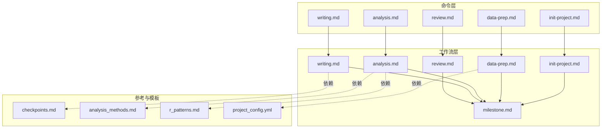
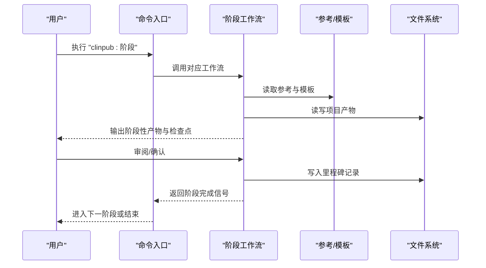
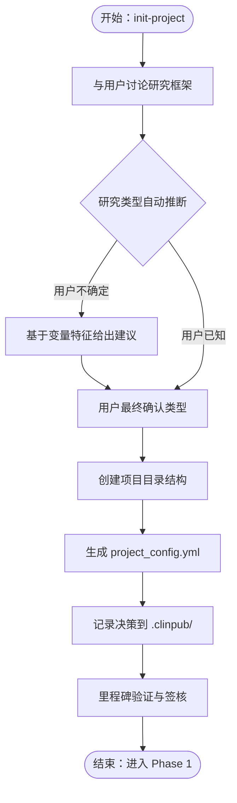
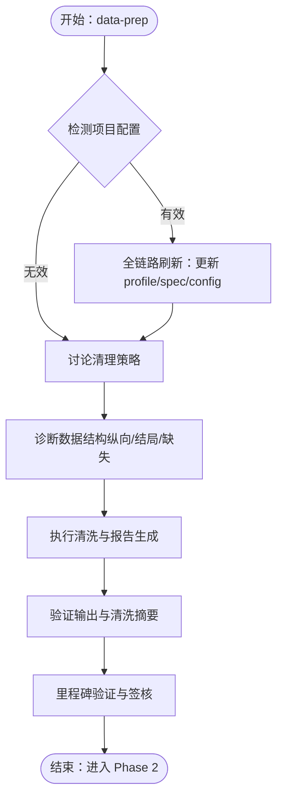
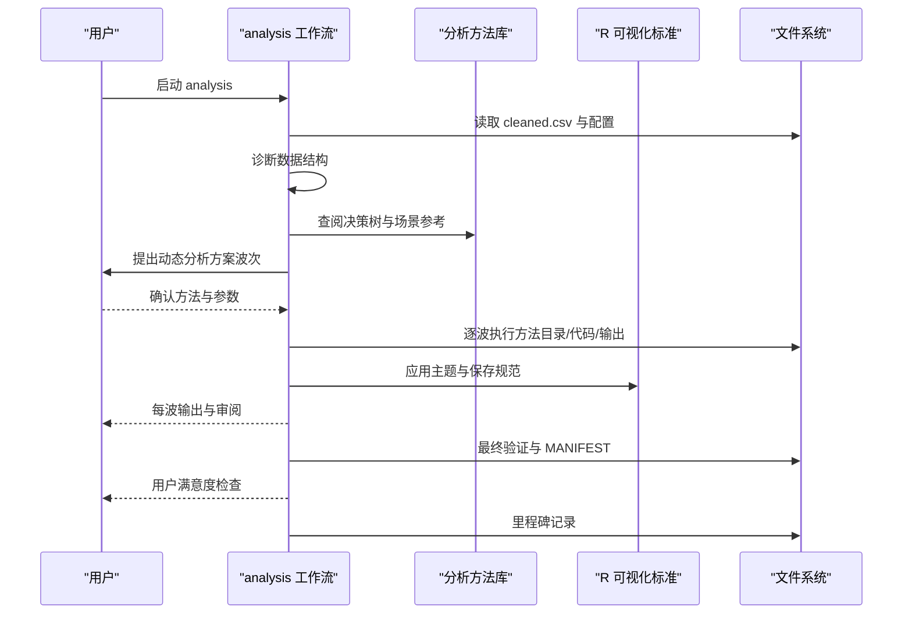
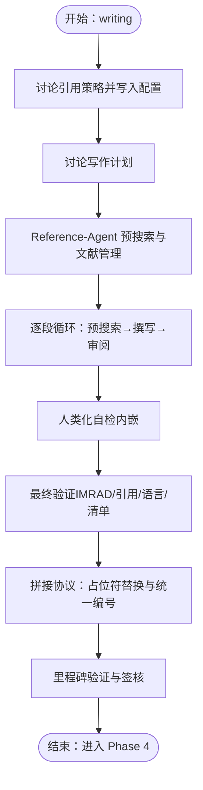
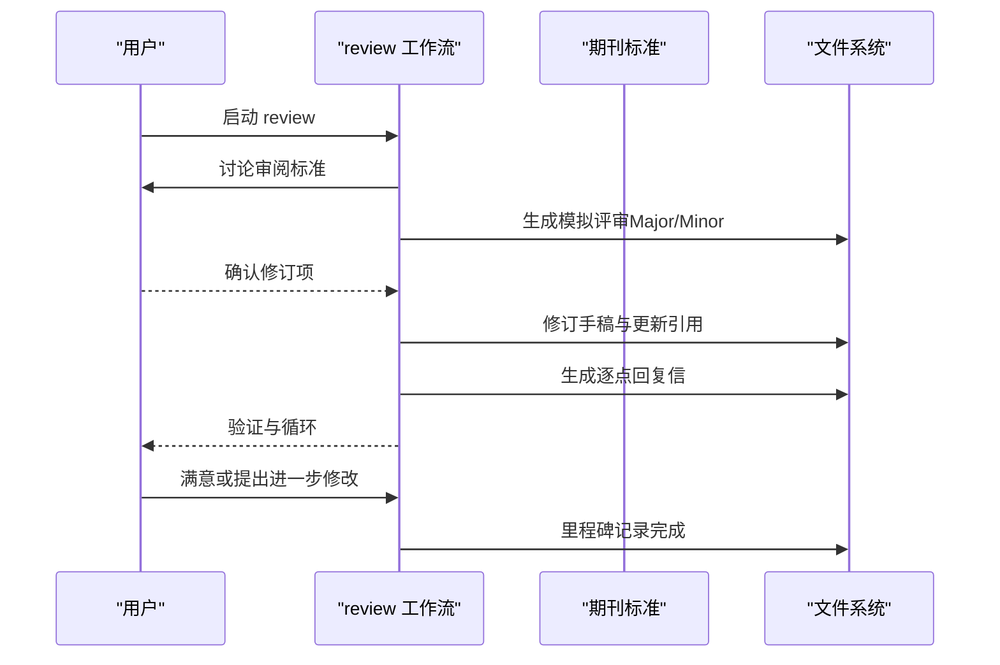
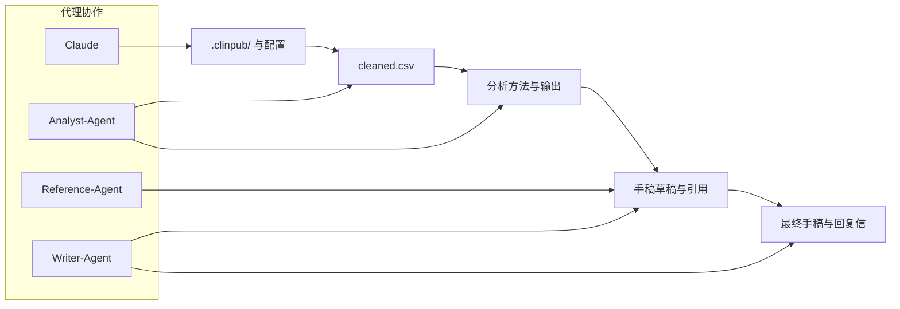

# 五阶段核心命令

<cite>
**本文档引用的文件**
- [init-project.md](file://commands/clinpub/init-project.md)
- [data-prep.md](file://commands/clinpub/data-prep.md)
- [analysis.md](file://commands/clinpub/analysis.md)
- [writing.md](file://commands/clinpub/writing.md)
- [review.md](file://commands/clinpub/review.md)
- [init-project.md](file://pipeline/workflows/init-project.md)
- [data-prep.md](file://pipeline/workflows/data-prep.md)
- [analysis.md](file://pipeline/workflows/analysis.md)
- [writing.md](file://pipeline/workflows/writing.md)
- [review.md](file://pipeline/workflows/review.md)
- [milestone.md](file://pipeline/workflows/milestone.md)
- [checkpoints.md](file://pipeline/references/checkpoints.md)
- [analysis_methods.md](file://pipeline/references/analysis_methods.md)
- [r_patterns.md](file://pipeline/references/r_patterns.md)
- [project_config.yml](file://pipeline/templates/project_config.yml)
</cite>

## 目录
1. [简介](#简介)
2. [项目结构](#项目结构)
3. [核心组件](#核心组件)
4. [架构总览](#架构总览)
5. [详细组件分析](#详细组件分析)
6. [依赖关系分析](#依赖关系分析)
7. [性能考量](#性能考量)
8. [故障排查指南](#故障排查指南)
9. [结论](#结论)
10. [附录](#附录)

## 简介
本文件系统化阐述 clinpub 的五阶段核心命令：init-project、data-prep、analysis、writing、review。围绕每个阶段的前置条件、执行流程、关键输出、质量标准、阶段间依赖、用户审查与断点续做机制，提供面向使用者与技术读者的双重视角说明，并结合工作流与参考规范，给出参数与配置要点、AI 代理协作模式及质量门控检查点。

## 项目结构
- 命令入口位于 commands/clinpub/，每个阶段对应一个命令文件，声明工具许可、执行上下文与成功标准。
- 工作流位于 pipeline/workflows/，定义阶段内步骤、检查点与里程碑协议。
- 参考规范位于 pipeline/references/，包括分析方法库、R 可视化标准、检查点与里程碑协议等。
- 模板位于 pipeline/templates/，用于生成项目配置、项目文档、路线图、状态等。

**图表来源**
- [init-project.md:1-34](file://commands/clinpub/init-project.md#L1-L34)
- [data-prep.md:1-50](file://commands/clinpub/data-prep.md#L1-L50)
- [analysis.md:1-37](file://commands/clinpub/analysis.md#L1-L37)
- [writing.md:1-56](file://commands/clinpub/writing.md#L1-L56)
- [review.md:1-35](file://commands/clinpub/review.md#L1-L35)
- [init-project.md:1-124](file://pipeline/workflows/init-project.md#L1-L124)
- [data-prep.md:1-184](file://pipeline/workflows/data-prep.md#L1-L184)
- [analysis.md:1-289](file://pipeline/workflows/analysis.md#L1-L289)
- [writing.md:1-330](file://pipeline/workflows/writing.md#L1-L330)
- [review.md:1-134](file://pipeline/workflows/review.md#L1-L134)
- [milestone.md:1-163](file://pipeline/workflows/milestone.md#L1-L163)
- [checkpoints.md:1-120](file://pipeline/references/checkpoints.md#L1-L120)
- [analysis_methods.md:1-311](file://pipeline/references/analysis_methods.md#L1-L311)
- [r_patterns.md:1-532](file://pipeline/references/r_patterns.md#L1-L532)
- [project_config.yml:1-97](file://pipeline/templates/project_config.yml#L1-L97)

**章节来源**
- [init-project.md:1-34](file://commands/clinpub/init-project.md#L1-L34)
- [data-prep.md:1-50](file://commands/clinpub/data-prep.md#L1-L50)
- [analysis.md:1-37](file://commands/clinpub/analysis.md#L1-L37)
- [writing.md:1-56](file://commands/clinpub/writing.md#L1-L56)
- [review.md:1-35](file://commands/clinpub/review.md#L1-L35)

## 核心组件
- 命令层：每个阶段命令定义工具权限、执行上下文与成功标准，统一调用对应工作流。
- 工作流层：定义阶段内的步骤、检查点、里程碑与质量门控，确保可审计与可复现。
- 参考与模板：提供分析方法决策树、R 可视化标准、检查点与里程碑协议、项目配置模板等。

**章节来源**
- [checkpoints.md:1-120](file://pipeline/references/checkpoints.md#L1-L120)
- [project_config.yml:1-97](file://pipeline/templates/project_config.yml#L1-L97)

## 架构总览
五阶段命令遵循“阶段-里程碑”门控模式：每个阶段结束即进行里程碑验证，满足标准后方可进入下一阶段。阶段间通过共享的 .clinpub/、项目配置与中间产物（cleaned.csv、分析输出、手稿草稿）实现数据与状态传递。

**图表来源**
- [init-project.md:1-124](file://pipeline/workflows/init-project.md#L1-L124)
- [data-prep.md:1-184](file://pipeline/workflows/data-prep.md#L1-L184)
- [analysis.md:1-289](file://pipeline/workflows/analysis.md#L1-L289)
- [writing.md:1-330](file://pipeline/workflows/writing.md#L1-L330)
- [review.md:1-134](file://pipeline/workflows/review.md#L1-L134)
- [milestone.md:1-163](file://pipeline/workflows/milestone.md#L1-L163)

## 详细组件分析

### 初始化阶段：init-project
- 目标与职责
  - 与用户讨论研究框架，推断研究类型，生成项目目录结构与配置。
  - 仅在用户确认后创建任何文件，确保决策可追溯。
- 前置条件
  - 无项目配置；若存在则由 data-prep 阶段的“重新进入检测”接管。
- 执行流程
  - 讨论研究基础（题目、类型、目标、假设）、数据概览（来源、样本量、关键变量）、分析方法池选择、预期输出（目标期刊、图表类型、语言偏好）。
  - 自动推断研究类型（基于变量特征），但最终类型需用户确认。
  - 创建目录结构（.clinpub/、01_RawData/、02_PreprocessedData/、03_AnalysisMethods/、04_Outputs/、Reference/、05_Manuscript/、run_all.R）。
  - 生成 project_config.yml 与 .clinpub/ 决策日志。
  - 里程碑：验证成功标准、收集决策、生成 MILESTONE.md、更新 ROADMAP/STATE、请求用户签核。
- 关键输出
  - 项目目录结构、project_config.yml、.clinpub/ 决策日志、ROADMAP/STATE 更新。
- 质量标准
  - 研究框架文档化、目录结构完整、配置反映用户决策、仅创建用户确认的方法目录。
- 断点续做
  - 通过 .clinpub/ 决策日志与配置文件可随时回溯与修订。

**图表来源**
- [init-project.md:18-113](file://pipeline/workflows/init-project.md#L18-L113)

**章节来源**
- [init-project.md:1-34](file://commands/clinpub/init-project.md#L1-L34)
- [init-project.md:1-124](file://pipeline/workflows/init-project.md#L1-L124)

### 数据准备阶段：data-prep
- 目标与职责
  - 将原始数据转换为分析就绪的 cleaned.csv，生成数据质量报告，支持“重新进入刷新”。
- 前置条件
  - 项目配置存在且关键字段有效（项目名非默认、结局变量非空、原始数据目录存在且含数据文件）。
- 重新进入检测（D-05/D-07）
  - 若检测到 project_config.yml 且字段有效，则执行“全链路刷新”：更新变量字典、重新生成 spec、同步更新配置、向用户报告变更摘要。
  - 否则进入全新数据清洗流程。
- 执行流程
  - 讨论清理策略（缺失值策略、异常值处理、变量编码、派生变量、训练/验证拆分）。
  - 诊断数据结构（纵向/横断面、结局类型、结构性缺失）。
  - 执行清洗：导入数据、缺失值处理、异常值检测、派生变量与编码、生成数据质量报告、过滤纵向数据至分析时间点。
  - 验证输出：cleaned.csv 存在、维度符合预期、高缺失变量处理、数据类型正确、清洗代码可复现。
  - 里程碑：验证成功标准、收集决策、生成 MILESTONE.md、更新 ROADMAP/STATE、请求用户签核。
- 关键输出
  - 02_PreprocessedData/data/cleaned.csv、数据质量报告 HTML、清洗代码。
- 质量标准
  - cleaned.csv 存在、缺失值按策略处理、异常值记录、派生变量创建与编码、清洗代码可独立复现。
- 断点续做
  - 通过“重新进入检测”自动刷新配置与规范，减少重复劳动。

**图表来源**
- [data-prep.md:19-171](file://pipeline/workflows/data-prep.md#L19-L171)

**章节来源**
- [data-prep.md:1-50](file://commands/clinpub/data-prep.md#L1-L50)
- [data-prep.md:1-184](file://pipeline/workflows/data-prep.md#L1-L184)

### 统计分析阶段：analysis
- 目标与职责
  - 基于数据结构诊断，动态构建分析计划，按依赖顺序执行，每个方法输出图、表与方法说明。
- 前置条件
  - cleaned.csv 存在，项目配置有效。
- 执行流程
  - 诊断数据结构（组数/名称、时间点、结局类型、协变量、缺失模式、纵向标志、暴露变量）。
  - 使用分析方法库的决策树动态推荐方案，组织为“波次（wave）”，按依赖顺序执行。
  - 与用户讨论并确认方法列表、参数、颜色方案、训练/验证拆分、多重比较校正、显著性水平、结局变换等。
  - 执行波次：为每个方法创建目录、生成代码、运行、验证输出、编写方法说明。
  - 最终验证：图 ≥300 DPI、英文标签、出版级主题；统计报告包含效应量+95%CI+精确 p 值；代码从 cleaned.csv 独立可运行；R 版本与关键包版本记录。
  - 用户满意度检查：在进入里程碑前确认对当前结果是否满意，不满意则引导修正。
  - 里程碑：验证成功标准、收集决策与产出、生成 MILESTONE.md、更新 ROADMAP/STATE、请求用户签核。
- 关键输出
  - 04_Outputs/ 下的图、表与方法说明；MANIFEST.yaml。
- 质量标准
  - 每个确认方法均有完整输出；图满足出版级标准；统计报告完整；代码可独立复现；MANIFEST 记录消费者。
- 断点续做
  - 审稿阶段可追加新波次；用户不满意时可通过修正命令复检。

**图表来源**
- [analysis.md:18-269](file://pipeline/workflows/analysis.md#L18-L269)
- [analysis_methods.md:18-311](file://pipeline/references/analysis_methods.md#L18-L311)
- [r_patterns.md:66-151](file://pipeline/references/r_patterns.md#L66-L151)

**章节来源**
- [analysis.md:1-37](file://commands/clinpub/analysis.md#L1-L37)
- [analysis.md:1-289](file://pipeline/workflows/analysis.md#L1-L289)

### 写作阶段：writing
- 目标与职责
  - 按 IMRAD 顺序（引言→方法→结果→讨论）逐段撰写，每段前 reference-agent 预搜索，writer-agent 撰写，用户审阅暂停，最终拼接为 manuscript.md。
- 前置条件
  - 分析输出齐全，引用策略与写作计划已确认。
- 执行流程
  - 讨论引用策略（各段引用数量、时间范围、IF 偏好），写入 project_config.yml 的 citation_strategy。
  - 讨论写作计划（核心论点、目标期刊、结构、引用 Agent 搜索策略、图表整合）。
  - Reference Agent 预搜索：PubMed 检索、构建 citation_map.md 与 references.bib、检索全文、更新 Reference/ MANIFEST.yaml。
  - 逐段循环：Reference-Agent 预搜索 → Writer-Agent 撰写 → 用户审阅暂停。
  - 人类化自检：每段撰写前由 writer-agent 内嵌执行 Humanizer 检查。
  - 最终验证：IMRAD 结构完整、引用均有 DOI、图表/表格引用齐全、STROBE/CONSORT 覆盖、无 AI 模板模式。
  - 拼接协议：按 IMRAD 顺序合并段落，替换占位符（Table/Figure/Method/Section），统一引用编号，生成 YAML frontmatter 的 manuscript.md。
  - 里程碑：验证成功标准、收集决策与产出、生成 MILESTONE.md、更新 ROADMAP/STATE、请求用户签核。
- 关键输出
  - 05_Manuscript/sections/ 各段草稿；05_Manuscript/manuscript.md；Reference/ 下的文献资料与 MANIFEST.yaml。
- 质量标准
  - 全文 >5000 字、自然成段、引用去重、无残留占位符、IMRAD 结构完整、MANIFEST 声明消费者。
- 断点续做
  - 段落独立完成，用户审阅后进入下一段；可直接编辑 manuscript.md 进行局部修正。

**图表来源**
- [writing.md:24-304](file://pipeline/workflows/writing.md#L24-L304)

**章节来源**
- [writing.md:1-56](file://commands/clinpub/writing.md#L1-L56)
- [writing.md:1-330](file://pipeline/workflows/writing.md#L1-L330)

### 审阅阶段：review
- 目标与职责
  - 模拟目标期刊级别的同行评审，迭代修订手稿并生成逐点回复信，直至用户满意。
- 前置条件
  - 写作阶段完成，manuscript.md 与引用库可用。
- 执行流程
  - 讨论审阅标准（严格程度、关注领域、补充搜索）。
  - 生成模拟评审（Major/Minor 分类），包含定位、问题描述、建议修订与严重性。
  - 用户确认修订项，可追加额外请求，达成修订范围共识。
  - 修订手稿：系统性解决确认项，跟踪变更，必要时更新引用。
  - 生成逐点回复信：感谢评审意见、解释修改原因、引用修订位置。
  - 验证与循环：确认所有已确认项均已解决、回复信完整；若用户仍需调整则返回修订步骤；满意后进入里程碑。
  - 里程碑：验证成功标准、收集决策与产出、生成 MILESTONE.md、更新 ROADMAP/STATE、项目完成总结。
- 关键输出
  - 05_Manuscript/review_v1.md、05_Manuscript/final/manuscript.md、05_Manuscript/final/response_letter.md、更新的 references.bib。
- 质量标准
  - 评审评论完整（Major/Minor）、用户确认修订项、所有已确认项在手稿中得到解决、回复信逐点完整、最终手稿在 final/ 目录。
- 断点续做
  - 循环模式：修订→验证→再次评审，直至满意。

**图表来源**
- [review.md:16-121](file://pipeline/workflows/review.md#L16-L121)

**章节来源**
- [review.md:1-35](file://commands/clinpub/review.md#L1-L35)
- [review.md:1-134](file://pipeline/workflows/review.md#L1-L134)

## 依赖关系分析
- 阶段依赖
  - init → data-prep → analysis → writing → review，每个阶段结束经里程碑验证后方可进入下一阶段。
- 数据依赖
  - data-prep 依赖 project_config.yml 与原始数据；analysis 依赖 cleaned.csv 与分析方法库；writing 依赖分析输出与引用库；review 依赖最终手稿与引用。
- 代理协作
  - init：Claude 主导讨论与结构生成。
  - data-prep：Claude + Analyst-Agent（profile/spec/config 刷新与策略讨论）。
  - analysis：Claude + Analyst-Agent（诊断与动态方案构建）。
  - writing：Reference-Agent（文献预搜索）+ Writer-Agent（逐段撰写）。
  - review：Writer-Agent（修订）+ 用户（审阅与决策）。

**图表来源**
- [init-project.md:1-124](file://pipeline/workflows/init-project.md#L1-L124)
- [data-prep.md:1-184](file://pipeline/workflows/data-prep.md#L1-L184)
- [analysis.md:1-289](file://pipeline/workflows/analysis.md#L1-L289)
- [writing.md:1-330](file://pipeline/workflows/writing.md#L1-L330)
- [review.md:1-134](file://pipeline/workflows/review.md#L1-L134)

**章节来源**
- [milestone.md:1-163](file://pipeline/workflows/milestone.md#L1-L163)
- [checkpoints.md:1-120](file://pipeline/references/checkpoints.md#L1-L120)

## 性能考量
- 数据准备阶段
  - 缺失值与异常值处理采用分级策略，避免过度插补或删除导致样本量损失过大。
  - 纵向数据仅在需要时使用 full_longitudinal.csv，减少内存与计算压力。
- 统计分析阶段
  - 依赖顺序动态计算，避免不必要的重复执行；波次按需扩展，减少冗余分析。
  - 图表保存采用统一 DPI 与格式，兼顾质量与体积。
- 写作阶段
  - 引用库去重与统一编号，避免重复检索与人工维护成本。
  - 占位符跨段引用，减少后期拼接与校对工作量。
- 审阅阶段
  - 逐点回复信结构化，便于追踪与复核。

## 故障排查指南
- 检查点与里程碑
  - 使用 checkpoint:verify 与 milestone 协议，确保每个阶段的交付物与决策可审计。
  - 若里程碑验证未通过，可在 MILESTONE.md 中查看未解决问题并针对性修复。
- 常见问题
  - 缺失值策略争议：回到 data-prep 的讨论步骤，重新确认阈值与处理方式。
  - 分析方法不适用：回到 analysis 的讨论步骤，使用 reference-agent 的 method_search 模式获取方法概览与教程。
  - 引用重复或缺失：回到 writing 的引用预搜索与统一编号步骤，检查引用库与占位符替换。
  - 审阅意见分歧：回到 review 的修订与回复信步骤，逐点澄清与修改。
- 断点续做
  - 通过 .clinpub/ 决策日志与各阶段 MILESTONE.md 回溯历史决策，直接进入下一阶段或修正当前阶段。

**章节来源**
- [checkpoints.md:1-120](file://pipeline/references/checkpoints.md#L1-L120)
- [milestone.md:1-163](file://pipeline/workflows/milestone.md#L1-L163)

## 结论
五阶段核心命令以“阶段-里程碑”门控与“检查点-里程碑”协议保障质量与可审计性，结合 Claude 与多代理协作，形成从研究设计、数据准备、统计分析、写作到审阅的闭环流水线。通过项目配置、分析方法库与 R 可视化标准的统一规范，确保输出达到出版级质量；通过断点续做与迭代修订机制，提升用户体验与成果稳定性。

## 附录

### 参数与配置要点
- 项目配置（project_config.yml）
  - 项目基本信息：name、description、design、sample_size、target_journal、reporting_standard。
  - 变量角色：outcome、outcome_type、exposure、covariates、time_variable、event_variable、group_variable、id_variable。
  - 路径：raw_data、preprocessed、methods、outputs、reference、manuscript、progress、global。
  - 语言与质量：manuscript、figures_tables、statistics；journal_level、figure_dpi、figure_format、figure_font、figure_font_size。
  - 分析阈值：missing_threshold_low、missing_threshold_mid、missing_threshold_high、significance_level、multiple_comparison。
  - 引用策略：各段目标引用数量、总量范围、时间范围、IF 偏好。
- 分析方法库（analysis_methods.md）
  - 数据结构诊断 → 方法决策树 → 波次组织 → 场景参考。
- R 可视化标准（r_patterns.md）
  - 色彩规范、出版级主题、图表保存、显著性标注、置信区间、拼图布局、目录先行规则。

**章节来源**
- [project_config.yml:1-97](file://pipeline/templates/project_config.yml#L1-L97)
- [analysis_methods.md:1-311](file://pipeline/references/analysis_methods.md#L1-L311)
- [r_patterns.md:1-532](file://pipeline/references/r_patterns.md#L1-L532)