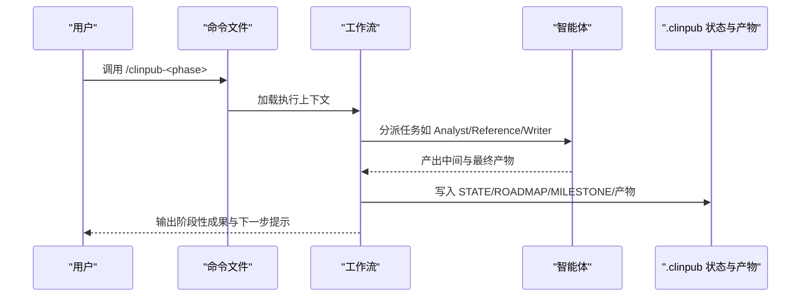
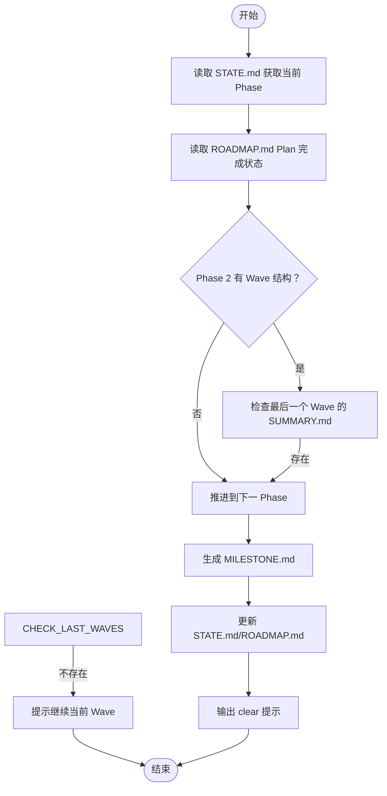
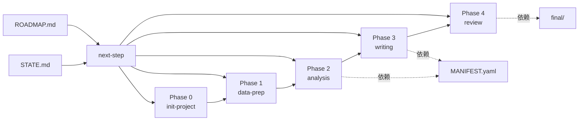

# 命令参考手册

<cite>
**本文引用的文件**
- [commands/clinpub/clinpub.md](file://commands/clinpub/clinpub.md)
- [commands/clinpub/init-project.md](file://commands/clinpub/init-project.md)
- [commands/clinpub/data-prep.md](file://commands/clinpub/data-prep.md)
- [commands/clinpub/analysis.md](file://commands/clinpub/analysis.md)
- [commands/clinpub/writing.md](file://commands/clinpub/writing.md)
- [commands/clinpub/review.md](file://commands/clinpub/review.md)
- [commands/clinpub/milestone.md](file://commands/clinpub/milestone.md)
- [commands/clinpub/modify.md](file://commands/clinpub/modify.md)
- [commands/clinpub/data2idea.md](file://commands/clinpub/data2idea.md)
- [commands/clinpub/next-step.md](file://commands/clinpub/next-step.md)
- [commands/clinpub/do.md](file://commands/clinpub/do.md)
- [.clinpub/STATE.md](file://.clinpub/STATE.md)
- [.clinpub/ROADMAP.md](file://.clinpub/ROADMAP.md)
- [.clinpub/config.json](file://.clinpub/config.json)
- [examples/project_config.example.yml](file://examples/project_config.example.yml)
- [docs/getting-started.md](file://docs/getting-started.md)
- [docs/ARCHITECTURE.md](file://docs/ARCHITECTURE.md)
</cite>

## 目录
1. [简介](#简介)
2. [项目结构](#项目结构)
3. [核心组件](#核心组件)
4. [架构总览](#架构总览)
5. [详细组件分析](#详细组件分析)
6. [依赖分析](#依赖分析)
7. [性能考虑](#性能考虑)
8. [故障排除指南](#故障排除指南)
9. [结论](#结论)
10. [附录](#附录)

## 简介
本手册面向使用 clinpub CLI 的研究人员与项目管理者，提供 10 个核心命令的权威参考：/clinpub-init-project、/clinpub-data-prep、/clinpub-analysis、/clinpub-writing、/clinpub-review、/clinpub-milestone、/clinpub-modify、/clinpub-data2idea、/clinpub-next-step、/clinpub-do。内容涵盖命令功能、参数、前置条件、执行顺序、依赖关系、断点续做机制、错误处理、使用示例与最佳实践。

## 项目结构
clinpub 采用“命令层-工作流层-智能体层”的三层架构，命令文件位于 commands/clinpub，工作流位于 pipeline/workflows，智能体位于 agents，状态与路线图位于 .clinpub。

```mermaid
graph TB
subgraph "命令层"
CMD_MAIN["commands/clinpub/clinpub.md"]
CMD_INIT["commands/clinpub/init-project.md"]
CMD_PREP["commands/clinpub/data-prep.md"]
CMD_ANAL["commands/clinpub/analysis.md"]
CMD_WRITE["commands/clinpub/writing.md"]
CMD_REVIEW["commands/clinpub/review.md"]
CMD_MILE["commands/clinpub/milestone.md"]
CMD_MOD["commands/clinpub/modify.md"]
CMD_DATA2IDEA["commands/clinpub/data2idea.md"]
CMD_NEXT["commands/clinpub/next-step.md"]
CMD_DO["commands/clinpub/do.md"]
end
subgraph "工作流层"
WF_INIT["pipeline/workflows/init-project.md"]
WF_PREP["pipeline/workflows/data-prep.md"]
WF_ANAL["pipeline/workflows/analysis.md"]
WF_WRITE["pipeline/workflows/writing.md"]
WF_REVIEW["pipeline/workflows/review.md"]
WF_MILE["pipeline/workflows/milestone.md"]
WF_DATA2IDEA["pipeline/workflows/data2idea.md"]
WF_NEXT["pipeline/workflows/next-step.md"]
end
subgraph "状态与路线图"
STATE[".clinpub/STATE.md"]
ROADMAP[".clinpub/ROADMAP.md"]
CFG[".clinpub/config.json"]
end
CMD_MAIN --> WF_INIT
CMD_MAIN --> WF_PREP
CMD_MAIN --> WF_ANAL
CMD_MAIN --> WF_WRITE
CMD_MAIN --> WF_REVIEW
CMD_MAIN --> WF_MILE
CMD_MAIN --> WF_DATA2IDEA
CMD_INIT --> WF_INIT
CMD_PREP --> WF_PREP
CMD_ANAL --> WF_ANAL
CMD_WRITE --> WF_WRITE
CMD_REVIEW --> WF_REVIEW
CMD_MILE --> WF_MILE
CMD_DATA2IDEA --> WF_DATA2IDEA
CMD_NEXT --> WF_NEXT
CMD_DO --> STATE
CMD_DO --> ROADMAP
CMD_NEXT --> STATE
CMD_NEXT --> ROADMAP
CMD_NEXT --> CFG
```

**图表来源**
- [commands/clinpub/clinpub.md:1-61](file://commands/clinpub/clinpub.md#L1-L61)
- [commands/clinpub/init-project.md:1-34](file://commands/clinpub/init-project.md#L1-L34)
- [commands/clinpub/data-prep.md:1-50](file://commands/clinpub/data-prep.md#L1-L50)
- [commands/clinpub/analysis.md:1-37](file://commands/clinpub/analysis.md#L1-L37)
- [commands/clinpub/writing.md:1-56](file://commands/clinpub/writing.md#L1-L56)
- [commands/clinpub/review.md:1-35](file://commands/clinpub/review.md#L1-L35)
- [commands/clinpub/milestone.md:1-39](file://commands/clinpub/milestone.md#L1-L39)
- [commands/clinpub/data2idea.md:1-43](file://commands/clinpub/data2idea.md#L1-L43)
- [commands/clinpub/next-step.md:1-385](file://commands/clinpub/next-step.md#L1-L385)
- [commands/clinpub/do.md:1-252](file://commands/clinpub/do.md#L1-L252)

**章节来源**
- [docs/ARCHITECTURE.md:1-160](file://docs/ARCHITECTURE.md#L1-L160)

## 核心组件
- 命令层：每个命令文件定义名称、描述、允许工具、执行上下文与成功标准，作为用户与工作流之间的接口。
- 工作流层：每个阶段的工作流定义执行顺序、Agent 协作、产物与校验点。
- 状态与路线图：STATE.md 记录当前 Phase 与进度，ROADMAP.md 记录阶段目标与计划完成状态，二者驱动断点续做与自动推进。

**章节来源**
- [commands/clinpub/clinpub.md:1-61](file://commands/clinpub/clinpub.md#L1-L61)
- [.clinpub/STATE.md:1-63](file://.clinpub/STATE.md#L1-L63)
- [.clinpub/ROADMAP.md:1-123](file://.clinpub/ROADMAP.md#L1-L123)

## 架构总览
命令通过 Claude Code Skill 调用，路由到对应工作流；工作流协调多个 Agent 完成阶段任务；阶段产物与元数据写入 .clinpub，供断点续做与里程碑评审使用。

**图表来源**
- [commands/clinpub/analysis.md:14-36](file://commands/clinpub/analysis.md#L14-L36)
- [commands/clinpub/writing.md:14-55](file://commands/clinpub/writing.md#L14-L55)
- [commands/clinpub/review.md:14-34](file://commands/clinpub/review.md#L14-L34)
- [commands/clinpub/milestone.md:12-38](file://commands/clinpub/milestone.md#L12-L38)

## 详细组件分析

### /clinpub-init-project（Phase 0：项目初始化）
- 功能：与用户讨论研究框架，生成 project_config.yml、目录结构与 .clinpub 资产。
- 参数：无
- 前置条件：项目根目录可写，具备数据文件所在路径。
- 成功标准：
  - 生成 project_config.yml，包含研究名称、变量映射、路径配置、语言与质量标准。
  - 创建 .clinpub/ 与标准目录骨架（01_RawData/、02_PreprocessedData/ 等）。
  - 用户决策记录在 .clinpub/ 中。
- 使用场景：首次启动项目，确定研究设计与分析方法。
- 错误处理：若缺少关键字段或路径无效，需先完善配置后重试。
- 断点续做：与 data-prep 的“重新进入检测”配合，确保配置有效后进入后续阶段。

**章节来源**
- [commands/clinpub/init-project.md:1-34](file://commands/clinpub/init-project.md#L1-L34)
- [docs/getting-started.md:65-92](file://docs/getting-started.md#L65-L92)

### /clinpub-data-prep（Phase 1：数据准备与探索性分析）
- 功能：清洗原始数据、缺失值处理、异常值检测、衍生变量创建、生成 cleaned.csv 与数据质量报告。
- 参数：无
- 前置条件：project_config.yml 存在且关键字段有效；01_RawData/ 下有数据文件。
- 重新进入检测（D-05/D-07）：
  - 若 project_config.yml 存在且字段有效，执行自动刷新流程（reinit_data_prep）。
  - 否则进入全新数据清洗流程。
- 成功标准：
  - 生成 cleaned.csv 与 HTML 数据质量报告。
  - 缺失值按分级策略处理，异常值被记录，衍生变量创建并编码。
  - 清洗过程可独立复现。
- 使用场景：Phase 0 完成后，将原始数据转换为分析就绪的数据集。
- 错误处理：若配置缺失或路径错误，先执行 /clinpub-init-project 完善配置。

**章节来源**
- [commands/clinpub/data-prep.md:1-50](file://commands/clinpub/data-prep.md#L1-L50)
- [docs/getting-started.md:94-115](file://docs/getting-started.md#L94-L115)

### /clinpub-analysis（Phase 2：自适应统计分析）
- 功能：根据 cleaned.csv 的数据结构，自动生成分析波次（Wave），逐波执行统计分析，输出 figure + table + 方法说明。
- 参数：无
- 前置条件：cleaned.csv 存在；analysis_plan.waves 已由讨论与确认流程填充。
- 执行顺序：Wave 1 → Wave 2 → …，按依赖顺序执行；仅执行用户确认的方法。
- 成功标准：
  - 每个确认方法产出 figure（≥300 DPI）、table、README。
  - 统计报告包含效应量、95%CI、精确 p 值。
  - 代码从 cleaned.csv 读取，可独立运行；记录 R 版本与关键包版本。
- 使用场景：在数据清洗完成后，开展系统化、可复现的统计分析。
- 错误处理：若 analysis_plan.waves 为空或未定义，先与 Claude 讨论并确认分析方案。

**章节来源**
- [commands/clinpub/analysis.md:1-37](file://commands/clinpub/analysis.md#L1-L37)
- [docs/getting-started.md:118-144](file://docs/getting-started.md#L118-L144)

### /clinpub-writing（Phase 3：IMRAD 顺序撰写）
- 功能：按 Introduction → Methods → Results → Discussion 的顺序，逐段撰写并拼接为最终 manuscript.md；每段前由 Reference Agent 搜索文献，共享引用库去重；使用占位符进行交叉引用。
- 参数：无
- 前置条件：analysis 输出已就绪；Methods/Results 段落可从 spec 与分析输出自动生成初稿。
- 成功标准：
  - 四段独立完成，每段前完成文献搜索，引用库不重复。
  - 各段使用占位符交叉引用（{{Table:N}}、{{Figure:N}}、{{Method:name}}）。
  - 全文 >5000 字，自然成段；引用均有 DOI；无 AI 模板痕迹。
- 使用场景：在统计分析完成后，生成符合目标期刊格式的完整手稿。
- 错误处理：若引用库损坏或段落缺失，先修复引用库与各段文件。

**章节来源**
- [commands/clinpub/writing.md:1-56](file://commands/clinpub/writing.md#L1-L56)
- [docs/getting-started.md:147-179](file://docs/getting-started.md#L147-L179)

### /clinpub-review（Phase 4：模拟审稿与修订）
- 功能：模拟同行评审，生成评审意见（Major/Minor 分类），与用户确认修订项，修订手稿并生成逐点回复信，循环直至满意。
- 参数：无
- 前置条件：manuscript.md 存在；final/ 目录中有经修改的终稿。
- 成功标准：
  - 生成评审意见并逐条处理。
  - 修改反映在手稿中，回复信逐点回应。
  - 最终手稿置于 final/，用户满意后结束。
- 使用场景：在手稿完成后，进行严格的自我审查与修订。
- 错误处理：若无 final/ 输出或回复信缺失，先完成一次完整修订流程。

**章节来源**
- [commands/clinpub/review.md:1-35](file://commands/clinpub/review.md#L1-L35)
- [docs/getting-started.md:182-192](file://docs/getting-started.md#L182-L192)

### /clinpub-milestone（里程碑评审）
- 功能：对已完成阶段的交付物进行验证，记录关键决策，生成 MILESTONE.md，并更新 ROADMAP.md 与 STATE.md，作为进入下一阶段的门控。
- 参数：phase-number（必填）
- 前置条件：对应阶段的交付物齐全；成功标准已验证。
- 成功标准：
  - 生成 .clinpub/phases/NN-phase-name/MILESTONE.md。
  - ROADMAP.md 更新阶段状态；STATE.md 更新当前阶段与进度。
  - 用户签字或记录延期原因。
- 使用场景：每个阶段完成后，进行正式的里程碑评审与签核。
- 错误处理：若 MILESTONE.md 未生成，先执行里程碑评审，再继续下一阶段。

**章节来源**
- [commands/clinpub/milestone.md:1-39](file://commands/clinpub/milestone.md#L1-L39)

### /clinpub-modify（修改已完成分析输出）
- 功能：对已完成的分析输出进行修改，支持两类变更：
  - 样式修改：颜色、字体、图表类型、布局调整（重新渲染图表）。
  - 方法修改：统计检验变更、变量替换、参数调整、新增方法（重新运行分析）。
- 参数：method ID 或简要描述（可选，交互式选择）
- 前置条件：Phase 2 已完成，04_Outputs/ 存在。
- 成功标准：
  - 修改范围明确并经用户确认。
  - 修改后的图表满足出版标准（≥300 DPI、英文标签）。
  - 统计报告包含效应量、95%CI、精确 p 值。
  - 修改历史追加到 PLAN.md；提示需更新手稿。
- 使用场景：对分析结果进行微调或方法迭代。
- 错误处理：若未找到目标方法或输出缺失，先确认分析已完成。

**章节来源**
- [commands/clinpub/modify.md:1-39](file://commands/clinpub/modify.md#L1-L39)

### /clinpub-data2idea（从数据挖掘论文选题）
- 功能：对 CSV/XLSX 数据进行变量结构与分布分析，结合 PubMed 文献搜索，识别研究空白，生成 3–5 个结构化候选论文主题与可行性评分。
- 参数：filepath（必填）
- 前置条件：数据文件存在且可读。
- 成功标准：
  - 生成数据画像（变量清单、缺失报告、研究类型预测）。
  - 完成文献扫描与缺口分析。
  - 输出 3–5 个候选主题与可行性评分、变量映射、目标期刊建议。
- 使用场景：在不进行完整分析的前提下，快速发现潜在研究方向。
- 错误处理：若数据为空或格式不支持，先修正数据文件。

**章节来源**
- [commands/clinpub/data2idea.md:1-43](file://commands/clinpub/data2idea.md#L1-L43)

### /clinpub-next-step（自动推进到下一阶段或波次）
- 功能：根据当前完成状态，自动判断推进粒度（同一 Phase 内的下一波次或进入下一 Phase），更新 STATE.md、ROADMAP.md 与生成 MILESTONE.md，并输出清晰的下一步提示（含 /clear 建议）。
- 参数：无
- 前置条件：STATE.md、ROADMAP.md、project_config.yml 存在；对应阶段的工件存在。
- 推进决策（D-05）：
  - Phase 0/1/3 → 直接推进到下一 Phase。
  - Phase 2：
    - 若存在 Wave 结构且最后一个 Wave 有 SUMMARY.md → 推进到 Phase 3；
    - 否则在同一 Phase 内推进到下一 Wave。
- 成功标准：
  - 未完成时给出明确提示与未完成项列表，不自动推进。
  - 完成时正确遵循推进规则，生成 MILESTONE.md，更新 STATE/ROADMAP。
  - 输出标准化三要素提示（/clear + 下一条命令 + 进度总结）。
- 使用场景：在阶段完成后，自动化推进并记录里程碑。
- 错误处理：若 STATE.md 无 Phase 标识或 ROADMAP.md 无计划，先执行相应初始化或规划。

**图表来源**
- [commands/clinpub/next-step.md:55-385](file://commands/clinpub/next-step.md#L55-L385)

**章节来源**
- [commands/clinpub/next-step.md:1-385](file://commands/clinpub/next-step.md#L1-L385)

### /clinpub-do（工作区状态路由器）
- 功能：读取工作区状态（STATE.md 与关键工件），在无参数时输出状态摘要与建议命令；在有自然语言输入时，优先进行意图识别并路由到对应命令。
- 参数：可选的自然语言意图（如“我想改清洗逻辑”）
- 前置条件：STATE.md 存在；关键工件可检测。
- 路由决策（D-01/D-02/D-03）：
  - 无参数：读取 STATE.md + 检测工件 → 输出状态摘要 + 建议 1–3 条命令。
  - 有 NL 参数：强信号关键词优先匹配 → 成功则直接路由 → 失败回退到无参行为。
- 成功标准：
  - 无参数时输出准确的当前 Phase 状态摘要与建议命令。
  - 带 NL 输入时正确推断意图并路由。
  - 路由后等待用户确认，不自动执行目标命令。
- 使用场景：在不确定下一步该做什么时，让系统自动分析并给出建议。
- 错误处理：若 STATE.md 不存在或无法解析 Phase，建议先执行 /clinpub-init-project。

**章节来源**
- [commands/clinpub/do.md:1-252](file://commands/clinpub/do.md#L1-L252)

## 依赖分析
- 阶段依赖：Phase 0 → 1 → 2 → 3 → 4，阶段间通过 MILESTONE.md 与 STATE.md/ROADMAP.md 的一致性进行门控。
- 波次依赖：Phase 2 的 Wave 之间存在依赖关系，需按顺序完成；next-step 会检查最后一个 Wave 的 SUMMARY.md。
- 工件依赖：各阶段的输出作为下一阶段的输入；writing 依赖 analysis 的 MANIFEST.yaml 与输出；review 依赖 writing 的 manuscript.md 与 final/ 输出。
- 配置依赖：project_config.yml 决定变量映射、路径、语言与质量标准；analysis_plan.waves 决定 Phase 2 的波次结构。

**图表来源**
- [commands/clinpub/next-step.md:25-385](file://commands/clinpub/next-step.md#L25-L385)
- [commands/clinpub/milestone.md:18-38](file://commands/clinpub/milestone.md#L18-L38)

**章节来源**
- [commands/clinpub/next-step.md:25-385](file://commands/clinpub/next-step.md#L25-L385)
- [commands/clinpub/milestone.md:18-38](file://commands/clinpub/milestone.md#L18-L38)

## 性能考虑
- 并行化：配置中 parallelization 默认关闭，建议在资源充足时开启以加速分析与文献检索（需谨慎评估稳定性）。
- 自动推进：next-step 与 do 命令减少人工判断成本，避免重复检查，提高整体效率。
- 产物缓存：cleaned.csv 与 04_Outputs/ 的存在可作为重新进入与断点续做的依据，减少重复计算。
- 环境准备：提前配置 NCBI_API_KEY、TAVILY_API_KEY 等可显著提升文献检索速度。

**章节来源**
- [.clinpub/config.json:1-15](file://.clinpub/config.json#L1-L15)
- [docs/getting-started.md:20-26](file://docs/getting-started.md#L20-L26)

## 故障排除指南
- cleaned.csv 生成失败
  - 检查 01_RawData/ 下是否有 CSV 文件，且编码为 UTF-8。
  - 确认 project_config.yml 中 variables 映射正确。
  - 参考：[docs/getting-started.md:255-259](file://docs/getting-started.md#L255-L259)
- R 包安装失败
  - 逐个安装失败的包，必要时安装 Bioconductor 包。
  - 参考：[docs/getting-started.md:227-236](file://docs/getting-started.md#L227-L236)
- PubMed 搜索无结果
  - 检查网络连接，设置 NCBI_API_KEY，尝试更宽泛的关键词。
  - 参考：[docs/getting-started.md:238-242](file://docs/getting-started.md#L238-L242)
- 图表中文乱码
  - 在 R 中安装并启用中文字体。
  - 参考：[docs/getting-started.md:244-253](file://docs/getting-started.md#L244-L253)
- 无法推进到下一阶段
  - 检查 STATE.md 是否包含 Phase 标识行；确认 ROADMAP.md 的 Plan 完成状态与 STATE.md 一致。
  - 确保 MILESTONE.md 已生成（Phase 推进前提）。
  - 参考：[commands/clinpub/next-step.md:90-91](file://commands/clinpub/next-step.md#L90-L91)、[commands/clinpub/next-step.md:287-288](file://commands/clinpub/next-step.md#L287-L288)

**章节来源**
- [docs/getting-started.md:225-260](file://docs/getting-started.md#L225-L260)
- [commands/clinpub/next-step.md:90-91](file://commands/clinpub/next-step.md#L90-L91)
- [commands/clinpub/next-step.md:287-288](file://commands/clinpub/next-step.md#L287-L288)

## 结论
本参考手册梳理了 clinpub 的 10 个核心命令及其相互依赖关系、断点续做机制与错误处理策略。建议严格遵循“阶段间门控 + 波次内顺序”的原则，利用 /clinpub-do 与 /clinpub-next-step 实现高效、可控的管线推进，并在每个里程碑进行评审与签核，确保产出达到目标期刊的质量标准。

## 附录
- 快速参考（命令与用途）
  - /clinpub-init-project：初始化项目配置与目录结构
  - /clinpub-data-prep：数据清洗与质量报告
  - /clinpub-analysis：自适应统计分析（波次驱动）
  - /clinpub-writing：IMRAD 顺序撰写与引用管理
  - /clinpub-review：模拟审稿与修订
  - /clinpub-milestone：阶段里程碑评审与签核
  - /clinpub-modify：修改已完成分析输出
  - /clinpub-data2idea：从数据挖掘论文选题
  - /clinpub-next-step：自动推进到下一阶段/波次
  - /clinpub-do：工作区状态路由器与意图识别

- 配置参考
  - project_config.yml：研究名称、变量映射、路径、语言与质量标准、analysis_plan.waves
  - .clinpub/config.json：运行模式、并行化、自动推进等开关
  - .clinpub/STATE.md/.clinpub/ROADMAP.md：当前阶段、进度与计划完成状态

**章节来源**
- [examples/project_config.example.yml:1-68](file://examples/project_config.example.yml#L1-L68)
- [.clinpub/config.json:1-15](file://.clinpub/config.json#L1-L15)
- [.clinpub/STATE.md:1-63](file://.clinpub/STATE.md#L1-L63)
- [.clinpub/ROADMAP.md:1-123](file://.clinpub/ROADMAP.md#L1-L123)
- [docs/getting-started.md:195-207](file://docs/getting-started.md#L195-L207)