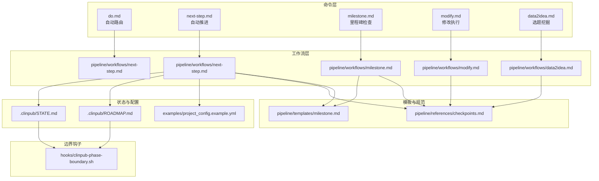
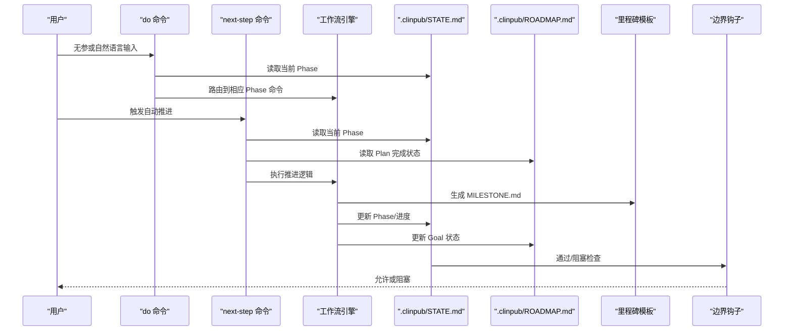
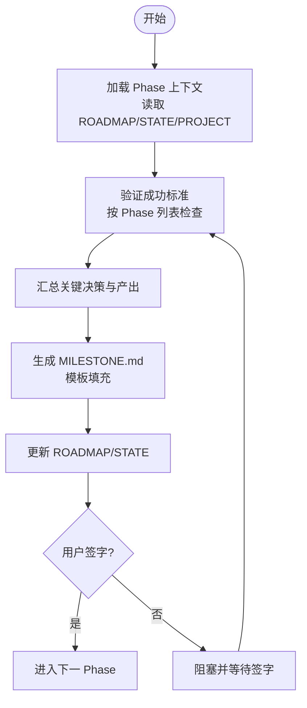
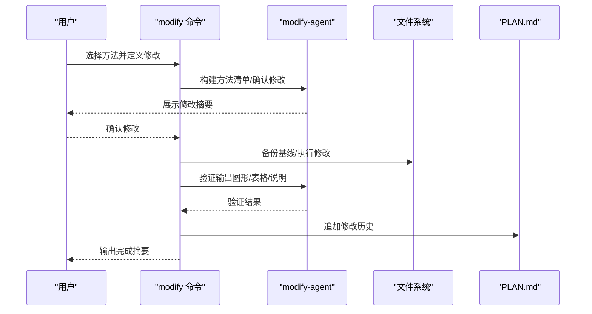
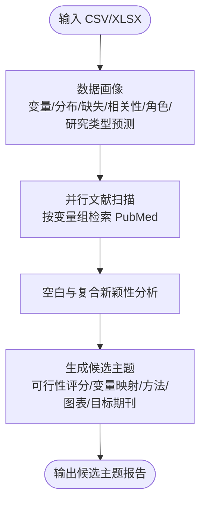
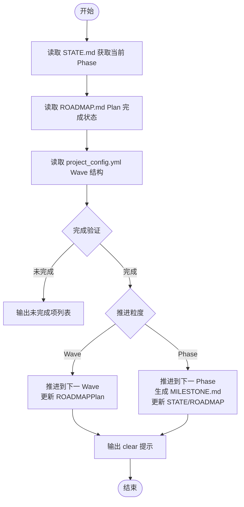
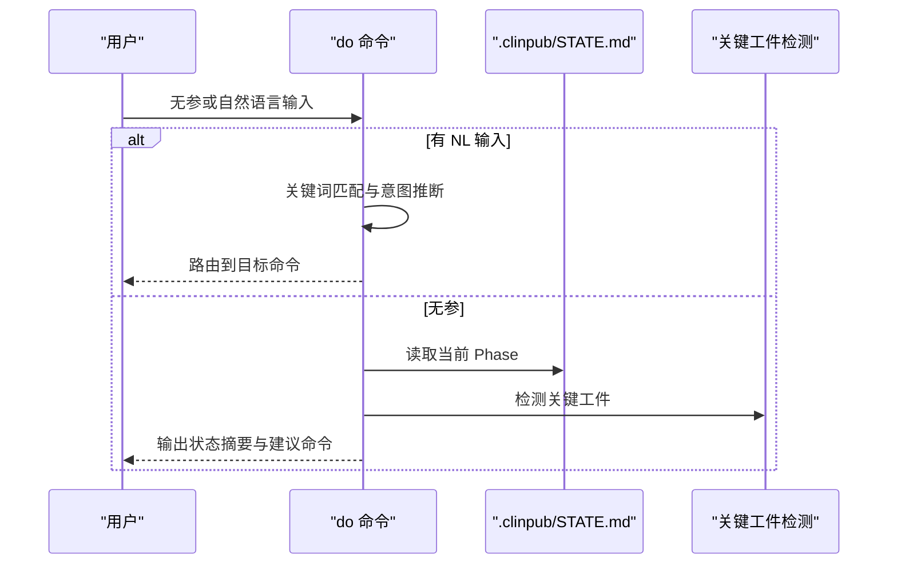
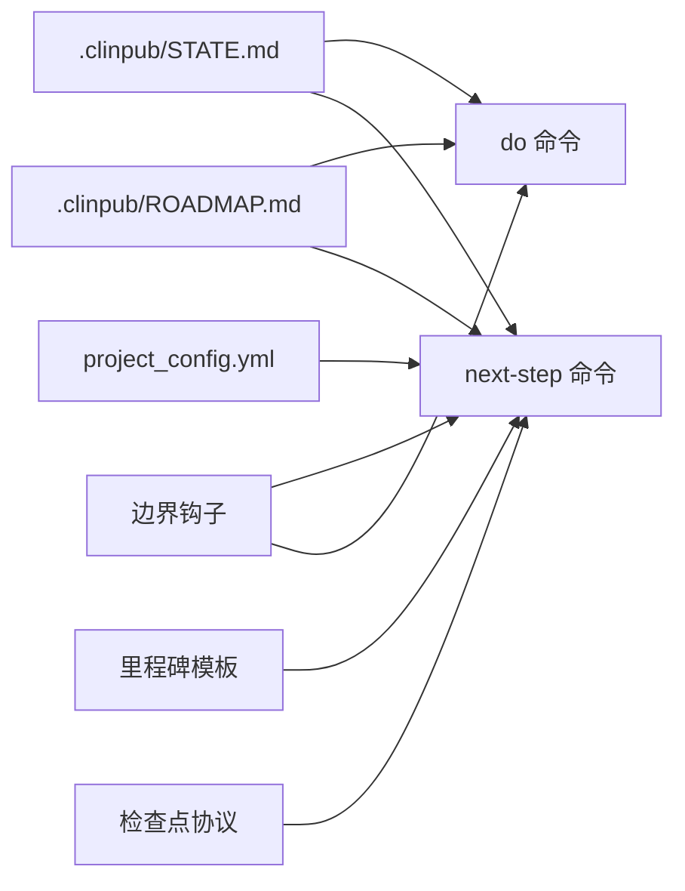

# 辅助工具命令

<cite>
**本文引用的文件**
- [milestone.md](file://commands/clinpub/milestone.md)
- [modify.md](file://commands/clinpub/modify.md)
- [data2idea.md](file://commands/clinpub/data2idea.md)
- [next-step.md](file://commands/clinpub/next-step.md)
- [do.md](file://commands/clinpub/do.md)
- [milestone.md](file://pipeline/workflows/milestone.md)
- [modify.md](file://pipeline/workflows/modify.md)
- [data2idea.md](file://pipeline/workflows/data2idea.md)
- [next-step.md](file://pipeline/workflows/next-step.md)
- [milestone.md](file://pipeline/templates/milestone.md)
- [checkpoints.md](file://pipeline/references/checkpoints.md)
- [STATE.md](file://.clinpub/STATE.md)
- [ROADMAP.md](file://.clinpub/ROADMAP.md)
- [project_config.example.yml](file://examples/project_config.example.yml)
- [clinpub-phase-boundary.sh](file://hooks/clinpub-phase-boundary.sh)
</cite>

## 目录
1. [简介](#简介)
2. [项目结构](#项目结构)
3. [核心组件](#核心组件)
4. [架构总览](#架构总览)
5. [详细组件分析](#详细组件分析)
6. [依赖关系分析](#依赖关系分析)
7. [性能考量](#性能考量)
8. [故障排除指南](#故障排除指南)
9. [结论](#结论)
10. [附录](#附录)

## 简介
本文件系统性梳理 clinpub 的辅助工具命令：milestone、modify、data2idea、next-step、do。围绕以下主题展开：
- 里程碑检查机制：何时触发、如何验证、如何生成里程碑文件、如何与边界钩子协作
- 修改命令的工作原理：前置校验、定义变更、执行变更、验证输出、记录历史
- 想法挖掘流程：数据画像、并行文献扫描、复合新颖性分析、候选主题生成
- 下一步行动指导：自动推进粒度（Wave/Phase）、完成验证、里程碑生成、clear 提示
- 批量执行与路由：基于工作区状态与自然语言意图的自动路由
- 命令在工作流中的作用、与主命令的交互关系、最佳实践与排错

## 项目结构
辅助工具命令位于 commands/clinpub 下，配套工作流位于 pipeline/workflows，里程碑模板与检查点规范位于 pipeline/templates 与 pipeline/references，工作区状态与路线图位于 .clinpub，边界钩子位于 hooks。

**图示来源**
- [do.md](file://commands/clinpub/do.md)
- [next-step.md](file://commands/clinpub/next-step.md)
- [milestone.md](file://commands/clinpub/milestone.md)
- [modify.md](file://commands/clinpub/modify.md)
- [data2idea.md](file://commands/clinpub/data2idea.md)
- [milestone.md](file://pipeline/workflows/milestone.md)
- [modify.md](file://pipeline/workflows/modify.md)
- [data2idea.md](file://pipeline/workflows/data2idea.md)
- [next-step.md](file://pipeline/workflows/next-step.md)
- [milestone.md](file://pipeline/templates/milestone.md)
- [checkpoints.md](file://pipeline/references/checkpoints.md)
- [STATE.md](file://.clinpub/STATE.md)
- [ROADMAP.md](file://.clinpub/ROADMAP.md)
- [project_config.example.yml](file://examples/project_config.example.yml)
- [clinpub-phase-boundary.sh](file://hooks/clinpub-phase-boundary.sh)

**章节来源**
- [do.md](file://commands/clinpub/do.md)
- [next-step.md](file://commands/clinpub/next-step.md)
- [milestone.md](file://commands/clinpub/milestone.md)
- [modify.md](file://commands/clinpub/modify.md)
- [data2idea.md](file://commands/clinpub/data2idea.md)

## 核心组件
- 里程碑检查（milestone）：在 Phase 结束时正式验证成功标准、记录决策与产出、生成里程碑文件、更新路线图与状态，并等待用户签字放行，确保边界钩子允许进入下一 Phase。
- 修改（modify）：在 Phase 2 完成后，对既有分析结果进行样式与方法层面的针对性修改，支持备份、顺序执行、验证与历史记录。
- 选题挖掘（data2idea）：从 CSV/XLSX 数据出发，生成变量画像、并行检索文献、识别研究空白与复合新颖性，输出 3–5 个候选主题。
- 下一步（next-step）：自动推进到下一 Wave 或 Phase，完成验证、生成里程碑、更新状态与路线图，并输出标准化的 clear 提示。
- 路由（do）：读取工作区状态与关键工件，结合自然语言意图，智能路由到合适命令，或在无参时输出状态摘要与建议。

**章节来源**
- [milestone.md](file://commands/clinpub/milestone.md)
- [modify.md](file://commands/clinpub/modify.md)
- [data2idea.md](file://commands/clinpub/data2idea.md)
- [next-step.md](file://commands/clinpub/next-step.md)
- [do.md](file://commands/clinpub/do.md)

## 架构总览
辅助工具命令围绕“状态驱动 + 规范约束 + 模板输出”的闭环设计：
- 状态驱动：STATE.md 与 ROADMAP.md 作为权威事实源，决定当前 Phase 与推进粒度
- 规范约束：里程碑与检查点协议确保交付质量，边界钩子强制前置条件
- 模板输出：里程碑模板标准化记录，便于审计与交接

**图示来源**
- [do.md](file://commands/clinpub/do.md)
- [next-step.md](file://commands/clinpub/next-step.md)
- [milestone.md](file://pipeline/workflows/milestone.md)
- [milestone.md](file://pipeline/templates/milestone.md)
- [STATE.md](file://.clinpub/STATE.md)
- [ROADMAP.md](file://.clinpub/ROADMAP.md)
- [clinpub-phase-boundary.sh](file://hooks/clinpub-phase-boundary.sh)

## 详细组件分析

### 里程碑检查（milestone）
- 触发时机
  - Phase 结束时自动执行
  - 用户可手动调用以核验状态
- 成功标准
  - 生成里程碑文件并记录交付物与决策
  - 更新路线图状态与状态文件
  - 用户签字放行后方可进入下一 Phase
- 与边界钩子的协作
  - 边界钩子在启动分析/写作/评审前检查上一 Phase 的里程碑完成状态
  - 未完成则阻断，直至里程碑文件存在且标记为完成

**图示来源**
- [milestone.md](file://pipeline/workflows/milestone.md)
- [milestone.md](file://pipeline/templates/milestone.md)
- [checkpoints.md](file://pipeline/references/checkpoints.md)
- [STATE.md](file://.clinpub/STATE.md)
- [ROADMAP.md](file://.clinpub/ROADMAP.md)

**章节来源**
- [milestone.md](file://commands/clinpub/milestone.md)
- [milestone.md](file://pipeline/workflows/milestone.md)
- [milestone.md](file://pipeline/templates/milestone.md)
- [checkpoints.md](file://pipeline/references/checkpoints.md)
- [clinpub-phase-boundary.sh](file://hooks/clinpub-phase-boundary.sh)

### 修改（modify）
- 前置条件
  - 已存在分析计划文件、清洗后的数据与分析输出目录
- 执行流程
  - 定义修改：构建方法清单，与用户确认修改范围
  - 执行修改：按顺序（样式→变量→方法→新增）执行，记录基线哈希以便回滚
  - 验证输出：检查图形分辨率、标签、表格与说明文档
  - 记录历史：追加修改记录到 PLAN.md，更新状态文件
- 适用阶段
  - 可在 Phase 2/3/4 需要调整分析结果时调用
  - 修改不会自动更新手稿，需另行执行写作命令

**图示来源**
- [modify.md](file://pipeline/workflows/modify.md)
- [modify.md](file://commands/clinpub/modify.md)

**章节来源**
- [modify.md](file://commands/clinpub/modify.md)
- [modify.md](file://pipeline/workflows/modify.md)

### 选题挖掘（data2idea）
- 输入与目标
  - 输入：CSV/XLSX 临床数据
  - 目标：不进行统计分析，仅挖掘候选论文主题
- 执行流程
  - 数据画像：变量清单、分布、缺失、相关性、变量角色与研究类型预测
  - 并行文献扫描：按变量组并行检索 PubMed，识别趋势与空白
  - 主题生成：合成 3–5 个候选主题，包含可行性评分、变量映射、分析方法、图表需求、新颖性与目标期刊
- 输出与后续
  - 输出候选主题报告，引导用户进入完整分析流程

**图示来源**
- [data2idea.md](file://pipeline/workflows/data2idea.md)
- [data2idea.md](file://commands/clinpub/data2idea.md)

**章节来源**
- [data2idea.md](file://commands/clinpub/data2idea.md)
- [data2idea.md](file://pipeline/workflows/data2idea.md)

### 下一步（next-step）
- 自动推进粒度
  - 同 Phase 内：若 Phase 2 有 Wave 结构且未全部完成，则推进到下一 Wave
  - 跨 Phase：若当前 Phase 所有 Plan 完成或无 Wave 结构，则推进到下一 Phase
- 完成验证
  - 按 Phase 验证关键工件存在性与完整性
  - 特殊处理：Phase 2 的 Wave 结构为空对象时视为未开始
- 里程碑生成与状态同步
  - 推进到新 Phase 时生成里程碑文件，防止边界钩子阻断
  - 同步更新 STATE.md 与 ROADMAP.md，输出标准化 clear 提示

**图示来源**
- [next-step.md](file://commands/clinpub/next-step.md)
- [next-step.md](file://pipeline/workflows/next-step.md)
- [milestone.md](file://pipeline/templates/milestone.md)
- [checkpoints.md](file://pipeline/references/checkpoints.md)
- [STATE.md](file://.clinpub/STATE.md)
- [ROADMAP.md](file://.clinpub/ROADMAP.md)
- [project_config.example.yml](file://examples/project_config.example.yml)

**章节来源**
- [next-step.md](file://commands/clinpub/next-step.md)
- [next-step.md](file://pipeline/workflows/next-step.md)

### 路由（do）
- 无参行为：读取 STATE.md 与关键工件，输出状态摘要与建议命令
- 自然语言意图：优先匹配强信号关键词，命中即路由；未命中则回退到无参行为
- 路由映射：根据 Phase 与工件检测结果，映射到 init-project、data-prep、analysis、writing、review、next-step、milestone、data2idea

**图示来源**
- [do.md](file://commands/clinpub/do.md)

**章节来源**
- [do.md](file://commands/clinpub/do.md)

## 依赖关系分析
- 状态与路线图
  - next-step 与 do 均依赖 STATE.md 与 ROADMAP.md 作为权威事实源
  - 里程碑生成依赖里程碑模板与检查点协议
- 边界钩子
  - 分析/写作/评审命令在执行前受边界钩子检查，要求上一 Phase 的里程碑完成
- 配置与工件
  - Phase 2 的 Wave 结构来自 project_config.yml，但需结合 04_Outputs/ 等工件进行综合判断

**图示来源**
- [STATE.md](file://.clinpub/STATE.md)
- [ROADMAP.md](file://.clinpub/ROADMAP.md)
- [project_config.example.yml](file://examples/project_config.example.yml)
- [milestone.md](file://pipeline/templates/milestone.md)
- [checkpoints.md](file://pipeline/references/checkpoints.md)
- [clinpub-phase-boundary.sh](file://hooks/clinpub-phase-boundary.sh)
- [do.md](file://commands/clinpub/do.md)
- [next-step.md](file://commands/clinpub/next-step.md)

**章节来源**
- [STATE.md](file://.clinpub/STATE.md)
- [ROADMAP.md](file://.clinpub/ROADMAP.md)
- [project_config.example.yml](file://examples/project_config.example.yml)
- [milestone.md](file://pipeline/templates/milestone.md)
- [checkpoints.md](file://pipeline/references/checkpoints.md)
- [clinpub-phase-boundary.sh](file://hooks/clinpub-phase-boundary.sh)
- [do.md](file://commands/clinpub/do.md)
- [next-step.md](file://commands/clinpub/next-step.md)

## 性能考量
- 选题挖掘的并行文献扫描
  - 并行度取决于可用资源与 API 速率限制；建议设置 NCBI_API_KEY 以提升并发能力
- 修改命令的执行顺序
  - 风险由低到高排序执行，减少级联失败概率
- 自动推进的正则与文件系统扫描
  - 采用精确匹配与最小必要扫描，避免不必要的 IO

## 故障排除指南
- 未完成推进
  - 现象：next-step 输出未完成项列表并阻止推进
  - 排查：核对各 Phase 关键工件是否存在，Phase 2 的 Wave 结构是否为空对象
  - 参考：自动推进的完成验证与反模式规避
- 里程碑未生成导致阻断
  - 现象：边界钩子阻断新 Phase 启动
  - 排查：确认上一 Phase 是否生成里程碑文件并标记完成
  - 参考：里程碑工作流与边界钩子逻辑
- 修改失败或验证不通过
  - 现象：修改后图形/表格不符合标准或统计报告缺失关键指标
  - 排查：检查 DPI、标签语言、方法变更是否引入缺失包；必要时回滚并重新执行
  - 参考：修改工作流的验证步骤与记录历史
- 路由误判或意图未识别
  - 现象：do 命令未路由到期望命令
  - 排查：确认输入是否包含强信号关键词；必要时改为无参以获取状态摘要
  - 参考：do 命令的关键词映射与回退逻辑

**章节来源**
- [next-step.md](file://commands/clinpub/next-step.md)
- [milestone.md](file://pipeline/workflows/milestone.md)
- [clinpub-phase-boundary.sh](file://hooks/clinpub-phase-boundary.sh)
- [modify.md](file://pipeline/workflows/modify.md)
- [do.md](file://commands/clinpub/do.md)

## 结论
辅助工具命令围绕“状态驱动 + 规范约束 + 模板输出”形成闭环，确保每个 Phase 的交付质量与可追溯性。milestone 保障关卡评审，modify 支持精准迭代，data2idea 提升选题效率，next-step 与 do 实现自动推进与智能路由。遵循检查点协议与边界钩子约束，可显著降低跨阶段风险，提升整体执行稳定性。

## 附录
- 使用建议
  - 在推进到新 Phase 前，务必完成里程碑并获得签字
  - 修改分析结果后，及时更新 PLAN.md 并在需要时重新执行写作流程
  - 使用 data2idea 生成候选主题后，结合项目目标与资源选择最可行方向
  - 利用 do 的状态摘要与建议命令，快速定位下一步行动
- 相关文件索引
  - 里程碑模板与检查点协议：pipeline/templates/milestone.md、pipeline/references/checkpoints.md
  - 工作区状态与路线图：.clinpub/STATE.md、.clinpub/ROADMAP.md
  - 示例配置：examples/project_config.example.yml
  - 边界钩子：hooks/clinpub-phase-boundary.sh