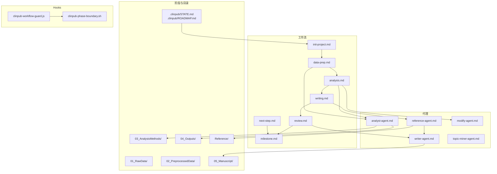
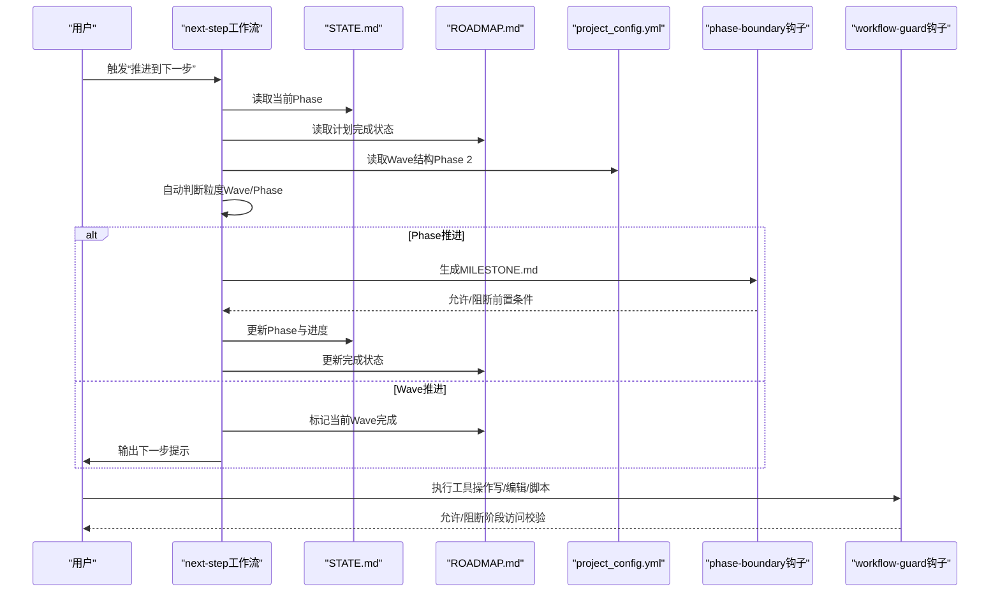
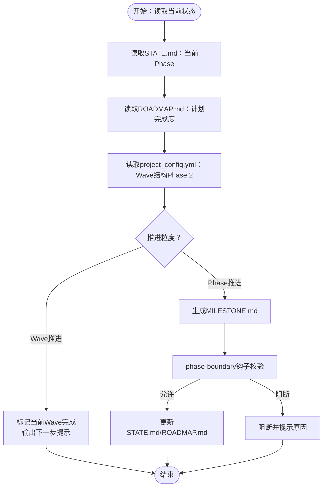
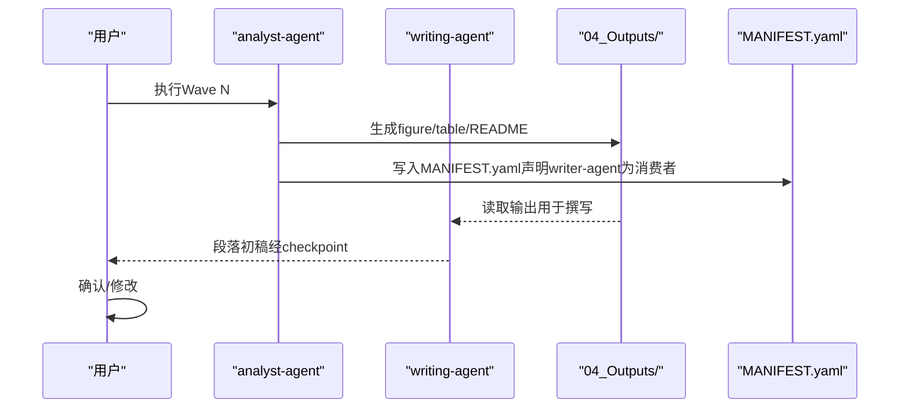
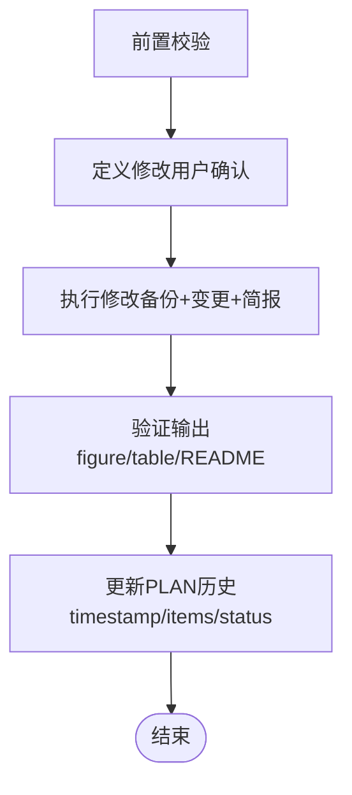
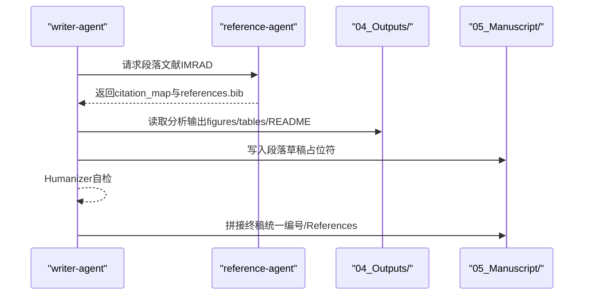
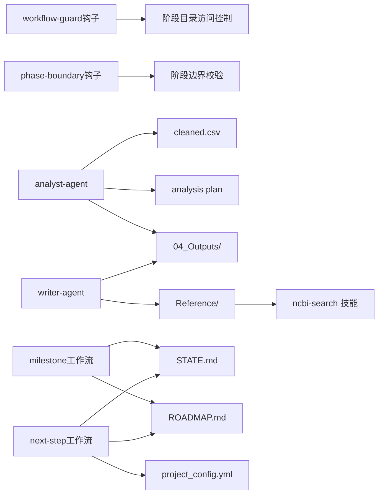

# 工作流控制流

<cite>
**本文档引用的文件**
- [analysis.md](file://pipeline/workflows/analysis.md)
- [data2idea.md](file://pipeline/workflows/data2idea.md)
- [modify.md](file://pipeline/workflows/modify.md)
- [next-step.md](file://pipeline/workflows/next-step.md)
- [init-project.md](file://pipeline/workflows/init-project.md)
- [milestone.md](file://pipeline/workflows/milestone.md)
- [review.md](file://pipeline/workflows/review.md)
- [writing.md](file://pipeline/workflows/writing.md)
- [clinpub-workflow-guard.js](file://hooks/clinpub-workflow-guard.js)
- [clinpub-phase-boundary.sh](file://hooks/clinpub-phase-boundary.sh)
- [analyst-agent.md](file://agents/analyst-agent.md)
- [modify-agent.md](file://agents/modify-agent.md)
- [reference-agent.md](file://agents/reference-agent.md)
- [writer-agent.md](file://agents/writer-agent.md)
- [topic-miner-agent.md](file://agents/topic-miner-agent.md)
</cite>

## 目录
1. [引言](#引言)
2. [项目结构](#项目结构)
3. [核心组件](#核心组件)
4. [架构总览](#架构总览)
5. [详细组件分析](#详细组件分析)
6. [依赖关系分析](#依赖关系分析)
7. [性能考虑](#性能考虑)
8. [故障排查指南](#故障排查指南)
9. [结论](#结论)
10. [附录](#附录)

## 引言
本文件面向开发者与高级用户，系统化梳理“工作流控制流”的设计与实现，涵盖工作流编排引擎、流程控制逻辑、状态管理机制、异常处理与回滚、监控与性能优化、资源调度、以及与AI代理的交互模式与消息传递。文档以Phase维度组织，结合hooks与agents，形成“阶段边界校验—计划推进—里程碑—产出验证—人工确认”的闭环控制流。

## 项目结构
项目采用“Phase驱动 + 工作流模板 + Hooks防护 + AI代理协作”的分层架构：
- Phase层：0 初始化 → 1 数据准备 → 2 统计分析 → 3 撰写 → 4 同行评审
- 工作流层：每个Phase对应一个工作流模板，定义步骤、优先级、前置条件与成功标准
- Hooks层：在工具调用前进行阶段访问与边界检查，阻断违规操作
- 代理层：Analyst/Reference/Writer/Topic-Miner/Modify等Agent按职责分工协作
- 目录布局：.clinpub/跟踪状态与里程碑；01~05目录承载各阶段产物；pipeline/workflows定义流程；hooks提供安全门禁；agents定义代理行为

**图表来源**
- [init-project.md:18-115](file://pipeline/workflows/init-project.md#L18-L115)
- [analysis.md:17-253](file://pipeline/workflows/analysis.md#L17-L253)
- [writing.md:23-304](file://pipeline/workflows/writing.md#L23-L304)
- [review.md:16-121](file://pipeline/workflows/review.md#L16-L121)
- [next-step.md:55-371](file://pipeline/workflows/next-step.md#L55-L371)
- [milestone.md:17-154](file://pipeline/workflows/milestone.md#L17-L154)
- [clinpub-workflow-guard.js:16-77](file://hooks/clinpub-workflow-guard.js#L16-L77)
- [clinpub-phase-boundary.sh:34-104](file://hooks/clinpub-phase-boundary.sh#L34-L104)

**章节来源**
- [init-project.md:18-115](file://pipeline/workflows/init-project.md#L18-L115)
- [analysis.md:17-253](file://pipeline/workflows/analysis.md#L17-L253)
- [writing.md:23-304](file://pipeline/workflows/writing.md#L23-L304)
- [review.md:16-121](file://pipeline/workflows/review.md#L16-L121)
- [next-step.md:55-371](file://pipeline/workflows/next-step.md#L55-L371)
- [milestone.md:17-154](file://pipeline/workflows/milestone.md#L17-L154)
- [clinpub-workflow-guard.js:16-77](file://hooks/clinpub-workflow-guard.js#L16-L77)
- [clinpub-phase-boundary.sh:34-104](file://hooks/clinpub-phase-boundary.sh#L34-L104)

## 核心组件
- 工作流编排引擎
  - 以Phase为单位的步骤序列，每个步骤带优先级与前置条件；支持Wave（波次）结构（Phase 2）
  - 通过STATE.md/ROADMAP.md/里程碑文件驱动推进与回退
- 流程控制逻辑
  - Hooks在工具调用前强制阶段顺序与边界条件；next-step工作流负责自动推进粒度（Wave/Phase）
- 状态管理机制
  - STATE.md记录当前Phase与进度；ROADMAP.md记录计划与完成状态；MILESTONE.md固化阶段成果与用户签核
- AI代理交互
  - Analyst/Reference/Writer/Topic-Miner/Modify等Agent通过文件系统交换产物，遵循MANIFEST约定
- 异常处理与回滚
  - Hooks阻断违规操作；modify工作流记录变更历史，失败项可重试或跳过；review阶段支持迭代修订

**章节来源**
- [next-step.md:55-371](file://pipeline/workflows/next-step.md#L55-L371)
- [milestone.md:17-154](file://pipeline/workflows/milestone.md#L17-L154)
- [clinpub-workflow-guard.js:16-77](file://hooks/clinpub-workflow-guard.js#L16-L77)
- [clinpub-phase-boundary.sh:34-104](file://hooks/clinpub-phase-boundary.sh#L34-L104)
- [modify.md:16-135](file://pipeline/workflows/modify.md#L16-L135)

## 架构总览
整体架构围绕“阶段-工作流-代理-产物-里程碑”闭环构建，通过Hooks确保阶段顺序与前置条件，通过工作流模板规范步骤与成功标准，通过代理完成数据与文本的自动化处理。

**图表来源**
- [next-step.md:55-371](file://pipeline/workflows/next-step.md#L55-L371)
- [clinpub-phase-boundary.sh:106-150](file://hooks/clinpub-phase-boundary.sh#L106-L150)
- [clinpub-workflow-guard.js:84-134](file://hooks/clinpub-workflow-guard.js#L84-L134)

## 详细组件分析

### 组件A：阶段推进与里程碑（next-step + milestone）
- 自动推进逻辑
  - 读取STATE.md定位当前Phase，读取ROADMAP.md统计计划完成度，读取project_config.yml解析Wave结构（Phase 2）
  - 若Phase 2存在Wave且最后Wave无SUMMARY.md，则提示继续当前Wave；否则推进到下一Phase
  - 推进到新Phase前必须生成MILESTONE.md，防止phase-boundary钩子阻断
- 成功标准
  - 未完成时明确提示未完成项；完成时输出标准化“下一步”三要素提示（/clear + 命令 + 进度总结）
  - 与STATE.md/ROADMAP.md保持一致性，避免“Phase编号与计划不一致”的反模式

**图表来源**
- [next-step.md:55-371](file://pipeline/workflows/next-step.md#L55-L371)
- [milestone.md:96-126](file://pipeline/workflows/milestone.md#L96-L126)
- [clinpub-phase-boundary.sh:34-104](file://hooks/clinpub-phase-boundary.sh#L34-L104)

**章节来源**
- [next-step.md:55-371](file://pipeline/workflows/next-step.md#L55-L371)
- [milestone.md:17-154](file://pipeline/workflows/milestone.md#L17-L154)
- [clinpub-phase-boundary.sh:34-104](file://hooks/clinpub-phase-boundary.sh#L34-L104)

### 组件B：统计分析工作流（analysis）
- 动态分析计划
  - 诊断数据结构 → 提案分析计划 → 用户确认 → 波次执行 → 输出验证 → 用户满意度检查 → 里程碑
- 波次执行
  - 按Wave顺序执行，每个Wave内方法按依赖顺序运行；Wave完成后checkpoint并等待用户确认
- 输出标准
  - 每个方法产出figure/table/README；满足出版级分辨率、英文标签、效应量+置信区间+精确p值
- 可扩展性
  - Phase 4（review）阶段若用户追加分析，可在既有计划基础上新增Wave

**图表来源**
- [analysis.md:187-235](file://pipeline/workflows/analysis.md#L187-L235)
- [analyst-agent.md:45-75](file://agents/analyst-agent.md#L45-L75)
- [writing.md:117-161](file://pipeline/workflows/writing.md#L117-L161)

**章节来源**
- [analysis.md:17-253](file://pipeline/workflows/analysis.md#L17-L253)
- [analyst-agent.md:17-141](file://agents/analyst-agent.md#L17-L141)
- [writing.md:117-161](file://pipeline/workflows/writing.md#L117-L161)

### 组件C：修改工作流（modify）
- 触发条件
  - 必须在Phase 2完成后执行；前置条件包括PLAN.md、cleaned.csv、04_Outputs/存在
- 控制流
  - 定义修改 → 执行修改（备份commit hash）→ 验证输出 → 更新PLAN历史
- 回滚与失败处理
  - 记录pre-modify baseline；失败项stash并报告；支持按类型排序执行（风格→变量→方法→新增），降低级联失败风险

**图表来源**
- [modify.md:18-123](file://pipeline/workflows/modify.md#L18-L123)

**章节来源**
- [modify.md:16-135](file://pipeline/workflows/modify.md#L16-L135)

### 组件D：撰写工作流（writing）
- 引用策略与预搜索
  - 讨论各段引用数量、时间范围、IF偏好；Reference Agent基于策略执行PubMed搜索，生成citation_map与references.bib
- 顺序撰写
  - IMRAD顺序：Introduction → Methods → Results → Discussion；每段三步：Reference-Agent预搜索 → Writer-Agent撰写 → 用户审阅
- 终稿拼接
  - 按占位符替换规则统一编号figure/table/method/section；生成manuscript.md与MANIFEST.yaml

**图表来源**
- [writing.md:69-161](file://pipeline/workflows/writing.md#L69-L161)
- [reference-agent.md:47-91](file://agents/reference-agent.md#L47-L91)
- [writer-agent.md:15-51](file://agents/writer-agent.md#L15-L51)

**章节来源**
- [writing.md:23-304](file://pipeline/workflows/writing.md#L23-L304)
- [reference-agent.md:14-321](file://agents/reference-agent.md#L14-L321)
- [writer-agent.md:15-166](file://agents/writer-agent.md#L15-L166)

### 组件E：同行评审工作流（review）
- 循环迭代
  - 生成评审（Major/Minor）→ 用户确认项 → 修订手稿 → 生成逐点回复信 → 循环直至满意
- 成功标准
  - 所有确认项已处理、回复信完整、最终稿与参考文献更新

**章节来源**
- [review.md:16-121](file://pipeline/workflows/review.md#L16-L121)

### 组件F：主题挖掘工作流（data2idea）
- 数据画像 → 文献扫描（并行） → 主题生成
- 特点
  - 仅主题发现，不进行统计分析或撰写；支持并行子代理扫描不同变量组，聚合gap分析与复合新颖性

**章节来源**
- [data2idea.md:17-145](file://pipeline/workflows/data2idea.md#L17-L145)
- [topic-miner-agent.md:19-320](file://agents/topic-miner-agent.md#L19-L320)

## 依赖关系分析
- 阶段依赖
  - Phase N只能在Phase N-1完成并获得里程碑签核后开启；phase-boundary钩子负责强制校验
- 工具调用依赖
  - workflow-guard钩子阻止越权目录访问；仅允许在当前Phase目录内写/编辑
- 代理依赖
  - Analyst依赖cleaned.csv与analysis plan；Writer依赖Reference与04_Outputs；Reference依赖ncbi-search技能
- 产物依赖
  - MANIFEST.yaml声明上游产物与消费者，确保下游Agent按序读取

**图表来源**
- [clinpub-workflow-guard.js:45-77](file://hooks/clinpub-workflow-guard.js#L45-L77)
- [clinpub-phase-boundary.sh:34-104](file://hooks/clinpub-phase-boundary.sh#L34-L104)
- [analyst-agent.md:19-43](file://agents/analyst-agent.md#L19-L43)
- [writer-agent.md:17-51](file://agents/writer-agent.md#L17-L51)
- [reference-agent.md:16-45](file://agents/reference-agent.md#L16-L45)
- [milestone.md:17-126](file://pipeline/workflows/milestone.md#L17-L126)
- [next-step.md:57-109](file://pipeline/workflows/next-step.md#L57-L109)

**章节来源**
- [clinpub-workflow-guard.js:45-77](file://hooks/clinpub-workflow-guard.js#L45-L77)
- [clinpub-phase-boundary.sh:34-104](file://hooks/clinpub-phase-boundary.sh#L34-L104)
- [analyst-agent.md:19-43](file://agents/analyst-agent.md#L19-L43)
- [writer-agent.md:17-51](file://agents/writer-agent.md#L17-L51)
- [reference-agent.md:16-45](file://agents/reference-agent.md#L16-L45)
- [milestone.md:17-126](file://pipeline/workflows/milestone.md#L17-L126)
- [next-step.md:57-109](file://pipeline/workflows/next-step.md#L57-L109)

## 性能考虑
- 并行文献搜索
  - data2idea与writing阶段的Reference-Agent支持并行子代理，显著缩短搜索耗时；建议合理设置API密钥提升速率限制
- 波次执行
  - Phase 2按Wave顺序执行，Wave内方法按依赖执行；Wave完成后checkpoint并等待用户确认，避免不必要的资源占用
- 产物去重与清单
  - MANIFEST.yaml确保下游Agent只读取已声明产物，减少无效IO；引用库统一去重，避免重复下载与处理
- 速率限制与缓存
  - ncbi-search技能内置速率限制；建议在可用时设置NCBI_API_KEY；对热点文献可本地缓存摘要

[本节为通用性能建议，不直接分析特定文件]

## 故障排查指南
- 阶段访问被阻断
  - 现象：工具调用被workflow-guard.js阻断
  - 原因：尝试写入非当前Phase目录
  - 处理：先完成当前Phase或使用next-step推进
- Phase边界被阻断
  - 现象：phase-boundary.sh输出BLOCK提示
  - 原因：上一Phase未生成MILESTONE.md或未完成前置条件
  - 处理：先执行milestone工作流并获得用户签核
- 分析计划缺失
  - 现象：modify工作流提示未找到PLAN.md或cleaned.csv
  - 处理：先完成Phase 2分析并生成PLAN.md与04_Outputs/
- 引用技能缺失
  - 现象：Reference-Agent提示未安装ncbi-search技能
  - 处理：安装技能后重试；或检查环境变量NCBI_API_KEY

**章节来源**
- [clinpub-workflow-guard.js:114-125](file://hooks/clinpub-workflow-guard.js#L114-L125)
- [clinpub-phase-boundary.sh:135-147](file://hooks/clinpub-phase-boundary.sh#L135-L147)
- [modify.md:18-34](file://pipeline/workflows/modify.md#L18-L34)
- [reference-agent.md:16-45](file://agents/reference-agent.md#L16-L45)

## 结论
本工作流体系以Phase为骨架，以工作流模板为脉络，以Hooks为安全阀，以Agent为执行单元，形成高可控、可审计、可扩展的科学出版流水线。通过STATE/ROADMAP/MILESTONE三元状态与next-step的自动推进机制，确保阶段有序演进；通过modify与review的回溯与迭代能力，保障结果质量；通过Agent间的文件系统契约与MANIFEST清单，实现弱耦合协作。建议在生产环境中强化速率限制与缓存策略，并持续完善失败重试与观测指标。

[本节为总结性内容，不直接分析特定文件]

## 附录
- 扩展方案
  - 自定义控制逻辑：在hooks中新增规则（如自定义Gate）；在工作流中新增步骤（如新增Phase N的计划与里程碑）
  - 优化指导：引入并行队列与资源池；为Agent增加超时与重试；在MANIFEST中细化消费者声明
- 监控与日志
  - 建议在每个工作流步骤输出结构化日志；在Hooks中记录决策原因；在MILESTONE中记录关键决策与阻塞项

[本节为通用指导，不直接分析特定文件]