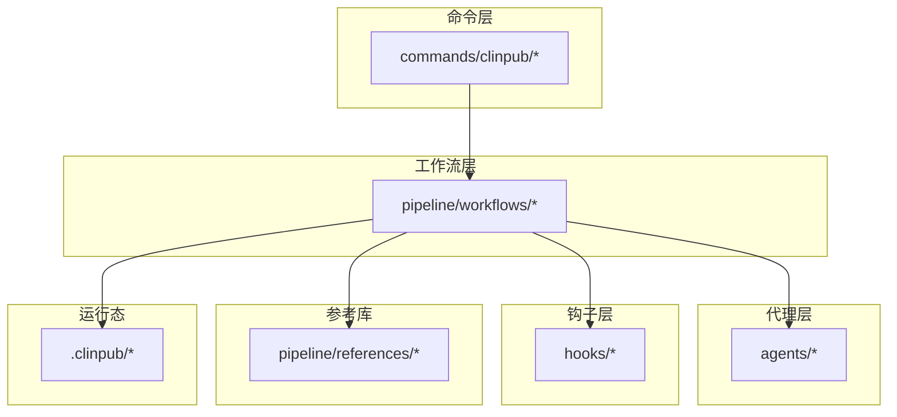
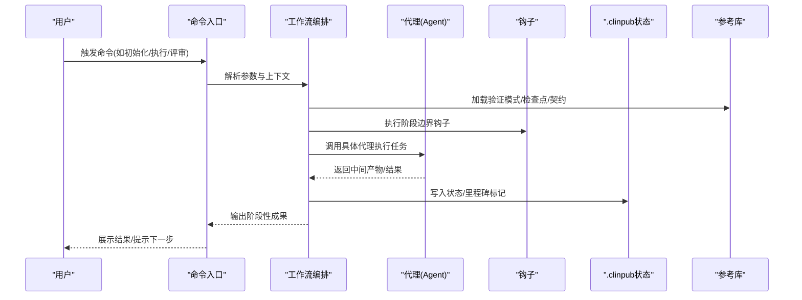
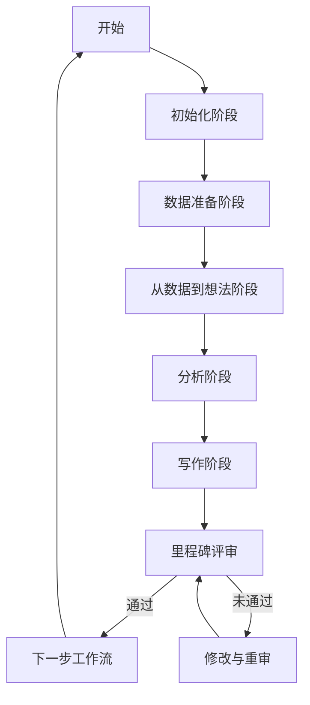
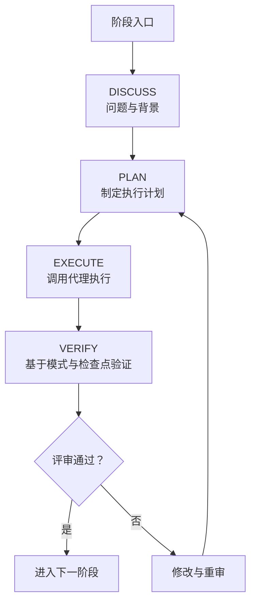
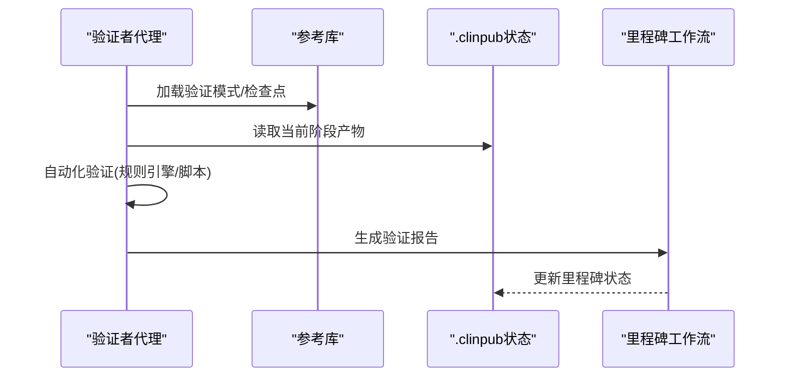
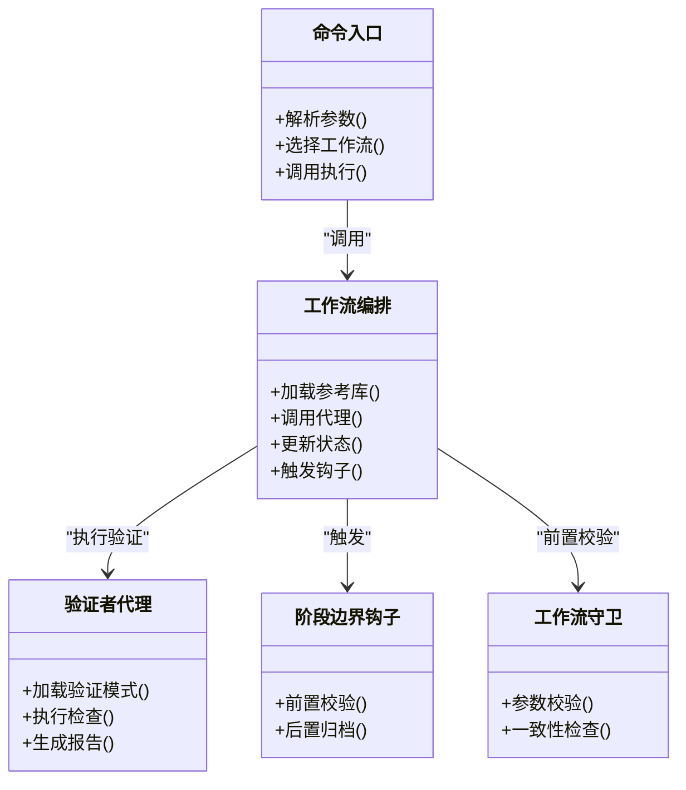
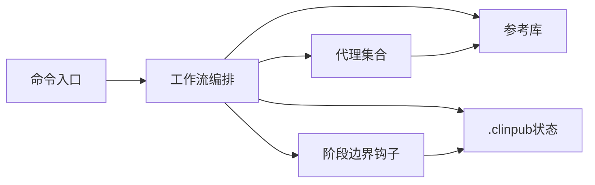

# 工作流架构

<cite>
**本文引用的文件**
- [README.md](file://README.md)
- [ARCHITECTURE.md](file://docs/ARCHITECTURE.md)
- [CONFIGURATION.md](file://docs/CONFIGURATION.md)
- [DEVELOPMENT.md](file://docs/DEVELOPMENT.md)
- [STATE.md](file://.clinpub/STATE.md)
- [ROADMAP.md](file://.clinpub/ROADMAP.md)
- [config.json](file://.clinpub/config.json)
- [clinpub.md](file://commands/clinpub/clinpub.md)
- [init-project.md](file://pipeline/workflows/init-project.md)
- [data-prep.md](file://pipeline/workflows/data-prep.md)
- [data2idea.md](file://pipeline/workflows/data2idea.md)
- [analysis.md](file://pipeline/workflows/analysis.md)
- [writing.md](file://pipeline/workflows/writing.md)
- [milestone.md](file://pipeline/workflows/milestone.md)
- [next-step.md](file://pipeline/workflows/next-step.md)
- [review.md](file://pipeline/workflows/review.md)
- [modify.md](file://pipeline/workflows/modify.md)
- [do.md](file://commands/clinpub/do.md)
- [milestone.md](file://commands/clinpub/milestone.md)
- [clinpub-phase-boundary.sh](file://hooks/clinpub-phase-boundary.sh)
- [clinpub-workflow-guard.js](file://hooks/clinpub-workflow-guard.js)
- [verification-patterns.md](file://pipeline/references/verification-patterns.md)
- [checkpoints.md](file://pipeline/references/checkpoints.md)
- [agent-contracts.md](file://pipeline/references/agent-contracts.md)
- [analyst-agent.md](file://agents/analyst-agent.md)
- [clinpub-planner.md](file://agents/clinpub-planner.md)
- [clinpub-executor.md](file://agents/clinpub-executor.md)
- [clinpub-verifier.md](file://agents/clinpub-verifier.md)
- [modify-agent.md](file://agents/modify-agent.md)
- [reference-agent.md](file://agents/reference-agent.md)
- [topic-miner-agent.md](file://agents/topic-miner-agent.md)
- [writer-agent.md](file://agents/writer-agent.md)
</cite>

## 目录
1. [引言](#引言)
2. [项目结构](#项目结构)
3. [核心组件](#核心组件)
4. [架构总览](#架构总览)
5. [详细组件分析](#详细组件分析)
6. [依赖关系分析](#依赖关系分析)
7. [性能考量](#性能考量)
8. [故障排查指南](#故障排查指南)
9. [结论](#结论)
10. [附录](#附录)

## 引言
本文件面向开发者与技术读者，系统化阐述clinpub工作流的五阶段设计、阶段转换机制、流程控制逻辑与里程碑评审标准。文档聚焦“DISCUSS → PLAN → EXECUTE → VERIFY”四步法在各阶段中的落地方式，解释工作流编排的实现细节、错误处理策略与性能优化建议，并给出可扩展与定制化的实践指导。

## 项目结构
clinpub采用“命令+工作流+钩子+参考库”的分层组织方式：命令入口负责用户交互与参数传递；工作流定义五阶段的业务流程；钩子提供边界保护与流程守卫；参考库沉淀方法论与验证模式。.clinpub目录承载运行态状态与配置，便于跨阶段持久化与追踪。

**章节来源**
- [README.md](file://README.md)
- [ARCHITECTURE.md](file://docs/ARCHITECTURE.md)

## 核心组件
- 命令与入口
  - 入口命令提供统一CLI接口，封装初始化、执行、里程碑评审、下一步等操作。
  - 关键命令包括：初始化项目、数据准备、从数据到想法、分析、写作、修改、评审、里程碑、下一步、执行等。
- 工作流编排
  - 以“五阶段”为主线，每个阶段围绕DISCUSS → PLAN → EXECUTE → VERIFY展开，阶段间通过状态与里程碑进行衔接。
- 钩子与守卫
  - 阶段边界钩子用于在关键节点执行前置校验与后置归档。
  - 工作流守卫对输入参数、前置条件与上下文进行一致性检查。
- 代理（Agent）
  - 分工明确：分析师、规划者、执行者、验证者、修改者、参考挖掘者、主题挖掘者、写作者等，分别承担不同职责域。
- 参考库
  - 包含验证模式、检查点、代理契约、方法学规范等，作为工作流执行的权威依据。

**章节来源**
- [clinpub.md](file://commands/clinpub/clinpub.md)
- [init-project.md](file://pipeline/workflows/init-project.md)
- [data-prep.md](file://pipeline/workflows/data-prep.md)
- [data2idea.md](file://pipeline/workflows/data2idea.md)
- [analysis.md](file://pipeline/workflows/analysis.md)
- [writing.md](file://pipeline/workflows/writing.md)
- [milestone.md](file://pipeline/workflows/milestone.md)
- [next-step.md](file://pipeline/workflows/next-step.md)
- [review.md](file://pipeline/workflows/review.md)
- [modify.md](file://pipeline/workflows/modify.md)
- [clinpub-phase-boundary.sh](file://hooks/clinpub-phase-boundary.sh)
- [clinpub-workflow-guard.js](file://hooks/clinpub-workflow-guard.js)
- [analyst-agent.md](file://agents/analyst-agent.md)
- [clinpub-planner.md](file://agents/clinpub-planner.md)
- [clinpub-executor.md](file://agents/clinpub-executor.md)
- [clinpub-verifier.md](file://agents/clinpub-verifier.md)
- [modify-agent.md](file://agents/modify-agent.md)
- [reference-agent.md](file://agents/reference-agent.md)
- [topic-miner-agent.md](file://agents/topic-miner-agent.md)
- [writer-agent.md](file://agents/writer-agent.md)

## 架构总览
下图展示从命令入口到工作流、代理与钩子的整体调用链路，以及状态与参考库的交互。

**图表来源**
- [clinpub.md](file://commands/clinpub/clinpub.md)
- [init-project.md](file://pipeline/workflows/init-project.md)
- [clinpub-phase-boundary.sh](file://hooks/clinpub-phase-boundary.sh)
- [verification-patterns.md](file://pipeline/references/verification-patterns.md)
- [checkpoints.md](file://pipeline/references/checkpoints.md)
- [agent-contracts.md](file://pipeline/references/agent-contracts.md)

## 详细组件分析

### 五阶段工作流与阶段转换机制
- 阶段划分
  - 初始化阶段：建立项目骨架、加载配置、生成初始状态。
  - 数据准备阶段：清洗、标准化、构建数据集与元信息。
  - 从数据到想法阶段：探索性分析、假设生成、形成研究思路。
  - 分析阶段：严谨方法学执行、统计/计算与结果解读。
  - 写作阶段：结构化输出、同行评审与迭代修改。
- 阶段转换
  - 每个阶段以里程碑为关卡，通过评审与状态标记决定是否进入下一阶段。
  - 阶段边界钩子在转换前执行一致性校验，确保前置条件满足。
- 控制逻辑
  - 命令入口根据当前状态与目标阶段选择对应工作流。
  - 工作流内部按DISCUSS → PLAN → EXECUTE → VERIFY顺序推进，每步产出可验证的中间件。

**图表来源**
- [init-project.md](file://pipeline/workflows/init-project.md)
- [data-prep.md](file://pipeline/workflows/data-prep.md)
- [data2idea.md](file://pipeline/workflows/data2idea.md)
- [analysis.md](file://pipeline/workflows/analysis.md)
- [writing.md](file://pipeline/workflows/writing.md)
- [milestone.md](file://pipeline/workflows/milestone.md)
- [next-step.md](file://pipeline/workflows/next-step.md)
- [modify.md](file://pipeline/workflows/modify.md)

**章节来源**
- [ROADMAP.md](file://.clinpub/ROADMAP.md)
- [STATE.md](file://.clinpub/STATE.md)
- [clinpub-phase-boundary.sh](file://hooks/clinpub-phase-boundary.sh)

### DISCUSS → PLAN → EXECUTE → VERIFY 四步法
- DISCUSS（讨论）
  - 明确问题域、范围与约束；收集背景知识与参考材料；识别关键变量与风险点。
  - 产出：问题陈述、背景综述、初步假设、风险清单。
- PLAN（计划）
  - 制定可执行方案：方法学、数据路径、时间线、资源分配；对齐代理职责与契约。
  - 产出：执行计划、检查点、验证策略、责任矩阵。
- EXECUTE（执行）
  - 按计划调用代理执行任务；记录中间产物；保持可观测性与可追溯性。
  - 产出：中间结果、日志、制品清单。
- VERIFY（验证）
  - 基于参考库与检查点进行自检与互检；形成验证报告；决定是否进入下一阶段或回退修正。
  - 产出：验证报告、里程碑标记、状态更新。

**图表来源**
- [verification-patterns.md](file://pipeline/references/verification-patterns.md)
- [checkpoints.md](file://pipeline/references/checkpoints.md)
- [agent-contracts.md](file://pipeline/references/agent-contracts.md)

**章节来源**
- [analyst-agent.md](file://agents/analyst-agent.md)
- [clinpub-planner.md](file://agents/clinpub-planner.md)
- [clinpub-executor.md](file://agents/clinpub-executor.md)
- [clinpub-verifier.md](file://agents/clinpub-verifier.md)

### 里程碑评审与验证标准
- 评审维度
  - 方法学合规性：是否遵循既定方法学与参考库。
  - 数据完整性：数据质量、覆盖度与一致性。
  - 结果可复现性：过程可追溯、参数可配置、环境可复制。
  - 交付物质量：中间产物与最终制品符合预期格式与粒度。
- 评审工具
  - 验证模式：定义可量化的质量指标与阈值。
  - 检查点：关键节点的强制性检查清单。
  - 代理契约：明确职责边界与接口规范。
- 评审流程
  - 由验证者代理执行自动化检查与人工复核相结合。
  - 通过则标记里程碑，未通过则触发修改工作流并重新评审。

**图表来源**
- [milestone.md](file://pipeline/workflows/milestone.md)
- [verification-patterns.md](file://pipeline/references/verification-patterns.md)
- [checkpoints.md](file://pipeline/references/checkpoints.md)
- [agent-contracts.md](file://pipeline/references/agent-contracts.md)

**章节来源**
- [milestone.md](file://pipeline/workflows/milestone.md)
- [milestone.md](file://commands/clinpub/milestone.md)

### 工作流编排实现细节
- 命令到工作流
  - 命令入口解析用户意图，定位到对应工作流文件，注入上下文与配置。
- 代理协作
  - 各代理通过契约接口对接，支持并行与串行组合；中间产物以标准化格式在阶段间传递。
- 钩子与守卫
  - 阶段边界钩子负责前置校验与归档；工作流守卫保证输入合法性与一致性。
- 状态与持久化
  - 使用.clinpub目录保存状态、里程碑与临时产物，确保中断恢复与审计可追溯。

**图表来源**
- [clinpub.md](file://commands/clinpub/clinpub.md)
- [clinpub-phase-boundary.sh](file://hooks/clinpub-phase-boundary.sh)
- [clinpub-workflow-guard.js](file://hooks/clinpub-workflow-guard.js)
- [milestone.md](file://pipeline/workflows/milestone.md)

**章节来源**
- [do.md](file://commands/clinpub/do.md)
- [review.md](file://pipeline/workflows/review.md)

### 错误处理策略
- 输入校验
  - 在命令入口与工作流守卫处进行参数与前置条件校验，尽早失败并给出明确提示。
- 运行时容错
  - 代理执行失败时，记录错误上下文与重试策略；必要时回滚至最近稳定状态。
- 验证失败处理
  - 未通过里程碑评审时，自动转入修改工作流并生成修复清单，避免阻塞后续阶段。
- 日志与可观测性
  - 统一记录执行轨迹、中间产物与异常堆栈，便于定位与复盘。

**章节来源**
- [clinpub-workflow-guard.js](file://hooks/clinpub-workflow-guard.js)
- [milestone.md](file://pipeline/workflows/milestone.md)
- [modify.md](file://pipeline/workflows/modify.md)

### 性能优化考虑
- 并行化
  - 对独立任务进行并行调度，缩短端到端时延；对共享资源加锁避免竞争。
- 缓存与增量
  - 复用已验证的中间产物；仅对变更部分重算，减少重复工作。
- 资源池化
  - 代理实例池化与负载均衡，提升吞吐与稳定性。
- I/O优化
  - 批量化读写、压缩传输、本地缓存热点数据，降低网络与磁盘开销。

## 依赖关系分析
- 组件耦合
  - 命令层与工作流层松耦合，通过标准化接口交互；代理层与参考库强依赖契约与模式。
- 外部依赖
  - 依赖.clinpub配置与状态；依赖参考库中的验证模式与检查点；依赖钩子提供的边界保障。
- 循环依赖规避
  - 通过单向依赖链与接口抽象避免循环；工作流不直接依赖命令层，仅被命令层调用。

**图表来源**
- [clinpub.md](file://commands/clinpub/clinpub.md)
- [init-project.md](file://pipeline/workflows/init-project.md)
- [clinpub-phase-boundary.sh](file://hooks/clinpub-phase-boundary.sh)
- [verification-patterns.md](file://pipeline/references/verification-patterns.md)

**章节来源**
- [config.json](file://.clinpub/config.json)
- [CONFIGURATION.md](file://docs/CONFIGURATION.md)

## 性能考量
- 任务粒度与并行度
  - 将长耗时任务拆分为细粒度子任务，结合代理池实现并行执行。
- 中间产物管理
  - 采用版本化存储与增量更新，避免全量重算。
- 资源配额与限流
  - 对外部服务调用设置超时与重试上限，防止雪崩效应。
- 监控与告警
  - 关键阶段与代理执行时间、成功率纳入监控，异常及时告警。

## 故障排查指南
- 常见问题定位
  - 参数错误：检查命令入口与工作流守卫的校验日志。
  - 代理执行失败：查看代理日志与中间产物，确认契约与输入格式。
  - 里程碑未通过：对照验证模式与检查点逐项核对。
- 恢复步骤
  - 使用修改工作流修复问题；必要时回滚到上一里程碑状态。
  - 清理临时产物后重试，确保环境一致。
- 支持工具
  - 里程碑命令用于快速生成评审报告与状态快照。

**章节来源**
- [milestone.md](file://commands/clinpub/milestone.md)
- [review.md](file://pipeline/workflows/review.md)
- [modify.md](file://pipeline/workflows/modify.md)

## 结论
clinpub工作流通过“五阶段+四步法+里程碑评审”构建了可验证、可扩展、可演进的研究管线。命令层、工作流层、代理层、钩子层与参考库协同，形成闭环的质量保障体系。开发者可在既定契约与模式下灵活扩展代理能力与工作流分支，持续优化性能与可靠性。

## 附录
- 快速开始
  - 使用初始化命令创建项目骨架，随后按阶段推进，定期执行里程碑评审。
- 扩展指南
  - 新增代理需遵循代理契约；新增工作流需定义阶段边界与验证模式；修改参考库需同步评审与发布流程。
- 参考资料
  - 架构说明、配置手册、开发指南与测试指南详见docs目录。

**章节来源**
- [README.md](file://README.md)
- [DEVELOPMENT.md](file://docs/DEVELOPMENT.md)
- [CONFIGURATION.md](file://docs/CONFIGURATION.md)
- [TESTING.md](file://docs/TESTING.md)