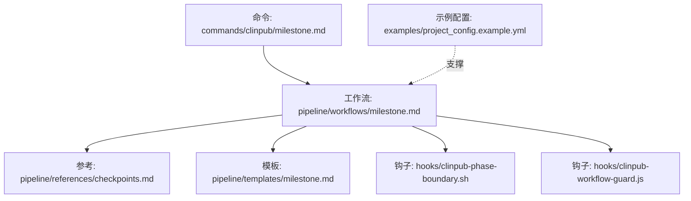
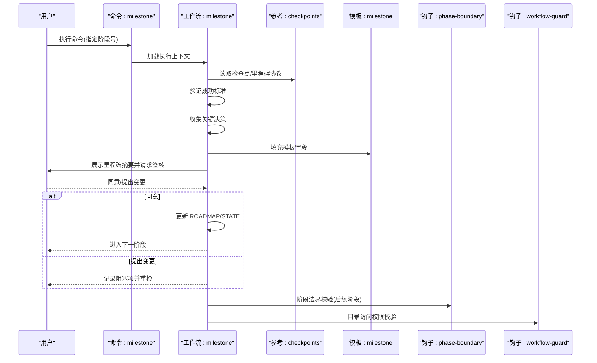
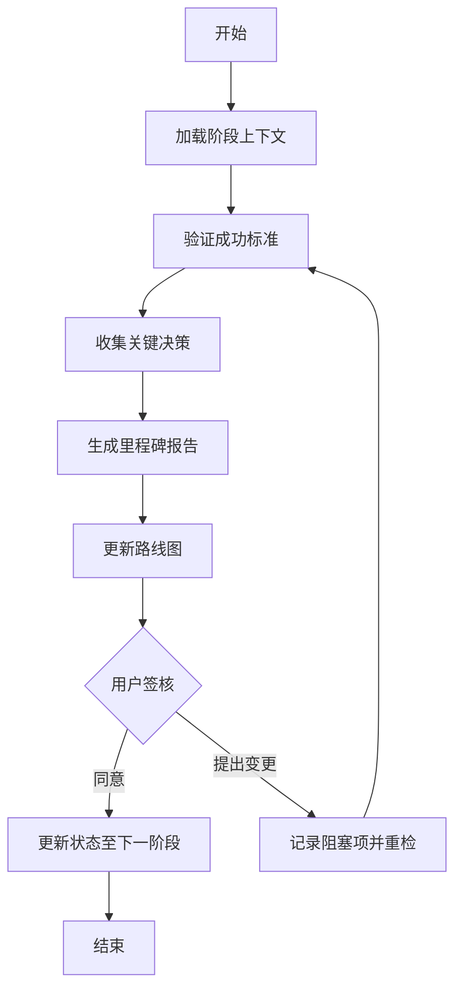
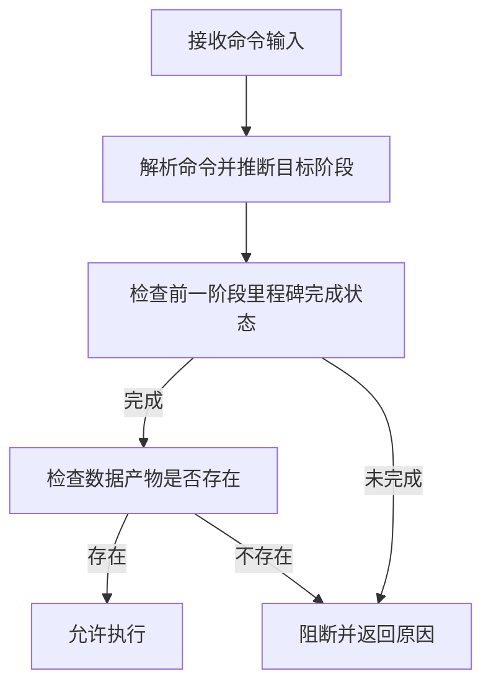
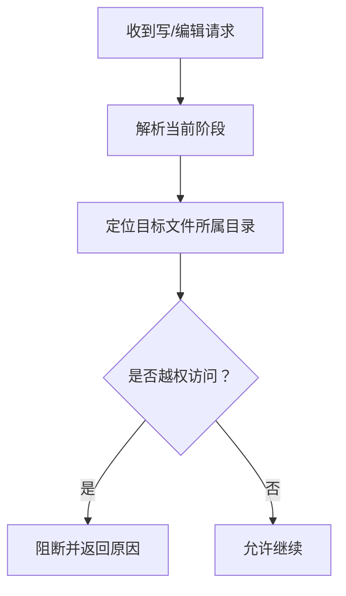
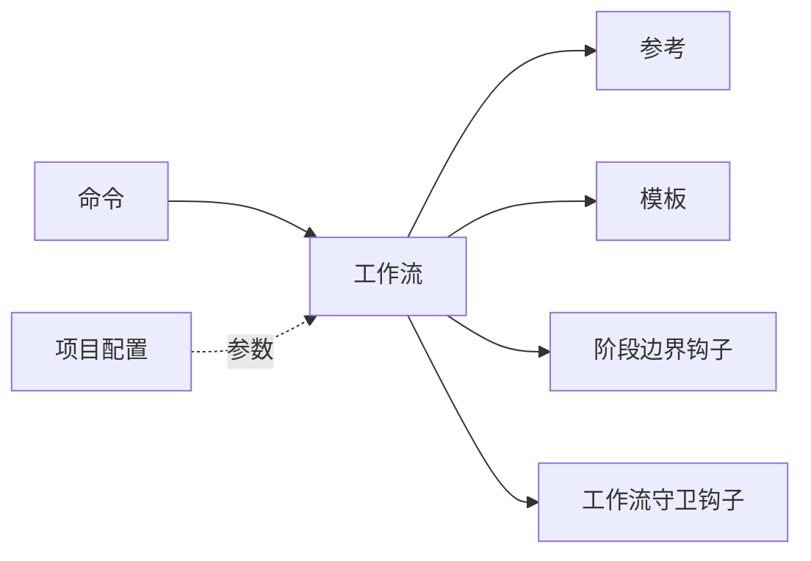

# 里程碑管理

<cite>
**本文引用的文件**
- [commands/clinpub/milestone.md](file://commands/clinpub/milestone.md)
- [pipeline/workflows/milestone.md](file://pipeline/workflows/milestone.md)
- [pipeline/references/checkpoints.md](file://pipeline/references/checkpoints.md)
- [pipeline/templates/milestone.md](file://pipeline/templates/milestone.md)
- [hooks/clinpub-phase-boundary.sh](file://hooks/clinpub-phase-boundary.sh)
- [hooks/clinpub-workflow-guard.js](file://hooks/clinpub-workflow-guard.js)
- [examples/project_config.example.yml](file://examples/project_config.example.yml)
</cite>

## 目录
1. [引言](#引言)
2. [项目结构](#项目结构)
3. [核心组件](#核心组件)
4. [架构总览](#架构总览)
5. [详细组件分析](#详细组件分析)
6. [依赖关系分析](#依赖关系分析)
7. [性能考量](#性能考量)
8. [故障排查指南](#故障排查指南)
9. [结论](#结论)
10. [附录](#附录)

## 引言
本文件面向开发者与项目管理者，系统化阐述“里程碑管理”在本科学化研究管线中的实现方式与使用规范。内容覆盖阶段转换控制机制、质量门控标准、里程碑评审流程、检查点与门控规则、状态变更逻辑、报告生成与进度跟踪、异常处理与扩展方案，并给出配置模板与集成指导。

## 项目结构
里程碑管理围绕以下关键要素组织：
- 命令入口：通过命令定义触发里程碑流程，加载工作流与参考材料。
- 工作流：定义里程碑评审的步骤、校验清单、决策收集、报告生成与状态更新。
- 参考与模板：提供检查点类型、里程碑记录格式与模板字段。
- 钩子：在工具调用前进行阶段边界与数据存在性校验，阻断违规操作。
- 配置示例：项目级配置文件，支撑分析计划与质量标准落地。

图表来源
- [commands/clinpub/milestone.md:1-39](file://commands/clinpub/milestone.md#L1-L39)
- [pipeline/workflows/milestone.md:1-163](file://pipeline/workflows/milestone.md#L1-L163)
- [pipeline/references/checkpoints.md:1-120](file://pipeline/references/checkpoints.md#L1-L120)
- [pipeline/templates/milestone.md:1-46](file://pipeline/templates/milestone.md#L1-L46)
- [hooks/clinpub-phase-boundary.sh:1-153](file://hooks/clinpub-phase-boundary.sh#L1-L153)
- [hooks/clinpub-workflow-guard.js:1-134](file://hooks/clinpub-workflow-guard.js#L1-L134)
- [examples/project_config.example.yml:1-68](file://examples/project_config.example.yml#L1-L68)

章节来源
- [commands/clinpub/milestone.md:1-39](file://commands/clinpub/milestone.md#L1-L39)
- [pipeline/workflows/milestone.md:1-163](file://pipeline/workflows/milestone.md#L1-L163)
- [pipeline/references/checkpoints.md:1-120](file://pipeline/references/checkpoints.md#L1-L120)
- [pipeline/templates/milestone.md:1-46](file://pipeline/templates/milestone.md#L1-L46)
- [hooks/clinpub-phase-boundary.sh:1-153](file://hooks/clinpub-phase-boundary.sh#L1-L153)
- [hooks/clinpub-workflow-guard.js:1-134](file://hooks/clinpub-workflow-guard.js#L1-L134)
- [examples/project_config.example.yml:1-68](file://examples/project_config.example.yml#L1-L68)

## 核心组件
- 里程碑命令：定义 CLI 命令行为、执行上下文、触发条件与成功标准。
- 里程碑工作流：分步执行阶段上下文加载、成功标准验证、决策收集、报告生成、路线图与状态更新、用户签核。
- 检查点与里程碑协议：定义 checkpoint 类型、里程碑记录格式与流程集成。
- 里程碑模板：标准化输出字段，便于审计与追踪。
- 阶段边界钩子：在工具调用前强制阶段顺序与前置条件，阻断违规访问。
- 工作流守卫钩子：基于项目当前阶段限制对后续阶段目录的写入/编辑。
- 项目配置示例：提供变量、路径、语言与质量等关键参数，支撑各阶段产出与质量门控。

章节来源
- [commands/clinpub/milestone.md:1-39](file://commands/clinpub/milestone.md#L1-L39)
- [pipeline/workflows/milestone.md:1-163](file://pipeline/workflows/milestone.md#L1-L163)
- [pipeline/references/checkpoints.md:1-120](file://pipeline/references/checkpoints.md#L1-L120)
- [pipeline/templates/milestone.md:1-46](file://pipeline/templates/milestone.md#L1-L46)
- [hooks/clinpub-phase-boundary.sh:1-153](file://hooks/clinpub-phase-boundary.sh#L1-L153)
- [hooks/clinpub-workflow-guard.js:1-134](file://hooks/clinpub-workflow-guard.js#L1-L134)
- [examples/project_config.example.yml:1-68](file://examples/project_config.example.yml#L1-L68)

## 架构总览
里程碑管理采用“命令驱动 + 工作流编排 + 钩子守卫 + 模板输出”的架构。命令入口负责触发，工作流负责编排评审与状态更新，钩子负责在运行期强制阶段边界与数据完整性，模板负责生成可审计的里程碑报告。

图表来源
- [commands/clinpub/milestone.md:1-39](file://commands/clinpub/milestone.md#L1-L39)
- [pipeline/workflows/milestone.md:1-163](file://pipeline/workflows/milestone.md#L1-L163)
- [pipeline/references/checkpoints.md:1-120](file://pipeline/references/checkpoints.md#L1-L120)
- [pipeline/templates/milestone.md:1-46](file://pipeline/templates/milestone.md#L1-L46)
- [hooks/clinpub-phase-boundary.sh:1-153](file://hooks/clinpub-phase-boundary.sh#L1-L153)
- [hooks/clinpub-workflow-guard.js:1-134](file://hooks/clinpub-workflow-guard.js#L1-L134)

## 详细组件分析

### 里程碑命令（CLI）
- 触发方式：自动（阶段结束时）与手动（任意时刻）。
- 执行上下文：加载工作流与参考材料，确保评审所需信息齐备。
- 成功标准：生成里程碑报告、更新路线图与状态、获得用户签核。

章节来源
- [commands/clinpub/milestone.md:1-39](file://commands/clinpub/milestone.md#L1-L39)

### 里程碑工作流（评审与状态更新）
- 步骤一：加载阶段上下文（项目目录、规划目录、阶段目录）。
- 步骤二：验证成功标准（按阶段定义的清单逐项核验）。
- 步骤三：收集关键决策（来自阶段讨论日志、状态日志与用户确认）。
- 步骤四：生成里程碑报告（使用模板填充字段）。
- 步骤五：更新路线图（当前阶段标记完成，下一阶段标记进行中）。
- 步骤六：用户签核（批准或提出变更，阻塞项记录并重检）。
- 成功标准：报告生成、路线图更新、状态切换、签核完成或阻塞项记录。

图表来源
- [pipeline/workflows/milestone.md:15-152](file://pipeline/workflows/milestone.md#L15-L152)

章节来源
- [pipeline/workflows/milestone.md:1-163](file://pipeline/workflows/milestone.md#L1-L163)

### 检查点与里程碑协议
- 设计原则：自动化优先、明确恢复信号、完整成功标准、状态持久化。
- 检查点类型：
  - 决策（decision）：在分析路径分支时由用户选择。
  - 验证（verify）：自动步骤完成后由用户确认结果。
  - 里程碑（milestone）：阶段完成后的正式评审与记录。
- 里程碑记录格式：包含完成日期、状态、交付物清单、关键决策、产出文件、阻塞项、下一步等字段。

章节来源
- [pipeline/references/checkpoints.md:1-120](file://pipeline/references/checkpoints.md#L1-L120)

### 里程碑报告模板
- 字段占位符：阶段编号/名称、日期、状态、交付物、验证项、决策表、产出表、阻塞项、下阶段目标与待办。
- 输出用途：审计、追踪、知识沉淀与交接。

章节来源
- [pipeline/templates/milestone.md:1-46](file://pipeline/templates/milestone.md#L1-L46)

### 阶段边界与数据存在性钩子
- 目标：防止跳过前置阶段，确保数据存在后再进入下一阶段。
- 机制：
  - 解析命令语义，推断目标阶段。
  - 校验前一阶段里程碑完成状态（STATE 或里程碑文件）。
  - 校验必要数据产物是否存在。
  - 返回允许或阻断决策，并携带原因。

图表来源
- [hooks/clinpub-phase-boundary.sh:34-104](file://hooks/clinpub-phase-boundary.sh#L34-L104)

章节来源
- [hooks/clinpub-phase-boundary.sh:1-153](file://hooks/clinpub-phase-boundary.sh#L1-L153)

### 工作流守卫钩子（目录访问控制）
- 目标：在项目当前阶段内限制对后续阶段目录的写入/编辑。
- 机制：
  - 读取当前阶段（从状态文件解析）。
  - 判断目标文件所属目录归属阶段。
  - 若越权访问则阻断并返回原因，否则允许。

图表来源
- [hooks/clinpub-workflow-guard.js:25-77](file://hooks/clinpub-workflow-guard.js#L25-L77)

章节来源
- [hooks/clinpub-workflow-guard.js:1-134](file://hooks/clinpub-workflow-guard.js#L1-L134)

### 项目配置模板（支撑质量门控）
- 包含项目基本信息、变量定义、路径映射、语言与质量参数、分析阈值等。
- 作用：为分析计划与质量标准提供权威来源，保障各阶段产出符合统一规范。

章节来源
- [examples/project_config.example.yml:1-68](file://examples/project_config.example.yml#L1-L68)

## 依赖关系分析
- 命令依赖工作流；工作流依赖参考与模板；工作流被钩子保护；配置文件为工作流提供参数。
- 钩子之间相互补充：阶段边界钩子关注“是否可进入下一阶段”，工作流守卫钩子关注“当前阶段内能否写入后续阶段目录”。

图表来源
- [commands/clinpub/milestone.md:1-39](file://commands/clinpub/milestone.md#L1-L39)
- [pipeline/workflows/milestone.md:1-163](file://pipeline/workflows/milestone.md#L1-L163)
- [pipeline/references/checkpoints.md:1-120](file://pipeline/references/checkpoints.md#L1-L120)
- [pipeline/templates/milestone.md:1-46](file://pipeline/templates/milestone.md#L1-L46)
- [hooks/clinpub-phase-boundary.sh:1-153](file://hooks/clinpub-phase-boundary.sh#L1-L153)
- [hooks/clinpub-workflow-guard.js:1-134](file://hooks/clinpub-workflow-guard.js#L1-L134)
- [examples/project_config.example.yml:1-68](file://examples/project_config.example.yml#L1-L68)

章节来源
- [commands/clinpub/milestone.md:1-39](file://commands/clinpub/milestone.md#L1-L39)
- [pipeline/workflows/milestone.md:1-163](file://pipeline/workflows/milestone.md#L1-L163)
- [hooks/clinpub-phase-boundary.sh:1-153](file://hooks/clinpub-phase-boundary.sh#L1-L153)
- [hooks/clinpub-workflow-guard.js:1-134](file://hooks/clinpub-workflow-guard.js#L1-L134)
- [examples/project_config.example.yml:1-68](file://examples/project_config.example.yml#L1-L68)

## 性能考量
- 阶段边界钩子与工作流守卫钩子均为轻量脚本，主要进行字符串匹配与文件存在性判断，开销极低。
- 里程碑工作流涉及文件读取与用户交互，建议在 CI/CD 中批量运行以减少人工等待。
- 模板渲染与文件写入为 I/O 密集，建议避免在大文件上频繁重写，合并输出批次。

## 故障排查指南
- 无法进入下一阶段
  - 检查前一阶段里程碑是否完成（状态文件或里程碑文件）。
  - 确认必要数据产物是否存在。
  - 查看钩子输出的原因提示，按提示补齐前置条件。
- 越权写入被阻断
  - 当前阶段不允许编辑后续阶段目录，请先完成当前阶段里程碑。
- 里程碑报告未生成
  - 确认工作流成功执行并完成签核。
  - 检查模板字段是否正确填充。
- 配置不生效
  - 确认项目配置文件路径与字段与工作流期望一致。

章节来源
- [hooks/clinpub-phase-boundary.sh:135-147](file://hooks/clinpub-phase-boundary.sh#L135-L147)
- [hooks/clinpub-workflow-guard.js:114-125](file://hooks/clinpub-workflow-guard.js#L114-L125)
- [pipeline/workflows/milestone.md:156-162](file://pipeline/workflows/milestone.md#L156-L162)

## 结论
本里程碑管理系统通过命令、工作流、钩子与模板的协同，实现了阶段转换的强约束、质量门控的可视化与可审计化、里程碑评审的标准化与可追溯化。结合项目配置模板，系统能够稳定支撑从初始化到审稿的全生命周期管理。

## 附录

### 里程碑检查点与成功标准（按阶段）
- 初始化（Phase 0）
  - 项目目录结构创建
  - 项目配置生成并反映用户决策
  - 研究类型确认
  - 分析方法选择确认
  - 决策日志写入
- 数据准备（Phase 1）
  - 清洗后数据存在
  - 数据质量报告生成
  - 缺失值策略执行
  - 异常值处理与记录
  - 派生变量创建与编码
  - 清洗代码可独立复现
- 分析（Phase 2）
  - 每个确认方法均有图/表与方法说明
  - 图像分辨率与标签符合出版要求
  - 统计报告包含效应量与置信区间
  - 代码读取清洗后数据且可独立运行
  - 记录 R 版本与关键包版本
- 写作（Phase 3）
  - IMRAD 结构完整
  - 引文具备 DOI
  - 图表与表格在文中引用
  - STROBE/CONSORT 检查清单覆盖
  - 无 AI 模板模式
- 审阅（Phase 4）
  - 审阅意见生成（重大/轻微）
  - 已确认事项在稿件中处理
  - 回复信完整（逐点回应）
  - 最终稿件就绪

章节来源
- [pipeline/workflows/milestone.md:42-79](file://pipeline/workflows/milestone.md#L42-L79)

### 里程碑报告字段清单
- 阶段编号/名称、完成日期、状态
- 交付物清单
- 成功标准验证清单
- 关键决策表
- 产出文件清单
- 未解决问题/阻塞项
- 下一步：下一阶段目标与待办

章节来源
- [pipeline/templates/milestone.md:1-46](file://pipeline/templates/milestone.md#L1-L46)

### 阶段转换控制与门控规则
- 阶段边界钩子：在工具调用前检查前一阶段里程碑完成状态与数据产物存在性，决定允许或阻断。
- 工作流守卫钩子：限制对后续阶段目录的写入/编辑，确保阶段顺序。
- 里程碑签核：用户批准后才推进状态，否则记录阻塞项并重检。

章节来源
- [hooks/clinpub-phase-boundary.sh:106-150](file://hooks/clinpub-phase-boundary.sh#L106-L150)
- [hooks/clinpub-workflow-guard.js:84-131](file://hooks/clinpub-workflow-guard.js#L84-L131)
- [pipeline/workflows/milestone.md:128-152](file://pipeline/workflows/milestone.md#L128-L152)

### 风险评估与决策支持
- 风险识别：通过成功标准验证与阻塞项记录，形成阶段性风险清单。
- 决策支持：里程碑模板中的决策表与产出清单，便于回溯与审计。
- 建议：在签核前汇总阻塞项并制定修复计划，必要时回退至上一阶段。

章节来源
- [pipeline/references/checkpoints.md:77-119](file://pipeline/references/checkpoints.md#L77-L119)
- [pipeline/workflows/milestone.md:96-110](file://pipeline/workflows/milestone.md#L96-L110)

### 扩展与集成指导
- 自定义里程碑规则
  - 在工作流中新增阶段或修改成功标准清单。
  - 在模板中增加/调整字段，确保报告可读性与审计性。
- 集成门控算法
  - 将算法封装为工具或脚本，在工作流中以“验证”检查点形式接入。
  - 通过钩子对算法产物进行存在性与完整性校验。
- 版本控制与审批
  - 里程碑报告作为版本化资产纳入版本控制。
  - 审批流程可通过签核步骤与状态文件联动实现。

章节来源
- [pipeline/workflows/milestone.md:1-163](file://pipeline/workflows/milestone.md#L1-L163)
- [pipeline/templates/milestone.md:1-46](file://pipeline/templates/milestone.md#L1-L46)
- [hooks/clinpub-phase-boundary.sh:1-153](file://hooks/clinpub-phase-boundary.sh#L1-L153)
- [hooks/clinpub-workflow-guard.js:1-134](file://hooks/clinpub-workflow-guard.js#L1-L134)