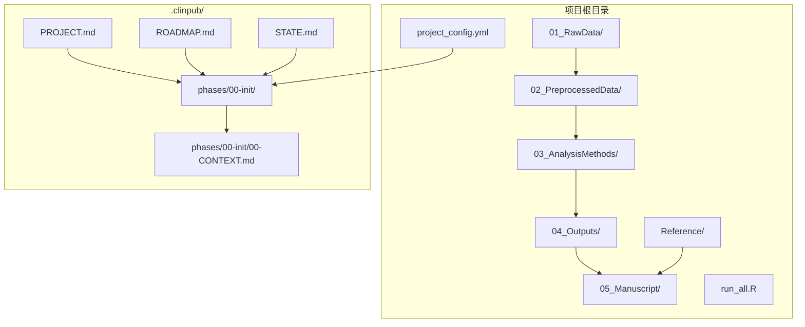
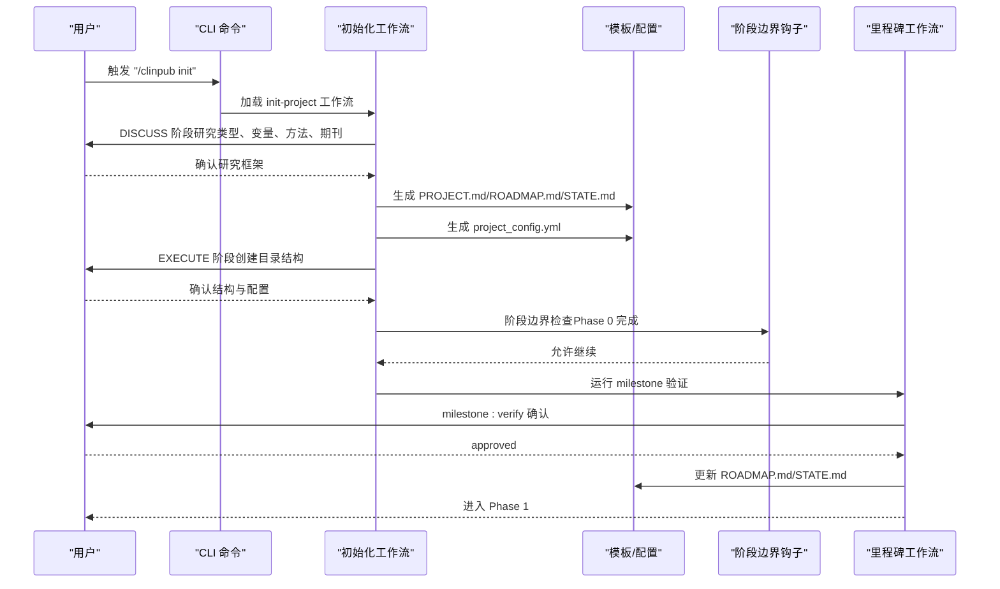
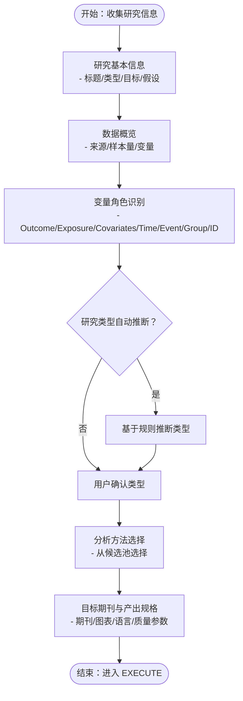
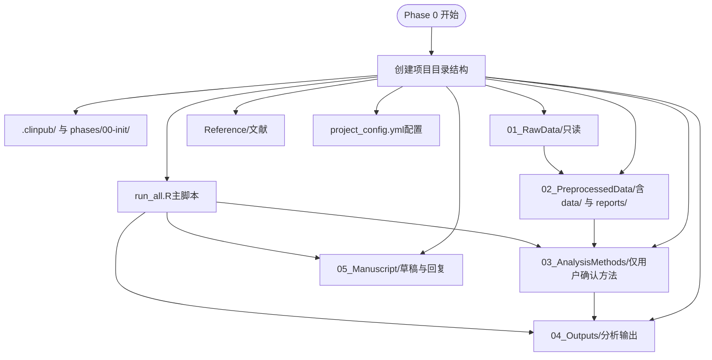
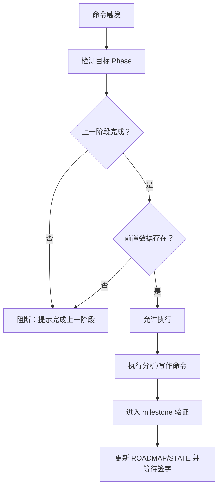
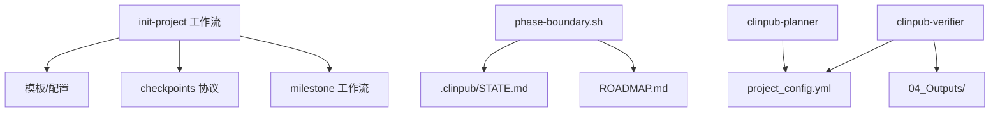

# 阶段0：项目初始化

<cite>
**本文档引用的文件**
- [init-project.md](file://commands/clinpub/init-project.md)
- [init-project.md](file://pipeline/workflows/init-project.md)
- [project_config.yml](file://pipeline/templates/project_config.yml)
- [project_config.example.yml](file://examples/project_config.example.yml)
- [project.md](file://pipeline/templates/project.md)
- [roadmap.md](file://pipeline/templates/roadmap.md)
- [state.md](file://pipeline/templates/state.md)
- [checkpoints.md](file://pipeline/references/checkpoints.md)
- [milestone.md](file://pipeline/workflows/milestone.md)
- [milestone.md](file://pipeline/templates/milestone.md)
- [clinpub-phase-boundary.sh](file://hooks/clinpub-phase-boundary.sh)
- [data_profiler.py](file://scripts/data_profiler.py)
- [clinpub-planner.md](file://agents/clinpub-planner.md)
- [clinpub-verifier.md](file://agents/clinpub-verifier.md)
</cite>

## 目录
1. [引言](#引言)
2. [项目结构](#项目结构)
3. [核心组件](#核心组件)
4. [架构概览](#架构概览)
5. [详细组件分析](#详细组件分析)
6. [依赖关系分析](#依赖关系分析)
7. [性能考虑](#性能考虑)
8. [故障排除指南](#故障排除指南)
9. [结论](#结论)
10. [附录](#附录)

## 引言
本文件系统性阐述"阶段0：项目初始化"的技术实现，围绕 DISCUSS → PLAN → EXECUTE → VERIFY 四步法，详解研究框架讨论、研究类型自动推断、关键变量识别与分析方法选择，以及项目目录结构创建、配置生成与决策记录机制。同时覆盖阶段边界检查、里程碑评审标准与状态管理流程，并提供执行示例、配置模板解析与常见问题解决方案，最后给出扩展指导。

## 项目结构
阶段0初始化遵循统一的项目布局，确保后续 Phase 的可追溯性与可执行性。核心目录与文件如下：
- .clinpub/：项目规划与状态存储层，包含 PROJECT.md、ROADMAP.md、STATE.md 与 phases/00-init/00-CONTEXT.md
- 01_RawData/：原始数据存放区（只读）
- 02_PreprocessedData/：预处理数据与报告
- 03_AnalysisMethods/：仅包含用户确认的分析方法目录
- 04_Outputs/：分析输出（图、表、统计报告）
- Reference/：文献资料
- 05_Manuscript/：论文草稿与审稿回复
- project_config.yml：项目配置文件
- run_all.R：主运行脚本



**图表来源**
- [init-project.md:39-65](file://pipeline/workflows/init-project.md#L39-L65)
- [project.md:1-30](file://pipeline/templates/project.md#L1-L30)
- [roadmap.md:1-19](file://pipeline/templates/roadmap.md#L1-L19)
- [state.md:1-19](file://pipeline/templates/state.md#L1-L19)

**章节来源**
- [init-project.md:39-65](file://pipeline/workflows/init-project.md#L39-L65)
- [project.md:1-30](file://pipeline/templates/project.md#L1-L30)
- [roadmap.md:1-19](file://pipeline/templates/roadmap.md#L1-L19)
- [state.md:1-19](file://pipeline/templates/state.md#L1-L19)

## 核心组件
- 初始化命令入口：负责声明 CLI 命令、工具权限与执行上下文，委托 init-project 工作流端到端执行。
- 初始化工作流：定义 DISCUSS → PLAN → EXECUTE → VERIFY 的四步法，明确成功标准与里程碑。
- 配置模板：提供 project_config.yml 的完整结构与默认值，支撑后续 Phase 的计划与执行。
- 模板与文档：PROJECT.md、ROADMAP.md、STATE.md 作为初始化阶段的产物与状态载体。
- 钩子与边界检查：phase-boundary.sh 保障阶段顺序与前置条件，防止越权执行。
- 验证与里程碑：milestone 工作流与 checkpoints 协议确保阶段交付物与决策可审计。

**章节来源**
- [init-project.md:1-34](file://commands/clinpub/init-project.md#L1-L34)
- [init-project.md:1-124](file://pipeline/workflows/init-project.md#L1-L124)
- [project_config.yml:1-97](file://pipeline/templates/project_config.yml#L1-L97)
- [milestone.md:1-163](file://pipeline/workflows/milestone.md#L1-L163)
- [checkpoints.md:1-120](file://pipeline/references/checkpoints.md#L1-L120)
- [clinpub-phase-boundary.sh:1-153](file://hooks/clinpub-phase-boundary.sh#L1-L153)

## 架构概览
阶段0采用"讨论-决策-执行-验证"闭环，结合钩子与里程碑协议，形成强约束的状态机：



**图表来源**
- [init-project.md:18-115](file://pipeline/workflows/init-project.md#L18-L115)
- [milestone.md:15-154](file://pipeline/workflows/milestone.md#L15-L154)
- [checkpoints.md:30-75](file://pipeline/references/checkpoints.md#L30-L75)
- [clinpub-phase-boundary.sh:34-71](file://hooks/clinpub-phase-boundary.sh#L34-L71)

## 详细组件分析

### 研究框架讨论与自动推断
- 讨论要点：研究基本信息（标题、类型、目标、假设）、数据概览（来源、样本量、关键变量）、分析方法选择、预期产出（目标期刊、图表类型、语言偏好）。
- 研究类型自动推断：基于变量角色与命名模式进行启发式判断，例如随机分组提示 RCT、生存分析信号提示队列/病例对照、单时点暴露+结局提示横断面、仅人口学/临床特征提示描述性等。最终仍需用户确认。
- 关键变量识别：Outcome、Exposure、Covariates、Time、Event、Group、ID 等角色通过数据概览与命名模式识别，必要时结合 profiler 的角色推断逻辑。
- 方法选择池：包含基线表、组间比较、回归、生存分析、亚组、敏感性分析、相关性、ROC、生物标志物面板、机器学习等候选方法，按波次结构组织。



**图表来源**
- [init-project.md:20-37](file://pipeline/workflows/init-project.md#L20-L37)
- [data_profiler.py:102-130](file://scripts/data_profiler.py#L102-L130)

**章节来源**
- [init-project.md:20-37](file://pipeline/workflows/init-project.md#L20-L37)
- [data_profiler.py:102-130](file://scripts/data_profiler.py#L102-L130)

### 项目目录结构创建逻辑
- 目录层级严格遵循 Phase 0 的约定，确保后续 Phase 的可执行性与一致性。
- 仅创建用户确认的分析方法目录，避免冗余与歧义。
- 自动生成 .clinpub/ 层的 PROJECT.md、ROADMAP.md、STATE.md 与 00-CONTEXT.md 决策日志。



**图表来源**
- [init-project.md:39-65](file://pipeline/workflows/init-project.md#L39-L65)

**章节来源**
- [init-project.md:39-65](file://pipeline/workflows/init-project.md#L39-L65)

### 配置生成规则与模板解析
- 配置结构：project、variables、paths、analysis_plan、language、quality、analysis、citation_strategy 等关键分区。
- 默认值与占位符：模板提供默认值与占位符，便于后续 Phase 动态填充。
- 示例配置：提供典型 RCT 示例，展示变量、路径、语言与质量参数的实际取值方式。
- 模板渲染：PROJECT.md、ROADMAP.md、STATE.md 通过 Mustache 风格占位符与配置联动。

```mermaid
erDiagram
PROJECT_CONFIG {
string project.name
string project.description
string project.design
number project.sample_size
string project.target_journal
string project.reporting_standard
map variables.outcome
string variables.outcome_type
array variables.exposure
array variables.covariates
string variables.time_variable
string variables.event_variable
string variables.group_variable
string variables.id_variable
map paths.raw_data
map paths.preprocessed
map paths.methods
map paths.outputs
map paths.reference
map paths.manuscript
map paths.progress
map paths.global
map analysis_plan.waves
string language.manuscript
string language.figures_tables
string language.statistics
string quality.journal_level
number quality.figure_dpi
string quality.figure_format
string quality.figure_font
number quality.figure_font_size
number analysis.missing_threshold_low
number analysis.missing_threshold_mid
number analysis.missing_threshold_high
number analysis.significance_level
string analysis.multiple_comparison
}
```

**图表来源**
- [project_config.yml:6-97](file://pipeline/templates/project_config.yml#L6-L97)
- [project_config.example.yml:8-68](file://examples/project_config.example.yml#L8-L68)

**章节来源**
- [project_config.yml:1-97](file://pipeline/templates/project_config.yml#L1-L97)
- [project_config.example.yml:1-68](file://examples/project_config.example.yml#L1-L68)
- [project.md:1-30](file://pipeline/templates/project.md#L1-L30)
- [roadmap.md:1-19](file://pipeline/templates/roadmap.md#L1-L19)
- [state.md:1-19](file://pipeline/templates/state.md#L1-L19)

### 决策记录机制
- 决策日志：00-CONTEXT.md 记录研究类型与理由、变量角色与定义、选定方法、目标期刊与质量要求、延期与开放问题。
- 状态持久化：所有决策与产物写入 .clinpub/，确保可追溯与审计。
- 里程碑集成：milestone 工作流汇总决策与产出，生成标准化 MILESTONE.md。

**章节来源**
- [init-project.md:80-87](file://pipeline/workflows/init-project.md#L80-L87)
- [milestone.md:83-94](file://pipeline/workflows/milestone.md#L83-L94)
- [milestone.md:1-46](file://pipeline/templates/milestone.md#L1-L46)

### 阶段边界检查与里程碑评审
- 边界检查：phase-boundary.sh 在执行分析/写作等命令前，检查上一阶段里程碑状态与前置数据是否存在，未完成则阻断并提示。
- 里程碑协议：checkpoints.md 定义 decision/verify/milestone 三类节点，强调验证确认与状态持久化。
- milestone 工作流：验证成功标准、汇总决策与产出、生成 MILESTONE.md、更新 ROADMAP.md/STATE.md、等待用户签字。



**图表来源**
- [clinpub-phase-boundary.sh:34-104](file://hooks/clinpub-phase-boundary.sh#L34-L104)
- [milestone.md:42-81](file://pipeline/workflows/milestone.md#L42-L81)
- [checkpoints.md:51-75](file://pipeline/references/checkpoints.md#L51-L75)

**章节来源**
- [clinpub-phase-boundary.sh:1-153](file://hooks/clinpub-phase-boundary.sh#L1-L153)
- [milestone.md:1-163](file://pipeline/workflows/milestone.md#L1-L163)
- [checkpoints.md:1-120](file://pipeline/references/checkpoints.md#L1-L120)

### 状态管理流程
- 当前阶段：STATE.md 记录阶段、步骤、波次与关键指标。
- 路线图：ROADMAP.md 显示各 Phase 的目标、成功标准与状态。
- 项目文档：PROJECT.md 汇总愿景、研究类型、核心变量与约束。

**章节来源**
- [state.md:1-19](file://pipeline/templates/state.md#L1-L19)
- [roadmap.md:1-19](file://pipeline/templates/roadmap.md#L1-L19)
- [project.md:1-30](file://pipeline/templates/project.md#L1-L30)

### 实际执行示例
- CLI 命令：使用 "/clinpub init" 触发初始化工作流，工作流自动引导讨论、生成文档与配置、创建目录结构、记录决策并进入 milestone 验证。
- 配置模板解析：PROJECT.md/ROADMAP.md/STATE.md 通过 project_config.yml 的字段进行渲染，确保一致性。
- 验证与里程碑：milestone 工作流对 Phase 0 的成功标准进行核验，生成 MILESTONE.md 并更新路线图与状态。

**章节来源**
- [init-project.md:14-34](file://commands/clinpub/init-project.md#L14-L34)
- [init-project.md:18-115](file://pipeline/workflows/init-project.md#L18-L115)
- [milestone.md:42-154](file://pipeline/workflows/milestone.md#L42-L154)

### 常见问题与解决方案
- 未完成上一阶段即执行后续命令：phase-boundary.sh 会阻断并提示完成上一阶段与里程碑签字。
- 缺少前置数据：检查 01_RawData/、02_PreprocessedData/data/cleaned.csv、04_Outputs/、05_Manuscript/manuscript.md 等目录与文件是否存在。
- milestone 未生成导致边界检查失败：确保在推进到下一阶段前生成 MILESTONE.md 并等待用户签字。
- 配置字段缺失或为空：检查 project_config.yml 的关键字段（如 study_design、variables、paths）是否完整。

**章节来源**
- [clinpub-phase-boundary.sh:135-147](file://hooks/clinpub-phase-boundary.sh#L135-L147)
- [milestone.md:112-152](file://pipeline/workflows/milestone.md#L112-L152)
- [project_config.yml:6-33](file://pipeline/templates/project_config.yml#L6-L33)

### 扩展指导
- 自定义初始化流程：可在 init-project 工作流中新增讨论步骤或引入外部工具，但需保持成功标准与里程碑协议不变。
- 自定义配置模板：在 project_config.yml 中增加新字段，并在模板与渲染处同步更新。
- 自定义边界检查：在 phase-boundary.sh 中扩展前置条件检查，确保新阶段的必需文件与状态满足要求。
- 验证与里程碑增强：在 milestone 工作流中增加新的成功标准项，或在 verifier 代理中扩展验证模式。

**章节来源**
- [init-project.md:1-124](file://pipeline/workflows/init-project.md#L1-L124)
- [project_config.yml:1-97](file://pipeline/templates/project_config.yml#L1-L97)
- [clinpub-phase-boundary.sh:1-153](file://hooks/clinpub-phase-boundary.sh#L1-L153)
- [milestone.md:1-163](file://pipeline/workflows/milestone.md#L1-L163)
- [clinpub-verifier.md:1-439](file://agents/clinpub-verifier.md#L1-L439)

## 依赖关系分析
- 工作流依赖：init-project 工作流依赖模板与参考文件，最终通过 milestone 工作流完成阶段关闭。
- 钩子依赖：phase-boundary.sh 依赖 .clinpub/ 的状态文件与目录结构，确保阶段顺序与数据完整性。
- 代理依赖：clinpub-planner 与 clinpub-verifier 依赖 project_config.yml 与各 Phase 的产物，确保计划与验证的准确性。



**图表来源**
- [init-project.md:10-16](file://pipeline/workflows/init-project.md#L10-L16)
- [milestone.md:10-13](file://pipeline/workflows/milestone.md#L10-L13)
- [clinpub-phase-boundary.sh:17-18](file://hooks/clinpub-phase-boundary.sh#L17-L18)
- [clinpub-planner.md:24-44](file://agents/clinpub-planner.md#L24-L44)
- [clinpub-verifier.md:35-56](file://agents/clinpub-verifier.md#L35-L56)

**章节来源**
- [init-project.md:10-16](file://pipeline/workflows/init-project.md#L10-L16)
- [milestone.md:10-13](file://pipeline/workflows/milestone.md#L10-L13)
- [clinpub-phase-boundary.sh:16-26](file://hooks/clinpub-phase-boundary.sh#L16-L26)
- [clinpub-planner.md:24-44](file://agents/clinpub-planner.md#L24-L44)
- [clinpub-verifier.md:35-56](file://agents/clinpub-verifier.md#L35-L56)

## 性能考虑
- 自动化优先：尽量将可自动化步骤纳入工作流，减少人工干预与重复劳动。
- 快速验证：利用 grep/file 检查与最小化重算，避免大规模重跑分析。
- 资源隔离：确保各 Phase 的目录与文件边界清晰，降低交叉污染风险。
- 可追溯性：所有决策与产物持久化至 .clinpub/，便于回溯与审计。

## 故障排除指南
- 阶段顺序错误：phase-boundary.sh 会阻断并提示完成上一阶段与里程碑签字。
- 配置不完整：检查 project_config.yml 的关键字段是否齐全，必要时参考示例配置。
- 文档未生成：确认 init-project 工作流已执行并生成 PROJECT.md/ROADMAP.md/STATE.md。
- milestone 未生成：确保在推进到下一阶段前完成 milestone 验证并生成 MILESTONE.md。

**章节来源**
- [clinpub-phase-boundary.sh:135-147](file://hooks/clinpub-phase-boundary.sh#L135-L147)
- [milestone.md:112-152](file://pipeline/workflows/milestone.md#L112-L152)
- [project_config.yml:6-33](file://pipeline/templates/project_config.yml#L6-L33)

## 结论
阶段0初始化通过 DISCUSS → PLAN → EXECUTE → VERIFY 的闭环流程，结合自动推断、配置模板与里程碑协议，确保研究框架的科学性与可执行性。严格的阶段边界检查与状态管理机制，为后续 Phase 的顺利推进奠定坚实基础。开发者可在此基础上扩展讨论维度、配置字段与验证模式，以适配更复杂的科研场景。

## 附录
- 关键术语
  - 研究框架：包括研究类型、核心变量、分析方法与预期产出的系统化设计。
  - 自动推断：基于变量角色与命名模式的启发式判断，需用户最终确认。
  - 成功标准：阶段完成的可验证清单，用于 milestone 验证。
  - 决策日志：贯穿各阶段的关键决策与理由记录，确保可追溯性。
- 参考文件
  - 初始化命令与工作流：commands/clinpub/init-project.md、pipeline/workflows/init-project.md
  - 配置模板与示例：pipeline/templates/project_config.yml、examples/project_config.example.yml
  - 模板与文档：pipeline/templates/project.md、pipeline/templates/roadmap.md、pipeline/templates/state.md
  - 验证与里程碑：pipeline/references/checkpoints.md、pipeline/workflows/milestone.md、pipeline/templates/milestone.md
  - 阶段边界检查：hooks/clinpub-phase-boundary.sh
  - 角色推断：scripts/data_profiler.py
  - 计划与验证代理：agents/clinpub-planner.md、agents/clinpub-verifier.md