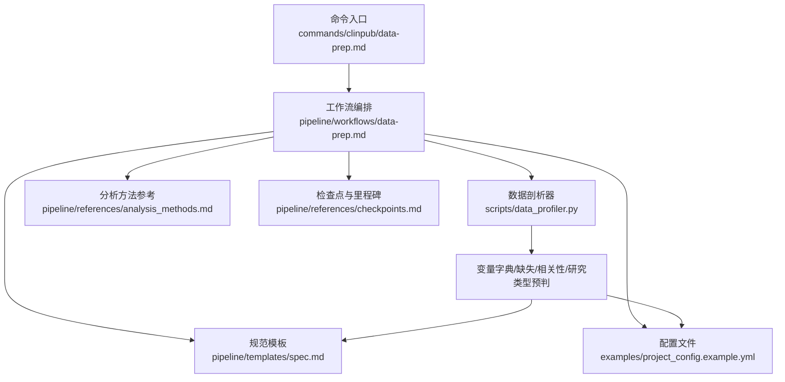
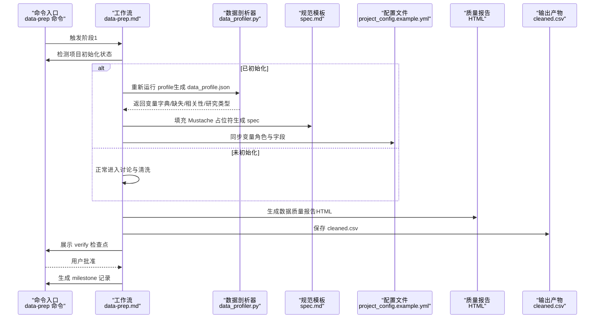
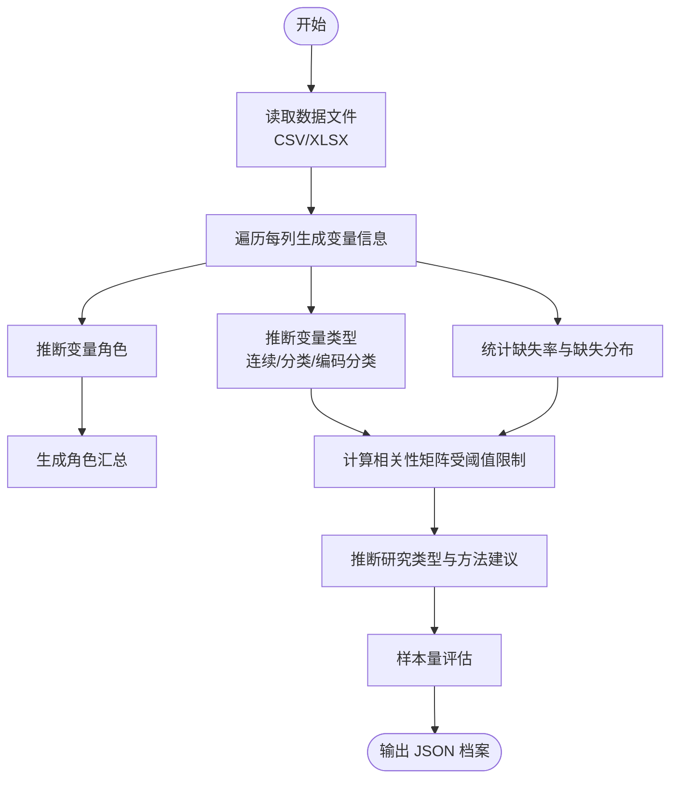
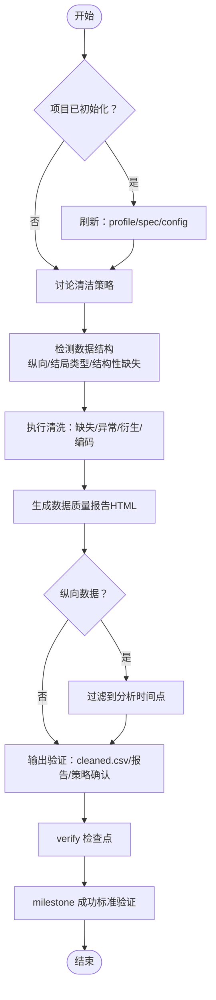
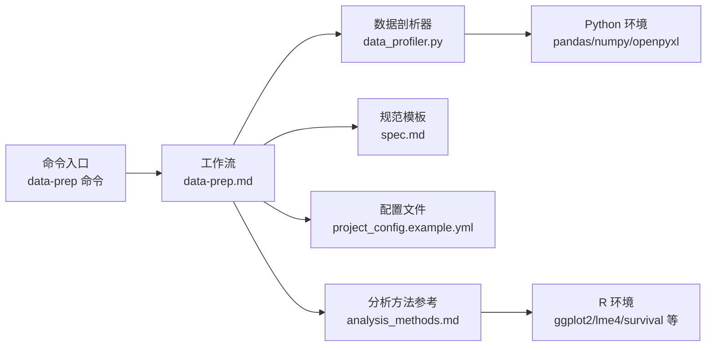

# 阶段1：数据准备

<cite>
**本文引用的文件**   
- [data-prep.md](file://pipeline/workflows/data-prep.md)
- [data-prep 命令](file://commands/clinpub/data-prep.md)
- [数据剖析器脚本](file://scripts/data_profiler.py)
- [项目配置示例](file://examples/project_config.example.yml)
- [配置指南](file://docs/CONFIGURATION.md)
- [分析方法参考](file://pipeline/references/analysis_methods.md)
- [规范模板](file://pipeline/templates/spec.md)
- [检查点与里程碑协议](file://pipeline/references/checkpoints.md)
</cite>

## 目录
1. [引言](#引言)
2. [项目结构](#项目结构)
3. [核心组件](#核心组件)
4. [架构总览](#架构总览)
5. [详细组件分析](#详细组件分析)
6. [依赖关系分析](#依赖关系分析)
7. [性能考量](#性能考量)
8. [故障排查指南](#故障排查指南)
9. [结论](#结论)
10. [附录](#附录)

## 引言
本文件面向“阶段1：数据准备”的综合技术文档，聚焦于数据预处理流水线的设计原理与执行逻辑，涵盖数据质量评估、缺失值处理策略、异常值检测机制、数据转换与变量重编码、数据合并策略、数据档案生成、统计描述与可视化报告、Python 数据剖析脚本使用指南、R 语言数据处理模式与示例、数据验证标准与质量控制指标、错误处理机制以及面向开发者的自定义扩展方案。目标是帮助研发与分析人员以统一、可复现的方式完成从原始数据到清洗后数据集与质量报告的全流程。

## 项目结构
- 阶段1工作流位于 pipeline/workflows/data-prep.md，定义了从重新初始化、结构检测、清洗执行、输出验证到里程碑关闭的完整过程。
- 数据剖析脚本 scripts/data_profiler.py 提供变量字典、缺失模式、相关性与研究类型预判，支撑 spec 生成与配置同步。
- commands/clinpub/data-prep.md 定义命令入口与“重新进入”检测逻辑，确保项目已初始化时自动刷新 profile/spec/config。
- docs/CONFIGURATION.md 提供 R/Python 环境、目录结构、研究类型配置与输出规范。
- pipeline/references/analysis_methods.md 为 Phase 2 的方法选择提供决策树与实现参考。
- pipeline/templates/spec.md 为分析规范模板，配合 data_profiler 输出与项目配置自动生成。
- pipeline/references/checkpoints.md 定义 checkpoint/milestone 的验证与记录规范。

**图表来源**
- [data-prep.md:1-184](file://pipeline/workflows/data-prep.md#L1-L184)
- [data-prep 命令:1-50](file://commands/clinpub/data-prep.md#L1-L50)
- [数据剖析器脚本:1-353](file://scripts/data_profiler.py#L1-L353)
- [规范模板:1-125](file://pipeline/templates/spec.md#L1-L125)
- [项目配置示例:1-68](file://examples/project_config.example.yml#L1-L68)
- [分析方法参考:1-311](file://pipeline/references/analysis_methods.md#L1-L311)
- [检查点与里程碑协议:1-120](file://pipeline/references/checkpoints.md#L1-L120)

**章节来源**
- [data-prep.md:1-184](file://pipeline/workflows/data-prep.md#L1-L184)
- [data-prep 命令:1-50](file://commands/clinpub/data-prep.md#L1-L50)
- [配置指南:187-210](file://docs/CONFIGURATION.md#L187-L210)

## 核心组件
- 重新进入刷新（reinit_data_prep）：当检测到项目已初始化，自动刷新 profile、生成 spec 并同步 project_config.yml，确保变量角色与配置一致性。
- 清洁策略讨论（discuss_cleaning_strategy）：在执行清洗前与用户确认缺失值策略、异常值处理、变量编码、衍生变量与训练/验证拆分。
- 数据结构检测（detect_data_structure）：识别纵向/重复测量数据、结局类型与结构性缺失，并记录结构信息。
- 清洗执行（execute_cleaning）：导入数据、缺失值处理、异常值检测、衍生变量与编码、生成数据质量报告、必要时过滤到分析时间点。
- 输出验证（validate_output）：校验 cleaned.csv、行列数、高缺失变量处理、数据类型与清洗代码可复现性。
- 检查点与里程碑（checkpoint_confirm/milestone）：以 verify 决策点收集用户确认，milestone 验证成功标准并记录。

**章节来源**
- [data-prep.md:17-184](file://pipeline/workflows/data-prep.md#L17-L184)
- [checkpoints.md:10-75](file://pipeline/references/checkpoints.md#L10-L75)

## 架构总览
阶段1采用“命令入口 → 工作流编排 → 数据剖析 → 规范生成/配置同步 → 清洗执行 → 质量报告 → 验证与里程碑”的流水线架构。命令入口负责“重新进入”检测，工作流编排负责步骤调度，数据剖析器提供数据画像，规范模板与配置文件共同驱动分析规范生成与变量角色同步，最终产出 cleaned.csv 与数据质量报告。

**图表来源**
- [data-prep 命令:25-40](file://commands/clinpub/data-prep.md#L25-L40)
- [data-prep.md:17-184](file://pipeline/workflows/data-prep.md#L17-L184)
- [数据剖析器脚本:201-325](file://scripts/data_profiler.py#L201-L325)
- [规范模板:1-125](file://pipeline/templates/spec.md#L1-L125)
- [项目配置示例:16-33](file://examples/project_config.example.yml#L16-L33)

## 详细组件分析

### 数据剖析器（Python）
- 功能职责：读取 CSV/XLSX，输出变量字典、缺失统计、相关性警告、研究类型预判、角色汇总与样本量评估。
- 关键流程：
  - 读取数据 → 遍历列生成变量信息（类型、缺失率、统计摘要、角色推断）→ 汇总缺失与相关性 → 推断研究类型 → 生成角色汇总与样本量评估。
- 变量角色推断：基于变量名模式匹配 outcome/exposure/time/covariate/biomarker/matching/id 等关键词集合，返回角色标签。
- 研究类型预判：综合暴露/结局/时间/匹配/标志物数量等特征，给出多种研究类型的置信度与方法建议。
- 性能与健壮性：对数值变量超过阈值时发出相关性矩阵警告；对空列与空数据框进行容错处理；支持 Excel 多工作表读取。

**图表来源**
- [数据剖析器脚本:201-325](file://scripts/data_profiler.py#L201-L325)

**章节来源**
- [数据剖析器脚本:1-353](file://scripts/data_profiler.py#L1-L353)

### 阶段1工作流（data-prep.md）
- 重新进入刷新（reinit_data_prep）：定位原始数据文件，运行数据剖析器生成 data_profile.json，读取变量摘要与配置，填充 spec 模板并同步 project_config.yml。
- 清洁策略讨论（discuss_cleaning_strategy）：缺失值策略（<5%/5-20%/ >20%）、异常值处理（IQR/Z-score）、变量编码、衍生变量、训练/验证拆分。
- 数据结构检测（detect_data_structure）：识别纵向/重复测量、结局类型、结构性缺失；记录结构信息至阶段档案。
- 清洗执行（execute_cleaning）：导入数据、缺失值处理、异常值检测、衍生变量与编码、生成数据质量报告、必要时过滤到分析时间点。
- 输出验证（validate_output）：校验 cleaned.csv、行列数、缺失处理、数据类型、清洗代码可复现性。
- 检查点与里程碑（checkpoint_confirm/milestone）：verify 确认与 milestone 成功标准验证。

**图表来源**
- [data-prep.md:17-184](file://pipeline/workflows/data-prep.md#L17-L184)
- [checkpoints.md:30-75](file://pipeline/references/checkpoints.md#L30-L75)

**章节来源**
- [data-prep.md:17-184](file://pipeline/workflows/data-prep.md#L17-L184)
- [checkpoints.md:1-120](file://pipeline/references/checkpoints.md#L1-L120)

### 规范生成与配置同步
- 规范模板（spec.md）：通过 Mustache 占位符填充 study_title、study_type、N、primary_outcome、phase_number/name、date 等，形成阶段性分析规范。
- 配置同步：读取 data_profile.json 的 role_summary，自动填充 project_config.yml 中 outcome/covariates/group_variable 等字段，保留用户手动编辑的非变量字段。

**章节来源**
- [data-prep.md:27-47](file://pipeline/workflows/data-prep.md#L27-L47)
- [规范模板:1-125](file://pipeline/templates/spec.md#L1-L125)
- [项目配置示例:16-33](file://examples/project_config.example.yml#L16-L33)

### 数据质量评估与报告
- 评估内容：变量摘要表、缺失矩阵、关键变量分布图、异常值记录、训练/验证拆分摘要（若适用）、纵向数据缺失模式（区分结构性缺失与随机缺失）。
- 报告形式：HTML 报告，便于用户审阅与后续分析追溯。

**章节来源**
- [data-prep.md:116-122](file://pipeline/workflows/data-prep.md#L116-L122)

### 缺失值处理策略
- 策略分级：
  - <5%：删除行或用均值/中位数/众数填补
  - 5%-20%：MICE 插补（报告插补模型）
  - >20%：与用户讨论后再决定
- 与用户确认：通过 decision verify checkpoint 收集用户选择与理由，确保策略透明可追溯。

**章节来源**
- [data-prep.md:104-107](file://pipeline/workflows/data-prep.md#L104-L107)
- [checkpoints.md:16-27](file://pipeline/references/checkpoints.md#L16-L27)

### 异常值检测机制
- 连续变量：IQR（1.5×）或 Z-score（|Z|>3）
- 分类变量：检查意外取值
- 记录与处理：标记并文档化所有异常值，必要时进行 winsorization 或剔除，并在报告中体现处理策略。

**章节来源**
- [data-prep.md:108-111](file://pipeline/workflows/data-prep.md#L108-L111)

### 数据转换与变量重编码
- 连续变量：可选 log、Box-Cox 等变换（依据分布与分析需求）。
- 分类变量：设定因子水平与参考类别，避免信息损失。
- 衍生变量：按研究问题创建计算变量（如变化量、复合评分等），并在报告中记录生成规则。

**章节来源**
- [data-prep.md:112-115](file://pipeline/workflows/data-prep.md#L112-L115)

### 数据合并策略
- 纵向数据：先生成完整纵向数据（用于混合模型等分析），再按用户确认的分析时间点过滤出单一时间点数据用于基线表与组间比较。
- 结构性缺失：在报告中区分结构性缺失与随机缺失，避免重复计数与误判。

**章节来源**
- [data-prep.md:82-97](file://pipeline/workflows/data-prep.md#L82-L97)
- [data-prep.md:124-127](file://pipeline/workflows/data-prep.md#L124-L127)

### Python 数据剖析脚本使用指南
- 安装依赖：pandas、numpy、openpyxl（requirements.txt 与 CONFIGURATION.md 提供安装指引）。
- 基本用法：支持 CSV 与 XLSX；可指定工作表名；可输出 JSON 档案。
- 输出内容：变量字典、缺失统计、相关性警告、研究类型预判、角色汇总、样本量评估。
- 与工作流集成：在 reinit_data_prep 步骤中调用，生成 data_profile.json 供后续 spec 生成与配置同步使用。

**章节来源**
- [数据剖析器脚本:1-353](file://scripts/data_profiler.py#L1-L353)
- [配置指南:108-136](file://docs/CONFIGURATION.md#L108-L136)

### R 语言数据处理模式与示例
- 环境与包：R（≥4.2）、必需包（dplyr、tidyr、survival、lme4、ggplot2、gtsummary、openxlsx 等）。
- 目录结构：遵循 CONFIGURATION.md 的标准目录，输出统一命名规范与图表标准。
- 方法参考：analysis_methods.md 提供按数据特征匹配的分析方法决策树与实现要点（如基线表、组间比较、重复测量混合模型、ROC 分析等）。

**章节来源**
- [配置指南:80-101](file://docs/CONFIGURATION.md#L80-L101)
- [分析方法参考:18-311](file://pipeline/references/analysis_methods.md#L18-L311)

### 实际数据处理示例
- 示例项目配置：examples/project_config.example.yml 提供 RCT 示例，包含 outcome/exposure/covariates/time_variable/group_variable/id_variable 等映射。
- 工作流落地：data-prep.md 定义了从 reinit 到 milestone 的完整步骤，结合 data_profiler 输出与 spec 模板，确保清洗策略与分析规范一致。

**章节来源**
- [项目配置示例:1-68](file://examples/project_config.example.yml#L1-L68)
- [data-prep.md:17-184](file://pipeline/workflows/data-prep.md#L17-L184)

### 数据验证标准与质量控制指标
- 成功标准（success_criteria）：cleaned.csv 存在、数据质量报告生成、缺失值按策略处理、异常值记录、衍生变量创建与编码、清洗代码可独立复现。
- 质量控制指标：缺失率分布、高相关性变量提示、结局类型与数据结构一致性、纵向数据时间点过滤、训练/验证拆分合理性。
- 检查点与里程碑：verify 用于用户确认，milestone 用于正式验收并记录决策与产出。

**章节来源**
- [data-prep.md:175-183](file://pipeline/workflows/data-prep.md#L175-L183)
- [checkpoints.md:30-75](file://pipeline/references/checkpoints.md#L30-L75)

### 错误处理机制
- 输入校验：文件存在性、路径有效性、配置字段完整性。
- 健壮性：对空列、空数据框、超阈值相关性矩阵进行容错与警告。
- 用户反馈：通过 decision/verify checkpoint 收集用户选择，避免自动处理导致的偏差。
- 记录与追溯：所有决策与处理策略写入阶段档案与里程碑记录，便于审计与复现。

**章节来源**
- [数据剖析器脚本:335-348](file://scripts/data_profiler.py#L335-L348)
- [checkpoints.md:16-27](file://pipeline/references/checkpoints.md#L16-L27)

### 开发者扩展方案
- 新增缺失值策略：在 discuss_cleaning_strategy 与 execute_cleaning 中扩展阈值与方法选项，并在 verify checkpoint 中增加用户选项。
- 新增异常值检测方法：在 detect_data_structure 与 execute_cleaning 中引入新的检测与处理策略（如基于分布的离群点检测）。
- 新增变量重编码规则：在 derive/encode 步骤中加入自定义映射与参考类别设定。
- 新增数据合并策略：在纵向数据处理环节扩展时间点选择与合并规则。
- 新增报告内容：在数据质量报告生成模块中扩展统计描述与可视化类型。
- 新增验证规则：在 validate_output 中增加新的校验项（如特定变量类型、范围约束等）。

**章节来源**
- [data-prep.md:100-145](file://pipeline/workflows/data-prep.md#L100-L145)
- [checkpoints.md:10-75](file://pipeline/references/checkpoints.md#L10-L75)

## 依赖关系分析
- 命令入口依赖工作流编排；工作流编排依赖数据剖析器、规范模板与配置文件；数据剖析器依赖 pandas/numpy/openpyxl；R 环境依赖 ggplot2/lme4/survival 等包。
- 依赖耦合：工作流与数据剖析器之间为数据依赖（profile 输出 → spec 生成与配置同步）；工作流与 R/Python 环境之间为工具链依赖（分析方法参考与实现）。

**图表来源**
- [data-prep 命令:1-50](file://commands/clinpub/data-prep.md#L1-L50)
- [data-prep.md:1-184](file://pipeline/workflows/data-prep.md#L1-L184)
- [数据剖析器脚本:19-24](file://scripts/data_profiler.py#L19-L24)
- [分析方法参考:1-311](file://pipeline/references/analysis_methods.md#L1-L311)
- [配置指南:80-136](file://docs/CONFIGURATION.md#L80-L136)

**章节来源**
- [data-prep 命令:1-50](file://commands/clinpub/data-prep.md#L1-L50)
- [data-prep.md:1-184](file://pipeline/workflows/data-prep.md#L1-L184)
- [配置指南:80-136](file://docs/CONFIGURATION.md#L80-L136)

## 性能考量
- 数据剖析器：对数值变量超过阈值时发出相关性矩阵警告，避免大规模相关性计算带来的性能开销。
- 清洗执行：缺失值处理与异常值检测采用向量化与分组操作，尽量减少循环与内存拷贝。
- 报告生成：HTML 报告按需生成关键图表与表格，避免冗余输出。
- 纵向数据：先生成完整纵向数据，再按需过滤，兼顾分析灵活性与性能。

[本节为通用性能建议，无需具体文件分析]

## 故障排查指南
- 文件路径错误：确认 project_config.yml 中 paths.raw_data 指向的目录存在且包含数据文件。
- 依赖包缺失：根据 CONFIGURATION.md 安装 pandas、numpy、openpyxl（Python）与 R 包。
- 缺失率过高：在 verify checkpoint 中与用户确认是否删除变量或采用其他策略。
- 相关性警告：关注 data_profile.json 中的相关性警告，必要时减少变量数量或采用降维方法。
- 纵向数据时间点：在结构检测阶段确认 analysis_timepoint，避免重复计数与模型误设。

**章节来源**
- [配置指南:108-136](file://docs/CONFIGURATION.md#L108-L136)
- [数据剖析器脚本:282-298](file://scripts/data_profiler.py#L282-L298)
- [data-prep.md:82-97](file://pipeline/workflows/data-prep.md#L82-L97)

## 结论
阶段1数据准备通过“命令入口 → 工作流编排 → 数据剖析 → 规范生成/配置同步 → 清洗执行 → 质量报告 → 验证与里程碑”的闭环，实现了从原始数据到清洗后数据集与质量报告的标准化生产。借助数据剖析器提供的变量画像与研究类型预判，结合 tiered 的缺失值与异常值处理策略、结构化的时间点过滤与衍生变量创建，确保了分析的可复现性与可追溯性。开发者可在既定框架下灵活扩展策略与报告内容，持续优化数据准备流程。

## 附录
- 目录结构与输出规范：参考 CONFIGURATION.md 的目录结构与文件命名规范。
- 分析方法参考：参考 analysis_methods.md 的决策树与实现要点。
- 检查点与里程碑：参考 checkpoints.md 的 verify 与 milestone 格式与流程。

**章节来源**
- [配置指南:187-270](file://docs/CONFIGURATION.md#L187-L270)
- [分析方法参考:1-311](file://pipeline/references/analysis_methods.md#L1-L311)
- [检查点与里程碑协议:77-120](file://pipeline/references/checkpoints.md#L77-L120)