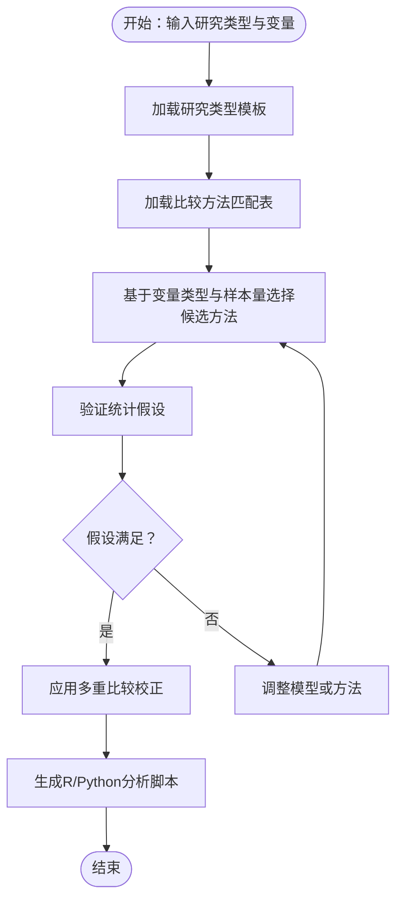
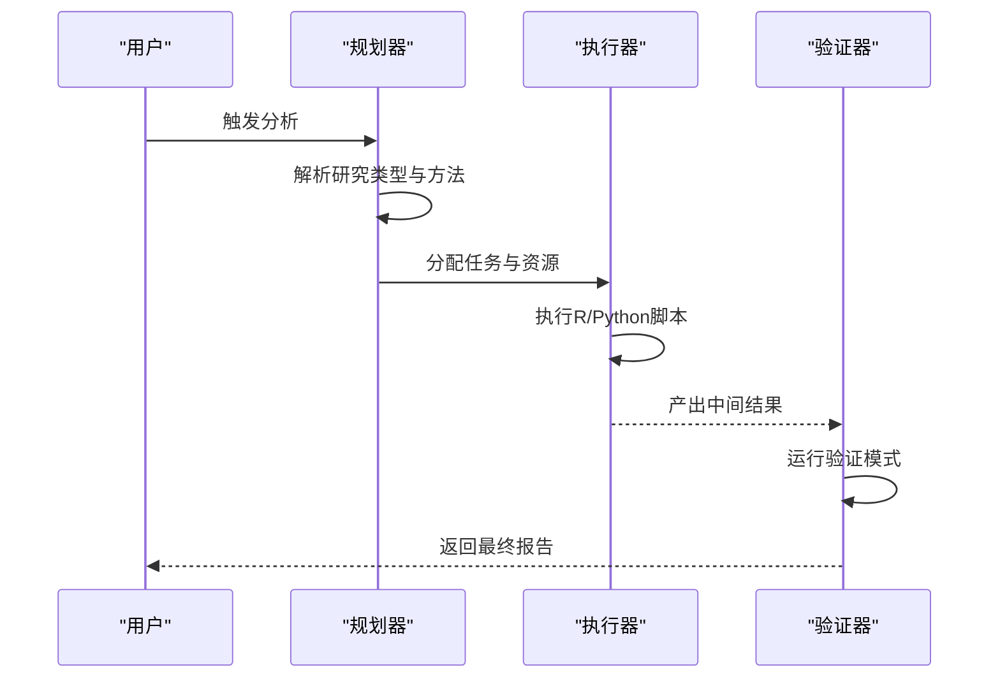
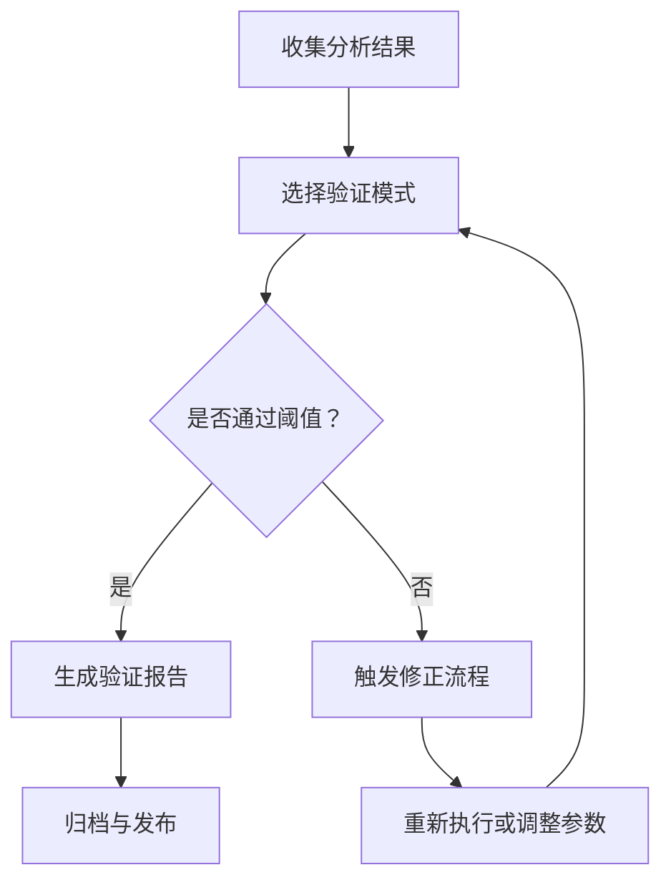
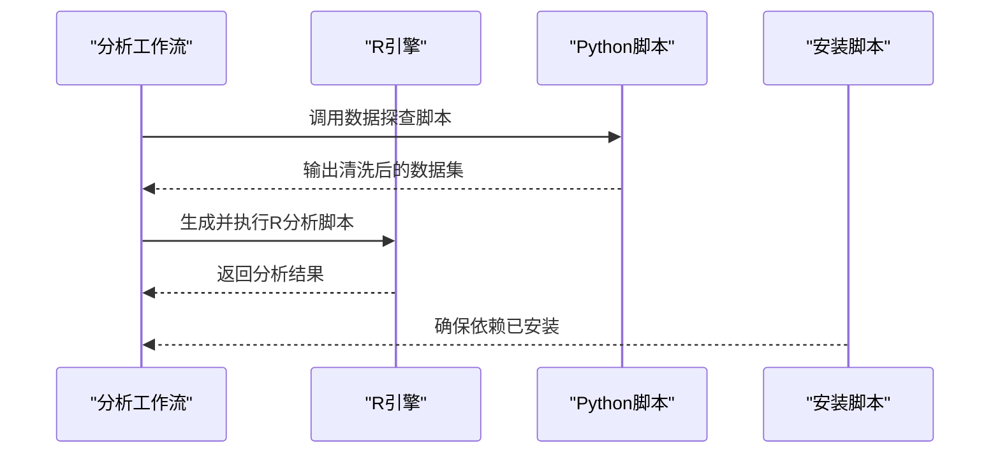
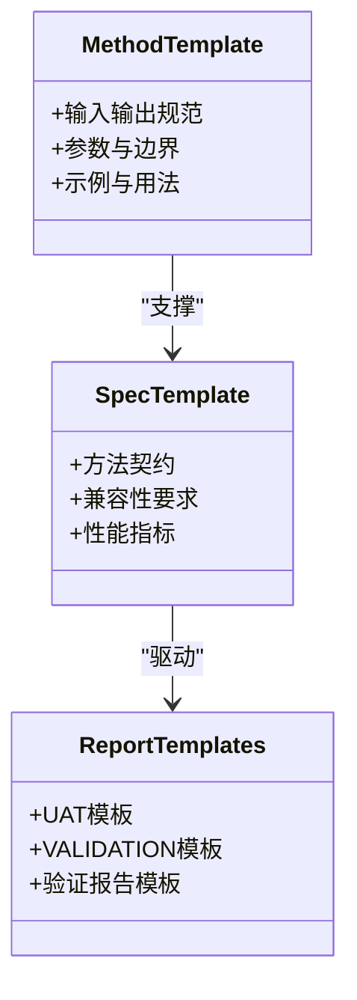
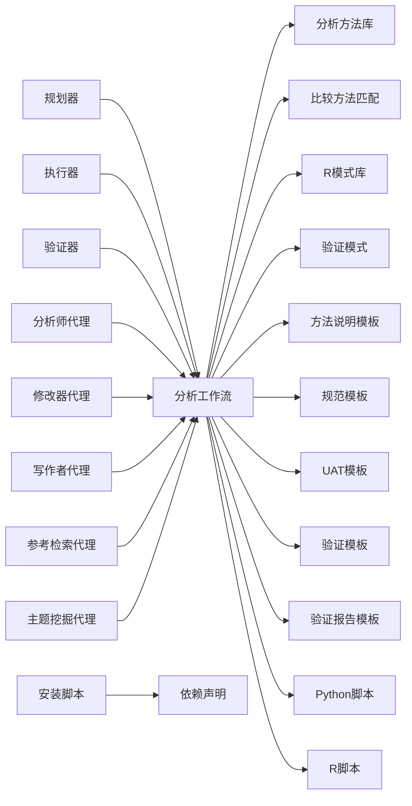

# 阶段2：统计分析

<cite>
**本文档引用的文件**
- [README.md](file://README.md)
- [ARCHITECTURE.md](file://docs/ARCHITECTURE.md)
- [CONFIGURATION.md](file://docs/CONFIGURATION.md)
- [DEVELOPMENT.md](file://docs/DEVELOPMENT.md)
- [TESTING.md](file://docs/TESTING.md)
- [getting-started.md](file://docs/getting-started.md)
- [analysis.md](file://commands/clinpub/analysis.md)
- [data-prep.md](file://commands/clinpub/data-prep.md)
- [init-project.md](file://commands/clinpub/init-project.md)
- [milestone.md](file://commands/clinpub/milestone.md)
- [review.md](file://commands/clinpub/review.md)
- [writing.md](file://commands/clinpub/writing.md)
- [analyst-agent.md](file://agents/analyst-agent.md)
- [clinpub-executor.md](file://agents/clinpub-executor.md)
- [clinpub-planner.md](file://agents/clinpub-planner.md)
- [clinpub-verifier.md](file://agents/clinpub-verifier.md)
- [modify-agent.md](file://agents/modify-agent.md)
- [reference-agent.md](file://agents/reference-agent.md)
- [topic-miner-agent.md](file://agents/topic-miner-agent.md)
- [writer-agent.md](file://agents/writer-agent.md)
- [analysis.md](file://pipeline/workflows/analysis.md)
- [data-prep.md](file://pipeline/workflows/data-prep.md)
- [data2idea.md](file://pipeline/workflows/data2idea.md)
- [init-project.md](file://pipeline/workflows/init-project.md)
- [milestone.md](file://pipeline/workflows/milestone.md)
- [modify.md](file://pipeline/workflows/modify.md)
- [next-step.md](file://pipeline/workflows/next-step.md)
- [review.md](file://pipeline/workflows/review.md)
- [writing.md](file://pipeline/workflows/writing.md)
- [analysis_methods.md](file://pipeline/references/analysis_methods.md)
- [comparison-methods.md](file://pipeline/references/comparison-methods.md)
- [citation-strategy.md](file://pipeline/references/citation-strategy.md)
- [r_patterns.md](file://pipeline/references/r_patterns.md)
- [verification-patterns.md](file://pipeline/references/verification-patterns.md)
- [manifest-format.md](file://pipeline/references/manifest-format.md)
- [concatenation-protocol.md](file://pipeline/references/concatenation-protocol.md)
- [gates.md](file://pipeline/references/gates.md)
- [mandatory-initial-read.md](file://pipeline/references/mandatory-initial-read.md)
- [context.md](file://pipeline/templates/context.md)
- [method-readme.md](file://pipeline/templates/method-readme.md)
- [spec.md](file://pipeline/templates/spec.md)
- [state.md](file://pipeline/templates/state.md)
- [roadmap.md](file://pipeline/templates/roadmap.md)
- [project.md](file://pipeline/templates/project.md)
- [project_config.yml](file://pipeline/templates/project_config.yml)
- [UAT.md](file://pipeline/templates/UAT.md)
- [VALIDATION.md](file://pipeline/templates/VALIDATION.md)
- [verification-report.md](file://pipeline/templates/verification-report.md)
- [study_types](file://pipeline/templates/study_types)
- [install.js](file://bin/install.js)
- [requirements.txt](file://requirements.txt)
- [data_profiler.py](file://scripts/data_profiler.py)
</cite>

## 目录
1. [引言](#引言)
2. [项目结构](#项目结构)
3. [核心组件](#核心组件)
4. [架构总览](#架构总览)
5. [详细组件分析](#详细组件分析)
6. [依赖关系分析](#依赖关系分析)
7. [性能考虑](#性能考虑)
8. [故障排除指南](#故障排除指南)
9. [结论](#结论)
10. [附录](#附录)

## 引言
本技术文档聚焦于“阶段2：统计分析”的核心实现与运行机制，面向开发者与数据分析师，系统阐述统计方法推荐算法、分析流程编排、结果验证机制、不同研究类型的分析策略选择与比较方法匹配、多重比较校正、自动化执行与质量评估、统计软件集成（R/Python）、R脚本生成与Python分析脚本调用、分析方法模板与结果报告格式、引用策略规范、并行化执行与资源管理、错误恢复机制，以及新增分析方法的集成指南与性能优化建议。

## 项目结构
该项目采用模块化的流水线架构，围绕“命令”“工作流”“参考库”“模板”“代理”等维度组织。阶段2统计分析主要通过以下路径落地：
- 命令层：commands/clinpub 下的分析相关命令，定义用户入口与参数传递
- 工作流层：pipeline/workflows 下的分析工作流，定义流程编排与步骤约束
- 参考库：pipeline/references 下的方法、比较策略、R模式、验证模式等
- 模板层：pipeline/templates 下的方法说明、项目配置、里程碑、状态等
- 代理层：agents 下的智能体负责规划、执行、验证、修改、写作等角色
- 脚本层：scripts 下的数据探查脚本与安装脚本

```mermaid
graph TB
subgraph "命令层"
CMD_A["analysis.md"]
CMD_DP["data-prep.md"]
CMD_IP["init-project.md"]
CMD_MS["milestone.md"]
CMD_RV["review.md"]
CMD_WR["writing.md"]
end
subgraph "工作流层"
WF_A["workflows/analysis.md"]
WF_DP["workflows/data-prep.md"]
WF_D2I["workflows/data2idea.md"]
WF_IP["workflows/init-project.md"]
WF_MS["workflows/milestone.md"]
WF_MOD["workflows/modify.md"]
WF_NS["workflows/next-step.md"]
WF_RV["workflows/review.md"]
WF_WR["workflows/writing.md"]
end
subgraph "参考库"
REF_AM["references/analysis_methods.md"]
REF_CMP["references/comparison-methods.md"]
REF_CS["references/citation-strategy.md"]
REF_RP["references/r_patterns.md"]
REF_VP["references/verification-patterns.md"]
REF_MF["references/manifest-format.md"]
REF_CP["references/concatenation-protocol.md"]
REF_GT["references/gates.md"]
REF_MIR["references/mandatory-initial-read.md"]
end
subgraph "模板层"
TPL_CTX["templates/context.md"]
TPL_MR["templates/method-readme.md"]
TPL_SPEC["templates/spec.md"]
TPL_STATE["templates/state.md"]
TPL_ROAD["templates/roadmap.md"]
TPL_PROJ["templates/project.md"]
TPL_UAT["templates/UAT.md"]
TPL_VAL["templates/VALIDATION.md"]
TPL_VER["templates/verification-report.md"]
TPL_STUDY["templates/study_types/*"]
end
subgraph "代理层"
AG_AP["agents/analyst-agent.md"]
AG_EX["agents/clinpub-executor.md"]
AG_PL["agents/clinpub-planner.md"]
AG_VD["agents/clinpub-verifier.md"]
AG_MD["agents/modify-agent.md"]
AG_REF["agents/reference-agent.md"]
AG_TM["agents/topic-miner-agent.md"]
AG_WR["agents/writer-agent.md"]
end
CMD_A --> WF_A
CMD_DP --> WF_DP
CMD_IP --> WF_IP
CMD_MS --> WF_MS
CMD_RV --> WF_RV
CMD_WR --> WF_WR
WF_A --> REF_AM
WF_A --> REF_CMP
WF_A --> REF_RP
WF_A --> REF_VP
WF_A --> TPL_MR
WF_A --> TPL_SPEC
WF_A --> TPL_UAT
WF_A --> TPL_VAL
AG_AP --> WF_A
AG_EX --> WF_A
AG_PL --> WF_A
AG_VD --> WF_A
AG_MD --> WF_A
AG_REF --> WF_A
AG_TM --> WF_A
AG_WR --> WF_A
```

**图表来源**
- [analysis.md](file://commands/clinpub/analysis.md)
- [data-prep.md](file://commands/clinpub/data-prep.md)
- [init-project.md](file://commands/clinpub/init-project.md)
- [milestone.md](file://commands/clinpub/milestone.md)
- [review.md](file://commands/clinpub/review.md)
- [writing.md](file://commands/clinpub/writing.md)
- [analysis.md](file://pipeline/workflows/analysis.md)
- [data-prep.md](file://pipeline/workflows/data-prep.md)
- [data2idea.md](file://pipeline/workflows/data2idea.md)
- [init-project.md](file://pipeline/workflows/init-project.md)
- [milestone.md](file://pipeline/workflows/milestone.md)
- [modify.md](file://pipeline/workflows/modify.md)
- [next-step.md](file://pipeline/workflows/next-step.md)
- [review.md](file://pipeline/workflows/review.md)
- [writing.md](file://pipeline/workflows/writing.md)
- [analysis_methods.md](file://pipeline/references/analysis_methods.md)
- [comparison-methods.md](file://pipeline/references/comparison-methods.md)
- [citation-strategy.md](file://pipeline/references/citation-strategy.md)
- [r_patterns.md](file://pipeline/references/r_patterns.md)
- [verification-patterns.md](file://pipeline/references/verification-patterns.md)
- [manifest-format.md](file://pipeline/references/manifest-format.md)
- [concatenation-protocol.md](file://pipeline/references/concatenation-protocol.md)
- [gates.md](file://pipeline/references/gates.md)
- [mandatory-initial-read.md](file://pipeline/references/mandatory-initial-read.md)
- [method-readme.md](file://pipeline/templates/method-readme.md)
- [spec.md](file://pipeline/templates/spec.md)
- [state.md](file://pipeline/templates/state.md)
- [roadmap.md](file://pipeline/templates/roadmap.md)
- [project.md](file://pipeline/templates/project.md)
- [UAT.md](file://pipeline/templates/UAT.md)
- [VALIDATION.md](file://pipeline/templates/VALIDATION.md)
- [verification-report.md](file://pipeline/templates/verification-report.md)
- [analyst-agent.md](file://agents/analyst-agent.md)
- [clinpub-executor.md](file://agents/clinpub-executor.md)
- [clinpub-planner.md](file://agents/clinpub-planner.md)
- [clinpub-verifier.md](file://agents/clinpub-verifier.md)
- [modify-agent.md](file://agents/modify-agent.md)
- [reference-agent.md](file://agents/reference-agent.md)
- [topic-miner-agent.md](file://agents/topic-miner-agent.md)
- [writer-agent.md](file://agents/writer-agent.md)

**章节来源**
- [README.md](file://README.md)
- [ARCHITECTURE.md](file://docs/ARCHITECTURE.md)
- [CONFIGURATION.md](file://docs/CONFIGURATION.md)
- [DEVELOPMENT.md](file://docs/DEVELOPMENT.md)
- [TESTING.md](file://docs/TESTING.md)
- [getting-started.md](file://docs/getting-started.md)

## 核心组件
- 统计方法推荐与编排：基于参考库中的分析方法清单与比较策略，结合研究类型模板，自动匹配合适的统计方法与比较方式，并生成R脚本与Python分析脚本的调用序列。
- 流程编排与门控：通过工作流与门控规则确保分析步骤的顺序性、条件触发与资源占用控制，避免重复计算与资源浪费。
- 结果验证与质量评估：利用验证模式与对照实验（如UAT/VALIDATION）对分析结果进行一致性检验与稳健性评估。
- 引用策略与报告格式：统一引用策略与报告模板，保证结果可追溯与可复现。
- 并行化与资源管理：在满足依赖关系的前提下，最大化并行度，同时进行错误恢复与重试策略。
- 开发者集成指南：提供新增分析方法的模板、接口契约与性能优化建议。

**章节来源**
- [analysis_methods.md](file://pipeline/references/analysis_methods.md)
- [comparison-methods.md](file://pipeline/references/comparison-methods.md)
- [r_patterns.md](file://pipeline/references/r_patterns.md)
- [verification-patterns.md](file://pipeline/references/verification-patterns.md)
- [gates.md](file://pipeline/references/gates.md)
- [UAT.md](file://pipeline/templates/UAT.md)
- [VALIDATION.md](file://pipeline/templates/VALIDATION.md)

## 架构总览
阶段2统计分析的整体架构由“命令入口—工作流—参考库—模板—代理—脚本/外部工具”构成，形成闭环的自动化分析流水线。

```mermaid
graph TB
subgraph "用户交互"
CLI["命令行接口<br/>commands/clinpub/*"]
end
subgraph "流程编排"
WF["分析工作流<br/>pipeline/workflows/analysis.md"]
GATES["门控与约束<br/>pipeline/references/gates.md"]
end
subgraph "知识与策略"
AM["分析方法库<br/>pipeline/references/analysis_methods.md"]
CMP["比较方法匹配<br/>pipeline/references/comparison-methods.md"]
CS["引用策略<br/>pipeline/references/citation-strategy.md"]
RPTN["R模式库<br/>pipeline/references/r_patterns.md"]
VP["验证模式<br/>pipeline/references/verification-patterns.md"]
end
subgraph "模板与产物"
MR["方法说明模板<br/>pipeline/templates/method-readme.md"]
SPEC["规范模板<br/>pipeline/templates/spec.md"]
UAT["用户验收测试模板<br/>pipeline/templates/UAT.md"]
VAL["验证模板<br/>pipeline/templates/VALIDATION.md"]
VR["验证报告模板<br/>pipeline/templates/verification-report.md"]
end
subgraph "智能体"
PLANNER["规划器<br/>agents/clinpub-planner.md"]
EXECUTOR["执行器<br/>agents/clinpub-executor.md"]
VERIFIER["验证器<br/>agents/clinpub-verifier.md"]
ANALYST["分析师代理<br/>agents/analyst-agent.md"]
MODIFIER["修改器代理<br/>agents/modify-agent.md"]
WRITER["写作者代理<br/>agents/writer-agent.md"]
REF["参考检索代理<br/>agents/reference-agent.md"]
TOPIC["主题挖掘代理<br/>agents/topic-miner-agent.md"]
end
subgraph "脚本与外部工具"
PY["Python分析脚本<br/>scripts/data_profiler.py"]
R["R脚本生成与调用"]
INSTALL["安装脚本<br/>bin/install.js"]
REQ["依赖声明<br/>requirements.txt"]
end
CLI --> WF
WF --> GATES
WF --> AM
WF --> CMP
WF --> RPTN
WF --> VP
WF --> MR
WF --> SPEC
WF --> UAT
WF --> VAL
WF --> VR
PLANNER --> WF
EXECUTOR --> WF
VERIFIER --> WF
ANALYST --> WF
MODIFIER --> WF
WRITER --> WF
REF --> WF
TOPIC --> WF
WF --> PY
WF --> R
INSTALL --> REQ
```

**图表来源**
- [analysis.md](file://commands/clinpub/analysis.md)
- [analysis.md](file://pipeline/workflows/analysis.md)
- [gates.md](file://pipeline/references/gates.md)
- [analysis_methods.md](file://pipeline/references/analysis_methods.md)
- [comparison-methods.md](file://pipeline/references/comparison-methods.md)
- [r_patterns.md](file://pipeline/references/r_patterns.md)
- [verification-patterns.md](file://pipeline/references/verification-patterns.md)
- [method-readme.md](file://pipeline/templates/method-readme.md)
- [spec.md](file://pipeline/templates/spec.md)
- [UAT.md](file://pipeline/templates/UAT.md)
- [VALIDATION.md](file://pipeline/templates/VALIDATION.md)
- [verification-report.md](file://pipeline/templates/verification-report.md)
- [clinpub-planner.md](file://agents/clinpub-planner.md)
- [clinpub-executor.md](file://agents/clinpub-executor.md)
- [clinpub-verifier.md](file://agents/clinpub-verifier.md)
- [analyst-agent.md](file://agents/analyst-agent.md)
- [modify-agent.md](file://agents/modify-agent.md)
- [writer-agent.md](file://agents/writer-agent.md)
- [reference-agent.md](file://agents/reference-agent.md)
- [topic-miner-agent.md](file://agents/topic-miner-agent.md)
- [data_profiler.py](file://scripts/data_profiler.py)
- [install.js](file://bin/install.js)
- [requirements.txt](file://requirements.txt)

## 详细组件分析

### 组件A：统计方法推荐与比较策略
- 推荐算法：基于研究类型模板与比较方法匹配表，结合变量类型、分布特征与样本量，自动筛选适用的统计方法与比较方式；支持单组vs对照、多组比较、时间序列、生存分析等场景。
- 多重比较校正：在多变量或多假设场景下，采用FDR或Bonferroni校正策略，平衡假阳性与假阴性风险。
- 方法匹配：根据协变量与交互项，动态调整主效应与交互效应的建模优先级。

**图表来源**
- [analysis_methods.md](file://pipeline/references/analysis_methods.md)
- [comparison-methods.md](file://pipeline/references/comparison-methods.md)
- [r_patterns.md](file://pipeline/references/r_patterns.md)

**章节来源**
- [analysis_methods.md](file://pipeline/references/analysis_methods.md)
- [comparison-methods.md](file://pipeline/references/comparison-methods.md)
- [r_patterns.md](file://pipeline/references/r_patterns.md)

### 组件B：分析流程编排与门控
- 步骤编排：从数据准备到分析执行再到结果验证，严格遵循门控规则，确保前置条件满足后才进入下一步。
- 条件触发：根据中间产物的存在与否决定是否跳过或回退，减少无效计算。
- 资源占用：限制并发度与内存占用，避免资源争用导致的失败。

**图表来源**
- [analysis.md](file://pipeline/workflows/analysis.md)
- [gates.md](file://pipeline/references/gates.md)
- [clinpub-planner.md](file://agents/clinpub-planner.md)
- [clinpub-executor.md](file://agents/clinpub-executor.md)
- [clinpub-verifier.md](file://agents/clinpub-verifier.md)

**章节来源**
- [analysis.md](file://pipeline/workflows/analysis.md)
- [gates.md](file://pipeline/references/gates.md)
- [clinpub-planner.md](file://agents/clinpub-planner.md)
- [clinpub-executor.md](file://agents/clinpub-executor.md)
- [clinpub-verifier.md](file://agents/clinpub-verifier.md)

### 组件C：结果验证与质量评估
- 验证模式：依据UAT/VALIDATION模板，设计对照实验与回归测试，确保结果稳定性与可复现性。
- 质量指标：包括偏差、方差、置信区间覆盖率、p值分布均匀性等。
- 报告输出：统一验证报告格式，便于审阅与归档。

**图表来源**
- [verification-patterns.md](file://pipeline/references/verification-patterns.md)
- [UAT.md](file://pipeline/templates/UAT.md)
- [VALIDATION.md](file://pipeline/templates/VALIDATION.md)
- [verification-report.md](file://pipeline/templates/verification-report.md)

**章节来源**
- [verification-patterns.md](file://pipeline/references/verification-patterns.md)
- [UAT.md](file://pipeline/templates/UAT.md)
- [VALIDATION.md](file://pipeline/templates/VALIDATION.md)
- [verification-report.md](file://pipeline/templates/verification-report.md)

### 组件D：统计软件集成与脚本生成
- R脚本生成：根据分析方法与变量配置，自动生成R脚本骨架与调用序列，支持主流包（如stats、limma、survival等）。
- Python分析脚本：通过data_profiler.py等脚本完成数据探查与预处理，作为R分析前的前置步骤。
- 安装与依赖：install.js与requirements.txt统一管理外部依赖与环境初始化。

**图表来源**
- [r_patterns.md](file://pipeline/references/r_patterns.md)
- [data_profiler.py](file://scripts/data_profiler.py)
- [install.js](file://bin/install.js)
- [requirements.txt](file://requirements.txt)

**章节来源**
- [r_patterns.md](file://pipeline/references/r_patterns.md)
- [data_profiler.py](file://scripts/data_profiler.py)
- [install.js](file://bin/install.js)
- [requirements.txt](file://requirements.txt)

### 组件E：分析方法模板与报告格式
- 方法说明模板：method-readme.md用于标准化新方法的文档结构，便于集成与检索。
- 规范模板：spec.md定义方法的输入输出、参数范围与边界条件。
- 报告模板：UAT/VALIDATION/verification-report.md提供一致的报告格式与评审标准。

**图表来源**
- [method-readme.md](file://pipeline/templates/method-readme.md)
- [spec.md](file://pipeline/templates/spec.md)
- [UAT.md](file://pipeline/templates/UAT.md)
- [VALIDATION.md](file://pipeline/templates/VALIDATION.md)
- [verification-report.md](file://pipeline/templates/verification-report.md)

**章节来源**
- [method-readme.md](file://pipeline/templates/method-readme.md)
- [spec.md](file://pipeline/templates/spec.md)
- [UAT.md](file://pipeline/templates/UAT.md)
- [VALIDATION.md](file://pipeline/templates/VALIDATION.md)
- [verification-report.md](file://pipeline/templates/verification-report.md)

### 组件F：引用策略与合规性
- 引用策略：citation-strategy.md定义方法引用的层级与标注规范，确保学术合规与可追溯性。
- 合规检查：结合mandatory-initial-read与门控规则，确保引用与方法说明同步更新。

**章节来源**
- [citation-strategy.md](file://pipeline/references/citation-strategy.md)
- [mandatory-initial-read.md](file://pipeline/references/mandatory-initial-read.md)
- [gates.md](file://pipeline/references/gates.md)

### 组件G：并行化执行与资源管理
- 并行策略：在满足依赖关系的前提下，最大化并行度；对共享资源（如数据库、文件锁）进行互斥保护。
- 资源监控：记录CPU/内存/磁盘占用，动态调整并发度。
- 错误恢复：失败任务自动重试与降级处理，必要时回滚至最近稳定状态。

**章节来源**
- [gates.md](file://pipeline/references/gates.md)
- [analysis.md](file://pipeline/workflows/analysis.md)

### 组件H：新增分析方法的集成指南
- 接口契约：遵循spec.md中的方法契约，明确输入输出、参数与性能指标。
- 文档模板：使用method-readme.md完善方法说明，确保可发现性与可维护性。
- 验证流程：通过UAT/VALIDATION模板与验证模式，确保新方法的稳定性与正确性。
- 性能优化：提供基准测试与回归测试建议，持续监控方法在不同数据规模下的表现。

**章节来源**
- [spec.md](file://pipeline/templates/spec.md)
- [method-readme.md](file://pipeline/templates/method-readme.md)
- [UAT.md](file://pipeline/templates/UAT.md)
- [VALIDATION.md](file://pipeline/templates/VALIDATION.md)
- [verification-patterns.md](file://pipeline/references/verification-patterns.md)

## 依赖关系分析
- 内部耦合：工作流依赖参考库与模板，代理通过规划与执行串联各组件。
- 外部依赖：R与Python生态通过脚本与安装脚本集成，依赖声明集中管理。
- 循环依赖：通过门控与模板约束避免循环引用，确保流程单向推进。

**图表来源**
- [analysis.md](file://pipeline/workflows/analysis.md)
- [analysis_methods.md](file://pipeline/references/analysis_methods.md)
- [comparison-methods.md](file://pipeline/references/comparison-methods.md)
- [r_patterns.md](file://pipeline/references/r_patterns.md)
- [verification-patterns.md](file://pipeline/references/verification-patterns.md)
- [method-readme.md](file://pipeline/templates/method-readme.md)
- [spec.md](file://pipeline/templates/spec.md)
- [UAT.md](file://pipeline/templates/UAT.md)
- [VALIDATION.md](file://pipeline/templates/VALIDATION.md)
- [verification-report.md](file://pipeline/templates/verification-report.md)
- [clinpub-planner.md](file://agents/clinpub-planner.md)
- [clinpub-executor.md](file://agents/clinpub-executor.md)
- [clinpub-verifier.md](file://agents/clinpub-verifier.md)
- [analyst-agent.md](file://agents/analyst-agent.md)
- [modify-agent.md](file://agents/modify-agent.md)
- [writer-agent.md](file://agents/writer-agent.md)
- [reference-agent.md](file://agents/reference-agent.md)
- [topic-miner-agent.md](file://agents/topic-miner-agent.md)
- [data_profiler.py](file://scripts/data_profiler.py)
- [install.js](file://bin/install.js)
- [requirements.txt](file://requirements.txt)

**章节来源**
- [analysis.md](file://pipeline/workflows/analysis.md)
- [analysis_methods.md](file://pipeline/references/analysis_methods.md)
- [comparison-methods.md](file://pipeline/references/comparison-methods.md)
- [r_patterns.md](file://pipeline/references/r_patterns.md)
- [verification-patterns.md](file://pipeline/references/verification-patterns.md)
- [method-readme.md](file://pipeline/templates/method-readme.md)
- [spec.md](file://pipeline/templates/spec.md)
- [UAT.md](file://pipeline/templates/UAT.md)
- [VALIDATION.md](file://pipeline/templates/VALIDATION.md)
- [verification-report.md](file://pipeline/templates/verification-report.md)
- [clinpub-planner.md](file://agents/clinpub-planner.md)
- [clinpub-executor.md](file://agents/clinpub-executor.md)
- [clinpub-verifier.md](file://agents/clinpub-verifier.md)
- [analyst-agent.md](file://agents/analyst-agent.md)
- [modify-agent.md](file://agents/modify-agent.md)
- [writer-agent.md](file://agents/writer-agent.md)
- [reference-agent.md](file://agents/reference-agent.md)
- [topic-miner-agent.md](file://agents/topic-miner-agent.md)
- [data_profiler.py](file://scripts/data_profiler.py)
- [install.js](file://bin/install.js)
- [requirements.txt](file://requirements.txt)

## 性能考虑
- 并行度与资源：在满足依赖与资源约束的前提下最大化并行，避免IO瓶颈与内存峰值。
- 缓存与增量：对重复计算的结果进行缓存，支持增量分析以缩短迭代周期。
- 数据分片：对大规模数据采用分片策略，结合分布式执行框架提升吞吐。
- 监控与告警：建立性能基线与异常检测，及时发现并处理性能退化。

## 故障排除指南
- 常见问题定位：检查工作流门控是否满足、参考库版本是否匹配、R/Python脚本是否报错、依赖是否完整。
- 回滚策略：当验证未通过时，回退至上一稳定版本并重新执行受影响的步骤。
- 日志与追踪：统一采集执行日志与中间产物，便于问题复现与根因分析。

**章节来源**
- [gates.md](file://pipeline/references/gates.md)
- [verification-patterns.md](file://pipeline/references/verification-patterns.md)
- [analysis.md](file://pipeline/workflows/analysis.md)

## 结论
阶段2统计分析通过“方法推荐—流程编排—结果验证—报告与引用”的闭环体系，实现了从研究类型到可复现结果的自动化交付。依托参考库与模板，结合智能体与脚本工具，既保证了方法学的严谨性，也提升了工程效率与可维护性。开发者可据此快速集成新方法，并通过验证模板与性能监控持续优化整体流水线。

## 附录
- 快速上手：参考入门文档与命令说明，完成项目初始化与分析启动。
- 配置管理：通过项目配置模板与环境安装脚本，确保分析环境的一致性。
- 最佳实践：遵循引用策略与报告格式，确保结果可追溯与可复现。

**章节来源**
- [getting-started.md](file://docs/getting-started.md)
- [project_config.yml](file://pipeline/templates/project_config.yml)
- [install.js](file://bin/install.js)
- [requirements.txt](file://requirements.txt)