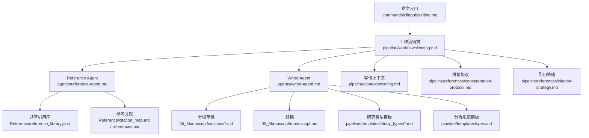
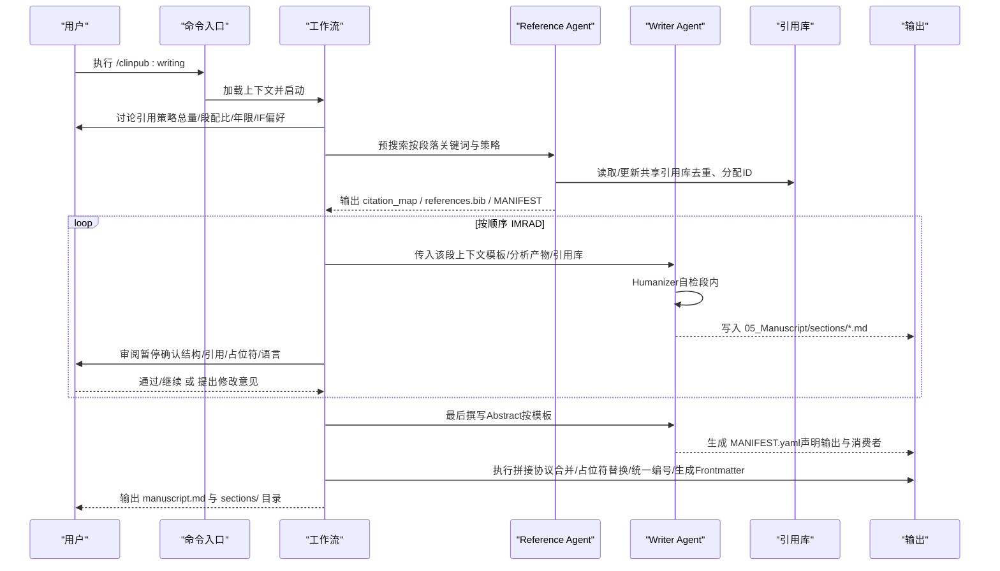
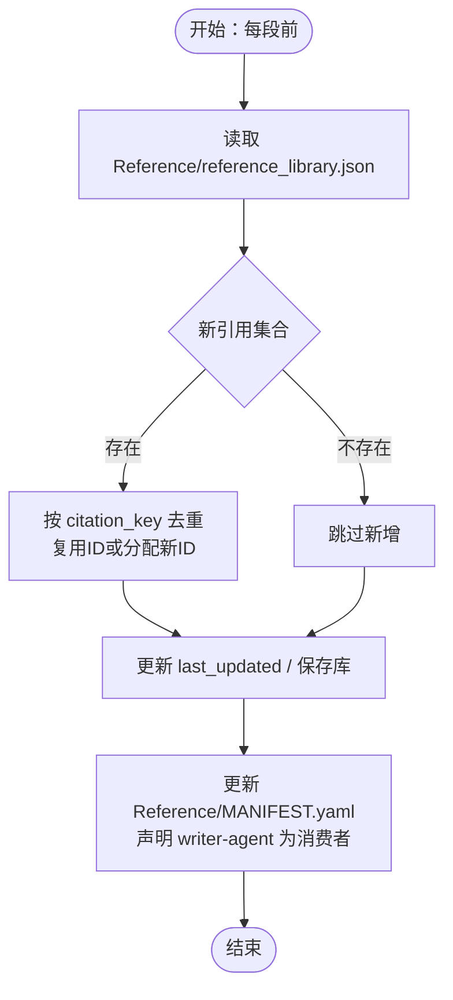
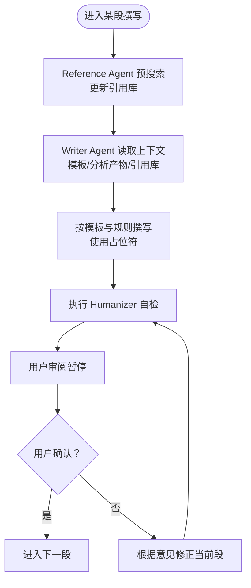
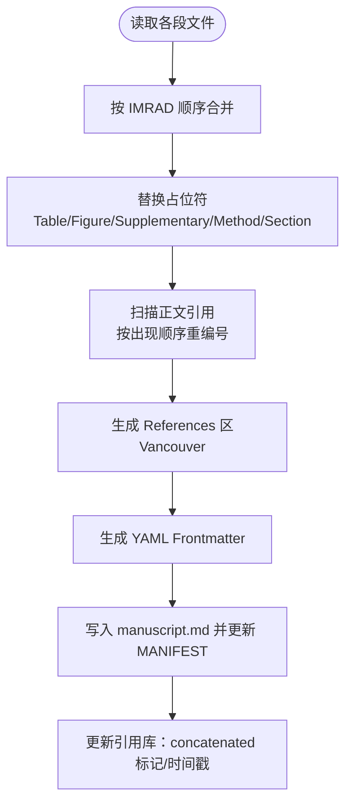
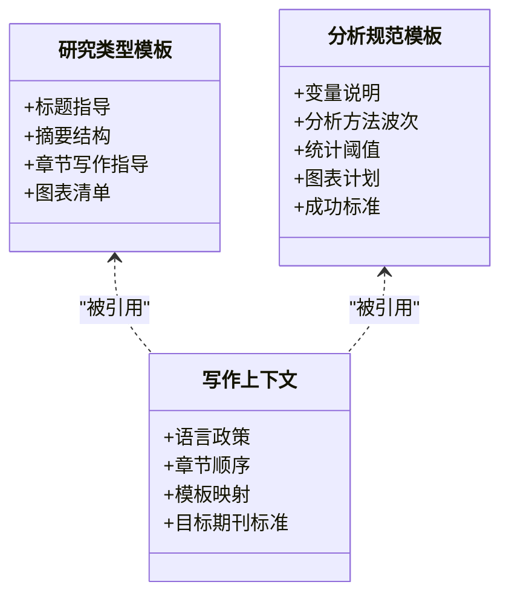
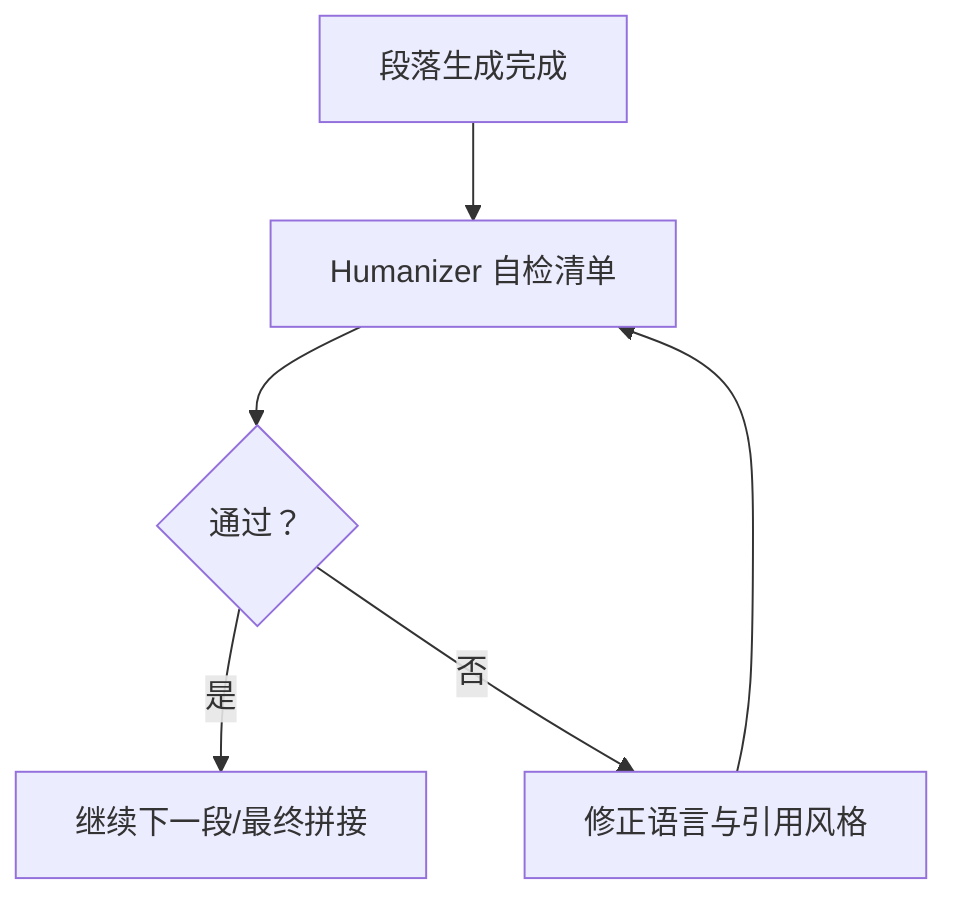
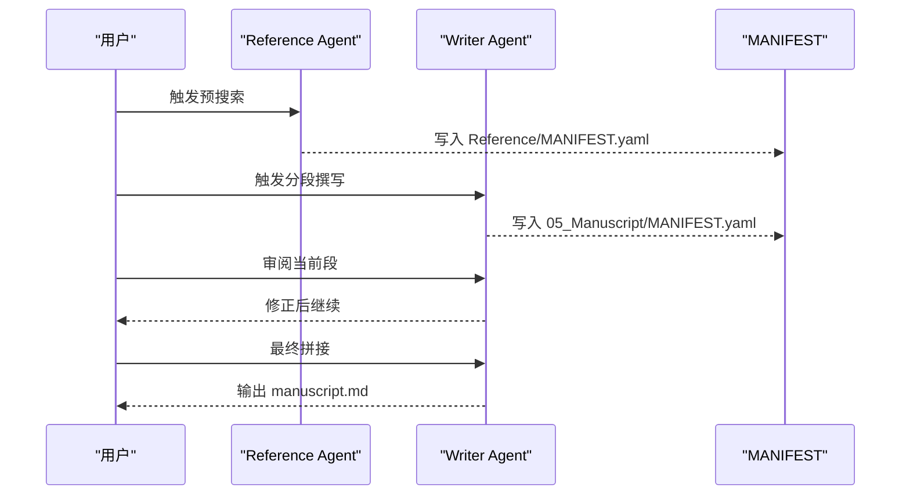
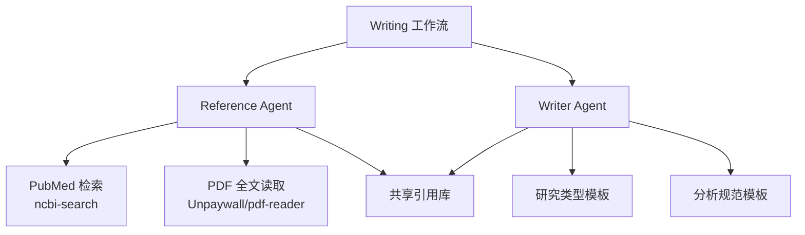

# 阶段3：论文写作

<cite>
**本文引用的文件**
- [README.md](file://README.md)
- [writing.md](file://commands/clinpub/writing.md)
- [writing.md](file://pipeline/workflows/writing.md)
- [writer-agent.md](file://agents/writer-agent.md)
- [reference-agent.md](file://agents/reference-agent.md)
- [reference-library.md](file://pipeline/references/reference-library.md)
- [citation-strategy.md](file://pipeline/references/citation-strategy.md)
- [concatenation-protocol.md](file://pipeline/references/concatenation-protocol.md)
- [writing.md](file://pipeline/contexts/writing.md)
- [rct.md](file://pipeline/templates/study_types/rct.md)
- [spec.md](file://pipeline/templates/spec.md)
- [idea_report.md](file://pipeline/templates/idea_report.md)
</cite>

## 目录
1. [简介](#简介)
2. [项目结构](#项目结构)
3. [核心组件](#核心组件)
4. [架构总览](#架构总览)
5. [详细组件分析](#详细组件分析)
6. [依赖分析](#依赖分析)
7. [性能考量](#性能考量)
8. [故障排查指南](#故障排查指南)
9. [结论](#结论)
10. [附录](#附录)

## 简介
本文件面向“阶段3论文写作”（Phase 3: IMRAD sequential manuscript writing），系统化阐述基于AI代理的结构化写作流程、内容组织策略与格式标准化机制。文档围绕以下目标展开：
- IMRAD结构化写作流程：按Introduction → Methods → Results → Discussion顺序分段撰写，每段前由Reference Agent进行文献预搜索，Writer Agent依据模板与上下文生成初稿，用户审阅后进入下一段。
- 内容组织策略：分段独立产出、占位符交叉引用、共享引用库去重、拼接时统一编号与格式化。
- 格式标准化机制：Vancouver编号制、英文图表标题、中文正文、DOI必填、WordCount与引用数门槛。
- 论文草稿生成算法：基于研究类型模板与分析产物的自动生成规则；图表整合流程：占位符替换与全局编号；参考文献管理：共享库、去重与统一编号。
- 写作模板系统：研究类型模板（如RCT）、分析规范模板（spec）与选题报告模板；内容自动生成与人工审核流程：Writer Agent内嵌Humanizer自检、用户审阅暂停、拼接后最终校验。
- 多作者协作、版本管理与审阅流程：MANIFEST声明、阶段性里程碑与最终checkpoint确认。
- 扩展方案：自定义写作模板的解析与集成、内容生成器的扩展接口。

## 项目结构
阶段3位于命令层与流水线层之间，通过命令入口启动工作流，工作流协调两个Agent完成分段撰写与引用管理，并在最终阶段执行拼接协议生成终稿。

**图示来源**
- [writing.md:1-56](file://commands/clinpub/writing.md#L1-L56)
- [writing.md:1-330](file://pipeline/workflows/writing.md#L1-L330)
- [reference-agent.md:1-321](file://agents/reference-agent.md#L1-L321)
- [writer-agent.md:1-166](file://agents/writer-agent.md#L1-L166)
- [reference-library.md:1-214](file://pipeline/references/reference-library.md#L1-L214)
- [concatenation-protocol.md:1-291](file://pipeline/references/concatenation-protocol.md#L1-L291)
- [writing.md:1-49](file://pipeline/contexts/writing.md#L1-L49)

**章节来源**
- [README.md:1-172](file://README.md#L1-L172)
- [writing.md:1-56](file://commands/clinpub/writing.md#L1-L56)
- [writing.md:1-330](file://pipeline/workflows/writing.md#L1-L330)

## 核心组件
- 命令层（commands/clinpub/writing.md）：定义Phase 3目标、流程概述、核心约束与成功标准，加载执行上下文并调用工作流。
- 工作流层（pipeline/workflows/writing.md）：编排引用策略讨论、Reference Agent预搜索、Writer Agent分段撰写、用户审阅暂停、Humanizer自检、最终验证与拼接。
- Agent层：
  - Reference Agent：负责文献检索、去重、格式化与MANIFEST声明，输出citation_map与references.bib。
  - Writer Agent：依据研究类型模板与上下文生成分段草稿，执行Humanizer自检，最终生成MANIFEST。
- 引用与拼接规范（pipeline/references）：
  - reference-library.md：共享引用库JSON Schema、Vancouver格式、占位符约定与读写流程。
  - citation-strategy.md：引用总量、段落配比、年限与IF偏好讨论流程。
  - concatenation-protocol.md：终稿拼接步骤（段落合并、占位符替换、统一编号、YAML Frontmatter、MANIFEST更新、引用库更新）。
- 上下文与模板（pipeline/contexts, pipeline/templates）：
  - writing.md：语言政策、章节顺序、研究类型模板映射、目标期刊标准与Humanizer提醒。
  - study_types/*.md：研究类型模板（如RCT）。
  - spec.md：分析规范模板，支撑Methods段自动生成。
  - idea_report.md：选题报告模板，支撑选题挖掘阶段的产出。

**章节来源**
- [writing.md:1-56](file://commands/clinpub/writing.md#L1-L56)
- [writing.md:1-330](file://pipeline/workflows/writing.md#L1-L330)
- [writer-agent.md:1-166](file://agents/writer-agent.md#L1-L166)
- [reference-agent.md:1-321](file://agents/reference-agent.md#L1-L321)
- [reference-library.md:1-214](file://pipeline/references/reference-library.md#L1-L214)
- [citation-strategy.md:1-88](file://pipeline/references/citation-strategy.md#L1-L88)
- [concatenation-protocol.md:1-291](file://pipeline/references/concatenation-protocol.md#L1-L291)
- [writing.md:1-49](file://pipeline/contexts/writing.md#L1-L49)
- [rct.md:1-138](file://pipeline/templates/study_types/rct.md#L1-L138)
- [spec.md:1-125](file://pipeline/templates/spec.md#L1-L125)
- [idea_report.md:1-118](file://pipeline/templates/idea_report.md#L1-L118)

## 架构总览
阶段3采用“两Agent协同 + 规范驱动”的架构：Reference Agent负责外部知识与引用管理，Writer Agent负责结构化内容生成与语言质量控制；工作流贯穿策略讨论、预搜索、分段撰写、审阅、验证与拼接。

**图示来源**
- [writing.md:1-56](file://commands/clinpub/writing.md#L1-L56)
- [writing.md:1-330](file://pipeline/workflows/writing.md#L1-L330)
- [reference-agent.md:1-321](file://agents/reference-agent.md#L1-L321)
- [writer-agent.md:1-166](file://agents/writer-agent.md#L1-L166)
- [concatenation-protocol.md:1-291](file://pipeline/references/concatenation-protocol.md#L1-L291)

## 详细组件分析

### 组件A：引用策略与引用库管理
- 引用策略（citation-strategy.md）：定义总量约束（30-55篇）、段落配比（Intro/Methods/Results/Discussion）、年限策略（默认5年，landmark例外）与IF偏好（可选），并规定讨论流程与project_config.yml写入。
- 共享引用库（reference-library.md）：JSON Schema定义字段（id/citation_key/title/authors/journal/year/volume/issue/pages/doi/pmid/sections_used/added_by_section/citation_reason），去重键策略（citation_key为主键，AuthorYear冲突时加后缀），Vancouver格式正文引用与末尾References区格式，占位符命名规则与全局编号策略，以及读写流程与MANIFEST更新。
- 工作流集成（writing.md）：每段前Reference Agent执行预搜索，读取已有库，逐条去重并分配新ID，更新引用库与MANIFEST；Writer Agent在撰写时使用{{ref:citation_key}}占位并在正文中以[id]引用，不关心ID变化，交由拼接协议统一重编号。

**图示来源**
- [writing.md:69-116](file://pipeline/workflows/writing.md#L69-L116)
- [reference-library.md:154-193](file://pipeline/references/reference-library.md#L154-L193)

**章节来源**
- [citation-strategy.md:1-88](file://pipeline/references/citation-strategy.md#L1-L88)
- [reference-library.md:1-214](file://pipeline/references/reference-library.md#L1-L214)
- [writing.md:69-116](file://pipeline/workflows/writing.md#L69-L116)

### 组件B：分段撰写与占位符交叉引用
- 分段顺序与职责（writing.md）：IMRAD顺序（Intro → Methods → Results → Discussion），每段三步：Reference Agent预搜索 → Writer Agent撰写 → 用户审阅暂停。
- Writer Agent职责（writer-agent.md）：加载上下文（项目配置、分析产物、引用库、模板），按优先级撰写各章节，执行Humanizer自检，最终生成MANIFEST。
- 占位符系统（reference-library.md）：Table/Figure独立编号（IMRAD顺序），Supplementary Table/Figure独立编号，Method与Section占位符在拼接时替换为真实文本或方法描述。
- 模板与上下文（writing.md, rct.md, spec.md）：Methods段依据分析规范模板与研究类型模板生成；Results段引用04_Outputs中的图表与方法说明；Discussion段结合引用库与目标期刊标准；Abstract最后撰写。

**图示来源**
- [writing.md:82-161](file://pipeline/workflows/writing.md#L82-L161)
- [writer-agent.md:15-108](file://agents/writer-agent.md#L15-L108)
- [reference-library.md:104-151](file://pipeline/references/reference-library.md#L104-L151)

**章节来源**
- [writing.md:82-161](file://pipeline/workflows/writing.md#L82-L161)
- [writer-agent.md:15-108](file://agents/writer-agent.md#L15-L108)
- [reference-library.md:104-151](file://pipeline/references/reference-library.md#L104-L151)

### 组件C：终稿拼接协议
- 拼接步骤（concatenation-protocol.md）：段落合并（IMRAD顺序）、占位符替换（Table/Figure/Supplementary Method/Section）、统一编号（按正文出现顺序从[1]开始）、生成YAML Frontmatter（title/target_journal/word_count/reference_count）、合并输出manuscript.md、更新MANIFEST与引用库。
- 质量控制清单（concatenation-protocol.md）：无残留占位符、编号连续、References区完整、word_count与reference_count达标、MANIFEST声明齐全。

**图示来源**
- [concatenation-protocol.md:28-273](file://pipeline/references/concatenation-protocol.md#L28-L273)

**章节来源**
- [concatenation-protocol.md:1-291](file://pipeline/references/concatenation-protocol.md#L1-L291)

### 组件D：写作模板系统与内容自动生成
- 研究类型模板（study_types/*.md）：如RCT模板，提供标题、摘要结构、Introduction/Methods/Results/Discussion/Conclusions的写作指导与图表清单，强调叙事逻辑与Consort规范。
- 分析规范模板（spec.md）：为Methods段提供变量说明、分析方法波次、统计阈值、图表计划与成功标准，支撑Writer Agent自动生成初稿。
- 选题报告模板（idea_report.md）：支撑选题挖掘阶段，形成初步研究方向与方法规划，间接影响阶段3的Methods段内容组织。

**图示来源**
- [rct.md:1-138](file://pipeline/templates/study_types/rct.md#L1-L138)
- [spec.md:1-125](file://pipeline/templates/spec.md#L1-L125)
- [writing.md:1-49](file://pipeline/contexts/writing.md#L1-L49)

**章节来源**
- [rct.md:1-138](file://pipeline/templates/study_types/rct.md#L1-L138)
- [spec.md:1-125](file://pipeline/templates/spec.md#L1-L125)
- [writing.md:1-49](file://pipeline/contexts/writing.md#L1-L49)

### 组件E：语言润色与格式调整机制
- Humanizer规则（writer-agent.md）：段内自检，避免AI模板化痕迹（段落开篇、过渡词、句式结构、结论空话、引用僵化、方法解释过度），并提供自检清单。
- 目标期刊标准（writing.md）：要求效应量+95%CI+精确p值、FDR/Bonferroni多重比较校正、软件版本报告等。
- 拼接后格式化（concatenation-protocol.md）：统一Frontmatter字段、References区Vancouver格式、DOI必填、WordCount与引用数门槛。

**图示来源**
- [writer-agent.md:110-157](file://agents/writer-agent.md#L110-L157)
- [writing.md:41-49](file://pipeline/contexts/writing.md#L41-L49)
- [concatenation-protocol.md:182-197](file://pipeline/references/concatenation-protocol.md#L182-L197)

**章节来源**
- [writer-agent.md:110-157](file://agents/writer-agent.md#L110-L157)
- [writing.md:41-49](file://pipeline/contexts/writing.md#L41-L49)
- [concatenation-protocol.md:182-197](file://pipeline/references/concatenation-protocol.md#L182-L197)

### 组件F：多作者协作、版本管理与审阅流程
- 版本与清单（manifest）：Reference Agent与Writer Agent均在各自目录输出MANIFEST.yaml，声明输出文件与消费者（Writer Agent消费Reference Agent输出，Verifier消费Writer Agent输出）。
- 审阅流程：每段撰写后用户审阅暂停，确认结构、引用、占位符与语言风格；若需修改，直接在当前段内修正，不重写全篇。
- 里程碑与状态（writing.md）：拼接完成后进入checkpoint_confirm，用户确认后进入milestone流程，正式关闭Phase 3并进入Phase 4。

**图示来源**
- [writing.md:180-304](file://pipeline/workflows/writing.md#L180-L304)
- [reference-agent.md:249-272](file://agents/reference-agent.md#L249-L272)
- [writer-agent.md:104-106](file://agents/writer-agent.md#L104-L106)

**章节来源**
- [writing.md:180-304](file://pipeline/workflows/writing.md#L180-L304)
- [reference-agent.md:249-272](file://agents/reference-agent.md#L249-L272)
- [writer-agent.md:104-106](file://agents/writer-agent.md#L104-L106)

## 依赖分析
- Agent耦合关系：Reference Agent与Writer Agent通过共享引用库与MANIFEST进行弱耦合；Writer Agent依赖研究类型模板与分析规范模板；Reference Agent依赖ncbi-search技能与pdf-reader技能。
- 外部依赖：PubMed检索（ncbi-search）、PDF全文读取（Unpaywall/pdf-reader）。
- 规范依赖：引用策略与引用库规范、拼接协议、写作上下文与模板。

**图示来源**
- [reference-agent.md:16-45](file://agents/reference-agent.md#L16-L45)
- [reference-agent.md:240-247](file://agents/reference-agent.md#L240-L247)
- [writing.md:1-17](file://pipeline/workflows/writing.md#L1-L17)

**章节来源**
- [reference-agent.md:16-45](file://agents/reference-agent.md#L16-L45)
- [reference-agent.md:240-247](file://agents/reference-agent.md#L240-L247)
- [writing.md:1-17](file://pipeline/workflows/writing.md#L1-L17)

## 性能考量
- 检索效率：ncbi-search技能具备速率限制与MeSH扩展能力，建议配置NCBI_API_KEY提升并发；按段落关键词精准搜索，减少无关文献。
- 引用库去重：基于citation_key主键与AuthorYear冲突处理，避免重复写入与编号浪费。
- 拼接复杂度：占位符替换与统一编号为线性扫描，建议在大规模引用时使用高效正则与缓存中间结果。
- 语言质量：Humanizer自检在段内执行，避免全篇重写带来的成本；用户审阅暂停减少返工。

## 故障排查指南
- ncbi-search技能缺失：Reference Agent在执行前会检查技能可用性，若缺失需按提示安装后再继续。
- 引用无DOI：拼接协议要求所有引用必须有DOI，无DOI的引用需用户补充。
- 占位符残留：拼接后验证清单中包含“无残留占位符”，若失败需回溯各段内容修正。
- 引用量异常：若总量超限或段落引用数偏离配比，需调整引用策略或删减冗余引用。
- 语言风格AI痕迹：按Humanizer清单逐项修正，避免模板化表达与重复句式。

**章节来源**
- [reference-agent.md:16-45](file://agents/reference-agent.md#L16-L45)
- [concatenation-protocol.md:276-291](file://pipeline/references/concatenation-protocol.md#L276-L291)
- [writer-agent.md:110-157](file://agents/writer-agent.md#L110-L157)

## 结论
阶段3论文写作通过“两Agent协同 + 规范驱动”的流水线，实现了IMRAD结构化分段撰写、共享引用库去重与统一拼接的全流程自动化。引用策略与引用库规范确保引用质量与一致性，拼接协议保障终稿格式与完整性。Writer Agent内嵌Humanizer自检与目标期刊标准，Reference Agent提供高质量文献检索与管理，工作流在每段结束后进行用户审阅，最终形成可提交的出版级终稿。

## 附录
- 开发者扩展指南（基于现有规范）：
  - 自定义写作模板：在pipeline/templates/study_types/下新增模板文件，遵循现有章节结构与语言政策；在pipeline/contexts/writing.md中映射模板与报告标准。
  - 内容生成器集成：在agents/writer-agent.md中扩展执行步骤，确保读取上下文与调用模板的接口与现有流程一致；在pipeline/workflows/writing.md中注册新的上下文与约束。
  - 引用策略扩展：在pipeline/references/citation-strategy.md中新增段落配比或年限策略选项，并在commands/clinpub/writing.md中暴露给用户讨论步骤。
  - 拼接协议扩展：在pipeline/references/concatenation-protocol.md中新增占位符类型或格式化规则，确保与现有替换与统一编号流程兼容。

**章节来源**
- [writing.md:19-30](file://pipeline/contexts/writing.md#L19-L30)
- [writer-agent.md:15-108](file://agents/writer-agent.md#L15-L108)
- [writing.md:1-330](file://pipeline/workflows/writing.md#L1-L330)
- [citation-strategy.md:1-88](file://pipeline/references/citation-strategy.md#L1-L88)
- [concatenation-protocol.md:1-291](file://pipeline/references/concatenation-protocol.md#L1-L291)