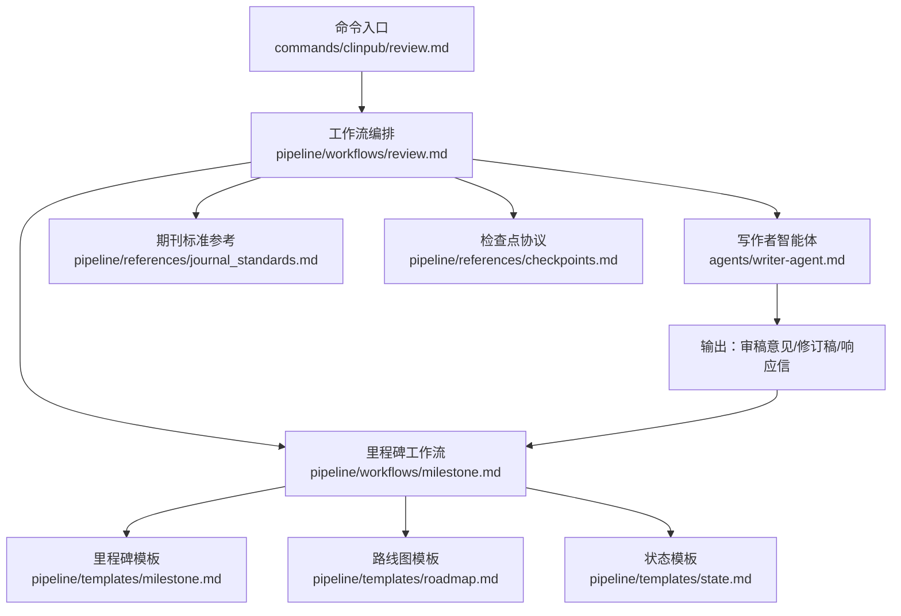
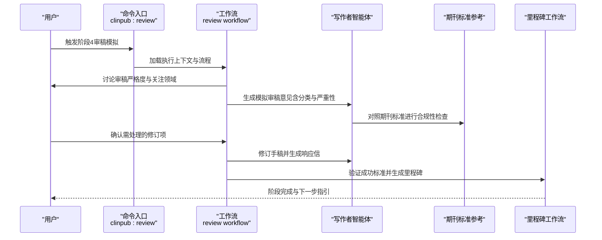
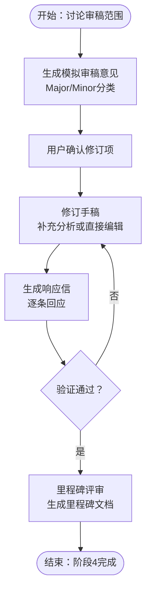
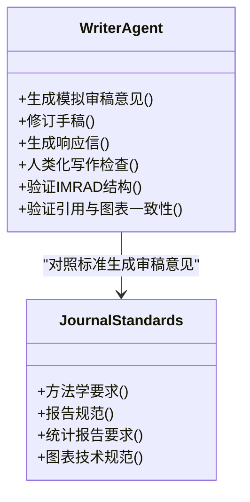
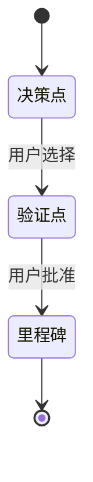
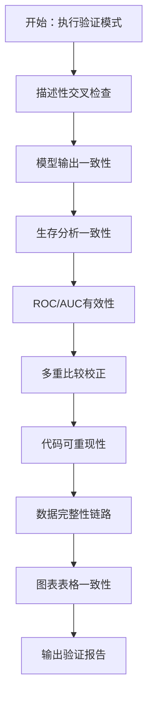
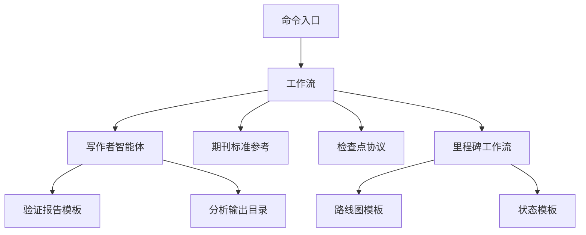

# 阶段4：审稿模拟

<cite>
**本文引用的文件**
- [README.md](file://README.md)
- [review.md](file://commands/clinpub/review.md)
- [review.md](file://pipeline/workflows/review.md)
- [journal_standards.md](file://pipeline/references/journal_standards.md)
- [writer-agent.md](file://agents/writer-agent.md)
- [checkpoints.md](file://pipeline/references/checkpoints.md)
- [milestone.md](file://pipeline/workflows/milestone.md)
- [verification-report.md](file://pipeline/templates/verification-report.md)
- [roadmap.md](file://pipeline/templates/roadmap.md)
- [state.md](file://pipeline/templates/state.md)
- [analyst-agent.md](file://agents/analyst-agent.md)
- [modify-agent.md](file://agents/modify-agent.md)
- [TESTING.md](file://docs/TESTING.md)
- [DEVELOPMENT.md](file://docs/DEVELOPMENT.md)
</cite>

## 目录
1. [引言](#引言)
2. [项目结构](#项目结构)
3. [核心组件](#核心组件)
4. [架构总览](#架构总览)
5. [详细组件分析](#详细组件分析)
6. [依赖关系分析](#依赖关系分析)
7. [性能考量](#性能考量)
8. [故障排查指南](#故障排查指南)
9. [结论](#结论)
10. [附录](#附录)

## 引言
本文件面向“阶段4：审稿模拟”的综合技术文档，聚焦于同行评议模拟流程、审稿人视角分析与修改建议生成机制，以及质量验证标准、合规性检查与风险评估算法。文档还深入说明审稿报告生成、修改追踪与版本对比功能，并提供审稿意见分类、严重性评估与优先级排序方法；同时给出验证测试模板、质量标准与评估指标，解释模拟审稿流程、反馈收集与持续改进机制，并为开发者提供自定义审稿标准的扩展方案与模拟算法优化指导。

## 项目结构
本项目采用三层架构：命令层（commands/clinpub）、编排层（pipeline/workflows）、智能体层（agents）。阶段4“审稿模拟”由命令入口触发，经由工作流编排，驱动写作者智能体生成模拟审稿意见，并与修改智能体协作进行迭代修订与响应信撰写，最终通过里程碑关卡评审完成阶段交付。

**图表来源**
- [review.md:1-35](file://commands/clinpub/review.md#L1-L35)
- [review.md:1-134](file://pipeline/workflows/review.md#L1-L134)
- [writer-agent.md:1-166](file://agents/writer-agent.md#L1-L166)
- [journal_standards.md:1-78](file://pipeline/references/journal_standards.md#L1-L78)
- [checkpoints.md:1-120](file://pipeline/references/checkpoints.md#L1-L120)
- [milestone.md:1-163](file://pipeline/workflows/milestone.md#L1-L163)
- [roadmap.md:1-19](file://pipeline/templates/roadmap.md#L1-L19)
- [state.md:1-19](file://pipeline/templates/state.md#L1-L19)

**章节来源**
- [README.md:1-172](file://README.md#L1-L172)
- [review.md:1-35](file://commands/clinpub/review.md#L1-L35)
- [review.md:1-134](file://pipeline/workflows/review.md#L1-L134)

## 核心组件
- 命令入口（clinpub:review）：定义阶段4目标、执行上下文与成功标准，触发审稿模拟全流程。
- 工作流（review workflow）：定义审稿模拟的步骤闭环（讨论范围→生成审稿→确认修订项→修订→生成响应信→验证与循环→里程碑）。
- 写作者智能体：负责根据分析输出与期刊标准生成模拟审稿意见，支持修订与响应信生成。
- 期刊标准参考：提供目标期刊（Alzheimer’s & Dementia、Molecular Psychiatry）的方法学与报告规范，作为审稿依据。
- 检查点协议：定义决策、验证与里程碑的结构化交互方式，确保可审计与可恢复。
- 里程碑工作流：在阶段结束时验证成功标准、记录决策与产出、生成里程碑文档并推进下一阶段。

**章节来源**
- [review.md:1-35](file://commands/clinpub/review.md#L1-L35)
- [review.md:1-134](file://pipeline/workflows/review.md#L1-L134)
- [writer-agent.md:1-166](file://agents/writer-agent.md#L1-L166)
- [journal_standards.md:1-78](file://pipeline/references/journal_standards.md#L1-L78)
- [checkpoints.md:1-120](file://pipeline/references/checkpoints.md#L1-L120)
- [milestone.md:1-163](file://pipeline/workflows/milestone.md#L1-L163)

## 架构总览
阶段4审稿模拟的端到端流程如下：

**图表来源**
- [review.md:1-35](file://commands/clinpub/review.md#L1-L35)
- [review.md:1-134](file://pipeline/workflows/review.md#L1-L134)
- [writer-agent.md:1-166](file://agents/writer-agent.md#L1-L166)
- [journal_standards.md:1-78](file://pipeline/references/journal_standards.md#L1-L78)
- [milestone.md:1-163](file://pipeline/workflows/milestone.md#L1-L163)

## 详细组件分析

### 组件A：审稿模拟工作流（review workflow）
- 目的与范围：在目标期刊级别模拟严谨审稿，生成带分类与严重性的审稿意见，推动迭代修订直至用户满意。
- 关键步骤：
  - 讨论审稿范围：确定审稿严格度、关注领域与补充检索方向。
  - 生成审稿意见：Major/Minor分类，覆盖统计方法、样本量、混杂控制、结果解释、语言、引用、图表等。
  - 确认修订项：用户确认需处理的条目，可追加请求，形成明确修订范围。
  - 修订手稿：针对Major/Minor分别采取补充分析或直接编辑，保留原始与修订版本以便对比。
  - 生成响应信：逐条回应审稿意见，说明修改内容与位置。
  - 验证与循环：验证修订项与响应信完整性，若用户仍不满意则回到修订步骤。
  - 里程碑收尾：通过里程碑工作流正式关闭阶段，生成里程碑文档并推进下一阶段。
- 成功标准：审稿意见生成（含分类）、修订项确认、全部修订落实、响应信完整、最终手稿进入final目录、用户满意。

**图表来源**
- [review.md:16-123](file://pipeline/workflows/review.md#L16-L123)

**章节来源**
- [review.md:1-134](file://pipeline/workflows/review.md#L1-L134)

### 组件B：写作者智能体（审稿模拟与修订）
- 角色职责：负责IMRAD结构的手稿撰写与模拟审稿，强制人类化写作规则，确保语言自然、逻辑连贯。
- 审稿模拟规则：生成带分类的审稿意见，区分Major/Minor，覆盖统计方法、样本量、混杂、结果解释、语言与引用格式等；用户确认后进行修订并生成逐条响应信；循环至用户满意后进入final目录。
- 关键约束：IMRAD结构完整、引用均含DOI、文中引用的图表必须存在、遵循STROBE/CONSORT清单、中文正文+英文图表表格、人类化写作检查通过、不捏造引用或数据。

**图表来源**
- [writer-agent.md:138-147](file://agents/writer-agent.md#L138-L147)
- [journal_standards.md:1-78](file://pipeline/references/journal_standards.md#L1-L78)

**章节来源**
- [writer-agent.md:1-166](file://agents/writer-agent.md#L1-L166)

### 组件C：检查点与里程碑协议
- 检查点类型：
  - 决策（decision）：分析路径分支时由用户做决策（如缺失值策略）。
  - 验证（verify）：自动步骤完成后由用户确认结果是否符合预期。
  - 里程碑（milestone）：阶段完成时正式验证成功标准、记录决策与产出、生成里程碑文档并等待用户签字放行。
- 里程碑记录格式：包含阶段编号与名称、完成日期、状态、交付物清单、关键决策、产出文件、未解决问题、用户签字与下一步。

**图表来源**
- [checkpoints.md:10-75](file://pipeline/references/checkpoints.md#L10-L75)
- [milestone.md:74-152](file://pipeline/workflows/milestone.md#L74-L152)

**章节来源**
- [checkpoints.md:1-120](file://pipeline/references/checkpoints.md#L1-L120)
- [milestone.md:1-163](file://pipeline/workflows/milestone.md#L1-L163)

### 组件D：质量验证与合规性检查
- 验证模板（verification-report.md）：提供统一的验证报告结构，涵盖描述性交叉检查、模型输出一致性、生存分析一致性、ROC/AUC有效性、多重比较校正、代码可重现性、数据完整性链路、图表表格一致性等。
- 合规性检查：依据期刊标准（journal_standards.md），重点覆盖统计效力分析、多中心/多队列设计、纵向设计优先、盲法/随机化/对照组记录、效应量+95%CI+p值、精确p值、多重比较校正、软件版本、假设检验、数据公开等。
- 风险评估：基于验证报告中的问题严重性（Critical/Warning/Info）与模式编号，识别潜在风险环节（如混杂控制不足、样本量/统计效力不足、报告规范不完整等）。

**图表来源**
- [verification-report.md:1-85](file://pipeline/templates/verification-report.md#L1-L85)
- [journal_standards.md:28-35](file://pipeline/references/journal_standards.md#L28-L35)

**章节来源**
- [verification-report.md:1-85](file://pipeline/templates/verification-report.md#L1-L85)
- [journal_standards.md:1-78](file://pipeline/references/journal_standards.md#L1-L78)

### 组件E：修改追踪与版本对比
- 修改追踪：修改智能体负责在分析输出目录（04_Outputs/与03_AnalysisMethods/）内执行视觉调整与统计方法变更，并将修改历史追加至分析计划（PLAN.md）。
- 版本对比：工作流在修订过程中保留原始与修订版本，便于审稿人视角下的逐条对比与溯源。
- 关键规则：仅修改分析输出目录，不改动手稿与参考文献目录；最大单次会话修改数限制；脚本自包含且可独立复现；失败修改记录在案。

**章节来源**
- [modify-agent.md:1-176](file://agents/modify-agent.md#L1-L176)
- [review.md:58-68](file://pipeline/workflows/review.md#L58-L68)

### 组件F：审稿意见分类、严重性评估与优先级排序
- 分类体系：Major/Minor两类。Major优先级更高，涉及统计方法、样本量、混杂控制、结果解释与研究设计局限；Minor关注语言、引用格式、图表质量。
- 严重性评估：依据期刊标准与验证报告的问题严重性（Critical/Warning/Info）进行分级，结合审稿范围与关注领域进行权重分配。
- 优先级排序：先处理Major项，再处理Minor项；对需要补充分析的Major项，优先安排回溯到分析阶段进行修正后再进入修订流程。

**章节来源**
- [review.md:29-46](file://pipeline/workflows/review.md#L29-L46)
- [journal_standards.md:44-51](file://pipeline/references/journal_standards.md#L44-L51)
- [verification-report.md](file://pipeline/templates/verification-report.md#L31)

### 组件G：模拟审稿流程、反馈收集与持续改进
- 模拟流程：讨论→生成审稿→确认修订→修订→生成响应信→验证→循环→里程碑。
- 反馈收集：通过用户确认修订项与满意度反馈，形成可审计的决策日志与修改历史。
- 持续改进：基于里程碑文档中的未解决问题与用户反馈，优化后续阶段的分析计划与写作策略。

**章节来源**
- [review.md:16-123](file://pipeline/workflows/review.md#L16-L123)
- [milestone.md:83-152](file://pipeline/workflows/milestone.md#L83-L152)

### 组件H：开发者扩展方案与算法优化指导
- 自定义审稿标准：可在写作者智能体中扩展审稿意见生成规则，增加新的关注领域与严重性阈值；在期刊标准参考中新增或细化目标期刊的要求。
- 模拟算法优化：引入机器学习方法对审稿意见进行聚类与严重性预测，结合历史审稿数据训练分类器；在修改追踪中加入自动化版本对比与差异高亮。
- 质量保障：遵循开发指南中的代码独立性原则与测试规范，确保每个脚本可独立运行并通过单元/集成/端到端测试。

**章节来源**
- [DEVELOPMENT.md:1-320](file://docs/DEVELOPMENT.md#L1-L320)
- [TESTING.md:1-373](file://docs/TESTING.md#L1-L373)

## 依赖关系分析
阶段4审稿模拟的关键依赖关系如下：

**图表来源**
- [review.md:1-35](file://commands/clinpub/review.md#L1-L35)
- [review.md:1-134](file://pipeline/workflows/review.md#L1-L134)
- [writer-agent.md:1-166](file://agents/writer-agent.md#L1-L166)
- [journal_standards.md:1-78](file://pipeline/references/journal_standards.md#L1-L78)
- [checkpoints.md:1-120](file://pipeline/references/checkpoints.md#L1-L120)
- [milestone.md:1-163](file://pipeline/workflows/milestone.md#L1-L163)
- [verification-report.md:1-85](file://pipeline/templates/verification-report.md#L1-L85)
- [roadmap.md:1-19](file://pipeline/templates/roadmap.md#L1-L19)
- [state.md:1-19](file://pipeline/templates/state.md#L1-L19)

**章节来源**
- [review.md:1-134](file://pipeline/workflows/review.md#L1-L134)
- [milestone.md:1-163](file://pipeline/workflows/milestone.md#L1-L163)

## 性能考量
- 并行化与可重现性：分析脚本应自包含且可独立运行，避免跨文件隐式依赖；在大规模数据场景下，优先使用向量化与并行计算（R的并行处理、Python的多进程）提升效率。
- 输出质量：确保图表分辨率≥300 DPI、矢量格式优先、英文标签与主题一致，减少后期重制成本。
- 流程稳定性：通过检查点与里程碑机制，确保每个阶段的产出可审计、可恢复，降低返工概率。

[本节为通用指导，无需特定文件引用]

## 故障排查指南
- 审稿意见缺失或不完整：检查写作者智能体是否正确读取分析输出与期刊标准；确认审稿范围讨论与用户确认环节已完成。
- 修订项未落实：核对修订流程中是否保留原始与修订版本，确保响应信逐条对应；检查修改智能体的历史记录是否正确追加至PLAN.md。
- 里程碑验证失败：依据里程碑工作流的成功标准清单逐一核查，补齐缺失的交付物或修正不符合项；必要时在里程碑文档中标注未解决问题并请求用户进一步指示。
- 验证报告异常：根据验证报告模板逐项检查描述性交叉、模型一致性、生存分析、ROC/AUC、多重比较校正、代码可重现性与数据完整性链路，定位问题模式并修复。

**章节来源**
- [writer-agent.md:1-166](file://agents/writer-agent.md#L1-L166)
- [review.md:125-133](file://pipeline/workflows/review.md#L125-L133)
- [milestone.md:42-81](file://pipeline/workflows/milestone.md#L42-L81)
- [verification-report.md:1-85](file://pipeline/templates/verification-report.md#L1-L85)

## 结论
阶段4审稿模拟通过命令入口与工作流编排，结合写作者智能体与期刊标准参考，实现了从模拟审稿到修订与响应信生成的闭环流程。借助检查点与里程碑协议，确保过程可审计、可恢复；通过验证报告模板与合规性检查，实现质量门控与风险评估。开发者可在此基础上扩展审稿标准与优化模拟算法，配合严格的测试与开发规范，持续提升系统的稳定性与可维护性。

[本节为总结性内容，无需特定文件引用]

## 附录
- 验证测试模板与质量标准
  - 单元测试：针对函数或模块功能，脚本内定义测试数据与环境，验证结果。
  - 集成测试：测试多模块协同工作，确保流程衔接正确。
  - 端到端测试：覆盖完整用户工作流，验证关键路径。
  - 测试数据管理：脚本内定义、最小化、代表性、可重复（固定随机种子）。
  - 测试运行与覆盖率：提供R与Python的测试运行与覆盖率报告示例。
  - 持续集成：GitHub Actions示例，自动运行测试。
- 评估指标
  - 审稿意见覆盖率：Major/Minor分类与关注领域的覆盖度。
  - 修订落实率：确认修订项中已落实的比例。
  - 响应信完整性：逐条回应与修改位置引用的完整性。
  - 质量门控通过率：验证报告中各模式通过率与问题严重性分布。
  - 用户满意度：阶段结束时的用户反馈与签字确认。

**章节来源**
- [TESTING.md:1-373](file://docs/TESTING.md#L1-L373)
- [DEVELOPMENT.md:1-320](file://docs/DEVELOPMENT.md#L1-L320)