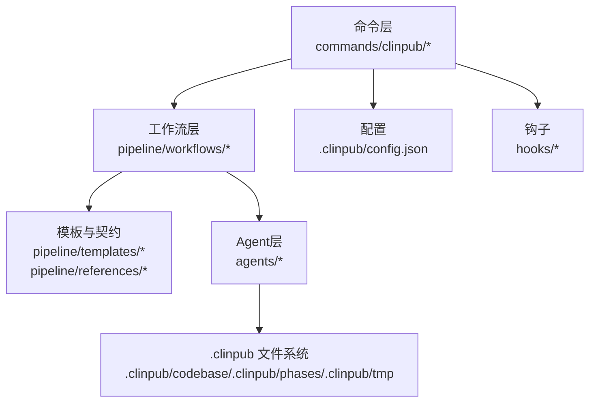
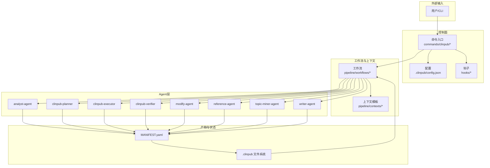
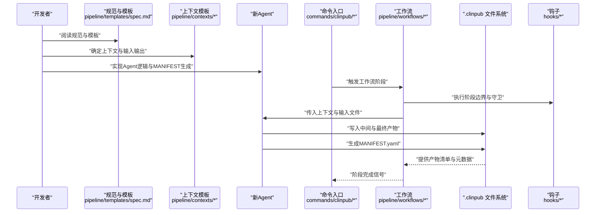
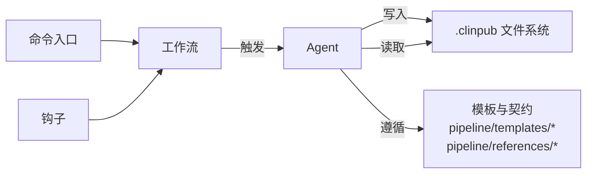

# AI代理开发

<cite>
**本文引用的文件**
- [AGENTS.md](file://AGENTS.md)
- [README.md](file://README.md)
- [docs/DEVELOPMENT.md](file://docs/DEVELOPMENT.md)
- [docs/ARCHITECTURE.md](file://docs/ARCHITECTURE.md)
- [docs/CONFIGURATION.md](file://docs/CONFIGURATION.md)
- [pipeline/references/agent-contracts.md](file://pipeline/references/agent-contracts.md)
- [pipeline/references/manifest-format.md](file://pipeline/references/manifest-format.md)
- [pipeline/templates/spec.md](file://pipeline/templates/spec.md)
- [pipeline/templates/context.md](file://pipeline/templates/context.md)
- [pipeline/workflows/analysis.md](file://pipeline/workflows/analysis.md)
- [pipeline/workflows/data-prep.md](file://pipeline/workflows/data-prep.md)
- [pipeline/workflows/data2idea.md](file://pipeline/workflows/data2idea.md)
- [pipeline/workflows/init-project.md](file://pipeline/workflows/init-project.md)
- [pipeline/workflows/milestone.md](file://pipeline/workflows/milestone.md)
- [pipeline/workflows/modify.md](file://pipeline/workflows/modify.md)
- [pipeline/workflows/next-step.md](file://pipeline/workflows/next-step.md)
- [pipeline/workflows/review.md](file://pipeline/workflows/review.md)
- [pipeline/workflows/writing.md](file://pipeline/workflows/writing.md)
- [commands/clinpub/clinpub.md](file://commands/clinpub/clinpub.md)
- [commands/clinpub/analysis.md](file://commands/clinpub/analysis.md)
- [commands/clinpub/data-prep.md](file://commands/clinpub/data-prep.md)
- [commands/clinpub/data2idea.md](file://commands/clinpub/data2idea.md)
- [commands/clinpub/init-project.md](file://commands/clinpub/init-project.md)
- [commands/clinpub/milestone.md](file://commands/clinpub/milestone.md)
- [commands/clinpub/modify.md](file://commands/clinpub/modify.md)
- [commands/clinpub/next-step.md](file://commands/clinpub/next-step.md)
- [commands/clinpub/review.md](file://commands/clinpub/review.md)
- [commands/clinpub/writing.md](file://commands/clinpub/writing.md)
- [hooks/clinpub-phase-boundary.sh](file://hooks/clinpub-phase-boundary.sh)
- [hooks/clinpub-prompt-guard.js](file://hooks/clinpub-prompt-guard.js)
- [hooks/clinpub-workflow-guard.js](file://hooks/clinpub-workflow-guard.js)
- [.clinpub/config.json](file://.clinpub/config.json)
- [agents/analyst-agent.md](file://agents/analyst-agent.md)
- [agents/clinpub-executor.md](file://agents/clinpub-executor.md)
- [agents/clinpub-planner.md](file://agents/clinpub-planner.md)
- [agents/clinpub-verifier.md](file://agents/clinpub-verifier.md)
- [agents/modify-agent.md](file://agents/modify-agent.md)
- [agents/reference-agent.md](file://agents/reference-agent.md)
- [agents/topic-miner-agent.md](file://agents/topic-miner-agent.md)
- [agents/writer-agent.md](file://agents/writer-agent.md)
</cite>

## 目录
1. [引言](#引言)
2. [项目结构](#项目结构)
3. [核心组件](#核心组件)
4. [架构总览](#架构总览)
5. [详细组件分析](#详细组件分析)
6. [依赖关系分析](#依赖关系分析)
7. [性能考量](#性能考量)
8. [故障排查指南](#故障排查指南)
9. [结论](#结论)
10. [附录](#附录)

## 引言
本指南面向在clinpub项目中开发与集成AI代理（Agent）的工程师与研究者。目标是建立一套可复用、可验证、可演进的Agent开发范式，确保Agent在科学工作流中的角色清晰、职责边界明确、输入输出规范统一，并通过文件系统进行数据传递以保障独立性与可审计性。

## 项目结构
clinpub采用“工作流驱动 + Agent协作”的分层组织方式：
- 命令层：commands/clinpub 提供CLI入口，定义各阶段命令与参数
- 工作流层：pipeline/workflows 定义端到端流程与阶段边界
- 模板与契约：pipeline/templates 与 pipeline/references 提供标准化产物与接口约束
- Agent层：agents 存放各Agent的角色卡片与行为描述
- 配置与钩子：.clinpub/config.json 与 hooks 提供运行时配置与安全/边界控制
- 文档与规范：docs 下的 ARCHITECTURE、DEVELOPMENT、CONFIGURATION 等提供整体设计与开发规范

**图示来源**
- [commands/clinpub/clinpub.md](file://commands/clinpub/clinpub.md)
- [pipeline/workflows/analysis.md](file://pipeline/workflows/analysis.md)
- [pipeline/templates/spec.md](file://pipeline/templates/spec.md)
- [pipeline/references/agent-contracts.md](file://pipeline/references/agent-contracts.md)
- [.clinpub/config.json](file://.clinpub/config.json)
- [hooks/clinpub-phase-boundary.sh](file://hooks/clinpub-phase-boundary.sh)

**章节来源**
- [README.md](file://README.md)
- [docs/ARCHITECTURE.md](file://docs/ARCHITECTURE.md)
- [docs/DEVELOPMENT.md](file://docs/DEVELOPMENT.md)

## 核心组件
- Agent角色卡片：agents/*.md，定义角色定位、输入输出、工具权限与质量标准
- MANIFEST.yaml：标准化输出格式，用于声明Agent产出与依赖
- 上下文与规范：contexts/*.md、references/* 提供上下文与契约
- 工作流与命令：workflows/*.md、commands/clinpub/*.md 定义执行边界与调用方式
- 钩子与配置：hooks/* 与 .clinpub/config.json 提供安全与边界控制

**章节来源**
- [AGENTS.md](file://AGENTS.md)
- [pipeline/references/manifest-format.md](file://pipeline/references/manifest-format.md)
- [pipeline/references/agent-contracts.md](file://pipeline/references/agent-contracts.md)

## 架构总览
Agent在clinpub中的位置与交互如下：

**图示来源**
- [commands/clinpub/clinpub.md](file://commands/clinpub/clinpub.md)
- [.clinpub/config.json](file://.clinpub/config.json)
- [hooks/clinpub-phase-boundary.sh](file://hooks/clinpub-phase-boundary.sh)
- [pipeline/workflows/analysis.md](file://pipeline/workflows/analysis.md)
- [pipeline/contexts/analysis.md](file://pipeline/contexts/analysis.md)
- [agents/analyst-agent.md](file://agents/analyst-agent.md)
- [agents/clinpub-planner.md](file://agents/clinpub-planner.md)
- [agents/clinpub-executor.md](file://agents/clinpub-executor.md)
- [agents/clinpub-verifier.md](file://agents/clinpub-verifier.md)
- [agents/modify-agent.md](file://agents/modify-agent.md)
- [agents/reference-agent.md](file://agents/reference-agent.md)
- [agents/topic-miner-agent.md](file://agents/topic-miner-agent.md)
- [agents/writer-agent.md](file://agents/writer-agent.md)

## 详细组件分析

### Agent角色卡片结构要求
- 角色定位：明确Agent在工作流中的职责与边界，例如“规划”“执行”“校验”“写作”等
- 输入输出规范：定义输入数据类型、来源与格式；输出产物类型、命名约定与存储位置
- 工具权限：声明可访问的工具集、外部服务与文件系统范围
- 质量标准：可验证的验收准则、错误阈值与回滚策略
- 与MANIFEST.yaml的映射：Agent应生成符合规范的MANIFEST条目，声明依赖与产物

参考现有Agent卡片：
- [analyst-agent.md](file://agents/analyst-agent.md)
- [clinpub-planner.md](file://agents/clinpub-planner.md)
- [clinpub-executor.md](file://agents/clinpub-executor.md)
- [clinpub-verifier.md](file://agents/clinpub-verifier.md)
- [modify-agent.md](file://agents/modify-agent.md)
- [reference-agent.md](file://agents/reference-agent.md)
- [topic-miner-agent.md](file://agents/topic-miner-agent.md)
- [writer-agent.md](file://agents/writer-agent.md)

**章节来源**
- [agents/analyst-agent.md](file://agents/analyst-agent.md)
- [agents/clinpub-planner.md](file://agents/clinpub-planner.md)
- [agents/clinpub-executor.md](file://agents/clinpub-executor.md)
- [agents/clinpub-verifier.md](file://agents/clinpub-verifier.md)
- [agents/modify-agent.md](file://agents/modify-agent.md)
- [agents/reference-agent.md](file://agents/reference-agent.md)
- [agents/topic-miner-agent.md](file://agents/topic-miner-agent.md)
- [agents/writer-agent.md](file://agents/writer-agent.md)

### Agent独立性原则与文件系统传递
- 独立性：每个Agent应具备自包含的上下文、输入与输出，避免跨Agent内存共享
- 数据传递：通过文件系统在Agent间传递数据，典型位置包括 .clinpub/codebase、.clinpub/phases、.clinpub/tmp
- 可审计性：所有中间产物与最终产物均应落盘，便于追踪与复现

参考文件系统与阶段边界：
- [hooks/clinpub-phase-boundary.sh](file://hooks/clinpub-phase-boundary.sh)
- [.clinpub/config.json](file://.clinpub/config.json)

**章节来源**
- [hooks/clinpub-phase-boundary.sh](file://hooks/clinpub-phase-boundary.sh)
- [.clinpub/config.json](file://.clinpub/config.json)

### 上下文管理最佳实践
- 使用上下文模板：pipeline/contexts 提供分析与写作场景的上下文规范
- 明确上下文生命周期：在工作流阶段内有效，阶段结束后清理或归档
- 统一上下文键名与数据结构，避免Agent内部自行扩展

参考上下文模板：
- [pipeline/contexts/analysis.md](file://pipeline/contexts/analysis.md)
- [pipeline/contexts/writing.md](file://pipeline/contexts/writing.md)

**章节来源**
- [pipeline/contexts/analysis.md](file://pipeline/contexts/analysis.md)
- [pipeline/contexts/writing.md](file://pipeline/contexts/writing.md)

### MANIFEST.yaml标准化输出
- 作用：声明Agent的输入、输出、依赖与版本信息，确保可复现与可验证
- 结构：建议包含产物清单、元数据、校验摘要与依赖关系
- 生成：Agent在完成阶段任务后生成MANIFEST.yaml并写入文件系统

参考规范：
- [pipeline/references/manifest-format.md](file://pipeline/references/manifest-format.md)
- [pipeline/templates/spec.md](file://pipeline/templates/spec.md)

**章节来源**
- [pipeline/references/manifest-format.md](file://pipeline/references/manifest-format.md)
- [pipeline/templates/spec.md](file://pipeline/templates/spec.md)

### 错误处理机制
- 钩子守卫：通过 hooks 提供提示词与工作流守卫，防止越界与异常输入
- 阶段边界：在阶段切换前进行一致性检查与产物校验
- 回退策略：当Agent失败时，保留中间产物并记录错误上下文，便于重试与修复

参考钩子与边界：
- [hooks/clinpub-prompt-guard.js](file://hooks/clinpub-prompt-guard.js)
- [hooks/clinpub-workflow-guard.js](file://hooks/clinpub-workflow-guard.js)
- [hooks/clinpub-phase-boundary.sh](file://hooks/clinpub-phase-boundary.sh)

**章节来源**
- [hooks/clinpub-prompt-guard.js](file://hooks/clinpub-prompt-guard.js)
- [hooks/clinpub-workflow-guard.js](file://hooks/clinpub-workflow-guard.js)
- [hooks/clinpub-phase-boundary.sh](file://hooks/clinpub-phase-boundary.sh)

### 现有Agent分析
- 分析师代理（analyst-agent）：负责数据分析与洞察提取，输出结构化报告与可视化建议
- 规划代理（clinpub-planner）：基于目标生成可执行计划，产出里程碑与资源需求
- 执行代理（clinpub-executor）：按计划执行具体步骤，产出中间与最终产物
- 校验代理（clinpub-verifier）：对产物进行一致性与合规性检查
- 修改代理（modify-agent）：根据反馈对已有产物进行增量修改
- 引用代理（reference-agent）：维护与检索参考文献，保证引用一致性
- 主题挖掘代理（topic-miner-agent）：从文本中抽取主题与关键词
- 写作代理（writer-agent）：将分析结果转化为规范化的论文/报告

参考Agent卡片：
- [agents/analyst-agent.md](file://agents/analyst-agent.md)
- [agents/clinpub-planner.md](file://agents/clinpub-planner.md)
- [agents/clinpub-executor.md](file://agents/clinpub-executor.md)
- [agents/clinpub-verifier.md](file://agents/clinpub-verifier.md)
- [agents/modify-agent.md](file://agents/modify-agent.md)
- [agents/reference-agent.md](file://agents/reference-agent.md)
- [agents/topic-miner-agent.md](file://agents/topic-miner-agent.md)
- [agents/writer-agent.md](file://agents/writer-agent.md)

**章节来源**
- [agents/analyst-agent.md](file://agents/analyst-agent.md)
- [agents/clinpub-planner.md](file://agents/clinpub-planner.md)
- [agents/clinpub-executor.md](file://agents/clinpub-executor.md)
- [agents/clinpub-verifier.md](file://agents/clinpub-verifier.md)
- [agents/modify-agent.md](file://agents/modify-agent.md)
- [agents/reference-agent.md](file://agents/reference-agent.md)
- [agents/topic-miner-agent.md](file://agents/topic-miner-agent.md)
- [agents/writer-agent.md](file://agents/writer-agent.md)

### 新Agent开发完整示例（流程）
以下为新增Agent的端到端开发与集成流程，遵循独立性、文件系统传递与标准化输出原则：

**图示来源**
- [pipeline/templates/spec.md](file://pipeline/templates/spec.md)
- [pipeline/contexts/analysis.md](file://pipeline/contexts/analysis.md)
- [commands/clinpub/clinpub.md](file://commands/clinpub/clinpub.md)
- [pipeline/workflows/analysis.md](file://pipeline/workflows/analysis.md)
- [hooks/clinpub-phase-boundary.sh](file://hooks/clinpub-phase-boundary.sh)
- [pipeline/references/manifest-format.md](file://pipeline/references/manifest-format.md)

## 依赖关系分析
- Agent与工作流：Agent由工作流阶段触发，接收上下文并输出产物
- Agent与模板/契约：严格遵循上下文与规范模板，确保互操作性
- Agent与文件系统：通过 .clinpub 下的目录进行数据传递，避免跨进程共享
- Agent与钩子：受提示词与工作流守卫约束，确保安全与合规

**图示来源**
- [pipeline/workflows/analysis.md](file://pipeline/workflows/analysis.md)
- [pipeline/templates/spec.md](file://pipeline/templates/spec.md)
- [pipeline/references/agent-contracts.md](file://pipeline/references/agent-contracts.md)
- [hooks/clinpub-phase-boundary.sh](file://hooks/clinpub-phase-boundary.sh)

**章节来源**
- [pipeline/workflows/analysis.md](file://pipeline/workflows/analysis.md)
- [pipeline/templates/spec.md](file://pipeline/templates/spec.md)
- [pipeline/references/agent-contracts.md](file://pipeline/references/agent-contracts.md)
- [hooks/clinpub-phase-boundary.sh](file://hooks/clinpub-phase-boundary.sh)

## 性能考量
- I/O优先：Agent应尽量减少内存占用，优先使用文件系统进行数据交换
- 并行与串行：在不破坏依赖关系的前提下，利用多Agent并行提升吞吐
- 缓存与增量：对重复计算进行缓存，支持增量更新与断点续跑
- 资源限制：通过钩子与配置限制Agent资源消耗，避免影响其他Agent

[本节为通用指导，无需特定文件引用]

## 故障排查指南
- 输入校验：确认输入文件存在且符合上下文模板要求
- MANIFEST校验：检查MANIFEST.yaml是否正确生成且字段完整
- 阶段边界：若Agent未执行，检查阶段边界脚本与工作流守卫
- 日志与回溯：查看Agent写入的中间产物与错误上下文，定位失败原因

参考文件：
- [hooks/clinpub-phase-boundary.sh](file://hooks/clinpub-phase-boundary.sh)
- [hooks/clinpub-prompt-guard.js](file://hooks/clinpub-prompt-guard.js)
- [hooks/clinpub-workflow-guard.js](file://hooks/clinpub-workflow-guard.js)

**章节来源**
- [hooks/clinpub-phase-boundary.sh](file://hooks/clinpub-phase-boundary.sh)
- [hooks/clinpub-prompt-guard.js](file://hooks/clinpub-prompt-guard.js)
- [hooks/clinpub-workflow-guard.js](file://hooks/clinpub-workflow-guard.js)

## 结论
通过角色卡片规范化、文件系统驱动的数据传递、标准化MANIFEST输出与严格的钩子/边界控制，clinpub为Agent开发提供了清晰的工程范式。遵循本指南，可快速构建高质量、可复用、可审计的Agent，并无缝融入现有工作流。

[本节为总结，无需特定文件引用]

## 附录
- 常用命令与工作流参考：
  - [commands/clinpub/clinpub.md](file://commands/clinpub/clinpub.md)
  - [commands/clinpub/analysis.md](file://commands/clinpub/analysis.md)
  - [commands/clinpub/data-prep.md](file://commands/clinpub/data-prep.md)
  - [commands/clinpub/data2idea.md](file://commands/clinpub/data2idea.md)
  - [commands/clinpub/init-project.md](file://commands/clinpub/init-project.md)
  - [commands/clinpub/milestone.md](file://commands/clinpub/milestone.md)
  - [commands/clinpub/modify.md](file://commands/clinpub/modify.md)
  - [commands/clinpub/next-step.md](file://commands/clinpub/next-step.md)
  - [commands/clinpub/review.md](file://commands/clinpub/review.md)
  - [commands/clinpub/writing.md](file://commands/clinpub/writing.md)

- 工作流参考：
  - [pipeline/workflows/analysis.md](file://pipeline/workflows/analysis.md)
  - [pipeline/workflows/data-prep.md](file://pipeline/workflows/data-prep.md)
  - [pipeline/workflows/data2idea.md](file://pipeline/workflows/data2idea.md)
  - [pipeline/workflows/init-project.md](file://pipeline/workflows/init-project.md)
  - [pipeline/workflows/milestone.md](file://pipeline/workflows/milestone.md)
  - [pipeline/workflows/modify.md](file://pipeline/workflows/modify.md)
  - [pipeline/workflows/next-step.md](file://pipeline/workflows/next-step.md)
  - [pipeline/workflows/review.md](file://pipeline/workflows/review.md)
  - [pipeline/workflows/writing.md](file://pipeline/workflows/writing.md)

- 模板与契约参考：
  - [pipeline/templates/spec.md](file://pipeline/templates/spec.md)
  - [pipeline/templates/context.md](file://pipeline/templates/context.md)
  - [pipeline/references/agent-contracts.md](file://pipeline/references/agent-contracts.md)
  - [pipeline/references/manifest-format.md](file://pipeline/references/manifest-format.md)

- Agent卡片参考：
  - [agents/analyst-agent.md](file://agents/analyst-agent.md)
  - [agents/clinpub-planner.md](file://agents/clinpub-planner.md)
  - [agents/clinpub-executor.md](file://agents/clinpub-executor.md)
  - [agents/clinpub-verifier.md](file://agents/clinpub-verifier.md)
  - [agents/modify-agent.md](file://agents/modify-agent.md)
  - [agents/reference-agent.md](file://agents/reference-agent.md)
  - [agents/topic-miner-agent.md](file://agents/topic-miner-agent.md)
  - [agents/writer-agent.md](file://agents/writer-agent.md)