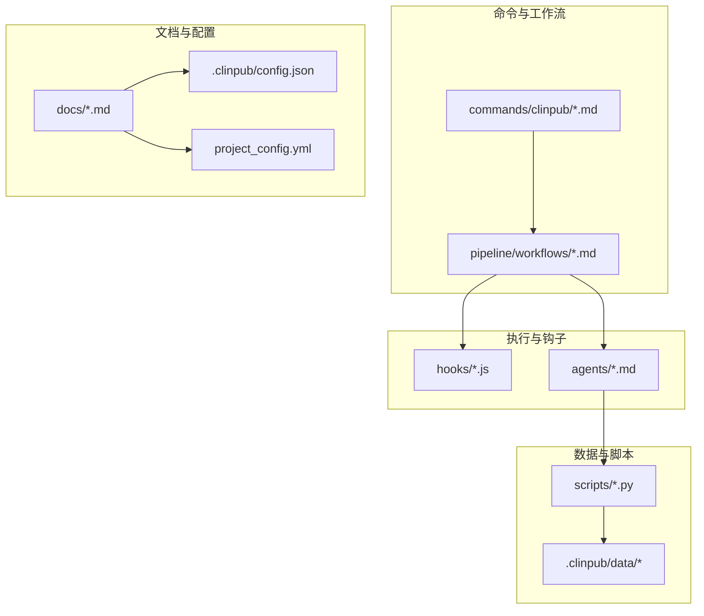
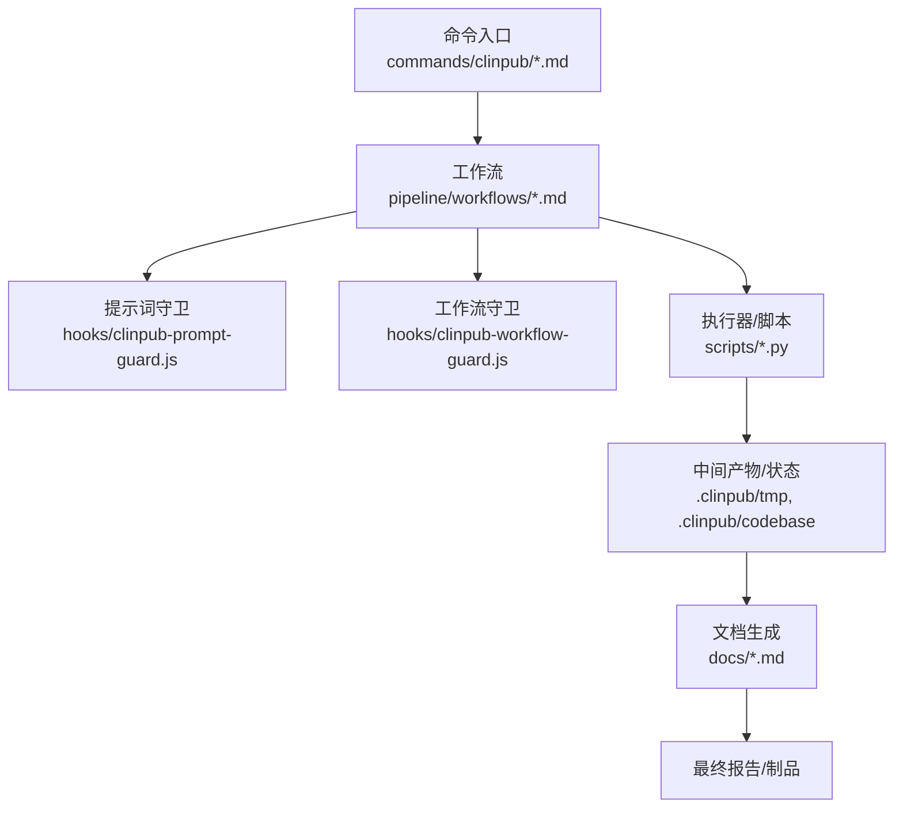
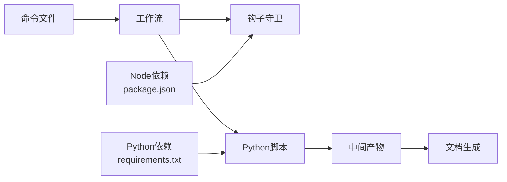

# 代码规范

<cite>
**本文引用的文件**
- [data_profiler.py](file://scripts/data_profiler.py)
- [install.js](file://bin/install.js)
- [clinpub-prompt-guard.js](file://hooks/clinpub-prompt-guard.js)
- [clinpub-workflow-guard.js](file://hooks/clinpub-workflow-guard.js)
- [analysis.md](file://commands/clinpub/analysis.md)
- [data-prep.md](file://commands/clinpub/data-prep.md)
- [data2idea.md](file://commands/clinpub/data2idea.md)
- [init-project.md](file://commands/clinpub/init-project.md)
- [milestone.md](file://commands/clinpub/milestone.md)
- [modify.md](file://commands/clinpub/modify.md)
- [next-step.md](file://commands/clinpub/next-step.md)
- [review.md](file://commands/clinpub/review.md)
- [writing.md](file://commands/clinpub/writing.md)
- [r_patterns.md](file://pipeline/references/r_patterns.md)
- [ARCHITECTURE.md](file://docs/ARCHITECTURE.md)
- [DEVELOPMENT.md](file://docs/DEVELOPMENT.md)
- [TESTING.md](file://docs/TESTING.md)
- [.gitignore](file://.gitignore)
- [requirements.txt](file://requirements.txt)
- [package.json](file://package.json)
</cite>

## 目录
1. [引言](#引言)
2. [项目结构](#项目结构)
3. [核心组件](#核心组件)
4. [架构总览](#架构总览)
5. [详细组件分析](#详细组件分析)
6. [依赖分析](#依赖分析)
7. [性能考虑](#性能考虑)
8. [故障排查指南](#故障排查指南)
9. [结论](#结论)
10. [附录](#附录)

## 引言
本指南面向clinpub项目，旨在建立统一、可维护且可审查的代码规范。规范覆盖R语言与Python两大生态，明确命名约定、文件结构模板、注释规范、代码独立性原则（禁止全局变量与跨文件依赖），并提供代码审查标准与质量检查要点。本规范以仓库现有脚本与文档为依据，结合最佳实践形成。

## 项目结构
项目采用功能模块化组织：命令与工作流位于commands与pipeline/workflows；执行器与钩子位于hooks与agents；数据处理脚本位于scripts；文档位于docs；配置与状态位于.clinpub与根目录配置文件中。

**图示来源**
- [analysis.md](file://commands/clinpub/analysis.md)
- [data-prep.md](file://commands/clinpub/data-prep.md)
- [data2idea.md](file://commands/clinpub/data2idea.md)
- [init-project.md](file://commands/clinpub/init-project.md)
- [milestone.md](file://commands/clinpub/milestone.md)
- [modify.md](file://commands/clinpub/modify.md)
- [next-step.md](file://commands/clinpub/next-step.md)
- [review.md](file://commands/clinpub/review.md)
- [writing.md](file://commands/clinpub/writing.md)
- [clinpub-prompt-guard.js](file://hooks/clinpub-prompt-guard.js)
- [clinpub-workflow-guard.js](file://hooks/clinpub-workflow-guard.js)
- [data_profiler.py](file://scripts/data_profiler.py)
- [ARCHITECTURE.md](file://docs/ARCHITECTURE.md)
- [DEVELOPMENT.md](file://docs/DEVELOPMENT.md)
- [TESTING.md](file://docs/TESTING.md)

**章节来源**
- [analysis.md](file://commands/clinpub/analysis.md)
- [data-prep.md](file://commands/clinpub/data-prep.md)
- [data2idea.md](file://commands/clinpub/data2idea.md)
- [init-project.md](file://commands/clinpub/init-project.md)
- [milestone.md](file://commands/clinpub/milestone.md)
- [modify.md](file://commands/clinpub/modify.md)
- [next-step.md](file://commands/clinpub/next-step.md)
- [review.md](file://commands/clinpub/review.md)
- [writing.md](file://commands/clinpub/writing.md)
- [ARCHITECTURE.md](file://docs/ARCHITECTURE.md)
- [DEVELOPMENT.md](file://docs/DEVELOPMENT.md)
- [TESTING.md](file://docs/TESTING.md)

## 核心组件
- 命令层：commands/clinpub/*.md定义了项目生命周期中的关键步骤（如初始化、数据准备、分析、写作等），每个步骤对应一个工作流。
- 工作流层：pipeline/workflows/*.md串联命令与钩子，形成端到端流程。
- 钩子层：hooks/*.js在关键节点进行提示词与工作流守卫校验，确保输入输出符合预期。
- 脚本层：scripts/*.py负责数据处理与分析任务。
- 文档层：docs/*.md提供架构、开发、测试等指导。
- 配置层：.clinpub/config.json与根目录配置文件管理项目状态与参数。

**章节来源**
- [analysis.md](file://commands/clinpub/analysis.md)
- [data-prep.md](file://commands/clinpub/data-prep.md)
- [data2idea.md](file://commands/clinpub/data2idea.md)
- [init-project.md](file://commands/clinpub/init-project.md)
- [milestone.md](file://commands/clinpub/milestone.md)
- [modify.md](file://commands/clinpub/modify.md)
- [next-step.md](file://commands/clinpub/next-step.md)
- [review.md](file://commands/clinpub/review.md)
- [writing.md](file://commands/clinpub/writing.md)
- [clinpub-prompt-guard.js](file://hooks/clinpub-prompt-guard.js)
- [clinpub-workflow-guard.js](file://hooks/clinpub-workflow-guard.js)
- [data_profiler.py](file://scripts/data_profiler.py)
- [ARCHITECTURE.md](file://docs/ARCHITECTURE.md)
- [DEVELOPMENT.md](file://docs/DEVELOPMENT.md)
- [TESTING.md](file://docs/TESTING.md)

## 架构总览
下图展示了从命令到工作流、钩子、脚本与文档的整体交互关系。

**图示来源**
- [analysis.md](file://commands/clinpub/analysis.md)
- [data-prep.md](file://commands/clinpub/data-prep.md)
- [data2idea.md](file://commands/clinpub/data2idea.md)
- [init-project.md](file://commands/clinpub/init-project.md)
- [milestone.md](file://commands/clinpub/milestone.md)
- [modify.md](file://commands/clinpub/modify.md)
- [next-step.md](file://commands/clinpub/next-step.md)
- [review.md](file://commands/clinpub/review.md)
- [writing.md](file://commands/clinpub/writing.md)
- [clinpub-prompt-guard.js](file://hooks/clinpub-prompt-guard.js)
- [clinpub-workflow-guard.js](file://hooks/clinpub-workflow-guard.js)
- [data_profiler.py](file://scripts/data_profiler.py)
- [ARCHITECTURE.md](file://docs/ARCHITECTURE.md)

## 详细组件分析

### 命令与工作流规范
- 命名与职责
  - 每个命令文件聚焦单一职责，文件名与命令名称一致，便于检索与调用。
  - 命令文件内部采用“步骤清单”或“流程说明”的结构化描述，避免嵌入具体实现细节。
- 结构模板
  - 文件头：简述目的、前置条件、关键参数。
  - 步骤：按序号列出可重复、可验证的步骤。
  - 输出：明确产物类型与存放位置。
  - 参考：链接到相关工作流或钩子。
- 示例路径
  - 初始化项目：[init-project.md](file://commands/clinpub/init-project.md)
  - 数据准备：[data-prep.md](file://commands/clinpub/data-prep.md)
  - 分析：[analysis.md](file://commands/clinpub/analysis.md)
  - 写作：[writing.md](file://commands/clinpub/writing.md)
  - 修改：[modify.md](file://commands/clinpub/modify.md)
  - 下一步：[next-step.md](file://commands/clinpub/next-step.md)
  - 审查：[review.md](file://commands/clinpub/review.md)
  - 里程碑：[milestone.md](file://commands/clinpub/milestone.md)

**章节来源**
- [init-project.md](file://commands/clinpub/init-project.md)
- [data-prep.md](file://commands/clinpub/data-prep.md)
- [analysis.md](file://commands/clinpub/analysis.md)
- [writing.md](file://commands/clinpub/writing.md)
- [modify.md](file://commands/clinpub/modify.md)
- [next-step.md](file://commands/clinpub/next-step.md)
- [review.md](file://commands/clinpub/review.md)
- [milestone.md](file://commands/clinpub/milestone.md)

### 钩子与守卫规范
- 提示词守卫（prompt guard）
  - 在关键输入前进行格式与范围校验，确保后续流程稳定。
  - 典型职责：必填字段检查、长度限制、正则匹配、类型约束。
- 工作流守卫（workflow guard）
  - 在流程切换点进行状态与前置条件校验，防止非法状态迁移。
  - 典型职责：阶段完成度检查、产物存在性校验、依赖完整性校验。
- 示例路径
  - 提示词守卫：[clinpub-prompt-guard.js](file://hooks/clinpub-prompt-guard.js)
  - 工作流守卫：[clinpub-workflow-guard.js](file://hooks/clinpub-workflow-guard.js)

**章节来源**
- [clinpub-prompt-guard.js](file://hooks/clinpub-prompt-guard.js)
- [clinpub-workflow-guard.js](file://hooks/clinpub-workflow-guard.js)

### Python脚本规范
- 文件命名
  - 使用全小写加下划线（snake_case），如 data_profiler.py。
- 函数命名
  - 使用snake_case，动宾结构，清晰表达意图。
- 变量命名
  - 使用snake_case，简洁明了，避免缩写。
- 常量命名
  - 使用UPPER_SNAKE_CASE，仅用于不可变配置或全局常量。
- 注释规范
  - 模块级：文件顶部提供用途、输入输出、依赖说明。
  - 函数级：参数、返回值、异常、复杂逻辑说明。
  - 行内注释：仅解释“为什么”而非“是什么”，保持简洁。
- 独立性原则
  - 禁止全局变量；所有状态通过参数传递。
  - 禁止跨文件导入；如需复用逻辑，拆分为可独立运行的模块并通过进程间通信或文件共享。
- 示例路径
  - 数据分析脚本：[data_profiler.py](file://scripts/data_profiler.py)

**章节来源**
- [data_profiler.py](file://scripts/data_profiler.py)

### R语言与R脚本规范
- 文件命名
  - 使用全小写加下划线（snake_case），如 data_summary.R。
- 函数命名
  - 使用snake_case，动宾结构，清晰表达意图。
- 变量命名
  - 使用snake_case，简洁明了，避免缩写。
- 常量命名
  - 使用UPPER_SNAKE_CASE，仅用于不可变配置或全局常量。
- 注释规范
  - 模块级：文件顶部提供用途、输入输出、依赖说明。
  - 函数级：参数、返回值、异常、复杂逻辑说明。
  - 行内注释：仅解释“为什么”而非“是什么”，保持简洁。
- 独立性原则
  - 禁止全局变量；所有状态通过参数传递。
  - 禁止跨文件导入；如需复用逻辑，拆分为可独立运行的模块并通过进程间通信或文件共享。
- 参考模式
  - R模式参考：[r_patterns.md](file://pipeline/references/r_patterns.md)

**章节来源**
- [r_patterns.md](file://pipeline/references/r_patterns.md)

### JavaScript/Node脚本规范
- 文件命名
  - 使用全小写加下划线（snake_case），如 install.js。
- 函数命名
  - 使用camelCase，清晰表达意图。
- 变量命名
  - 使用camelCase，简洁明了，避免缩写。
- 常量命名
  - 使用UPPER_SNAKE_CASE，仅用于不可变配置或全局常量。
- 注释规范
  - 模块级：文件顶部提供用途、输入输出、依赖说明。
  - 函数级：参数、返回值、异常、复杂逻辑说明。
  - 行内注释：仅解释“为什么”而非“是什么”，保持简洁。
- 独立性原则
  - 禁止全局变量；所有状态通过参数传递。
  - 禁止跨文件导入；如需复用逻辑，拆分为可独立运行的模块并通过进程间通信或文件共享。
- 示例路径
  - 安装脚本：[install.js](file://bin/install.js)

**章节来源**
- [install.js](file://bin/install.js)

### 文档与配置规范
- 文档命名
  - 使用全小写加下划线（snake_case），如 ARCHITECTURE.md。
- 结构模板
  - 标题层级：H1为文档主题，H2/H3为章节与子节。
  - 内容：背景、目标、方法、流程、注意事项、参考链接。
- 配置文件
  - JSON：键名使用snake_case，值为字符串或字面量。
  - YAML：键名使用snake_case，缩进统一为2空格。
- 示例路径
  - 架构文档：[ARCHITECTURE.md](file://docs/ARCHITECTURE.md)
  - 开发指南：[DEVELOPMENT.md](file://docs/DEVELOPMENT.md)
  - 测试指南：[TESTING.md](file://docs/TESTING.md)
  - 根配置示例：[project_config.yml](file://pipeline/templates/project_config.yml)

**章节来源**
- [ARCHITECTURE.md](file://docs/ARCHITECTURE.md)
- [DEVELOPMENT.md](file://docs/DEVELOPMENT.md)
- [TESTING.md](file://docs/TESTING.md)

## 依赖分析
- 组件耦合
  - 命令与工作流：命令文件作为契约，工作流编排命令顺序与上下文。
  - 工作流与钩子：钩子在流程边界进行校验，降低下游失败概率。
  - 脚本与文档：脚本产出中间产物，文档根据产物生成报告。
- 外部依赖
  - Python：通过requirements.txt声明依赖，版本锁定于最小可行范围。
  - Node：通过package.json声明依赖，版本锁定于最小可行范围。
- 环境隔离
  - .gitignore排除临时文件与系统缓存，避免污染仓库。

**图示来源**
- [requirements.txt](file://requirements.txt)
- [package.json](file://package.json)
- [.gitignore](file://.gitignore)

**章节来源**
- [requirements.txt](file://requirements.txt)
- [package.json](file://package.json)
- [.gitignore](file://.gitignore)

## 性能考虑
- I/O与缓存
  - 中间产物尽量本地化存储，减少重复计算。
  - 对大文件操作采用分块读取与增量处理。
- 并行化
  - 独立任务可并行执行，但需保证无共享状态。
- 资源管理
  - 明确资源占用上限，避免长时间占用锁或句柄。

## 故障排查指南
- 常见问题定位
  - 命令未生效：检查命令文件是否被工作流引用，确认步骤顺序与前置条件。
  - 钩子拦截：查看提示词与工作流守卫的报错信息，核对输入格式与范围。
  - 脚本失败：检查Python/Node依赖安装情况与环境变量，确认输入路径与权限。
- 日志与追踪
  - 在关键节点输出结构化日志，便于回溯。
- 回滚策略
  - 保留上一版本中间产物，必要时回退到最近稳定状态。

**章节来源**
- [clinpub-prompt-guard.js](file://hooks/clinpub-prompt-guard.js)
- [clinpub-workflow-guard.js](file://hooks/clinpub-workflow-guard.js)
- [data_profiler.py](file://scripts/data_profiler.py)
- [DEVELOPMENT.md](file://docs/DEVELOPMENT.md)

## 结论
本规范以“清晰、独立、可审查”为核心，覆盖命令、工作流、钩子、脚本与文档的全链路。通过统一的命名与注释规范、严格的独立性原则以及完善的审查标准，确保项目在多语言协作下的稳定性与可维护性。

## 附录

### 代码审查标准与质量检查要点
- 命名一致性
  - 变量、函数、常量命名符合规范；文件命名符合规范。
- 独立性验证
  - 禁止全局变量；禁止跨文件导入；所有状态通过参数传递。
- 注释完整性
  - 模块与函数具备必要注释；行内注释解释“为什么”。
- 错误处理
  - 显式处理异常路径；提供有意义的错误信息。
- 文档一致性
  - 命令与工作流描述一致；钩子与脚本的输入输出匹配。
- 依赖管理
  - 依赖版本锁定；避免引入不必要依赖。
- 可测试性
  - 关键逻辑可单元测试；测试用例覆盖主要分支。