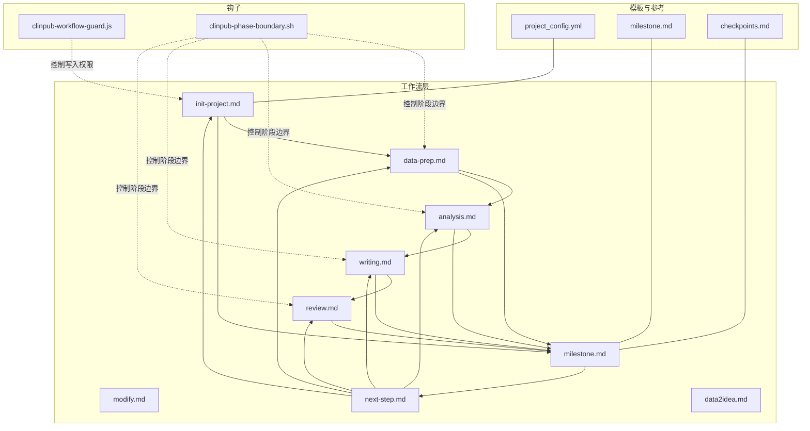
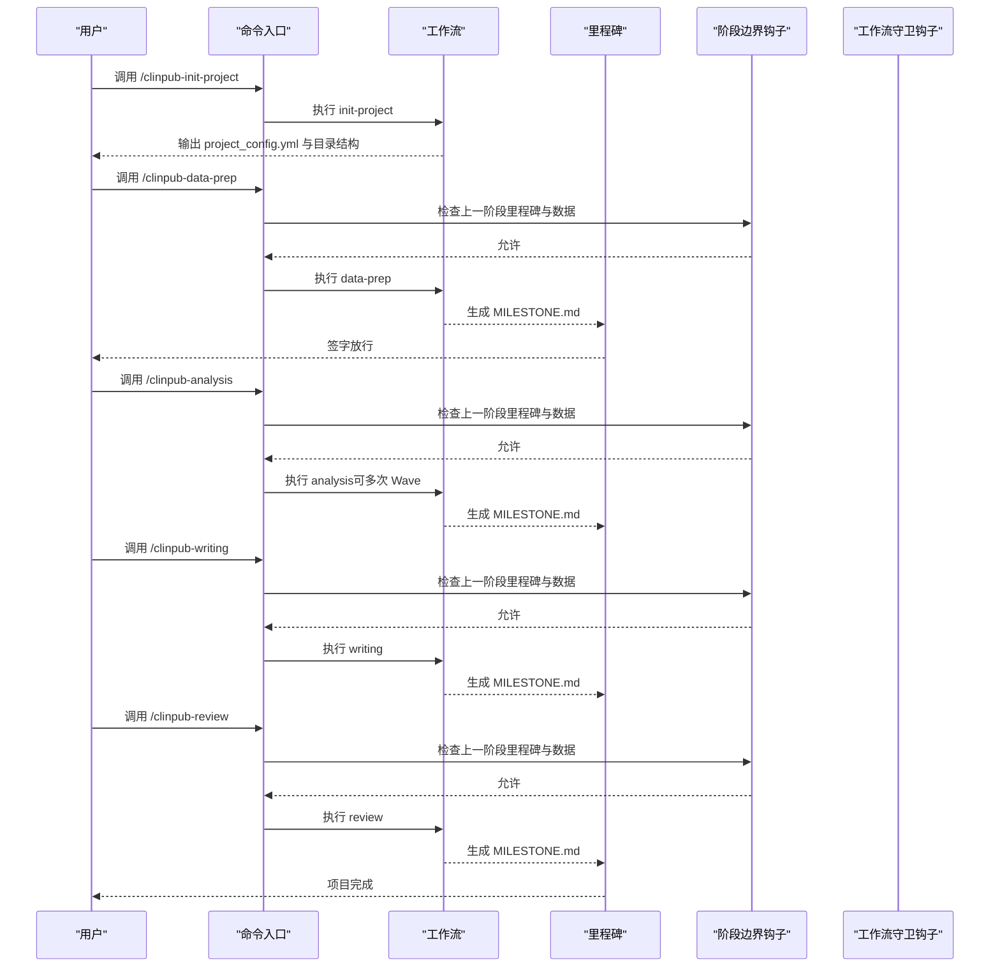
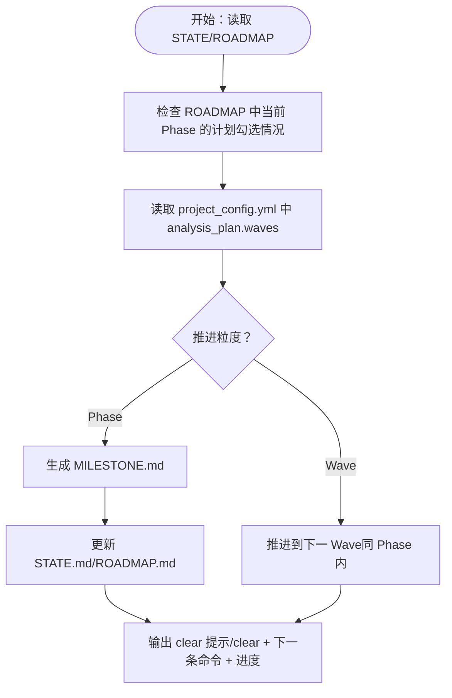
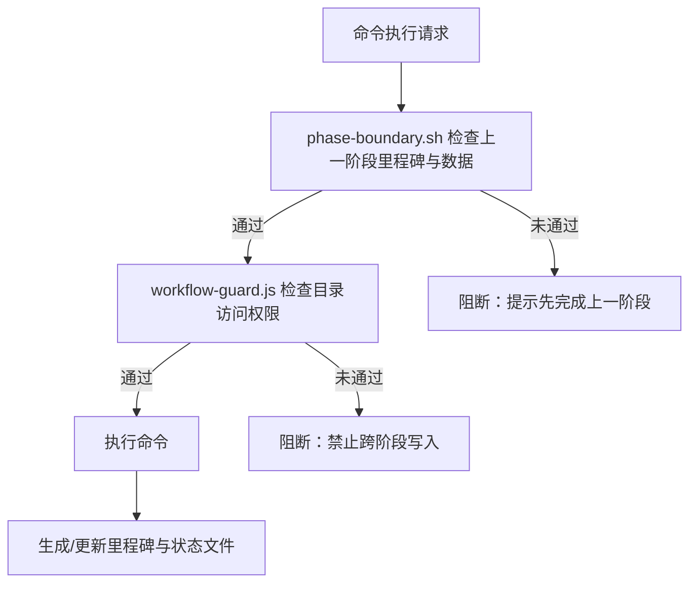
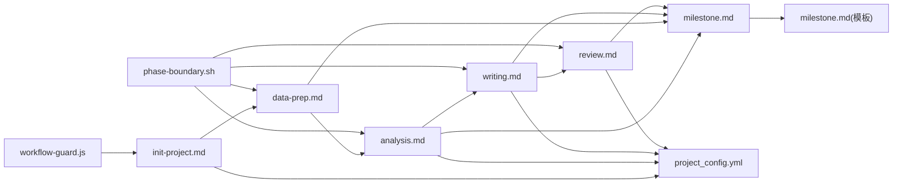

# 工作流开发

<cite>
**本文引用的文件**
- [pipeline/workflows/init-project.md](file://pipeline/workflows/init-project.md)
- [pipeline/workflows/data-prep.md](file://pipeline/workflows/data-prep.md)
- [pipeline/workflows/analysis.md](file://pipeline/workflows/analysis.md)
- [pipeline/workflows/writing.md](file://pipeline/workflows/writing.md)
- [pipeline/workflows/review.md](file://pipeline/workflows/review.md)
- [pipeline/workflows/milestone.md](file://pipeline/workflows/milestone.md)
- [pipeline/workflows/modify.md](file://pipeline/workflows/modify.md)
- [pipeline/workflows/next-step.md](file://pipeline/workflows/next-step.md)
- [pipeline/workflows/data2idea.md](file://pipeline/workflows/data2idea.md)
- [pipeline/templates/project_config.yml](file://pipeline/templates/project_config.yml)
- [pipeline/templates/milestone.md](file://pipeline/templates/milestone.md)
- [pipeline/references/checkpoints.md](file://pipeline/references/checkpoints.md)
- [hooks/clinpub-workflow-guard.js](file://hooks/clinpub-workflow-guard.js)
- [hooks/clinpub-phase-boundary.sh](file://hooks/clinpub-phase-boundary.sh)
- [commands/clinpub/clinpub.md](file://commands/clinpub/clinpub.md)
</cite>

## 目录
1. [引言](#引言)
2. [项目结构](#项目结构)
3. [核心组件](#核心组件)
4. [架构总览](#架构总览)
5. [详细组件分析](#详细组件分析)
6. [依赖关系分析](#依赖关系分析)
7. [性能考虑](#性能考虑)
8. [故障排查指南](#故障排查指南)
9. [结论](#结论)
10. [附录](#附录)

## 引言
本指南面向希望基于 clinpub 项目开发或扩展“工作流”的工程师与研究助理。文档系统性阐述工作流文件结构（触发条件、执行步骤、产出要求、前置条件）、编排原理与阶段转换机制，并提供开发模板、最佳实践（含错误处理、状态管理、输出标准化），最后结合现有工作流进行分析并给出新工作流开发的完整示例。

## 项目结构
- 工作流定义位于 pipeline/workflows/，每个 Phase 对应一个工作流文件，另有通用里程碑工作流与辅助工作流（如修改、自动推进、主题挖掘等）。
- 配置与模板位于 pipeline/templates/ 与 pipeline/references/，用于标准化输出与流程约束。
- 钩子脚本 hooks/ 实现阶段边界与权限控制，确保 Phase 顺序与数据可用性。
- 命令入口 commands/clinpub/ 提供 CLI 概览与调用指引。

**图示来源**
- [pipeline/workflows/init-project.md:1-124](file://pipeline/workflows/init-project.md#L1-L124)
- [pipeline/workflows/data-prep.md:1-184](file://pipeline/workflows/data-prep.md#L1-L184)
- [pipeline/workflows/analysis.md:1-289](file://pipeline/workflows/analysis.md#L1-L289)
- [pipeline/workflows/writing.md:1-330](file://pipeline/workflows/writing.md#L1-L330)
- [pipeline/workflows/review.md:1-134](file://pipeline/workflows/review.md#L1-L134)
- [pipeline/workflows/milestone.md:1-163](file://pipeline/workflows/milestone.md#L1-L163)
- [pipeline/workflows/modify.md:1-136](file://pipeline/workflows/modify.md#L1-L136)
- [pipeline/workflows/next-step.md:1-385](file://pipeline/workflows/next-step.md#L1-L385)
- [pipeline/workflows/data2idea.md:1-154](file://pipeline/workflows/data2idea.md#L1-L154)
- [pipeline/templates/project_config.yml:1-97](file://pipeline/templates/project_config.yml#L1-L97)
- [pipeline/templates/milestone.md:1-46](file://pipeline/templates/milestone.md#L1-L46)
- [pipeline/references/checkpoints.md:1-120](file://pipeline/references/checkpoints.md#L1-L120)
- [hooks/clinpub-workflow-guard.js:1-134](file://hooks/clinpub-workflow-guard.js#L1-L134)
- [hooks/clinpub-phase-boundary.sh:1-153](file://hooks/clinpub-phase-boundary.sh#L1-L153)

**章节来源**
- [commands/clinpub/clinpub.md:1-61](file://commands/clinpub/clinpub.md#L1-L61)

## 核心组件
- 工作流文件：每个 Phase 一个工作流，定义目的、前置阅读材料、执行步骤、成功标准与里程碑协议。
- 配置与模板：project_config.yml 作为项目配置中心；milestone.md 作为里程碑输出模板。
- 钩子：workflow-guard.js 限制跨 Phase 写入；phase-boundary.sh 保证阶段边界与数据可用性。
- 辅助工作流：modify 支持对已完成 Phase 2 输出的定向修改；next-step 自动推进到下一 Phase/Wave；data2idea 从数据挖掘论文主题。

**章节来源**
- [pipeline/workflows/init-project.md:1-124](file://pipeline/workflows/init-project.md#L1-L124)
- [pipeline/workflows/data-prep.md:1-184](file://pipeline/workflows/data-prep.md#L1-L184)
- [pipeline/workflows/analysis.md:1-289](file://pipeline/workflows/analysis.md#L1-L289)
- [pipeline/workflows/writing.md:1-330](file://pipeline/workflows/writing.md#L1-L330)
- [pipeline/workflows/review.md:1-134](file://pipeline/workflows/review.md#L1-L134)
- [pipeline/workflows/milestone.md:1-163](file://pipeline/workflows/milestone.md#L1-L163)
- [pipeline/workflows/modify.md:1-136](file://pipeline/workflows/modify.md#L1-L136)
- [pipeline/workflows/next-step.md:1-385](file://pipeline/workflows/next-step.md#L1-L385)
- [pipeline/workflows/data2idea.md:1-154](file://pipeline/workflows/data2idea.md#L1-L154)
- [pipeline/templates/project_config.yml:1-97](file://pipeline/templates/project_config.yml#L1-L97)
- [pipeline/templates/milestone.md:1-46](file://pipeline/templates/milestone.md#L1-L46)
- [hooks/clinpub-workflow-guard.js:1-134](file://hooks/clinpub-workflow-guard.js#L1-L134)
- [hooks/clinpub-phase-boundary.sh:1-153](file://hooks/clinpub-phase-boundary.sh#L1-L153)

## 架构总览
- 阶段化流水线：Phase 0 初始化 → Phase 1 数据准备 → Phase 2 统计分析（支持 Wave）→ Phase 3 撰写 → Phase 4 同行评审。
- 自动推进：next-step 根据 ROADMAP/STATE/project_config.yml 自动判断推进粒度（Wave/Phase），并生成里程碑。
- 权限与边界：workflow-guard.js 限制跨 Phase 写入；phase-boundary.sh 检查上一 Phase 里程碑与数据存在性。
- 里程碑与审计：每个 Phase 结束均生成 MILESTONE.md，记录交付物、决策与状态，供用户签字放行。

**图示来源**
- [pipeline/workflows/init-project.md:1-124](file://pipeline/workflows/init-project.md#L1-L124)
- [pipeline/workflows/data-prep.md:1-184](file://pipeline/workflows/data-prep.md#L1-L184)
- [pipeline/workflows/analysis.md:1-289](file://pipeline/workflows/analysis.md#L1-L289)
- [pipeline/workflows/writing.md:1-330](file://pipeline/workflows/writing.md#L1-L330)
- [pipeline/workflows/review.md:1-134](file://pipeline/workflows/review.md#L1-L134)
- [pipeline/workflows/milestone.md:1-163](file://pipeline/workflows/milestone.md#L1-L163)
- [hooks/clinpub-phase-boundary.sh:1-153](file://hooks/clinpub-phase-boundary.sh#L1-L153)
- [hooks/clinpub-workflow-guard.js:1-134](file://hooks/clinpub-workflow-guard.js#L1-L134)

## 详细组件分析

### 工作流文件结构与定义规范
- 文件头元信息：name、description、目的（<purpose>）、所需阅读（<required_reading>）。
- 执行过程：<process> 内部包含若干 <step>，每个 step 有 name 与 priority（first/high/medium），并包含步骤说明、触发条件、前置条件、执行动作与产出要求。
- 成功标准：<success_criteria> 列出可验证的交付物与质量要求。
- 里程碑：工作流末尾调用 milestone 工作流，生成 MILESTONE.md 并更新 ROADMAP/STATE。

示例片段路径（不展示具体内容）：
- [pipeline/workflows/analysis.md:1-289](file://pipeline/workflows/analysis.md#L1-L289)
- [pipeline/workflows/data-prep.md:1-184](file://pipeline/workflows/data-prep.md#L1-L184)
- [pipeline/workflows/writing.md:1-330](file://pipeline/workflows/writing.md#L1-L330)
- [pipeline/workflows/review.md:1-134](file://pipeline/workflows/review.md#L1-L134)
- [pipeline/workflows/init-project.md:1-124](file://pipeline/workflows/init-project.md#L1-L124)

**章节来源**
- [pipeline/workflows/analysis.md:1-289](file://pipeline/workflows/analysis.md#L1-L289)
- [pipeline/workflows/data-prep.md:1-184](file://pipeline/workflows/data-prep.md#L1-L184)
- [pipeline/workflows/writing.md:1-330](file://pipeline/workflows/writing.md#L1-L330)
- [pipeline/workflows/review.md:1-134](file://pipeline/workflows/review.md#L1-L134)
- [pipeline/workflows/init-project.md:1-124](file://pipeline/workflows/init-project.md#L1-L124)

### 编排原理与阶段转换机制
- 自动推进 next-step：读取 STATE.md/ROADMAP.md/project_config.yml，判断当前 Phase/Wave 完成度，决定推进到下一 Wave 或下一 Phase；推进前生成 MILESTONE.md，避免被 phase-boundary.sh 阻挡。
- 阶段边界检查：phase-boundary.sh 校验上一 Phase 的里程碑状态与关键数据是否存在，未满足则阻断命令执行。
- 写入权限控制：workflow-guard.js 仅允许对当前 Phase 允许的目录进行写入，防止越权操作。

**图示来源**
- [pipeline/workflows/next-step.md:1-385](file://pipeline/workflows/next-step.md#L1-L385)
- [hooks/clinpub-phase-boundary.sh:1-153](file://hooks/clinpub-phase-boundary.sh#L1-L153)
- [pipeline/workflows/milestone.md:1-163](file://pipeline/workflows/milestone.md#L1-L163)

**章节来源**
- [pipeline/workflows/next-step.md:1-385](file://pipeline/workflows/next-step.md#L1-L385)
- [hooks/clinpub-phase-boundary.sh:1-153](file://hooks/clinpub-phase-boundary.sh#L1-L153)

### 错误处理与状态管理
- Checkpoint 协议：通过 checkpoints.md 定义 decision/verify/milestone 三种 checkpoint，确保每个关键节点都有明确的恢复信号与审计记录。
- 状态持久化：MILESTONE.md 记录交付物、决策、阻塞项与用户签字；STATE.md 记录当前 Phase 与进度；ROADMAP.md 记录阶段目标与完成状态。
- 阻断与恢复：phase-boundary.sh 与 workflow-guard.js 在命令执行前进行阻断检查，用户需先完成上一阶段里程碑与数据准备，再继续。

**图示来源**
- [hooks/clinpub-phase-boundary.sh:1-153](file://hooks/clinpub-phase-boundary.sh#L1-L153)
- [hooks/clinpub-workflow-guard.js:1-134](file://hooks/clinpub-workflow-guard.js#L1-L134)
- [pipeline/references/checkpoints.md:1-120](file://pipeline/references/checkpoints.md#L1-L120)
- [pipeline/workflows/milestone.md:1-163](file://pipeline/workflows/milestone.md#L1-L163)

**章节来源**
- [pipeline/references/checkpoints.md:1-120](file://pipeline/references/checkpoints.md#L1-L120)
- [pipeline/workflows/milestone.md:1-163](file://pipeline/workflows/milestone.md#L1-L163)
- [hooks/clinpub-phase-boundary.sh:1-153](file://hooks/clinpub-phase-boundary.sh#L1-L153)
- [hooks/clinpub-workflow-guard.js:1-134](file://hooks/clinpub-workflow-guard.js#L1-L134)

### 输出标准化与产物清单
- 分析阶段：每个方法需产出 figure + table + 方法说明；MANIFEST.yaml 声明 writer-agent 为消费者；统计报告需包含效应量、95%CI、精确 p 值。
- 撰写阶段：IMRAD 四段独立草稿，最终拼接为 manuscript.md；引用库统一编号，References 区完整；MANIFEST.yaml 声明 verifiers。
- 评审阶段：review_v1.md、final/manuscript.md、response_letter.md、更新的 references.bib。

**章节来源**
- [pipeline/workflows/analysis.md:224-235](file://pipeline/workflows/analysis.md#L224-L235)
- [pipeline/workflows/writing.md:180-196](file://pipeline/workflows/writing.md#L180-L196)
- [pipeline/workflows/review.md:100-105](file://pipeline/workflows/review.md#L100-L105)

### 工作流开发模板与最佳实践
- 模板字段与优先级：每个 step 的 priority 应与实际风险与依赖关系匹配（first 高风险/高依赖，high 中等，medium 低）。
- 前置条件与触发条件：在 step 中明确列出“需要什么已存在”“何时触发”，并在执行前进行校验。
- 产出要求：每个方法/段落的 figure/table/README 必须齐全；MANIFEST.yaml 必须声明消费者。
- 错误处理：使用 checkpoint:verify 与 checkpoint:milestone，确保用户确认后再继续；失败项需记录到 MILESTONE.md 的 blockers。
- 状态管理：STATE.md/ROADMAP.md/MILESTONE.md 三文件联动，确保审计可追溯。

**章节来源**
- [pipeline/workflows/analysis.md:17-289](file://pipeline/workflows/analysis.md#L17-L289)
- [pipeline/workflows/writing.md:180-330](file://pipeline/workflows/writing.md#L180-L330)
- [pipeline/workflows/review.md:1-134](file://pipeline/workflows/review.md#L1-L134)
- [pipeline/workflows/milestone.md:1-163](file://pipeline/workflows/milestone.md#L1-L163)
- [pipeline/references/checkpoints.md:1-120](file://pipeline/references/checkpoints.md#L1-L120)

### 现有工作流分析
- 初始化（init-project）：讨论研究框架 → 创建目录结构 → 生成 project_config.yml → 记录决策 → milestone。
- 数据准备（data-prep）：支持 re-init 刷新 → 讨论清理策略 → 结构检测 → 执行清洗 → 验证 → checkpoint → milestone。
- 统计分析（analysis）：诊断数据结构 → 动态构建分析计划 → 用户确认 → 按波次执行 → 验证 → 用户满意度检查 → milestone。
- 撰写（writing）：引用策略讨论 → 文献预搜索 → IMRAD 逐段撰写 → 人类化检查 → 验证 → 拼接 → checkpoint → milestone。
- 评审（review）：模拟评审 → 用户确认修订项 → 修订 → 响应信 → 验证 → milestone。
- 里程碑（milestone）：加载上下文 → 验证成功标准 → 收集决策 → 生成 MILESTONE.md → 更新 ROADMAP/STATE → 用户签字。
- 修改（modify）：验证分析已完成 → 定义修改 → 执行修改 → 验证 → 更新 PLAN.md 与 STATE.md。
- 自动推进（next-step）：读取 STATE/ROADMAP/project_config.yml → 判断推进粒度 → 生成里程碑 → 更新状态 → 输出 clear 提示。
- 主题挖掘（data2idea）：数据画像 → 并行文献扫描 → 生成候选主题 → 用户选择。

**章节来源**
- [pipeline/workflows/init-project.md:1-124](file://pipeline/workflows/init-project.md#L1-L124)
- [pipeline/workflows/data-prep.md:1-184](file://pipeline/workflows/data-prep.md#L1-L184)
- [pipeline/workflows/analysis.md:1-289](file://pipeline/workflows/analysis.md#L1-L289)
- [pipeline/workflows/writing.md:1-330](file://pipeline/workflows/writing.md#L1-L330)
- [pipeline/workflows/review.md:1-134](file://pipeline/workflows/review.md#L1-L134)
- [pipeline/workflows/milestone.md:1-163](file://pipeline/workflows/milestone.md#L1-L163)
- [pipeline/workflows/modify.md:1-136](file://pipeline/workflows/modify.md#L1-L136)
- [pipeline/workflows/next-step.md:1-385](file://pipeline/workflows/next-step.md#L1-L385)
- [pipeline/workflows/data2idea.md:1-154](file://pipeline/workflows/data2idea.md#L1-L154)

### 新工作流开发完整示例
- 目标：新增“外部数据整合”Phase，负责从外部数据库拉取数据并合并到 cleaned.csv。
- 步骤设计：
  - reinit_data_prep（可复用）：刷新变量字典与配置。
  - external_data_discovery：发现可用外部数据源（接口/文件/链接）。
  - external_data_download：下载并校验数据完整性。
  - merge_with_cleaned：与 cleaned.csv 合并，处理 ID 映射与字段对齐。
  - validate_merge：校验合并后的数据维度、缺失模式与一致性。
  - checkpoint_confirm：用户确认合并结果。
  - milestone：生成里程碑并更新 ROADMAP/STATE。
- 触发条件：仅在 Phase 1 完成后允许执行。
- 前置条件：cleaned.csv 存在；外部数据源可用；ID 字段映射清晰。
- 产出要求：合并后的数据文件、合并日志、MANIFEST.yaml、MILESTONE.md。
- 风险控制：使用 workflow-guard.js 与 phase-boundary.sh 保护；失败项记录到 MILESTONE.md。

**章节来源**
- [hooks/clinpub-workflow-guard.js:1-134](file://hooks/clinpub-workflow-guard.js#L1-L134)
- [hooks/clinpub-phase-boundary.sh:1-153](file://hooks/clinpub-phase-boundary.sh#L1-L153)
- [pipeline/workflows/milestone.md:1-163](file://pipeline/workflows/milestone.md#L1-L163)

## 依赖关系分析
- 工作流之间：init → data-prep → analysis → writing → review；analysis 与 writing 之间通过 project_config.yml 与 .clinpub 目录共享状态。
- 钩子依赖：phase-boundary.sh 依赖 STATE.md/ROADMAP.md 与关键文件存在性；workflow-guard.js 依赖 STATE.md 的 Phase 识别。
- 模板依赖：milestone.md 作为里程碑输出模板；project_config.yml 作为配置中心。

**图示来源**
- [pipeline/workflows/init-project.md:1-124](file://pipeline/workflows/init-project.md#L1-L124)
- [pipeline/workflows/data-prep.md:1-184](file://pipeline/workflows/data-prep.md#L1-L184)
- [pipeline/workflows/analysis.md:1-289](file://pipeline/workflows/analysis.md#L1-L289)
- [pipeline/workflows/writing.md:1-330](file://pipeline/workflows/writing.md#L1-L330)
- [pipeline/workflows/review.md:1-134](file://pipeline/workflows/review.md#L1-L134)
- [pipeline/workflows/milestone.md:1-163](file://pipeline/workflows/milestone.md#L1-L163)
- [pipeline/templates/milestone.md:1-46](file://pipeline/templates/milestone.md#L1-L46)
- [pipeline/templates/project_config.yml:1-97](file://pipeline/templates/project_config.yml#L1-L97)
- [hooks/clinpub-phase-boundary.sh:1-153](file://hooks/clinpub-phase-boundary.sh#L1-L153)
- [hooks/clinpub-workflow-guard.js:1-134](file://hooks/clinpub-workflow-guard.js#L1-L134)

**章节来源**
- [pipeline/workflows/next-step.md:1-385](file://pipeline/workflows/next-step.md#L1-L385)
- [pipeline/workflows/milestone.md:1-163](file://pipeline/workflows/milestone.md#L1-L163)

## 性能考虑
- 并行化：文献搜索（writing/data2idea）可并行执行多个子任务，减少等待时间。
- 数据缓存：引用库与变量画像可复用，避免重复计算。
- 验证前置：在执行昂贵步骤前先进行快速校验（如 cleaned.csv 存在性），减少无效开销。
- 输出增量：仅在变更时更新 MANIFEST.yaml 与里程碑文件，降低 IO 压力。

## 故障排查指南
- “上一阶段未完成”：检查 STATE.md 中 Phase 标识与 ROADMAP.md 的里程碑状态；确保上一阶段 milestone 已生成且用户已签字。
- “跨阶段写入被阻断”：查看 workflow-guard.js 报错原因，确认当前 Phase 允许的目录；先完成当前 Phase 再进入下一 Phase。
- “缺少关键数据文件”：phase-boundary.sh 会提示缺失 cleaned.csv/outputs/manuscript 等，先补齐数据再执行命令。
- “Wave 推进失败”：next-step 会根据 analysis_plan.waves 与 SUMMARY.md 判断，确保最后一个 Wave 的 SUMMARY.md 存在或按计划定义下一 Wave。
- “里程碑缺失导致阻塞”：确保推进到新 Phase 前已生成 MILESTONE.md，否则会被 phase-boundary.sh 阻断。

**章节来源**
- [hooks/clinpub-phase-boundary.sh:1-153](file://hooks/clinpub-phase-boundary.sh#L1-L153)
- [hooks/clinpub-workflow-guard.js:1-134](file://hooks/clinpub-workflow-guard.js#L1-L134)
- [pipeline/workflows/next-step.md:1-385](file://pipeline/workflows/next-step.md#L1-L385)

## 结论
clinpub 的工作流体系以 Phase 为主线，通过 checkpoint 与 milestone 实现强审计与可追溯性；通过钩子保障阶段边界与权限控制；通过模板与配置实现输出标准化。开发者在扩展新工作流时，应严格遵循“触发条件—执行步骤—产出要求—前置条件—里程碑”的结构化设计，并与现有 STATE/ROADMAP/MILESTONE 机制协同，确保整体流程的稳定性与可维护性。

## 附录
- 命令概览与调用顺序：参见 commands/clinpub/clinpub.md。
- 里程碑模板：参见 pipeline/templates/milestone.md。
- 配置模板：参见 pipeline/templates/project_config.yml。
- Checkpoint 协议：参见 pipeline/references/checkpoints.md。

**章节来源**
- [commands/clinpub/clinpub.md:1-61](file://commands/clinpub/clinpub.md#L1-L61)
- [pipeline/templates/milestone.md:1-46](file://pipeline/templates/milestone.md#L1-L46)
- [pipeline/templates/project_config.yml:1-97](file://pipeline/templates/project_config.yml#L1-L97)
- [pipeline/references/checkpoints.md:1-120](file://pipeline/references/checkpoints.md#L1-L120)