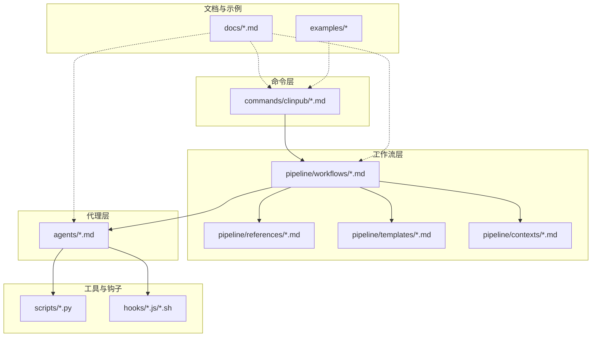
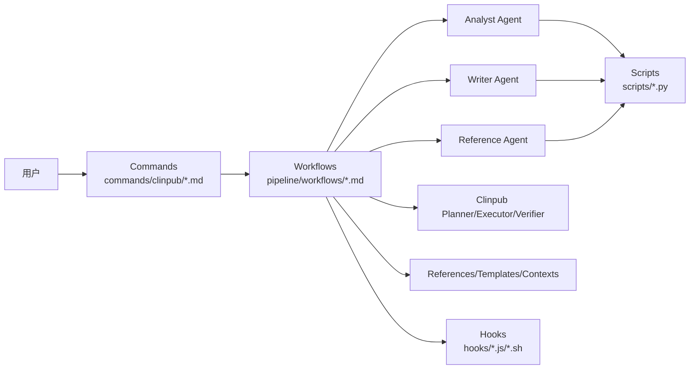
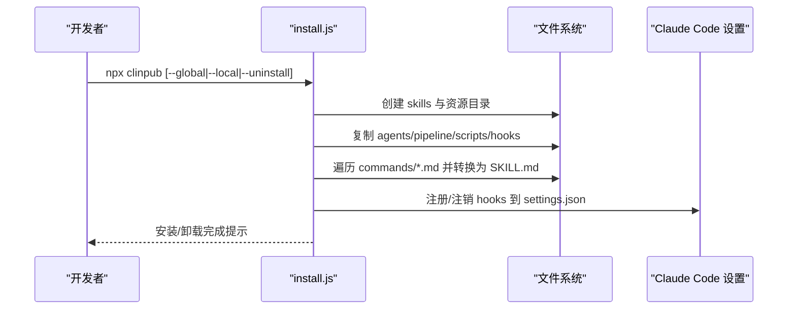
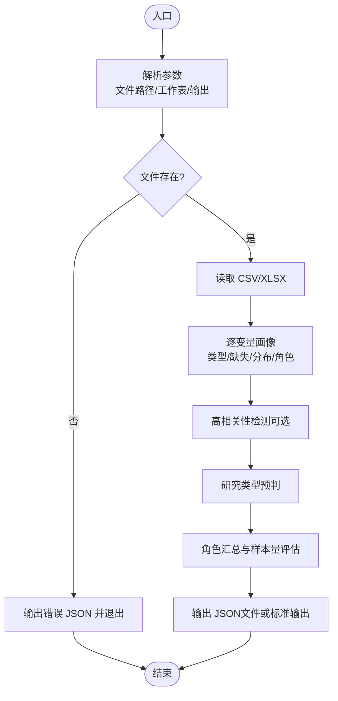
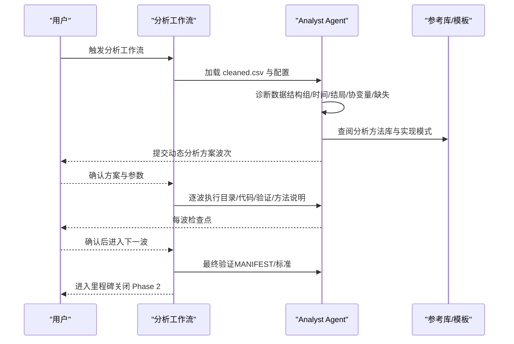
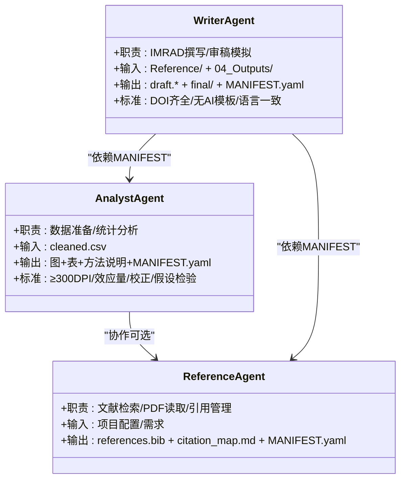
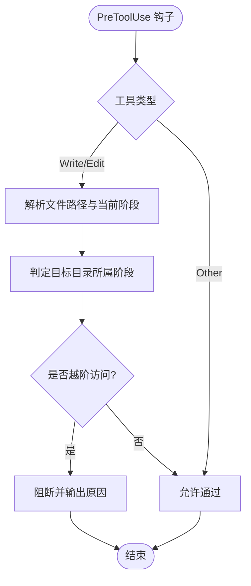
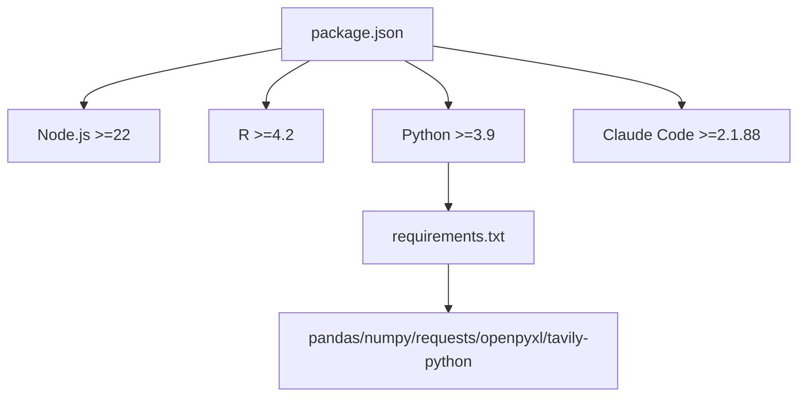

# 开发者指南

<cite>
**本文引用的文件**
- [README.md](file://README.md)
- [INSTALL.md](file://INSTALL.md)
- [docs/DEVELOPMENT.md](file://docs/DEVELOPMENT.md)
- [docs/getting-started.md](file://docs/getting-started.md)
- [docs/ARCHITECTURE.md](file://docs/ARCHITECTURE.md)
- [docs/CONFIGURATION.md](file://docs/CONFIGURATION.md)
- [requirements.txt](file://requirements.txt)
- [package.json](file://package.json)
- [bin/install.js](file://bin/install.js)
- [scripts/data_profiler.py](file://scripts/data_profiler.py)
- [agents/analyst-agent.md](file://agents/analyst-agent.md)
- [agents/writer-agent.md](file://agents/writer-agent.md)
- [pipeline/workflows/analysis.md](file://pipeline/workflows/analysis.md)
- [pipeline/references/analysis_methods.md](file://pipeline/references/analysis_methods.md)
- [hooks/clinpub-workflow-guard.js](file://hooks/clinpub-workflow-guard.js)
</cite>

## 目录
1. [简介](#简介)
2. [项目结构](#项目结构)
3. [核心组件](#核心组件)
4. [架构总览](#架构总览)
5. [详细组件分析](#详细组件分析)
6. [依赖关系分析](#依赖关系分析)
7. [性能考虑](#性能考虑)
8. [故障排除指南](#故障排除指南)
9. [结论](#结论)
10. [附录](#附录)

## 简介
本指南面向希望参与 clinpub 项目开发与扩展的贡献者，覆盖开发环境搭建、代码结构与扩展机制、Python 数据剖析脚本使用、安装脚本工作原理、测试策略、AI 代理开发、工作流与分析方法扩展、代码贡献流程、编码规范、发布流程、调试技巧、性能优化与故障排除等内容。clinpub 是一个面向 SCI Q1/Q2 期刊的端到端临床数据分析与发表加速器，采用 Commands → Workflows → Agents 的三层架构，并通过 Claude Code 的 Skills 与 Hooks 实现工作流保护与协作。

## 项目结构
项目采用“命令入口 → 工作流编排 → 代理执行”的分层组织方式，配合参考文档、模板与钩子保障质量门控与阶段隔离。

**图表来源**
- [docs/ARCHITECTURE.md:9-43](file://docs/ARCHITECTURE.md#L9-L43)
- [README.md:20-45](file://README.md#L20-L45)

**章节来源**
- [README.md:20-45](file://README.md#L20-L45)
- [docs/ARCHITECTURE.md:7-43](file://docs/ARCHITECTURE.md#L7-L43)

## 核心组件
- 命令入口（Commands）：以 Claude Code Skills 形式暴露，作为用户与管线交互的统一入口，负责参数解析与路由。
- 工作流（Workflows）：定义阶段化编排逻辑与依赖关系，协调代理执行与检查点。
- 代理（Agents）：专业化角色卡片，定义职责、输入输出、工具权限与质量标准，通过文件系统传递数据。
- 工具脚本（Scripts）：Python/R 工具，如数据画像、搜索、PDF 处理等，遵循独立性原则。
- 钩子（Hooks）：Claude Code 预工具使用钩子，强制阶段顺序、边界与提示注入防护。
- 参考与模板（References/Templates/Contexts）：方法库、模板与上下文配置，支撑动态分析方案与产出标准化。

**章节来源**
- [docs/ARCHITECTURE.md:47-83](file://docs/ARCHITECTURE.md#L47-L83)
- [docs/CONFIGURATION.md:187-210](file://docs/CONFIGURATION.md#L187-L210)

## 架构总览
三层架构与 Agent 协作模式如下：

**图表来源**
- [README.md:37-58](file://README.md#L37-L58)
- [docs/ARCHITECTURE.md:45-83](file://docs/ARCHITECTURE.md#L45-L83)

## 详细组件分析

### 安装脚本（bin/install.js）工作原理
- 功能概览
  - 将 commands/clinpub/*.md 转换为 Claude Code Skills（SKILL.md），并重写 @-引用指向已安装资源目录。
  - 复制 agents/pipeline/scripts/hooks 至 ~/.claude/clinpub 或 ././.claude/clinpub。
  - 注册/注销 Claude Code Hooks（PreToolUse）以保护阶段边界与防止越阶写文件。
  - 支持交互式与非交互式安装（全局/本地），以及卸载。
- 关键流程
  - 解析参数与安装位置（全局/本地）。
  - 复制共享资源目录。
  - 遍历命令文件，提取 Frontmatter 并重建技能描述，替换 @-引用为资源目录。
  - 注册/注销 hooks 到 .claude/settings.json。
  - 环境检查（Node.js、R、Python、Claude Code）并打印软警告。
- 安全与兼容性
  - 通过正则与 YAML 转义处理 Frontmatter 字段。
  - 针对 Windows/Linux 的路径与命令查找差异处理。
  - 钩子注册幂等，先删除旧条目再添加新条目。

**图表来源**
- [bin/install.js:326-398](file://bin/install.js#L326-L398)
- [bin/install.js:169-211](file://bin/install.js#L169-L211)
- [bin/install.js:400-431](file://bin/install.js#L400-L431)

**章节来源**
- [bin/install.js:1-500](file://bin/install.js#L1-L500)
- [INSTALL.md:20-44](file://INSTALL.md#L20-L44)

### Python 数据剖析脚本（scripts/data_profiler.py）
- 用途
  - 为 /clinpub-data2idea 命令提供数据画像，包括变量字典、缺失模式、分布摘要、相关性与研究类型预判。
- 核心能力
  - 变量角色推断（结局、暴露、时间、协变量、生物标志物、匹配、ID）。
  - 研究类型建议（RCT、队列、横断面、病例对照、标志物面板、诊断性研究、描述性研究）。
  - 缺失率统计、高相关性检测、样本量评估。
- 使用方式
  - 支持 CSV/XLSX；可指定 Excel 工作表；可输出 JSON 文件。
  - 依赖 pandas/numpy；缺失依赖时返回错误 JSON。
- 独立性与健壮性
  - 命令行参数解析；文件存在性校验；异常捕获与错误输出；超大变量集相关性矩阵降采样警告。

**图表来源**
- [scripts/data_profiler.py:328-353](file://scripts/data_profiler.py#L328-L353)

**章节来源**
- [scripts/data_profiler.py:1-353](file://scripts/data_profiler.py#L1-L353)
- [INSTALL.md:79-83](file://INSTALL.md#L79-L83)

### 分析工作流（pipeline/workflows/analysis.md）
- 目标
  - 基于数据结构诊断，动态构建分析方案，与用户讨论确认后按依赖顺序执行，最终输出图、表与方法说明。
- 关键步骤
  - 数据结构诊断：组结构、时间点、结局类型、协变量、缺失模式、纵向标记、暴露变量。
  - 动态提案：依据决策树匹配推荐方向，组织为波次（wave），并写入 .clinpub/phases/02-analysis/01-PLAN.md。
  - 用户确认：方法列表、参数、颜色偏好、分割策略、多重比较校正、显著性水平、结果变换。
  - 波次执行：按波次顺序执行，每波完成后检查点等待确认；支持审稿阶段追加新波次。
  - 最终验证：图 ≥300 DPI、英文标签、效应量+95%CI+p 值、MANIFEST.yaml。
- 质量标准
  - 统一主题与输出规范；报告软件版本与关键包版本；假设检验与误差处理。

**图表来源**
- [pipeline/workflows/analysis.md:19-251](file://pipeline/workflows/analysis.md#L19-L251)
- [pipeline/references/analysis_methods.md:18-104](file://pipeline/references/analysis_methods.md#L18-L104)

**章节来源**
- [pipeline/workflows/analysis.md:1-289](file://pipeline/workflows/analysis.md#L1-L289)
- [pipeline/references/analysis_methods.md:1-311](file://pipeline/references/analysis_methods.md#L1-L311)

### Agent 开发与协作（agents/analyst-agent.md、agents/writer-agent.md）
- Analyst Agent
  - 职责：数据准备（缺失处理、异常检测、派生变量、质量报告）与统计分析（按波次执行，生成图、表、方法说明）。
  - 独立性：严格从 cleaned.csv 读取，输出 MANIFEST.yaml，目录编号按确认顺序动态。
  - 质量标准：≥300 DPI、英文标签、效应量+95%CI+p 值、多重比较校正、假设检验。
- Writer Agent
  - 职责：IMRAD 撰写（中文正文+英文图表），模拟审稿与修订，强制 Anti-AI 模板规则。
  - 协作：读取 Reference/ 与 04_Outputs/，校验上游 MANIFEST.yaml，确保引用与图表一一对应。
  - 成功标准：完整 IMRAD、DOI 全部、无 AI 模板痕迹、语言一致性。

**图表来源**
- [agents/analyst-agent.md:1-141](file://agents/analyst-agent.md#L1-L141)
- [agents/writer-agent.md:1-166](file://agents/writer-agent.md#L1-L166)

**章节来源**
- [agents/analyst-agent.md:1-141](file://agents/analyst-agent.md#L1-L141)
- [agents/writer-agent.md:1-166](file://agents/writer-agent.md#L1-L166)

### 钩子机制（hooks/clinpub-workflow-guard.js）
- 作用
  - 阶段边界保护：阻止越阶段写文件，确保 Phase 0→1→2→3→4 的顺序。
  - 提示注入防护：扫描数据文件中的潜在注入风险。
  - Bash 阶段守卫：校验前置里程碑完成状态。
- 实现要点
  - 读取 .clinpub/STATE.md 获取当前阶段。
  - 通过文件路径判断目标目录归属阶段。
  - 对 Write/Edit 工具进行拦截与放行决策，阻断时返回错误并退出码。

**图表来源**
- [hooks/clinpub-workflow-guard.js:25-77](file://hooks/clinpub-workflow-guard.js#L25-L77)
- [hooks/clinpub-workflow-guard.js:84-131](file://hooks/clinpub-workflow-guard.js#L84-L131)

**章节来源**
- [hooks/clinpub-workflow-guard.js:1-134](file://hooks/clinpub-workflow-guard.js#L1-L134)
- [README.md:131-140](file://README.md#L131-L140)

## 依赖关系分析
- 运行时与工具链
  - Node.js（>=22.0.0）：安装脚本与钩子执行。
  - R（>=4.2）：统计分析与可视化。
  - Python（>=3.9）：数据画像与搜索脚本。
  - Claude Code（>=2.1.88）：Skills 与钩子宿主。
- 包与模块
  - R 包：数据处理、统计、可视化、输出、路径等。
  - Python 包：pandas、numpy、requests、openpyxl、tavily-python 等。
- 项目依赖与文件
  - package.json 定义二进制入口与文件打包。
  - requirements.txt 管理 Python 依赖。
  - 安装脚本复制共享资源并注册钩子。

**图表来源**
- [package.json:15-17](file://package.json#L15-L17)
- [INSTALL.md:67-83](file://INSTALL.md#L67-L83)
- [requirements.txt:1-8](file://requirements.txt#L1-L8)

**章节来源**
- [package.json:1-31](file://package.json#L1-L31)
- [INSTALL.md:58-90](file://INSTALL.md#L58-L90)
- [requirements.txt:1-8](file://requirements.txt#L1-L8)

## 性能考虑
- R 性能优化
  - 大数据读取：使用 data.table 或 fread。
  - 并行处理：利用 mclapply（Linux/macOS）或多核处理。
  - 内存管理：及时释放对象，避免不必要的复制。
- Python 性能优化
  - 分块读取：使用 chunksize 处理大文件。
  - 并行计算：multiprocessing.Pool。
  - 向量化操作：优先使用 pandas/numpy 向量化。
- 工具脚本
  - data_profiler.py 对高维变量集进行相关性矩阵降采样警告，避免 O(n^2) 计算开销。
- I/O 与缓存
  - 通过 MANIFEST.yaml 明确产出与消费者，减少重复执行与无效 I/O。

**章节来源**
- [docs/DEVELOPMENT.md:294-319](file://docs/DEVELOPMENT.md#L294-L319)
- [scripts/data_profiler.py:279-298](file://scripts/data_profiler.py#L279-L298)

## 故障排除指南
- 安装与环境
  - Skills 未出现：重启 Claude Code 以加载新技能。
  - R 包安装失败：逐个安装定位失败包；Bioconductor 包缺失时使用 BiocManager 安装。
  - Python 导入错误：执行 pip install -r requirements.txt。
  - API 密钥：设置 NCBI_API_KEY 与 TAVILY_API_KEY 提升搜索稳定性。
- 数据与配置
  - cleaned.csv 生成失败：确认 01_RawData/ 下存在 CSV；检查 project_config.yml 的 variables 映射与编码。
  - 图表中文乱码：在 R 中安装并启用 showtext，设置中文字体。
- 阶段越界与安全
  - 越阶段写文件被阻断：检查 .clinpub/STATE.md 的阶段状态；完成前置里程碑后再进入下一阶段。
- 常见问题定位
  - 使用调试工具：R 使用 options(error=recover) 与 browser()；Python 使用 pdb 或 logging。
  - 日志与输出：确保每个方法生成 MANIFEST.yaml，便于回溯与验证。

**章节来源**
- [INSTALL.md:105-115](file://INSTALL.md#L105-L115)
- [docs/getting-started.md:225-260](file://docs/getting-started.md#L225-L260)
- [hooks/clinpub-workflow-guard.js:104-125](file://hooks/clinpub-workflow-guard.js#L104-L125)

## 结论
clinpub 通过 Commands/Workflows/Agents 的分层设计与 Hooks 的质量门控，实现了可扩展、可复现且面向发表的临床数据分析管线。贡献者可基于独立性原则与标准化模板快速扩展 AI 代理、工作流与分析方法，并通过安装脚本与钩子机制保障一致性与安全性。建议在开发中遵循编码规范、测试策略与调试流程，持续优化性能并完善故障排除方案。

## 附录

### 开发环境搭建与验证
- 系统要求
  - Node.js（>=22.0.0）、R（>=4.2）、Python（>=3.9）、Claude Code（>=2.1.88）。
- R 包安装
  - 使用 INSTALL.md 中的 install.packages(...) 命令安装所需包。
- Python 环境
  - 使用 requirements.txt 安装依赖；建议使用虚拟环境。
- 验证安装
  - 重启 Claude Code 后输入 /clinpub 验证技能加载。

**章节来源**
- [INSTALL.md:58-90](file://INSTALL.md#L58-L90)
- [INSTALL.md:116-123](file://INSTALL.md#L116-L123)

### 代码贡献流程与规范
- 提交流程
  - Fork 仓库 → 创建功能分支 → 提交更改 → 发起 Pull Request → 审查与合并。
- 提交规范
  - 类型：feat/fix/docs/style/refactor/test/chore。
  - 示例：feat(analysis): 添加生存分析模块。
- 分支策略
  - main：稳定版本；develop：开发分支；feature/*：功能分支；hotfix/*：紧急修复。
- 编码规范
  - R：文件头注释、参数局部化、命名 snake_case/camelCase/UPPER_SNAKE_CASE。
  - Python：文件头文档字符串、参数局部化、函数与常量命名规范。
- 测试策略
  - 每个脚本可独立运行；测试数据在脚本内定义；禁止依赖外部测试环境。
  - 使用测试脚本示例（R/Python）验证核心逻辑与输出。

**章节来源**
- [docs/DEVELOPMENT.md:241-261](file://docs/DEVELOPMENT.md#L241-L261)
- [docs/DEVELOPMENT.md:61-152](file://docs/DEVELOPMENT.md#L61-L152)
- [docs/DEVELOPMENT.md:211-239](file://docs/DEVELOPMENT.md#L211-L239)

### 发布流程
- 版本管理
  - package.json 中 version 字段用于标识版本；安装脚本读取版本号。
- 发布步骤
  - 更新版本 → 本地测试 → 推送标签 → 通过 CI/CD（如 .github/workflows/release.yml）发布。
- 注意事项
  - 确保安装脚本与钩子注册正常；更新 INSTALL.md 与 docs/ 相关文档。

**章节来源**
- [package.json:3-3](file://package.json#L3-L3)
- [.github/workflows/release.yml](file://.github/workflows/release.yml)

### 调试技巧
- R 调试
  - options(error = recover)；browser() 设置断点；undebug() 取消断点。
- Python 调试
  - import pdb; pdb.set_trace()；logging.basicConfig(level=logging.DEBUG)。
- 日志与输出
  - MANIFEST.yaml 记录产出与消费者；阶段性 checkpoint 便于回溯。

**章节来源**
- [docs/DEVELOPMENT.md:270-293](file://docs/DEVELOPMENT.md#L270-L293)

### 扩展指南：新增 AI 代理
- 步骤
  - 在 agents/ 创建新代理角色卡片（Frontmatter + 执行流程 + 质量标准）。
  - 在相关工作流中引用新代理；更新 agent-contracts.md（如存在）。
  - 确保独立性：不共享状态、通过文件系统传递数据、输出 MANIFEST.yaml。
- 参考
  - Analyst Agent 与 Writer Agent 的角色卡片结构与执行流程。

**章节来源**
- [docs/ARCHITECTURE.md:148-152](file://docs/ARCHITECTURE.md#L148-L152)
- [agents/analyst-agent.md:154-188](file://agents/analyst-agent.md#L154-L188)
- [agents/writer-agent.md:15-51](file://agents/writer-agent.md#L15-L51)

### 扩展指南：扩展现有工作流
- 步骤
  - 在 pipeline/workflows/ 修改或新增工作流文件，定义触发条件、执行步骤、产出与前置条件。
  - 更新 pipeline/references/ 与 pipeline/templates/ 相关文件以支撑动态提案与模板渲染。
  - 在 agents/ 中更新代理以适配新增步骤。
- 参考
  - analysis.md 的动态提案与波次执行流程。

**章节来源**
- [docs/ARCHITECTURE.md:140-153](file://docs/ARCHITECTURE.md#L140-L153)
- [pipeline/workflows/analysis.md:66-222](file://pipeline/workflows/analysis.md#L66-L222)

### 扩展指南：添加新的分析方法
- 步骤
  - 在 pipeline/references/analysis_methods.md 中新增场景与实现细节。
  - 在 agents/analyst-agent.md 中补充方法到执行流程与输出规范。
  - 在 pipeline/templates/method-readme.md 中维护方法说明模板。
- 参考
  - analysis_methods.md 的决策树与场景参考库。

**章节来源**
- [docs/ARCHITECTURE.md:84-86](file://docs/ARCHITECTURE.md#L84-L86)
- [pipeline/references/analysis_methods.md:107-240](file://pipeline/references/analysis_methods.md#L107-L240)
- [agents/analyst-agent.md:77-105](file://agents/analyst-agent.md#L77-L105)