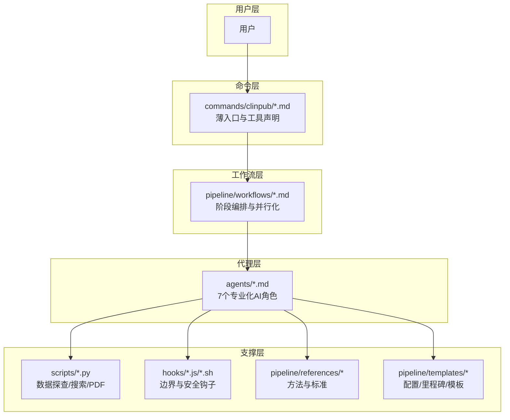
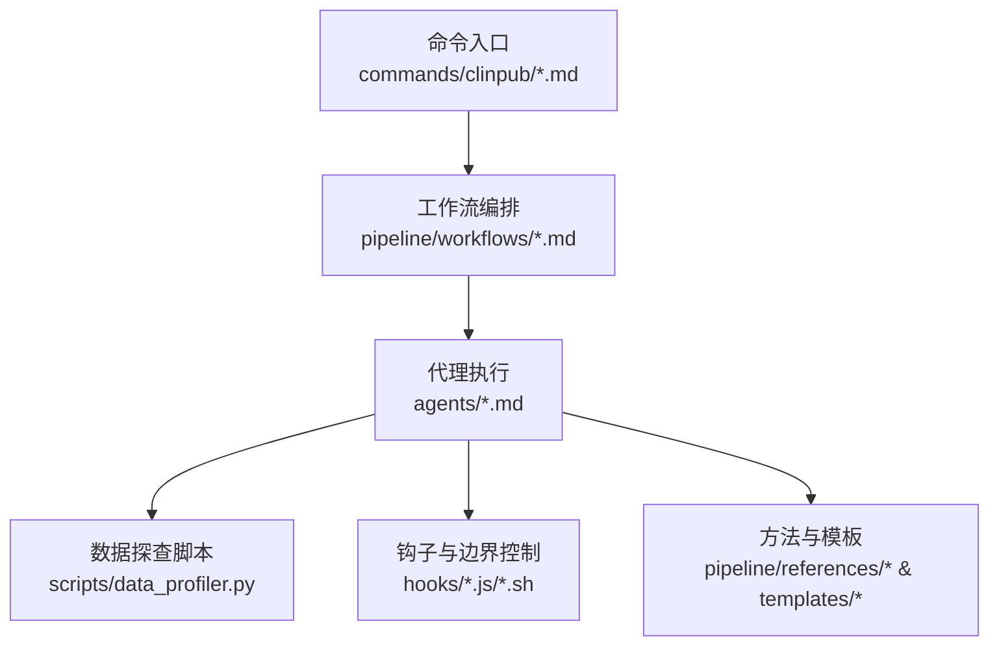
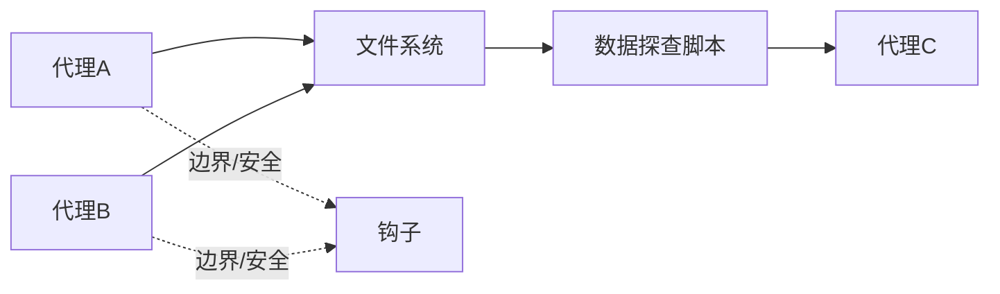

# 性能优化

<cite>
**本文引用的文件**
- [ARCHITECTURE.md](file://.clinpub/codebase/ARCHITECTURE.md)
- [CONVENTIONS.md](file://.clinpub/codebase/CONVENTIONS.md)
- [data_profiler.py](file://scripts/data_profiler.py)
- [data-prep.md](file://pipeline/workflows/data-prep.md)
- [data2idea.md](file://pipeline/workflows/data2idea.md)
- [topic-miner-agent.md](file://agents/topic-miner-agent.md)
- [DEVELOPMENT.md](file://docs/DEVELOPMENT.md)
- [TESTING.md](file://docs/TESTING.md)
- [config.json](file://.clinpub/config.json)
</cite>

## 目录
1. [引言](#引言)
2. [项目结构](#项目结构)
3. [核心组件](#核心组件)
4. [架构总览](#架构总览)
5. [详细组件分析](#详细组件分析)
6. [依赖分析](#依赖分析)
7. [性能考量](#性能考量)
8. [故障排查指南](#故障排查指南)
9. [结论](#结论)
10. [附录](#附录)

## 引言
本指南面向 clinpub 项目，聚焦于 R 语言与 Python 在科学分析中的性能优化实践，涵盖以下主题：
- R：data.table 替代 data.frame、并行处理、内存管理与性能监控
- Python：chunking 处理大文件、multiprocessing 多进程、内存优化策略
- 大数据集处理最佳实践与性能监控方法
- 提供优化前后性能对比的示例路径指引

本指南同时结合项目现有工作流与工具链，给出可落地的改进建议与可视化流程。

## 项目结构
clinpub 采用“命令层-工作流层-代理层-支撑层”的分层架构，配合脚本与钩子实现端到端的数据准备、分析与写作流程。该结构天然有利于并行化与性能扩展。

**图示来源**
- [.clinpub/codebase/ARCHITECTURE.md:6-54](file://.clinpub/codebase/ARCHITECTURE.md#L6-L54)

**章节来源**
- [.clinpub/codebase/ARCHITECTURE.md:6-54](file://.clinpub/codebase/ARCHITECTURE.md#L6-L54)

## 核心组件
- 数据探查与预处理：通过 data_profiler.py 对输入数据进行采样规模、缺失率、类型分布等快速画像，指导后续清洗与建模策略。
- 并行化执行：工作流与代理层强调“并行”能力，如文献检索并行调度、任务工具并行派发。
- 内存与I/O：代理间通过文件系统传递数据，避免跨进程共享内存，降低内存峰值与锁竞争风险。

**章节来源**
- [data_profiler.py:312-352](file://scripts/data_profiler.py#L312-L352)
- [data-prep.md:57-184](file://pipeline/workflows/data-prep.md#L57-L184)
- [data2idea.md:53-99](file://pipeline/workflows/data2idea.md#L53-L99)
- [topic-miner-agent.md:70-125](file://agents/topic-miner-agent.md#L70-L125)

## 架构总览
下图展示从命令入口到代理执行、再到支撑脚本与钩子的整体调用关系，体现可并行化与可扩展的性能基础。

**图示来源**
- [.clinpub/codebase/ARCHITECTURE.md:6-54](file://.clinpub/codebase/ARCHITECTURE.md#L6-L54)
- [data2idea.md:53-99](file://pipeline/workflows/data2idea.md#L53-L99)
- [topic-miner-agent.md:70-125](file://agents/topic-miner-agent.md#L70-L125)

## 详细组件分析

### R 性能优化：data.table 替代 data.frame
- 适用场景：大规模数据筛选、分组聚合、连接操作
- 优化要点：
  - 使用 data.table 的“按址修改”与“分组就地更新”，减少复制开销
  - 通过索引列与紧凑列类型降低内存占用
  - 将字符串列转换为因子或整型编码，提升连接与分组效率
- 示例路径（优化前后对比）：
  - 优化前：使用 data.frame 的筛选与分组
  - 优化后：使用 data.table 的快速筛选与分组
  - 参考路径：[DEVELOPMENT.md:298-303](file://docs/DEVELOPMENT.md#L298-L303)

**章节来源**
- [DEVELOPMENT.md:298-303](file://docs/DEVELOPMENT.md#L298-L303)

### R 性能优化：并行处理
- 适用场景：重复性统计检验、交叉验证、Bootstrap
- 优化要点：
  - 使用 parallel 包的 mclapply 或 parLapply，结合可用核数
  - 将数据切分为互不重叠的子集，避免共享状态
  - 使用 snowfall 或 future.apply 提升可移植性与可观察性
- 示例路径（并行化流程）：
  - 参考路径：[DEVELOPMENT.md](file://docs/DEVELOPMENT.md#L303)

**章节来源**
- [DEVELOPMENT.md](file://docs/DEVELOPMENT.md#L303)

### R 性能优化：内存管理与性能监控
- 适用场景：长流程、多次迭代、大型矩阵运算
- 优化要点：
  - 使用 gc() 主动回收，避免隐式延迟回收导致峰值过高
  - 使用 memory.profile() 或 systemfit 的内存追踪辅助定位瓶颈
  - 控制对象生命周期，及时删除不再使用的中间变量
- 示例路径（内存与性能监控）：
  - 参考路径：[DEVELOPMENT.md:298-303](file://docs/DEVELOPMENT.md#L298-L303)

**章节来源**
- [DEVELOPMENT.md:298-303](file://docs/DEVELOPMENT.md#L298-L303)

### Python 性能优化：chunking 处理大文件
- 适用场景：超大 CSV/XLSX 文件的读取与预处理
- 优化要点：
  - 使用 pandas 的 chunksize 分块读取，逐块处理并写回
  - 在块内完成清洗与特征工程，减少全量内存驻留
  - 使用 dtype 指定与类别编码（category）降低内存占用
- 示例路径（chunking 与内存优化）：
  - 参考路径：[data_profiler.py](file://scripts/data_profiler.py#L206)

**章节来源**
- [data_profiler.py](file://scripts/data_profiler.py#L206)

### Python 性能优化：multiprocessing 多进程
- 适用场景：CPU 密集型任务（如统计检验、模型训练）
- 优化要点：
  - 使用 multiprocessing.Pool 对任务进行并行化
  - 将数据分片（chunk）分配给不同进程，避免共享状态
  - 使用队列或管道收集结果，避免全局变量带来的锁竞争
- 示例路径（并行化思路）：
  - 参考路径：[data2idea.md:53-99](file://pipeline/workflows/data2idea.md#L53-L99)

**章节来源**
- [data2idea.md:53-99](file://pipeline/workflows/data2idea.md#L53-L99)

### Python 性能优化：内存优化策略
- 适用场景：长时间运行的批处理与数据管线
- 优化要点：
  - 使用 pd.to_numeric(..., downcast='integer'|'float') 降低数值内存
  - 将高频字符串列转为 category 类型，显著降低内存
  - 及时释放大对象引用，触发垃圾回收
- 示例路径（内存优化）：
  - 参考路径：[data_profiler.py:312-352](file://scripts/data_profiler.py#L312-L352)

**章节来源**
- [data_profiler.py:312-352](file://scripts/data_profiler.py#L312-L352)

### 大数据集处理最佳实践
- 数据结构与类型
  - 优先使用紧凑类型（如 int32/float32、category）
  - 对时间序列与分组键使用整型编码
- I/O 与缓存
  - 使用 HDF5/Parquet 存储中间结果，加速二次读取
  - 采用分块写入，避免一次性加载
- 并行化与流水线
  - 将长流程拆分为多个阶段，利用文件系统作为“内存”传递介质
  - 在代理层与工作流层明确并行边界，避免资源争用

**章节来源**
- [data-prep.md:57-184](file://pipeline/workflows/data-prep.md#L57-L184)

### 性能监控方法
- R
  - 使用 system.time() 与 pryr::microbenchmark() 对关键路径进行基准测试
  - 使用 memory.profile() 识别内存热点
- Python
  - 使用 cProfile/timing 与 tracemalloc 追踪 CPU 与内存
  - 使用 psutil 获取进程级资源使用情况
- 通用
  - 以“分块大小/进程数”为自变量，绘制吞吐量与延迟曲线，确定最优配置

**章节来源**
- [DEVELOPMENT.md:298-303](file://docs/DEVELOPMENT.md#L298-L303)
- [data_profiler.py:312-352](file://scripts/data_profiler.py#L312-L352)

## 依赖分析
- 代理间通信：基于文件系统传递数据，避免跨进程共享内存，降低耦合与锁竞争
- 工作流并行：通过任务工具并行派发子任务，提升整体吞吐
- 脚本与钩子：数据探查脚本与安全钩子分别承担“性能前置评估”和“边界防护”

**图示来源**
- [data2idea.md:53-99](file://pipeline/workflows/data2idea.md#L53-L99)
- [topic-miner-agent.md:70-125](file://agents/topic-miner-agent.md#L70-L125)

**章节来源**
- [data2idea.md:53-99](file://pipeline/workflows/data2idea.md#L53-L99)
- [topic-miner-agent.md:70-125](file://agents/topic-miner-agent.md#L70-L125)

## 性能考量
- 并行化策略
  - R：使用 parallel/future 系列包，结合数据分片与无共享状态
  - Python：使用 multiprocessing，结合 chunking 与队列收集
- 内存与 I/O
  - 优先使用高效存储格式（Parquet/HDF5），减少磁盘与内存往返
  - 控制对象生命周期，及时释放中间结果
- 监控与回归
  - 建立性能基线（吞吐/延迟/内存峰值），在每次变更后回归测试
- 配置与开关
  - 当前配置中并行化开关为关闭状态，建议在具备足够核数与数据规模时开启

**章节来源**
- [.clinpub/config.json](file://.clinpub/config.json#L4)
- [CONVENTIONS.md:168-190](file://.clinpub/codebase/CONVENTIONS.md#L168-L190)

## 故障排查指南
- R 常见问题
  - 内存不足：主动触发 gc()，检查是否存在不必要的复制；使用 data.table 替代 data.frame
  - 并行卡顿：检查任务粒度是否过小，避免过度并行；确认集群后端可用
- Python 常见问题
  - OOM：启用 chunking，使用 dtype/categorical 降内存；及时 del 大对象
  - I/O 瓶颈：改用 Parquet/HDF5；批量写入
- 通用排查
  - 使用性能剖析工具定位热点；记录基线后再引入新优化

**章节来源**
- [TESTING.md:352-371](file://docs/TESTING.md#L352-L371)
- [DEVELOPMENT.md:298-303](file://docs/DEVELOPMENT.md#L298-L303)
- [data_profiler.py:312-352](file://scripts/data_profiler.py#L312-L352)

## 结论
- R 侧建议优先采用 data.table、并行处理与主动内存管理，结合性能监控建立回归基线
- Python 侧建议以 chunking 与 multiprocessing 为核心，配合 dtype/categorical 降内存
- 依托项目现有的并行化工作流与代理架构，可在不改变整体流程的前提下显著提升吞吐与稳定性

## 附录
- 优化前后对比示例路径（请在对应文件中查看）
  - R：data.table 替代 data.frame 与并行处理示例路径
    - [DEVELOPMENT.md:298-303](file://docs/DEVELOPMENT.md#L298-L303)
  - Python：chunking 与内存优化示例路径
    - [data_profiler.py](file://scripts/data_profiler.py#L206)
    - [data_profiler.py:312-352](file://scripts/data_profiler.py#L312-L352)