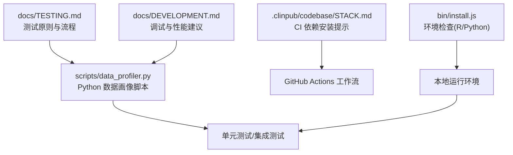
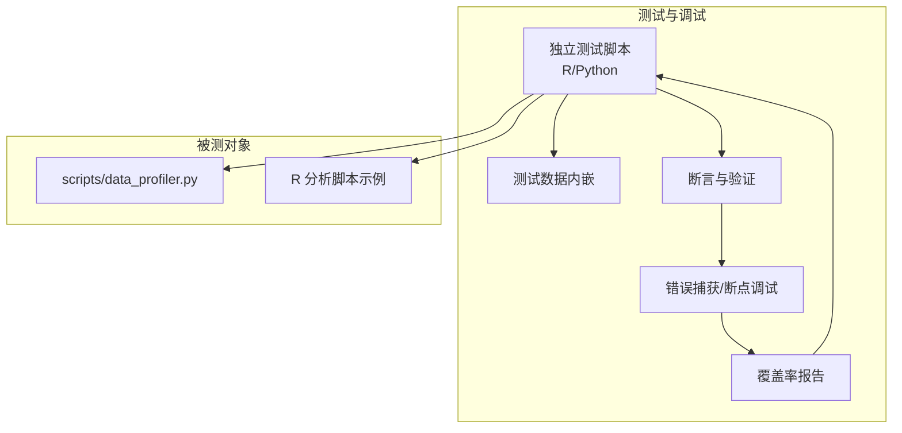
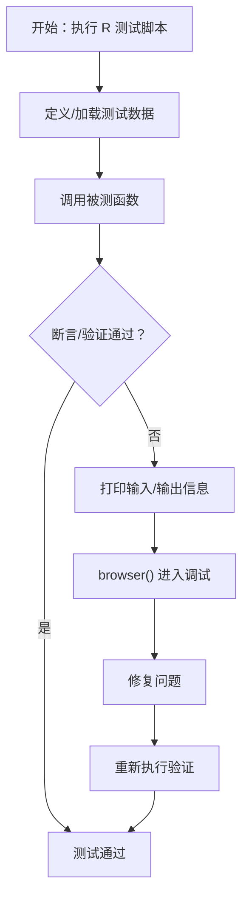
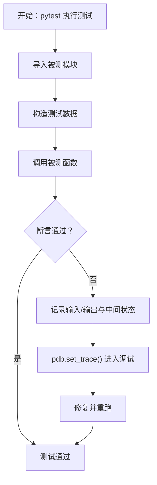
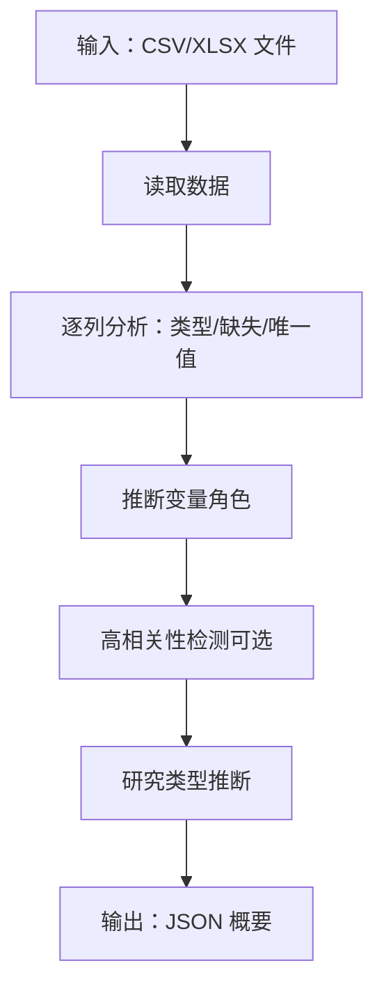
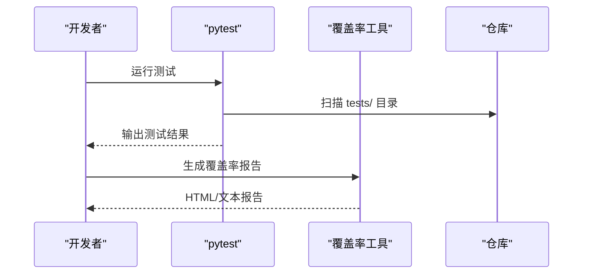
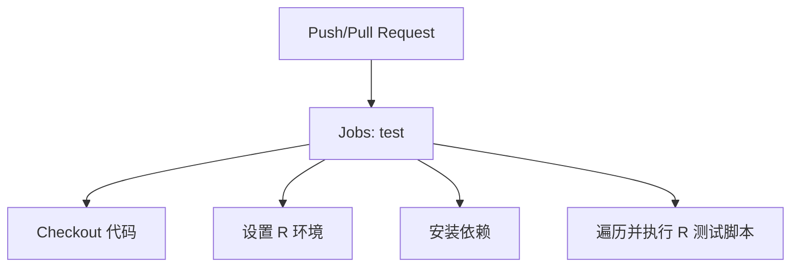
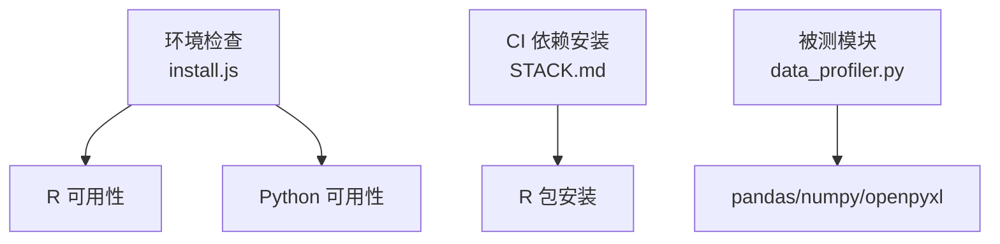
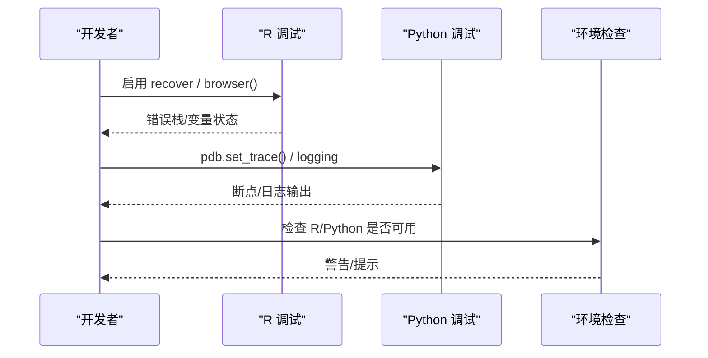

# 测试与调试

<cite>
**本文引用的文件**
- [docs/TESTING.md](file://docs/TESTING.md)
- [docs/DEVELOPMENT.md](file://docs/DEVELOPMENT.md)
- [scripts/data_profiler.py](file://scripts/data_profiler.py)
- [.clinpub/codebase/STACK.md](file://.clinpub/codebase/STACK.md)
- [bin/install.js](file://bin/install.js)
</cite>

## 目录
1. [简介](#简介)
2. [项目结构](#项目结构)
3. [核心组件](#核心组件)
4. [架构总览](#架构总览)
5. [详细组件分析](#详细组件分析)
6. [依赖分析](#依赖分析)
7. [性能考虑](#性能考虑)
8. [故障排查指南](#故障排查指南)
9. [结论](#结论)
10. [附录](#附录)

## 简介
本指南面向 clinpub 项目，系统阐述测试与调试方法论与实操步骤，重点围绕以下原则展开：
- 脚本独立运行：每个测试脚本自包含，可脱离外部环境直接执行
- 测试数据内嵌：测试所需数据在脚本内部定义，避免外部依赖
- 无外部依赖：测试不依赖全局状态或外部资源，确保可重复性与可移植性

同时提供 R 与 Python 的测试脚本示例与调试技巧，覆盖单元测试、集成测试与端到端测试，并补充性能测试与内存泄漏检测建议。

## 项目结构
从测试与调试视角，项目的关键目录与文件如下：
- docs/TESTING.md：测试原则、类型、运行方式、覆盖率与持续集成示例
- docs/DEVELOPMENT.md：开发与调试实践，含 R 与 Python 的调试方法
- scripts/data_profiler.py：Python 数据画像脚本，可作为单元测试与集成测试对象
- .clinpub/codebase/STACK.md：技术栈与依赖现状说明（含 CI 依赖安装提示）
- bin/install.js：环境检查与依赖探测（R、Python）

图表来源
- [docs/TESTING.md:1-373](file://docs/TESTING.md#L1-L373)
- [docs/DEVELOPMENT.md:211-320](file://docs/DEVELOPMENT.md#L211-L320)
- [scripts/data_profiler.py:1-353](file://scripts/data_profiler.py#L1-L353)
- [bin/install.js:251-286](file://bin/install.js#L251-L286)

章节来源
- [docs/TESTING.md:1-373](file://docs/TESTING.md#L1-L373)
- [docs/DEVELOPMENT.md:211-320](file://docs/DEVELOPMENT.md#L211-L320)
- [scripts/data_profiler.py:1-353](file://scripts/data_profiler.py#L1-L353)
- [bin/install.js:251-286](file://bin/install.js#L251-L286)

## 核心组件
- 测试原则与类型
  - 独立性：测试脚本自包含、自配置、自验证
  - 类型：单元测试（单函数/模块）、集成测试（多模块协作）、端到端测试（完整工作流）
- 测试数据管理
  - 内嵌数据、最小化、代表性、可重复（固定随机种子）
- 测试运行与覆盖率
  - R：Rscript 批量执行
  - Python：pytest 批量执行与覆盖率报告
- 持续集成
  - GitHub Actions 示例与依赖安装步骤
- 调试与性能
  - R：recover 错误捕获、browser() 断点调试
  - Python：pdb 断点调试、logging 日志配置
  - 性能优化：chunking、并行、数据结构选择

章节来源
- [docs/TESTING.md:3-13](file://docs/TESTING.md#L3-L13)
- [docs/TESTING.md:13-168](file://docs/TESTING.md#L13-L168)
- [docs/TESTING.md:170-271](file://docs/TESTING.md#L170-L271)
- [docs/TESTING.md:272-301](file://docs/TESTING.md#L272-L301)
- [docs/DEVELOPMENT.md:270-319](file://docs/DEVELOPMENT.md#L270-L319)

## 架构总览
下图展示测试与调试在项目中的位置与交互：

图表来源
- [docs/TESTING.md:13-168](file://docs/TESTING.md#L13-L168)
- [docs/DEVELOPMENT.md:270-319](file://docs/DEVELOPMENT.md#L270-L319)
- [scripts/data_profiler.py:1-353](file://scripts/data_profiler.py#L1-L353)

## 详细组件分析

### R 测试与调试
- 独立运行：使用 Rscript 直接执行测试脚本
- 内嵌数据：在脚本内构造测试数据集，固定随机种子保证可重复
- 边界条件：空数据、单行数据、全部缺失等场景
- 集成测试：串联多个模块（如数据清洗、基线表、回归分析）
- 端到端测试：基于临时目录与配置文件驱动完整工作流
- 调试技巧：
  - 启用 recover 捕获错误栈
  - 使用 browser() 进入交互式调试
  - 在关键节点打印输入/输出规模与中间结果

图表来源
- [docs/TESTING.md:19-168](file://docs/TESTING.md#L19-L168)
- [docs/DEVELOPMENT.md:272-281](file://docs/DEVELOPMENT.md#L272-L281)

章节来源
- [docs/TESTING.md:19-168](file://docs/TESTING.md#L19-L168)
- [docs/DEVELOPMENT.md:272-281](file://docs/DEVELOPMENT.md#L272-L281)

### Python 测试与调试
- 独立运行：使用 python -m pytest 执行测试目录
- 内嵌数据：在测试脚本内定义最小化测试数据
- 边界条件：空数据框、单行、缺失值等
- 集成测试：组合数据画像、异常值检测等子功能
- 调试技巧：
  - 使用 pdb.set_trace() 设置断点
  - 使用 logging 配置输出详细日志
  - 通过 pytest 参数查看更详细的失败信息

图表来源
- [docs/TESTING.md:56-94](file://docs/TESTING.md#L56-L94)
- [docs/DEVELOPMENT.md:283-292](file://docs/DEVELOPMENT.md#L283-L292)

章节来源
- [docs/TESTING.md:56-94](file://docs/TESTING.md#L56-L94)
- [docs/DEVELOPMENT.md:283-292](file://docs/DEVELOPMENT.md#L283-L292)

### Python 数据画像脚本（单元测试对象）
该脚本提供变量角色识别、研究类型推断、数据画像统计等功能，是单元测试与集成测试的理想对象。

图表来源
- [scripts/data_profiler.py:201-325](file://scripts/data_profiler.py#L201-L325)

章节来源
- [scripts/data_profiler.py:1-353](file://scripts/data_profiler.py#L1-L353)

### 测试运行与覆盖率
- R：Rscript tests/test_*.R 批量执行；covr 报告包覆盖率
- Python：pytest tests/；--cov=scripts --cov-report=html 生成覆盖率报告

图表来源
- [docs/TESTING.md:223-246](file://docs/TESTING.md#L223-L246)
- [docs/TESTING.md:258-270](file://docs/TESTING.md#L258-L270)

章节来源
- [docs/TESTING.md:223-246](file://docs/TESTING.md#L223-L246)
- [docs/TESTING.md:258-270](file://docs/TESTING.md#L258-L270)

### 持续集成（CI）
- GitHub Actions 示例：设置 R 环境、安装依赖、批量执行 R 测试
- 注意：当前仓库未包含 CI 测试工作流，仅发布工作流

图表来源
- [docs/TESTING.md:274-300](file://docs/TESTING.md#L274-L300)

章节来源
- [docs/TESTING.md:274-300](file://docs/TESTING.md#L274-L300)

## 依赖分析
- 环境依赖
  - R：通过 PATH 检测，未安装会触发警告
  - Python：通过 where/which 检测，未安装会触发警告
- CI 依赖安装
  - GitHub Actions 中通过 Rscript 安装 R 包，注意未使用锁定文件可能导致本地与 CI 差异
- 被测对象依赖
  - scripts/data_profiler.py 依赖 pandas、numpy、openpyxl

图表来源
- [bin/install.js:266-286](file://bin/install.js#L266-L286)
- [.clinpub/codebase/STACK.md:120-125](file://.clinpub/codebase/STACK.md#L120-L125)
- [scripts/data_profiler.py:19-24](file://scripts/data_profiler.py#L19-L24)

章节来源
- [bin/install.js:266-286](file://bin/install.js#L266-L286)
- [.clinpub/codebase/STACK.md:120-125](file://.clinpub/codebase/STACK.md#L120-L125)
- [scripts/data_profiler.py:19-24](file://scripts/data_profiler.py#L19-L24)

## 性能考虑
- R 性能优化建议
  - 使用 data.table 替代 data.frame 处理大表
  - 并行处理：mclapply 等
- Python 性能优化建议
  - 大文件分块读取：pd.read_csv(..., chunksize=...)
  - 多进程并行：multiprocessing.Pool
- 性能测试与内存泄漏检测
  - R：profvis、microbenchmark
  - Python：cProfile、memory_profiler、tracemalloc
  - 建议在 CI 中添加性能回归检查（如阈值报警）

章节来源
- [docs/DEVELOPMENT.md:296-319](file://docs/DEVELOPMENT.md#L296-L319)

## 故障排查指南
- R 调试
  - 启用 recover 捕获错误栈，定位异常发生点
  - 使用 browser() 进入交互式调试，检查变量状态
  - 在关键节点打印输入/输出规模与中间结果，辅助定位问题
- Python 调试
  - 使用 pdb.set_trace() 设置断点，逐步执行
  - 配置 logging，调整级别输出详细日志
  - 利用 pytest 的 -v、-s 参数增强输出
- 环境问题
  - R/Python 未安装：参考 install.js 的环境检查输出
  - CI 依赖差异：参考 STACK.md 中关于未使用锁定文件的说明

图表来源
- [docs/DEVELOPMENT.md:272-292](file://docs/DEVELOPMENT.md#L272-L292)
- [bin/install.js:266-286](file://bin/install.js#L266-L286)

章节来源
- [docs/DEVELOPMENT.md:272-292](file://docs/DEVELOPMENT.md#L272-L292)
- [bin/install.js:266-286](file://bin/install.js#L266-L286)

## 结论
本指南提供了 clinpub 项目的测试与调试方法论与实操路径，强调“独立运行、内嵌数据、无外部依赖”的原则，并结合 R 与 Python 的具体示例与调试技巧，覆盖单元、集成与端到端测试。配合覆盖率与 CI 建议，可有效提升代码质量与可维护性。建议在后续迭代中完善 CI 测试工作流与覆盖率目标，以实现持续的质量保障。

## 附录
- 测试脚本示例路径
  - R 单元测试示例：[docs/TESTING.md:21-54](file://docs/TESTING.md#L21-L54)
  - Python 单元测试示例：[docs/TESTING.md:58-94](file://docs/TESTING.md#L58-L94)
  - R 集成测试示例：[docs/TESTING.md:100-131](file://docs/TESTING.md#L100-L131)
  - R 端到端测试示例：[docs/TESTING.md:137-168](file://docs/TESTING.md#L137-L168)
- 测试运行与覆盖率
  - R 运行命令：[docs/TESTING.md:225-233](file://docs/TESTING.md#L225-L233)
  - Python 运行命令：[docs/TESTING.md:237-246](file://docs/TESTING.md#L237-L246)
  - R 覆盖率：[docs/TESTING.md:258-263](file://docs/TESTING.md#L258-L263)
  - Python 覆盖率：[docs/TESTING.md:265-270](file://docs/TESTING.md#L265-L270)
- 调试与性能
  - R 调试：[docs/DEVELOPMENT.md:272-281](file://docs/DEVELOPMENT.md#L272-L281)
  - Python 调试：[docs/DEVELOPMENT.md:283-292](file://docs/DEVELOPMENT.md#L283-L292)
  - 性能优化：[docs/DEVELOPMENT.md:296-319](file://docs/DEVELOPMENT.md#L296-L319)