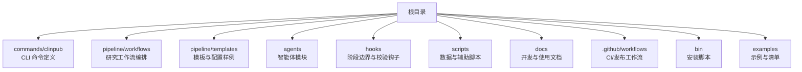
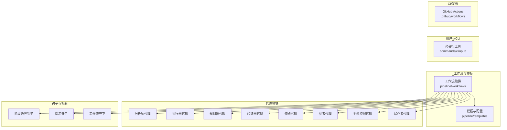
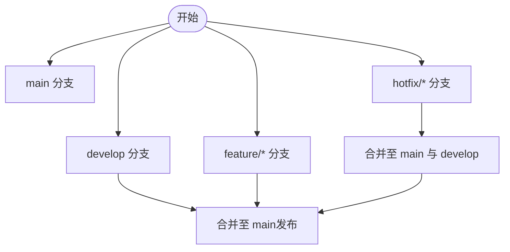
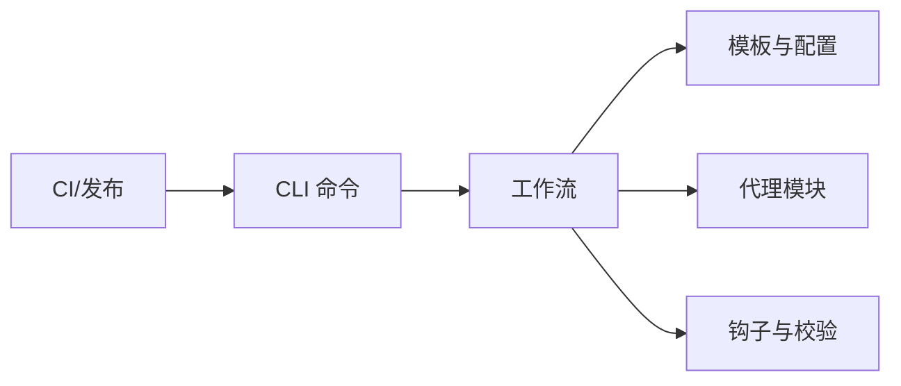

# 贡献指南

<cite>
**本文引用的文件**
- [README.md](file://README.md)
- [.gitignore](file://.gitignore)
- [.npmignore](file://.npmignore)
- [package.json](file://package.json)
- [INSTALL.md](file://INSTALL.md)
- [.github/workflows/release.yml](file://.github/workflows/release.yml)
- [docs/DEVELOPMENT.md](file://docs/DEVELOPMENT.md)
- [docs/TESTING.md](file://docs/TESTING.md)
- [docs/CONFIGURATION.md](file://docs/CONFIGURATION.md)
- [commands/clinpub/clinpub.md](file://commands/clinpub/clinpub.md)
- [pipeline/workflows/init-project.md](file://pipeline/workflows/init-project.md)
- [pipeline/templates/project_config.yml](file://pipeline/templates/project_config.yml)
- [requirements.txt](file://requirements.txt)
</cite>

## 目录
1. [简介](#简介)
2. [项目结构](#项目结构)
3. [核心组件](#核心组件)
4. [架构总览](#架构总览)
5. [详细组件分析](#详细组件分析)
6. [依赖关系分析](#依赖关系分析)
7. [性能考虑](#性能考虑)
8. [故障排除指南](#故障排除指南)
9. [结论](#结论)
10. [附录](#附录)

## 简介
本贡献指南面向希望参与 clinpub 项目的开发者与研究者，旨在统一协作流程、提升代码质量与可维护性。clinpub 是一个围绕科学文献处理与研究工作流的系统，涵盖命令行工具、工作流编排、代理模块与文档体系。贡献者可通过本指南了解：
- Git 提交规范与分支策略
- 代码审查流程、Pull Request 规范与合并要求
- 社区参与方式、问题报告与功能请求流程
- 文档与翻译贡献的具体要求

## 项目结构
clinpub 采用多模块组织方式：命令行入口、工作流与模板、代理模块、脚本与配置等。以下图示化展示主要模块及其职责：

图表来源
- [commands/clinpub/clinpub.md](file://commands/clinpub/clinpub.md)
- [pipeline/workflows/init-project.md](file://pipeline/workflows/init-project.md)
- [docs/DEVELOPMENT.md](file://docs/DEVELOPMENT.md)

章节来源
- [README.md](file://README.md)
- [package.json](file://package.json)

## 核心组件
- 命令行工具层：通过 CLI 定义项目初始化、分析、写作、里程碑管理等操作，便于用户快速上手与自动化执行。
- 工作流与模板层：提供标准化的研究工作流与模板，确保项目在不同阶段的一致性与可复现性。
- 代理模块层：包含分析、规划、执行、验证、修改、参考与主题挖掘等智能体，支撑端到端的自动化研究流程。
- 钩子与校验层：在关键阶段设置边界与守卫，保障流程安全与质量。
- 文档与配置层：提供开发、测试、配置与使用文档，以及项目配置样例。

章节来源
- [commands/clinpub/clinpub.md](file://commands/clinpub/clinpub.md)
- [pipeline/workflows/init-project.md](file://pipeline/workflows/init-project.md)
- [agents/analyst-agent.md](file://agents/analyst-agent.md)
- [agents/clinpub-executor.md](file://agents/clinpub-executor.md)
- [agents/clinpub-planner.md](file://agents/clinpub-planner.md)
- [agents/clinpub-verifier.md](file://agents/clinpub-verifier.md)
- [agents/modify-agent.md](file://agents/modify-agent.md)
- [agents/reference-agent.md](file://agents/reference-agent.md)
- [agents/topic-miner-agent.md](file://agents/topic-miner-agent.md)
- [agents/writer-agent.md](file://agents/writer-agent.md)
- [hooks/clinpub-phase-boundary.sh](file://hooks/clinpub-phase-boundary.sh)
- [hooks/clinpub-prompt-guard.js](file://hooks/clinpub-prompt-guard.js)
- [hooks/clinpub-workflow-guard.js](file://hooks/clinpub-workflow-guard.js)
- [docs/DEVELOPMENT.md](file://docs/DEVELOPMENT.md)
- [docs/TESTING.md](file://docs/TESTING.md)
- [docs/CONFIGURATION.md](file://docs/CONFIGURATION.md)

## 架构总览
下图展示了从 CLI 到工作流、模板与代理模块的整体交互关系，以及 CI 发布流程：

图表来源
- [commands/clinpub/clinpub.md](file://commands/clinpub/clinpub.md)
- [pipeline/workflows/init-project.md](file://pipeline/workflows/init-project.md)
- [pipeline/templates/project_config.yml](file://pipeline/templates/project_config.yml)
- [agents/analyst-agent.md](file://agents/analyst-agent.md)
- [agents/clinpub-executor.md](file://agents/clinpub-executor.md)
- [agents/clinpub-planner.md](file://agents/clinpub-planner.md)
- [agents/clinpub-verifier.md](file://agents/clinpub-verifier.md)
- [agents/modify-agent.md](file://agents/modify-agent.md)
- [agents/reference-agent.md](file://agents/reference-agent.md)
- [agents/topic-miner-agent.md](file://agents/topic-miner-agent.md)
- [agents/writer-agent.md](file://agents/writer-agent.md)
- [.github/workflows/release.yml](file://.github/workflows/release.yml)

## 详细组件分析

### Git 提交规范
为保证提交历史清晰、便于自动化处理与版本发布，建议遵循以下约定：
- 类型限定为以下之一：feat、fix、docs、style、refactor、test、chore
- 每次提交聚焦单一变更，避免“大杂烩”
- 提交信息结构：type(scope): subject；如 feat(cli): 新增初始化命令
- 当变更涉及破坏性改动时，在正文明确标注，并在 footer 引用相关 issue

提交类型说明
- feat：新增功能或特性
- fix：修复缺陷或错误
- docs：仅更新文档（如 README、开发文档）
- style：不影响逻辑的格式调整（空格、缩进、分号等）
- refactor：重构但不改变行为
- test：新增或调整测试
- chore：构建过程或辅助工具的变动（如脚本、CI）

示例路径
- [commands/clinpub/clinpub.md](file://commands/clinpub/clinpub.md)
- [docs/DEVELOPMENT.md](file://docs/DEVELOPMENT.md)

章节来源
- [docs/DEVELOPMENT.md](file://docs/DEVELOPMENT.md)

### 分支策略
- main：主分支，保持稳定，用于发布与归档
- develop：开发分支，集成通过审查的功能
- feature/*：功能开发分支，基于 develop 创建，完成后合并回 develop
- hotfix/*：紧急修复分支，基于 main 创建，修复后同时合并至 main 与 develop

图表来源
- [docs/DEVELOPMENT.md](file://docs/DEVELOPMENT.md)

章节来源
- [docs/DEVELOPMENT.md](file://docs/DEVELOPMENT.md)

### 代码审查流程
- 提交 PR 前：本地完成单元测试与集成测试，确保文档同步更新
- PR 描述：清晰描述变更目的、范围与影响；关联相关 issue
- 审查要点：代码可读性、测试覆盖率、性能与安全性、对现有功能的影响
- 合并要求：至少一名维护者批准；所有 CI 任务通过；无未解决的评论

章节来源
- [docs/TESTING.md](file://docs/TESTING.md)
- [docs/DEVELOPMENT.md](file://docs/DEVELOPMENT.md)

### Pull Request 规范与合并要求
- PR 标题：遵循提交规范的 type(scope): subject 格式
- 描述模板：变更动机、实现方式、测试方法、兼容性与迁移说明
- 关联 issue：在 PR 描述中引用相关 issue
- 合并前：确保分支与上游同步，清理不必要的提交历史

章节来源
- [docs/DEVELOPMENT.md](file://docs/DEVELOPMENT.md)

### 社区参与方式
- 问题报告：使用问题模板，提供环境信息、复现步骤与期望结果
- 功能请求：描述场景、目标与验收标准，讨论可行性与优先级
- 讨论与反馈：通过 GitHub Discussions 或 Issue 进行交流

章节来源
- [README.md](file://README.md)

### 文档贡献与翻译贡献
- 文档贡献：更新对应 Markdown 文件，补充示例与最佳实践；确保与 CLI、工作流与模板保持一致
- 翻译贡献：在 docs 目录下新增语言版本，保持与英文版结构一致；同步更新导航与链接
- 版本一致性：重要变更需在 CHANGELOG 或发布说明中体现

章节来源
- [docs/DEVELOPMENT.md](file://docs/DEVELOPMENT.md)
- [docs/CONFIGURATION.md](file://docs/CONFIGURATION.md)

## 依赖关系分析
- CLI 依赖工作流与模板，以提供一致的项目生命周期体验
- 工作流依赖代理模块与钩子，确保流程可控与质量保障
- CI 依赖发布工作流，自动化完成打包与发布

图表来源
- [commands/clinpub/clinpub.md](file://commands/clinpub/clinpub.md)
- [pipeline/workflows/init-project.md](file://pipeline/workflows/init-project.md)
- [.github/workflows/release.yml](file://.github/workflows/release.yml)

章节来源
- [commands/clinpub/clinpub.md](file://commands/clinpub/clinpub.md)
- [pipeline/workflows/init-project.md](file://pipeline/workflows/init-project.md)
- [.github/workflows/release.yml](file://.github/workflows/release.yml)

## 性能考虑
- 优化数据处理与 I/O：减少重复计算与冗余文件生成
- 并行化与缓存：利用工作流与钩子机制提升执行效率
- 测试覆盖：通过测试驱动改进性能与稳定性

## 故障排除指南
- 安装与运行：参考安装文档与 CLI 使用说明，确认环境变量与依赖版本
- 工作流异常：检查钩子与守卫日志，定位阶段边界问题
- 文档不一致：核对模板与配置样例，确保与最新版本匹配

章节来源
- [INSTALL.md](file://INSTALL.md)
- [commands/clinpub/clinpub.md](file://commands/clinpub/clinpub.md)
- [hooks/clinpub-phase-boundary.sh](file://hooks/clinpub-phase-boundary.sh)
- [hooks/clinpub-prompt-guard.js](file://hooks/clinpub-prompt-guard.js)
- [hooks/clinpub-workflow-guard.js](file://hooks/clinpub-workflow-guard.js)
- [pipeline/templates/project_config.yml](file://pipeline/templates/project_config.yml)

## 结论
通过统一的提交规范、分支策略与审查流程，clinpub 项目能够持续产出高质量的代码与文档。建议贡献者在提交前充分阅读相关文档，严格遵循流程，积极反馈与协作，共同推动项目演进。

## 附录
- 快速开始：参考安装与入门文档，熟悉 CLI 与工作流
- 开发环境：根据 package.json 与 requirements.txt 准备依赖
- 发布流程：关注 CI 工作流，确保构建与发布顺利

章节来源
- [INSTALL.md](file://INSTALL.md)
- [README.md](file://README.md)
- [package.json](file://package.json)
- [requirements.txt](file://requirements.txt)
- [.github/workflows/release.yml](file://.github/workflows/release.yml)