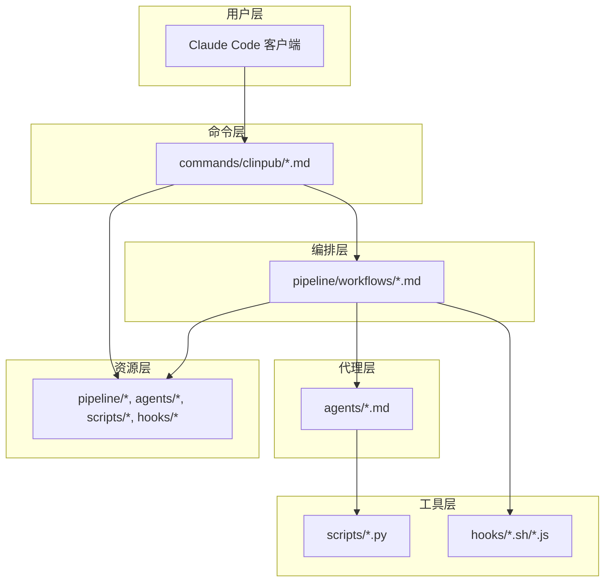
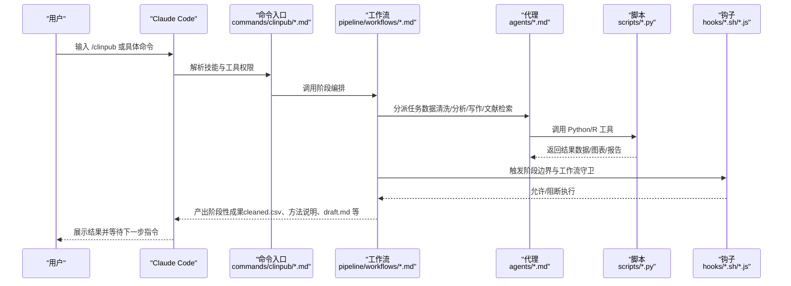
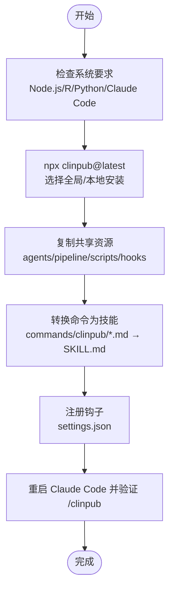
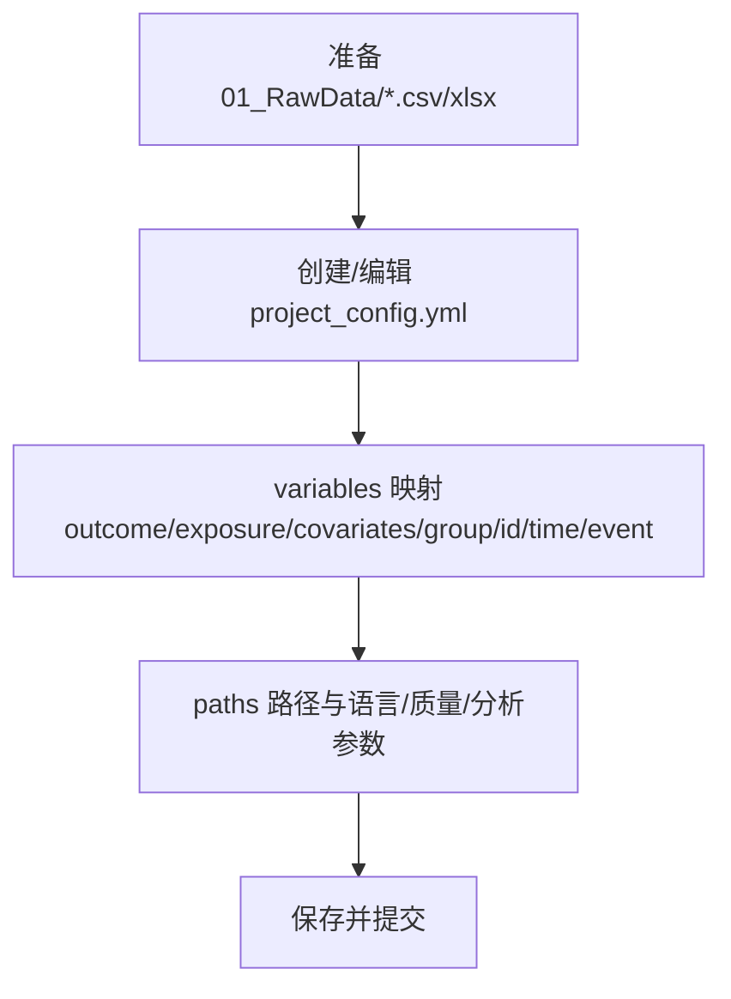
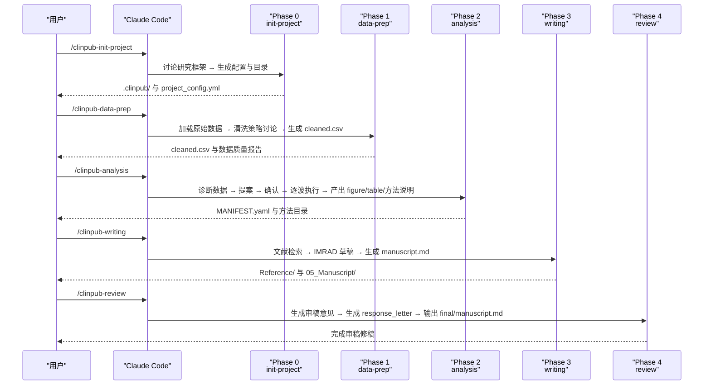
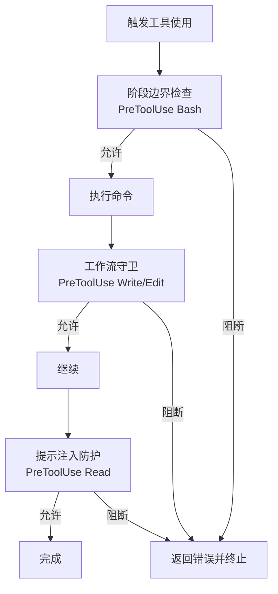
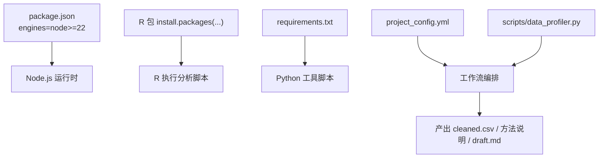

# 快速开始

<cite>
**本文引用的文件**
- [README.md](file://README.md)
- [INSTALL.md](file://INSTALL.md)
- [docs/getting-started.md](file://docs/getting-started.md)
- [package.json](file://package.json)
- [bin/install.js](file://bin/install.js)
- [requirements.txt](file://requirements.txt)
- [CLAUDE.md](file://CLAUDE.md)
- [commands/clinpub/init-project.md](file://commands/clinpub/init-project.md)
- [pipeline/workflows/init-project.md](file://pipeline/workflows/init-project.md)
- [pipeline/workflows/data-prep.md](file://pipeline/workflows/data-prep.md)
- [pipeline/workflows/analysis.md](file://pipeline/workflows/analysis.md)
- [hooks/clinpub-phase-boundary.sh](file://hooks/clinpub-phase-boundary.sh)
- [examples/project_config.example.yml](file://examples/project_config.example.yml)
- [pipeline/templates/project_config.yml](file://pipeline/templates/project_config.yml)
- [scripts/data_profiler.py](file://scripts/data_profiler.py)
</cite>

## 目录
1. [简介](#简介)
2. [项目结构](#项目结构)
3. [核心组件](#核心组件)
4. [架构总览](#架构总览)
5. [详细组件解析](#详细组件解析)
6. [依赖关系分析](#依赖关系分析)
7. [性能与效率](#性能与效率)
8. [故障排除指南](#故障排除指南)
9. [结论](#结论)
10. [附录](#附录)

## 简介
本指南面向首次接触 clinpub 的用户，帮助你在约 30 分钟内完成从零到看到预期结果的全流程：安装、技能配置、环境准备、项目初始化、数据准备、统计分析、论文撰写与审稿修稿。文档严格基于仓库现有内容，确保每一步均可在本地复现。

## 项目结构
clinpub 采用“命令入口 → 工作流编排 → 代理协作 → 脚本工具 → 钩子保护”的分层架构。核心目录与职责如下：
- commands/clinpub：用户可见的命令入口（例如 init-project、data-prep、analysis、writing、review）
- pipeline/workflows：阶段化编排逻辑（Phase 0 至 Phase 4）
- agents：7 个专业 AI 代理的角色卡片
- scripts：Python 工具（数据画像、PDF 处理等）
- hooks：Claude Code 钩子（工作流边界、阶段守卫、提示注入防护）
- examples：示例数据与配置模板
- docs：教程与指南

**图表来源**
- [README.md: 20-45:20-45](file://README.md#L20-L45)
- [CLAUDE.md: 9-23:9-23](file://CLAUDE.md#L9-L23)

**章节来源**
- [README.md: 20-45:20-45](file://README.md#L20-L45)
- [CLAUDE.md: 9-23:9-23](file://CLAUDE.md#L9-L23)

## 核心组件
- 安装器与技能转换：将命令文件转换为 Claude Code 技能，并注册钩子
- 环境要求：Node.js >= 22.0.0、R >= 4.2、Python >= 3.9
- 依赖安装：R 包与 Python 包
- 钩子保护：阶段边界检查、工作流守卫、提示注入防护
- 项目配置：project_config.yml（研究设计、变量映射、路径、质量与分析参数）

**章节来源**
- [INSTALL.md: 58-90:58-90](file://INSTALL.md#L58-L90)
- [package.json: 15-17:15-17](file://package.json#L15-L17)
- [bin/install.js: 251-323:251-323](file://bin/install.js#L251-L323)
- [requirements.txt: 1-8:1-8](file://requirements.txt#L1-L8)

## 架构总览
下图展示从用户输入到产出的端到端流程，涵盖命令入口、工作流编排、代理协作与工具脚本。

**图表来源**
- [README.md: 47-58:47-58](file://README.md#L47-L58)
- [CLAUDE.md: 72-84:72-84](file://CLAUDE.md#L72-L84)
- [hooks/clinpub-phase-boundary.sh: 106-150:106-150](file://hooks/clinpub-phase-boundary.sh#L106-L150)

## 详细组件解析

### 环境与安装（3 分钟）
- 系统要求
  - Claude Code >= 2.1.88
  - Node.js >= 22.0.0
  - R >= 4.2
  - Python >= 3.9
- 安装方式
  - 一键安装：npx clinpub@latest
  - 交互式选择全局或本地安装
  - 非交互式：npx clinpub --global 或 --local
- 依赖安装
  - R 包：通过 INSTALL.md 中的 install.packages(...) 安装
  - Python 包：pip install -r requirements.txt
- 钩子注册
  - 安装器自动在 Claude Code settings.json 中注册三个钩子，用于阶段边界与工作流守卫

**图表来源**
- [INSTALL.md: 3-56:3-56](file://INSTALL.md#L3-L56)
- [bin/install.js: 325-398:325-398](file://bin/install.js#L325-L398)

**章节来源**
- [INSTALL.md: 3-56:3-56](file://INSTALL.md#L3-L56)
- [INSTALL.md: 58-90:58-90](file://INSTALL.md#L58-L90)
- [package.json: 15-17:15-17](file://package.json#L15-L17)
- [bin/install.js: 251-323:251-323](file://bin/install.js#L251-L323)

### 基础配置（5 分钟）
- 项目配置文件 project_config.yml
  - 参考示例：examples/project_config.example.yml
  - 模板结构：pipeline/templates/project_config.yml
  - 关键字段：project（名称、描述、设计、样本量、目标期刊、报告标准）、variables（结局、暴露、协变量、时间/事件变量、分组与标识符）、paths（原始数据、预处理、方法、输出、参考、手稿）、analysis_plan（动态生成）、language（手稿/图表/统计语言）、quality（期刊级别、DPI、格式、字体）、analysis（缺失率阈值、显著性水平、多重比较）
- 数据准备
  - 将你的 CSV/XLSX 放入 01_RawData/
  - 若已有项目，data-prep 会刷新变量画像、生成 spec 与同步 project_config.yml

**图表来源**
- [examples/project_config.example.yml: 8-68:8-68](file://examples/project_config.example.yml#L8-L68)
- [pipeline/templates/project_config.yml: 6-97:6-97](file://pipeline/templates/project_config.yml#L6-L97)
- [docs/getting-started.md: 49-56:49-56](file://docs/getting-started.md#L49-L56)

**章节来源**
- [examples/project_config.example.yml: 8-68:8-68](file://examples/project_config.example.yml#L8-L68)
- [pipeline/templates/project_config.yml: 6-97:6-97](file://pipeline/templates/project_config.yml#L6-L97)
- [docs/getting-started.md: 49-56:49-56](file://docs/getting-started.md#L49-L56)

### 第一个项目示例（20 分钟）
以下为从零到产出的完整演示流程（不含数据准备时间）：

1) 初始化项目（Phase 0）
- 命令：/clinpub-init-project
- 作用：与用户讨论研究框架（设计、变量、分析方法、目标期刊），生成 .clinpub/ 目录、PROJECT.md、ROADMAP.md、STATE.md、项目配置与目录骨架
- 成功标准：目录结构与配置生成，决策记录在 .clinpub/phases/00-init/00-CONTEXT.md

2) 数据准备（Phase 1）
- 命令：/clinpub-data-prep
- 作用：加载原始数据，诊断变量类型与缺失模式，讨论清洗策略（缺失率、异常值、衍生变量、分层），生成 cleaned.csv 与数据质量报告
- 成功标准：cleaned.csv 与 data_quality.html 生成，纵向数据可选过滤到分析时间点

3) 统计分析（Phase 2）
- 命令：/clinpub-analysis
- 作用：基于 cleaned.csv 动态诊断数据结构，提出分析方案（波次依赖图），与用户讨论确认后逐波执行，产出 figure + table + 方法说明（方法说明模板）
- 成功标准：MANIFEST.yaml 与各方法目录（03_AnalysisMethods、04_Outputs）生成

4) 论文撰写（Phase 3）
- 命令：/clinpub-writing
- 作用：Reference Agent 检索文献并生成引用清单；Writer Agent 按 IMRAD 顺序撰写 draft-methods/results/introduction/discussion/abstract，最终生成 manuscript.md
- 成功标准：Reference/ 与 05_Manuscript/ 下产出完整草稿

5) 审稿修稿（Phase 4）
- 命令：/clinpub-review
- 作用：Writer Agent 模拟审稿意见，用户选择处理要点，生成 response_letter.md，循环直至满意，输出 final/manuscript.md

**图表来源**
- [commands/clinpub/init-project.md: 14-34:14-34](file://commands/clinpub/init-project.md#L14-L34)
- [pipeline/workflows/init-project.md: 18-115:18-115](file://pipeline/workflows/init-project.md#L18-L115)
- [pipeline/workflows/data-prep.md: 17-173:17-173](file://pipeline/workflows/data-prep.md#L17-L173)
- [pipeline/workflows/analysis.md: 17-200:17-200](file://pipeline/workflows/analysis.md#L17-L200)
- [README.md: 96-111:96-111](file://README.md#L96-L111)

**章节来源**
- [commands/clinpub/init-project.md: 14-34:14-34](file://commands/clinpub/init-project.md#L14-L34)
- [pipeline/workflows/init-project.md: 18-115:18-115](file://pipeline/workflows/init-project.md#L18-L115)
- [pipeline/workflows/data-prep.md: 17-173:17-173](file://pipeline/workflows/data-prep.md#L17-L173)
- [pipeline/workflows/analysis.md: 17-200:17-200](file://pipeline/workflows/analysis.md#L17-L200)
- [README.md: 96-111:96-111](file://README.md#L96-L111)

### 钩子与质量门控（保障执行安全）
- 阶段边界检查（PreToolUse Bash）
  - 作用：在执行分析命令前检查前置里程碑是否完成，防止跨阶段写文件
  - 依据：.clinpub/STATE.md 与 .clinpub/phases/*/MILESTONE.md
- 工作流守卫（PreToolUse Write/Edit）
  - 作用：阻止越阶段写文件，确保阶段化流程
- 提示注入防护（PreToolUse Read）
  - 作用：扫描数据文件中的潜在注入风险
- 质量门控（Gates）
  - IRB/Ethics Gate（0→1）
  - Data Quality Gate（1→2）
  - Analysis Validity Gate（2→3）
  - Submission Gate（4→终稿）

**图表来源**
- [hooks/clinpub-phase-boundary.sh: 106-150:106-150](file://hooks/clinpub-phase-boundary.sh#L106-L150)
- [README.md: 131-140:131-140](file://README.md#L131-L140)

**章节来源**
- [hooks/clinpub-phase-boundary.sh: 106-150:106-150](file://hooks/clinpub-phase-boundary.sh#L106-L150)
- [README.md: 131-140:131-140](file://README.md#L131-L140)

## 依赖关系分析
- 环境与工具
  - Node.js：安装器与钩子执行（package.json engines）
  - R：统计分析与绘图（INSTALL.md R 包列表）
  - Python：数据画像与 PDF 处理（requirements.txt）
- 项目配置与模板
  - project_config.yml 作为全局配置，被工作流读取以驱动后续步骤
- 数据与脚本
  - scripts/data_profiler.py 用于变量角色推断与研究类型预判，支持 data-prep 阶段的变量画像与 spec 生成

**图表来源**
- [package.json: 15-17:15-17](file://package.json#L15-L17)
- [INSTALL.md: 67-83:67-83](file://INSTALL.md#L67-L83)
- [requirements.txt: 1-8:1-8](file://requirements.txt#L1-8)
- [scripts/data_profiler.py: 1-200:1-200](file://scripts/data_profiler.py#L1-L200)

**章节来源**
- [package.json: 15-17:15-17](file://package.json#L15-L17)
- [INSTALL.md: 67-83:67-83](file://INSTALL.md#L67-L83)
- [requirements.txt: 1-8:1-8](file://requirements.txt#L1-L8)
- [scripts/data_profiler.py: 1-200:1-200](file://scripts/data_profiler.py#L1-L200)

## 性能与效率
- 一次性安装：安装器将命令转换为技能并复制共享资源，避免每次运行重复下载
- 钩子保护：在命令执行前进行阶段边界与提示注入检查，减少无效执行与错误重试
- 动态分析方案：Phase 2 基于数据特征生成波次依赖图，避免固定模板带来的冗余计算
- 建议
  - 优先使用全局安装，便于跨项目复用
  - 在 Phase 1 明确缺失率与异常值处理策略，减少反复修改
  - 使用高质量数据（UTF-8 编码、统一变量命名）以降低清洗成本

[本节为通用建议，无需特定文件引用]

## 故障排除指南
- 技能未出现
  - 重启 Claude Code 以加载新技能
- R 包安装失败
  - 逐个安装 INSTALL.md 中列出的包，若为 Bioconductor 包，使用 BiocManager 安装
- Python 导入错误
  - 运行 pip install -r requirements.txt
- PubMed/Tavily 检索失败
  - 设置 NCBI_API_KEY 或 TAVILY_API_KEY 环境变量
- cleaned.csv 生成失败
  - 确认 01_RawData/ 下存在 CSV 文件，检查 project_config.yml 中 variables 映射与文件编码（UTF-8）
- 图表中文乱码
  - 在 R 中安装并启用中文字体（showtext）

**章节来源**
- [INSTALL.md: 105-115:105-115](file://INSTALL.md#L105-L115)
- [docs/getting-started.md: 225-260:225-260](file://docs/getting-started.md#L225-L260)

## 结论
通过本快速开始指南，你可以在 30 分钟内完成环境准备、技能安装、项目初始化与数据准备，并在统计分析与论文撰写阶段看到阶段性成果。建议在 Phase 1 明确变量与清洗策略，在 Phase 2 与用户共同确认分析方案，以获得高质量、可复现的出版级产出。

[本节为总结，无需特定文件引用]

## 附录

### 常用命令速查
- /clinpub：主入口，启动完整管线
- /clinpub-data2idea data.csv：不跑分析，先从数据挖掘选题
- /clinpub-init-project：初始化项目目录与配置
- /clinpub-data-prep：仅跑 Phase 1 数据清洗
- /clinpub-analysis：仅跑 Phase 2 统计分析
- /clinpub-writing：仅跑 Phase 3 论文撰写
- /clinpub-review：仅跑 Phase 4 审稿修稿
- /clinpub-milestone N：查看 Phase N 关卡状态

**章节来源**
- [README.md: 96-111:96-111](file://README.md#L96-L111)
- [docs/getting-started.md: 195-207:195-207](file://docs/getting-started.md#L195-L207)