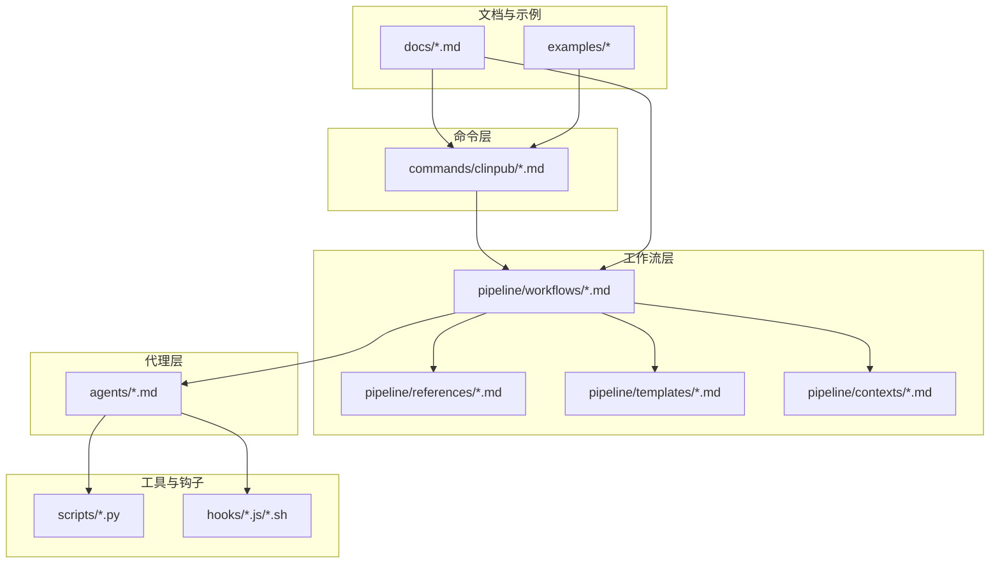
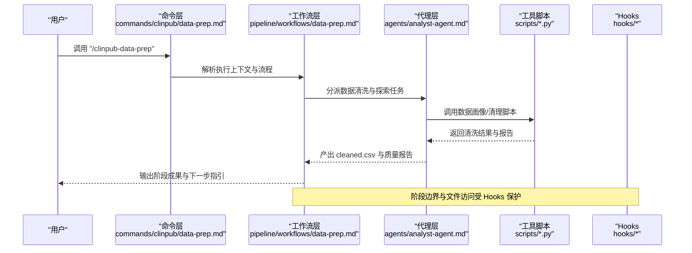
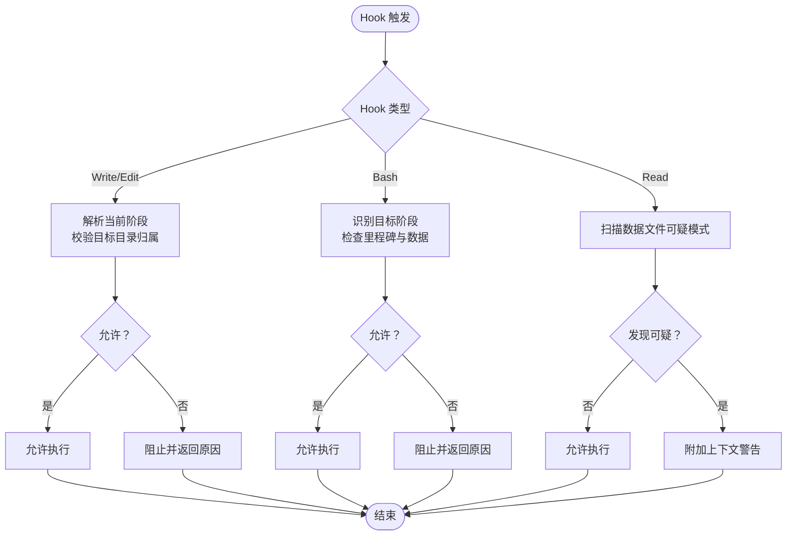
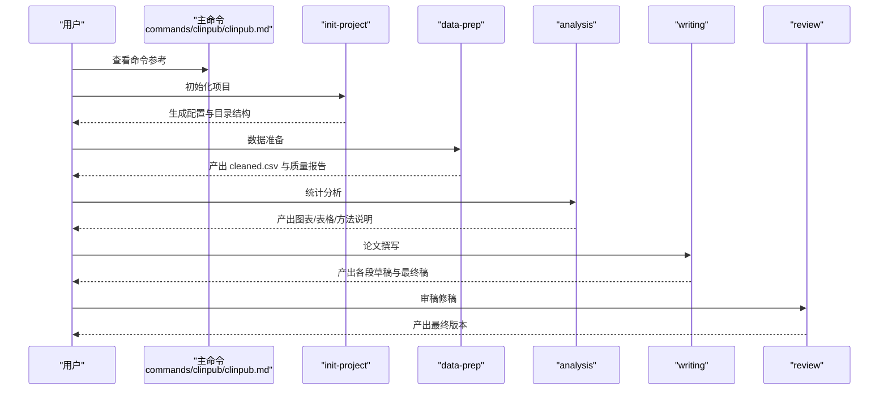
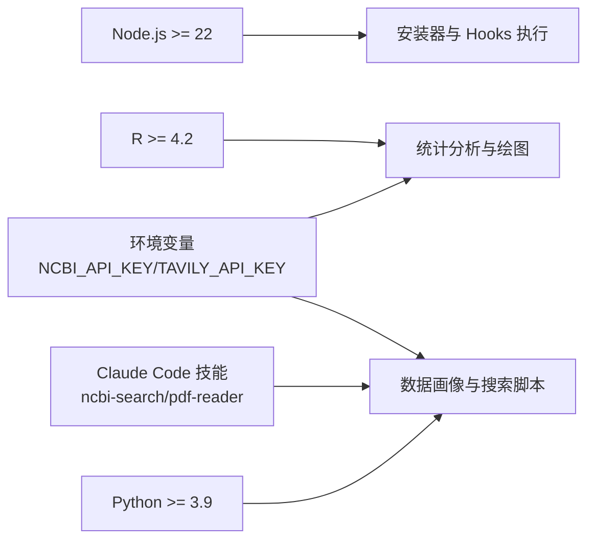

# 故障排除

<cite>
**本文引用的文件**
- [README.md](file://README.md)
- [INSTALL.md](file://INSTALL.md)
- [CLAUDE.md](file://CLAUDE.md)
- [docs/CONFIGURATION.md](file://docs/CONFIGURATION.md)
- [docs/ARCHITECTURE.md](file://docs/ARCHITECTURE.md)
- [package.json](file://package.json)
- [requirements.txt](file://requirements.txt)
- [hooks/clinpub-workflow-guard.js](file://hooks/clinpub-workflow-guard.js)
- [hooks/clinpub-phase-boundary.sh](file://hooks/clinpub-phase-boundary.sh)
- [hooks/clinpub-prompt-guard.js](file://hooks/clinpub-prompt-guard.js)
- [commands/clinpub/clinpub.md](file://commands/clinpub/clinpub.md)
- [commands/clinpub/init-project.md](file://commands/clinpub/init-project.md)
- [commands/clinpub/data-prep.md](file://commands/clinpub/data-prep.md)
- [commands/clinpub/analysis.md](file://commands/clinpub/analysis.md)
- [commands/clinpub/writing.md](file://commands/clinpub/writing.md)
- [examples/project_config.example.yml](file://examples/project_config.example.yml)
</cite>

## 目录
1. [简介](#简介)
2. [项目结构](#项目结构)
3. [核心组件](#核心组件)
4. [架构总览](#架构总览)
5. [详细组件分析](#详细组件分析)
6. [依赖分析](#依赖分析)
7. [性能考虑](#性能考虑)
8. [故障排除指南](#故障排除指南)
9. [结论](#结论)
10. [附录](#附录)

## 简介
本指南面向使用 clinpub 的研究人员与开发者，聚焦于常见技术问题的系统化诊断与解决。内容覆盖环境配置、依赖冲突、代理执行失败、工作流中断、Claude Code 平台集成、权限与网络问题、性能识别与优化，以及社区支持与问题反馈流程。读者可据此快速定位并修复问题，确保管线稳定运行。

## 项目结构
clinpub 采用“命令层 → 工作流层 → 代理层”的三层架构，配合 Hooks 保障阶段顺序与安全。关键目录与职责如下：
- commands/clinpub：用户命令入口（Phase 命令与主题挖掘等）
- pipeline/workflows：阶段编排逻辑（init → data-prep → analysis → writing → review）
- pipeline/references/templates/contexts：参考文档、模板与上下文
- agents：7 个专业化 AI Agent 的角色卡片
- scripts：数据画像与 PDF 处理等工具脚本
- hooks：Claude Code Hooks（工作流保护、阶段边界、提示注入防护）
- docs：安装、配置、开发与测试指南
- examples：示例数据与配置样例

**图表来源**
- [docs/ARCHITECTURE.md:1-160](file://docs/ARCHITECTURE.md#L1-L160)
- [README.md:20-45](file://README.md#L20-L45)

**章节来源**
- [docs/ARCHITECTURE.md:1-160](file://docs/ARCHITECTURE.md#L1-L160)
- [README.md:20-45](file://README.md#L20-L45)

## 核心组件
- 命令层：提供 Phase 命令与主题挖掘入口，明确每个 Phase 的职责与产物。
- 工作流层：定义阶段间的依赖与执行顺序，确保质量门控与里程碑评审。
- 代理层：7 个 Agent 各司其职，围绕数据清洗、统计分析、文献检索、论文撰写与验证展开协作。
- Hooks：在 Claude Code 中以 PreToolUse 钩子形式拦截与校验，防止越阶操作、前置条件缺失与数据注入风险。
- 配置与模板：项目配置文件、发布标准、图表规范、方法说明模板等，保证输出符合 SCI Q1/Q2 要求。

**章节来源**
- [commands/clinpub/clinpub.md:1-61](file://commands/clinpub/clinpub.md#L1-L61)
- [docs/ARCHITECTURE.md:45-160](file://docs/ARCHITECTURE.md#L45-L160)
- [hooks/clinpub-workflow-guard.js:1-134](file://hooks/clinpub-workflow-guard.js#L1-L134)
- [hooks/clinpub-phase-boundary.sh:1-153](file://hooks/clinpub-phase-boundary.sh#L1-L153)
- [hooks/clinpub-prompt-guard.js:1-162](file://hooks/clinpub-prompt-guard.js#L1-L162)

## 架构总览
以下序列图展示 Phase 1 数据准备的典型调用链，体现命令 → 工作流 → 代理 → 工具脚本 → Hooks 的交互过程。

**图表来源**
- [commands/clinpub/data-prep.md:1-50](file://commands/clinpub/data-prep.md#L1-L50)
- [docs/ARCHITECTURE.md:45-160](file://docs/ARCHITECTURE.md#L45-L160)
- [hooks/clinpub-phase-boundary.sh:1-153](file://hooks/clinpub-phase-boundary.sh#L1-L153)
- [hooks/clinpub-workflow-guard.js:1-134](file://hooks/clinpub-workflow-guard.js#L1-L134)

## 详细组件分析

### Hooks 组件分析
Hooks 作为工作流安全网，分别在不同时机拦截与校验：
- 工作流边界保护（Write/Edit）：阻止越阶写文件，依据 .clinpub/STATE.md 中的阶段标记判断。
- 阶段边界检查（Bash）：在执行分析命令前，检查前置里程碑完成状态与所需数据是否存在。
- 提示注入防护（Read）：扫描数据文件可疑模式，发出警告并附加上下文。

**图表来源**
- [hooks/clinpub-workflow-guard.js:1-134](file://hooks/clinpub-workflow-guard.js#L1-L134)
- [hooks/clinpub-phase-boundary.sh:1-153](file://hooks/clinpub-phase-boundary.sh#L1-L153)
- [hooks/clinpub-prompt-guard.js:1-162](file://hooks/clinpub-prompt-guard.js#L1-L162)

**章节来源**
- [hooks/clinpub-workflow-guard.js:1-134](file://hooks/clinpub-workflow-guard.js#L1-L134)
- [hooks/clinpub-phase-boundary.sh:1-153](file://hooks/clinpub-phase-boundary.sh#L1-L153)
- [hooks/clinpub-prompt-guard.js:1-162](file://hooks/clinpub-prompt-guard.js#L1-L162)

### 命令与工作流组件分析
- 主命令与阶段划分：命令层明确每个 Phase 的职责与产物，强调独立调用与用户审阅。
- 重新进入检测：Phase 1 的数据准备支持“重新进入”检测，若项目配置完整则自动刷新流程。
- 写作流程约束：Phase 3 的 IMRAD 撰写严格遵循顺序、引用库与占位符交叉引用规则。

**图表来源**
- [commands/clinpub/clinpub.md:1-61](file://commands/clinpub/clinpub.md#L1-L61)
- [commands/clinpub/init-project.md:1-34](file://commands/clinpub/init-project.md#L1-L34)
- [commands/clinpub/data-prep.md:1-50](file://commands/clinpub/data-prep.md#L1-L50)
- [commands/clinpub/analysis.md:1-37](file://commands/clinpub/analysis.md#L1-L37)
- [commands/clinpub/writing.md:1-56](file://commands/clinpub/writing.md#L1-L56)

**章节来源**
- [commands/clinpub/clinpub.md:1-61](file://commands/clinpub/clinpub.md#L1-L61)
- [commands/clinpub/data-prep.md:25-40](file://commands/clinpub/data-prep.md#L25-L40)
- [commands/clinpub/writing.md:14-32](file://commands/clinpub/writing.md#L14-L32)

## 依赖分析
- 运行时与语言环境：Node.js（≥22）、R（≥4.2）、Python（≥3.9）
- R 包：数据处理、统计建模、可视化与输出相关包集合
- Python 包：pandas、numpy、requests、openpyxl 等
- Claude Code 技能与环境变量：ncbi-search（可选）、pdf-reader；Tavily API 密钥为必需

**图表来源**
- [package.json:15-17](file://package.json#L15-L17)
- [INSTALL.md:62-90](file://INSTALL.md#L62-L90)
- [docs/CONFIGURATION.md:103-136](file://docs/CONFIGURATION.md#L103-L136)
- [CLAUDE.md:85-91](file://CLAUDE.md#L85-L91)

**章节来源**
- [package.json:15-17](file://package.json#L15-L17)
- [INSTALL.md:62-90](file://INSTALL.md#L62-L90)
- [docs/CONFIGURATION.md:103-136](file://docs/CONFIGURATION.md#L103-L136)
- [CLAUDE.md:85-91](file://CLAUDE.md#L85-L91)

## 性能考虑
- 图表分辨率与格式：≥300 DPI，推荐 PNG/PDF/TIFF（LZW），字体与配色遵循发布标准，有助于减少重绘与导出耗时。
- 数据规模与内存：大体量 CSV/XLSX 在 Phase 1 清洗与 EDA 时可能占用较多内存，建议分块处理或在更高内存环境中运行。
- 网络请求与 API 限速：PubMed 与 Tavily 搜索受速率限制影响，合理设置 API Key 并控制并发，避免超限导致阻塞。
- 代理执行粒度：Phase 2 的方法执行采用“原子提交”，建议在本地先小范围验证，再批量执行，降低失败回滚成本。

[本节为通用指导，无需特定文件引用]

## 故障排除指南

### 一、环境配置问题
- 症状
  - 命令不可用或找不到技能
  - R/Python 包导入失败
  - Hooks 执行报错或无法加载
- 诊断步骤
  - 确认 Claude Code 版本满足要求，并重启客户端以加载最新技能
  - 检查 Node.js/R/Python 版本是否达标
  - 校验 R 与 Python 包是否安装完整
  - 验证 Hooks 注册文件是否存在且格式正确
- 解决方案
  - 重新运行安装器并选择合适的安装位置（全局/本地）
  - 按官方命令安装缺失的 R/Python 包
  - 检查并修正 .claude/settings.json 中的 Hooks 命令路径
  - 设置必要的环境变量（NCBI_API_KEY、TAVILY_API_KEY）

**章节来源**
- [INSTALL.md:58-115](file://INSTALL.md#L58-L115)
- [docs/CONFIGURATION.md:138-185](file://docs/CONFIGURATION.md#L138-L185)
- [package.json:15-17](file://package.json#L15-L17)
- [requirements.txt:1-8](file://requirements.txt#L1-L8)

### 二、依赖冲突与版本不兼容
- 症状
  - R 包安装失败或加载报错
  - Python 包版本过低导致功能异常
  - 不同项目共享资源冲突
- 诊断步骤
  - 检查 R 与 Python 的最小版本要求
  - 核对已安装包版本是否满足 requirements.txt 与 INSTALL.md 的最低版本
  - 确认是否使用虚拟环境隔离依赖
- 解决方案
  - 升级 Node.js 至 ≥22，R 至 ≥4.2，Python 至 ≥3.9
  - 使用虚拟环境安装 Python 依赖
  - 优先使用全局安装以避免多项目冲突，或确保本地安装隔离

**章节来源**
- [INSTALL.md:62-90](file://INSTALL.md#L62-L90)
- [docs/CONFIGURATION.md:103-136](file://docs/CONFIGURATION.md#L103-L136)
- [requirements.txt:1-8](file://requirements.txt#L1-L8)

### 三、Claude Code 平台集成问题
- 症状
  - /clinpub 命令不出现
  - 技能未被识别或加载失败
  - Hooks 未生效或报路径错误
- 诊断步骤
  - 重启 Claude Code 以刷新技能缓存
  - 检查安装器输出与目标目录（全局/本地）
  - 校验 .claude/settings.json 中的 hooks 条目
- 解决方案
  - 重新运行安装器并选择合适安装位置
  - 确保 hooks 命令路径与仓库结构一致
  - 如使用本地安装，确保当前项目路径正确

**章节来源**
- [INSTALL.md:13-57](file://INSTALL.md#L13-L57)
- [docs/CONFIGURATION.md:158-185](file://docs/CONFIGURATION.md#L158-L185)
- [CLAUDE.md:13-23](file://CLAUDE.md#L13-L23)

### 四、权限配置错误
- 症状
  - 越阶写文件被阻止
  - 执行分析命令被阶段边界检查阻断
  - 数据读取触发提示注入警告
- 诊断步骤
  - 检查 .clinpub/STATE.md 的阶段标记与里程碑状态
  - 确认前置 Phase 的 cleaned.csv、分析输出与论文草稿是否齐全
  - 审核数据文件是否包含可疑模式
- 解决方案
  - 先完成当前阶段里程碑并获得签核，再进入下一阶段
  - 修正数据文件中的可疑内容或改名规避误报
  - 按阶段顺序执行命令，避免跳过必要步骤

**章节来源**
- [hooks/clinpub-workflow-guard.js:25-77](file://hooks/clinpub-workflow-guard.js#L25-L77)
- [hooks/clinpub-phase-boundary.sh:34-104](file://hooks/clinpub-phase-boundary.sh#L34-L104)
- [hooks/clinpub-prompt-guard.js:55-93](file://hooks/clinpub-prompt-guard.js#L55-L93)

### 五、网络连接问题
- 症状
  - PubMed 搜索失败或超时
  - Tavily 搜索无结果或报错
- 诊断步骤
  - 检查网络连通性与代理设置
  - 确认 API Key 是否正确设置与有效
- 解决方案
  - 设置 NCBI_API_KEY 与 TAVILY_API_KEY
  - 在受限网络环境下配置代理或更换网络

**章节来源**
- [INSTALL.md:85-90](file://INSTALL.md#L85-L90)
- [docs/CONFIGURATION.md:55-78](file://docs/CONFIGURATION.md#L55-L78)

### 六、工作流中断与命令执行失败
- 症状
  - Phase 1/2/3/4 命令被阶段边界检查阻断
  - 写入阶段外目录被工作流边界保护阻止
  - 数据读取触发注入警告但流程仍继续
- 诊断步骤
  - 查看 Hooks 输出的 block/reason 与 warning 信息
  - 检查 STATE.md 与里程碑文件是否完成
  - 核对项目目录结构与 Phase 目录归属
- 解决方案
  - 完成前置里程碑并更新 STATE.md
  - 将文件移动至正确的 Phase 目录
  - 修正数据文件内容或手动确认安全后再读取

**章节来源**
- [hooks/clinpub-phase-boundary.sh:106-150](file://hooks/clinpub-phase-boundary.sh#L106-L150)
- [hooks/clinpub-workflow-guard.js:84-131](file://hooks/clinpub-workflow-guard.js#L84-L131)
- [hooks/clinpub-prompt-guard.js:108-159](file://hooks/clinpub-prompt-guard.js#L108-L159)

### 七、日志分析与错误定位技巧
- 日志来源
  - Hooks 标准输出与标准错误：包含 decision、reason 与附加上下文
  - Claude Code 技能面板：显示命令执行与工具调用详情
- 分析要点
  - block/reason：直接指出被阻止的原因（阶段越界/前置条件缺失/注入风险）
  - additionalContext：注入警告的摘要与行号提示
  - 逐步回溯：从命令层到工作流层再到代理与脚本，定位失败环节
- 实用建议
  - 在 Phase 1 重新进入检测失败时，优先检查 project_config.yml 的完整性与路径有效性
  - 在 Phase 3 写作流程中，关注引用库与占位符一致性

**章节来源**
- [hooks/clinpub-phase-boundary.sh:10-14](file://hooks/clinpub-phase-boundary.sh#L10-L14)
- [hooks/clinpub-workflow-guard.js:80-83](file://hooks/clinpub-workflow-guard.js#L80-L83)
- [hooks/clinpub-prompt-guard.js:103-107](file://hooks/clinpub-prompt-guard.js#L103-L107)
- [commands/clinpub/data-prep.md:25-40](file://commands/clinpub/data-prep.md#L25-L40)

### 八、性能问题识别与优化策略
- 识别指标
  - Phase 1 清洗耗时过长：检查数据规模与缺失值处理策略
  - Phase 2 执行缓慢：关注复杂模型与绘图数量
  - 网络请求阻塞：PubMed/Tavily 超时或限速
- 优化策略
  - 使用虚拟环境与更高内存资源
  - 控制并发与重试策略，合理设置 API Key
  - 将 Phase 2 方法拆分为更小的原子任务，先本地验证再批量执行

**章节来源**
- [docs/CONFIGURATION.md:251-270](file://docs/CONFIGURATION.md#L251-L270)
- [INSTALL.md:85-90](file://INSTALL.md#L85-L90)

### 九、社区支持与问题反馈流程
- 获取帮助
  - 查阅官方文档与示例配置
  - 在 GitHub 仓库提交 Issue，附带环境信息、错误日志与复现步骤
- 反馈内容建议
  - 环境信息：Node.js/R/Python 版本、操作系统
  - 依赖清单：R 包与 Python 包版本
  - 日志片段：Hooks 输出与 Claude Code 技能面板截图
  - 复现步骤：从初始化到失败的完整命令序列

**章节来源**
- [README.md:1-172](file://README.md#L1-L172)
- [INSTALL.md:116-123](file://INSTALL.md#L116-L123)

## 结论
通过系统化的环境检查、依赖核对、Hooks 与命令流程的逐层诊断，大多数 clinpub 使用问题可在短时间内定位并解决。建议在日常使用中：
- 严格按阶段顺序执行命令
- 在每个里程碑完成后及时更新 STATE.md
- 合理配置网络与 API Key
- 利用 Hooks 的安全与审计能力，尽早暴露问题

[本节为总结性内容，无需特定文件引用]

## 附录

### A. 常见问题速查表
- 命令不可用：重启 Claude Code，重新安装技能
- R 包错误：按 INSTALL.md 执行安装命令
- Python 导入失败：检查 requirements.txt 与虚拟环境
- PubMed/Tavily 失败：设置对应 API Key
- 越阶写文件：将文件移至正确 Phase 目录
- 阶段边界阻断：完成前置里程碑并更新状态
- 注入警告：检查数据文件可疑模式并修正

**章节来源**
- [INSTALL.md:105-115](file://INSTALL.md#L105-L115)
- [hooks/clinpub-workflow-guard.js:45-77](file://hooks/clinpub-workflow-guard.js#L45-L77)
- [hooks/clinpub-phase-boundary.sh:34-104](file://hooks/clinpub-phase-boundary.sh#L34-L104)
- [hooks/clinpub-prompt-guard.js:55-93](file://hooks/clinpub-prompt-guard.js#L55-L93)

### B. 项目配置参考
- project_config.yml：研究类型、变量映射、路径、分析与图表配置
- 示例配置：examples/project_config.example.yml

**章节来源**
- [docs/CONFIGURATION.md:5-53](file://docs/CONFIGURATION.md#L5-L53)
- [examples/project_config.example.yml:1-68](file://examples/project_config.example.yml#L1-L68)