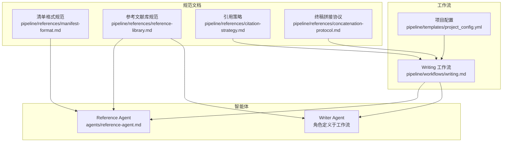
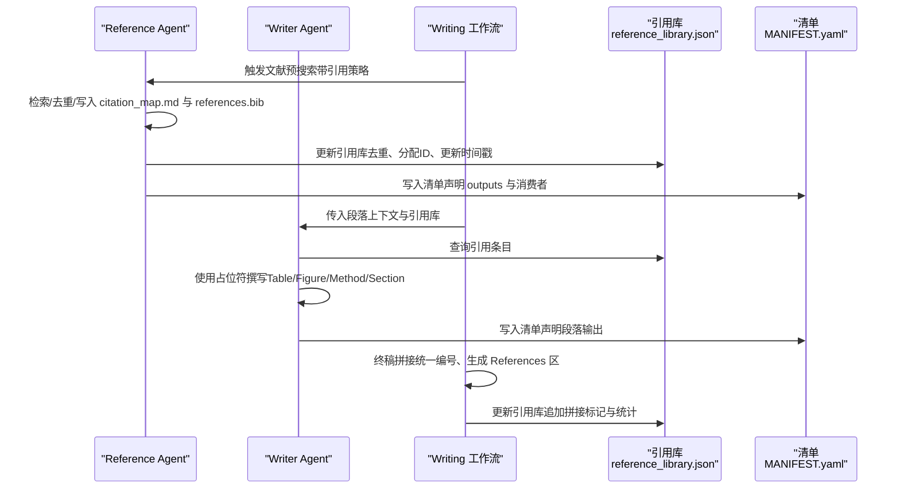
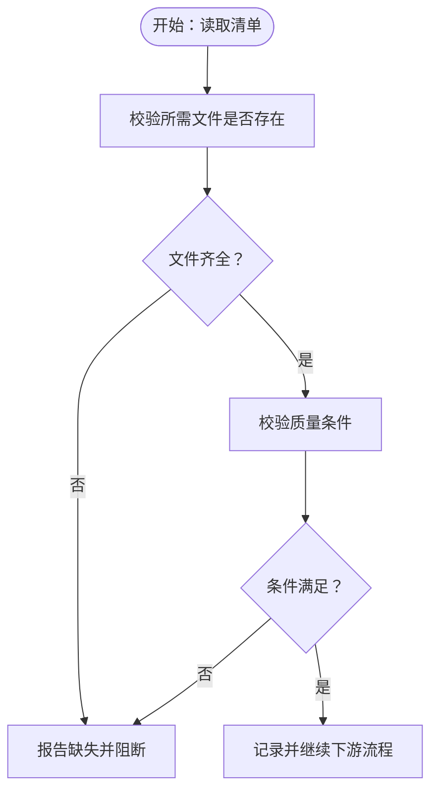
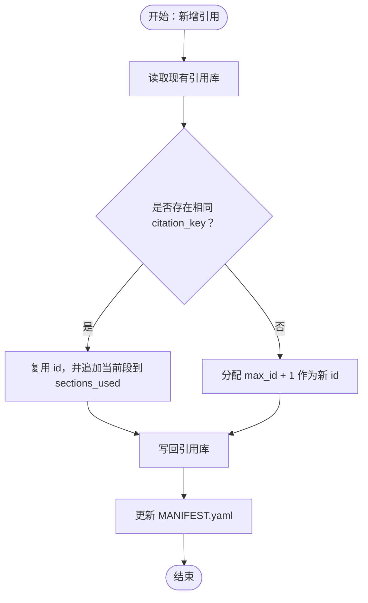
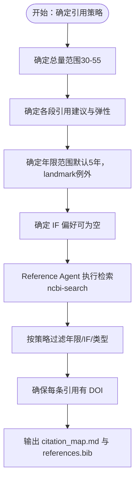
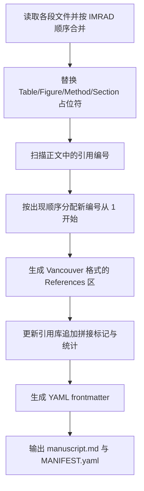
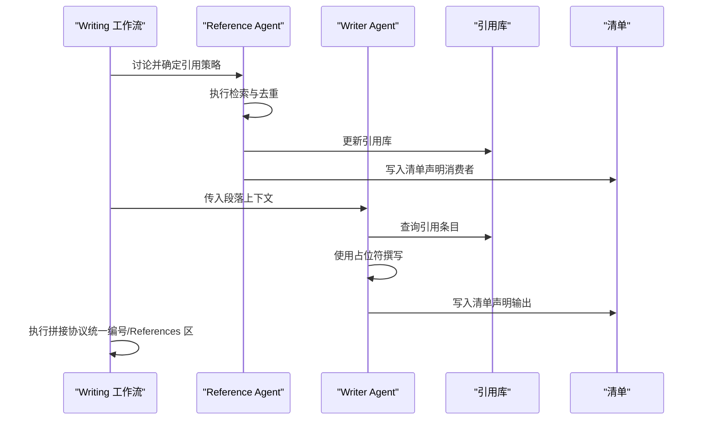
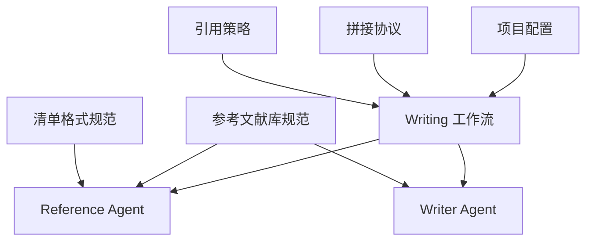

# 参考文献管理系统

<cite>
**本文档引用的文件**
- [pipeline/references/manifest-format.md](file://pipeline/references/manifest-format.md)
- [pipeline/references/reference-library.md](file://pipeline/references/reference-library.md)
- [pipeline/references/citation-strategy.md](file://pipeline/references/citation-strategy.md)
- [agents/reference-agent.md](file://agents/reference-agent.md)
- [pipeline/references/concatenation-protocol.md](file://pipeline/references/concatenation-protocol.md)
- [pipeline/references/mandatory-initial-read.md](file://pipeline/references/mandatory-initial-read.md)
- [pipeline/references/gates.md](file://pipeline/references/gates.md)
- [pipeline/templates/project_config.yml](file://pipeline/templates/project_config.yml)
- [pipeline/workflows/writing.md](file://pipeline/workflows/writing.md)
- [pipeline/templates/spec.md](file://pipeline/templates/spec.md)
</cite>

## 目录
1. [简介](#简介)
2. [项目结构](#项目结构)
3. [核心组件](#核心组件)
4. [架构概览](#架构概览)
5. [详细组件分析](#详细组件分析)
6. [依赖关系分析](#依赖关系分析)
7. [性能考量](#性能考量)
8. [故障排查指南](#故障排查指南)
9. [结论](#结论)
10. [附录](#附录)

## 简介
本系统是一个面向临床科研项目的参考文献管理系统，围绕“清单格式规范”和“参考文献库管理机制”构建，目标是实现：
- 清单格式标准化与数据验证
- 参考文献库的创建、维护与去重
- 文献检索策略与引用格式标准化
- 终稿拼接时的统一编号与交叉引用处理
- 质量门禁与工作流集成

系统通过多智能体协作（Reference Agent、Writer Agent 等）与清单（MANIFEST.yaml）契约，确保上游产出与下游消费的一致性与可追溯性。

## 项目结构
系统采用“规范先行、清单契约、工作流驱动”的组织方式：
- 规范文档：定义清单格式、参考文献库结构、引用策略、拼接协议等
- 智能体：负责文献检索、引用管理、手稿撰写与质量把关
- 工作流：串联各阶段任务，确保阶段间衔接与质量门禁
- 配置文件：提供项目级参数（如引用策略、路径、语言等）

**图表来源**
- [pipeline/references/manifest-format.md:1-187](file://pipeline/references/manifest-format.md#L1-L187)
- [pipeline/references/reference-library.md:1-214](file://pipeline/references/reference-library.md#L1-L214)
- [pipeline/references/citation-strategy.md:1-88](file://pipeline/references/citation-strategy.md#L1-L88)
- [pipeline/references/concatenation-protocol.md:1-291](file://pipeline/references/concatenation-protocol.md#L1-L291)
- [agents/reference-agent.md:1-321](file://agents/reference-agent.md#L1-L321)
- [pipeline/workflows/writing.md:1-330](file://pipeline/workflows/writing.md#L1-L330)
- [pipeline/templates/project_config.yml:1-97](file://pipeline/templates/project_config.yml#L1-L97)

**章节来源**
- [pipeline/references/mandatory-initial-read.md:1-86](file://pipeline/references/mandatory-initial-read.md#L1-L86)
- [pipeline/references/gates.md:1-112](file://pipeline/references/gates.md#L1-L112)

## 核心组件
- 清单格式规范（MANIFEST.yaml）：定义生产者与消费者的契约，确保文件存在性与质量条件
- 参考文献库（reference_library.json）：统一的引用存储与去重中心，支持跨段落引用复用
- 引用策略：控制引用总量、段落分配、年限与影响因子偏好
- 终稿拼接协议：统一编号、占位符替换、References 区生成
- 智能体与工作流：Reference Agent 负责检索与产出，Writer Agent 负责撰写与交叉引用，Writing 工作流协调全流程

**章节来源**
- [pipeline/references/manifest-format.md:1-187](file://pipeline/references/manifest-format.md#L1-L187)
- [pipeline/references/reference-library.md:1-214](file://pipeline/references/reference-library.md#L1-L214)
- [pipeline/references/citation-strategy.md:1-88](file://pipeline/references/citation-strategy.md#L1-L88)
- [pipeline/references/concatenation-protocol.md:1-291](file://pipeline/references/concatenation-protocol.md#L1-L291)
- [agents/reference-agent.md:1-321](file://agents/reference-agent.md#L1-L321)
- [pipeline/workflows/writing.md:1-330](file://pipeline/workflows/writing.md#L1-L330)

## 架构概览
系统采用“清单契约 + 规范驱动 + 工作流编排”的架构：
- 生产者（Agent）在完成产出后写入清单，声明输出文件与质量条件
- 消费者在读取前校验清单，确保上游产物满足下游需求
- Writing 工作流在各阶段注入引用策略与规范，Reference Agent 产出标准化的引用清单，Writer Agent 使用共享库与占位符进行撰写
- 终稿拼接协议统一处理编号与 References 区，形成最终可提交版本

**图表来源**
- [agents/reference-agent.md:249-272](file://agents/reference-agent.md#L249-L272)
- [pipeline/references/reference-library.md:154-194](file://pipeline/references/reference-library.md#L154-L194)
- [pipeline/workflows/writing.md:69-161](file://pipeline/workflows/writing.md#L69-L161)
- [pipeline/references/concatenation-protocol.md:198-273](file://pipeline/references/concatenation-protocol.md#L198-L273)

## 详细组件分析

### 清单格式规范（MANIFEST.yaml）
- 目的：在文件系统级的手工交接之外，提供轻量契约，确保“我写了什么、谁来消费、质量如何”
- 结构要点：
  - 必填：agent、phase、type
  - 输出：outputs（目录、文件、格式、统计）
  - 消费者：handoffs（消费者、所需文件、质量条件）
  - 决策与备注：decisions、notes
- 验证协议：
  - 生产者侧：写完所有文件、写清单、列出所有下游消费者
  - 消费者侧：读取清单后先校验文件存在性，再校验质量条件，失败即阻断

**图表来源**
- [pipeline/references/manifest-format.md:159-187](file://pipeline/references/manifest-format.md#L159-L187)

**章节来源**
- [pipeline/references/manifest-format.md:1-187](file://pipeline/references/manifest-format.md#L1-L187)

### 参考文献库管理机制（reference_library.json）
- 文件位置与结构：统一存储在 Reference/reference_library.json，包含版本、更新时间与引用条目数组
- 字段定义与必填性：id、citation_key、title、authors、journal、year、volume、issue、pages、doi、pmid、sections_used、added_by_section、citation_reason
- 去重与编号策略：
  - 以 citation_key（AuthorYear）为主键，若同作者同年内存在多篇，通过后缀区分
  - 新增引用时先查库，存在则复用 id 并追加当前段落到 sections_used；不存在则分配 max_id+1
  - DOI 必填，无 DOI 的条目标记为 pending_doi 并提示用户补充
- 读写流程：
  - 每段前：Reference Agent 读取库 → 去重新增 → 写回库 → 更新清单
  - 撰写时：Writer Agent 读取库，使用 {{ref:citation_key}} 标记，正文使用 [id] 引用
  - 拼接时：按正文出现顺序统一编号，生成 References 区，更新库的 sections_used

**图表来源**
- [pipeline/references/reference-library.md:61-68](file://pipeline/references/reference-library.md#L61-L68)
- [pipeline/references/reference-library.md:154-167](file://pipeline/references/reference-library.md#L154-L167)

**章节来源**
- [pipeline/references/reference-library.md:1-214](file://pipeline/references/reference-library.md#L1-L214)

### 引用策略与文献检索
- 引用总量与段落分配：总量 30-55 篇为硬约束，Intro/Methods/Results/Discussion 的建议引用数与弹性范围见规范
- 年限策略：默认近 5 年，landmark 经典文献可作为例外
- 影响因子偏好：每次写作前与用户讨论确定，搜索时可作为筛选参考
- 检索流程：Reference Agent 使用 ncbi-search 技能，按策略过滤（年限、IF、文章类型），确保每条引用有 DOI

**图表来源**
- [pipeline/references/citation-strategy.md:8-55](file://pipeline/references/citation-strategy.md#L8-L55)
- [agents/reference-agent.md:47-91](file://agents/reference-agent.md#L47-L91)

**章节来源**
- [pipeline/references/citation-strategy.md:1-88](file://pipeline/references/citation-strategy.md#L1-L88)
- [agents/reference-agent.md:1-321](file://agents/reference-agent.md#L1-L321)

### 终稿拼接协议（统一编号与 References 区）
- 段落合并：按 IMRAD 顺序读取各段独立文件并拼接
- 占位符替换：Table/Figure/SupplementaryTable/Figure 的全局编号；Method/Section 的语义替换
- 引用统一编号：扫描正文中的 [id]，按出现顺序分配连续编号，同一引用在多段复用编号，自然去重
- References 区生成：按 Vancouver 格式输出，字段包括作者、标题、期刊、年份、卷期、页码、DOI
- 后处理：更新引用库（追加拼接标记与统计），生成 YAML frontmatter（title、target_journal、word_count、reference_count）

**图表来源**
- [pipeline/references/concatenation-protocol.md:28-273](file://pipeline/references/concatenation-protocol.md#L28-L273)

**章节来源**
- [pipeline/references/concatenation-protocol.md:1-291](file://pipeline/references/concatenation-protocol.md#L1-L291)

### 智能体与工作流集成
- Reference Agent：负责文献检索、去重、写入 citation_map.md 与 references.bib，并在清单中声明消费者为 Writer Agent
- Writer Agent：在各段撰写时读取引用库，使用占位符进行交叉引用，最终由拼接协议统一编号与生成 References 区
- Writing 工作流：在撰写前讨论并确定引用策略，按 IMRAD 顺序逐段执行“预搜索 → 撰写 → 审阅”，并在最后执行拼接协议

**图表来源**
- [pipeline/workflows/writing.md:25-161](file://pipeline/workflows/writing.md#L25-L161)
- [agents/reference-agent.md:249-272](file://agents/reference-agent.md#L249-L272)

**章节来源**
- [agents/reference-agent.md:1-321](file://agents/reference-agent.md#L1-L321)
- [pipeline/workflows/writing.md:1-330](file://pipeline/workflows/writing.md#L1-L330)

## 依赖关系分析
- 规范依赖：清单格式规范与参考文献库规范相互依赖，前者约束清单结构，后者约束引用库结构与去重策略
- 智能体依赖：Reference Agent 依赖 ncbi-search 技能与项目配置中的引用策略；Writer Agent 依赖引用库与占位符正则
- 工作流依赖：Writing 工作流依赖引用策略与拼接协议，贯穿各阶段的质量门禁与清单校验

**图表来源**
- [pipeline/references/manifest-format.md:1-187](file://pipeline/references/manifest-format.md#L1-L187)
- [pipeline/references/reference-library.md:1-214](file://pipeline/references/reference-library.md#L1-L214)
- [pipeline/references/citation-strategy.md:1-88](file://pipeline/references/citation-strategy.md#L1-L88)
- [pipeline/references/concatenation-protocol.md:1-291](file://pipeline/references/concatenation-protocol.md#L1-L291)
- [pipeline/workflows/writing.md:1-330](file://pipeline/workflows/writing.md#L1-L330)
- [pipeline/templates/project_config.yml:84-97](file://pipeline/templates/project_config.yml#L84-L97)

**章节来源**
- [pipeline/references/mandatory-initial-read.md:1-86](file://pipeline/references/mandatory-initial-read.md#L1-L86)
- [pipeline/references/gates.md:1-112](file://pipeline/references/gates.md#L1-L112)

## 性能考量
- 检索性能：ncbi-search 技能内置速率限制（无 API Key 3 req/s，有 Key 10 req/s），建议在可用时配置 NCBI_API_KEY
- 去重效率：引用库以 citation_key 为主键，新增时先查库再写回，避免重复条目
- 拼接效率：统一编号与 References 区生成采用一次性扫描与顺序重排，复杂度与引用数量线性相关
- 文件系统：清单与引用库采用文件系统持久化，便于跨阶段共享与审计

[本节为通用指导，不直接分析具体文件]

## 故障排查指南
- 清单缺失或文件不全：消费者在读取清单后会校验所需文件是否存在，缺失时阻断并提示具体文件
- 质量条件不满足：清单中的 required_quality 条件未达标时阻断，需修复上游产出
- 引用库异常：检查 citation_key 是否冲突、DOI 是否缺失、sections_used 是否正确更新
- 拼接后仍有占位符：确认拼接协议是否完整执行，Regex 扫描是否覆盖所有占位符类型
- 门禁未通过：根据质量门禁清单逐项核对，修复后方可进入下一阶段

**章节来源**
- [pipeline/references/manifest-format.md:159-187](file://pipeline/references/manifest-format.md#L159-L187)
- [pipeline/references/gates.md:7-112](file://pipeline/references/gates.md#L7-L112)

## 结论
本系统通过“清单契约 + 规范驱动 + 工作流编排”的方式，实现了参考文献管理的标准化与自动化：
- 清单格式规范确保上游产出与下游消费的一致性
- 参考文献库规范与去重策略保障引用质量与一致性
- 引用策略与检索流程提升文献筛选效率与相关性
- 终稿拼接协议统一编号与 References 区，确保最终输出符合期刊要求
- 质量门禁与工作流集成确保阶段可控、可追溯、可验证

[本节为总结，不直接分析具体文件]

## 附录

### 实际使用示例（步骤化）
- 初始化与上下文加载：参考“Mandatory Initial Read”确保 project_config.yml、STATE.md 等必需文件存在
- 讨论引用策略：在 Writing 工作流中与用户确认总量、段落分配、年限与 IF 偏好
- 预搜索与引用库更新：Reference Agent 执行检索，写入 citation_map.md 与 references.bib，并更新引用库与清单
- 段落撰写：Writer Agent 读取引用库，使用占位符撰写，完成后写入清单
- 终稿拼接：执行拼接协议，统一编号与生成 References 区，更新引用库与清单
- 质量门禁：通过质量门禁检查，进入下一阶段

**章节来源**
- [pipeline/references/mandatory-initial-read.md:1-86](file://pipeline/references/mandatory-initial-read.md#L1-L86)
- [pipeline/workflows/writing.md:25-161](file://pipeline/workflows/writing.md#L25-L161)
- [agents/reference-agent.md:249-272](file://agents/reference-agent.md#L249-L272)
- [pipeline/references/concatenation-protocol.md:198-273](file://pipeline/references/concatenation-protocol.md#L198-L273)
- [pipeline/references/gates.md:67-112](file://pipeline/references/gates.md#L67-L112)

### 维护最佳实践
- 保持引用库的完整性与一致性：始终以 citation_key 去重，确保 DOI 完整
- 严格遵循清单契约：生产者写完所有文件再写清单，消费者读取前先校验
- 控制引用量与质量：依据引用策略与段落指南，避免超限与冗余引用
- 定期审查拼接结果：确保占位符替换与统一编号正确，References 区格式规范
- 遵循质量门禁：在每个阶段完成后进行门禁检查，确保可提交质量

[本节为通用指导，不直接分析具体文件]