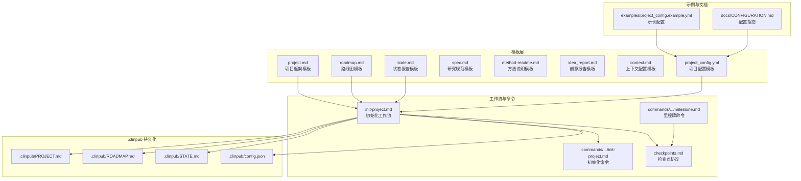
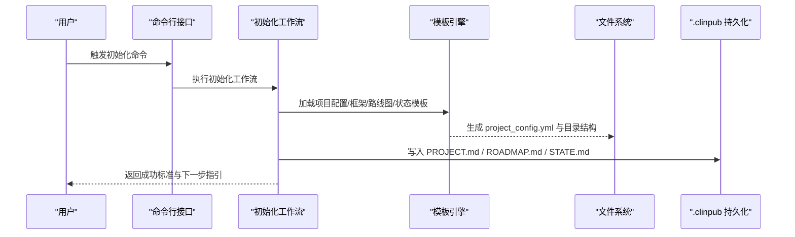
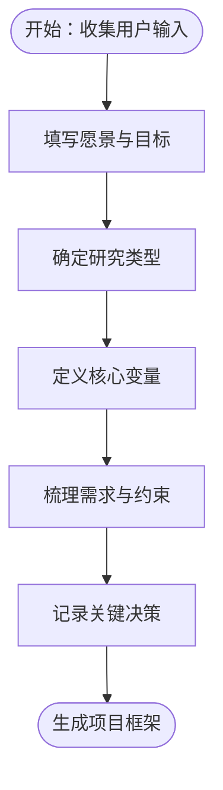
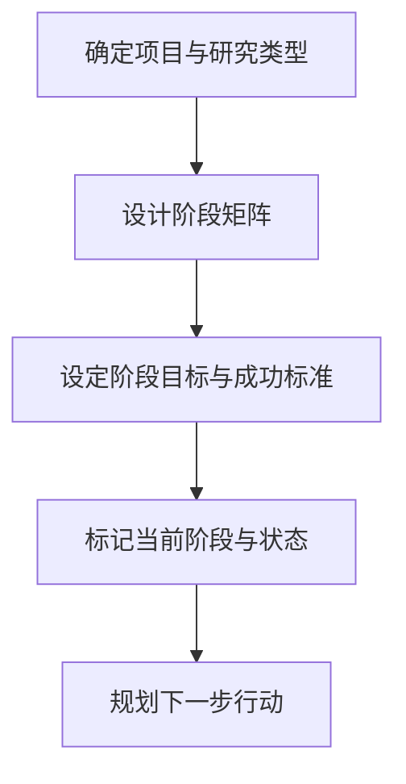
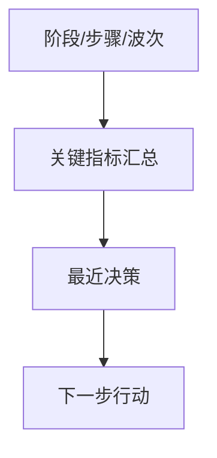
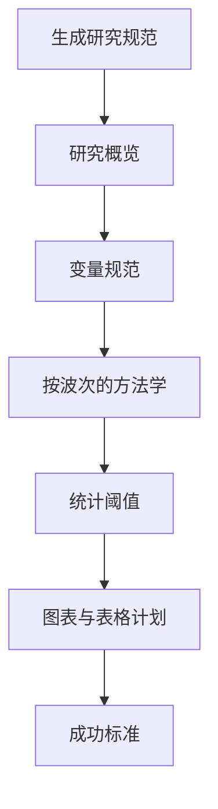
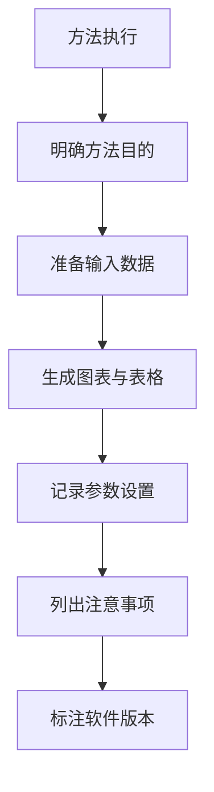
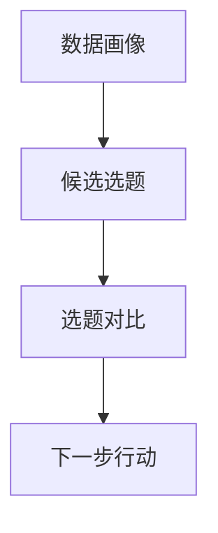
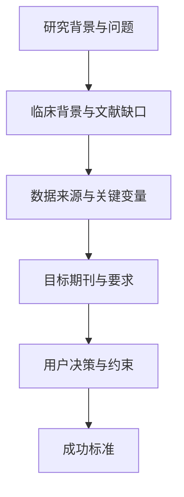
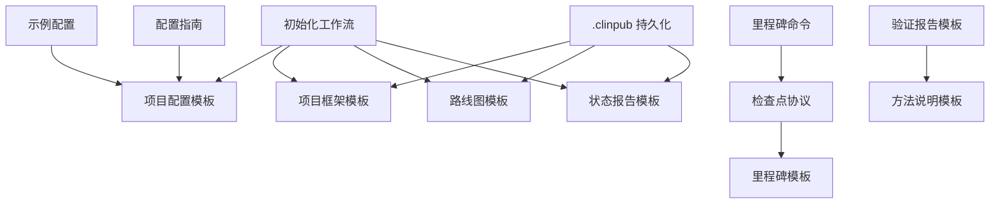

# 标准模板系统

<cite>
**本文引用的文件**
- [项目模板 project.md](file://pipeline/templates/project.md)
- [路线图模板 roadmap.md](file://pipeline/templates/roadmap.md)
- [状态报告模板 state.md](file://pipeline/templates/state.md)
- [研究规范模板 spec.md](file://pipeline/templates/spec.md)
- [方法说明模板 method-readme.md](file://pipeline/templates/method-readme.md)
- [创意报告模板 idea_report.md](file://pipeline/templates/idea_report.md)
- [上下文配置模板 context.md](file://pipeline/templates/context.md)
- [项目配置模板 project_config.yml](file://pipeline/templates/project_config.yml)
- [里程碑模板 milestone.md](file://pipeline/templates/milestone.md)
- [验证报告模板 verification-report.md](file://pipeline/templates/verification-report.md)
- [示例配置 project_config.example.yml](file://examples/project_config.example.yml)
- [检查点与里程碑协议 checkpoints.md](file://pipeline/references/checkpoints.md)
- [配置指南 CONFIGURATION.md](file://docs/CONFIGURATION.md)
- [项目初始化命令 init-project.md](file://commands/clinpub/init-project.md)
- [里程碑管理命令 milestone.md](file://commands/clinpub/milestone.md)
- [.clinpub 配置 config.json](file:// .clinpub/config.json)
- [.clinpub 路线图 ROADMAP.md](file:// .clinpub/ROADMAP.md)
- [.clinpub 状态 STATE.md](file:// .clinpub/STATE.md)
- [初始化工作流 init-project.md](file://pipeline/workflows/init-project.md)
</cite>

## 目录
1. [引言](#引言)
2. [项目结构](#项目结构)
3. [核心组件](#核心组件)
4. [架构概览](#架构概览)
5. [详细组件分析](#详细组件分析)
6. [依赖关系分析](#依赖关系分析)
7. [性能考虑](#性能考虑)
8. [故障排除指南](#故障排除指南)
9. [结论](#结论)
10. [附录](#附录)

## 引言
本文件系统性阐述标准模板体系的设计与使用，围绕7类核心模板展开：项目框架模板、路线图模板、状态报告模板、研究规范模板、方法说明模板、创意报告模板、上下文配置模板。文档从功能定位、结构规范、字段定义、格式要求、定制选项到实际使用示例与最佳实践进行全面说明，帮助研究团队建立一致、可追溯、可复现的研究工作流。

## 项目结构
标准模板系统位于 pipeline/templates 目录，配合 commands、pipeline/workflows、examples、docs 等模块协同工作，形成“模板 + 工作流 + 配置 + 文档”的完整闭环。.clinpub 层负责持久化项目规划与状态，commands 提供用户交互入口，workflows 定义阶段化流程，examples 提供可直接使用的配置样例，docs 提供环境与配置指南。

**图表来源**
- [项目模板 project.md:1-30](file://pipeline/templates/project.md#L1-L30)
- [路线图模板 roadmap.md:1-19](file://pipeline/templates/roadmap.md#L1-L19)
- [状态报告模板 state.md:1-19](file://pipeline/templates/state.md#L1-L19)
- [研究规范模板 spec.md:1-125](file://pipeline/templates/spec.md#L1-L125)
- [方法说明模板 method-readme.md:1-38](file://pipeline/templates/method-readme.md#L1-L38)
- [创意报告模板 idea_report.md:1-118](file://pipeline/templates/idea_report.md#L1-L118)
- [上下文配置模板 context.md:1-121](file://pipeline/templates/context.md#L1-L121)
- [项目配置模板 project_config.yml:1-97](file://pipeline/templates/project_config.yml#L1-L97)
- [初始化工作流 init-project.md:1-124](file://pipeline/workflows/init-project.md#L1-L124)
- [检查点与里程碑协议 checkpoints.md:1-120](file://pipeline/references/checkpoints.md#L1-L120)
- [示例配置 project_config.example.yml:1-68](file://examples/project_config.example.yml#L1-L68)
- [.clinpub 路线图 ROADMAP.md:1-123](file://.clinpub/ROADMAP.md#L1-L123)
- [.clinpub 状态 STATE.md:1-63](file://.clinpub/STATE.md#L1-L63)
- [.clinpub 配置 config.json:1-15](file://.clinpub/config.json#L1-L15)

**章节来源**
- [项目模板 project.md:1-30](file://pipeline/templates/project.md#L1-L30)
- [路线图模板 roadmap.md:1-19](file://pipeline/templates/roadmap.md#L1-L19)
- [状态报告模板 state.md:1-19](file://pipeline/templates/state.md#L1-L19)
- [研究规范模板 spec.md:1-125](file://pipeline/templates/spec.md#L1-L125)
- [方法说明模板 method-readme.md:1-38](file://pipeline/templates/method-readme.md#L1-L38)
- [创意报告模板 idea_report.md:1-118](file://pipeline/templates/idea_report.md#L1-L118)
- [上下文配置模板 context.md:1-121](file://pipeline/templates/context.md#L1-L121)
- [项目配置模板 project_config.yml:1-97](file://pipeline/templates/project_config.yml#L1-L97)
- [初始化工作流 init-project.md:1-124](file://pipeline/workflows/init-project.md#L1-L124)
- [检查点与里程碑协议 checkpoints.md:1-120](file://pipeline/references/checkpoints.md#L1-L120)
- [示例配置 project_config.example.yml:1-68](file://examples/project_config.example.yml#L1-L68)
- [.clinpub 路线图 ROADMAP.md:1-123](file://.clinpub/ROADMAP.md#L1-L123)
- [.clinpub 状态 STATE.md:1-63](file://.clinpub/STATE.md#L1-L63)
- [.clinpub 配置 config.json:1-15](file://.clinpub/config.json#L1-L15)

## 核心组件
本节对7个核心模板逐一进行功能定位、结构规范、字段定义与定制选项说明，并给出使用场景与最佳实践。

- 项目框架模板（project.md）
  - 功能定位：在项目初始化阶段沉淀研究愿景、研究类型、核心变量、需求与约束、决策记录等关键信息，形成可追溯的项目框架。
  - 结构规范：包含“愿景”“研究类型”“核心变量”“需求”“约束”“决策记录”等区块，采用Markdown表格与列表组合表达。
  - 字段定义与格式要求：核心变量包括结局变量、暴露变量、协变量、分组变量、时间变量等，均以占位符形式出现；约束包含语言与统计工具约定；决策记录采用三列表格。
  - 定制选项：可根据研究类型调整变量角色与描述；可增删约束项以匹配目标期刊与报告规范。
  - 使用场景：Phase 0 初始化后生成，作为后续路线图与规范制定的依据。
  - 最佳实践：确保变量角色清晰、约束明确、决策可追溯。

- 路线图模板（roadmap.md）
  - 功能定位：定义研究阶段划分、各阶段目标与成功标准、当前阶段与下一步行动，形成阶段性推进路线。
  - 结构规范：包含项目信息、阶段矩阵（Phase/名称/目标/成功标准/状态）、当前阶段与下一步。
  - 字段定义与格式要求：阶段矩阵采用Markdown表格；状态使用占位符；下一步采用自然语言描述。
  - 定制选项：可按项目复杂度增减阶段；可细化成功标准与状态标记。
  - 使用场景：项目启动与阶段切换时更新，指导团队按阶段推进。
  - 最佳实践：阶段目标与成功标准量化可验证；状态及时更新。

- 状态报告模板（state.md）
  - 功能定位：记录当前阶段、步骤、波次与关键指标，汇总最近决策与下一步行动，便于项目监控与复盘。
  - 结构规范：包含当前位置、关键指标、最近决策、下一步行动等区块。
  - 字段定义与格式要求：关键指标包含已完成/待完成分析数量、文献数量、论文进度等；下一步行动采用占位符。
  - 定制选项：可根据项目类型调整指标维度（如纳入文献筛选进度、图表质量指标等）。
  - 使用场景：阶段结束或里程碑节点更新，用于状态同步与审计。
  - 最佳实践：指标定期更新；决策与行动可追踪。

- 研究规范模板（spec.md）
  - 功能定位：面向具体分析波次（Wave）制定方法学规范，明确变量规范、分析方法、统计阈值、图表与表格计划、成功标准等。
  - 结构规范：包含研究概览、变量规范、分析方法（按波次分层）、统计阈值、图表与表格计划、成功标准等。
  - 字段定义与格式要求：变量规范采用表格；分析方法按波次组织；成功标准采用勾选项清单。
  - 定制选项：可按研究设计调整波次数量与方法组合；可细化统计阈值与校正方法。
  - 使用场景：Phase 2 分析设计阶段生成，作为分析执行与验证的依据。
  - 最佳实践：波次依赖关系清晰；方法输出与规范一一对应。

- 方法说明模板（method-readme.md）
  - 功能定位：为单个分析方法提供标准化说明，涵盖目的、方法、输入数据、输出结果、参数设置、注意事项与软件版本。
  - 结构规范：包含目的、方法、输入数据、输出结果（图表/表格）、参数设置、注意事项、软件版本等。
  - 字段定义与格式要求：输出结果采用表格；参数设置与注意事项采用列表；软件版本标注R与包版本。
  - 定制选项：可按具体方法调整输入输出与参数；可补充方法适用/不适用条件。
  - 使用场景：每个分析方法完成后生成，作为方法学知识资产与复现依据。
  - 最佳实践：参数设置与假设条件明确；输出与方法说明一一对应。

- 创意报告模板（idea_report.md）
  - 功能定位：基于数据画像生成候选选题，提供可行性评分、研究类型、变量映射、拟采用方法、创新点、文献支持、目标期刊与注意事项。
  - 结构规范：包含数据画像摘要、候选选题、选题对比、下一步等。
  - 字段定义与格式要求：候选选题采用分级标题；变量映射与图表清单采用表格；选题对比采用多维表格。
  - 定制选项：可按数据特点调整变量角色分布与研究类型建议。
  - 使用场景：数据探索阶段生成，辅助确定研究方向与优先级。
  - 最佳实践：选题与数据画像高度相关；创新点与文献支持充分。

- 上下文配置模板（context.md）
  - 功能定位：沉淀研究背景、问题与假设、数据来源、关键变量、目标期刊、用户决策、约束与成功标准，形成可复用的研究上下文。
  - 结构规范：包含研究问题与假设、背景（临床与文献缺口、创新点）、数据来源、关键变量、目标期刊、用户决策、约束、成功标准等。
  - 字段定义与格式要求：用户决策采用表格；关键变量采用表格；成功标准采用列表。
  - 定制选项：可按研究领域调整背景与创新点描述；可细化决策点与选择。
  - 使用场景：研究设计与方法学讨论阶段生成，作为跨阶段共享的知识基。
  - 最佳实践：背景与文献缺口清晰；变量定义与来源明确。

**章节来源**
- [项目模板 project.md:1-30](file://pipeline/templates/project.md#L1-L30)
- [路线图模板 roadmap.md:1-19](file://pipeline/templates/roadmap.md#L1-L19)
- [状态报告模板 state.md:1-19](file://pipeline/templates/state.md#L1-L19)
- [研究规范模板 spec.md:1-125](file://pipeline/templates/spec.md#L1-L125)
- [方法说明模板 method-readme.md:1-38](file://pipeline/templates/method-readme.md#L1-L38)
- [创意报告模板 idea_report.md:1-118](file://pipeline/templates/idea_report.md#L1-L118)
- [上下文配置模板 context.md:1-121](file://pipeline/templates/context.md#L1-L121)

## 架构概览
标准模板系统通过“模板 + 工作流 + 配置 + 持久化”的架构实现端到端研究流程管理。初始化工作流在用户确认研究框架后生成项目配置与目录结构，并创建 .clinpub 层的项目框架、路线图与状态文件；里程碑命令与检查点协议保障阶段评审与状态推进；示例配置与配置指南提供落地实施参考。

**图表来源**
- [项目初始化命令 init-project.md:1-34](file://commands/clinpub/init-project.md#L1-L34)
- [初始化工作流 init-project.md:1-124](file://pipeline/workflows/init-project.md#L1-L124)
- [项目配置模板 project_config.yml:1-97](file://pipeline/templates/project_config.yml#L1-L97)
- [项目框架模板 project.md:1-30](file://pipeline/templates/project.md#L1-L30)
- [路线图模板 roadmap.md:1-19](file://pipeline/templates/roadmap.md#L1-L19)
- [状态报告模板 state.md:1-19](file://pipeline/templates/state.md#L1-L19)

**章节来源**
- [项目初始化命令 init-project.md:1-34](file://commands/clinpub/init-project.md#L1-L34)
- [初始化工作流 init-project.md:1-124](file://pipeline/workflows/init-project.md#L1-L124)
- [检查点与里程碑协议 checkpoints.md:1-120](file://pipeline/references/checkpoints.md#L1-L120)
- [.clinpub 路线图 ROADMAP.md:1-123](file://.clinpub/ROADMAP.md#L1-L123)
- [.clinpub 状态 STATE.md:1-63](file://.clinpub/STATE.md#L1-L63)

## 详细组件分析

### 项目框架模板（project.md）
- 功能与定位：作为研究项目的“宪法”，定义愿景、研究类型、核心变量、需求与约束、决策记录，确保项目方向一致、可追溯。
- 结构与字段：采用标题层级与表格/列表组合；核心变量包含结局、暴露、协变量、分组、时间变量；约束包含语言与统计工具；决策记录三列表格。
- 使用示例：在 Phase 0 初始化后，结合用户输入填充占位符，形成稳定的项目框架。
- 最佳实践：变量角色与类型必须与数据一致；约束与目标期刊匹配；决策记录及时更新。

**图表来源**
- [项目模板 project.md:1-30](file://pipeline/templates/project.md#L1-L30)

**章节来源**
- [项目模板 project.md:1-30](file://pipeline/templates/project.md#L1-L30)

### 路线图模板（roadmap.md）
- 功能与定位：将研究分解为阶段，明确各阶段目标、成功标准与状态，形成可推进的路线图。
- 结构与字段：阶段矩阵采用表格；状态使用占位符；下一步采用自然语言描述。
- 使用示例：Phase 0 完成后更新为 Phase 1 的目标与状态。
- 最佳实践：阶段目标可量化；成功标准可验证；状态及时更新。

**图表来源**
- [路线图模板 roadmap.md:1-19](file://pipeline/templates/roadmap.md#L1-L19)

**章节来源**
- [路线图模板 roadmap.md:1-19](file://pipeline/templates/roadmap.md#L1-L19)

### 状态报告模板（state.md）
- 功能与定位：记录当前阶段、步骤、波次与关键指标，汇总最近决策与下一步行动。
- 结构与字段：包含当前位置、关键指标、最近决策、下一步行动。
- 使用示例：阶段结束或里程碑节点更新，用于状态同步。
- 最佳实践：指标定期更新；决策与行动可追踪。

**图表来源**
- [状态报告模板 state.md:1-19](file://pipeline/templates/state.md#L1-L19)

**章节来源**
- [状态报告模板 state.md:1-19](file://pipeline/templates/state.md#L1-L19)

### 研究规范模板（spec.md）
- 功能与定位：面向分析波次制定方法学规范，明确变量规范、分析方法、统计阈值、图表与表格计划、成功标准。
- 结构与字段：包含研究概览、变量规范、分析方法（按波次分层）、统计阈值、图表与表格计划、成功标准。
- 使用示例：Phase 2 生成，指导分析执行与验证。
- 最佳实践：波次依赖关系清晰；方法输出与规范一一对应。

**图表来源**
- [研究规范模板 spec.md:1-125](file://pipeline/templates/spec.md#L1-L125)

**章节来源**
- [研究规范模板 spec.md:1-125](file://pipeline/templates/spec.md#L1-L125)

### 方法说明模板（method-readme.md）
- 功能与定位：为单个分析方法提供标准化说明，确保方法可复现、可审计。
- 结构与字段：包含目的、方法、输入数据、输出结果（图表/表格）、参数设置、注意事项、软件版本。
- 使用示例：每个分析方法完成后生成，作为知识资产。
- 最佳实践：参数设置与假设条件明确；输出与方法说明一一对应。

**图表来源**
- [方法说明模板 method-readme.md:1-38](file://pipeline/templates/method-readme.md#L1-L38)

**章节来源**
- [方法说明模板 method-readme.md:1-38](file://pipeline/templates/method-readme.md#L1-L38)

### 创意报告模板（idea_report.md）
- 功能与定位：基于数据画像生成候选选题，辅助确定研究方向与优先级。
- 结构与字段：包含数据画像摘要、候选选题、选题对比、下一步。
- 使用示例：数据探索阶段生成，指导后续研究设计。
- 最佳实践：选题与数据画像高度相关；创新点与文献支持充分。

**图表来源**
- [创意报告模板 idea_report.md:1-118](file://pipeline/templates/idea_report.md#L1-L118)

**章节来源**
- [创意报告模板 idea_report.md:1-118](file://pipeline/templates/idea_report.md#L1-L118)

### 上下文配置模板（context.md）
- 功能与定位：沉淀研究背景、问题与假设、数据来源、关键变量、目标期刊、用户决策、约束与成功标准。
- 结构与字段：包含研究问题与假设、背景、数据来源、关键变量、目标期刊、用户决策、约束、成功标准。
- 使用示例：研究设计与方法学讨论阶段生成，作为跨阶段共享的知识基。
- 最佳实践：背景与文献缺口清晰；变量定义与来源明确。

**图表来源**
- [上下文配置模板 context.md:1-121](file://pipeline/templates/context.md#L1-L121)

**章节来源**
- [上下文配置模板 context.md:1-121](file://pipeline/templates/context.md#L1-L121)

## 依赖关系分析
标准模板系统内部存在清晰的依赖关系：初始化工作流依赖项目配置与多个模板；里程碑命令与检查点协议贯穿各阶段；.clinpub 层持久化项目状态；示例配置与配置指南提供落地参考。

**图表来源**
- [初始化工作流 init-project.md:1-124](file://pipeline/workflows/init-project.md#L1-L124)
- [项目配置模板 project_config.yml:1-97](file://pipeline/templates/project_config.yml#L1-L97)
- [项目框架模板 project.md:1-30](file://pipeline/templates/project.md#L1-L30)
- [路线图模板 roadmap.md:1-19](file://pipeline/templates/roadmap.md#L1-L19)
- [状态报告模板 state.md:1-19](file://pipeline/templates/state.md#L1-L19)
- [里程碑命令 milestone.md:1-39](file://commands/clinpub/milestone.md#L1-L39)
- [检查点与里程碑协议 checkpoints.md:1-120](file://pipeline/references/checkpoints.md#L1-L120)
- [里程碑模板 milestone.md:1-46](file://pipeline/templates/milestone.md#L1-L46)
- [验证报告模板 verification-report.md:1-85](file://pipeline/templates/verification-report.md#L1-L85)
- [方法说明模板 method-readme.md:1-38](file://pipeline/templates/method-readme.md#L1-L38)
- [示例配置 project_config.example.yml:1-68](file://examples/project_config.example.yml#L1-L68)
- [.clinpub 路线图 ROADMAP.md:1-123](file://.clinpub/ROADMAP.md#L1-L123)
- [.clinpub 状态 STATE.md:1-63](file://.clinpub/STATE.md#L1-L63)

**章节来源**
- [初始化工作流 init-project.md:1-124](file://pipeline/workflows/init-project.md#L1-L124)
- [检查点与里程碑协议 checkpoints.md:1-120](file://pipeline/references/checkpoints.md#L1-L120)
- [里程碑命令 milestone.md:1-39](file://commands/clinpub/milestone.md#L1-L39)
- [验证报告模板 verification-report.md:1-85](file://pipeline/templates/verification-report.md#L1-L85)

## 性能考虑
- 模板渲染效率：模板字段较少且结构稳定，渲染开销可忽略。
- 文件系统访问：.clinpub 层与项目目录分离，避免频繁IO冲突。
- 配置一致性：通过项目配置模板集中管理变量与参数，减少重复计算与错误传播。
- 可扩展性：新增模板遵循现有结构与命名规范，易于维护与扩展。

## 故障排除指南
- 模板占位符未填充
  - 现象：生成的文档中存在未解析的占位符。
  - 排查：检查项目配置与用户输入是否完整；确认初始化工作流执行成功。
  - 参考：项目配置模板字段与初始化工作流步骤。
- 阶段状态不一致
  - 现象：ROADMAP.md 与 STATE.md 显示不同阶段。
  - 排查：执行里程碑命令并更新状态；核对 .clinpub 层文件。
  - 参考：里程碑命令与检查点协议。
- 验证失败
  - 现象：验证报告中出现 FAIL 或 CONDITIONAL。
  - 排查：根据验证报告中的检查项逐项修正；确保方法输出与规范一致。
  - 参考：验证报告模板与方法说明模板。

**章节来源**
- [检查点与里程碑协议 checkpoints.md:1-120](file://pipeline/references/checkpoints.md#L1-L120)
- [里程碑命令 milestone.md:1-39](file://commands/clinpub/milestone.md#L1-L39)
- [验证报告模板 verification-report.md:1-85](file://pipeline/templates/verification-report.md#L1-L85)

## 结论
标准模板系统通过7类核心模板与配套工作流、配置、文档形成闭环，确保研究项目在框架、路线、状态、规范、方法、创意与上下文七个维度保持一致、可追溯与可复现。遵循本文提供的结构规范、字段定义、定制选项与最佳实践，可显著提升研究效率与质量。

## 附录
- 实际使用示例与最佳实践
  - 项目初始化：先执行初始化命令，再根据提示完善项目配置与目录结构，随后生成 .clinpub 层文件。
  - 阶段推进：每个阶段结束后执行里程碑命令，生成里程碑报告并更新状态。
  - 方法执行：每个分析方法完成后生成方法说明，确保输出与规范一致。
  - 配置落地：参考示例配置与配置指南，结合项目实际情况调整参数与路径。
- 相关文件索引
  - 项目配置模板：[项目配置模板 project_config.yml:1-97](file://pipeline/templates/project_config.yml#L1-L97)
  - 示例配置：[示例配置 project_config.example.yml:1-68](file://examples/project_config.example.yml#L1-L68)
  - 配置指南：[配置指南 CONFIGURATION.md:1-270](file://docs/CONFIGURATION.md#L1-L270)
  - 初始化命令：[项目初始化命令 init-project.md:1-34](file://commands/clinpub/init-project.md#L1-L34)
  - 里程碑命令：[里程碑管理命令 milestone.md:1-39](file://commands/clinpub/milestone.md#L1-L39)
  - 检查点协议：[检查点与里程碑协议 checkpoints.md:1-120](file://pipeline/references/checkpoints.md#L1-L120)
  - .clinpub 配置：[.clinpub 配置 config.json:1-15](file://.clinpub/config.json#L1-L15)
  - .clinpub 路线图：[.clinpub 路线图 ROADMAP.md:1-123](file://.clinpub/ROADMAP.md#L1-L123)
  - .clinpub 状态：[.clinpub 状态 STATE.md:1-63](file://.clinpub/STATE.md#L1-L63)