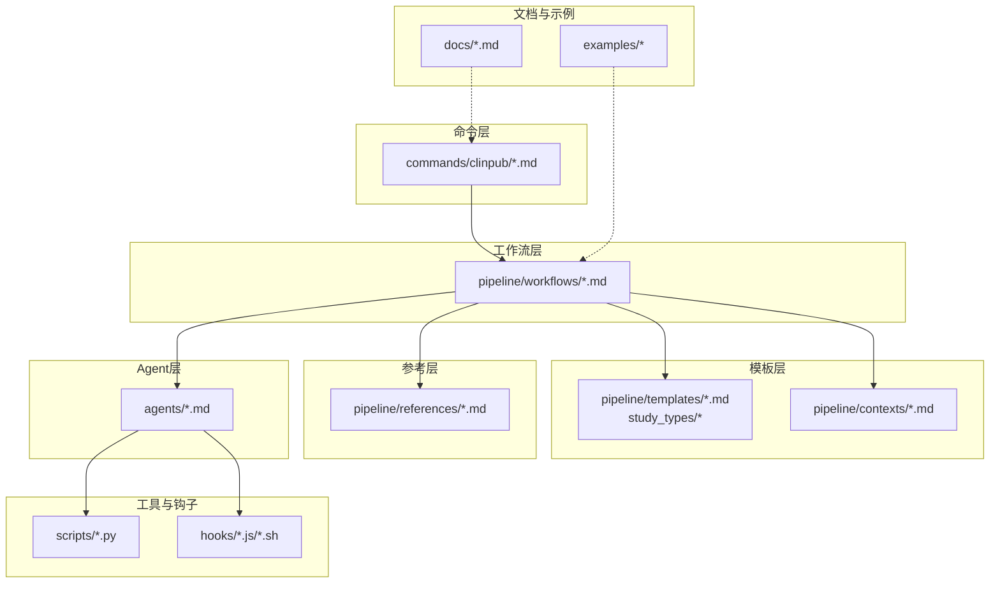
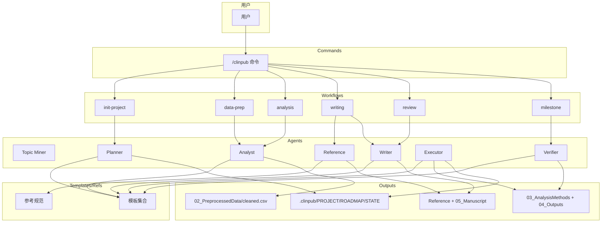
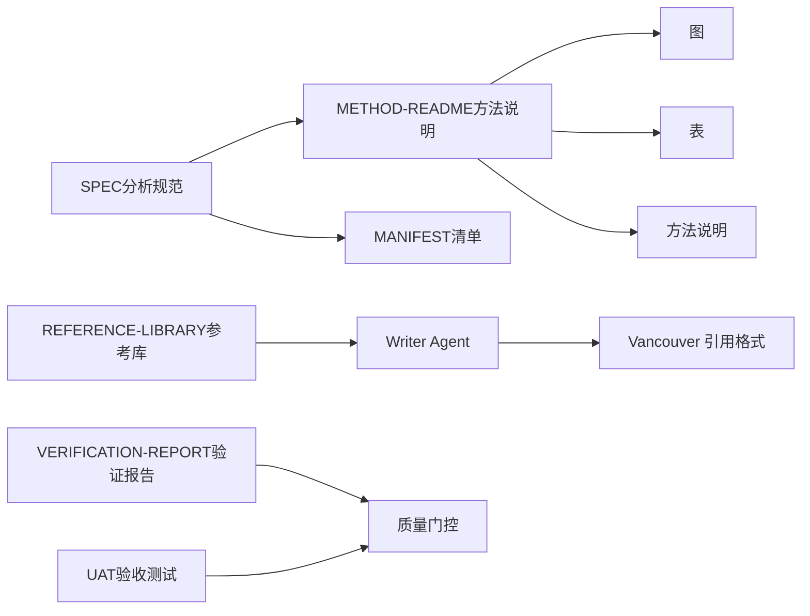

# 模板与参考系统

<cite>
**本文引用的文件**
- [README.md](file://README.md)
- [ARCHITECTURE.md](file://docs/ARCHITECTURE.md)
- [CONFIGURATION.md](file://docs/CONFIGURATION.md)
- [getting-started.md](file://docs/getting-started.md)
- [project.md](file://pipeline/templates/project.md)
- [roadmap.md](file://pipeline/templates/roadmap.md)
- [state.md](file://pipeline/templates/state.md)
- [spec.md](file://pipeline/templates/spec.md)
- [method-readme.md](file://pipeline/templates/method-readme.md)
- [milestone.md](file://pipeline/templates/milestone.md)
- [verification-report.md](file://pipeline/templates/verification-report.md)
- [UAT.md](file://pipeline/templates/UAT.md)
- [context.md](file://pipeline/templates/context.md)
- [idea_report.md](file://pipeline/templates/idea_report.md)
- [project_config.yml](file://pipeline/templates/project_config.yml)
- [reference-library.md](file://pipeline/references/reference-library.md)
</cite>

## 目录
1. [简介](#简介)
2. [项目结构](#项目结构)
3. [核心组件](#核心组件)
4. [架构总览](#架构总览)
5. [详细组件分析](#详细组件分析)
6. [依赖分析](#依赖分析)
7. [性能考虑](#性能考虑)
8. [故障排查指南](#故障排查指南)
9. [结论](#结论)
10. [附录](#附录)

## 简介
本文件面向“clinpub”模板与参考系统，系统性梳理14个标准模板的用途、结构与定制方法，覆盖项目框架、路线图、状态报告、方法说明与验证报告；同时阐述参考文献库的管理机制、文献检索策略与引用格式标准化；解释清单格式规范、数据字典模板与上下文配置文件；并提供模板定制指南、批量生成脚本与质量检查清单，辅以实际使用示例与最佳实践建议。

## 项目结构
- 命令入口：commands/clinpub/*.md
- 工作流：pipeline/workflows/*.md
- 模板：pipeline/templates/*.md 与 pipeline/templates/study_types/*
- 参考：pipeline/references/*.md
- 上下文：pipeline/contexts/*.md
- Agent：agents/*.md
- 脚本：scripts/*.py
- Hooks：hooks/*.js/*.sh
- 文档：docs/*.md
- 示例：examples/*

**图表来源**
- [ARCHITECTURE.md: 1-160:1-160](file://docs/ARCHITECTURE.md#L1-L160)
- [README.md: 20-45:20-45](file://README.md#L20-L45)

**章节来源**
- [README.md: 20-45:20-45](file://README.md#L20-L45)
- [ARCHITECTURE.md: 7-43:7-43](file://docs/ARCHITECTURE.md#L7-L43)

## 核心组件
- 项目框架模板：用于生成研究愿景、变量映射、约束与决策记录，支撑项目启动与共识建立。
- 路线图模板：定义五阶段目标、成功标准与当前状态，形成阶段性里程碑。
- 状态报告模板：汇总阶段位置、关键指标、最近决策与下一步行动，便于跟踪与汇报。
- 分析规范模板：面向Phase 2，明确研究概览、变量规范、波次方法、统计阈值与图表表格计划。
- 方法说明模板：面向Phase 2每个分析方法，提供目的、方法、输入输出、参数、注意事项与软件版本。
- 关卡评审模板：记录交付物、成功标准、关键决策、产出文件、阻塞项与用户签字。
- 验证报告模板：面向Phase 2方法执行后的验证，列出检查项、发现的问题、可重现性与数据链验证。
- 用户验收测试模板：面向Phase 3/4的产出质量验收，覆盖数据完整性、分析输出、手稿质量与可重现性。
- 上下文配置模板：面向研究背景、数据来源、关键变量、目标期刊与成功标准，支撑写作与评审。
- 选题报告模板：面向data2idea阶段，提供数据画像、候选选题、创新点与文献支持。
- 项目配置模板：面向项目配置文件，定义研究类型、变量映射、路径、分析参数与语言/质量标准。
- 参考文献库规范：面向Phase 3，定义共享参考库JSON结构、Vancouver格式、交叉引用占位符与读写流程。

**章节来源**
- [project.md: 1-30:1-30](file://pipeline/templates/project.md#L1-L30)
- [roadmap.md: 1-19:1-19](file://pipeline/templates/roadmap.md#L1-L19)
- [state.md: 1-19:1-19](file://pipeline/templates/state.md#L1-L19)
- [spec.md: 1-125:1-125](file://pipeline/templates/spec.md#L1-L125)
- [method-readme.md: 1-38:1-38](file://pipeline/templates/method-readme.md#L1-L38)
- [milestone.md: 1-46:1-46](file://pipeline/templates/milestone.md#L1-L46)
- [verification-report.md: 1-85:1-85](file://pipeline/templates/verification-report.md#L1-L85)
- [UAT.md: 1-72:1-72](file://pipeline/templates/UAT.md#L1-L72)
- [context.md: 1-121:1-121](file://pipeline/templates/context.md#L1-L121)
- [idea_report.md: 1-118:1-118](file://pipeline/templates/idea_report.md#L1-L118)
- [project_config.yml: 1-97:1-97](file://pipeline/templates/project_config.yml#L1-L97)
- [reference-library.md: 1-214:1-214](file://pipeline/references/reference-library.md#L1-L214)

## 架构总览
三层架构：Commands → Workflows → Agents；模板与参考贯穿各阶段，形成“可复制”的研究与写作流程。

**图表来源**
- [ARCHITECTURE.md: 45-104:45-104](file://docs/ARCHITECTURE.md#L45-L104)
- [README.md: 37-81:37-81](file://README.md#L37-L81)

## 详细组件分析

### 项目框架模板（PROJECT）
- 用途：确立研究愿景、研究类型、核心变量与约束，记录决策。
- 结构要点：愿景、研究类型、核心变量清单、需求与约束、决策记录表。
- 定制方法：在项目初始化后，按实际研究设计与变量映射填写；约束可按伦理、语言与目标期刊进行扩展。

**章节来源**
- [project.md: 1-30:1-30](file://pipeline/templates/project.md#L1-L30)

### 路线图模板（ROADMAP）
- 用途：定义五阶段目标、成功标准与当前状态，指导推进。
- 结构要点：阶段表、当前阶段与下一步行动。
- 定制方法：结合项目实际调整阶段目标与成功标准，确保可验证与可达成。

**章节来源**
- [roadmap.md: 1-19:1-19](file://pipeline/templates/roadmap.md#L1-L19)

### 状态报告模板（STATE）
- 用途：实时反映阶段位置、关键指标与下一步行动。
- 结构要点：当前位置、关键指标（已完成/待完成分析、文献数量、写作进度）、最近决策、下一步。
- 定制方法：在各阶段产出后更新指标，保持与实际进展一致。

**章节来源**
- [state.md: 1-19:1-19](file://pipeline/templates/state.md#L1-L19)

### 分析规范模板（SPEC）
- 用途：Phase 2的分析蓝图，明确研究概览、变量规范、波次方法、统计阈值与图表表格计划。
- 结构要点：研究概览、变量规范、波次方法矩阵、统计阈值、图表表格计划、成功标准。
- 定制方法：依据数据特征动态生成波次与方法，确保每个方法都有图、表与方法说明。

**章节来源**
- [spec.md: 1-125:1-125](file://pipeline/templates/spec.md#L1-L125)

### 方法说明模板（METHOD-README）
- 用途：每个分析方法的中文说明，确保可解释与可复现。
- 结构要点：目的、方法、输入数据、输出结果、参数设置、注意事项、软件版本。
- 定制方法：按实际方法与参数填写，强调效应量、置信区间与精确p值。

**章节来源**
- [method-readme.md: 1-38:1-38](file://pipeline/templates/method-readme.md#L1-L38)

### 关卡评审模板（MILESTONE）
- 用途：阶段评审的关键文档，记录交付物、成功标准、决策与签字。
- 结构要点：完成日期、状态、交付物清单、成功标准验证、关键决策、产出文件、阻塞项、用户签字与下一步。
- 定制方法：在里程碑节点前组织评审，确保所有标准通过后再放行。

**章节来源**
- [milestone.md: 1-46:1-46](file://pipeline/templates/milestone.md#L1-L46)

### 验证报告模板（VERIFICATION-REPORT）
- 用途：对Phase 2方法执行进行系统验证，确保一致性、可重现与数据链完整。
- 结构要点：检查项、问题发现、可重现性确认、数据流验证、签核。
- 定制方法：按验证模式逐项检查，Critical问题必须解决，Warning需记录与评估。

**章节来源**
- [verification-report.md: 1-85:1-85](file://pipeline/templates/verification-report.md#L1-L85)

### 用户验收测试模板（UAT）
- 用途：面向Phase 3/4的产出质量验收，覆盖数据完整性、分析输出、手稿质量与可重现性。
- 结构要点：概述、测试用例（TC-1至TC-4）、签名与总体状态。
- 定制方法：按测试用例逐项验证，确保IMRAD结构、语言、引用与可重现性达标。

**章节来源**
- [UAT.md: 1-72:1-72](file://pipeline/templates/UAT.md#L1-L72)

### 上下文配置模板（CONTEXT）
- 用途：支撑写作与评审的背景与约束，明确研究问题、背景、文献缺口、创新点、数据来源、关键变量、目标期刊与成功标准。
- 结构要点：研究问题与假设、背景、文献缺口、创新点、数据来源、关键变量、目标期刊、用户决策、约束与成功标准。
- 定制方法：结合研究设计与目标期刊要求，细化变量定义与测量方法。

**章节来源**
- [context.md: 1-121:1-121](file://pipeline/templates/context.md#L1-L121)

### 选题报告模板（IDEA-REPORT）
- 用途：data2idea阶段的数据画像与候选选题生成，辅助确定研究方向。
- 结构要点：数据画像摘要、候选选题、关键变量映射、拟采用方法、创新点、文献支持、推荐期刊与注意事项。
- 定制方法：基于变量角色分布与缺失情况，筛选可行性强的选题。

**章节来源**
- [idea_report.md: 1-118:1-118](file://pipeline/templates/idea_report.md#L1-L118)

### 项目配置模板（PROJECT_CONFIG.YML）
- 用途：项目配置文件模板，定义研究类型、变量映射、路径、分析参数与语言/质量标准。
- 结构要点：项目基本信息、变量映射、路径、分析配置、图表配置、语言与质量标准、缺失率阈值、显著性与多重比较校正、引文策略。
- 定制方法：根据实际数据与研究设计填写变量映射与分析参数，确保与模板一致。

**章节来源**
- [project_config.yml: 1-97:1-97](file://pipeline/templates/project_config.yml#L1-L97)

### 参考文献库规范（REFERENCE-LIBRARY）
- 用途：Phase 3的参考管理与引用标准化，确保Vancouver格式、交叉引用占位符与引用量控制。
- 结构要点：共享参考库JSON结构、字段说明、写入规则、Vancouver格式、交叉引用占位符命名与重编号策略、读写流程与MANIFEST更新。
- 定制方法：严格遵循去重键策略与DOI必填原则，按段落引用量指南控制引用密度。

**章节来源**
- [reference-library.md: 1-214:1-214](file://pipeline/references/reference-library.md#L1-L214)

## 依赖分析
- 模板与参考的耦合关系：模板驱动产出（图/表/方法说明/清单），参考规范保障引用一致性与可追溯性。
- Agent协作：Analyst负责生成方法说明与清单；Reference负责构建参考库；Writer负责引用占位符与拼接；Verifier负责验证与UAT。
- 质量门控：IRB/伦理门、数据质量门、分析有效性门、提交门，确保阶段间质量。

**图表来源**
- [spec.md: 48-125:48-125](file://pipeline/templates/spec.md#L48-L125)
- [method-readme.md: 1-38:1-38](file://pipeline/templates/method-readme.md#L1-L38)
- [reference-library.md: 71-214:71-214](file://pipeline/references/reference-library.md#L71-L214)
- [verification-report.md: 10-85:10-85](file://pipeline/templates/verification-report.md#L10-L85)
- [UAT.md: 15-72:15-72](file://pipeline/templates/UAT.md#L15-L72)

**章节来源**
- [README.md: 112-122:112-122](file://README.md#L112-L122)
- [ARCHITECTURE.md: 106-129:106-129](file://docs/ARCHITECTURE.md#L106-L129)

## 性能考虑
- 模板渲染与清单生成：优先使用结构化字段与占位符，减少手工维护成本。
- 引用管理：通过共享参考库与去重键策略避免重复与错号，降低后期拼接与校对成本。
- 可重现性：在方法说明与验证报告中明确随机种子、软件版本与脚本路径，确保端到端可复现。
- 图表质量：统一分辨率、格式、字体与配色，减少格式调整开销。

## 故障排查指南
- cleaned.csv生成失败：检查原始数据路径与变量映射，确认CSV编码为UTF-8。
- R包安装失败：逐个安装定位失败包，必要时使用Bioconductor安装。
- PubMed搜索无结果：检查网络与NCBI_API_KEY，尝试更宽泛关键词。
- 图表中文乱码：在R中安装并指定中文字体。
- 引文无DOI：按规范标记为pending_doi并在段落末标注⚠️，及时补齐。

**章节来源**
- [getting-started.md: 225-260:225-260](file://docs/getting-started.md#L225-L260)
- [CONFIGURATION.md: 225-260:225-260](file://docs/CONFIGURATION.md#L225-L260)

## 结论
本模板与参考系统通过标准化的14个模板与严格的参考规范，实现了从项目框架、路线图、状态报告到方法说明与验证报告的全流程覆盖；配合共享参考库与Vancouver格式，确保引用一致性与可追溯性；通过质量门控与UAT模板，保障产出质量与可重现性。建议在实际使用中结合项目数据特征动态调整分析波次与方法，严格遵循引用与清单规范，并定期更新状态与里程碑，以实现高效、高质量的临床研究发表流程。

## 附录
- 实际使用示例与最佳实践建议
  - Phase 0：完成PROJECT/ROADMAP/STATE生成，明确研究类型与变量映射，签署里程碑。
  - Phase 1：生成cleaned.csv与数据质量报告，通过数据质量门。
  - Phase 2：按SPEC生成波次与方法，产出图/表/方法说明与MANIFEST，执行验证与UAT。
  - Phase 3：Reference Agent构建参考库，Writer Agent按段落引用量指南与占位符规范撰写，最终拼接生成manuscript。
  - Phase 4：Writer Agent模拟审稿，生成response letter与修订稿，通过提交门。
- 批量生成与质量检查清单
  - 批量生成：利用模板占位符与清单格式，结合脚本自动化生成MANIFEST与状态报告。
  - 质量检查：对照质量门控与UAT模板逐项检查，确保IMRAD完整、图表≥300 DPI、引用全有DOI。

**章节来源**
- [getting-started.md: 65-193:65-193](file://docs/getting-started.md#L65-L193)
- [ARCHITECTURE.md: 106-129:106-129](file://docs/ARCHITECTURE.md#L106-L129)
- [UAT.md: 15-72:15-72](file://pipeline/templates/UAT.md#L15-L72)
- [reference-library.md: 196-214:196-214](file://pipeline/references/reference-library.md#L196-L214)