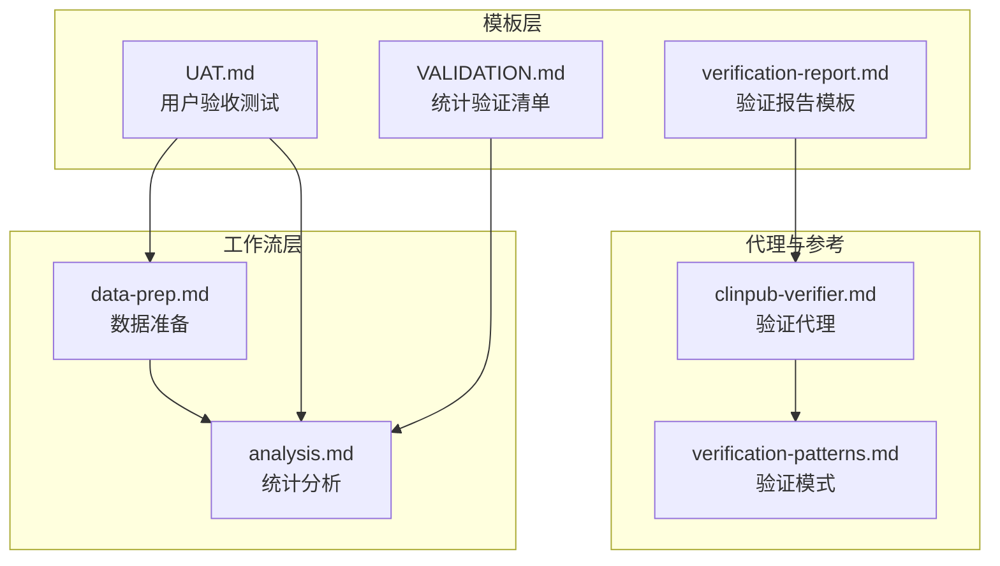
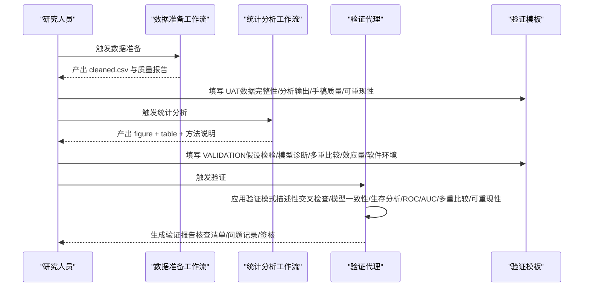
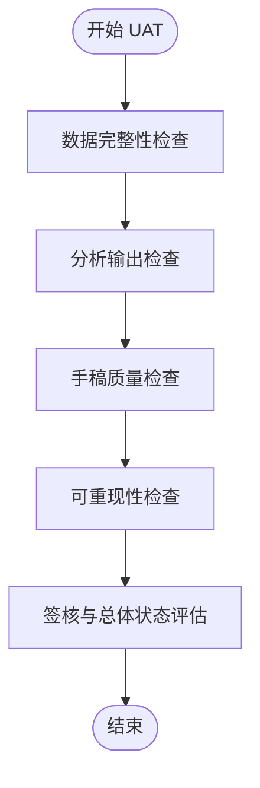
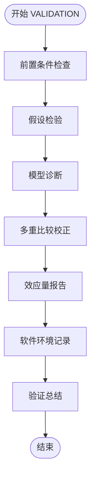
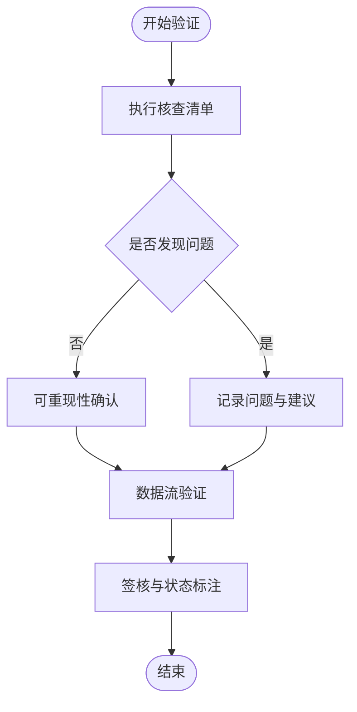
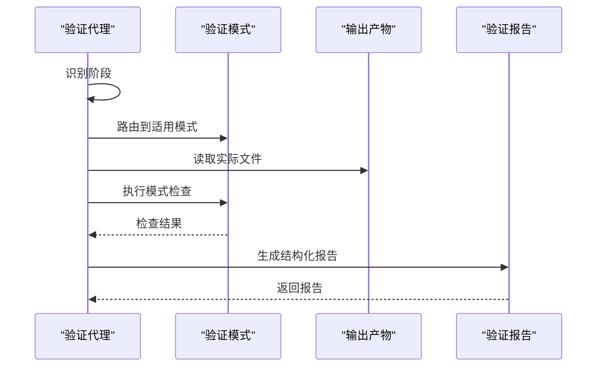
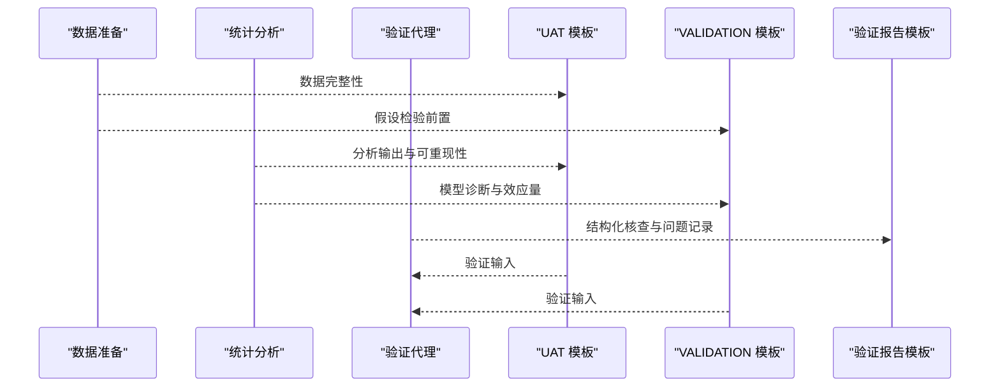
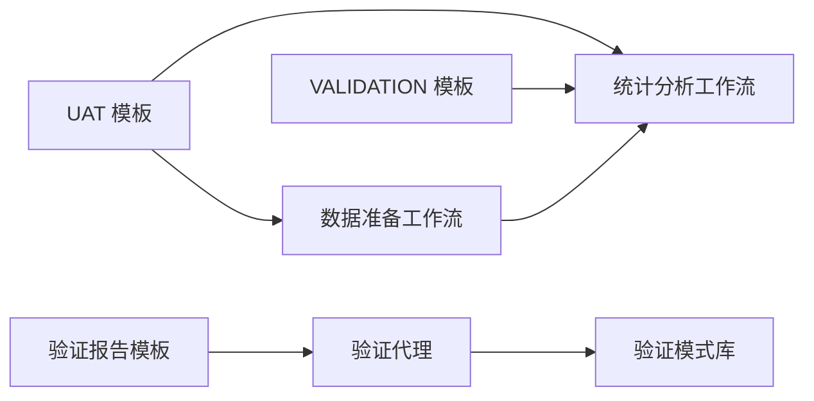

# 验证测试模板

<cite>
**本文档引用的文件**
- [UAT.md](file://pipeline/templates/UAT.md)
- [VALIDATION.md](file://pipeline/templates/VALIDATION.md)
- [verification-report.md](file://pipeline/templates/verification-report.md)
- [TESTING.md](file://docs/TESTING.md)
- [04-INTEGRATION-CHECKLIST.md](file://examples/04-INTEGRATION-CHECKLIST.md)
- [analysis.md](file://pipeline/workflows/analysis.md)
- [data-prep.md](file://pipeline/workflows/data-prep.md)
- [clinpub-verifier.md](file://agents/clinpub-verifier.md)
- [verification-patterns.md](file://pipeline/references/verification-patterns.md)
</cite>

## 目录
1. [简介](#简介)
2. [项目结构](#项目结构)
3. [核心组件](#核心组件)
4. [架构总览](#架构总览)
5. [详细组件分析](#详细组件分析)
6. [依赖关系分析](#依赖关系分析)
7. [性能考虑](#性能考虑)
8. [故障排除指南](#故障排除指南)
9. [结论](#结论)
10. [附录](#附录)

## 简介
本文件系统化阐述验证测试模板的设计理念与使用方法，涵盖用户验收测试（UAT）模板、验证测试模板（VALIDATION）以及验证报告模板。它们分别服务于三个关键质量保障阶段：
- UAT：面向最终交付物的用户验收，确保数据完整性、分析输出、手稿质量与可重现性达到里程碑签核标准。
- VALIDATION：面向统计分析过程的系统性验证，覆盖假设检验、模型诊断、多重比较校正、效应量报告与软件环境记录。
- 验证报告：面向跨阶段的结构化核查与问题追踪，确保统计有效性、可重现性与出版级质量。

这些模板与工作流、代理与参考规范协同，形成从数据准备、统计分析到论文撰写的闭环质量控制体系。

## 项目结构
验证测试模板位于 pipeline/templates 目录，配合工作流（data-prep、analysis）、验证代理（clinpub-verifier）与参考规范（verification-patterns）共同构成验证体系。

**图示来源**
- [UAT.md:1-72](file://pipeline/templates/UAT.md#L1-L72)
- [VALIDATION.md:1-115](file://pipeline/templates/VALIDATION.md#L1-L115)
- [verification-report.md:1-85](file://pipeline/templates/verification-report.md#L1-L85)
- [data-prep.md:1-184](file://pipeline/workflows/data-prep.md#L1-L184)
- [analysis.md:1-289](file://pipeline/workflows/analysis.md#L1-L289)
- [clinpub-verifier.md:1-439](file://agents/clinpub-verifier.md#L1-L439)
- [verification-patterns.md:1-358](file://pipeline/references/verification-patterns.md#L1-L358)

**章节来源**
- [UAT.md:1-72](file://pipeline/templates/UAT.md#L1-L72)
- [VALIDATION.md:1-115](file://pipeline/templates/VALIDATION.md#L1-L115)
- [verification-report.md:1-85](file://pipeline/templates/verification-report.md#L1-L85)
- [data-prep.md:1-184](file://pipeline/workflows/data-prep.md#L1-L184)
- [analysis.md:1-289](file://pipeline/workflows/analysis.md#L1-L289)
- [clinpub-verifier.md:1-439](file://agents/clinpub-verifier.md#L1-L439)
- [verification-patterns.md:1-358](file://pipeline/references/verification-patterns.md#L1-L358)

## 核心组件
- UAT 模板：以测试用例形式定义数据完整性、分析输出、手稿质量与可重现性四项验收条目，支持阶段签核与整体状态评估。
- VALIDATION 模板：面向统计分析的系统性检查清单，覆盖假设检验、模型诊断、多重比较、效应量报告与软件环境记录。
- 验证报告模板：结构化记录核查过程、发现的问题与修复建议，明确可重现性与数据流验证，支持签核与状态标注。

**章节来源**
- [UAT.md:1-72](file://pipeline/templates/UAT.md#L1-L72)
- [VALIDATION.md:1-115](file://pipeline/templates/VALIDATION.md#L1-L115)
- [verification-report.md:1-85](file://pipeline/templates/verification-report.md#L1-L85)

## 架构总览
验证测试模板与工作流、代理及参考规范的协作关系如下：

**图示来源**
- [data-prep.md:100-145](file://pipeline/workflows/data-prep.md#L100-L145)
- [analysis.md:187-235](file://pipeline/workflows/analysis.md#L187-L235)
- [clinpub-verifier.md:33-311](file://agents/clinpub-verifier.md#L33-L311)
- [verification-patterns.md:9-358](file://pipeline/references/verification-patterns.md#L9-L358)
- [UAT.md:15-72](file://pipeline/templates/UAT.md#L15-L72)
- [VALIDATION.md:9-115](file://pipeline/templates/VALIDATION.md#L9-L115)
- [verification-report.md:10-85](file://pipeline/templates/verification-report.md#L10-L85)

## 详细组件分析

### UAT 模板分析
UAT 模板以“测试用例”形式组织，分为四类验收条目：
- 数据完整性：行数、缺失值、变量类型、异常值处理策略等。
- 分析输出：图形与表格文件存在性、分辨率、可读性与解释说明。
- 手稿质量：结构完整性、语言一致性、引用规范、图表标签语言、AI 模板规避。
- 可重现性：从原始数据到清洗、从清洗到分析、随机种子与软件版本记录。

**图示来源**
- [UAT.md:15-72](file://pipeline/templates/UAT.md#L15-L72)

**章节来源**
- [UAT.md:15-72](file://pipeline/templates/UAT.md#L15-L72)

### VALIDATION 模板分析
VALIDATION 模板面向统计分析过程的关键环节：
- 前置条件：加载 cleaned.csv、项目配置、方法确认。
- 假设检验：正态性、方差齐性、Cox 比例风险假设（如适用）。
- 模型诊断：多重共线性（VIF）、模型拟合优度、影响观测值。
- 多重比较：校正方法与显著性结果。
- 效应量报告：效应量、95% 置信区间与精确 p 值。
- 软件环境：语言版本、关键包版本、操作系统信息。
- 总结：分类统计与总体结论。

**图示来源**
- [VALIDATION.md:9-115](file://pipeline/templates/VALIDATION.md#L9-L115)

**章节来源**
- [VALIDATION.md:9-115](file://pipeline/templates/VALIDATION.md#L9-L115)

### 验证报告模板分析
验证报告模板提供结构化核查与问题追踪：
- 已执行核查：描述性交叉检查、模型输出一致性、生存分析一致性、ROC/AUC 有效性、多重比较校正、代码可重现性、数据完整性链、图-表一致性。
- 发现的问题：严重程度、模式编号、描述、证据与建议。
- 可重现性确认：从原始到清洗、从清洗到分析、随机种子、包版本、输出文件匹配。
- 数据流验证：原始数据 → 清洗数据 → 输出图形与表格 → 手稿引用。
- 签核与状态：关键问题解决、警告确认、可重现性确认、数据流验证、验证人与日期、结果状态。

**图示来源**
- [verification-report.md:10-85](file://pipeline/templates/verification-report.md#L10-L85)

**章节来源**
- [verification-report.md:10-85](file://pipeline/templates/verification-report.md#L10-L85)

### 验证代理与验证模式
验证代理采用逆向思维，不信任摘要声明，直接核查实际输出文件，并按阶段路由到相应验证模式：
- 阶段识别：根据 STATE.md 或目录结构判断当前阶段。
- 路由规则：Phase 1（数据准备）→ 模式 9-11；Phase 2（统计分析）→ 模式 1-8；Phase 3（论文撰写）→ 模式 12-15。
- 验证流程：输出完整性、统计有效性、可重现性、图-表一致性、阶段特定规则与总体状态判定。

**图示来源**
- [clinpub-verifier.md:33-311](file://agents/clinpub-verifier.md#L33-L311)
- [verification-patterns.md:9-358](file://pipeline/references/verification-patterns.md#L9-L358)

**章节来源**
- [clinpub-verifier.md:33-311](file://agents/clinpub-verifier.md#L33-L311)
- [verification-patterns.md:9-358](file://pipeline/references/verification-patterns.md#L9-L358)

### 工作流与模板的协同
- 数据准备阶段：产出 cleaned.csv 与数据质量报告，为 UAT 与 VALIDATION 提供基础。
- 统计分析阶段：动态构建分析计划，按依赖顺序执行，生成 figure + table + 方法说明，满足 UAT 与 VALIDATION 的输出要求。
- 验证阶段：验证代理应用验证模式，生成验证报告，支持签核与状态标注。

**图示来源**
- [data-prep.md:100-145](file://pipeline/workflows/data-prep.md#L100-L145)
- [analysis.md:187-235](file://pipeline/workflows/analysis.md#L187-L235)
- [clinpub-verifier.md:33-311](file://agents/clinpub-verifier.md#L33-L311)
- [UAT.md:15-72](file://pipeline/templates/UAT.md#L15-L72)
- [VALIDATION.md:9-115](file://pipeline/templates/VALIDATION.md#L9-L115)
- [verification-report.md:10-85](file://pipeline/templates/verification-report.md#L10-L85)

**章节来源**
- [data-prep.md:100-145](file://pipeline/workflows/data-prep.md#L100-L145)
- [analysis.md:187-235](file://pipeline/workflows/analysis.md#L187-L235)
- [clinpub-verifier.md:33-311](file://agents/clinpub-verifier.md#L33-L311)

## 依赖关系分析
验证测试模板与工作流、代理、参考规范之间存在明确的依赖关系：
- UAT 依赖数据准备与统计分析产出，确保交付物满足验收标准。
- VALIDATION 依赖分析工作流的输出与项目配置，确保统计过程合规。
- 验证报告依赖验证代理的应用模式与实际输出文件，确保核查结果可追溯。
- 验证代理依赖验证模式库，按阶段自动路由并执行核查。

**图示来源**
- [UAT.md:1-72](file://pipeline/templates/UAT.md#L1-L72)
- [VALIDATION.md:1-115](file://pipeline/templates/VALIDATION.md#L1-L115)
- [verification-report.md:1-85](file://pipeline/templates/verification-report.md#L1-L85)
- [data-prep.md:1-184](file://pipeline/workflows/data-prep.md#L1-L184)
- [analysis.md:1-289](file://pipeline/workflows/analysis.md#L1-L289)
- [clinpub-verifier.md:1-439](file://agents/clinpub-verifier.md#L1-L439)
- [verification-patterns.md:1-358](file://pipeline/references/verification-patterns.md#L1-L358)

**章节来源**
- [UAT.md:1-72](file://pipeline/templates/UAT.md#L1-L72)
- [VALIDATION.md:1-115](file://pipeline/templates/VALIDATION.md#L1-L115)
- [verification-report.md:1-85](file://pipeline/templates/verification-report.md#L1-L85)
- [data-prep.md:1-184](file://pipeline/workflows/data-prep.md#L1-L184)
- [analysis.md:1-289](file://pipeline/workflows/analysis.md#L1-L289)
- [clinpub-verifier.md:1-439](file://agents/clinpub-verifier.md#L1-L439)
- [verification-patterns.md:1-358](file://pipeline/references/verification-patterns.md#L1-L358)

## 性能考虑
- 快速文件级验证：优先使用文件存在性、大小、行数等快速检查，避免重复执行计算密集型分析。
- 逆向验证策略：不依赖摘要声明，直接读取实际输出文件，减少误判与返工。
- 分阶段路由：根据阶段自动选择适用的验证模式，避免无关检查带来的开销。
- 可重现性优先：确保随机种子、路径与软件版本记录，降低调试与重跑成本。

## 故障排除指南
- UAT 验收不通过
  - 数据完整性：检查行数、缺失值、变量类型与异常值处理策略是否与文档一致。
  - 分析输出：确认图形与表格文件存在、分辨率达标、解释说明完整。
  - 手稿质量：检查 IMRAD 结构、语言一致性、引用规范与图表标签语言。
  - 可重现性：确认从原始数据到清洗、从清洗到分析的脚本可独立运行，随机种子与软件版本已记录。

- VALIDATION 不通过
  - 假设检验：若变量非正态或方差不齐，需记录所用变换或非参数方法。
  - 模型诊断：关注 VIF、Hosmer-Lemeshow p 值、AUC 与 Nagelkerke R² 等指标。
  - 多重比较：当测试数超过阈值时，必须应用 FDR 或 Bonferroni 校正。
  - 效应量报告：确保效应量、95% CI 与精确 p 值齐全。
  - 软件环境：记录 R/Python 版本、关键包版本与操作系统信息。

- 验证报告问题
  - 核查清单：逐项对照模式，记录失败原因与证据。
  - 问题记录：明确严重程度、模式编号、描述、证据与建议。
  - 可重现性确认：检查脚本运行、随机种子、包版本与输出文件匹配。
  - 数据流验证：确保原始数据到清洗、再到分析的链路完整且无断点。

**章节来源**
- [UAT.md:15-72](file://pipeline/templates/UAT.md#L15-L72)
- [VALIDATION.md:9-115](file://pipeline/templates/VALIDATION.md#L9-L115)
- [verification-report.md:10-85](file://pipeline/templates/verification-report.md#L10-L85)
- [clinpub-verifier.md:17-31](file://agents/clinpub-verifier.md#L17-L31)
- [verification-patterns.md:9-358](file://pipeline/references/verification-patterns.md#L9-L358)

## 结论
验证测试模板通过结构化、可操作的验收条目与核查清单，确保研究结果的正确性、可重现性与出版级质量。UAT 模板聚焦交付物验收，VALIDATION 模板聚焦统计过程合规，验证报告模板提供可追溯的问题记录与签核机制。结合工作流、验证代理与参考规范，形成从数据准备到论文撰写的全链路质量控制体系。

## 附录

### 测试用例设计指南
- 独立性原则：每段测试代码独立运行，不依赖外部环境或其他测试。
- 测试数据：在脚本内定义、最小化、具有代表性并可重复（固定随机种子）。
- 边界条件：覆盖空数据、单行数据、全部缺失等极端情形。
- 测试运行：提供 R 与 Python 的测试运行示例与覆盖率目标。
- 持续集成：提供 GitHub Actions 示例，实现自动化测试。

**章节来源**
- [TESTING.md:1-373](file://docs/TESTING.md#L1-L373)

### 自动化测试脚本示例
- R 单元测试：在脚本内定义测试数据、配置测试环境并验证结果。
- Python 单元测试：使用 pytest 进行测试与覆盖率报告。
- 端到端测试：模拟完整工作流，验证关键路径的产出物。

**章节来源**
- [TESTING.md:15-168](file://docs/TESTING.md#L15-L168)

### 质量评估标准
- UAT：数据完整性、分析输出、手稿质量、可重现性四项验收条目均通过。
- VALIDATION：假设检验、模型诊断、多重比较、效应量报告与软件环境记录完整且合规。
- 验证报告：核查清单完整、问题记录清晰、可重现性与数据流验证通过、签核完备。

**章节来源**
- [UAT.md:15-72](file://pipeline/templates/UAT.md#L15-L72)
- [VALIDATION.md:9-115](file://pipeline/templates/VALIDATION.md#L9-L115)
- [verification-report.md:10-85](file://pipeline/templates/verification-report.md#L10-L85)

### 集成测试检查清单
- 环境检查：确认 R、Python、Node.js、Claude Code 与 clinpub 版本满足最低要求。
- Phase 0-4：逐阶段验证产出物（SC1-SC5），包括 cleaned.csv、分析方法产出、IMRAD 结构与 MANIFEST.yaml。
- 故障排除：针对常见问题（R 包缺失、缺失值处理、MANIFEST 位置、IMRAD 路径、API 密钥、文件格式、checkpoint 恢复、网络超时）提供解决方案。

**章节来源**
- [04-INTEGRATION-CHECKLIST.md:1-398](file://examples/04-INTEGRATION-CHECKLIST.md#L1-L398)