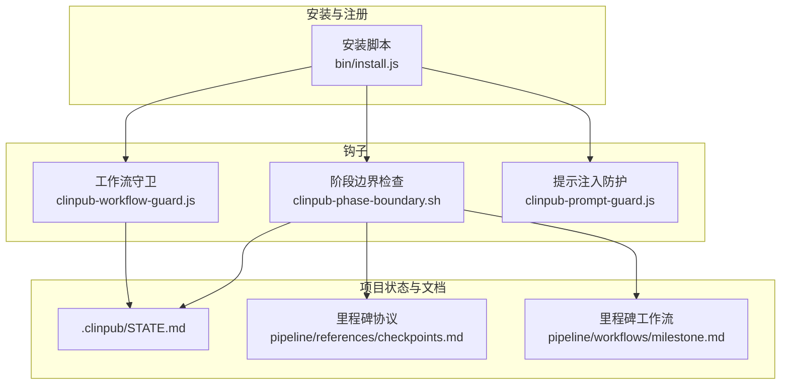
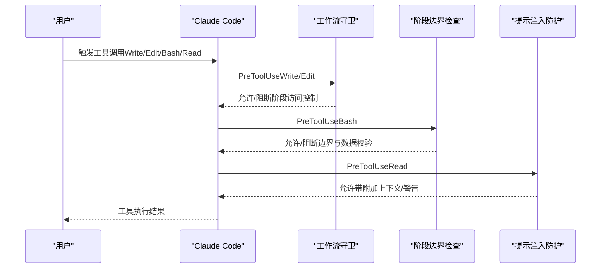
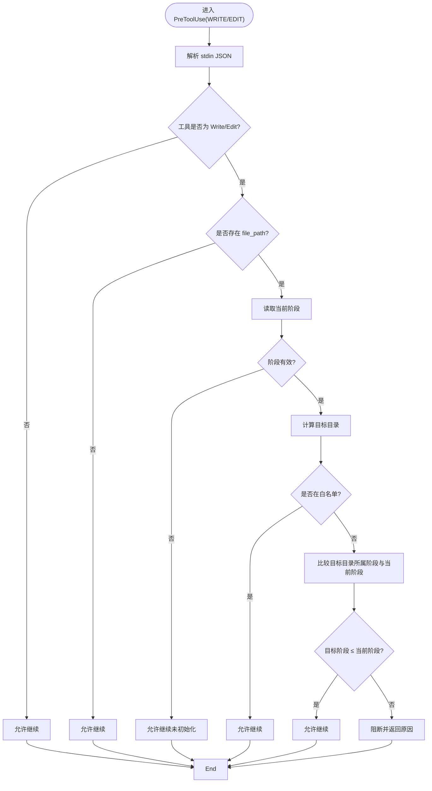
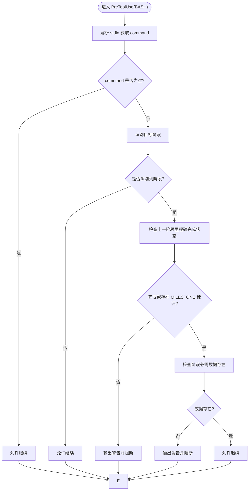
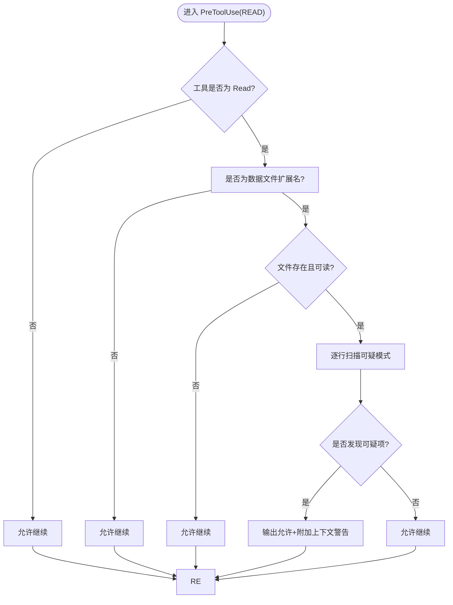
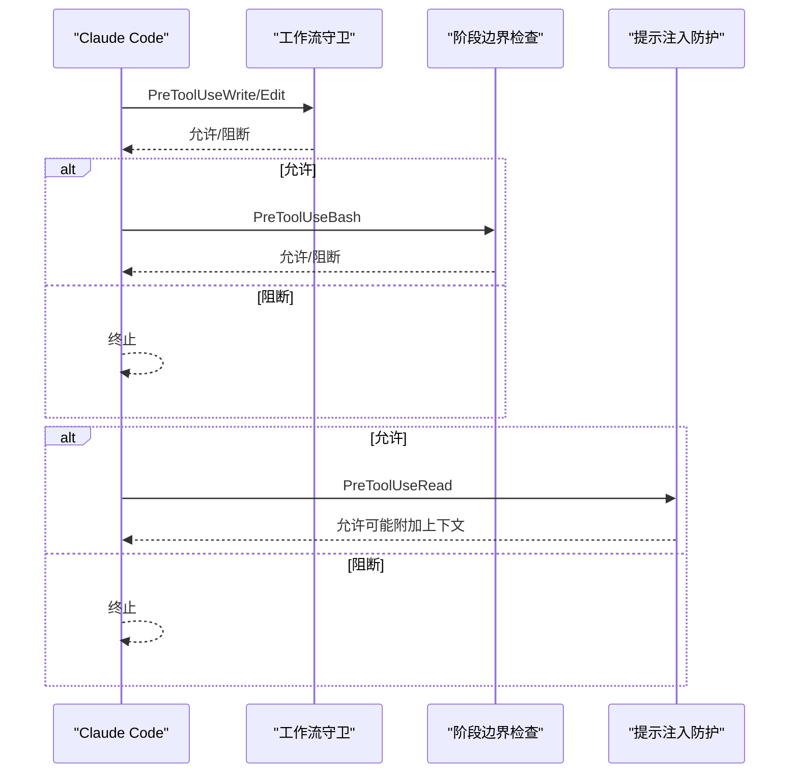
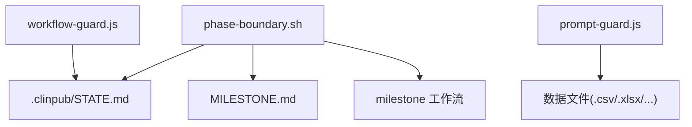

# 安全防护钩子

<cite>
**本文引用的文件**
- [hooks/clinpub-workflow-guard.js](file://hooks/clinpub-workflow-guard.js)
- [hooks/clinpub-phase-boundary.sh](file://hooks/clinpub-phase-boundary.sh)
- [hooks/clinpub-prompt-guard.js](file://hooks/clinpub-prompt-guard.js)
- [bin/install.js](file://bin/install.js)
- [.clinpub/STATE.md](file://.clinpub/STATE.md)
- [README.md](file://README.md)
- [CLAUDE.md](file://CLAUDE.md)
- [pipeline/references/checkpoints.md](file://pipeline/references/checkpoints.md)
- [pipeline/workflows/milestone.md](file://pipeline/workflows/milestone.md)
- [.clinpub/phases/02-断点续做/02-01-PLAN.md](file://.clinpub/phases/02-断点续做/02-01-PLAN.md)
- [.clinpub/phases/01-bug-fixes/01-01-PLAN.md](file://.clinpub/phases/01-bug-fixes/01-01-PLAN.md)
</cite>

## 目录
1. [简介](#简介)
2. [项目结构](#项目结构)
3. [核心组件](#核心组件)
4. [架构总览](#架构总览)
5. [详细组件分析](#详细组件分析)
6. [依赖关系分析](#依赖关系分析)
7. [性能考量](#性能考量)
8. [故障排查指南](#故障排查指南)
9. [结论](#结论)
10. [附录](#附录)

## 简介
本文件面向安全与工程实践，系统化梳理并解读三个Claude Code钩子的安全防护机制：工作流守卫（workflow-guard.js）、阶段边界检查（phase-boundary.sh）、提示注入防护（prompt-guard.js）。文档从触发条件、执行逻辑、安全策略与防护效果入手，深入剖析三者之间的协同机制、错误处理与日志记录，并给出安全事件响应流程、威胁检测与系统加固建议。

## 项目结构
- 钩子集中放置于 hooks/ 目录，分别对应三种安全控制场景：
  - 工作流守卫：限制越阶段写入，保障阶段顺序与数据隔离
  - 阶段边界检查：校验前置里程碑完成状态，防止跳步推进
  - 提示注入防护：扫描数据文件可疑模式，阻断潜在prompt注入
- 安装与注册逻辑由安装脚本负责，将钩子以PreToolUse事件注册到Claude Code技能环境。

**图表来源**
- [hooks/clinpub-workflow-guard.js:1-134](file://hooks/clinpub-workflow-guard.js#L1-L134)
- [hooks/clinpub-phase-boundary.sh:1-153](file://hooks/clinpub-phase-boundary.sh#L1-L153)
- [hooks/clinpub-prompt-guard.js:1-162](file://hooks/clinpub-prompt-guard.js#L1-L162)
- [bin/install.js:149-167](file://bin/install.js#L149-L167)
- [.clinpub/STATE.md](file://.clinpub/STATE.md)
- [pipeline/references/checkpoints.md:1-120](file://pipeline/references/checkpoints.md#L1-L120)
- [pipeline/workflows/milestone.md:96-140](file://pipeline/workflows/milestone.md#L96-L140)

**章节来源**
- [README.md:131-140](file://README.md#L131-L140)
- [CLAUDE.md:63-66](file://CLAUDE.md#L63-L66)
- [bin/install.js:149-167](file://bin/install.js#L149-L167)

## 核心组件
- 工作流守卫（workflow-guard.js）
  - 作用：在Write/Edit工具使用前，基于项目阶段与目录归属进行访问控制，阻止越阶段写入
  - 触发：PreToolUse事件，工具名为Write/Edit
  - 关键策略：阶段状态读取、目录归属映射、白名单目录放行、严格的时间序约束
- 阶段边界检查（phase-boundary.sh）
  - 作用：在Bash工具使用前，识别目标阶段并校验前置里程碑完成状态与必要数据存在性
  - 触发：PreToolUse事件，工具名为Bash
  - 关键策略：命令模式识别、里程碑状态检查、数据存在性校验、门禁提示与阻断
- 提示注入防护（prompt-guard.js）
  - 作用：在Read工具使用前，扫描CSV/XLSX等数据文件可疑模式，发出警告并允许继续
  - 触发：PreToolUse事件，工具名为Read，且文件扩展名属于数据文件
  - 关键策略：多类注入模式检测、长字符串与Base64启发式、Unicode同形异义字符、上下文附加

**章节来源**
- [hooks/clinpub-workflow-guard.js:1-134](file://hooks/clinpub-workflow-guard.js#L1-L134)
- [hooks/clinpub-phase-boundary.sh:1-153](file://hooks/clinpub-phase-boundary.sh#L1-L153)
- [hooks/clinpub-prompt-guard.js:1-162](file://hooks/clinpub-prompt-guard.js#L1-L162)

## 架构总览
三者共同构成“阶段顺序+边界校验+数据安全”的闭环：
- workflow-guard.js确保写入操作遵循阶段顺序，防止越权写入
- phase-boundary.sh确保分析命令在前置里程碑完成后再执行，避免跳步推进
- prompt-guard.js在数据进入上下文前进行注入检测，降低prompt注入风险

**图表来源**
- [hooks/clinpub-workflow-guard.js:84-131](file://hooks/clinpub-workflow-guard.js#L84-L131)
- [hooks/clinpub-phase-boundary.sh:106-150](file://hooks/clinpub-phase-boundary.sh#L106-L150)
- [hooks/clinpub-prompt-guard.js:108-159](file://hooks/clinpub-prompt-guard.js#L108-L159)

## 详细组件分析

### 工作流守卫（workflow-guard.js）
- 触发条件
  - 事件：PreToolUse
  - 工具：Write/Edit
  - 输入：stdin JSON包含tool_name与tool_input（含file_path）
- 执行逻辑
  - 读取项目阶段：从STATE.md提取结构化“阶段：Phase X”行，若不存在则回退至历史标记计数
  - 目录归属：根据文件相对路径首段判断所属阶段目录
  - 白名单放行：.clinpub、scripts、hooks、pipeline、agents、commands等始终允许
  - 访问判定：若目标目录属于更高阶段，则阻断并返回原因；否则允许
- 安全策略
  - 严格阶段顺序：禁止越阶段写入，避免破坏阶段工件完整性
  - 结构化状态解析：精确匹配结构化行，降低STATE.md被篡改的影响
  - 错误回退：解析异常时允许，避免阻断正常流程
- 防护效果
  - 阻止跨阶段写入，减少数据污染与状态漂移
  - 降低误操作导致的流程破坏风险

**图表来源**
- [hooks/clinpub-workflow-guard.js:25-77](file://hooks/clinpub-workflow-guard.js#L25-L77)
- [hooks/clinpub-workflow-guard.js:84-131](file://hooks/clinpub-workflow-guard.js#L84-L131)

**章节来源**
- [hooks/clinpub-workflow-guard.js:1-134](file://hooks/clinpub-workflow-guard.js#L1-L134)
- [.clinpub/STATE.md](file://.clinpub/STATE.md)
- [.clinpub/phases/01-bug-fixes/01-01-PLAN.md:141-155](file://.clinpub/phases/01-bug-fixes/01-01-PLAN.md#L141-L155)

### 阶段边界检查（phase-boundary.sh）
- 触发条件
  - 事件：PreToolUse
  - 工具：Bash
  - 输入：stdin JSON包含command字段
- 执行逻辑
  - 命令识别：根据命令内容匹配目标阶段（分析/数据准备/写作/评审）
  - 边界校验：检查STATE.md或MILESTONE.md中上一阶段完成标记
  - 数据存在性：针对不同阶段检查必需工件是否存在
  - 输出协议：允许时输出标准JSON；阻断时stderr输出JSON并退出码2
- 安全策略
  - 门禁机制：前置里程碑未完成则阻断，强制完成关键交付物
  - 多源验证：同时检查STATE.md与MILESTONE.md，提升鲁棒性
  - 警告提示：在阻断前输出颜色化提示，引导用户完成里程碑
- 防护效果
  - 防止跳步推进，确保阶段间质量门控
  - 降低因缺失关键工件导致的分析失败风险

**图表来源**
- [hooks/clinpub-phase-boundary.sh:34-71](file://hooks/clinpub-phase-boundary.sh#L34-L71)
- [hooks/clinpub-phase-boundary.sh:73-104](file://hooks/clinpub-phase-boundary.sh#L73-L104)
- [hooks/clinpub-phase-boundary.sh:106-150](file://hooks/clinpub-phase-boundary.sh#L106-L150)

**章节来源**
- [hooks/clinpub-phase-boundary.sh:1-153](file://hooks/clinpub-phase-boundary.sh#L1-L153)
- [pipeline/references/checkpoints.md:77-119](file://pipeline/references/checkpoints.md#L77-L119)
- [pipeline/workflows/milestone.md:96-140](file://pipeline/workflows/milestone.md#L96-L140)

### 提示注入防护（prompt-guard.js）
- 触发条件
  - 事件：PreToolUse
  - 工具：Read
  - 文件：CSV/XLSX/TSV/TXT等数据文件
- 执行逻辑
  - 文件类型判断：仅对数据文件进行扫描
  - 内容扫描：逐行匹配多种注入模式（指令注入、系统标签、XML/HTML标签、超长文本、Base64、Unicode同形异义字符）
  - 结果处理：若发现可疑项，输出允许但携带附加上下文警告；否则允许
- 安全策略
  - 多模式检测：覆盖常见注入手法与启发式可疑特征
  - 保守处理：即使检测到风险也允许继续，仅附加警告，避免阻断正常流程
  - 错误回退：解析异常时允许，保证稳定性
- 防护效果
  - 降低数据驱动的提示注入风险，提升上下文安全性

**图表来源**
- [hooks/clinpub-prompt-guard.js:55-93](file://hooks/clinpub-prompt-guard.js#L55-L93)
- [hooks/clinpub-prompt-guard.js:108-159](file://hooks/clinpub-prompt-guard.js#L108-L159)

**章节来源**
- [hooks/clinpub-prompt-guard.js:1-162](file://hooks/clinpub-prompt-guard.js#L1-L162)

### 三者协调机制
- 事件与工具匹配
  - workflow-guard.js：PreToolUse + Write/Edit
  - phase-boundary.sh：PreToolUse + Bash
  - prompt-guard.js：PreToolUse + Read
- 注册与执行顺序
  - 安装脚本将三者以PreToolUse事件注册，Claude Code按注册顺序依次执行
  - 任一钩子阻断（退出码2）将终止后续执行
- 状态与文档协同
  - workflow-guard.js依赖STATE.md的权威阶段状态
  - phase-boundary.sh依赖STATE.md与MILESTONE.md的里程碑状态
  - 两者共同确保阶段推进的严谨性

**图表来源**
- [bin/install.js:162-166](file://bin/install.js#L162-L166)
- [hooks/clinpub-workflow-guard.js:84-131](file://hooks/clinpub-workflow-guard.js#L84-L131)
- [hooks/clinpub-phase-boundary.sh:106-150](file://hooks/clinpub-phase-boundary.sh#L106-L150)
- [hooks/clinpub-prompt-guard.js:108-159](file://hooks/clinpub-prompt-guard.js#L108-L159)

**章节来源**
- [bin/install.js:149-167](file://bin/install.js#L149-L167)

## 依赖关系分析
- 外部依赖
  - 环境变量：PROJECT_DIR（用于定位项目根目录）
  - 文件系统：.clinpub/STATE.md、.clinpub/phases/*/MILESTONE.md、各阶段工件目录
- 内部耦合
  - workflow-guard.js与phase-boundary.sh共享阶段状态来源（STATE.md）
  - phase-boundary.sh依赖里程碑模板与工作流（MILESTONE.md、milestone工作流）
  - prompt-guard.js依赖数据文件类型与内容扫描规则

**图表来源**
- [hooks/clinpub-workflow-guard.js:14-23](file://hooks/clinpub-workflow-guard.js#L14-L23)
- [hooks/clinpub-phase-boundary.sh:16-18](file://hooks/clinpub-phase-boundary.sh#L16-L18)
- [pipeline/workflows/milestone.md:96-140](file://pipeline/workflows/milestone.md#L96-L140)
- [hooks/clinpub-prompt-guard.js:48-49](file://hooks/clinpub-prompt-guard.js#L48-L49)

**章节来源**
- [hooks/clinpub-workflow-guard.js:14-23](file://hooks/clinpub-workflow-guard.js#L14-L23)
- [hooks/clinpub-phase-boundary.sh:16-18](file://hooks/clinpub-phase-boundary.sh#L16-L18)
- [hooks/clinpub-prompt-guard.js:48-49](file://hooks/clinpub-prompt-guard.js#L48-L49)

## 性能考量
- 执行开销
  - workflow-guard.js：读取STATE.md并进行正则匹配，复杂度O(n)，n为文件行数
  - phase-boundary.sh：命令解析与文件系统查询，复杂度取决于匹配与查找
  - prompt-guard.js：逐行扫描，复杂度O(m)，m为行数；对大文件存在线性开销
- 优化建议
  - 对大文件采用分块读取或跳过非关键行
  - 缓存STATE.md与MILESTONE.md最近读取结果，减少重复IO
  - 限制扫描范围（如仅扫描前若干KB或特定列）

## 故障排查指南
- workflow-guard.js
  - 现象：写入被阻断
  - 排查：确认STATE.md中是否存在结构化“阶段：Phase X”行；检查目标目录是否属于更高阶段；核对白名单目录
  - 参考：结构化解析与回退逻辑、PHASE_MAP映射
- phase-boundary.sh
  - 现象：分析命令被阻断
  - 排查：检查STATE.md或MILESTONE.md中上一阶段是否标记为完成；确认必需工件是否存在
  - 参考：里程碑检查与数据存在性校验
- prompt-guard.js
  - 现象：读取数据文件时出现警告
  - 排查：检查可疑模式匹配结果；确认文件编码与格式；必要时人工核查可疑行
  - 参考：多模式检测规则与附加上下文输出
- 通用
  - 日志：钩子均通过标准输出/错误输出返回JSON协议，阻断时stderr输出并退出码2
  - 安装：确认安装脚本已正确注册PreToolUse钩子

**章节来源**
- [hooks/clinpub-workflow-guard.js:125-129](file://hooks/clinpub-workflow-guard.js#L125-L129)
- [hooks/clinpub-phase-boundary.sh:135-147](file://hooks/clinpub-phase-boundary.sh#L135-L147)
- [hooks/clinpub-prompt-guard.js:154-157](file://hooks/clinpub-prompt-guard.js#L154-L157)
- [bin/install.js:169-211](file://bin/install.js#L169-L211)

## 结论
三者形成“阶段顺序控制—边界校验—数据安全”的纵深防御体系。workflow-guard.js确保写入合规，phase-boundary.sh确保推进有序，prompt-guard.js降低数据侧注入风险。通过严格的注册机制与稳健的错误回退策略，系统在保障安全性的同时维持了较高的可用性与可维护性。

## 附录
- 安全事件响应流程（建议）
  - 发现阻断：记录事件（工具、阶段、原因）、回溯STATE.md与MILESTONE.md状态
  - 发现警告：记录可疑模式与文件位置，人工复核并修正
  - 修复与加固：更新钩子规则、补充里程碑检查、优化安装脚本注册
- 威胁检测与加固建议
  - 威胁建模：参考Phase 2与Phase 1的STRIDE威胁登记，关注Tampering、Spoofing、DoS等
  - 加固措施：强化STATE.md与MILESTONE.md的完整性校验、引入更严格的白名单匹配、增加审计日志

**章节来源**
- [.clinpub/phases/02-断点续做/02-01-PLAN.md:436-443](file://.clinpub/phases/02-断点续做/02-01-PLAN.md#L436-L443)
- [.clinpub/phases/01-bug-fixes/01-01-PLAN.md:141-155](file://.clinpub/phases/01-bug-fixes/01-01-PLAN.md#L141-L155)
- [pipeline/references/checkpoints.md:1-120](file://pipeline/references/checkpoints.md#L1-L120)