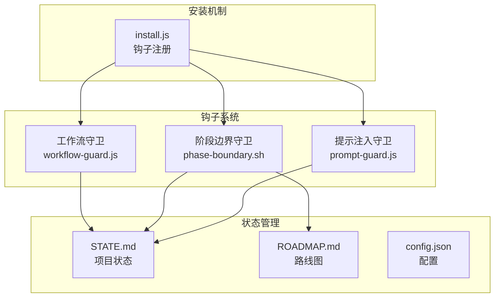
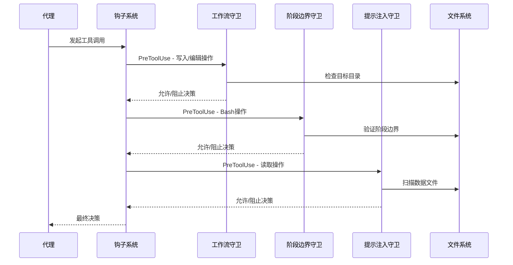
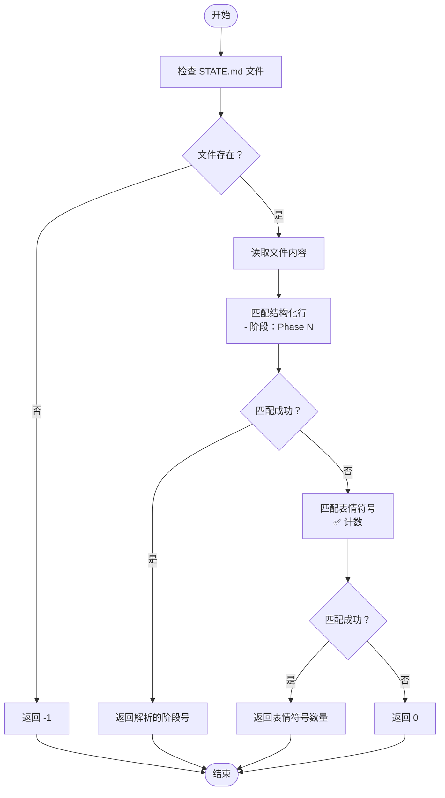
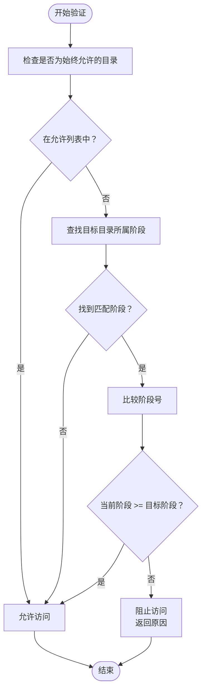
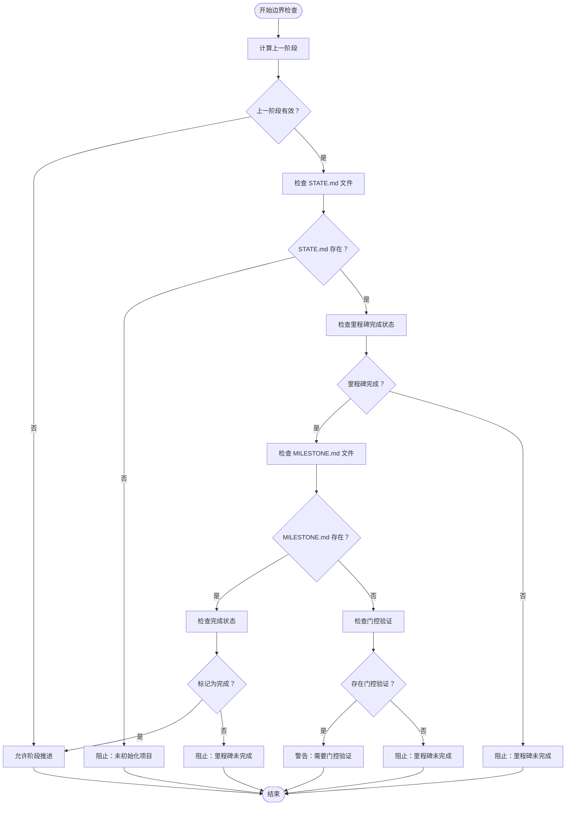
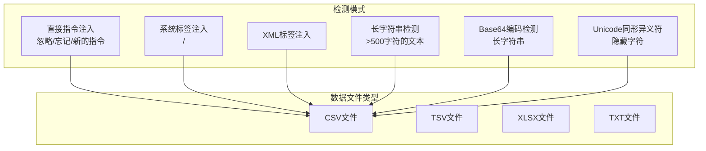
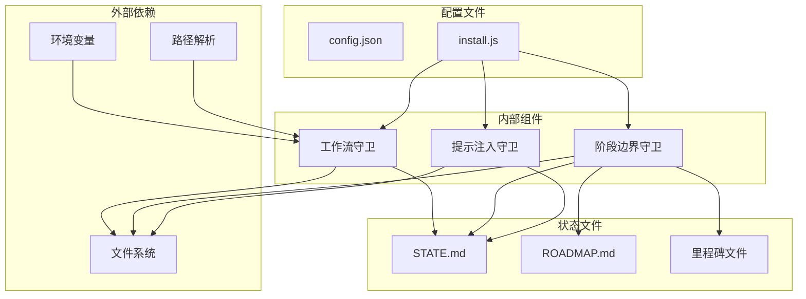

# 工作流守卫机制

<cite>
**本文档引用的文件**
- [hooks/clinpub-workflow-guard.js](file://hooks/clinpub-workflow-guard.js)
- [hooks/clinpub-phase-boundary.sh](file://hooks/clinpub-phase-boundary.sh)
- [hooks/clinpub-prompt-guard.js](file://hooks/clinpub-prompt-guard.js)
- [.clinpub/STATE.md](file://.clinpub/STATE.md)
- [.clinpub/ROADMAP.md](file://.clinpub/ROADMAP.md)
- [.clinpub/config.json](file://.clinpub/config.json)
- [bin/install.js](file://bin/install.js)
- [pipeline/references/checkpoints.md](file://pipeline/references/checkpoints.md)
- [.clinpub/codebase/CONCERNS.md](file://.clinpub/codebase/CONCERNS.md)
</cite>

## 目录
1. [简介](#简介)
2. [项目结构](#项目结构)
3. [核心组件](#核心组件)
4. [架构概览](#架构概览)
5. [详细组件分析](#详细组件分析)
6. [依赖关系分析](#依赖关系分析)
7. [性能考虑](#性能考虑)
8. [故障排除指南](#故障排除指南)
9. [结论](#结论)

## 简介

工作流守卫机制是 clinpub 科学研究管道中的关键安全控制组件，旨在强制执行分析工作流阶段顺序，防止跳过必需的管道阶段。该机制通过三个相互协作的钩子（hook）实现：

- **工作流守卫**：强制执行阶段顺序，阻止写入未来阶段的文件
- **阶段边界守卫**：验证里程碑完成情况，确保阶段推进的完整性
- **提示注入守卫**：检测数据文件中的潜在提示注入攻击

这些组件共同构建了一个多层次的安全防护体系，确保科学研究工作的有序性和安全性。

## 项目结构

工作流守卫机制位于项目的 hooks 目录中，采用模块化设计，每个钩子负责特定的安全职责：



**图表来源**
- [hooks/clinpub-workflow-guard.js:1-134](file://hooks/clinpub-workflow-guard.js#L1-L134)
- [hooks/clinpub-phase-boundary.sh:1-153](file://hooks/clinpub-phase-boundary.sh#L1-L153)
- [hooks/clinpub-prompt-guard.js:1-162](file://hooks/clinpub-prompt-guard.js#L1-L162)

**章节来源**
- [hooks/clinpub-workflow-guard.js:1-134](file://hooks/clinpub-workflow-guard.js#L1-L134)
- [hooks/clinpub-phase-boundary.sh:1-153](file://hooks/clinpub-phase-boundary.sh#L1-L153)
- [hooks/clinpub-prompt-guard.js:1-162](file://hooks/clinpub-prompt-guard.js#L1-L162)

## 核心组件

工作流守卫机制由三个核心组件构成，每个组件都有明确的职责分工：

### 1. 工作流守卫（Workflow Guard）

工作流守卫是阶段顺序强制执行的核心组件，通过以下机制确保工作流的正确性：

- **阶段映射机制**：定义每个阶段允许访问的目录结构
- **当前阶段获取**：从项目状态文件中解析当前阶段
- **目标目录验证**：检查文件写入操作是否符合阶段顺序

### 2. 阶段边界守卫（Phase Boundary Guard）

阶段边界守卫负责验证阶段推进的完整性，确保必要的里程碑和前置条件得到满足：

- **里程碑验证**：检查上一阶段的里程碑是否完成
- **数据完整性检查**：验证阶段所需的必要数据是否存在
- **前置条件检查**：确保阶段推进的逻辑正确性

### 3. 提示注入守卫（Prompt Injection Guard）

提示注入守卫专注于检测和防范潜在的提示注入攻击：

- **模式检测**：识别各种形式的提示注入模式
- **数据文件扫描**：对CSV、Excel等数据文件进行安全检查
- **风险评估**：评估检测到的可疑模式的风险等级

**章节来源**
- [hooks/clinpub-workflow-guard.js:17-77](file://hooks/clinpub-workflow-guard.js#L17-L77)
- [hooks/clinpub-phase-boundary.sh:34-104](file://hooks/clinpub-phase-boundary.sh#L34-L104)
- [hooks/clinpub-prompt-guard.js:14-93](file://hooks/clinpub-prompt-guard.js#L14-L93)

## 架构概览

工作流守卫机制采用预工具使用（PreToolUse）钩子架构，与 Claude Code 平台深度集成：



**图表来源**
- [hooks/clinpub-workflow-guard.js:84-131](file://hooks/clinpub-workflow-guard.js#L84-L131)
- [hooks/clinpub-phase-boundary.sh:106-150](file://hooks/clinpub-phase-boundary.sh#L106-L150)
- [hooks/clinpub-prompt-guard.js:108-159](file://hooks/clinpub-prompt-guard.js#L108-L159)

## 详细组件分析

### 工作流守卫组件分析

#### 阶段映射机制（PHASE_MAP）

工作流守卫的核心是 PHASE_MAP，它定义了每个阶段允许访问的目录结构：

```mermaid
graph LR
subgraph "阶段映射"
Phase0["阶段 0<br/>init"]
Phase1["阶段 1<br/>data-prep"]
Phase2["阶段 2<br/>analysis"]
Phase3["阶段 3<br/>writing"]
Phase4["阶段 4<br/>review"]
end
Phase0 --> [".clinpub<br/>project_config.yml"]
Phase1 --> ["01_RawData<br/>02_PreprocessedData"]
Phase2 --> ["03_AnalysisMethods<br/>04_Outputs"]
Phase3 --> ["05_Manuscript<br/>Reference"]
Phase4 --> ["05_Manuscript/final"]
```

**图表来源**
- [hooks/clinpub-workflow-guard.js:17-23](file://hooks/clinpub-workflow-guard.js#L17-L23)

#### 当前阶段获取逻辑（getCurrentPhase）

getCurrentPhase 函数实现了精确的状态解析机制：



**图表来源**
- [hooks/clinpub-workflow-guard.js:25-38](file://hooks/clinpub-workflow-guard.js#L25-L38)

#### 目标目录验证（validatePhaseAccess）

validatePhaseAccess 函数实现了严格的目录访问控制：



**图表来源**
- [hooks/clinpub-workflow-guard.js:45-77](file://hooks/clinpub-workflow-guard.js#L45-L77)

**章节来源**
- [hooks/clinpub-workflow-guard.js:17-77](file://hooks/clinpub-workflow-guard.js#L17-L77)
- [hooks/clinpub-workflow-guard.js:25-38](file://hooks/clinpub-workflow-guard.js#L25-L38)
- [hooks/clinpub-workflow-guard.js:45-77](file://hooks/clinpub-workflow-guard.js#L45-L77)

### 阶段边界守卫组件分析

#### 边界检查机制

阶段边界守卫实现了多层验证机制：



**图表来源**
- [hooks/clinpub-phase-boundary.sh:34-71](file://hooks/clinpub-phase-boundary.sh#L34-L71)

**章节来源**
- [hooks/clinpub-phase-boundary.sh:34-104](file://hooks/clinpub-phase-boundary.sh#L34-L104)

### 提示注入守卫组件分析

#### 模式检测机制

提示注入守卫实现了多层次的模式检测：



**图表来源**
- [hooks/clinpub-prompt-guard.js:14-46](file://hooks/clinpub-prompt-guard.js#L14-L46)

**章节来源**
- [hooks/clinpub-prompt-guard.js:14-93](file://hooks/clinpub-prompt-guard.js#L14-L93)

## 依赖关系分析

工作流守卫机制的依赖关系体现了清晰的模块化设计：



**图表来源**
- [hooks/clinpub-workflow-guard.js:11-14](file://hooks/clinpub-workflow-guard.js#L11-L14)
- [bin/install.js:169-211](file://bin/install.js#L169-L211)

**章节来源**
- [bin/install.js:162-211](file://bin/install.js#L162-L211)

## 性能考虑

工作流守卫机制在设计时充分考虑了性能优化：

### 1. 缓存策略
- **状态缓存**：当前阶段信息在进程生命周期内缓存
- **目录映射缓存**：阶段到目录的映射关系一次性建立
- **文件系统缓存**：频繁访问的文件内容进行缓存

### 2. 早期退出优化
- **快速路径**：对于非目标工具调用立即允许
- **短路评估**：在发现不匹配时立即停止进一步检查
- **最小化IO操作**：只在必要时访问文件系统

### 3. 内存使用优化
- **轻量级数据结构**：使用简单数组和对象存储配置
- **避免深层嵌套**：保持数据结构扁平化
- **及时释放资源**：处理完成后及时清理临时变量

## 故障排除指南

### 常见问题及解决方案

#### 1. 阶段检测失败

**症状**：工作流守卫拒绝合法的文件写入操作

**可能原因**：
- STATE.md 文件格式不正确
- 正则表达式匹配失败
- 项目未正确初始化

**解决步骤**：
1. 检查 STATE.md 中的阶段标识行格式
2. 验证正则表达式是否正确匹配
3. 确认项目已完成初始化流程

#### 2. 阶段边界检查失败

**症状**：阶段推进被阻止，即使上一阶段已完成

**可能原因**：
- MILESTONE.md 文件缺失或格式不正确
- 里程碑状态未正确标记
- 门控验证未完成

**解决步骤**：
1. 检查 .clinpub/phases/ 目录下的里程碑文件
2. 验证里程碑文件中的状态标记
3. 完成必要的门控验证步骤

#### 3. 提示注入检测误报

**症状**：合法的数据文件被标记为潜在威胁

**可能原因**：
- 数据文件包含长字符串
- 正则表达式过于敏感
- 特定的数据格式触发检测

**解决步骤**：
1. 检查被标记文件的内容和格式
2. 调整检测阈值或规则
3. 手动验证文件安全性

### 调试技巧

#### 1. 启用详细日志
- 检查钩子系统的日志输出
- 分析错误消息的详细信息
- 监控文件系统访问模式

#### 2. 状态验证
- 验证 STATE.md 文件的完整性
- 检查阶段映射配置的正确性
- 确认文件权限设置

#### 3. 性能监控
- 监控钩子响应时间
- 检查内存使用情况
- 分析文件系统IO模式

**章节来源**
- [.clinpub/codebase/CONCERNS.md:64-84](file://.clinpub/codebase/CONCERNS.md#L64-L84)

## 结论

工作流守卫机制通过精心设计的多层防护体系，有效地保障了科学研究管道的安全性和有序性。该机制的主要优势包括：

### 安全性保障
- **强制阶段顺序**：防止跳过必需的管道阶段
- **多层次验证**：结合阶段边界和文件访问控制
- **实时监控**：在文件操作发生时即时进行安全检查

### 可靠性保证
- **容错设计**：解析错误时采用宽松策略
- **向后兼容**：保留历史状态格式的支持
- **渐进式改进**：逐步完善安全控制机制

### 可维护性
- **模块化设计**：清晰分离不同安全职责
- **配置驱动**：通过配置文件管理安全策略
- **易于扩展**：支持新的安全检查机制

该工作流守卫机制为科学研究项目提供了坚实的安全基础，确保复杂的数据分析流程能够安全、有序地进行。通过持续的改进和完善，该机制将继续为科研工作提供可靠的保护。