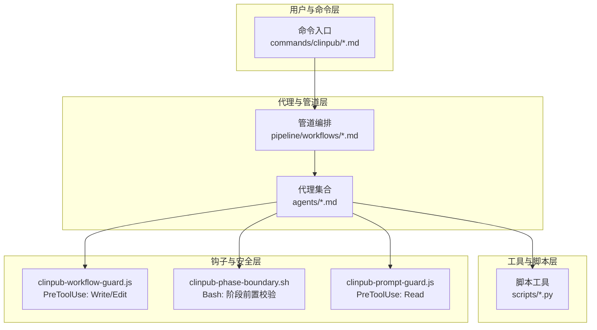
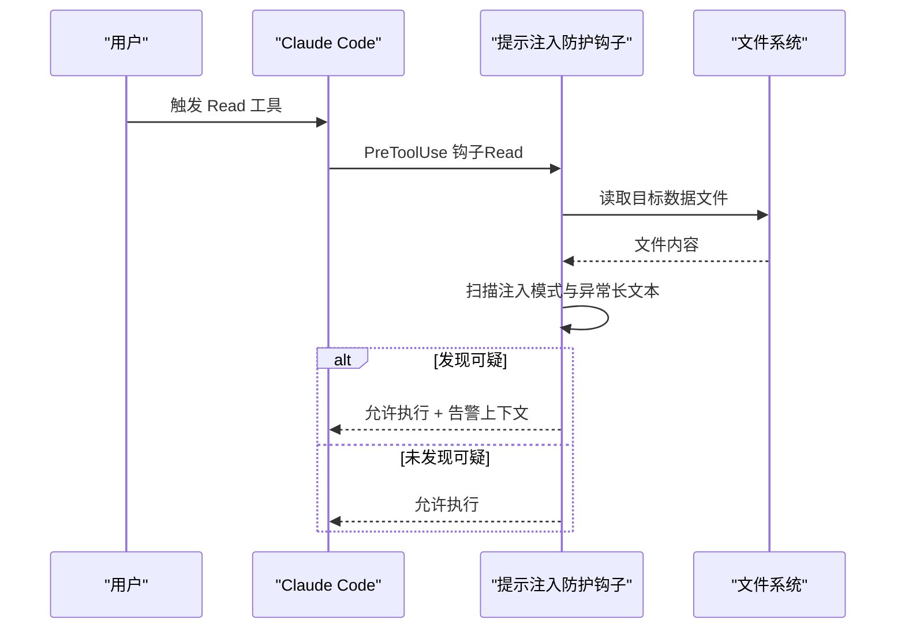
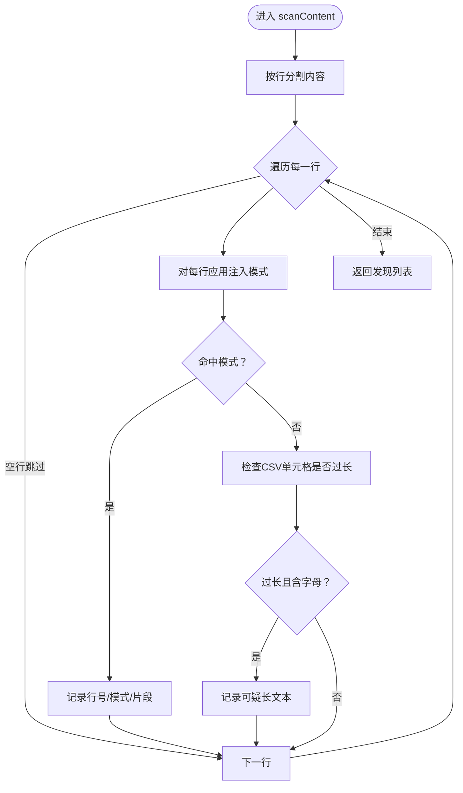
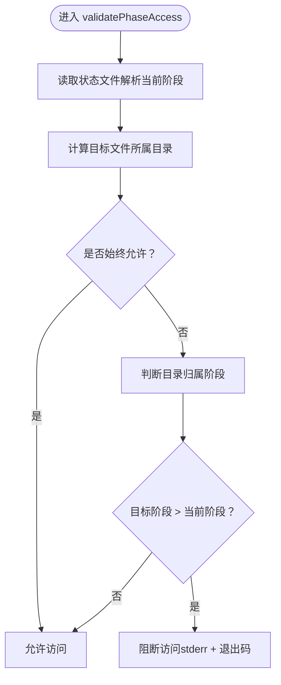
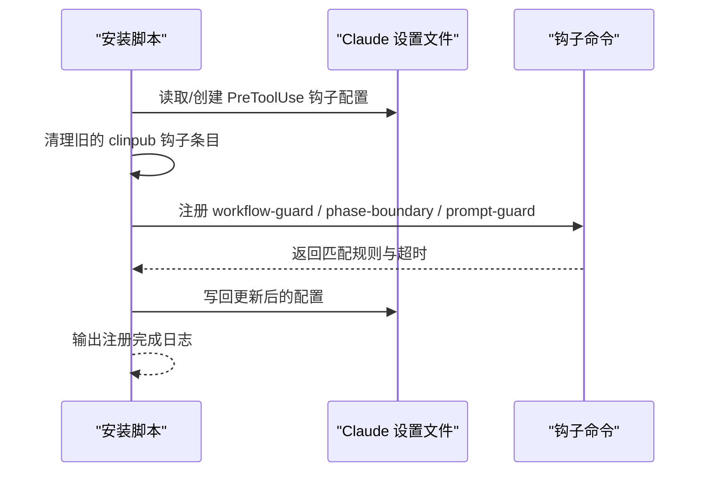
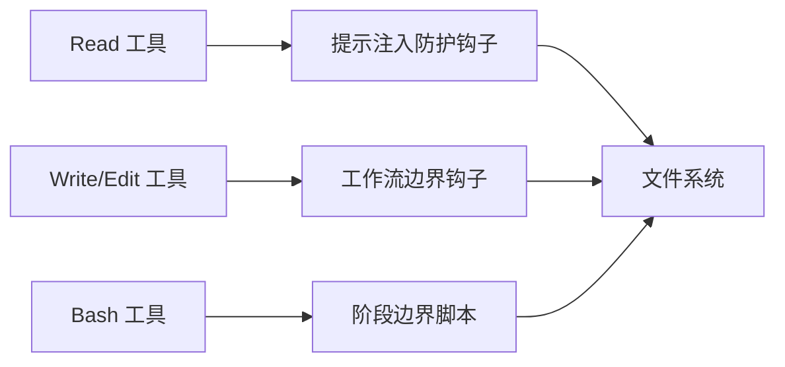

# 提示注入防护

<cite>
**本文引用的文件**
- [hooks/clinpub-prompt-guard.js](file://hooks/clinpub-prompt-guard.js)
- [hooks/clinpub-workflow-guard.js](file://hooks/clinpub-workflow-guard.js)
- [bin/install.js](file://bin/install.js)
- [README.md](file://README.md)
- [CLAUDE.md](file://CLAUDE.md)
- [CHANGELOG.md](file://CHANGELOG.md)
- [docs/ARCHITECTURE.md](file://docs/ARCHITECTURE.md)
</cite>

## 目录
1. [简介](#简介)
2. [项目结构](#项目结构)
3. [核心组件](#核心组件)
4. [架构总览](#架构总览)
5. [详细组件分析](#详细组件分析)
6. [依赖关系分析](#依赖关系分析)
7. [性能考量](#性能考量)
8. [故障排查指南](#故障排查指南)
9. [结论](#结论)
10. [附录](#附录)

## 简介
本文件聚焦于提示注入防护，系统性阐述 clinpub 项目中“提示注入防护”机制的设计与实现，重点围绕 hooks/clinpub-prompt-guard.js 的威胁检测算法、内容安全检查机制与防护策略展开，并结合工作流边界保护与安装注册流程，形成完整的安全闭环。该机制通过在 Claude Code 的 PreToolUse 钩子中拦截 Read 操作，对数据文件进行启发式与正则扫描，识别潜在的提示注入模式与异常长文本，从而在上下文进入 AI 代理前阻断恶意输入风险。

## 项目结构
clinpub 采用分层架构，其中 hooks/*.js/*.sh 作为工作流与安全边界的关键组件，贯穿 Phase 0–4 的执行过程。提示注入防护位于 hooks 层，作为 PreToolUse 钩子在 Read 操作触发，配合工作流边界钩子与安装注册流程共同构成安全基线。

**图表来源**
- [README.md: 20-45:20-45](file://README.md#L20-L45)
- [CLAUDE.md: 9-23:9-23](file://CLAUDE.md#L9-L23)

**章节来源**
- [README.md: 20-45:20-45](file://README.md#L20-L45)
- [CLAUDE.md: 9-23:9-23](file://CLAUDE.md#L9-L23)

## 核心组件
- 提示注入防护钩子（clinpub-prompt-guard.js）
  - 触发时机：PreToolUse 钩子，Read 工具调用前
  - 功能：扫描数据文件内容，识别提示注入相关模式与异常长文本，输出告警但不阻断执行
- 工作流边界防护钩子（clinpub-workflow-guard.js）
  - 触发时机：PreToolUse 钩子，Write/Edit 工具调用前
  - 功能：强制阶段顺序，禁止越阶写入，必要时以错误码阻断
- 安装注册流程（bin/install.js）
  - 将三个钩子注册到 Claude Code 的 PreToolUse 钩子链路，定义匹配规则与超时

**章节来源**
- [hooks/clinpub-prompt-guard.js: 103-161:103-161](file://hooks/clinpub-prompt-guard.js#L103-L161)
- [hooks/clinpub-workflow-guard.js: 79-131:79-131](file://hooks/clinpub-workflow-guard.js#L79-L131)
- [bin/install.js: 162-249:162-249](file://bin/install.js#L162-L249)

## 架构总览
提示注入防护在 Claude Code 的 PreToolUse 生命周期中与工作流边界钩子协同，形成“读取前扫描 + 写入前校验”的双重防线。安装脚本负责将钩子注入到 Claude Code 的设置中，确保每次工具调用均经过安全检查。

**图表来源**
- [hooks/clinpub-prompt-guard.js: 108-159:108-159](file://hooks/clinpub-prompt-guard.js#L108-L159)

**章节来源**
- [hooks/clinpub-prompt-guard.js: 108-159:108-159](file://hooks/clinpub-prompt-guard.js#L108-L159)

## 详细组件分析

### 提示注入防护钩子（clinpub-prompt-guard.js）
- 触发条件
  - 仅对 Read 工具生效
  - 仅对数据文件扩展名（.csv/.tsv/.xlsx/.xls/.txt）进行扫描
- 扫描策略
  - 正则模式集合：指令类注入、系统/助手/人类标签、特殊标记、XML/HTML 角色标签、Base64 长串等
  - 行内启发式：CSV/TSV 中单单元格长度超过阈值且包含字母字符，视为可疑长文本
- 输出行为
  - 成功：返回允许执行
  - 发现可疑：仍返回允许执行，但在附加上下文中输出告警摘要（含行号与片段）
  - 异常：捕获错误后返回允许执行，避免中断工作流
- 复杂度与性能
  - 时间复杂度：O(L×P)，L 为行数，P 为模式数量；对单文件逐行扫描
  - 空间复杂度：O(F)，F 为发现项列表（通常远小于文件规模）

**图表来源**
- [hooks/clinpub-prompt-guard.js: 55-93:55-93](file://hooks/clinpub-prompt-guard.js#L55-L93)

**章节来源**
- [hooks/clinpub-prompt-guard.js: 14-46:14-46](file://hooks/clinpub-prompt-guard.js#L14-L46)
- [hooks/clinpub-prompt-guard.js: 55-93:55-93](file://hooks/clinpub-prompt-guard.js#L55-L93)
- [hooks/clinpub-prompt-guard.js: 108-159:108-159](file://hooks/clinpub-prompt-guard.js#L108-L159)

### 工作流边界防护钩子（clinpub-workflow-guard.js）
- 触发条件
  - 仅对 Write/Edit 工具生效
- 核心逻辑
  - 读取项目状态文件，解析当前阶段
  - 计算目标文件所属目录归属阶段
  - 若目标阶段大于当前阶段，则阻断（stderr 输出 + 退出码）
- 安全要点
  - 对特定目录（如 .clinpub、scripts、hooks 等）始终放行
  - 严格限制跨阶段写入，防止破坏阶段化流程与质量门控

**图表来源**
- [hooks/clinpub-workflow-guard.js: 25-77:25-77](file://hooks/clinpub-workflow-guard.js#L25-L77)
- [hooks/clinpub-workflow-guard.js: 84-131:84-131](file://hooks/clinpub-workflow-guard.js#L84-L131)

**章节来源**
- [hooks/clinpub-workflow-guard.js: 25-77:25-77](file://hooks/clinpub-workflow-guard.js#L25-L77)
- [hooks/clinpub-workflow-guard.js: 84-131:84-131](file://hooks/clinpub-workflow-guard.js#L84-L131)

### 安装与注册流程（bin/install.js）
- 注册 PreToolUse 钩子
  - 为 Write/Edit/Bash/Read 分别绑定对应钩子命令
  - 设置超时时间，避免阻塞主流程
- 幂等注册与卸载
  - 删除旧条目后再添加，保证重复安装的安全与一致性
- 与 README/CLAUDE.md 的一致性
  - README 明确列出三个钩子及其职责
  - CLAUDE.md 提供钩子在项目架构中的定位

**图表来源**
- [bin/install.js: 169-211:169-211](file://bin/install.js#L169-L211)
- [bin/install.js: 213-249:213-249](file://bin/install.js#L213-L249)

**章节来源**
- [bin/install.js: 162-249:162-249](file://bin/install.js#L162-L249)
- [README.md: 131-139:131-139](file://README.md#L131-L139)
- [CLAUDE.md: 63-66:63-66](file://CLAUDE.md#L63-L66)

## 依赖关系分析
- 钩子耦合
  - 提示注入防护钩子与工作流边界钩子分别作用于 Read 与 Write/Edit，彼此独立但共同构成安全基线
- 外部依赖
  - 文件系统读取与路径解析
  - Claude Code 钩子生命周期（PreToolUse）
- 潜在风险
  - 错误处理宽松（默认允许）可能掩盖真实问题，需结合日志与人工复核
  - 正则模式集合需要持续演进以应对新型注入手法

**图表来源**
- [hooks/clinpub-prompt-guard.js: 116-126:116-126](file://hooks/clinpub-prompt-guard.js#L116-L126)
- [hooks/clinpub-workflow-guard.js: 92-102:92-102](file://hooks/clinpub-workflow-guard.js#L92-L102)
- [bin/install.js: 162-166:162-166](file://bin/install.js#L162-L166)

**章节来源**
- [hooks/clinpub-prompt-guard.js: 116-126:116-126](file://hooks/clinpub-prompt-guard.js#L116-L126)
- [hooks/clinpub-workflow-guard.js: 92-102:92-102](file://hooks/clinpub-workflow-guard.js#L92-L102)
- [bin/install.js: 162-166:162-166](file://bin/install.js#L162-L166)

## 性能考量
- 扫描范围
  - 仅针对数据文件扩展名与 Read 工具触发，减少不必要的扫描开销
- 扫描复杂度
  - O(L×P) 的线性扫描，对单文件而言可忽略不计
- I/O 注意
  - 读取整个文件内容，建议避免对超大文件频繁触发；可通过上游限制文件大小或拆分处理
- 超时与健壮性
  - 安装脚本为 Read 钩子设置较短超时，避免阻塞主流程

**章节来源**
- [hooks/clinpub-prompt-guard.js: 48-49:48-49](file://hooks/clinpub-prompt-guard.js#L48-L49)
- [hooks/clinpub-prompt-guard.js: 134](file://hooks/clinpub-prompt-guard.js#L134)
- [bin/install.js: 165](file://bin/install.js#L165)

## 故障排查指南
- 症状：提示注入告警频繁出现
  - 可能原因：数据文件中存在大量长文本或特殊标记
  - 处理建议：人工核查告警行号与片段，必要时清理或转义内容
- 症状：工作流被阻断
  - 可能原因：尝试越阶写入或目标目录不属于当前阶段
  - 处理建议：检查状态文件与目录归属，先完成当前阶段再继续
- 症状：钩子未生效
  - 可能原因：未正确注册到 Claude 设置
  - 处理建议：重新运行安装脚本，确认 PreToolUse 条目中包含三个钩子命令
- 日志与审计
  - 告警输出：提示注入钩子在允许执行的同时输出附加上下文告警
  - 阻断输出：工作流钩子通过 stderr 输出原因并以退出码阻断
  - 建议：在 CI 或本地开发环境中收集 stdout/stderr，建立告警与阻断事件的统一记录

**章节来源**
- [hooks/clinpub-prompt-guard.js: 137-150:137-150](file://hooks/clinpub-prompt-guard.js#L137-L150)
- [hooks/clinpub-workflow-guard.js: 114-122:114-122](file://hooks/clinpub-workflow-guard.js#L114-L122)
- [bin/install.js: 169-211:169-211](file://bin/install.js#L169-L211)

## 结论
提示注入防护通过“读取前扫描 + 写入前校验”的双轨机制，在不显著影响工作流效率的前提下，有效降低了恶意输入与提示注入的风险。提示注入钩子以正则与启发式为核心，快速识别可疑模式；工作流边界钩子确保阶段化流程的完整性与可审计性。配合安装脚本的幂等注册与超时控制，形成了稳定、可维护的安全基线。建议持续迭代注入模式集合，结合日志与人工复核，提升整体防护效果。

## 附录

### 威胁模型与攻击向量
- 威胁类别
  - 提示注入：通过系统/助手/人类标签、特殊标记、XML/HTML 角色标签等方式诱导模型行为
  - 长文本投毒：利用异常长的文本字段承载隐藏指令或编码 payload
  - 越阶写入：破坏阶段化流程，绕过质量门控
- 攻击向量
  - 数据文件中嵌入注入指令或 Base64 编码 payload
  - 伪造角色标签或系统消息格式
  - 直接编辑 .clinpub/ 状态文件或跨阶段目录写入

**章节来源**
- [hooks/clinpub-prompt-guard.js: 14-46:14-46](file://hooks/clinpub-prompt-guard.js#L14-L46)
- [hooks/clinpub-workflow-guard.js: 45-77:45-77](file://hooks/clinpub-workflow-guard.js#L45-L77)

### 防护策略与配置选项
- 配置项
  - 数据文件扩展名白名单：.csv/.tsv/.xlsx/.xls/.txt
  - 注入模式集合：正则表达式集合，支持动态扩展
  - 长文本阈值：单单元格字符数阈值（启发式）
  - 钩子超时：Read 钩子 3 秒，Write/Edit 钩子 5 秒
- 运行时行为
  - 允许执行 + 告警上下文（提示注入钩子）
  - 允许执行或阻断（工作流钩子，阻断时返回错误码）
- 最佳实践
  - 定期更新注入模式集合
  - 对超大文件进行预处理或拆分
  - 在 CI 中收集并归档告警与阻断事件

**章节来源**
- [hooks/clinpub-prompt-guard.js: 48-49:48-49](file://hooks/clinpub-prompt-guard.js#L48-L49)
- [hooks/clinpub-prompt-guard.js: 14-46:14-46](file://hooks/clinpub-prompt-guard.js#L14-L46)
- [bin/install.js: 162-166:162-166](file://bin/install.js#L162-L166)

### 日志记录与事件响应
- 日志来源
  - 提示注入钩子：stdout 输出附加上下文告警
  - 工作流钩子：stderr 输出阻断原因 + 退出码
- 事件响应流程
  - 发现告警：人工核查可疑行，必要时回滚或清理
  - 发生阻断：根据原因调整阶段或目录权限，重试操作
  - 长期改进：将典型攻击模式纳入正则集合，优化阈值

**章节来源**
- [hooks/clinpub-prompt-guard.js: 137-150:137-150](file://hooks/clinpub-prompt-guard.js#L137-L150)
- [hooks/clinpub-workflow-guard.js: 114-122:114-122](file://hooks/clinpub-workflow-guard.js#L114-L122)