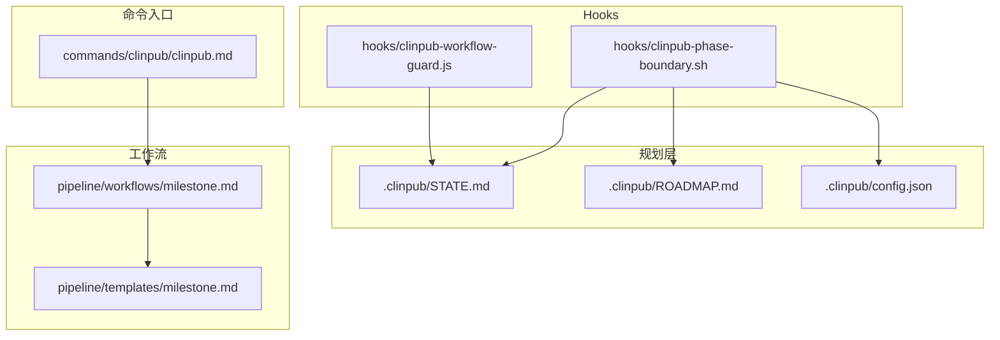
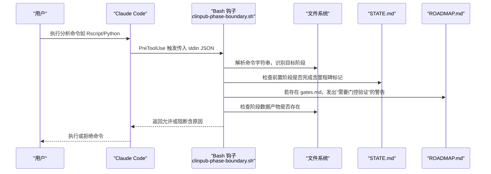
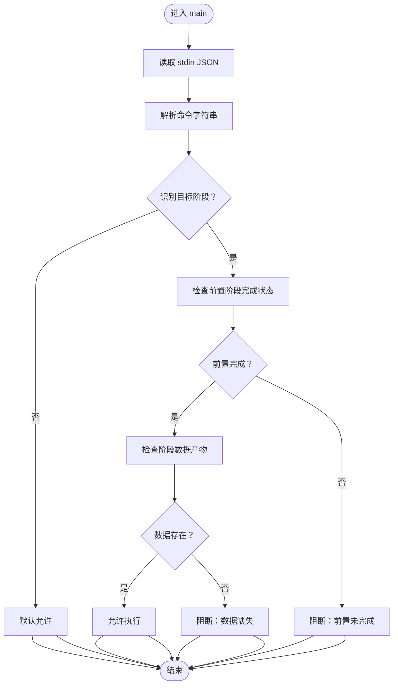
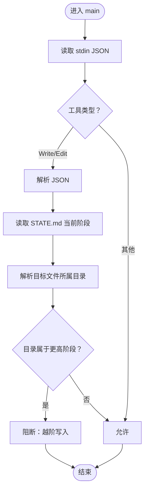
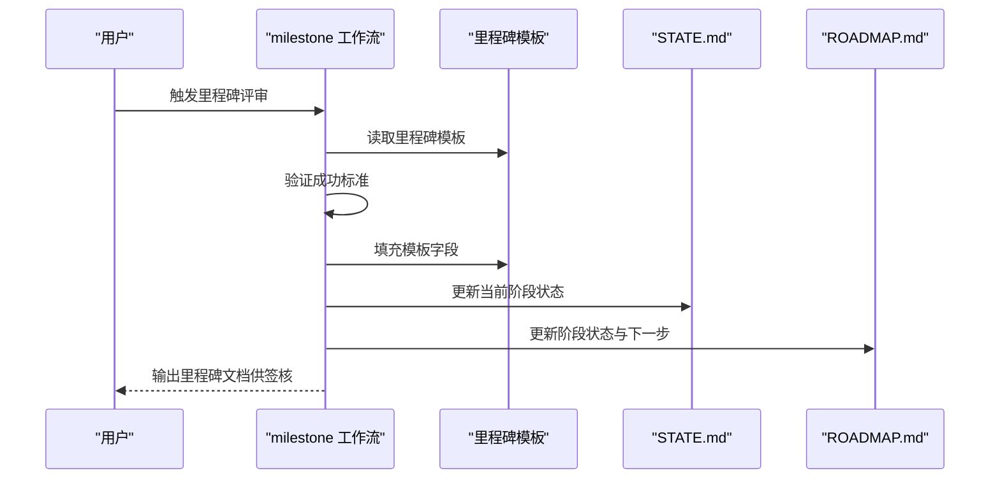
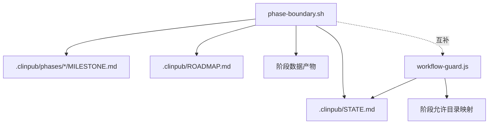

# 阶段边界检查

<cite>
**本文引用的文件**
- [hooks/clinpub-phase-boundary.sh](file://hooks/clinpub-phase-boundary.sh)
- [.clinpub/STATE.md](file://.clinpub/STATE.md)
- [.clinpub/ROADMAP.md](file://.clinpub/ROADMAP.md)
- [.clinpub/config.json](file://.clinpub/config.json)
- [docs/ARCHITECTURE.md](file://docs/ARCHITECTURE.md)
- [docs/CONFIGURATION.md](file://docs/CONFIGURATION.md)
- [pipeline/workflows/milestone.md](file://pipeline/workflows/milestone.md)
- [pipeline/templates/milestone.md](file://pipeline/templates/milestone.md)
- [hooks/clinpub-workflow-guard.js](file://hooks/clinpub-workflow-guard.js)
- [commands/clinpub/clinpub.md](file://commands/clinpub/clinpub.md)
</cite>

## 目录
1. [简介](#简介)
2. [项目结构](#项目结构)
3. [核心组件](#核心组件)
4. [架构总览](#架构总览)
5. [详细组件分析](#详细组件分析)
6. [依赖关系分析](#依赖关系分析)
7. [性能考量](#性能考量)
8. [故障排查指南](#故障排查指南)
9. [结论](#结论)
10. [附录](#附录)

## 简介
本文件围绕阶段边界检查的实现与运行机制展开，重点解析 hooks/clinpub-phase-boundary.sh 如何在 Claude Code 的 Bash 钩子中执行阶段边界校验，包括：
- 命令到阶段的映射规则
- 前置里程碑完成状态的验证策略
- 数据产物存在性检查
- 与项目状态文件 STATE.md、路线图 ROADMAP.md 的交互方式
- 阶段切换的安全检查、异常状态处理与恢复机制
- Hook 的配置选项、触发时机与集成方式

## 项目结构
clinpub 采用三层架构：Commands → Workflows → Agents，并通过 Hooks 在关键节点进行安全约束。与阶段边界检查直接相关的关键位置如下：
- Hooks：hooks/clinpub-phase-boundary.sh（Bash 钩子）、hooks/clinpub-workflow-guard.js（文件写入阶段访问控制）
- 规划层：.clinpub/STATE.md（项目当前阶段与状态）、.clinpub/ROADMAP.md（阶段目标与里程碑）
- 工作流：pipeline/workflows/milestone.md（里程碑评审流程）、pipeline/templates/milestone.md（里程碑模板）
- 配置：.clinpub/config.json（工作流与自动化开关）
- 命令入口：commands/clinpub/clinpub.md（阶段命令与执行顺序）

**图表来源**
- [hooks/clinpub-phase-boundary.sh:1-153](file://hooks/clinpub-phase-boundary.sh#L1-L153)
- [.clinpub/STATE.md:1-63](file://.clinpub/STATE.md#L1-L63)
- [.clinpub/ROADMAP.md:1-123](file://.clinpub/ROADMAP.md#L1-L123)
- [.clinpub/config.json:1-15](file://.clinpub/config.json#L1-L15)
- [pipeline/workflows/milestone.md:1-163](file://pipeline/workflows/milestone.md#L1-L163)
- [pipeline/templates/milestone.md:1-46](file://pipeline/templates/milestone.md#L1-L46)
- [commands/clinpub/clinpub.md:1-61](file://commands/clinpub/clinpub.md#L1-L61)

**章节来源**
- [docs/ARCHITECTURE.md:1-160](file://docs/ARCHITECTURE.md#L1-L160)
- [docs/CONFIGURATION.md:158-185](file://docs/CONFIGURATION.md#L158-L185)

## 核心组件
- 阶段边界钩子（Bash）：hooks/clinpub-phase-boundary.sh
  - 功能：在 Bash 工具执行前，判断目标阶段是否具备前置里程碑完成状态，并检查阶段所需数据产物是否存在
  - 触发：Claude Code 的 Bash 钩子（PreToolUse）
  - 输出：允许或阻断（带原因），并以特定 JSON 协议返回
- 阶段访问控制（Node.js）：hooks/clinpub-workflow-guard.js
  - 功能：防止越阶写入文件（例如在 Phase 1 写入 Phase 3 的目录）
  - 触发：Write/Edit 钩子（PreToolUse）
- 里程碑评审工作流：pipeline/workflows/milestone.md
  - 功能：正式评审 Phase 成果、生成里程碑文件、更新 ROADMAP 与 STATE
- 里程碑模板：pipeline/templates/milestone.md
  - 功能：标准化里程碑文档结构
- 项目状态与路线图：.clinpub/STATE.md、.clinpub/ROADMAP.md
  - 功能：记录当前阶段、里程碑状态、阶段目标与成功标准
- 配置：.clinpub/config.json
  - 功能：工作流与自动化开关（如 auto_advance）

**章节来源**
- [hooks/clinpub-phase-boundary.sh:1-153](file://hooks/clinpub-phase-boundary.sh#L1-L153)
- [hooks/clinpub-workflow-guard.js:1-134](file://hooks/clinpub-workflow-guard.js#L1-L134)
- [pipeline/workflows/milestone.md:1-163](file://pipeline/workflows/milestone.md#L1-L163)
- [pipeline/templates/milestone.md:1-46](file://pipeline/templates/milestone.md#L1-L46)
- [.clinpub/STATE.md:1-63](file://.clinpub/STATE.md#L1-L63)
- [.clinpub/ROADMAP.md:1-123](file://.clinpub/ROADMAP.md#L1-L123)
- [.clinpub/config.json:1-15](file://.clinpub/config.json#L1-L15)

## 架构总览
阶段边界检查在 Claude Code 的 PreToolUse 钩子中运行，结合项目状态文件与里程碑文件，形成“命令语义识别 → 阶段判定 → 前置里程碑验证 → 数据产物存在性检查”的闭环。

**图表来源**
- [hooks/clinpub-phase-boundary.sh:106-150](file://hooks/clinpub-phase-boundary.sh#L106-L150)
- [.clinpub/STATE.md:1-63](file://.clinpub/STATE.md#L1-L63)
- [.clinpub/ROADMAP.md:1-123](file://.clinpub/ROADMAP.md#L1-L123)

## 详细组件分析

### 组件：阶段边界钩子（clinpub-phase-boundary.sh）
- 命令到阶段映射
  - 通过命令字符串匹配，将命令路由到目标阶段（Phase 1~4）
  - 未识别阶段时，默认允许（避免误阻塞非分析类命令）
- 前置里程碑验证
  - 优先检查 STATE.md 中前置阶段的完成标记（包含多种完成态标识）
  - 若未找到，尝试在 .clinpub/phases/ 下查找对应阶段的 MILESTONE.md，并检查其完成态
  - 若存在 gates.md，则输出“需要门控验证”的警告
  - 以上任一条件满足即视为通过，否则阻断并返回原因
- 数据产物存在性检查
  - 按阶段检查对应目录/文件是否存在，如缺失则阻断并返回原因
- 输出协议
  - 允许：标准输出 JSON，包含 hookSpecificOutput.decision="allow"
  - 阻断：标准错误 JSON，包含 decision="block" 与 reason，退出码 2

**图表来源**
- [hooks/clinpub-phase-boundary.sh:106-150](file://hooks/clinpub-phase-boundary.sh#L106-L150)
- [hooks/clinpub-phase-boundary.sh:34-71](file://hooks/clinpub-phase-boundary.sh#L34-L71)
- [hooks/clinpub-phase-boundary.sh:73-104](file://hooks/clinpub-phase-boundary.sh#L73-L104)

**章节来源**
- [hooks/clinpub-phase-boundary.sh:1-153](file://hooks/clinpub-phase-boundary.sh#L1-L153)

### 组件：阶段访问控制（clinpub-workflow-guard.js）
- 作用：防止越阶写入文件，确保文件操作发生在当前阶段允许的目录范围内
- 关键逻辑
  - 从 STATE.md 读取当前阶段（优先匹配结构化行，回退到历史计数逻辑）
  - 对目标文件所属目录进行阶段归属判定
  - 若目标目录属于更高阶段且当前阶段未完成，则阻断
- 安全性
  - 解析失败时默认允许，避免阻断工作流
  - 路径拼接使用安全方式，防止路径穿越

**图表来源**
- [hooks/clinpub-workflow-guard.js:84-131](file://hooks/clinpub-workflow-guard.js#L84-L131)
- [hooks/clinpub-workflow-guard.js:25-38](file://hooks/clinpub-workflow-guard.js#L25-L38)
- [hooks/clinpub-workflow-guard.js:45-77](file://hooks/clinpub-workflow-guard.js#L45-L77)

**章节来源**
- [hooks/clinpub-workflow-guard.js:1-134](file://hooks/clinpub-workflow-guard.js#L1-L134)

### 组件：里程碑评审工作流（milestone.md）
- 作用：正式评审 Phase 成果，生成 MILESTONE.md，更新 ROADMAP 与 STATE
- 关键步骤
  - 加载当前阶段与项目上下文
  - 验证成功标准（不同阶段有不同的检查清单）
  - 生成里程碑文档并记录关键决策
  - 更新 ROADMAP 与 STATE，等待用户签核
- 与阶段边界的关系
  - 里程碑完成后，STATE.md 中的阶段状态更新，为后续阶段边界检查提供权威依据

**图表来源**
- [pipeline/workflows/milestone.md:15-154](file://pipeline/workflows/milestone.md#L15-L154)
- [pipeline/templates/milestone.md:1-46](file://pipeline/templates/milestone.md#L1-46)

**章节来源**
- [pipeline/workflows/milestone.md:1-163](file://pipeline/workflows/milestone.md#L1-L163)
- [pipeline/templates/milestone.md:1-46](file://pipeline/templates/milestone.md#L1-L46)

### 组件：项目状态与路线图（STATE.md、ROADMAP.md）
- STATE.md
  - 记录当前阶段、里程碑状态、进度等
  - 阶段边界钩子通过其中的完成标记判断前置阶段是否完成
- ROADMAP.md
  - 记录阶段目标、成功标准与计划
  - 若存在 gates.md，阶段边界钩子会发出“需要门控验证”的警告

**章节来源**
- [.clinpub/STATE.md:1-63](file://.clinpub/STATE.md#L1-L63)
- [.clinpub/ROADMAP.md:1-123](file://.clinpub/ROADMAP.md#L1-L123)

### 组件：配置（config.json）
- 影响阶段边界检查的配置项
  - workflow.auto_advance：是否自动推进阶段（影响里程碑评审后的状态流转）
  - 其他开关（如 verifier、plan_check 等）间接影响阶段成果质量，从而影响边界检查通过概率

**章节来源**
- [.clinpub/config.json:1-15](file://.clinpub/config.json#L1-L15)

## 依赖关系分析
- 阶段边界钩子依赖
  - 项目状态文件：.clinpub/STATE.md（完成标记）
  - 里程碑文件：.clinpub/phases/*/MILESTONE.md（完成态）
  - 路线图：.clinpub/ROADMAP.md（门控提示）
  - 数据产物：各阶段目录/文件的存在性
- 与阶段访问控制的协作
  - workflow-guard.js 防止越阶写入，phase-boundary.sh 防止越阶执行命令
  - 两者共同构成“目录级访问控制 + 命令级阶段边界”的双保险

**图表来源**
- [hooks/clinpub-phase-boundary.sh:16-26](file://hooks/clinpub-phase-boundary.sh#L16-L26)
- [hooks/clinpub-phase-boundary.sh:53-61](file://hooks/clinpub-phase-boundary.sh#L53-L61)
- [hooks/clinpub-workflow-guard.js:17-23](file://hooks/clinpub-workflow-guard.js#L17-L23)

**章节来源**
- [hooks/clinpub-phase-boundary.sh:1-153](file://hooks/clinpub-phase-boundary.sh#L1-L153)
- [hooks/clinpub-workflow-guard.js:1-134](file://hooks/clinpub-workflow-guard.js#L1-L134)

## 性能考量
- 命令解析与文件检查均为轻量级操作，通常在毫秒级完成
- 重复调用 check_phase_boundary 的问题已在 Phase 1 的研究中记录，但不影响基础可用性
- 建议
  - 保持 STATE.md 与里程碑文件的简洁结构，减少 grep/正则匹配开销
  - 在 CI/本地脚本中尽量避免频繁触发钩子，减少不必要的 IO

[本节为通用指导，无需列出章节来源]

## 故障排查指南
- 症状：命令被阻断，返回“前置阶段未完成”
  - 排查要点
    - 检查 .clinpub/STATE.md 中前置阶段是否标记为完成
    - 检查 .clinpub/phases/*/MILESTONE.md 是否存在且标记为完成
    - 若存在 gates.md，确认门控验证流程已完成
  - 处理建议
    - 先执行里程碑评审工作流，生成并签核 MILESTONE.md，再继续后续阶段
- 症状：命令被阻断，返回“数据产物缺失”
  - 排查要点
    - 检查对应阶段的数据目录/文件是否存在
    - 确认上一阶段已正确生成并保存产物
  - 处理建议
    - 先完成上一阶段，确保产物生成后再执行当前阶段命令
- 症状：命令未被阻断但状态异常
  - 排查要点
    - 检查 STATE.md 的结构化行是否正确（例如“- 阶段：Phase N”）
    - 检查 workflow-guard.js 的 getCurrentPhase() 是否能正确解析
  - 处理建议
    - 修复 STATE.md 的结构化行，确保钩子能精确匹配
- 症状：误阻塞或误放行
  - 排查要点
    - 检查命令字符串是否包含阶段相关关键词
    - 检查 hooks 的注册与触发时机
  - 处理建议
    - 在调试模式下单独运行钩子，观察其输出与退出码

**章节来源**
- [hooks/clinpub-phase-boundary.sh:34-71](file://hooks/clinpub-phase-boundary.sh#L34-L71)
- [hooks/clinpub-phase-boundary.sh:73-104](file://hooks/clinpub-phase-boundary.sh#L73-L104)
- [hooks/clinpub-workflow-guard.js:25-38](file://hooks/clinpub-workflow-guard.js#L25-L38)
- [pipeline/workflows/milestone.md:128-152](file://pipeline/workflows/milestone.md#L128-L152)

## 结论
阶段边界检查通过“命令语义识别 + 前置里程碑验证 + 数据产物存在性检查”的组合，确保阶段间质量与顺序约束。配合里程碑评审工作流与阶段访问控制，形成从命令到文件的全链路安全边界。实践中应重视 STATE.md 的结构化标记、里程碑文件的及时生成与签核，以及阶段数据产物的完整性，以获得稳定可靠的阶段边界保障。

[本节为总结性内容，无需列出章节来源]

## 附录

### 阶段边界钩子的配置与集成
- 触发时机
  - Bash 钩子：PreToolUse（在 Bash 工具执行前）
- 注册方式
  - 在 Claude Code 的设置中，将 Bash 匹配器指向 hooks/clinpub-phase-boundary.sh
- 输出协议
  - 允许：{"hookSpecificOutput":{"hookEventName":"PreToolUse","decision":"allow"}}
  - 阻断：{"hookSpecificOutput":{"hookEventName":"PreToolUse","decision":"block","reason":"..."}}

**章节来源**
- [docs/CONFIGURATION.md:158-185](file://docs/CONFIGURATION.md#L158-L185)
- [hooks/clinpub-phase-boundary.sh:10-12](file://hooks/clinpub-phase-boundary.sh#L10-L12)

### 阶段命令与执行顺序
- 阶段命令必须逐一执行，阶段之间需经里程碑评审与用户签核
- 建议严格遵循 Phase 0 → Phase 1 → Phase 2 → Phase 3 → Phase 4 的顺序

**章节来源**
- [commands/clinpub/clinpub.md:20-52](file://commands/clinpub/clinpub.md#L20-L52)