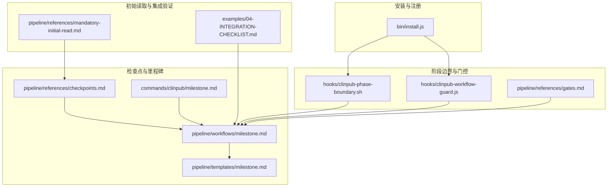
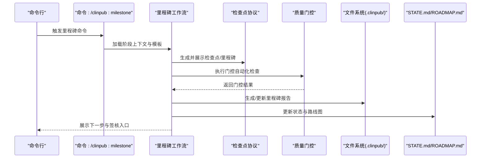
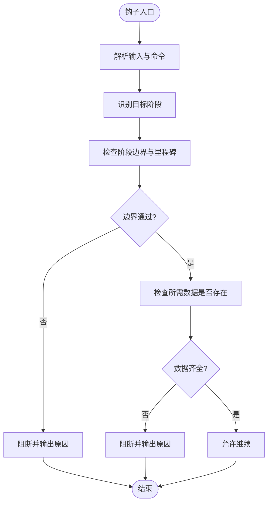
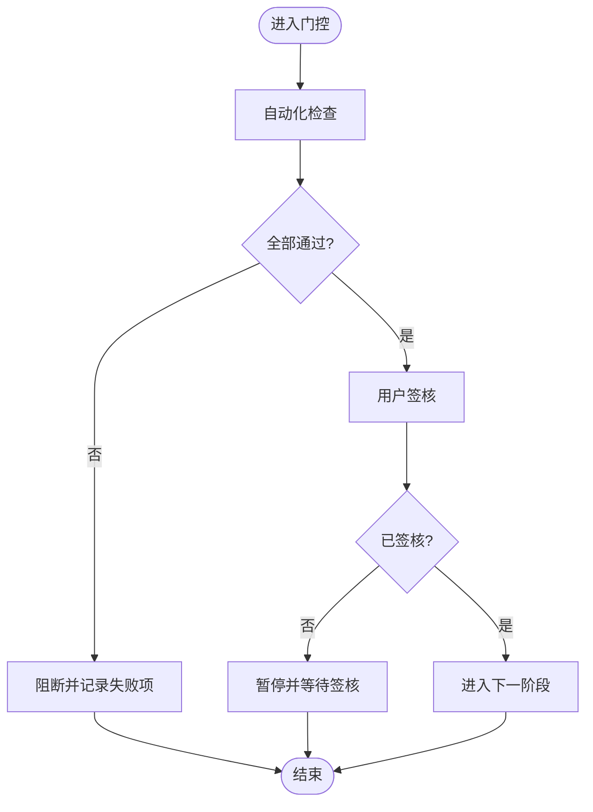
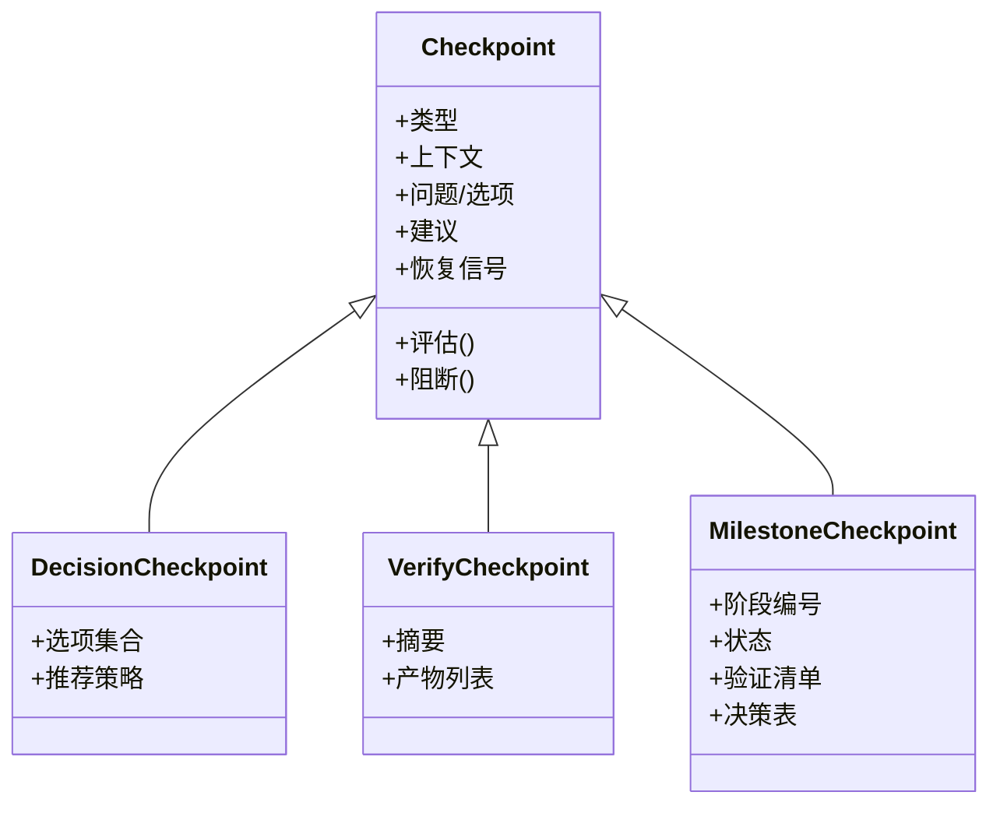
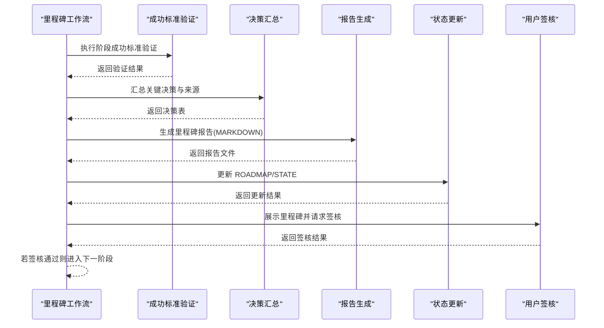
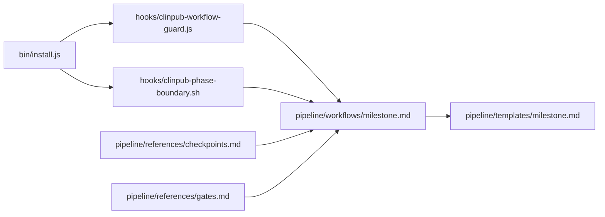

# 检查点标准

<cite>
**本文引用的文件**
- [pipeline/references/checkpoints.md](file://pipeline/references/checkpoints.md)
- [pipeline/references/gates.md](file://pipeline/references/gates.md)
- [pipeline/workflows/milestone.md](file://pipeline/workflows/milestone.md)
- [pipeline/templates/milestone.md](file://pipeline/templates/milestone.md)
- [commands/clinpub/milestone.md](file://commands/clinpub/milestone.md)
- [hooks/clinpub-phase-boundary.sh](file://hooks/clinpub-phase-boundary.sh)
- [hooks/clinpub-workflow-guard.js](file://hooks/clinpub-workflow-guard.js)
- [pipeline/references/mandatory-initial-read.md](file://pipeline/references/mandatory-initial-read.md)
- [examples/04-INTEGRATION-CHECKLIST.md](file://examples/04-INTEGRATION-CHECKLIST.md)
- [bin/install.js](file://bin/install.js)
</cite>

## 目录
1. [引言](#引言)
2. [项目结构](#项目结构)
3. [核心组件](#核心组件)
4. [架构总览](#架构总览)
5. [详细组件分析](#详细组件分析)
6. [依赖关系分析](#依赖关系分析)
7. [性能考量](#性能考量)
8. [故障排查指南](#故障排查指南)
9. [结论](#结论)
10. [附录](#附录)

## 引言
本文件系统化定义并阐述“检查点标准”，覆盖项目各阶段的关键检查点设置、评估标准与质量阈值，明确检查点的触发条件、执行时机与评估方法，并阐明检查点与质量门控的关系、数据收集方式与报告格式。文档还包含优先级管理、异常处理与持续改进建议，并提供最佳实践与常见问题解决方案，帮助团队在科学严谨的流水线中实现可审计、可追溯、可复现的质量保障。

## 项目结构
本项目围绕“阶段化流水线”组织，检查点与质量门控贯穿 Phase 0–4 的每个环节。关键结构包括：
- 阶段边界钩子：防止越权访问未来阶段目录与命令执行
- 质量门控：分阶段的强制性检查清单，不可绕过
- 检查点协议：决策、验证与里程碑三类检查点，配合模板化报告
- 里程碑工作流：自动执行成功标准验证、生成里程碑报告、更新路线图与状态

**图示来源**
- [hooks/clinpub-phase-boundary.sh:1-153](file://hooks/clinpub-phase-boundary.sh#L1-L153)
- [hooks/clinpub-workflow-guard.js:1-134](file://hooks/clinpub-workflow-guard.js#L1-L134)
- [pipeline/references/gates.md:1-112](file://pipeline/references/gates.md#L1-L112)
- [pipeline/references/checkpoints.md:1-120](file://pipeline/references/checkpoints.md#L1-L120)
- [pipeline/workflows/milestone.md:1-163](file://pipeline/workflows/milestone.md#L1-L163)
- [pipeline/templates/milestone.md:1-46](file://pipeline/templates/milestone.md#L1-L46)
- [commands/clinpub/milestone.md:1-39](file://commands/clinpub/milestone.md#L1-L39)
- [pipeline/references/mandatory-initial-read.md:1-86](file://pipeline/references/mandatory-initial-read.md#L1-L86)
- [examples/04-INTEGRATION-CHECKLIST.md:1-398](file://examples/04-INTEGRATION-CHECKLIST.md#L1-L398)
- [bin/install.js:162-207](file://bin/install.js#L162-L207)

**章节来源**
- [hooks/clinpub-phase-boundary.sh:1-153](file://hooks/clinpub-phase-boundary.sh#L1-L153)
- [hooks/clinpub-workflow-guard.js:1-134](file://hooks/clinpub-workflow-guard.js#L1-L134)
- [pipeline/references/gates.md:1-112](file://pipeline/references/gates.md#L1-L112)
- [pipeline/references/checkpoints.md:1-120](file://pipeline/references/checkpoints.md#L1-L120)
- [pipeline/workflows/milestone.md:1-163](file://pipeline/workflows/milestone.md#L1-L163)
- [pipeline/templates/milestone.md:1-46](file://pipeline/templates/milestone.md#L1-L46)
- [commands/clinpub/milestone.md:1-39](file://commands/clinpub/milestone.md#L1-L39)
- [pipeline/references/mandatory-initial-read.md:1-86](file://pipeline/references/mandatory-initial-read.md#L1-L86)
- [examples/04-INTEGRATION-CHECKLIST.md:1-398](file://examples/04-INTEGRATION-CHECKLIST.md#L1-L398)
- [bin/install.js:162-207](file://bin/install.js#L162-L207)

## 核心组件
- 检查点类型与触发
  - 决策检查点：在存在分支路径时触发，要求用户提供明确选项与恢复信号
  - 验证检查点：在自动步骤完成后触发，要求用户确认结果是否符合预期
  - 里程碑检查点：阶段结束时正式评审，必须满足全部成功标准
- 质量门控
  - IRB/伦理门、数据质量门、分析有效性门、提交门四类门控，不可绕过
  - 门控采用“自动化先行 + 用户签核”的双层机制
- 里程碑工作流
  - 自动验证成功标准、汇总关键决策与产出、生成里程碑报告、更新路线图与状态
  - 用户签核后方可进入下一阶段

**章节来源**
- [pipeline/references/checkpoints.md:10-75](file://pipeline/references/checkpoints.md#L10-L75)
- [pipeline/references/gates.md:7-112](file://pipeline/references/gates.md#L7-L112)
- [pipeline/workflows/milestone.md:15-163](file://pipeline/workflows/milestone.md#L15-L163)

## 架构总览
检查点与质量门控通过钩子与工作流协同，形成“阶段边界保护 + 门控验证 + 里程碑审计”的闭环。

**图示来源**
- [commands/clinpub/milestone.md:12-39](file://commands/clinpub/milestone.md#L12-L39)
- [pipeline/workflows/milestone.md:15-163](file://pipeline/workflows/milestone.md#L15-L163)
- [pipeline/references/checkpoints.md:10-75](file://pipeline/references/checkpoints.md#L10-L75)
- [pipeline/references/gates.md:90-112](file://pipeline/references/gates.md#L90-L112)

## 详细组件分析

### 组件A：阶段边界与访问控制（钩子）
- 功能要点
  - 阶段边界钩子：在执行分析命令前检查前置里程碑是否完成，并验证所需数据是否存在
  - 工作流守卫钩子：在文件写入前根据当前阶段限制对目录的访问，防止跳过阶段
- 触发条件与时机
  - 阶段边界钩子：在 Bash 工具执行前触发，识别目标阶段并进行边界检查
  - 工作流守卫钩子：在 Write/Edit 工具执行前触发，判断目标文件所属目录是否属于当前阶段
- 评估方法
  - 阶段边界：读取状态文件与里程碑文件，匹配完成标记；若不满足则阻断并给出原因
  - 访问控制：解析目标目录归属，若越权则阻断并给出原因
- 异常处理
  - 未初始化项目：允许宽松通行，提示初始化
  - 解析错误：工作流守卫钩子采用 try/catch 回退为允许，避免阻断正常流程
- 优先级管理
  - 边界与访问控制均属于“阻断型”高优先级，确保阶段顺序与数据一致性

**图示来源**
- [hooks/clinpub-phase-boundary.sh:34-150](file://hooks/clinpub-phase-boundary.sh#L34-L150)
- [hooks/clinpub-workflow-guard.js:84-131](file://hooks/clinpub-workflow-guard.js#L84-L131)

**章节来源**
- [hooks/clinpub-phase-boundary.sh:34-150](file://hooks/clinpub-phase-boundary.sh#L34-L150)
- [hooks/clinpub-workflow-guard.js:25-125](file://hooks/clinpub-workflow-guard.js#L25-L125)

### 组件B：质量门控（Gate）
- 设计原则
  - 门控不可绕过；自动化检查优先；最终由用户签核确认
  - IRB/伦理门与去标识化检查严禁例外
- 门类型与阈值
  - IRB/伦理门：伦理批准号、去标识化、知情同意、数据使用协议、RCT注册等
  - 数据质量门：cleaned.csv存在、变量字典完整、缺失率阈值、样本量充足、异常值记录、质量报告、可复现清洗代码
  - 分析有效性门：方法已执行、每方法三产出、效应量与置信区间、假设检验、多重比较校正、软件版本、可复现代码
  - 提交门：IMRAD结构、报告标准清单、图像分辨率与语言、引文DOI、引用映射、封面信、模拟审稿、AI模板规避
- 评估方法
  - 自动化检查：文件存在性、内容匹配、版本信息提取
  - 人工签核：即使自动化通过，仍需用户确认
- 异常处理
  - 任一检查失败即阻断进入下一阶段；失败项需在里程碑中记录并追踪解决
- 优先级管理
  - 门控为最高优先级，贯穿所有阶段；IRB门优先级最高，不可豁免

**图示来源**
- [pipeline/references/gates.md:90-112](file://pipeline/references/gates.md#L90-L112)

**章节来源**
- [pipeline/references/gates.md:9-112](file://pipeline/references/gates.md#L9-L112)

### 组件C：检查点协议（Checkpoint）
- 类型与用途
  - 决策检查点：在存在分支时引导用户做出明确选择
  - 验证检查点：在自动步骤完成后要求用户确认结果
  - 里程碑检查点：阶段结束时正式评审并记录
- 触发条件与时机
  - 决策检查点：在分析路径出现分歧时触发
  - 验证检查点：在自动步骤完成后触发
  - 里程碑检查点：每个阶段工作流结束时自动触发
- 评估方法
  - 决策检查点：提供上下文、问题、选项与建议，等待用户明确恢复信号
  - 验证检查点：提供摘要与产物列表，等待用户批准或提出调整
  - 里程碑检查点：汇总成功标准验证、关键决策与产出，等待用户签核
- 异常处理
  - 若用户未提供明确恢复信号，检查点将阻断直至收到 approved/continue 或具体选项
- 优先级管理
  - 三类检查点均为阻断型（blocking），确保阶段间质量与一致性

**图示来源**
- [pipeline/references/checkpoints.md:12-75](file://pipeline/references/checkpoints.md#L12-L75)

**章节来源**
- [pipeline/references/checkpoints.md:10-75](file://pipeline/references/checkpoints.md#L10-L75)

### 组件D：里程碑工作流与报告
- 流程集成
  - 自动验证成功标准、汇总关键决策与产出、生成里程碑报告、更新 ROADMAP 与 STATE
  - 用户签核后方可进入下一阶段
- 报告格式
  - 使用里程碑模板，包含阶段编号与名称、完成日期、状态、交付物清单、验证项、关键决策、产出文件、未解决问题、用户签字与下一步
- 数据收集
  - 来源于阶段上下文、状态日志、Shell历史中的用户确认、以及各阶段产物
- 异常处理
  - 若用户请求变更，标注阻塞项并回退至修正流程，直至再次验证通过
- 优先级管理
  - 里程碑为阶段转换的最终关卡，优先级最高

**图示来源**
- [pipeline/workflows/milestone.md:15-163](file://pipeline/workflows/milestone.md#L15-L163)
- [pipeline/templates/milestone.md:1-46](file://pipeline/templates/milestone.md#L1-L46)

**章节来源**
- [pipeline/workflows/milestone.md:15-163](file://pipeline/workflows/milestone.md#L15-L163)
- [pipeline/templates/milestone.md:1-46](file://pipeline/templates/milestone.md#L1-L46)
- [commands/clinpub/milestone.md:12-39](file://commands/clinpub/milestone.md#L12-L39)

### 组件E：初始读取与集成验证
- 强制上下文读取
  - 项目配置、管道状态、阶段特定上下文，确保上下文完整性后再执行任务
- 集成验证清单
  - 端到端从初始化到投稿就绪的完整验证步骤，覆盖各阶段成功标准与产物
- 异常处理
  - 缺失或损坏文件时立即停止并提示修复与回溯路径

**章节来源**
- [pipeline/references/mandatory-initial-read.md:51-86](file://pipeline/references/mandatory-initial-read.md#L51-L86)
- [examples/04-INTEGRATION-CHECKLIST.md:28-398](file://examples/04-INTEGRATION-CHECKLIST.md#L28-L398)

## 依赖关系分析
- 钩子注册与生命周期
  - 安装脚本注册 PreToolUse 钩子，分别绑定阶段边界与工作流守卫
- 组件耦合
  - 阶段边界钩子与工作流守卫共同约束阶段顺序与目录访问
  - 里程碑工作流依赖检查点协议与质量门控结果
  - 里程碑报告模板驱动最终审计与状态迁移

**图示来源**
- [bin/install.js:162-207](file://bin/install.js#L162-L207)
- [hooks/clinpub-phase-boundary.sh:1-153](file://hooks/clinpub-phase-boundary.sh#L1-L153)
- [hooks/clinpub-workflow-guard.js:1-134](file://hooks/clinpub-workflow-guard.js#L1-L134)
- [pipeline/workflows/milestone.md:1-163](file://pipeline/workflows/milestone.md#L1-L163)
- [pipeline/references/checkpoints.md:1-120](file://pipeline/references/checkpoints.md#L1-L120)
- [pipeline/references/gates.md:1-112](file://pipeline/references/gates.md#L1-L112)
- [pipeline/templates/milestone.md:1-46](file://pipeline/templates/milestone.md#L1-L46)

**章节来源**
- [bin/install.js:162-207](file://bin/install.js#L162-L207)
- [hooks/clinpub-phase-boundary.sh:1-153](file://hooks/clinpub-phase-boundary.sh#L1-L153)
- [hooks/clinpub-workflow-guard.js:1-134](file://hooks/clinpub-workflow-guard.js#L1-L134)
- [pipeline/workflows/milestone.md:1-163](file://pipeline/workflows/milestone.md#L1-L163)
- [pipeline/references/checkpoints.md:1-120](file://pipeline/references/checkpoints.md#L1-L120)
- [pipeline/references/gates.md:1-112](file://pipeline/references/gates.md#L1-L112)
- [pipeline/templates/milestone.md:1-46](file://pipeline/templates/milestone.md#L1-L46)

## 性能考量
- 钩子执行开销
  - 阶段边界钩子与工作流守卫均为轻量 shell/JS 脚本，执行成本低，阻断策略避免无效计算
- 门控检查效率
  - 优先自动化检查（文件存在性、内容匹配），减少人工干预频率
- 报告生成
  - 里程碑报告为静态模板渲染，性能开销极小
- 建议
  - 在大规模数据场景下，建议将门控检查拆分为并行任务，缩短整体等待时间

## 故障排查指南
- 常见问题与解决
  - 门控失败：核查失败项并在里程碑中记录，修正后重新验证
  - 阶段边界阻断：确认前置里程碑完成标记与所需数据存在
  - 检查点卡住：提供明确恢复信号（approved/continue 或具体选项）
  - 访问控制阻断：确保写入文件位于当前阶段目录
  - 集成测试异常：参考集成检查清单逐项定位，按提示修复
- 异常处理策略
  - 门控失败：阻断进入下一阶段，直至问题解决
  - 钩子解析错误：工作流守卫钩子回退为允许，避免阻断正常流程
  - 未初始化项目：允许宽松通行并提示初始化

**章节来源**
- [pipeline/references/gates.md:90-112](file://pipeline/references/gates.md#L90-L112)
- [hooks/clinpub-phase-boundary.sh:135-147](file://hooks/clinpub-phase-boundary.sh#L135-L147)
- [hooks/clinpub-workflow-guard.js:125-129](file://hooks/clinpub-workflow-guard.js#L125-L129)
- [examples/04-INTEGRATION-CHECKLIST.md:343-398](file://examples/04-INTEGRATION-CHECKLIST.md#L343-L398)

## 结论
本检查点标准体系以“阶段边界保护 + 质量门控 + 里程碑审计”为核心，通过明确的触发条件、严格的评估方法与可审计的报告格式，确保项目在每个阶段均达到既定质量阈值。结合优先级管理与异常处理策略，实现了可追溯、可复现、可持续改进的质量保障闭环。

## 附录
- 最佳实践
  - 在每个阶段结束时及时执行里程碑工作流，确保成功标准与决策记录完整
  - 门控检查应尽量自动化，减少人工干预；人工签核不可省略
  - 检查点必须提供明确的恢复信号，避免歧义
  - 钩子注册与配置应保持稳定，避免破坏阶段顺序与数据一致性
- 持续改进建议
  - 引入自动化单元测试，覆盖钩子与工作流关键路径
  - 增加门控检查的并行化能力，提升整体吞吐
  - 完善异常回滚与重试机制，降低人工干预成本