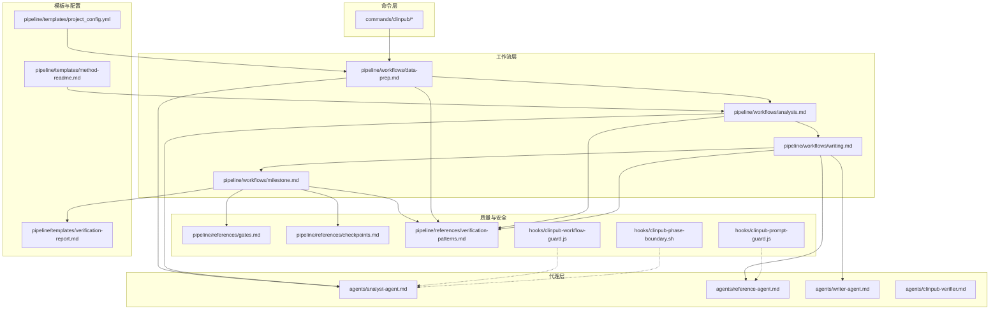
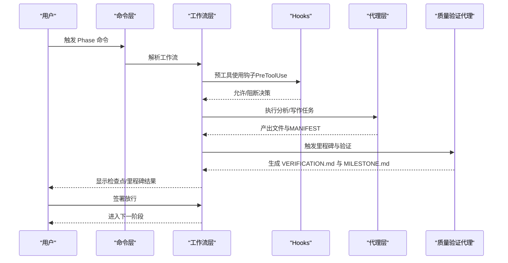
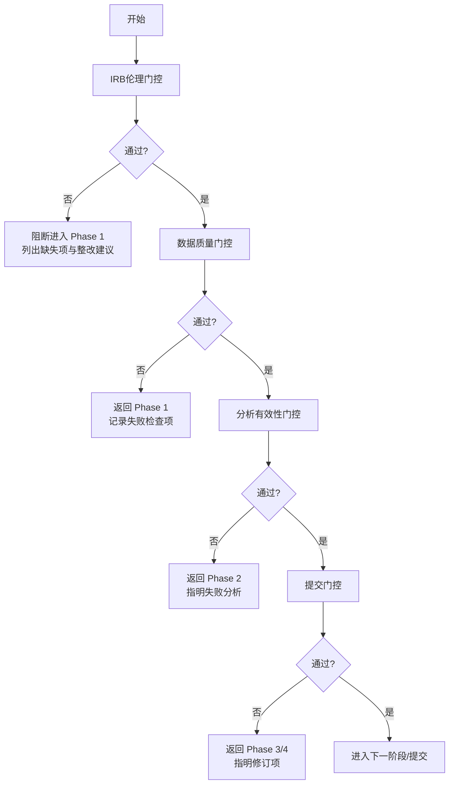
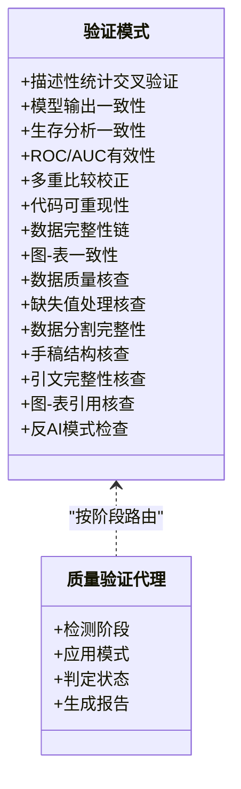
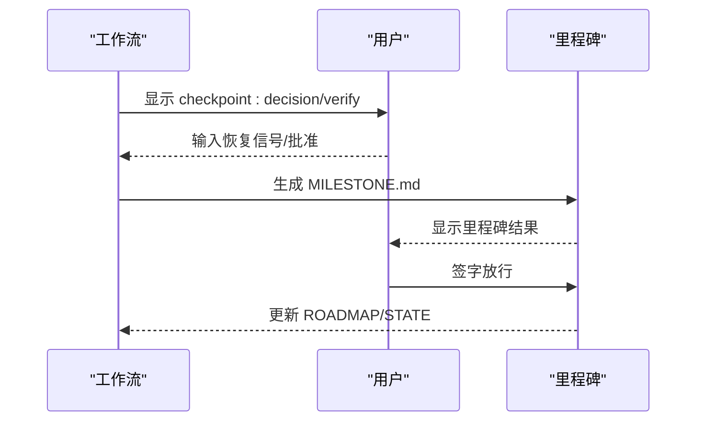
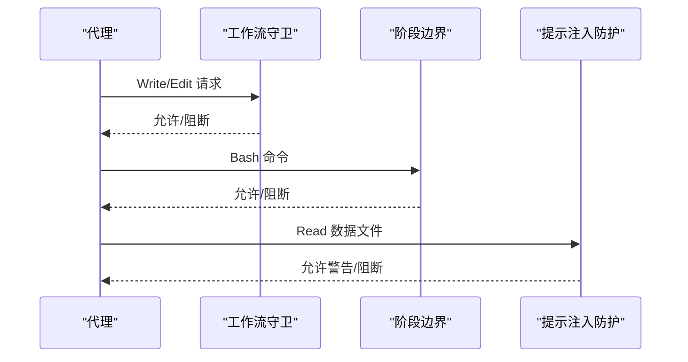
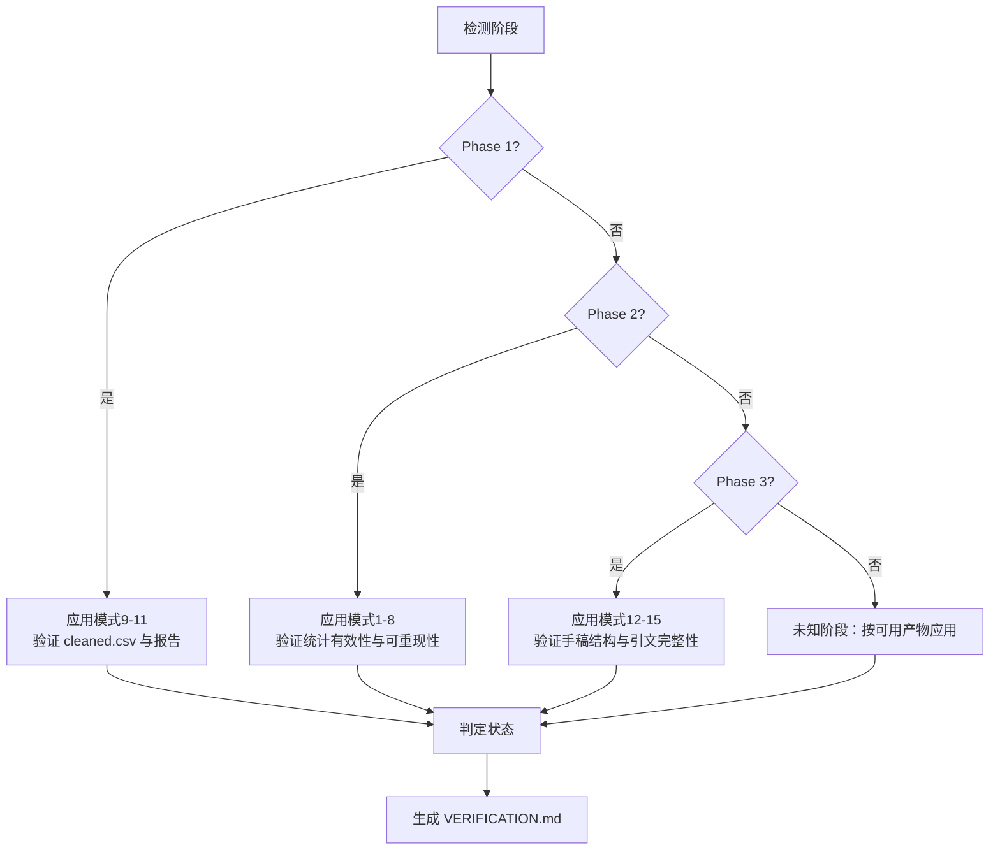
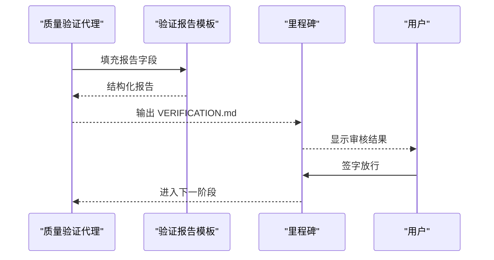
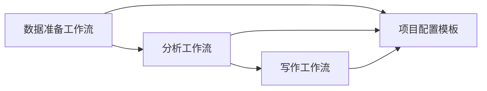
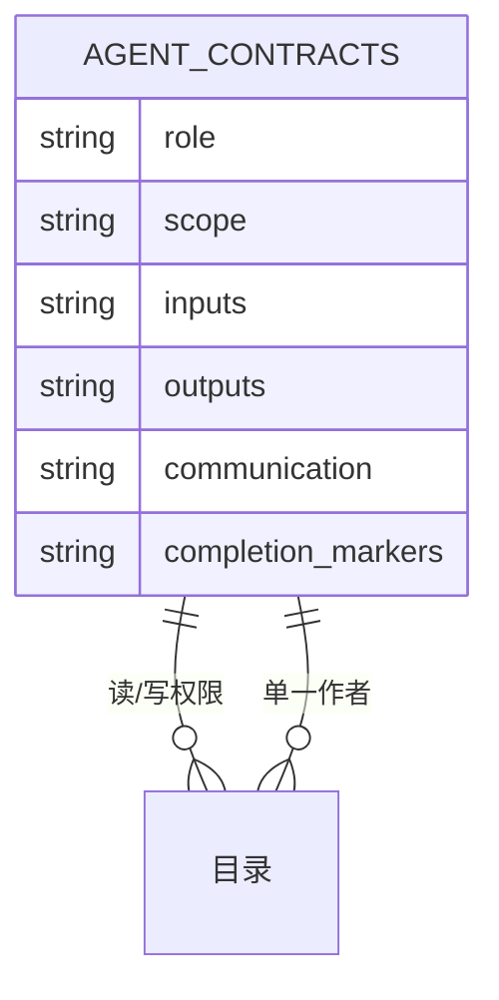

# 质量控制系统

<cite>
**本文引用的文件**
- [质量门控](file://pipeline/references/gates.md)
- [检查点与里程碑协议](file://pipeline/references/checkpoints.md)
- [验证模式](file://pipeline/references/verification-patterns.md)
- [工作流守卫（JavaScript）](file://hooks/clinpub-workflow-guard.js)
- [阶段边界（Shell）](file://hooks/clinpub-phase-boundary.sh)
- [提示注入防护（JavaScript）](file://hooks/clinpub-prompt-guard.js)
- [验证报告模板](file://pipeline/templates/verification-report.md)
- [项目配置模板](file://pipeline/templates/project_config.yml)
- [分析工作流](file://pipeline/workflows/analysis.md)
- [数据准备工作流](file://pipeline/workflows/data-prep.md)
- [写作工作流](file://pipeline/workflows/writing.md)
- [里程碑工作流](file://pipeline/workflows/milestone.md)
- [代理契约](file://pipeline/references/agent-contracts.md)
- [架构文档](file://docs/ARCHITECTURE.md)
- [配置指南](file://docs/CONFIGURATION.md)
- [统计方法参考](file://pipeline/references/analysis_methods.md)
- [R模式参考](file://pipeline/references/r_patterns.md)
- [串联协议](file://pipeline/references/concatenation-protocol.md)
- [方法说明模板](file://pipeline/templates/method-readme.md)
- [数据剖析器脚本](file://scripts/data_profiler.py)
- [质量验证代理](file://agents/clinpub-verifier.md)
</cite>

## 目录
1. [引言](#引言)
2. [项目结构](#项目结构)
3. [核心组件](#核心组件)
4. [架构总览](#架构总览)
5. [详细组件分析](#详细组件分析)
6. [依赖分析](#依赖分析)
7. [性能考虑](#性能考虑)
8. [故障排查指南](#故障排查指南)
9. [结论](#结论)
10. [附录](#附录)

## 引言
本文件面向 clinpub 质量控制系统，系统性阐述四道质量门控的设计原理与执行机制：IRB伦理门控、数据质量门控、分析有效性门控与提交门控；详解15种验证模式、检查点标准与违规处理流程；解析三个Claude Code hooks的安全防护机制：工作流守卫、阶段边界检查与提示注入防护；并提供最佳实践、常见问题诊断与改进策略，以及质量报告模板与审核流程指导。

## 项目结构
clinpub 采用“命令层-工作流层-代理层”三层架构，配合hooks安全防护与标准化模板，形成端到端的质量控制闭环。

**图示来源**
- [架构文档:1-160](file://docs/ARCHITECTURE.md#L1-L160)
- [质量门控:1-112](file://pipeline/references/gates.md#L1-L112)
- [检查点与里程碑协议:1-120](file://pipeline/references/checkpoints.md#L1-L120)
- [验证模式:1-358](file://pipeline/references/verification-patterns.md#L1-L358)
- [工作流守卫（JavaScript）:1-134](file://hooks/clinpub-workflow-guard.js#L1-L134)
- [阶段边界（Shell）:1-153](file://hooks/clinpub-phase-boundary.sh#L1-L153)
- [提示注入防护（JavaScript）:1-162](file://hooks/clinpub-prompt-guard.js#L1-L162)
- [验证报告模板:1-85](file://pipeline/templates/verification-report.md#L1-L85)
- [项目配置模板:1-97](file://pipeline/templates/project_config.yml#L1-L97)
- [方法说明模板:1-38](file://pipeline/templates/method-readme.md#L1-L38)

**章节来源**
- [架构文档:1-160](file://docs/ARCHITECTURE.md#L1-L160)
- [配置指南:1-270](file://docs/CONFIGURATION.md#L1-L270)

## 核心组件
- 四道质量门控：IRB伦理门控（Phase 0→1）、数据质量门控（Phase 1→2）、分析有效性门控（Phase 2→3）、提交门控（Phase 4→Submit）。每道门控均规定“自动化优先、人工确认、记录归档”的强制流程，失败即阻断下一阶段。
- 15种验证模式：涵盖描述性统计交叉验证、模型输出一致性、生存分析一致性、ROC/AUC有效性、多重比较校正、代码可重现性、数据完整性链、图-表一致性、数据质量核查、缺失值处理核查、数据分割完整性、手稿结构核查、引文完整性核查、图-表引用核查、反AI模式检查。
- 三个Claude Code hooks：工作流守卫（阻止越阶段写文件）、阶段边界检查（前置里程碑校验）、提示注入防护（扫描数据文件中的注入模式）。
- 里程碑与检查点：以XML结构的checkpoint/milestone记录阶段决策、产出与状态，贯穿每个Phase的结束与过渡。

**章节来源**
- [质量门控:1-112](file://pipeline/references/gates.md#L1-L112)
- [验证模式:1-358](file://pipeline/references/verification-patterns.md#L1-L358)
- [检查点与里程碑协议:1-120](file://pipeline/references/checkpoints.md#L1-L120)
- [里程碑工作流:1-163](file://pipeline/workflows/milestone.md#L1-L163)

## 架构总览
质量控制体系围绕“门控+验证+hooks+模板”的组合展开，确保阶段间质量与合规性。

**图示来源**
- [质量门控:90-112](file://pipeline/references/gates.md#L90-L112)
- [里程碑工作流:1-163](file://pipeline/workflows/milestone.md#L1-L163)
- [质量验证代理:1-439](file://agents/clinpub-verifier.md#L1-L439)
- [工作流守卫（JavaScript）:84-134](file://hooks/clinpub-workflow-guard.js#L84-L134)
- [阶段边界（Shell）:106-153](file://hooks/clinpub-phase-boundary.sh#L106-L153)
- [提示注入防护（JavaScript）:108-162](file://hooks/clinpub-prompt-guard.js#L108-L162)

## 详细组件分析

### 1) 四道质量门控设计与执行机制
- IRB伦理门控（Phase 0→1）
  - 检查要点：IRB批准号、去标识化、知情同意、数据使用协议、临床试验注册。
  - 通过标准：所有“必须”检查通过，且“条件”检查已处理。
  - 失败动作：阻断进入Phase 1，列出缺失项与整改建议。
- 数据质量门控（Phase 1→2）
  - 检查要点：cleaned.csv存在、变量字典完整、缺失率受控、样本量充足、异常值处理记录、数据质量报告、可复现实验代码。
  - 通过标准：全部检查通过。
  - 失败动作：返回Phase 1，记录失败检查项。
- 分析有效性门控（Phase 2→3）
  - 检查要点：确认方法均已执行、每个方法有图+表+方法说明、效应量与95%CI、假设检验、多重比较校正、软件版本、可复现实验代码。
  - 通过标准：全部检查通过。
  - 失败动作：返回Phase 2，指明失败分析。
- 提交门控（Phase 4→Submit）
  - 检查要点：IMRAD结构完整、报告标准清单、图≥300 DPI、英文图/表标签、中英语言分工、所有引文有DOI、引文映射一致、封面信完整、模拟同行评审、无AI模板模式。
  - 通过标准：全部检查通过。
  - 失败动作：返回Phase 3/4，指明修订项。

**图示来源**
- [质量门控:1-112](file://pipeline/references/gates.md#L1-L112)

**章节来源**
- [质量门控:1-112](file://pipeline/references/gates.md#L1-L112)

### 2) 15种验证模式详解与应用
- 统计验证模式（1-8）
  - 描述性统计交叉验证、模型输出一致性、生存分析一致性、ROC/AUC有效性、多重比较校正、代码可重现性、数据完整性链、图-表一致性。
- 数据质量验证模式（9-11）
  - 数据质量核查、缺失值处理核查、数据分割完整性。
- 手稿验证模式（12-15）
  - 手稿结构核查、引文完整性核查、图-表引用核查、反AI模式检查。

**图示来源**
- [验证模式:1-358](file://pipeline/references/verification-patterns.md#L1-L358)
- [质量验证代理:1-439](file://agents/clinpub-verifier.md#L1-L439)

**章节来源**
- [验证模式:1-358](file://pipeline/references/verification-patterns.md#L1-L358)
- [质量验证代理:1-439](file://agents/clinpub-verifier.md#L1-L439)

### 3) 检查点与里程碑协议
- 设计原则：Claude自动完成可自动化工作；每个检查点必须有明确恢复信号；每个里程碑必须有完整成功标准验证；所有状态持久化。
- 检查点类型：decision（用户决策）、verify（验证确认）、milestone（阶段评审）。
- 里程碑记录：包含阶段、状态、交付物清单、关键决策、产出文件、未解决问题、用户签字与下一步。

**图示来源**
- [检查点与里程碑协议:1-120](file://pipeline/references/checkpoints.md#L1-L120)
- [里程碑工作流:1-163](file://pipeline/workflows/milestone.md#L1-L163)

**章节来源**
- [检查点与里程碑协议:1-120](file://pipeline/references/checkpoints.md#L1-L120)
- [里程碑工作流:1-163](file://pipeline/workflows/milestone.md#L1-L163)

### 4) 三个Claude Code hooks安全防护机制
- 工作流守卫（JavaScript）
  - 作用：防止越阶段写文件，依据项目当前阶段与目录归属进行访问控制。
  - 触发：Write/Edit 工具使用。
- 阶段边界检查（Shell）
  - 作用：在执行分析命令前检查前置里程碑完成状态与所需数据存在性。
  - 触发：Bash 工具使用。
- 提示注入防护（JavaScript）
  - 作用：扫描CSV/XLSX等数据文件，识别潜在的注入模式与可疑长字符串。
  - 触发：Read 工具读取数据文件。

**图示来源**
- [工作流守卫（JavaScript）:84-134](file://hooks/clinpub-workflow-guard.js#L84-L134)
- [阶段边界（Shell）:106-153](file://hooks/clinpub-phase-boundary.sh#L106-L153)
- [提示注入防护（JavaScript）:108-162](file://hooks/clinpub-prompt-guard.js#L108-L162)

**章节来源**
- [工作流守卫（JavaScript）:1-134](file://hooks/clinpub-workflow-guard.js#L1-L134)
- [阶段边界（Shell）:1-153](file://hooks/clinpub-phase-boundary.sh#L1-L153)
- [提示注入防护（JavaScript）:1-162](file://hooks/clinpub-prompt-guard.js#L1-L162)

### 5) 质量验证代理（clinpub-verifier）执行流程
- 阶段检测：根据 STATE.md 或目录内容推断当前阶段。
- 路由应用：Phase 1→模式9-11；Phase 2→模式1-8；Phase 3→模式12-15。
- 执行验证：输出完整性、统计有效性、可重现性、图-表一致性、手稿结构与引文完整性、反AI模式。
- 状态判定：BLOCKER/WARNING/INFO；最终状态映射为 passed/gaps_found/human_needed。

**图示来源**
- [质量验证代理:35-311](file://agents/clinpub-verifier.md#L35-L311)

**章节来源**
- [质量验证代理:1-439](file://agents/clinpub-verifier.md#L1-L439)

### 6) 质量报告模板与审核流程
- 验证报告模板：包含“检查项汇总、问题发现、可重现性确认、数据流验证、签核”等结构化字段。
- 审核流程：里程碑评审后，质量验证代理生成 VERIFICATION.md，用户确认后进入下一阶段。

**图示来源**
- [验证报告模板:1-85](file://pipeline/templates/verification-report.md#L1-L85)
- [里程碑工作流:1-163](file://pipeline/workflows/milestone.md#L1-L163)

**章节来源**
- [验证报告模板:1-85](file://pipeline/templates/verification-report.md#L1-L85)
- [里程碑工作流:1-163](file://pipeline/workflows/milestone.md#L1-L163)

### 7) 关键工作流与配置支撑
- 数据准备（Phase 1）：数据画像、缺失值策略、异常值处理、衍生变量、训练/验证分割、数据质量报告生成。
- 统计分析（Phase 2）：数据诊断→方法提议→用户确认→按波次执行→输出图/表/方法说明→验证与里程碑。
- 写作（Phase 3）：引文策略→文献预搜索→IMRAD顺序撰写→人类化检查→终稿拼接→验证与里程碑。
- 项目配置：变量映射、分析阈值、图表标准、语言与期刊级别等。

**图示来源**
- [数据准备工作流:1-184](file://pipeline/workflows/data-prep.md#L1-L184)
- [分析工作流:1-289](file://pipeline/workflows/analysis.md#L1-L289)
- [写作工作流:1-330](file://pipeline/workflows/writing.md#L1-L330)
- [项目配置模板:1-97](file://pipeline/templates/project_config.yml#L1-L97)

**章节来源**
- [数据准备工作流:1-184](file://pipeline/workflows/data-prep.md#L1-L184)
- [分析工作流:1-289](file://pipeline/workflows/analysis.md#L1-L289)
- [写作工作流:1-330](file://pipeline/workflows/writing.md#L1-L330)
- [项目配置模板:1-97](file://pipeline/templates/project_config.yml#L1-L97)

## 依赖分析
- 代理协作矩阵：明确各代理对目录的读写权限，避免循环依赖与并发写冲突。
- MANIFEST契约：每个代理在完成输出后写入MANIFEST.yaml，下游代理消费前验证。
- 代理职责边界：分析师负责清洗与分析；文献代理负责检索与引用管理；写作者负责IMRAD撰写；验证代理负责跨阶段验证。

**图示来源**
- [代理契约:1-156](file://pipeline/references/agent-contracts.md#L1-L156)

**章节来源**
- [代理契约:1-156](file://pipeline/references/agent-contracts.md#L1-L156)

## 性能考虑
- 快速验证优先：使用文件存在性、行数、grep等轻量手段快速筛错，避免重跑分析。
- 可重现性检查：集中校验随机种子、相对路径、软件版本，减少调试成本。
- 串行与波次：分析按波次顺序执行，波次间等待用户确认，降低资源竞争与错误传播。

[本节为通用指导，无需特定文件引用]

## 故障排查指南
- 门控阻断
  - IRB伦理门控：检查IRB号、去标识化、知情同意、数据使用协议、注册号是否齐全与有效。
  - 数据质量门控：确认 cleaned.csv、变量字典、缺失率、样本量、异常值处理、数据质量报告、可复现实验代码。
  - 分析有效性门控：确认方法已执行、图/表/方法说明齐全、效应量与95%CI、假设检验、多重比较校正、软件版本、可复现实验代码。
  - 提交门控：确认IMRAD结构、报告标准清单、图分辨率、英文标签、中英语言分工、引文DOI、引文映射、封面信、模拟评审、反AI模式。
- hooks告警
  - 工作流守卫：若提示“请先完成上一阶段”，检查 STATE.md 与 MILESTONE.md。
  - 阶段边界：若提示“缺少数据文件”，检查对应阶段目录是否存在期望文件。
  - 提示注入防护：若提示“潜在注入”，人工复核可疑行并清理。
- 验证报告
  - 若 VERIFICATION.md 显示 gaps_found，按问题清单逐项整改；若 human_needed，进行视觉复核或作者偏好确认。

**章节来源**
- [质量门控:1-112](file://pipeline/references/gates.md#L1-L112)
- [检查点与里程碑协议:1-120](file://pipeline/references/checkpoints.md#L1-L120)
- [工作流守卫（JavaScript）:1-134](file://hooks/clinpub-workflow-guard.js#L1-L134)
- [阶段边界（Shell）:1-153](file://hooks/clinpub-phase-boundary.sh#L1-L153)
- [提示注入防护（JavaScript）:1-162](file://hooks/clinpub-prompt-guard.js#L1-L162)
- [质量验证代理:1-439](file://agents/clinpub-verifier.md#L1-L439)

## 结论
clinpub 质量控制系统通过四道门控、15种验证模式与hooks安全防护，构建了从伦理合规、数据质量、分析有效性到提交质量的全链路质量保障。结合标准化模板、检查点与里程碑协议，确保每个阶段的可审计、可追溯与可复现。建议在实际使用中坚持“自动化优先、人工确认、记录归档”的原则，持续优化验证模式与hooks策略，以适应不同研究类型与期刊要求。

[本节为总结性内容，无需特定文件引用]

## 附录
- 最佳实践
  - 在每个阶段结束即刻执行里程碑评审，避免问题累积。
  - 使用项目配置模板统一变量映射与分析阈值，减少歧义。
  - 在Phase 2中严格执行波次顺序与用户确认，确保方法选择合理。
  - 在Phase 3中提前制定引文策略，保证引用数量与格式符合目标期刊。
- 常见问题
  - cleaned.csv 缺失：检查数据准备是否完成，确认变量字典与缺失处理策略。
  - 引文无DOI：补齐或替换引用，确保 Vancouver 格式。
  - 图分辨率不足：提高FIGURE_DPI或更换高分辨率源文件。
  - 重复模式被标记：调整段落开头、过渡词与句式多样性。
- 改进策略
  - 扩展验证模式：新增针对新研究类型的验证模式。
  - 优化hooks：引入更细粒度的注入模式检测与更智能的阶段路由。
  - 强化模板：细化方法说明与手稿模板，提升一致性与可读性。

[本节为通用指导，无需特定文件引用]