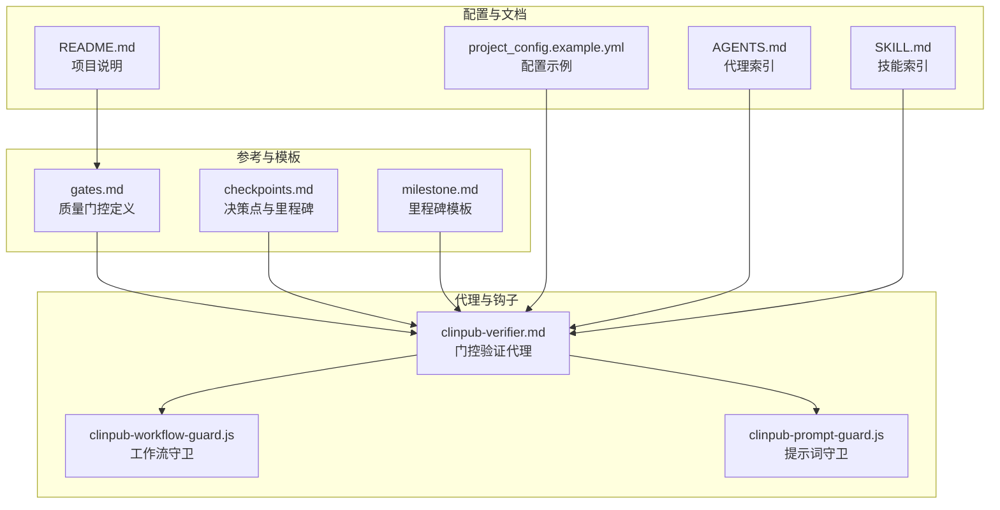
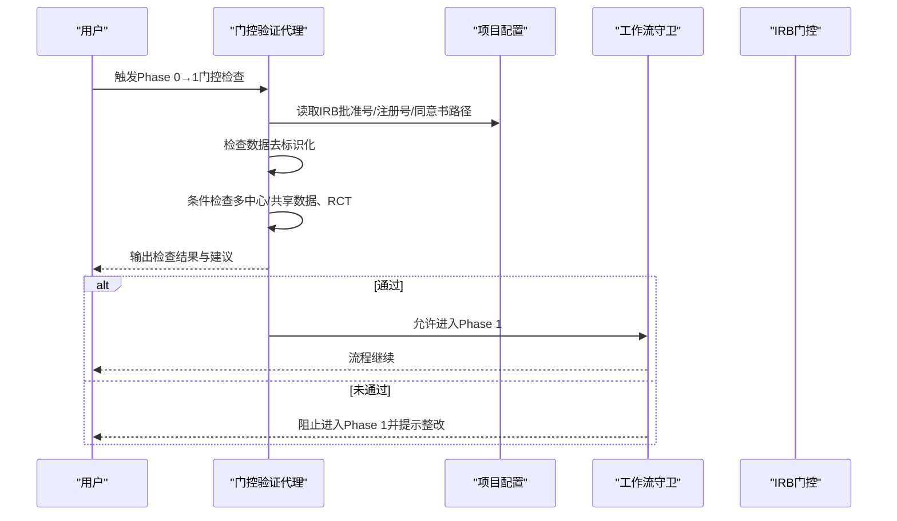
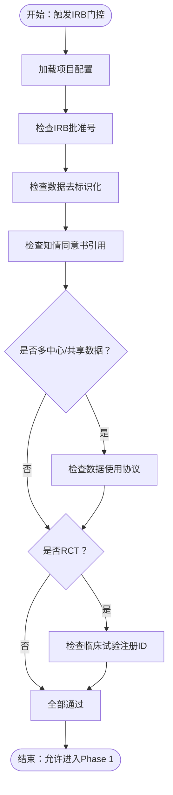
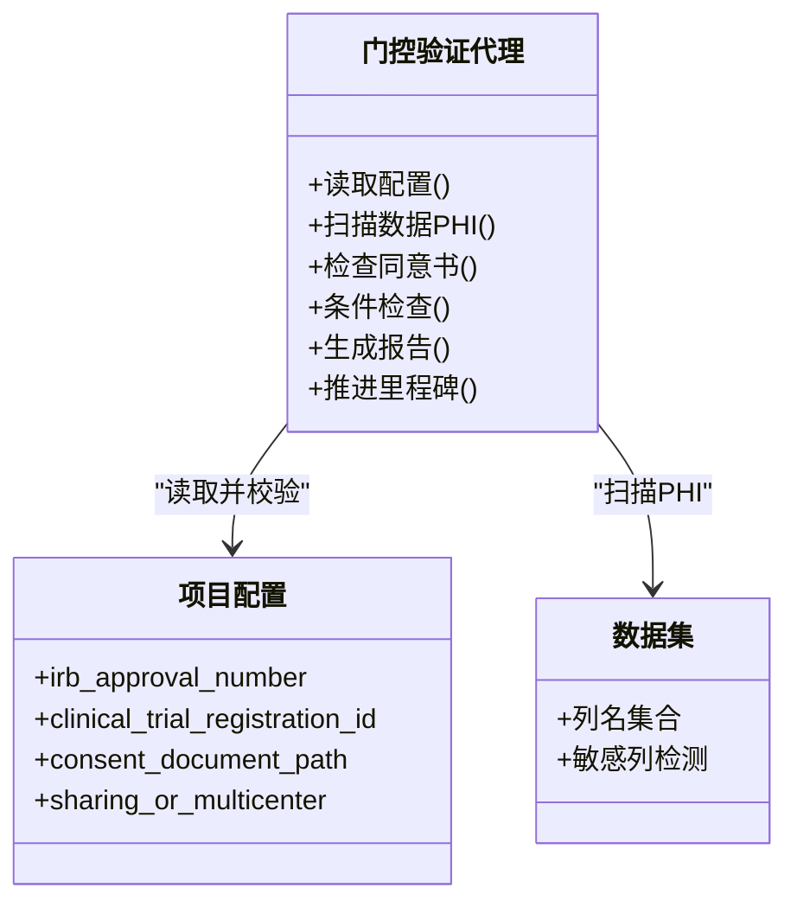
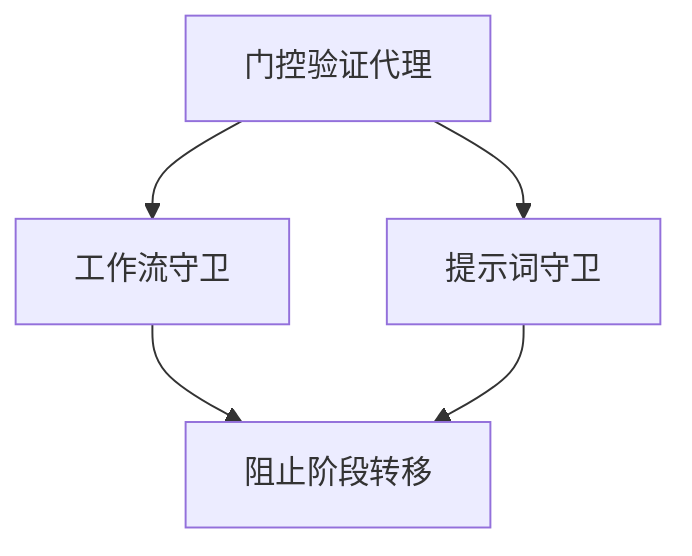
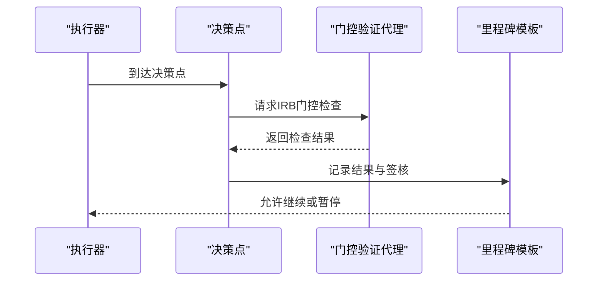
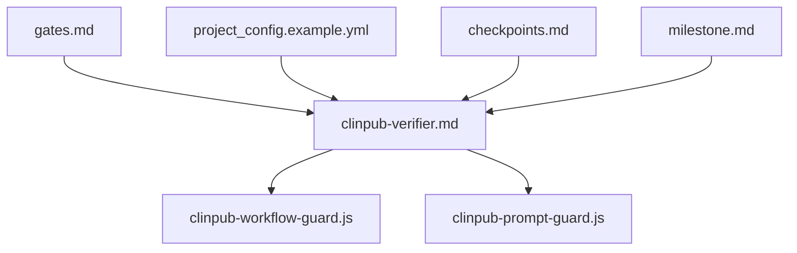

# IRB伦理门控

<cite>
**本文档引用的文件**
- [gates.md](file://pipeline/references/gates.md)
- [checkpoints.md](file://pipeline/references/checkpoints.md)
- [milestone.md](file://pipeline/templates/milestone.md)
- [clinpub-verifier.md](file://agents/clinpub-verifier.md)
- [clinpub-workflow-guard.js](file://hooks/clinpub-workflow-guard.js)
- [clinpub-prompt-guard.js](file://hooks/clinpub-prompt-guard.js)
- [README.md](file://README.md)
- [AGENTS.md](file://AGENTS.md)
- [SKILL.md](file://SKILL.md)
- [project_config.example.yml](file://examples/project_config.example.yml)
</cite>

## 目录
1. [引言](#引言)
2. [项目结构](#项目结构)
3. [核心组件](#核心组件)
4. [架构总览](#架构总览)
5. [详细组件分析](#详细组件分析)
6. [依赖关系分析](#依赖关系分析)
7. [性能考虑](#性能考虑)
8. [故障排除指南](#故障排除指南)
9. [结论](#结论)
10. [附录](#附录)

## 引言
本文件面向IRB伦理门控（Phase 0 → Phase 1）的实施与运维，系统性阐述IRB/Ethics Gate的设计目的、执行流程、检查标准、通过条件、失败处理机制以及伦理合规的重要性。IRB门控是项目从准备阶段进入数据处理阶段前的强制性伦理审查与合规确认环节，任何阶段过渡均不得绕过。

## 项目结构
IRB门控相关的核心文件与位置如下：
- 质量门控定义：pipeline/references/gates.md
- 决策点与里程碑：pipeline/references/checkpoints.md、pipeline/templates/milestone.md
- 门控验证代理：agents/clinpub-verifier.md
- 工作流与提示词守卫钩子：hooks/clinpub-workflow-guard.js、hooks/clinpub-prompt-guard.js
- 项目配置示例：examples/project_config.example.yml
- 文档索引：README.md、AGENTS.md、SKILL.md

**图表来源**
- [gates.md:1-112](file://pipeline/references/gates.md#L1-L112)
- [checkpoints.md](file://pipeline/references/checkpoints.md)
- [milestone.md](file://pipeline/templates/milestone.md)
- [clinpub-verifier.md](file://agents/clinpub-verifier.md)
- [clinpub-workflow-guard.js](file://hooks/clinpub-workflow-guard.js)
- [clinpub-prompt-guard.js](file://hooks/clinpub-prompt-guard.js)
- [project_config.example.yml](file://examples/project_config.example.yml)

**章节来源**
- [gates.md:1-112](file://pipeline/references/gates.md#L1-L112)
- [README.md:110-120](file://README.md#L110-L120)
- [AGENTS.md:50-70](file://AGENTS.md#L50-L70)
- [SKILL.md:25-30](file://SKILL.md#L25-L30)

## 核心组件
IRB门控由以下核心组件构成：
- 门控规则定义：在 gates.md 中明确列出IRB门控的检查项、通过条件与失败动作。
- 决策点与里程碑：checkpoints.md 定义阶段内决策点；milestone.md 提供里程碑记录模板，用于记录IRB门控的验证结果与用户签核。
- 门控验证代理：clinpub-verifier.md 描述代理如何执行门控检查、生成报告与推进流程。
- 工作流与提示词守卫：clinpub-workflow-guard.js 与 clinpub-prompt-guard.js 确保在门控未通过时阻断后续流程，并防止不当提示词绕过伦理约束。
- 项目配置：project_config.example.yml 提供IRB批准号、临床试验注册号等关键字段的示例与格式要求。

IRB门控的关键检查项与通过条件：
- 必检项目
  - IRB批准号验证：项目配置中必须包含有效的IRB批准号。
  - 数据去标识化检查：数据集中不得包含受保护健康信息（PHI）列（如姓名、ID、出生日期、地址、电话、邮箱）。
  - 知情同意书引用：必须提供知情同意文件路径，或在豁免情况下提供书面理由。
  - 数据使用协议：当涉及多中心或共享数据时，必须提供数据使用协议。
  - 随机对照试验注册：当研究类型为RCT时，必须在项目配置中提供注册ID。
- 通过条件：所有“必需”检查全部通过，且适用的“条件”检查已按要求处理。
- 失败动作：阻止进入Phase 1，输出缺失项清单与整改建议。

**章节来源**
- [gates.md:9-24](file://pipeline/references/gates.md#L9-L24)
- [milestone.md](file://pipeline/templates/milestone.md)
- [clinpub-verifier.md](file://agents/clinpub-verifier.md)
- [project_config.example.yml](file://examples/project_config.example.yml)

## 架构总览
IRB门控在系统中的作用是作为阶段边界控制点，确保伦理合规后方可进入下一阶段。下图展示了从Phase 0到Phase 1的门控交互：

**图表来源**
- [gates.md:9-24](file://pipeline/references/gates.md#L9-L24)
- [clinpub-verifier.md](file://agents/clinpub-verifier.md)
- [clinpub-workflow-guard.js](file://hooks/clinpub-workflow-guard.js)

## 详细组件分析

### 组件A：IRB门控规则与检查矩阵
IRB门控规则在 gates.md 中以表格形式定义，明确了检查项、是否必需、通过条件与失败动作。该规则不可绕过，且对数据去标识化检查有“无例外”的严格要求。

**图表来源**
- [gates.md:9-24](file://pipeline/references/gates.md#L9-L24)

**章节来源**
- [gates.md:9-24](file://pipeline/references/gates.md#L9-L24)

### 组件B：门控验证代理（clinpub-verifier.md）
门控验证代理负责：
- 读取并校验项目配置中的IRB批准号、注册号、同意书路径等关键字段。
- 对数据集进行自动扫描，识别是否存在PHI列。
- 根据研究设计判断是否需要数据使用协议与RCT注册。
- 生成门控检查报告，供用户签核并推进至里程碑记录。

**图表来源**
- [clinpub-verifier.md](file://agents/clinpub-verifier.md)
- [project_config.example.yml](file://examples/project_config.example.yml)

**章节来源**
- [clinpub-verifier.md](file://agents/clinpub-verifier.md)

### 组件C：工作流与提示词守卫（hooks）
工作流守卫与提示词守卫在IRB门控未通过时起到阻断作用：
- 工作流守卫：阻止流程进入下一阶段，直到门控通过。
- 提示词守卫：防止通过提示词绕过伦理约束，确保所有检查项均被严格执行。

**图表来源**
- [clinpub-workflow-guard.js](file://hooks/clinpub-workflow-guard.js)
- [clinpub-prompt-guard.js](file://hooks/clinpub-prompt-guard.js)

**章节来源**
- [clinpub-workflow-guard.js](file://hooks/clinpub-workflow-guard.js)
- [clinpub-prompt-guard.js](file://hooks/clinpub-prompt-guard.js)

### 组件D：里程碑与决策点（checkpoints.md、milestone.md）
- 决策点：在阶段内设置决策点，用于暂停流程并等待IRB门控验证结果。
- 里程碑：使用里程碑模板记录门控检查结果、用户签核与整改状态。

**图表来源**
- [checkpoints.md](file://pipeline/references/checkpoints.md)
- [milestone.md](file://pipeline/templates/milestone.md)

**章节来源**
- [checkpoints.md](file://pipeline/references/checkpoints.md)
- [milestone.md](file://pipeline/templates/milestone.md)

## 依赖关系分析
IRB门控的依赖关系如下：
- gates.md 是IRB门控的权威规则来源，其他组件均围绕其定义执行。
- 项目配置（project_config.example.yml）为IRB门控提供关键字段输入。
- 门控验证代理依赖于配置与数据扫描能力。
- 工作流与提示词守卫依赖于门控代理的返回结果进行阻断或放行。
- 决策点与里程碑模板用于记录与追踪门控状态。

**图表来源**
- [gates.md:1-112](file://pipeline/references/gates.md#L1-L112)
- [clinpub-verifier.md](file://agents/clinpub-verifier.md)
- [project_config.example.yml](file://examples/project_config.example.yml)
- [clinpub-workflow-guard.js](file://hooks/clinpub-workflow-guard.js)
- [clinpub-prompt-guard.js](file://hooks/clinpub-prompt-guard.js)
- [checkpoints.md](file://pipeline/references/checkpoints.md)
- [milestone.md](file://pipeline/templates/milestone.md)

**章节来源**
- [gates.md:1-112](file://pipeline/references/gates.md#L1-L112)
- [AGENTS.md:50-70](file://AGENTS.md#L50-L70)
- [SKILL.md:25-30](file://SKILL.md#L25-L30)

## 性能考虑
- 自动化扫描：对数据集进行PHI列扫描应尽量避免全表扫描，优先基于元数据与列名模式快速过滤。
- 配置读取：项目配置应缓存读取结果，减少重复IO。
- 报告生成：检查报告应采用增量式生成，仅记录变更项，降低计算与存储开销。
- 并发控制：在多人协作场景下，确保门控检查与里程碑记录的并发安全。

## 故障排除指南
常见问题与解决方案：
- 缺失IRB批准号
  - 现象：IRB门控未通过，提示缺少批准号。
  - 解决：在项目配置中补充有效IRB批准号，并重新运行门控检查。
- 数据中存在PHI列
  - 现象：数据去标识化检查失败。
  - 解决：移除或匿名化相关列，或提供数据脱敏策略与审批记录。
- 知情同意书路径缺失或无效
  - 现象：同意书引用检查失败。
  - 解决：提供有效同意书路径或在豁免情况下提交书面理由与审批文件。
- 多中心/共享数据但缺少数据使用协议
  - 现象：条件检查失败。
  - 解决：提供数据使用协议文本与签署页，并在项目配置中注明共享范围。
- RCT但未提供注册ID
  - 现象：RCT注册检查失败。
  - 解决：在项目配置中填写经核实的注册ID，并提供注册页面截图或证明文件。
- 门控通过但流程仍被阻断
  - 现象：门控通过后仍无法进入Phase 1。
  - 解决：检查工作流守卫与提示词守卫是否正确接收通过信号；确认里程碑记录已完成且签核。

**章节来源**
- [gates.md:9-24](file://pipeline/references/gates.md#L9-L24)
- [milestone.md](file://pipeline/templates/milestone.md)

## 结论
IRB伦理门控是确保研究从准备阶段进入数据处理阶段前的强制性伦理与合规门槛。通过明确的检查项、严格的通过条件与失败阻断机制，结合自动化验证代理与守卫钩子，系统实现了可追溯、可审计、可复现的门控流程。项目团队应严格遵循门控规则，确保所有必需与条件检查均满足，以保障研究的伦理合规性与数据安全性。

## 附录
- 实际案例与常见问题的解决方案参见故障排除指南。
- 项目配置示例与字段说明可参考项目配置示例文件。