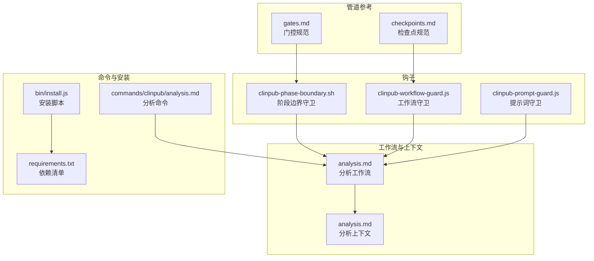
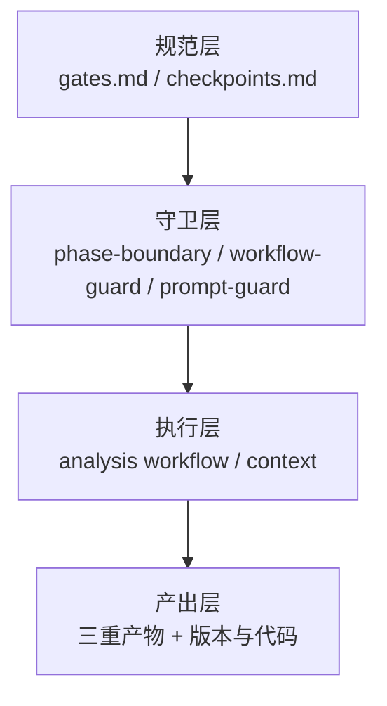
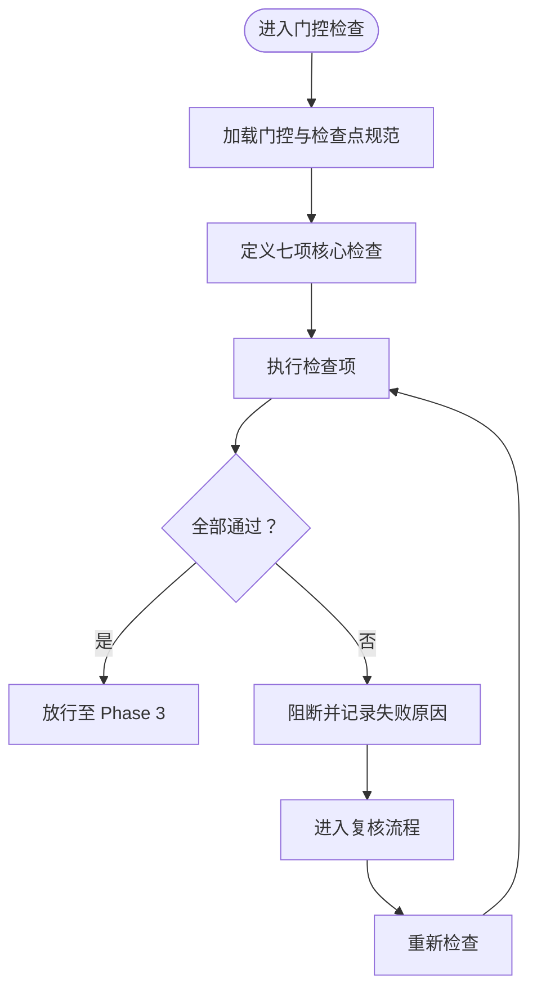
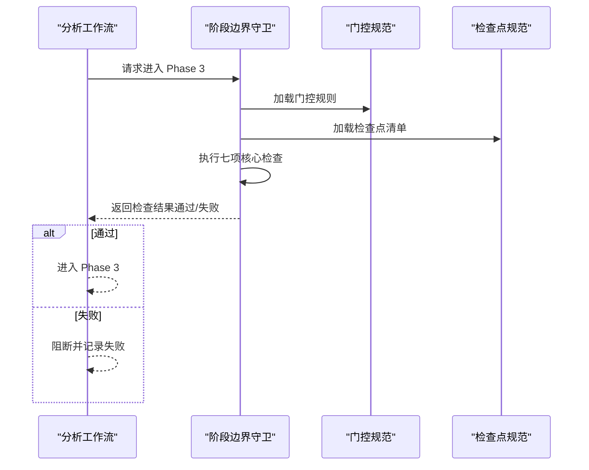
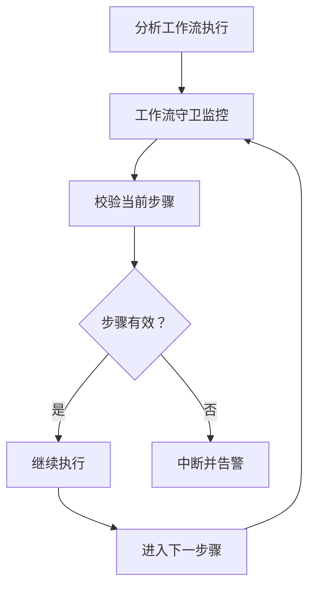
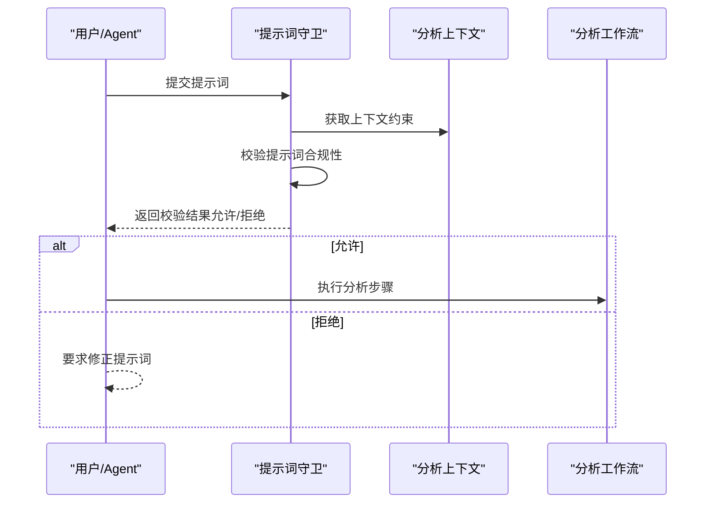
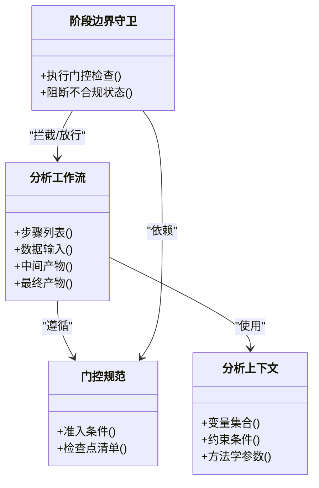
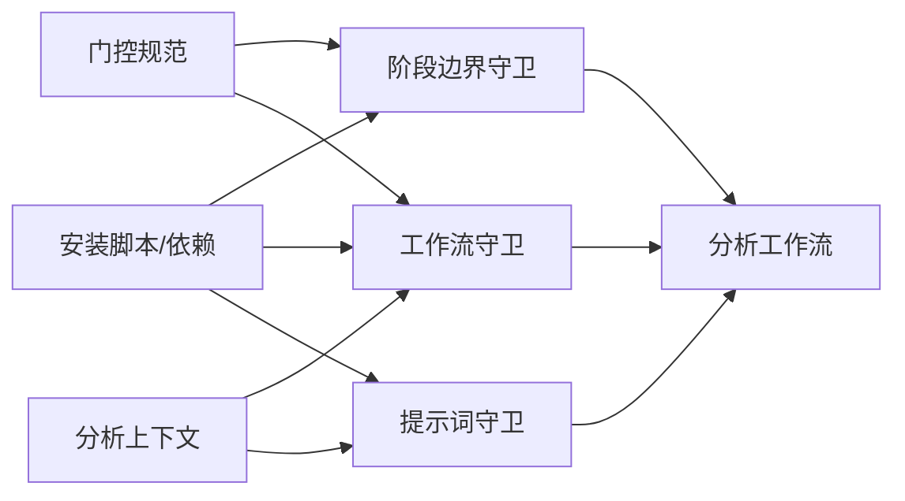

# 分析有效性门控

<cite>
**本文档引用的文件**
- [gates.md](file://pipeline/references/gates.md)
- [checkpoints.md](file://pipeline/references/checkpoints.md)
- [clinpub-phase-boundary.sh](file://hooks/clinpub-phase-boundary.sh)
- [clinpub-workflow-guard.js](file://hooks/clinpub-workflow-guard.js)
- [clinpub-prompt-guard.js](file://hooks/clinpub-prompt-guard.js)
- [analysis.md](file://pipeline/workflows/analysis.md)
- [analysis.md](file://pipeline/contexts/analysis.md)
- [analysis.md](file://commands/clinpub/analysis.md)
- [install.js](file://bin/install.js)
- [requirements.txt](file://requirements.txt)
</cite>

## 目录
1. [引言](#引言)
2. [项目结构](#项目结构)
3. [核心组件](#核心组件)
4. [架构总览](#架构总览)
5. [详细组件分析](#详细组件分析)
6. [依赖关系分析](#依赖关系分析)
7. [性能考虑](#性能考虑)
8. [故障排除指南](#故障排除指南)
9. [结论](#结论)
10. [附录](#附录)

## 引言
本文件聚焦于“分析有效性门控”（Analysis Validity Gate），即从 Phase 2 到 Phase 3 的严格验证与准入控制机制。该门控确保统计分析在进入下一阶段前满足七个核心检查项目：方法完全执行、三重产物（图表+表格+方法说明）、效应量与95%置信区间报告、统计假设检验、多重比较校正、软件版本记录与代码可重现性。本文档提供系统化的架构视图、流程图、类图与最佳实践，帮助读者理解如何在实际项目中实现高质量的统计分析与质量保证。

## 项目结构
该项目采用分层与功能模块化组织方式，围绕“管道（pipeline）”“钩子（hooks）”“命令（commands）”“模板与参考（templates/references）”等维度构建。与分析有效性门控直接相关的核心位置包括：
- 管道参考：gates.md、checkpoints.md 定义门控与检查点规范
- 钩子：phase-boundary、workflow-guard、prompt-guard 提供边界与流程守卫
- 工作流与上下文：analysis 工作流与分析上下文定义分析过程与产出
- 命令：clinpub analysis 命令入口
- 安装与依赖：install.js、requirements.txt 支持环境准备

**图表来源**
- [gates.md](file://pipeline/references/gates.md)
- [checkpoints.md](file://pipeline/references/checkpoints.md)
- [clinpub-phase-boundary.sh](file://hooks/clinpub-phase-boundary.sh)
- [clinpub-workflow-guard.js](file://hooks/clinpub-workflow-guard.js)
- [clinpub-prompt-guard.js](file://hooks/clinpub-prompt-guard.js)
- [analysis.md](file://pipeline/workflows/analysis.md)
- [analysis.md](file://pipeline/contexts/analysis.md)
- [analysis.md](file://commands/clinpub/analysis.md)
- [install.js](file://bin/install.js)
- [requirements.txt](file://requirements.txt)

**章节来源**
- [gates.md](file://pipeline/references/gates.md)
- [checkpoints.md](file://pipeline/references/checkpoints.md)
- [clinpub-phase-boundary.sh](file://hooks/clinpub-phase-boundary.sh)
- [clinpub-workflow-guard.js](file://hooks/clinpub-workflow-guard.js)
- [clinpub-prompt-guard.js](file://hooks/clinpub-prompt-guard.js)
- [analysis.md](file://pipeline/workflows/analysis.md)
- [analysis.md](file://pipeline/contexts/analysis.md)
- [analysis.md](file://commands/clinpub/analysis.md)
- [install.js](file://bin/install.js)
- [requirements.txt](file://requirements.txt)

## 核心组件
- 门控规范（gates.md）：定义 Phase 2→Phase 3 的准入条件与验证标准，是分析有效性门控的权威依据。
- 检查点规范（checkpoints.md）：细化阶段性检查项，支撑门控的可执行性与可审计性。
- 阶段边界守卫（clinpub-phase-boundary.sh）：在阶段切换时执行强制性检查，阻止不合规状态进入下一阶段。
- 工作流守卫（clinpub-workflow-guard.js）：对分析工作流进行动态校验，确保流程符合规范。
- 提示词守卫（clinpub-prompt-guard.js）：在生成或修改分析内容时，拦截不符合质量标准的输入。
- 分析工作流（pipeline/workflows/analysis.md）：描述统计分析的步骤、数据流与产出物。
- 分析上下文（pipeline/contexts/analysis.md）：定义分析所需的上下文信息、变量与约束。
- 分析命令（commands/clinpub/analysis.md）：提供 CLI 入口，驱动分析流程并触发门控检查。
- 安装与依赖（bin/install.js、requirements.txt）：保障运行环境与工具链的一致性与可重现性。

**章节来源**
- [gates.md](file://pipeline/references/gates.md)
- [checkpoints.md](file://pipeline/references/checkpoints.md)
- [clinpub-phase-boundary.sh](file://hooks/clinpub-phase-boundary.sh)
- [clinpub-workflow-guard.js](file://hooks/clinpub-workflow-guard.js)
- [clinpub-prompt-guard.js](file://hooks/clinpub-prompt-guard.js)
- [analysis.md](file://pipeline/workflows/analysis.md)
- [analysis.md](file://pipeline/contexts/analysis.md)
- [analysis.md](file://commands/clinpub/analysis.md)
- [install.js](file://bin/install.js)
- [requirements.txt](file://requirements.txt)

## 架构总览
分析有效性门控的总体架构由“规范层→守卫层→执行层→产出层”构成。规范层提供门控与检查点；守卫层在关键节点拦截与校验；执行层承载分析工作流；产出层确保三重产物与可重现性。

**图表来源**
- [gates.md](file://pipeline/references/gates.md)
- [checkpoints.md](file://pipeline/references/checkpoints.md)
- [clinpub-phase-boundary.sh](file://hooks/clinpub-phase-boundary.sh)
- [clinpub-workflow-guard.js](file://hooks/clinpub-workflow-guard.js)
- [clinpub-prompt-guard.js](file://hooks/clinpub-prompt-guard.js)
- [analysis.md](file://pipeline/workflows/analysis.md)
- [analysis.md](file://pipeline/contexts/analysis.md)

## 详细组件分析

### 组件A：门控与检查点规范
- 门控目标：确保 Phase 2 的分析满足 Phase 3 的准入要求，防止缺陷进入下一阶段。
- 检查点细化：将门控拆分为可操作的检查项，便于自动化与人工复核结合。
- 可追溯性：为每次检查建立证据链，支持审计与复现。

**图表来源**
- [gates.md](file://pipeline/references/gates.md)
- [checkpoints.md](file://pipeline/references/checkpoints.md)

**章节来源**
- [gates.md](file://pipeline/references/gates.md)
- [checkpoints.md](file://pipeline/references/checkpoints.md)

### 组件B：阶段边界守卫（phase-boundary）
- 触发时机：在 Phase 2 结束、Phase 3 开始之间。
- 核心职责：强制执行门控检查，拒绝不合规状态迁移。
- 与工作流集成：与分析工作流协同，确保边界一致性。

**图表来源**
- [clinpub-phase-boundary.sh](file://hooks/clinpub-phase-boundary.sh)
- [gates.md](file://pipeline/references/gates.md)
- [checkpoints.md](file://pipeline/references/checkpoints.md)

**章节来源**
- [clinpub-phase-boundary.sh](file://hooks/clinpub-phase-boundary.sh)
- [gates.md](file://pipeline/references/gates.md)
- [checkpoints.md](file://pipeline/references/checkpoints.md)

### 组件C：工作流守卫（workflow-guard）
- 动态校验：在分析执行过程中持续监控流程是否偏离规范。
- 与上下文联动：基于分析上下文判断当前步骤是否合规。
- 自动化拦截：发现异常立即中断并输出告警。

**图表来源**
- [clinpub-workflow-guard.js](file://hooks/clinpub-workflow-guard.js)
- [analysis.md](file://pipeline/workflows/analysis.md)
- [analysis.md](file://pipeline/contexts/analysis.md)

**章节来源**
- [clinpub-workflow-guard.js](file://hooks/clinpub-workflow-guard.js)
- [analysis.md](file://pipeline/workflows/analysis.md)
- [analysis.md](file://pipeline/contexts/analysis.md)

### 组件D：提示词守卫（prompt-guard）
- 输入质量控制：在生成或修改分析内容时，拦截不符合质量标准的提示词。
- 方法学一致性：确保提示词遵循既定的方法学与报告规范。
- 可重复性保障：通过标准化提示词模板提升产出一致性。

**图表来源**
- [clinpub-prompt-guard.js](file://hooks/clinpub-prompt-guard.js)
- [analysis.md](file://pipeline/contexts/analysis.md)
- [analysis.md](file://pipeline/workflows/analysis.md)

**章节来源**
- [clinpub-prompt-guard.js](file://hooks/clinpub-prompt-guard.js)
- [analysis.md](file://pipeline/contexts/analysis.md)
- [analysis.md](file://pipeline/workflows/analysis.md)

### 组件E：分析工作流与上下文
- 工作流：定义统计分析的步骤、数据输入/输出、中间产物与最终产物。
- 上下文：提供变量、约束与方法学参数，确保分析在一致的语境下执行。
- 与门控协作：在关键节点触发检查，确保每一步都满足门控要求。

**图表来源**
- [analysis.md](file://pipeline/workflows/analysis.md)
- [analysis.md](file://pipeline/contexts/analysis.md)
- [gates.md](file://pipeline/references/gates.md)
- [clinpub-phase-boundary.sh](file://hooks/clinpub-phase-boundary.sh)

**章节来源**
- [analysis.md](file://pipeline/workflows/analysis.md)
- [analysis.md](file://pipeline/contexts/analysis.md)
- [gates.md](file://pipeline/references/gates.md)
- [clinpub-phase-boundary.sh](file://hooks/clinpub-phase-boundary.sh)

## 依赖关系分析
- 规范依赖：门控与检查点是所有守卫与执行层的共同约束。
- 守卫依赖：阶段边界守卫依赖门控与检查点；工作流守卫依赖分析上下文；提示词守卫依赖上下文与工作流。
- 执行依赖：分析工作流依赖上下文与守卫的反馈，以决定是否继续推进。
- 环境依赖：安装脚本与依赖清单保障运行环境一致，间接影响门控的可重现性。

**图表来源**
- [gates.md](file://pipeline/references/gates.md)
- [checkpoints.md](file://pipeline/references/checkpoints.md)
- [clinpub-phase-boundary.sh](file://hooks/clinpub-phase-boundary.sh)
- [clinpub-workflow-guard.js](file://hooks/clinpub-workflow-guard.js)
- [clinpub-prompt-guard.js](file://hooks/clinpub-prompt-guard.js)
- [analysis.md](file://pipeline/workflows/analysis.md)
- [analysis.md](file://pipeline/contexts/analysis.md)
- [install.js](file://bin/install.js)
- [requirements.txt](file://requirements.txt)

**章节来源**
- [gates.md](file://pipeline/references/gates.md)
- [checkpoints.md](file://pipeline/references/checkpoints.md)
- [clinpub-phase-boundary.sh](file://hooks/clinpub-phase-boundary.sh)
- [clinpub-workflow-guard.js](file://hooks/clinpub-workflow-guard.js)
- [clinpub-prompt-guard.js](file://hooks/clinpub-prompt-guard.js)
- [analysis.md](file://pipeline/workflows/analysis.md)
- [analysis.md](file://pipeline/contexts/analysis.md)
- [install.js](file://bin/install.js)
- [requirements.txt](file://requirements.txt)

## 性能考虑
- 守卫执行效率：阶段边界守卫与工作流守卫应尽量轻量化，避免成为分析瓶颈。
- 并发与流水线：在多任务场景下，确保守卫的并发安全与状态一致性。
- 日志与可观测性：为守卫与工作流增加细粒度日志，便于定位性能问题。
- 环境一致性：通过安装脚本与依赖清单减少环境差异导致的性能波动。

## 故障排除指南
- 门控失败
  - 现象：阶段边界守卫拒绝进入 Phase 3。
  - 排查：检查门控与检查点规范，确认七项核心检查是否全部通过；查看失败记录与证据链。
  - 处理：根据失败原因修正分析步骤或补充缺失产物。
- 工作流异常
  - 现象：工作流守卫中断执行。
  - 排查：核对当前步骤是否符合分析上下文约束；检查前置步骤是否已完成。
  - 处理：修正步骤顺序或补充上下文参数。
- 提示词问题
  - 现象：提示词守卫拒绝提交。
  - 排查：对照提示词模板与方法学参数，确认是否满足质量标准。
  - 处理：按模板修正提示词后重新提交。
- 环境问题
  - 现象：分析不可重现或工具缺失。
  - 排查：确认安装脚本与依赖清单是否正确执行。
  - 处理：重新运行安装脚本并核对依赖版本。

**章节来源**
- [gates.md](file://pipeline/references/gates.md)
- [checkpoints.md](file://pipeline/references/checkpoints.md)
- [clinpub-phase-boundary.sh](file://hooks/clinpub-phase-boundary.sh)
- [clinpub-workflow-guard.js](file://hooks/clinpub-workflow-guard.js)
- [clinpub-prompt-guard.js](file://hooks/clinpub-prompt-guard.js)
- [install.js](file://bin/install.js)
- [requirements.txt](file://requirements.txt)

## 结论
分析有效性门控通过“规范—守卫—执行—产出”的闭环设计，确保统计分析在进入下一阶段前满足严格的验证标准。七项核心检查构成了门控的基石，而阶段边界守卫、工作流守卫与提示词守卫则提供了强大的执行保障。配合安装与依赖管理，系统实现了可重现、可审计、可扩展的质量保证体系。建议在实践中持续优化守卫策略与检查点覆盖，并加强团队培训以提升整体方法学水平。

## 附录
- 七项核心检查项目（门控清单）
  - 方法完全执行：确保分析步骤完整无遗漏。
  - 三重产物：图表、表格、方法说明齐全且一致。
  - 效应量与95%置信区间：报告关键估计值与不确定性。
  - 统计假设检验：明确假设、检验方法与适用条件。
  - 多重比较校正：针对多重检验进行适当校正。
  - 软件版本记录：记录工具链与依赖版本。
  - 代码可重现性：提供可执行的脚本与数据路径。
- 最佳实践
  - 在每个阶段结束时进行自检，提前发现偏差。
  - 使用标准化模板与提示词，降低主观误差。
  - 将门控检查嵌入 CI/CD 流程，实现自动化拦截。
  - 建立检查点审计与回溯机制，确保可追溯性。
  - 定期更新门控规范，适配新方法学与工具链。