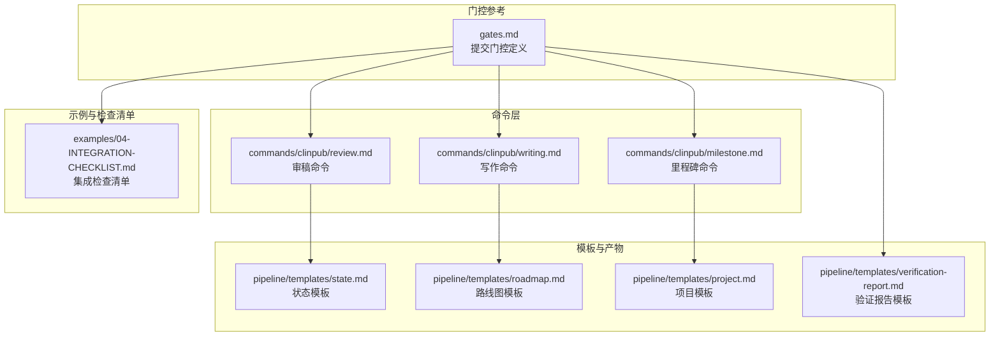
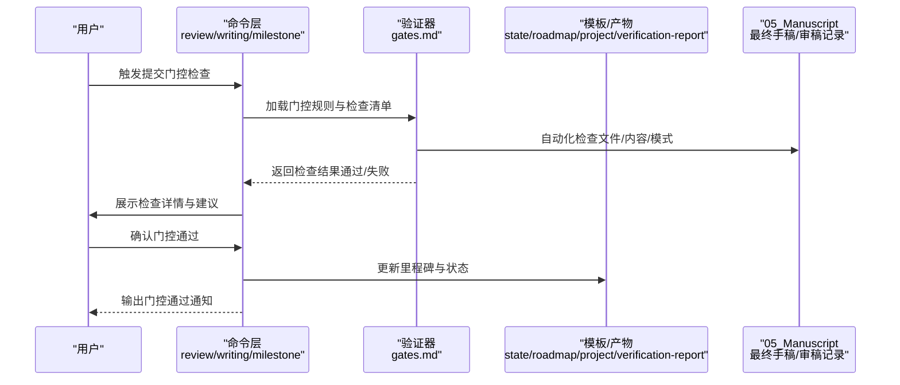
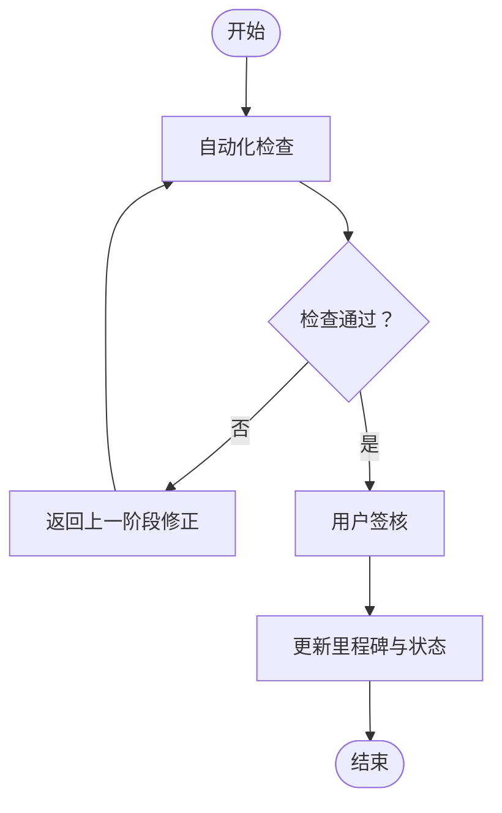
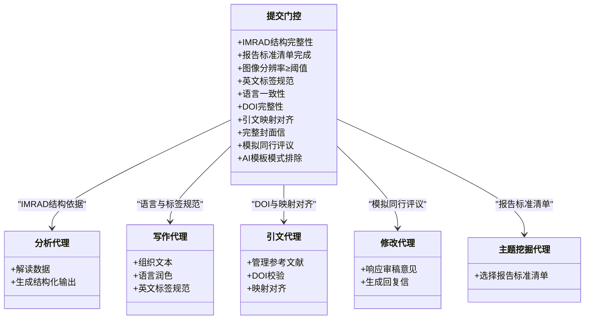
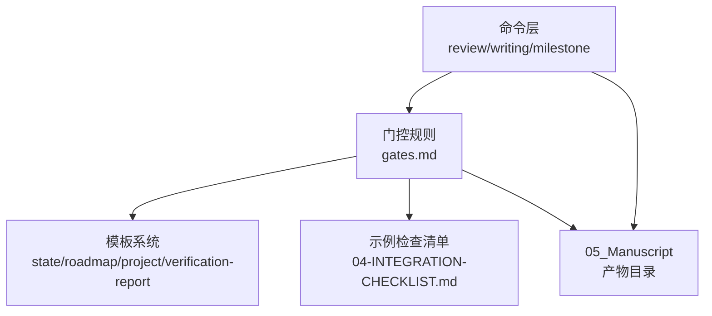

# 提交门控

<cite>
**本文档引用的文件**
- [gates.md](file://pipeline/references/gates.md)
- [04-INTEGRATION-CHECKLIST.md](file://examples/04-INTEGRATION-CHECKLIST.md)
- [review.md](file://commands/clinpub/review.md)
- [writing.md](file://commands/clinpub/writing.md)
- [milestone.md](file://commands/clinpub/milestone.md)
- [state.md](file://pipeline/templates/state.md)
- [roadmap.md](file://pipeline/templates/roadmap.md)
- [project.md](file://pipeline/templates/project.md)
- [verification-report.md](file://pipeline/templates/verification-report.md)
- [analyst-agent.md](file://agents/analyst-agent.md)
- [clinpub-verifier.md](file://agents/clinpub-verifier.md)
- [reference-agent.md](file://agents/reference-agent.md)
- [writer-agent.md](file://agents/writer-agent.md)
- [modify-agent.md](file://agents/modify-agent.md)
- [topic-miner-agent.md](file://agents/topic-miner-agent.md)
- [clinpub-planner.md](file://agents/clinpub-planner.md)
- [clinpub-executor.md](file://agents/clinpub-executor.md)
</cite>

## 目录
1. [简介](#简介)
2. [项目结构](#项目结构)
3. [核心组件](#核心组件)
4. [架构总览](#架构总览)
5. [详细组件分析](#详细组件分析)
6. [依赖关系分析](#依赖关系分析)
7. [性能考虑](#性能考虑)
8. [故障排除指南](#故障排除指南)
9. [结论](#结论)
10. [附录](#附录)

## 简介
本文件面向“提交门控”（Submission Gate，Phase 4 → Submit）阶段，提供面向学术出版的最终审查与质量把关的技术文档。该门控确保研究论文在进入正式投稿前满足期刊的格式、内容、语言与合规性要求，涵盖十一项关键检查点，并配套自动化验证流程与人工确认机制。

## 项目结构
提交门控位于“门控参考”文件中，作为贯穿各阶段的强制性质量门槛。其输出产物主要位于“05_Manuscript”目录下，包括最终手稿、审稿记录与验证报告等。

**图表来源**
- [gates.md](file://pipeline/references/gates.md)
- [review.md](file://commands/clinpub/review.md)
- [writing.md](file://commands/clinpub/writing.md)
- [milestone.md](file://commands/clinpub/milestone.md)
- [state.md](file://pipeline/templates/state.md)
- [roadmap.md](file://pipeline/templates/roadmap.md)
- [project.md](file://pipeline/templates/project.md)
- [verification-report.md](file://pipeline/templates/verification-report.md)
- [04-INTEGRATION-CHECKLIST.md](file://examples/04-INTEGRATION-CHECKLIST.md)

**章节来源**
- [gates.md](file://pipeline/references/gates.md)
- [04-INTEGRATION-CHECKLIST.md](file://examples/04-INTEGRATION-CHECKLIST.md)

## 核心组件
提交门控由以下核心要素构成：
- 十一项强制检查项目：IMRAD结构完整性、报告标准清单完成、图像分辨率要求、英文标签规范、语言一致性、DOI完整性、引文映射对齐、完整封面信、模拟同行评议、AI模板模式排除。
- 自动化验证流程：在人工复核前执行文件存在性、内容完整性与模式匹配等自动化检查。
- 决策与记录：门控结果需经用户确认通过，并在里程碑中记录时间戳与状态。
- 失败阻断：任一检查未达标将阻止进入下一阶段，直至问题修复并通过复检。

**章节来源**
- [gates.md](file://pipeline/references/gates.md)

## 架构总览
提交门控的执行流程分为“自动化预检→人工复核→用户签核→记录归档”四个阶段，确保质量与可追溯性。

**图表来源**
- [gates.md](file://pipeline/references/gates.md)
- [review.md](file://commands/clinpub/review.md)
- [writing.md](file://commands/clinpub/writing.md)
- [milestone.md](file://commands/clinpub/milestone.md)
- [state.md](file://pipeline/templates/state.md)
- [roadmap.md](file://pipeline/templates/roadmap.md)
- [project.md](file://pipeline/templates/project.md)
- [verification-report.md](file://pipeline/templates/verification-report.md)

## 详细组件分析

### 门控规则与检查清单
提交门控定义了十一项必须满足的条件，任何一项不达标都将导致门控失败，需要返回上一阶段进行修正。

- IMRAD结构完整性：要求论文具备完整的引言、方法、结果、讨论部分，且内容充实。
- 报告标准清单完成：要求完成STROBE/CONSORT/TRIPOD等相应清单。
- 图像分辨率要求：所有图像分辨率不低于阈值（例如300 DPI），以保证印刷质量。
- 英文标签规范：所有图表的轴标签、图例、注释必须使用英文。
- 语言一致性：正文使用中文，图表与表格标签使用英文，避免中英混用造成歧义。
- DOI完整性：每一条参考文献条目均应包含有效的DOI。
- 引文映射对齐：文中引用与参考文献列表一一对应，无遗漏或多余。
- 完整封面信：包含新颖性声明、重要性说明、利益冲突披露等必要信息。
- 模拟同行评议：生成并保存审稿意见与作者回复记录。
- AI模板模式排除：通过“人类化”检查清单，排除AI模板痕迹。

上述规则与流程在门控参考文件中有明确描述，并配套自动化验证与人工复核环节。

**章节来源**
- [gates.md](file://pipeline/references/gates.md)

### 自动化验证流程
自动化验证在人工复核之前执行，主要包括：
- 文件存在性与非空检查：如最终手稿、审稿记录等关键文件是否齐全。
- 内容完整性检查：如封面信是否包含必要段落，引文映射是否完整。
- 模式匹配检查：如图像分辨率阈值、英文标签正则表达式、DOI格式等。

这些检查通过命令层脚本与模板配合完成，确保在进入人工复核前消除明显的结构性问题。

**章节来源**
- [gates.md](file://pipeline/references/gates.md)
- [review.md](file://commands/clinpub/review.md)
- [writing.md](file://commands/clinpub/writing.md)

### 决策与记录机制
门控通过“决策_checkpoint_”向用户展示检查结果，并要求用户确认通过。一旦通过，系统将在里程碑文件中记录门控通过的时间戳与状态，确保流程可追溯。

**图表来源**
- [gates.md](file://pipeline/references/gates.md)
- [milestone.md](file://commands/clinpub/milestone.md)
- [state.md](file://pipeline/templates/state.md)

**章节来源**
- [gates.md](file://pipeline/references/gates.md)
- [milestone.md](file://commands/clinpub/milestone.md)

### 示例检查清单与恢复策略
集成检查清单提供了针对“05_Manuscript”目录的关键产物进行快速核验的方法，包括审稿记录、最终目录与手稿文件的存在性检查。若审稿过程被中断，可在修复问题后重新运行审稿命令，Phase 3的产出不受影响。

**章节来源**
- [04-INTEGRATION-CHECKLIST.md](file://examples/04-INTEGRATION-CHECKLIST.md)

### 门控与各智能体的协作
提交门控涉及多个智能体的协同工作：
- 分析代理：负责数据解读与结构化输出，为IMRAD结构完整性提供依据。
- 写作代理：负责文本组织与语言润色，保障语言一致性与英文标签规范。
- 引文代理：负责参考文献管理与DOI完整性校验。
- 修改代理：根据审稿意见进行针对性修改，支持模拟同行评议闭环。
- 主题挖掘代理：辅助确定报告标准清单适用类型（如STROBE/CONSORT/TRIPOD）。
- 规划与执行代理：协调门控流程与命令执行，确保自动化与人工环节衔接。

**图表来源**
- [gates.md](file://pipeline/references/gates.md)
- [analyst-agent.md](file://agents/analyst-agent.md)
- [writer-agent.md](file://agents/writer-agent.md)
- [reference-agent.md](file://agents/reference-agent.md)
- [modify-agent.md](file://agents/modify-agent.md)
- [topic-miner-agent.md](file://agents/topic-miner-agent.md)

**章节来源**
- [analyst-agent.md](file://agents/analyst-agent.md)
- [writer-agent.md](file://agents/writer-agent.md)
- [reference-agent.md](file://agents/reference-agent.md)
- [modify-agent.md](file://agents/modify-agent.md)
- [topic-miner-agent.md](file://agents/topic-miner-agent.md)

## 依赖关系分析
提交门控的执行依赖于命令层、模板系统与示例检查清单的协同：
- 命令层：review/writing/milestone命令驱动门控流程。
- 模板系统：state/roadmap/project/verification-report模板用于记录与归档。
- 示例检查清单：提供快速核验方法与恢复策略。

**图表来源**
- [gates.md](file://pipeline/references/gates.md)
- [review.md](file://commands/clinpub/review.md)
- [writing.md](file://commands/clinpub/writing.md)
- [milestone.md](file://commands/clinpub/milestone.md)
- [state.md](file://pipeline/templates/state.md)
- [roadmap.md](file://pipeline/templates/roadmap.md)
- [project.md](file://pipeline/templates/project.md)
- [verification-report.md](file://pipeline/templates/verification-report.md)
- [04-INTEGRATION-CHECKLIST.md](file://examples/04-INTEGRATION-CHECKLIST.md)

**章节来源**
- [gates.md](file://pipeline/references/gates.md)
- [review.md](file://commands/clinpub/review.md)
- [writing.md](file://commands/clinpub/writing.md)
- [milestone.md](file://commands/clinpub/milestone.md)

## 性能考虑
- 自动化检查优先：在人工复核前执行文件存在性与模式匹配检查，减少无效人工成本。
- 并行化处理：图像分辨率与标签规范检查可并行执行，提升整体效率。
- 可恢复流程：若审稿中断，可快速定位问题并重跑相关命令，降低返工成本。

## 故障排除指南
常见提交错误与修改建议：
- 图像分辨率不足：统一调整至不低于阈值，确保印刷质量。
- 英文标签缺失：批量检查图表标签，补齐轴标签、图例与注释的英文版本。
- 语言混用：正文保持中文，图表与表格标签统一英文，避免中英混排。
- DOI缺失：逐条核查参考文献，补充有效DOI；无法获取时注明原因。
- 引文映射不一致：核对文中引用与参考文献列表，确保一一对应。
- 封面信不完整：补充新颖性、重要性与利益冲突声明。
- 审稿记录缺失：重新生成审稿意见与作者回复，确保有据可查。
- AI模板痕迹：通过人类化检查清单逐项排查，去除模板化表述。

**章节来源**
- [gates.md](file://pipeline/references/gates.md)
- [04-INTEGRATION-CHECKLIST.md](file://examples/04-INTEGRATION-CHECKLIST.md)

## 结论
提交门控是确保研究成果达到学术出版质量标准的关键环节。通过十一项强制检查、自动化验证与人工复核相结合的方式，系统能够在进入正式投稿前识别并修复潜在问题，显著提升录用成功率与出版质量。建议在每次提交前严格执行门控流程，并在里程碑中完整记录门控状态，形成可追溯的质量档案。

## 附录
- 术语说明
  - IMRAD：引言、方法、结果、讨论的论文结构框架。
  - 报告标准清单：如STROBE（观察性研究）、CONSORT（随机对照试验）、TRIPOD（预测模型）等。
  - 门控通过：所有检查项达标并通过用户确认。
  - 失败阻断：任一检查未达标将阻止进入下一阶段。