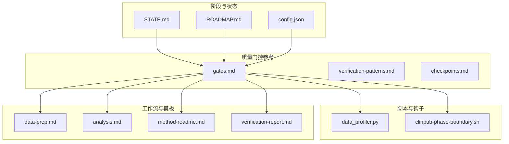
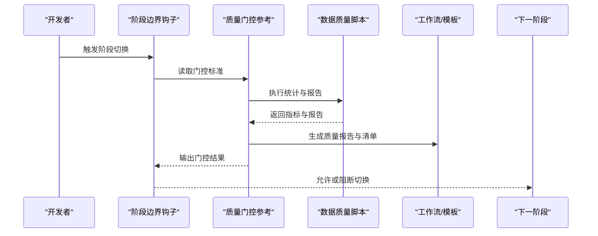
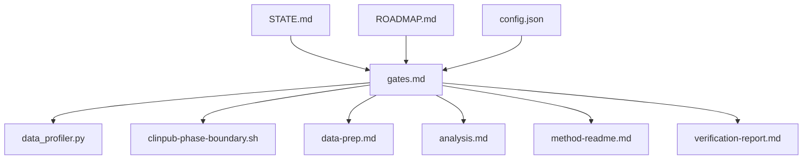

# 数据质量门控

<cite>
**本文引用的文件**
- [gates.md](file://pipeline/references/gates.md)
- [data_profiler.py](file://scripts/data_profiler.py)
- [clinpub-phase-boundary.sh](file://hooks/clinpub-phase-boundary.sh)
- [analysis.md](file://pipeline/workflows/analysis.md)
- [data-prep.md](file://pipeline/workflows/data-prep.md)
- [init-project.md](file://pipeline/workflows/init-project.md)
- [STATE.md](file://pipeline/phases/STATE.md)
- [ROADMAP.md](file://pipeline/phases/ROADMAP.md)
- [config.json](file://pipeline/phases/config.json)
- [verification-patterns.md](file://pipeline/references/verification-patterns.md)
- [mandatory-initial-read.md](file://pipeline/references/mandatory-initial-read.md)
- [manifest-format.md](file://pipeline/references/manifest-format.md)
- [checkpoints.md](file://pipeline/references/checkpoints.md)
- [reference-library.md](file://pipeline/references/reference-library.md)
- [r_patterns.md](file://pipeline/references/r_patterns.md)
- [agent-contracts.md](file://pipeline/references/agent-contracts.md)
- [citation-strategy.md](file://pipeline/references/citation-strategy.md)
- [comparison-methods.md](file://pipeline/references/comparison-methods.md)
- [concatenation-protocol.md](file://pipeline/references/concatenation-protocol.md)
- [method-readme.md](file://pipeline/templates/method-readme.md)
- [spec.md](file://pipeline/templates/spec.md)
- [state.md](file://pipeline/templates/state.md)
- [roadmap.md](file://pipeline/templates/roadmap.md)
- [verification-report.md](file://pipeline/templates/verification-report.md)
- [project_config.yml](file://pipeline/templates/project_config.yml)
- [project.md](file://pipeline/templates/project.md)
- [context.md](file://pipeline/templates/context.md)
- [UAT.md](file://pipeline/templates/UAT.md)
- [VALIDATION.md](file://pipeline/templates/VALIDATION.md)
- [idea_report.md](file://pipeline/templates/idea_report.md)
- [study_types](file://pipeline/templates/study_types)
- [04-INTEGRATION-CHECKLIST.md](file://examples/04-INTEGRATION-CHECKLIST.md)
- [project_config.example.yml](file://examples/project_config.example.yml)
- [install.js](file://bin/install.js)
- [requirements.txt](file://requirements.txt)
- [package.json](file://package.json)
</cite>

## 目录
1. [引言](#引言)
2. [项目结构](#项目结构)
3. [核心组件](#核心组件)
4. [架构总览](#架构总览)
5. [详细组件分析](#详细组件分析)
6. [依赖关系分析](#依赖关系分析)
7. [性能考量](#性能考量)
8. [故障排查指南](#故障排查指南)
9. [结论](#结论)
10. [附录](#附录)

## 引言
本文件围绕“数据质量门控”（Data Quality Gate）在项目从 Phase 1 到 Phase 2 的过渡中的作用与标准展开，聚焦七个关键检查项：cleaned.csv 文件存在性、变量字典完整性、缺失率容忍度、样本量充足性、异常值处理记录、数据质量报告生成以及可重现的清洗代码。文档旨在帮助研发与运营人员建立一致的质量标准、验证流程与最佳实践，确保数据在进入下一阶段前满足既定规范。

## 项目结构
该项目采用分阶段流水线与参考模板相结合的组织方式，核心质量门控相关文件主要分布在以下位置：
- 阶段状态与路线图：pipeline/phases/STATE.md、ROADMAP.md、config.json
- 质量门控与校验参考：pipeline/references/gates.md、verification-patterns.md、checkpoints.md
- 清洗与报告脚本：scripts/data_profiler.py
- 阶段边界钩子：hooks/clinpub-phase-boundary.sh
- 工作流与模板：pipeline/workflows/*.md、pipeline/templates/*.md
- 示例与配置：examples/*、pipeline/templates/project_config.yml

**图表来源**
- [STATE.md](file://pipeline/phases/STATE.md)
- [ROADMAP.md](file://pipeline/phases/ROADMAP.md)
- [config.json](file://pipeline/phases/config.json)
- [gates.md](file://pipeline/references/gates.md)
- [verification-patterns.md](file://pipeline/references/verification-patterns.md)
- [checkpoints.md](file://pipeline/references/checkpoints.md)
- [data_profiler.py](file://scripts/data_profiler.py)
- [clinpub-phase-boundary.sh](file://hooks/clinpub-phase-boundary.sh)
- [data-prep.md](file://pipeline/workflows/data-prep.md)
- [analysis.md](file://pipeline/workflows/analysis.md)
- [method-readme.md](file://pipeline/templates/method-readme.md)
- [verification-report.md](file://pipeline/templates/verification-report.md)

**章节来源**
- [STATE.md](file://pipeline/phases/STATE.md)
- [ROADMAP.md](file://pipeline/phases/ROADMAP.md)
- [config.json](file://pipeline/phases/config.json)
- [gates.md](file://pipeline/references/gates.md)
- [verification-patterns.md](file://pipeline/references/verification-patterns.md)
- [checkpoints.md](file://pipeline/references/checkpoints.md)
- [data_profiler.py](file://scripts/data_profiler.py)
- [clinpub-phase-boundary.sh](file://hooks/clinpub-phase-boundary.sh)
- [data-prep.md](file://pipeline/workflows/data-prep.md)
- [analysis.md](file://pipeline/workflows/analysis.md)
- [method-readme.md](file://pipeline/templates/method-readme.md)
- [verification-report.md](file://pipeline/templates/verification-report.md)

## 核心组件
- 阶段状态与路线图：定义 Phase 1→Phase 2 的切换条件与里程碑，为门控提供上下文依据。
- 质量门控参考：明确七个检查项的具体要求与验证方法，作为门控执行的权威标准。
- 数据质量脚本：提供缺失率、异常值等统计指标的自动化计算与报告生成能力。
- 阶段边界钩子：在阶段切换时触发门控检查，确保只有通过门控的数据才能进入下一阶段。
- 工作流与模板：为数据准备、分析与报告提供标准化流程与产物格式。

**章节来源**
- [STATE.md](file://pipeline/phases/STATE.md)
- [ROADMAP.md](file://pipeline/phases/ROADMAP.md)
- [gates.md](file://pipeline/references/gates.md)
- [data_profiler.py](file://scripts/data_profiler.py)
- [clinpub-phase-boundary.sh](file://hooks/clinpub-phase-boundary.sh)
- [data-prep.md](file://pipeline/workflows/data-prep.md)
- [analysis.md](file://pipeline/workflows/analysis.md)

## 架构总览
下图展示了从 Phase 1 到 Phase 2 的数据质量门控流程：阶段边界钩子触发门控检查，依据质量门控参考与脚本输出进行判定，并生成质量报告与可追溯的清洗记录，最终决定是否允许进入下一阶段。

**图表来源**
- [clinpub-phase-boundary.sh](file://hooks/clinpub-phase-boundary.sh)
- [gates.md](file://pipeline/references/gates.md)
- [data_profiler.py](file://scripts/data_profiler.py)
- [data-prep.md](file://pipeline/workflows/data-prep.md)
- [analysis.md](file://pipeline/workflows/analysis.md)
- [verification-report.md](file://pipeline/templates/verification-report.md)

## 详细组件分析

### 1) cleaned.csv 文件存在性
- 目标：确保清洗后数据集已生成并可访问，作为后续分析的基础。
- 检查要点：
  - 清洗工作流完成后，必须生成 cleaned.csv 并放置于约定路径。
  - 文件可读且非空，避免误用空文件。
- 验证方法：
  - 在阶段边界钩子中对目标路径进行存在性与大小检查。
  - 结合工作流模板中的产物清单，核对产物是否被声明与实际生成一致。
- 质量标准：
  - 必须存在；大小大于零；命名与项目约定一致。

**章节来源**
- [data-prep.md](file://pipeline/workflows/data-prep.md)
- [checkpoints.md](file://pipeline/references/checkpoints.md)
- [manifest-format.md](file://pipeline/references/manifest-format.md)

### 2) 变量字典完整性
- 目标：保证所有变量均有清晰的定义与类型说明，便于复现与共享。
- 检查要点：
  - 变量名、标签、类型、取值范围/枚举、缺失值标记应完整。
  - 字典与清洗脚本中的变量映射保持一致。
- 验证方法：
  - 使用数据质量脚本输出的变量摘要与字典比对。
  - 通过模板生成的变量字典文件进行一致性校验。
- 质量标准：
  - 无遗漏变量；类型与取值范围描述准确；与清洗逻辑一致。

**章节来源**
- [gates.md](file://pipeline/references/gates.md)
- [data_profiler.py](file://scripts/data_profiler.py)
- [method-readme.md](file://pipeline/templates/method-readme.md)
- [mandatory-initial-read.md](file://pipeline/references/mandatory-initial-read.md)

### 3) 缺失率容忍度
- 目标：控制各变量的缺失比例在可接受范围内，避免引入系统性偏差。
- 检查要点：
  - 对每个变量计算缺失率阈值，超过阈值需说明原因或剔除。
  - 分析缺失模式（MCAR/MAR/MCAR），必要时进行插补或建模处理。
- 验证方法：
  - 数据质量脚本输出缺失统计与可视化，结合门控参考设定阈值。
  - 生成缺失模式报告，供审阅与决策。
- 质量标准：
  - 单变量缺失率不超过项目阈值；缺失机制可控且可解释。

**章节来源**
- [gates.md](file://pipeline/references/gates.md)
- [data_profiler.py](file://scripts/data_profiler.py)
- [verification-patterns.md](file://pipeline/references/verification-patterns.md)

### 4) 样本量充足性
- 目标：确保样本规模满足统计检验与模型训练的最低要求。
- 检查要点：
  - 统计功效与样本量估算需有依据；关注亚组分析的最小样本数。
  - 异常样本（极端值、离群点）对样本量的影响评估。
- 验证方法：
  - 基于描述性统计与假设检验参数，计算所需样本量并对比实际样本数。
  - 生成样本量评估报告，标注潜在风险。
- 质量标准：
  - 总样本量与亚组样本量均满足研究设计要求；异常值处理不影响结论稳健性。

**章节来源**
- [gates.md](file://pipeline/references/gates.md)
- [data_profiler.py](file://scripts/data_profiler.py)
- [analysis.md](file://pipeline/workflows/analysis.md)

### 5) 异常值处理记录
- 目标：对异常值的识别、处理与替代策略进行完整记录，确保可追溯与可复现。
- 检查要点：
  - 明确异常值定义（如基于分布、领域知识或模型残差）。
  - 记录处理前后对比（统计量变化、模型稳定性影响）。
- 验证方法：
  - 清洗脚本输出异常值检测与处理清单；与清洗代码一一对应。
  - 生成异常值处理报告，包含前后对比与敏感性分析。
- 质量标准：
  - 处理策略透明、可重复；对下游分析影响可评估。

**章节来源**
- [gates.md](file://pipeline/references/gates.md)
- [data_profiler.py](file://scripts/data_profiler.py)
- [data-prep.md](file://pipeline/workflows/data-prep.md)

### 6) 数据质量报告生成
- 目标：形成标准化的质量报告，汇总关键指标与结论，支撑门控决策。
- 检查要点：
  - 报告模板包含：缺失率、异常值、样本量、变量字典、清洗步骤摘要。
  - 报告可导出为固定格式，便于归档与审阅。
- 验证方法：
  - 使用模板生成报告草稿，经人工审阅与自动校验（字段完整性、格式一致性）。
  - 将报告与脚本输出进行字段级比对。
- 质量标准：
  - 内容完整、格式统一、结论明确、可追溯。

**章节来源**
- [gates.md](file://pipeline/references/gates.md)
- [verification-report.md](file://pipeline/templates/verification-report.md)
- [data_profiler.py](file://scripts/data_profiler.py)

### 7) 可重现的清洗代码
- 目标：清洗过程完全可重现，确保不同时间、不同环境下的结果一致。
- 检查要点：
  - 清洗脚本包含完整依赖声明、随机种子设置、输入输出路径配置。
  - 产出物与中间结果可被版本化管理与审计。
- 验证方法：
  - 重新运行清洗脚本，比对输出与历史快照的一致性。
  - 使用钩子在阶段切换时自动执行清洗并记录日志。
- 质量标准：
  - 代码可执行、依赖可安装、结果可复现、日志可审计。

**章节来源**
- [gates.md](file://pipeline/references/gates.md)
- [data-prep.md](file://pipeline/workflows/data-prep.md)
- [data_profiler.py](file://scripts/data_profiler.py)
- [clinpub-phase-boundary.sh](file://hooks/clinpub-phase-boundary.sh)

## 依赖关系分析
质量门控涉及多模块协作：阶段状态与路线图为门控提供上下文；质量门控参考定义检查标准；脚本负责统计与报告；钩子负责触发与拦截；工作流与模板提供产物与流程规范。

**图表来源**
- [STATE.md](file://pipeline/phases/STATE.md)
- [ROADMAP.md](file://pipeline/phases/ROADMAP.md)
- [config.json](file://pipeline/phases/config.json)
- [gates.md](file://pipeline/references/gates.md)
- [data_profiler.py](file://scripts/data_profiler.py)
- [clinpub-phase-boundary.sh](file://hooks/clinpub-phase-boundary.sh)
- [data-prep.md](file://pipeline/workflows/data-prep.md)
- [analysis.md](file://pipeline/workflows/analysis.md)
- [method-readme.md](file://pipeline/templates/method-readme.md)
- [verification-report.md](file://pipeline/templates/verification-report.md)

**章节来源**
- [STATE.md](file://pipeline/phases/STATE.md)
- [ROADMAP.md](file://pipeline/phases/ROADMAP.md)
- [config.json](file://pipeline/phases/config.json)
- [gates.md](file://pipeline/references/gates.md)
- [data_profiler.py](file://scripts/data_profiler.py)
- [clinpub-phase-boundary.sh](file://hooks/clinpub-phase-boundary.sh)
- [data-prep.md](file://pipeline/workflows/data-prep.md)
- [analysis.md](file://pipeline/workflows/analysis.md)
- [method-readme.md](file://pipeline/templates/method-readme.md)
- [verification-report.md](file://pipeline/templates/verification-report.md)

## 性能考量
- 自动化统计与报告生成：优先使用批处理与缓存策略，减少重复计算。
- 可重现性与依赖管理：统一依赖声明与环境镜像，降低运行时差异。
- 钩子触发效率：门控检查应尽量轻量化，仅做必要验证，避免阻塞主流程。
- 报告生成：模板渲染与文件写入应异步化，避免阻塞阶段切换。

## 故障排查指南
- cleaned.csv 不存在
  - 检查清洗工作流是否成功执行，确认产物清单与实际输出一致。
  - 核对路径与权限，确保脚本可写入目标目录。
- 变量字典不完整
  - 对照清洗脚本中的变量映射，补齐缺失字段；确保类型与取值范围描述准确。
- 缺失率超阈值
  - 审视缺失模式，必要时调整阈值或删除变量；记录处理依据。
- 样本量不足
  - 重新评估统计功效与样本量估算；考虑扩大采集或合并数据源。
- 异常值处理争议
  - 回溯异常值定义与处理策略，补充前后对比与敏感性分析。
- 质量报告缺失或格式错误
  - 检查模板与脚本输出字段一致性；修正模板或脚本以匹配。
- 清洗代码不可重现
  - 检查依赖安装、随机种子与输入输出路径；重新执行并比对结果。

**章节来源**
- [checkpoints.md](file://pipeline/references/checkpoints.md)
- [verification-patterns.md](file://pipeline/references/verification-patterns.md)
- [data-prep.md](file://pipeline/workflows/data-prep.md)
- [data_profiler.py](file://scripts/data_profiler.py)

## 结论
数据质量门控是确保数据从 Phase 1 稳健过渡到 Phase 2 的关键保障。通过明确七个检查项的标准与验证方法，并结合脚本化统计、模板化报告与钩子式拦截，可以有效提升数据的完整性、一致性与可复现性。建议在团队内固化门控流程与模板，持续优化阈值与策略，以适应不同研究场景与数据特征。

## 附录
- 最佳实践
  - 在清洗前先生成变量字典与缺失模式概览，再制定清洗策略。
  - 对异常值与缺失进行成对分析，避免单一维度判断导致偏差。
  - 将清洗步骤与报告同步版本化，便于回溯与审计。
- 常见问题与修复
  - 若清洗后变量数量减少，需评估是否为合理剔除或误删。
  - 若报告字段缺失，优先修复模板或脚本输出，确保字段对齐。
  - 若样本量不足，优先扩充数据或调整分析策略，避免牺牲数据质量。