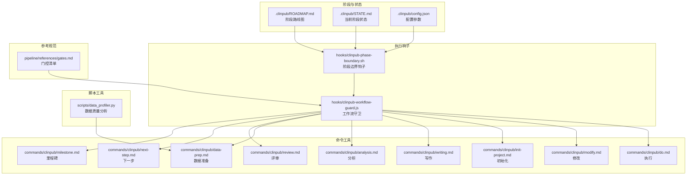
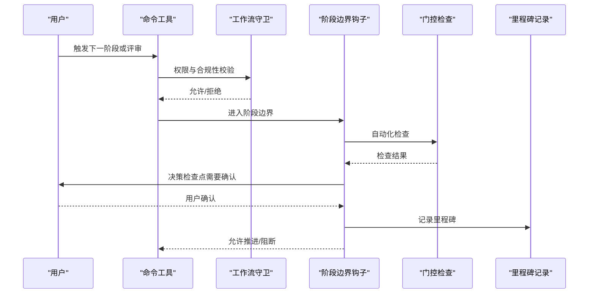
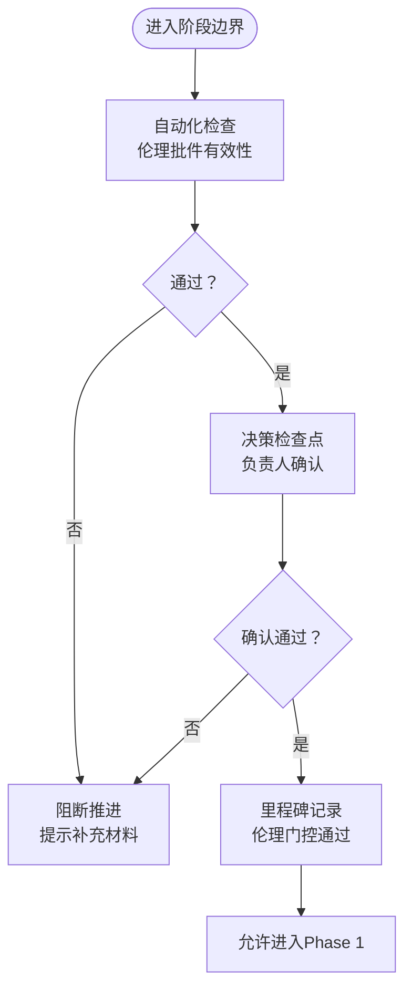
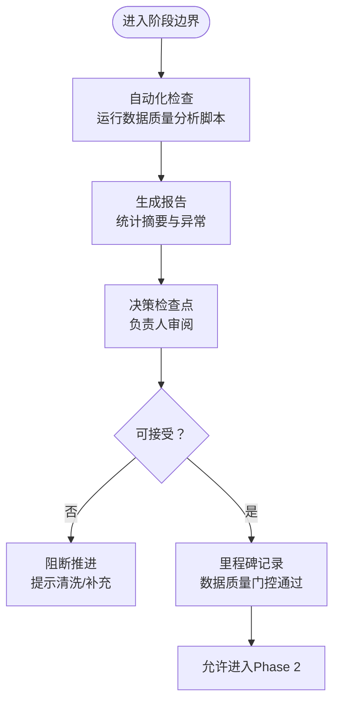
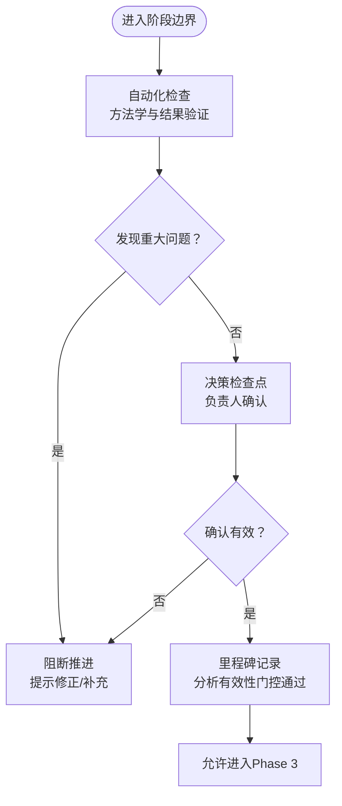
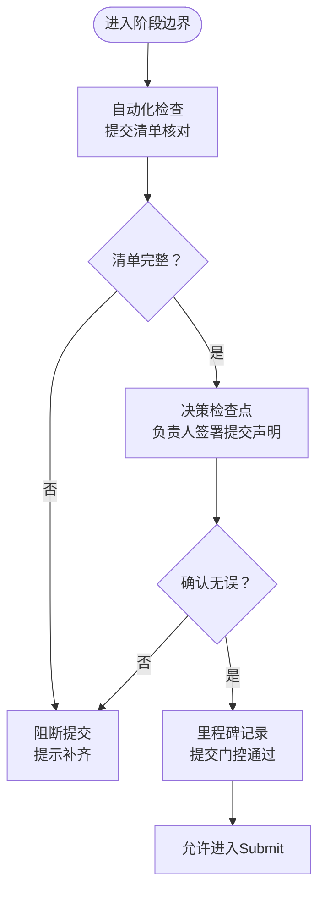
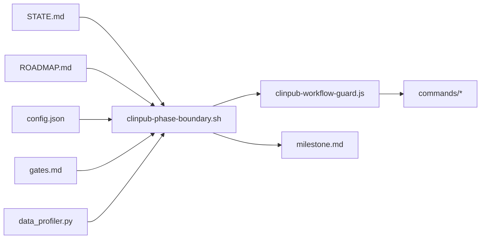

# 质量门控机制

<cite>
**本文档引用的文件**
- [ROADMAP.md](file://.clinpub/ROADMAP.md)
- [STATE.md](file://.clinpub/STATE.md)
- [config.json](file://.clinpub/config.json)
- [clinpub-phase-boundary.sh](file://hooks/clinpub-phase-boundary.sh)
- [clinpub-workflow-guard.js](file://hooks/clinpub-workflow-guard.js)
- [gates.md](file://pipeline/references/gates.md)
- [milestone.md](file://commands/clinpub/milestone.md)
- [next-step.md](file://commands/clinpub/next-step.md)
- [review.md](file://commands/clinpub/review.md)
- [data-prep.md](file://commands/clinpub/data-prep.md)
- [analysis.md](file://commands/clinpub/analysis.md)
- [writing.md](file://commands/clinpub/writing.md)
- [init-project.md](file://commands/clinpub/init-project.md)
- [modify.md](file://commands/clinpub/modify.md)
- [do.md](file://commands/clinpub/do.md)
- [data_profiler.py](file://scripts/data_profiler.py)
</cite>

## 目录
1. [引言](#引言)
2. [项目结构](#项目结构)
3. [核心组件](#核心组件)
4. [架构总览](#架构总览)
5. [详细组件分析](#详细组件分析)
6. [依赖关系分析](#依赖关系分析)
7. [性能考虑](#性能考虑)
8. [故障排除指南](#故障排除指南)
9. [结论](#结论)
10. [附录](#附录)

## 引言
本文件系统化梳理并阐述“质量门控机制”的设计与执行流程，覆盖从研究准备到提交的完整生命周期。质量门控以阶段边界为节点，通过五步执行流程（自动化检查、决策检查点、用户确认、里程碑记录、不可跳过原则）确保每个阶段的质量门槛被严格遵守。本文重点解析四大核心门控：
- IRB伦理门控（Phase 0→Phase 1）
- 数据质量门控（Phase 1→Phase 2）
- 分析有效性门控（Phase 2→Phase 3）
- 提交门控（Phase 4→Submit）

同时明确各门控的检查项目、通过条件、失败处理与强制执行机制，并给出覆盖例外情况与权限限制的具体规定。

## 项目结构
质量门控机制依托于以下关键要素协同工作：
- 阶段状态与路线图：由阶段状态文件与路线图文件定义阶段边界与推进规则
- 执行钩子：在阶段边界与工作流关键节点执行强制性检查
- 命令工具：提供门控触发、评审、里程碑记录等操作入口
- 参考规范：定义门控检查清单与验证模式
- 脚本工具：提供数据质量分析与报告能力

**图表来源**
- [ROADMAP.md](file://.clinpub/ROADMAP.md)
- [STATE.md](file://.clinpub/STATE.md)
- [config.json](file://.clinpub/config.json)
- [clinpub-phase-boundary.sh](file://hooks/clinpub-phase-boundary.sh)
- [clinpub-workflow-guard.js](file://hooks/clinpub-workflow-guard.js)
- [gates.md](file://pipeline/references/gates.md)
- [milestone.md](file://commands/clinpub/milestone.md)
- [next-step.md](file://commands/clinpub/next-step.md)
- [review.md](file://commands/clinpub/review.md)
- [data-prep.md](file://commands/clinpub/data-prep.md)
- [analysis.md](file://commands/clinpub/analysis.md)
- [writing.md](file://commands/clinpub/writing.md)
- [init-project.md](file://commands/clinpub/init-project.md)
- [modify.md](file://commands/clinpub/modify.md)
- [do.md](file://commands/clinpub/do.md)
- [data_profiler.py](file://scripts/data_profiler.py)

**章节来源**
- [ROADMAP.md](file://.clinpub/ROADMAP.md)
- [STATE.md](file://.clinpub/STATE.md)
- [config.json](file://.clinpub/config.json)
- [clinpub-phase-boundary.sh](file://hooks/clinpub-phase-boundary.sh)
- [clinpub-workflow-guard.js](file://hooks/clinpub-workflow-guard.js)
- [gates.md](file://pipeline/references/gates.md)
- [milestone.md](file://commands/clinpub/milestone.md)
- [next-step.md](file://commands/clinpub/next-step.md)
- [review.md](file://commands/clinpub/review.md)
- [data-prep.md](file://commands/clinpub/data-prep.md)
- [analysis.md](file://commands/clinpub/analysis.md)
- [writing.md](file://commands/clinpub/writing.md)
- [init-project.md](file://commands/clinpub/init-project.md)
- [modify.md](file://commands/clinpub/modify.md)
- [do.md](file://commands/clinpub/do.md)
- [data_profiler.py](file://scripts/data_profiler.py)

## 核心组件
- 阶段边界钩子：在阶段切换时强制执行门控检查，阻止不满足条件的推进
- 工作流守卫：在关键操作前进行权限与合规性校验
- 门控清单：定义每个门控的检查项、通过条件与失败处理策略
- 里程碑命令：用于记录阶段完成与质量证据
- 数据质量分析脚本：为数据质量门控提供量化指标与报告

**章节来源**
- [clinpub-phase-boundary.sh](file://hooks/clinpub-phase-boundary.sh)
- [clinpub-workflow-guard.js](file://hooks/clinpub-workflow-guard.js)
- [gates.md](file://pipeline/references/gates.md)
- [milestone.md](file://commands/clinpub/milestone.md)
- [data_profiler.py](file://scripts/data_profiler.py)

## 架构总览
质量门控的执行遵循“五步法”：自动化检查→决策检查点→用户确认→里程碑记录→不可跳过原则。系统通过阶段边界钩子与工作流守卫实现强制执行，通过命令工具与参考规范提供可操作的检查清单与证据记录。

**图表来源**
- [clinpub-workflow-guard.js](file://hooks/clinpub-workflow-guard.js)
- [clinpub-phase-boundary.sh](file://hooks/clinpub-phase-boundary.sh)
- [milestone.md](file://commands/clinpub/milestone.md)

## 详细组件分析

### IRB伦理门控（Phase 0→Phase 1）
- 设计原理：在进入正式研究阶段前，确保伦理审查与合规性要求得到满足，防止未经批准的研究活动开展。
- 执行流程：
  1) 自动化检查：验证伦理审批文件是否上传、编号是否有效、有效期是否在途。
  2) 决策检查点：系统提示伦理审查状态，等待负责人确认。
  3) 用户确认：负责人在界面中确认伦理合规状态。
  4) 里程碑记录：记录伦理门控通过与相关证据。
  5) 不可跳过原则：若伦理未通过，禁止进入Phase 1。
- 检查项目：
  - 伦理批件编号与来源
  - 审批日期与有效期
  - 研究范围与变更记录
- 通过条件：伦理批件有效且研究范围符合批准内容。
- 失败处理：阻断推进，提示补充材料或重新申请。
- 强制执行机制：阶段边界钩子在进入Phase 1前拦截，工作流守卫对相关命令进行权限控制。

**图表来源**
- [clinpub-phase-boundary.sh](file://hooks/clinpub-phase-boundary.sh)
- [milestone.md](file://commands/clinpub/milestone.md)

**章节来源**
- [clinpub-phase-boundary.sh](file://hooks/clinpub-phase-boundary.sh)
- [milestone.md](file://commands/clinpub/milestone.md)

### 数据质量门控（Phase 1→Phase 2）
- 设计原理：在进入分析阶段前，确保数据完整性、一致性与代表性达到可接受水平，避免分析偏差。
- 执行流程：
  1) 自动化检查：运行数据质量分析脚本，生成统计摘要与异常检测报告。
  2) 决策检查点：系统展示关键指标（如缺失率、分布异常、重复记录数）。
  3) 用户确认：负责人基于报告确认数据质量可接受。
  4) 里程碑记录：记录数据质量门控通过与报告存档。
  5) 不可跳过原则：若关键指标不达标，禁止进入Phase 2。
- 检查项目：
  - 缺失值比例与模式
  - 异常值与离群点
  - 数据类型与格式一致性
  - 样本量与分组平衡性
- 通过条件：关键指标在预设阈值内，异常可接受且已记录处理方案。
- 失败处理：阻断推进，提示清洗或补充数据。
- 强制执行机制：阶段边界钩子在进入Phase 2前拦截，工作流守卫限制相关命令。

**图表来源**
- [clinpub-phase-boundary.sh](file://hooks/clinpub-phase-boundary.sh)
- [data_profiler.py](file://scripts/data_profiler.py)
- [milestone.md](file://commands/clinpub/milestone.md)

**章节来源**
- [clinpub-phase-boundary.sh](file://hooks/clinpub-phase-boundary.sh)
- [data_profiler.py](file://scripts/data_profiler.py)
- [milestone.md](file://commands/clinpub/milestone.md)

### 分析有效性门控（Phase 2→Phase 3）
- 设计原理：在进入写作/报告阶段前，确保分析方法、假设与结果解释符合科学规范，避免误导性结论。
- 执行流程：
  1) 自动化检查：对照分析方法清单与验证模式，检查方法选择合理性与结果可复现性。
  2) 决策检查点：系统提示潜在问题（如多重比较、混杂变量、样本量不足）。
  3) 用户确认：负责人确认分析有效性与结论稳健性。
  4) 里程碑记录：记录分析有效性门控通过与方法学证据。
  5) 不可跳过原则：若存在重大方法学缺陷，禁止进入Phase 3。
- 检查项目：
  - 方法学适用性与假设满足度
  - 统计显著性与效应量
  - 敏感性分析与稳健性检验
  - 结论与证据的一致性
- 通过条件：方法学严谨、结果稳健、结论有据。
- 失败处理：阻断推进，提示修正方法或补充分析。
- 强制执行机制：阶段边界钩子在进入Phase 3前拦截，工作流守卫限制相关命令。

**图表来源**
- [clinpub-phase-boundary.sh](file://hooks/clinpub-phase-boundary.sh)
- [gates.md](file://pipeline/references/gates.md)
- [milestone.md](file://commands/clinpub/milestone.md)

**章节来源**
- [clinpub-phase-boundary.sh](file://hooks/clinpub-phase-boundary.sh)
- [gates.md](file://pipeline/references/gates.md)
- [milestone.md](file://commands/clinpub/milestone.md)

### 提交门控（Phase 4→Submit）
- 设计原理：在最终提交前，确保所有必需文档、声明与合规性要求齐备，避免遗漏导致的退回或延迟。
- 执行流程：
  1) 自动化检查：核对提交清单（文稿、表格、伦理、数据共享协议等）。
  2) 决策检查点：系统提示缺失项与风险点。
  3) 用户确认：负责人逐项确认并签署提交声明。
  4) 里程碑记录：记录提交门控通过与最终版本归档。
  5) 不可跳过原则：若清单不完整，禁止进入Submit。
- 检查项目：
  - 文档完整性与格式规范
  - 伦理与知情同意
  - 数据共享与版权许可
  - 作者贡献与利益冲突声明
- 通过条件：提交清单100%满足，无高风险缺失。
- 失败处理：阻断提交，提示补齐材料。
- 强制执行机制：阶段边界钩子在进入Submit前拦截，工作流守卫限制提交命令。

**图表来源**
- [clinpub-phase-boundary.sh](file://hooks/clinpub-phase-boundary.sh)
- [milestone.md](file://commands/clinpub/milestone.md)

**章节来源**
- [clinpub-phase-boundary.sh](file://hooks/clinpub-phase-boundary.sh)
- [milestone.md](file://commands/clinpub/milestone.md)

## 依赖关系分析
质量门控机制的关键依赖关系如下：
- 阶段边界钩子依赖阶段状态与路线图，确保仅在正确阶段执行相应门控
- 工作流守卫依赖配置与权限矩阵，决定命令可用性
- 门控清单作为检查依据，贯穿所有门控
- 里程碑命令依赖钩子输出，保证门控结果可追溯
- 数据质量分析脚本为数据质量门控提供客观指标

**图表来源**
- [STATE.md](file://.clinpub/STATE.md)
- [ROADMAP.md](file://.clinpub/ROADMAP.md)
- [config.json](file://.clinpub/config.json)
- [clinpub-phase-boundary.sh](file://hooks/clinpub-phase-boundary.sh)
- [clinpub-workflow-guard.js](file://hooks/clinpub-workflow-guard.js)
- [gates.md](file://pipeline/references/gates.md)
- [data_profiler.py](file://scripts/data_profiler.py)
- [milestone.md](file://commands/clinpub/milestone.md)

**章节来源**
- [STATE.md](file://.clinpub/STATE.md)
- [ROADMAP.md](file://.clinpub/ROADMAP.md)
- [config.json](file://.clinpub/config.json)
- [clinpub-phase-boundary.sh](file://hooks/clinpub-phase-boundary.sh)
- [clinpub-workflow-guard.js](file://hooks/clinpub-workflow-guard.js)
- [gates.md](file://pipeline/references/gates.md)
- [data_profiler.py](file://scripts/data_profiler.py)
- [milestone.md](file://commands/clinpub/milestone.md)

## 性能考虑
- 自动化检查应尽量异步化与缓存化，减少重复计算
- 报告生成应分模块与增量更新，避免大规模重跑
- 决策检查点应提供快速摘要与交互式筛选，提升人工确认效率
- 里程碑记录应采用轻量级存储与索引，便于审计与回溯

## 故障排除指南
- 门控被意外阻断
  - 检查阶段状态与路线图是否匹配当前阶段
  - 确认配置参数是否正确设置
  - 查看钩子日志与命令输出，定位具体失败项
- 数据质量门控反复失败
  - 使用数据质量分析脚本复核关键指标
  - 检查数据源与预处理流程
  - 在评审命令中记录处理方案与后续计划
- 提交门控无法通过
  - 对照门控清单逐项核查
  - 补充缺失文档并重新运行自动化检查
  - 在里程碑命令中更新最终版本信息

**章节来源**
- [clinpub-phase-boundary.sh](file://hooks/clinpub-phase-boundary.sh)
- [data_profiler.py](file://scripts/data_profiler.py)
- [milestone.md](file://commands/clinpub/milestone.md)

## 结论
质量门控机制通过“五步法”与四个核心门控，构建了从伦理合规、数据质量、分析有效性到提交完备性的全链路质量保障体系。阶段边界钩子与工作流守卫确保强制执行，命令工具与参考规范提供可操作的检查与记录手段。该机制既保证了研究过程的严谨性，也为最终成果的可复现与可提交奠定了坚实基础。

## 附录
- 例外情况与权限限制
  - 例外审批流程：重大特殊情况需经负责人审批并记录在案，方可绕过特定门控
  - 权限矩阵：不同角色对命令的可见性与执行权限由配置文件统一管理
  - 紧急通道：仅在不可抗力或严重缺陷修复场景下启用，需双人确认与审计留痕

**章节来源**
- [config.json](file://.clinpub/config.json)
- [clinpub-workflow-guard.js](file://hooks/clinpub-workflow-guard.js)
- [gates.md](file://pipeline/references/gates.md)