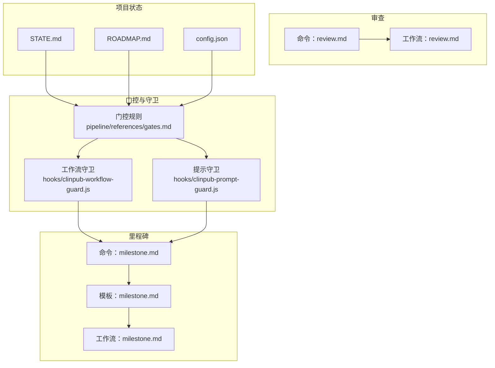
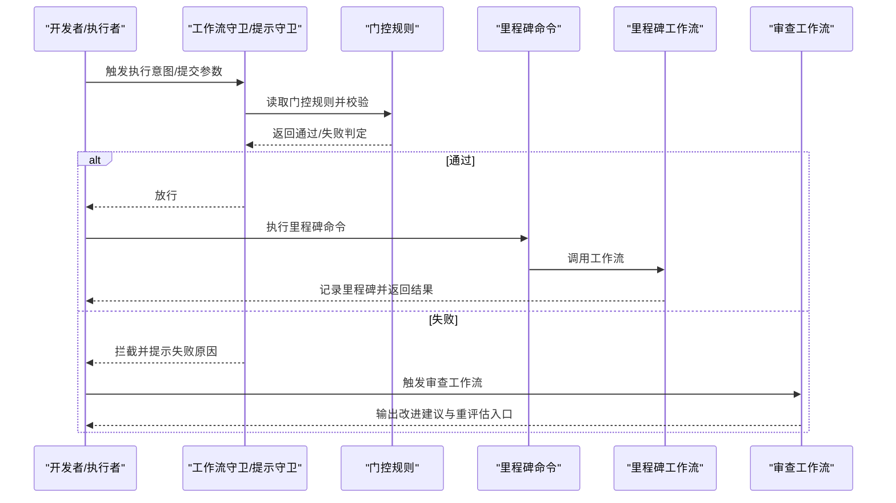
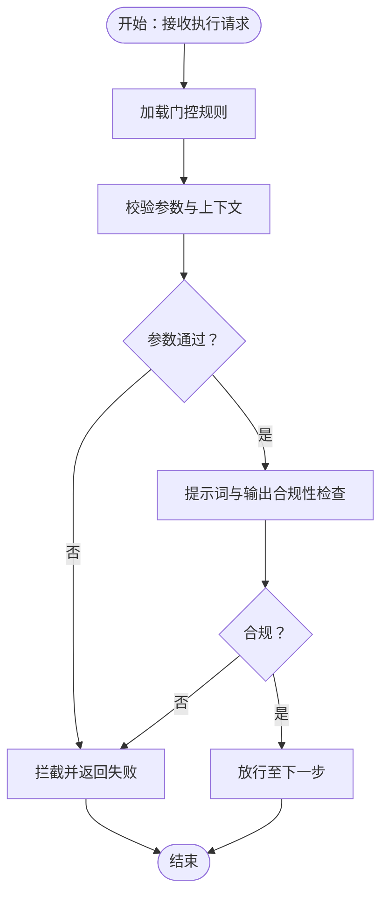
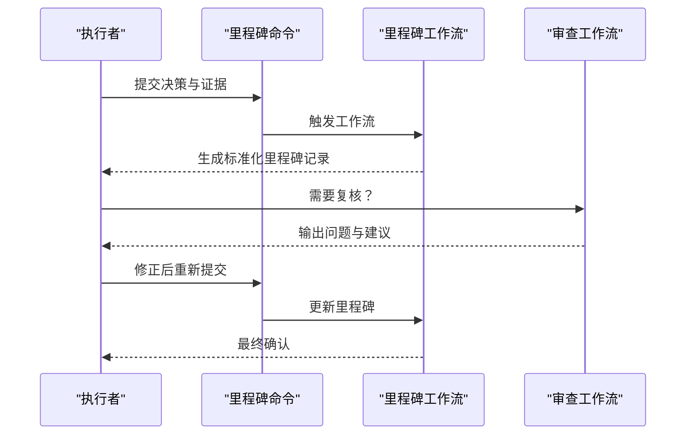
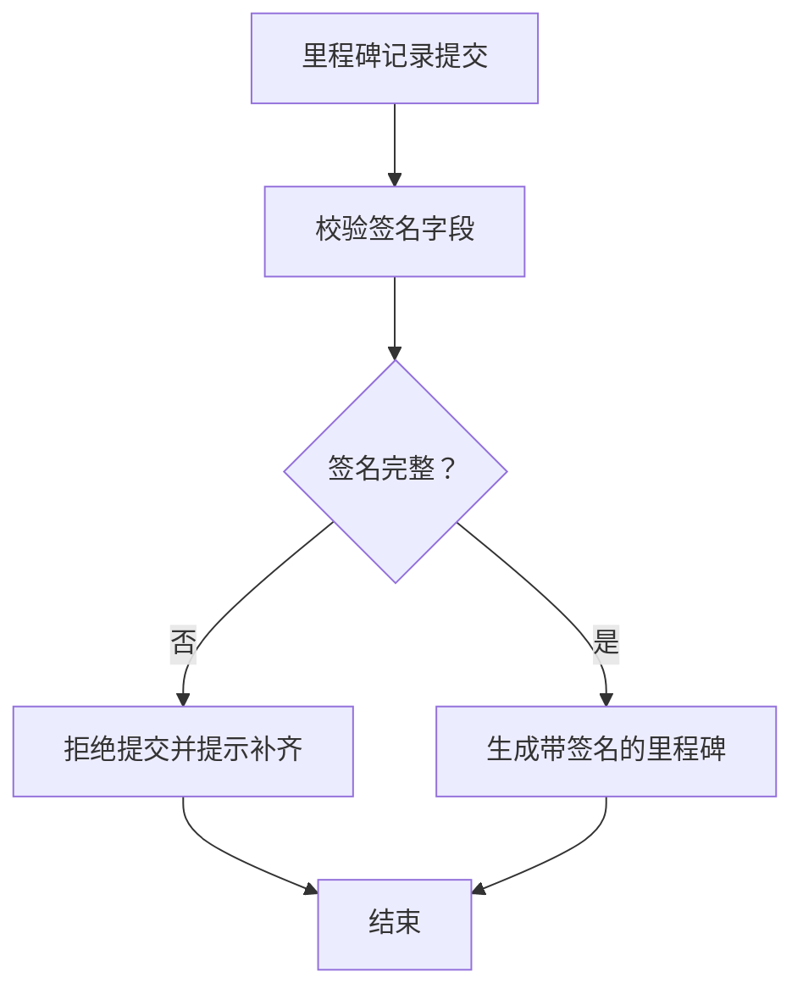
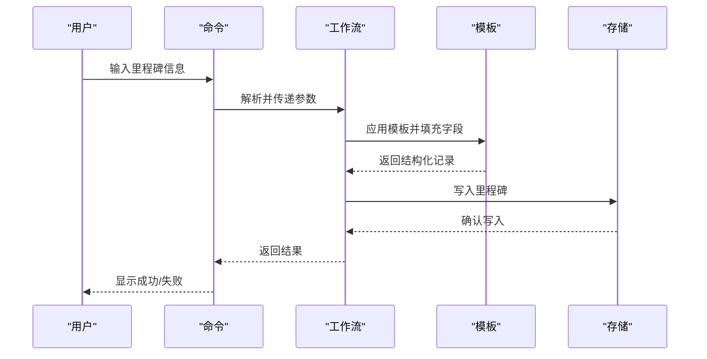
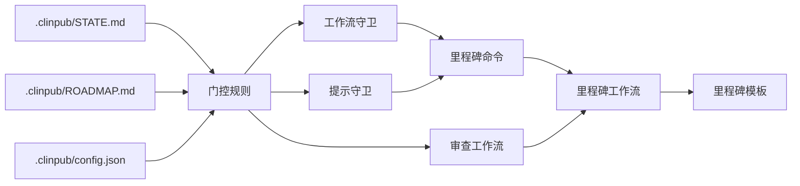

# 门控执行协议

<cite>
**本文引用的文件**
- [gates.md](file://pipeline/references/gates.md)
- [clinpub-workflow-guard.js](file://hooks/clinpub-workflow-guard.js)
- [clinpub-prompt-guard.js](file://hooks/clinpub-prompt-guard.js)
- [milestone.md（命令）](file://commands/clinpub/milestone.md)
- [milestone.md（模板）](file://pipeline/templates/milestone.md)
- [milestone.md（工作流）](file://pipeline/workflows/milestone.md)
- [review.md（命令）](file://commands/clinpub/review.md)
- [review.md（工作流）](file://pipeline/workflows/review.md)
- [STATE.md](file://.clinpub/STATE.md)
- [ROADMAP.md](file://.clinpub/ROADMAP.md)
- [config.json](file://.clinpub/config.json)
</cite>

## 目录
1. [引言](#引言)
2. [项目结构](#项目结构)
3. [核心组件](#核心组件)
4. [架构总览](#架构总览)
5. [详细组件分析](#详细组件分析)
6. [依赖关系分析](#依赖关系分析)
7. [性能考虑](#性能考虑)
8. [故障排除指南](#故障排除指南)
9. [结论](#结论)
10. [附录](#附录)

## 引言
本文件系统化阐述“门控执行协议”的技术规范与实施流程，覆盖四个核心执行步骤：自动化检查、决策检查点、用户签名确认、里程碑记录。文档同时明确各步骤的责任分工、质量保证措施、不可跳过原则及其强制执行机制，并给出门控失败后的处理流程、重新评估程序与质量改进策略，最后总结最佳实践与常见问题解决方案。

## 项目结构
该代码库围绕“门控”与“里程碑”两条主线组织，关键位置如下：
- 门控定义与规则：pipeline/references/gates.md
- 工作流守卫与提示守卫：hooks/clinpub-workflow-guard.js、hooks/clinpub-prompt-guard.js
- 里程碑相关：commands/clinpub/milestone.md、pipeline/templates/milestone.md、pipeline/workflows/milestone.md
- 审查与复核：commands/clinpub/review.md、pipeline/workflows/review.md
- 项目状态与路线图：.clinpub/STATE.md、.clinpub/ROADMAP.md、.clinpub/config.json

图表来源
- [gates.md](file://pipeline/references/gates.md)
- [clinpub-workflow-guard.js](file://hooks/clinpub-workflow-guard.js)
- [clinpub-prompt-guard.js](file://hooks/clinpub-prompt-guard.js)
- [milestone.md（命令）](file://commands/clinpub/milestone.md)
- [milestone.md（模板）](file://pipeline/templates/milestone.md)
- [milestone.md（工作流）](file://pipeline/workflows/milestone.md)
- [review.md（命令）](file://commands/clinpub/review.md)
- [review.md（工作流）](file://pipeline/workflows/review.md)
- [STATE.md](file://.clinpub/STATE.md)
- [ROADMAP.md](file://.clinpub/ROADMAP.md)
- [config.json](file://.clinpub/config.json)

章节来源
- [gates.md](file://pipeline/references/gates.md)
- [clinpub-workflow-guard.js](file://hooks/clinpub-workflow-guard.js)
- [clinpub-prompt-guard.js](file://hooks/clinpub-prompt-guard.js)
- [milestone.md（命令）](file://commands/clinpub/milestone.md)
- [milestone.md（模板）](file://pipeline/templates/milestone.md)
- [milestone.md（工作流）](file://pipeline/workflows/milestone.md)
- [review.md（命令）](file://commands/clinpub/review.md)
- [review.md（工作流）](file://pipeline/workflows/review.md)
- [STATE.md](file://.clinpub/STATE.md)
- [ROADMAP.md](file://.clinpub/ROADMAP.md)
- [config.json](file://.clinpub/config.json)

## 核心组件
- 门控规则与检查清单：定义可执行的检查项、通过条件与失败处置，作为所有门控动作的权威依据。
- 工作流守卫：在关键阶段拦截不合规的执行意图或参数，阻止进入下一步。
- 提示守卫：对提示词与生成内容进行安全与合规性校验，防止越界输出。
- 里程碑命令与工作流：封装“记录里程碑”的操作序列，确保记录格式一致、信息完整。
- 审查命令与工作流：提供复核入口，支持对里程碑与产出进行再评估。
- 项目状态与配置：驱动门控的上下文与策略来源，决定当前阶段与可用能力。

章节来源
- [gates.md](file://pipeline/references/gates.md)
- [clinpub-workflow-guard.js](file://hooks/clinpub-workflow-guard.js)
- [clinpub-prompt-guard.js](file://hooks/clinpub-prompt-guard.js)
- [milestone.md（命令）](file://commands/clinpub/milestone.md)
- [milestone.md（模板）](file://pipeline/templates/milestone.md)
- [milestone.md（工作流）](file://pipeline/workflows/milestone.md)
- [review.md（命令）](file://commands/clinpub/review.md)
- [review.md（工作流）](file://pipeline/workflows/review.md)
- [STATE.md](file://.clinpub/STATE.md)
- [ROADMAP.md](file://.clinpub/ROADMAP.md)
- [config.json](file://.clinpub/config.json)

## 架构总览
下图展示从“门控规则”到“守卫拦截”再到“里程碑记录”的端到端路径，以及“审查”作为回退与再评估的闭环。

图表来源
- [gates.md](file://pipeline/references/gates.md)
- [clinpub-workflow-guard.js](file://hooks/clinpub-workflow-guard.js)
- [clinpub-prompt-guard.js](file://hooks/clinpub-prompt-guard.js)
- [milestone.md（命令）](file://commands/clinpub/milestone.md)
- [milestone.md（工作流）](file://pipeline/workflows/milestone.md)
- [review.md（工作流）](file://pipeline/workflows/review.md)

## 详细组件分析

### 自动化检查
- 目标：在执行前自动验证输入、参数与上下文是否满足门控规则。
- 关键实现：
  - 门控规则：集中于门控文件，定义检查项与阈值。
  - 工作流守卫：在命令触发时拦截异常参数或不合规状态。
  - 提示守卫：对提示词与生成内容进行合规性扫描。
- 责任分工：
  - 开发者：准备符合门控要求的数据与上下文。
  - 系统：通过守卫自动拦截不符合规则的行为。
- 质量保证：
  - 将门控规则与守卫逻辑解耦，便于独立演进与回归测试。
  - 对关键字段进行白名单/黑名单校验，避免越界输入。
- 不可跳过原则：
  - 任何被守卫拦截的失败必须阻断后续流程，直至问题修复并通过再次校验。

图表来源
- [gates.md](file://pipeline/references/gates.md)
- [clinpub-workflow-guard.js](file://hooks/clinpub-workflow-guard.js)
- [clinpub-prompt-guard.js](file://hooks/clinpub-prompt-guard.js)

章节来源
- [gates.md](file://pipeline/references/gates.md)
- [clinpub-workflow-guard.js](file://hooks/clinpub-workflow-guard.js)
- [clinpub-prompt-guard.js](file://hooks/clinpub-prompt-guard.js)

### 决策检查点
- 目标：在关键节点进行人工/半自动的最终确认，确保决策可追溯、可审计。
- 关键实现：
  - 借助“里程碑命令”与“里程碑工作流”，将决策固化为结构化记录。
  - 结合“审查工作流”，允许对已记录的里程碑进行再评估与修正。
- 责任分工：
  - 执行者：在检查点提交决策证据与结论。
  - 审查者：对里程碑进行复核，提出改进建议。
- 质量保证：
  - 统一里程碑模板，确保关键字段（如时间、责任人、结论、依据）齐全。
  - 审查流程应包含“问题清单”与“重评估入口”。

图表来源
- [milestone.md（命令）](file://commands/clinpub/milestone.md)
- [milestone.md（工作流）](file://pipeline/workflows/milestone.md)
- [milestone.md（模板）](file://pipeline/templates/milestone.md)
- [review.md（命令）](file://commands/clinpub/review.md)
- [review.md（工作流）](file://pipeline/workflows/review.md)

章节来源
- [milestone.md（命令）](file://commands/clinpub/milestone.md)
- [milestone.md（工作流）](file://pipeline/workflows/milestone.md)
- [milestone.md（模板）](file://pipeline/templates/milestone.md)
- [review.md（命令）](file://commands/clinpub/review.md)
- [review.md（工作流）](file://pipeline/workflows/review.md)

### 用户签名确认
- 目标：以结构化方式记录“最终确认”，确保责任到人、可追溯。
- 关键实现：
  - 在里程碑记录中包含签名字段（如签名者、签名时间、签名类型）。
  - 通过命令与工作流强制填写必要字段，避免遗漏。
- 责任分工：
  - 执行者：在里程碑中填写签名信息。
  - 平台：在提交时强制校验签名完整性。
- 质量保证：
  - 使用模板约束签名字段必填；若缺失则拒绝提交。
  - 对签名进行版本化记录，便于审计。

图表来源
- [milestone.md（模板）](file://pipeline/templates/milestone.md)
- [milestone.md（命令）](file://commands/clinpub/milestone.md)
- [milestone.md（工作流）](file://pipeline/workflows/milestone.md)

章节来源
- [milestone.md（模板）](file://pipeline/templates/milestone.md)
- [milestone.md（命令）](file://commands/clinpub/milestone.md)
- [milestone.md（工作流）](file://pipeline/workflows/milestone.md)

### 里程碑记录
- 目标：将门控决策与执行结果以统一格式固化，形成可审计、可复用的知识资产。
- 关键实现：
  - 命令负责收集输入与触发工作流。
  - 工作流负责解析输入、调用模板、写入存储。
  - 模板提供结构化字段与默认值，确保一致性。
- 责任分工：
  - 命令：输入收集与调用。
  - 工作流：数据处理与持久化。
  - 模板：格式与字段约束。
- 质量保证：
  - 通过模板与工作流的组合，减少手写错误。
  - 对关键字段进行必填与格式校验。

图表来源
- [milestone.md（命令）](file://commands/clinpub/milestone.md)
- [milestone.md（工作流）](file://pipeline/workflows/milestone.md)
- [milestone.md（模板）](file://pipeline/templates/milestone.md)

章节来源
- [milestone.md（命令）](file://commands/clinpub/milestone.md)
- [milestone.md（工作流）](file://pipeline/workflows/milestone.md)
- [milestone.md（模板）](file://pipeline/templates/milestone.md)

## 依赖关系分析
- 门控规则是所有环节的权威来源，工作流守卫与提示守卫均依赖其进行判断。
- 里程碑命令与工作流依赖模板以保证记录一致性。
- 审查工作流依赖里程碑记录以进行再评估。
- 项目状态与配置为门控提供上下文，影响当前阶段与可用能力。

图表来源
- [gates.md](file://pipeline/references/gates.md)
- [clinpub-workflow-guard.js](file://hooks/clinpub-workflow-guard.js)
- [clinpub-prompt-guard.js](file://hooks/clinpub-prompt-guard.js)
- [milestone.md（命令）](file://commands/clinpub/milestone.md)
- [milestone.md（工作流）](file://pipeline/workflows/milestone.md)
- [milestone.md（模板）](file://pipeline/templates/milestone.md)
- [review.md（工作流）](file://pipeline/workflows/review.md)
- [STATE.md](file://.clinpub/STATE.md)
- [ROADMAP.md](file://.clinpub/ROADMAP.md)
- [config.json](file://.clinpub/config.json)

章节来源
- [gates.md](file://pipeline/references/gates.md)
- [clinpub-workflow-guard.js](file://hooks/clinpub-workflow-guard.js)
- [clinpub-prompt-guard.js](file://hooks/clinpub-prompt-guard.js)
- [milestone.md（命令）](file://commands/clinpub/milestone.md)
- [milestone.md（工作流）](file://pipeline/workflows/milestone.md)
- [milestone.md（模板）](file://pipeline/templates/milestone.md)
- [review.md（工作流）](file://pipeline/workflows/review.md)
- [STATE.md](file://.clinpub/STATE.md)
- [ROADMAP.md](file://.clinpub/ROADMAP.md)
- [config.json](file://.clinpub/config.json)

## 性能考虑
- 守卫逻辑应尽量轻量化，避免在门控检查中引入不必要的延迟。
- 里程碑模板与工作流应支持批量处理与缓存，提升高频记录场景的吞吐。
- 审查流程建议采用异步化与增量式复核，降低对主流程的影响。

## 故障排除指南
- 门控失败：
  - 现象：守卫拦截并返回失败。
  - 排查：对照门控规则逐项检查参数与上下文。
  - 处理：修复后重新提交，必要时触发审查工作流进行再评估。
- 里程碑记录失败：
  - 现象：模板字段缺失或格式错误导致提交失败。
  - 排查：检查模板字段与命令输入。
  - 处理：补齐必填字段并重试；若仍失败，查看工作流日志定位具体字段。
- 审查未通过：
  - 现象：审查工作流输出问题清单。
  - 排查：逐条核对问题并修正。
  - 处理：修正后重新提交，直至通过。

章节来源
- [gates.md](file://pipeline/references/gates.md)
- [milestone.md（命令）](file://commands/clinpub/milestone.md)
- [milestone.md（工作流）](file://pipeline/workflows/milestone.md)
- [review.md（工作流）](file://pipeline/workflows/review.md)

## 结论
门控执行协议通过“自动化检查—决策检查点—用户签名确认—里程碑记录”四步法，构建了可审计、可追溯、可复核的质量闭环。结合守卫拦截与模板约束，确保不可跳过原则得到严格执行；通过审查与再评估机制，持续改进质量。建议在团队内推广标准化流程与模板，强化培训与演练，以稳定提升交付质量。

## 附录
- 最佳实践：
  - 在每次执行前先运行自动化检查，提前暴露风险。
  - 决策检查点必须有明确的证据链与责任人。
  - 里程碑记录必须包含签名字段，确保责任到人。
  - 定期回顾门控规则与守卫逻辑，适配项目演进。
- 常见问题：
  - 参数不合规：对照门控规则逐一修正。
  - 模板字段缺失：使用标准模板并按要求填写。
  - 审查反复不通过：建立问题清单与改进计划，分批解决。