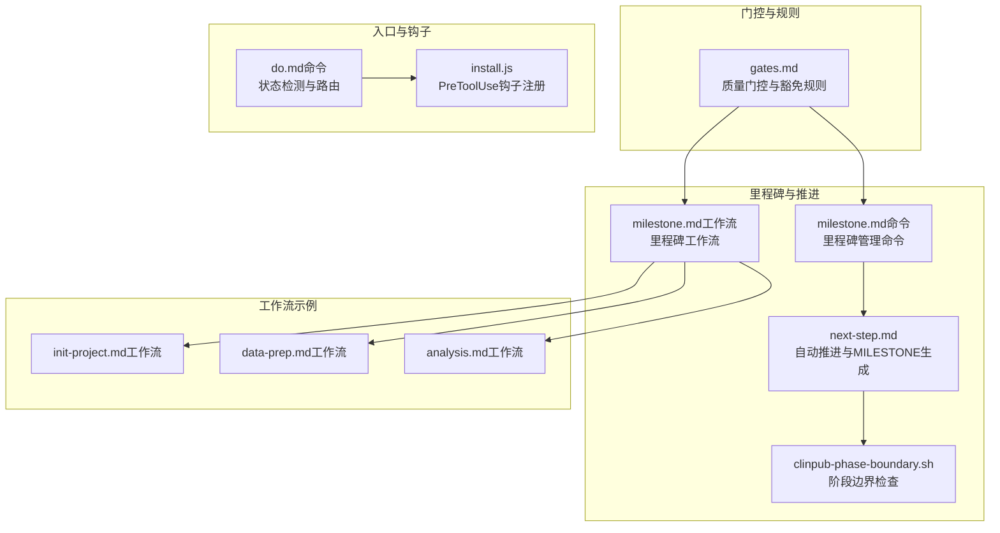
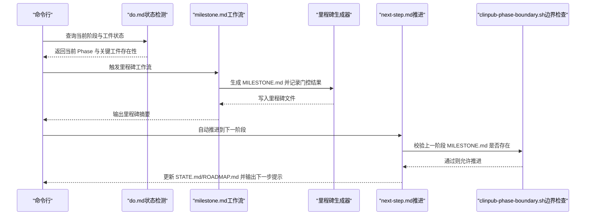
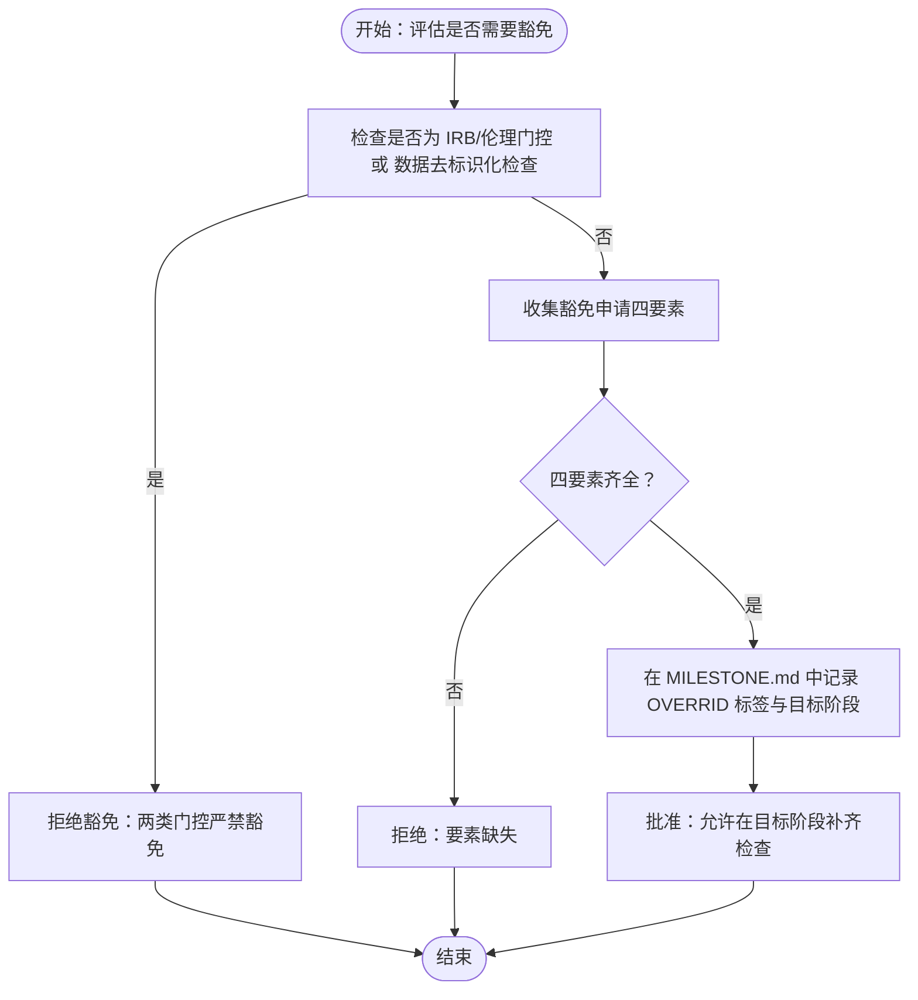
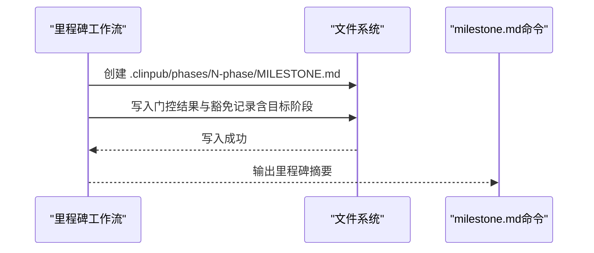
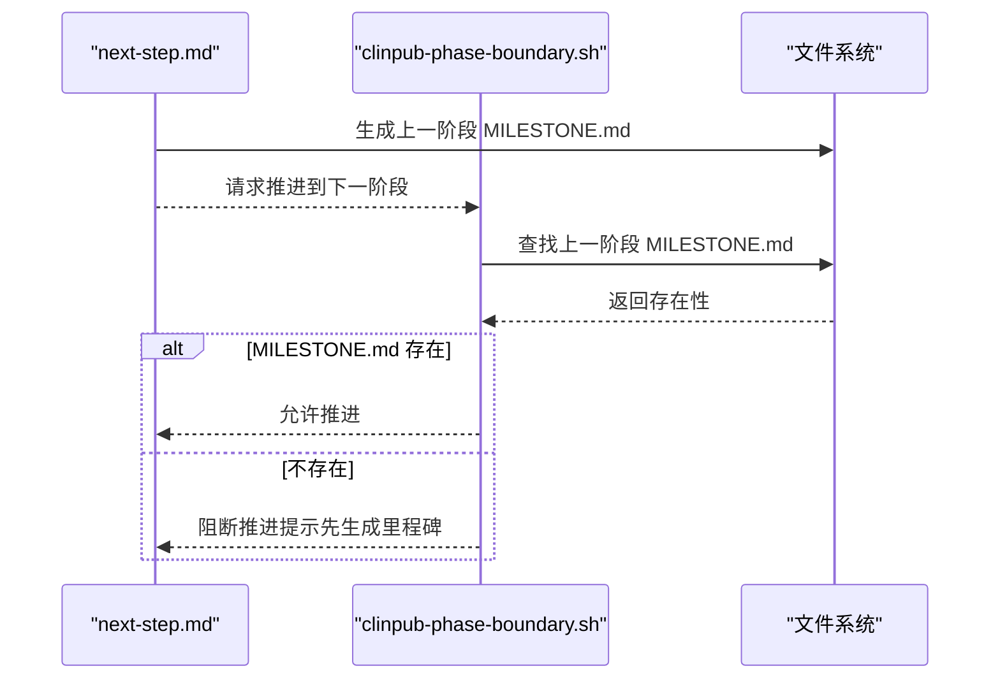
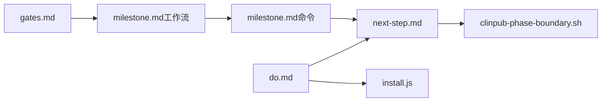

# 门控豁免政策

<cite>
**本文引用的文件**
- [gates.md](file://pipeline/references/gates.md)
- [milestone.md](file://commands/clinpub/milestone.md)
- [next-step.md](file://commands/clinpub/next-step.md)
- [clinpub-phase-boundary.sh](file://hooks/clinpub-phase-boundary.sh)
- [checkpoints.md](file://pipeline/references/checkpoints.md)
- [milestone.md（工作流）](file://pipeline/workflows/milestone.md)
- [data-prep.md（工作流）](file://pipeline/workflows/data-prep.md)
- [analysis.md（工作流）](file://pipeline/workflows/analysis.md)
- [init-project.md（工作流）](file://pipeline/workflows/init-project.md)
- [do.md（命令）](file://commands/clinpub/do.md)
- [install.js](file://bin/install.js)
</cite>

## 目录
1. [引言](#引言)
2. [项目结构](#项目结构)
3. [核心组件](#核心组件)
4. [架构总览](#架构总览)
5. [详细组件分析](#详细组件分析)
6. [依赖关系分析](#依赖关系分析)
7. [性能考虑](#性能考虑)
8. [故障排除指南](#故障排除指南)
9. [结论](#结论)
10. [附录](#附录)

## 引言
本文件系统化阐述“门控豁免政策”的适用条件、审批流程与监督机制，聚焦于四种豁免申请要素：用户明确请求、书面豁免理由、目标阶段编号、MILESTONE.md 记录。同时明确两类严格限制：IRB 伦理门控与数据去标识化检查不得豁免。文档基于仓库中的质量门控参考、里程碑管理命令与工作流、阶段边界钩子等实际实现进行归纳总结，并给出可操作的流程图与时序图，帮助读者快速理解与落地执行。

## 项目结构
围绕门控豁免的关键文件与职责如下：
- 门控与豁免规则：pipeline/references/gates.md
- 里程碑生成与记录：commands/clinpub/milestone.md、pipeline/workflows/milestone.md
- 阶段推进与前置检查：commands/clinpub/next-step.md、hooks/clinpub-phase-boundary.sh
- 阶段里程碑落盘规范：pipeline/references/checkpoints.md
- 工作流中的里程碑生成示例：pipeline/workflows/init-project.md、pipeline/workflows/data-prep.md、pipeline/workflows/analysis.md
- 命令入口与状态检测：commands/clinpub/do.md
- 钩子注册与安全边界：bin/install.js

图表来源
- [gates.md](file://pipeline/references/gates.md)
- [milestone.md（命令）](file://commands/clinpub/milestone.md)
- [milestone.md（工作流）](file://pipeline/workflows/milestone.md)
- [next-step.md](file://commands/clinpub/next-step.md)
- [clinpub-phase-boundary.sh](file://hooks/clinpub-phase-boundary.sh)
- [init-project.md（工作流）](file://pipeline/workflows/init-project.md)
- [data-prep.md（工作流）](file://pipeline/workflows/data-prep.md)
- [analysis.md（工作流）](file://pipeline/workflows/analysis.md)
- [do.md（命令）](file://commands/clinpub/do.md)
- [install.js](file://bin/install.js)

章节来源
- [gates.md](file://pipeline/references/gates.md)
- [milestone.md（命令）](file://commands/clinpub/milestone.md)
- [milestone.md（工作流）](file://pipeline/workflows/milestone.md)
- [next-step.md](file://commands/clinpub/next-step.md)
- [clinpub-phase-boundary.sh](file://hooks/clinpub-phase-boundary.sh)
- [checkpoints.md](file://pipeline/references/checkpoints.md)
- [init-project.md（工作流）](file://pipeline/workflows/init-project.md)
- [data-prep.md（工作流）](file://pipeline/workflows/data-prep.md)
- [analysis.md（工作流）](file://pipeline/workflows/analysis.md)
- [do.md（命令）](file://commands/clinpub/do.md)
- [install.js](file://bin/install.js)

## 核心组件
- 质量门控与豁免规则：定义门控类型、通过条件、失败动作以及豁免的四项要素与禁止豁免的两类门控。
- 里程碑管理命令与工作流：负责在阶段推进时生成 MILESTONE.md，记录门控通过情况与豁免信息。
- 阶段推进与边界检查：在推进到下一阶段前，校验上一阶段的里程碑是否完备，防止流程倒退或阻塞。
- 状态检测与入口路由：命令层通过解析 STATE.md 与关键工件，决定当前阶段与可执行动作。
- 钩子注册与安全边界：PreToolUse 钩子注册确保阶段访问受控，防止越权写入未来阶段目录。

章节来源
- [gates.md](file://pipeline/references/gates.md)
- [milestone.md（命令）](file://commands/clinpub/milestone.md)
- [milestone.md（工作流）](file://pipeline/workflows/milestone.md)
- [next-step.md](file://commands/clinpub/next-step.md)
- [clinpub-phase-boundary.sh](file://hooks/clinpub-phase-boundary.sh)
- [do.md（命令）](file://commands/clinpub/do.md)
- [install.js](file://bin/install.js)

## 架构总览
门控豁免贯穿“状态检测—门控评估—豁免申请—里程碑记录—阶段推进—边界检查”的闭环链路。命令层与工作流层协同生成里程碑，阶段边界钩子保障推进顺序与完整性。

图表来源
- [do.md（命令）](file://commands/clinpub/do.md)
- [milestone.md（工作流）](file://pipeline/workflows/milestone.md)
- [next-step.md](file://commands/clinpub/next-step.md)
- [clinpub-phase-boundary.sh](file://hooks/clinpub-phase-boundary.sh)

## 详细组件分析

### 组件A：门控与豁免规则（gates.md）
- 门控类型与通过条件：明确各阶段门控的检查项、必选项与可选项，失败动作与补救步骤。
- 豁免申请四要素：
  - 用户明确请求：必须由责任人明确提出豁免申请。
  - 书面豁免理由：需提供可追溯的书面说明，解释为何该检查可延期。
  - 目标阶段编号：明确在哪个阶段补齐该检查。
  - MILESTONE.md 记录：在里程碑中以“OVERRIDE”标签记录豁免信息。
- 禁止豁免两类门控：
  - IRB/伦理门控（Gate 1）：严禁豁免。
  - 数据去标识化检查：严禁豁免。
- 门控通过记录：门控通过情况也应在 MILESTONE.md 中记录时间戳与结论。

图表来源
- [gates.md](file://pipeline/references/gates.md)

章节来源
- [gates.md](file://pipeline/references/gates.md)

### 组件B：里程碑生成与记录（commands/clinpub/milestone.md 与 pipeline/workflows/milestone.md）
- 里程碑生成时机：在阶段推进时自动生成 MILESTONE.md，防止阶段边界钩子阻断后续操作。
- 记录内容：包括门控通过情况、豁免记录（带 OVERRIDE 标签）、目标阶段编号、记录时间戳与责任人签名。
- 里程碑落盘规范：每个阶段完成后写入 .clinpub/phases/NN-phase-name/MILESTONE.md。

图表来源
- [milestone.md（命令）](file://commands/clinpub/milestone.md)
- [milestone.md（工作流）](file://pipeline/workflows/milestone.md)
- [checkpoints.md](file://pipeline/references/checkpoints.md)

章节来源
- [milestone.md（命令）](file://commands/clinpub/milestone.md)
- [milestone.md（工作流）](file://pipeline/workflows/milestone.md)
- [checkpoints.md](file://pipeline/references/checkpoints.md)

### 组件C：阶段推进与边界检查（next-step.md 与 clinpub-phase-boundary.sh）
- 自动推进：在满足当前阶段成功标准后，自动更新 STATE.md 与 ROADMAP.md，并生成 MILESTONE.md。
- 边界检查：阶段边界钩子在进入下一阶段前，查找上一阶段的 MILESTONE.md，若缺失则阻断推进。
- 防止阻塞：必须先生成 MILESTONE.md，否则会被阶段边界钩子拦截。

图表来源
- [next-step.md](file://commands/clinpub/next-step.md)
- [clinpub-phase-boundary.sh](file://hooks/clinpub-phase-boundary.sh)

章节来源
- [next-step.md](file://commands/clinpub/next-step.md)
- [clinpub-phase-boundary.sh](file://hooks/clinpub-phase-boundary.sh)

### 组件D：状态检测与入口路由（do.md）
- 通过解析 STATE.md 中的结构化行“- 阶段：Phase N”，精确识别当前阶段，避免依赖自然语言或计数回退。
- 关键工件检测：按阶段检测必要文件是否存在，确保流程按序执行。

章节来源
- [do.md（命令）](file://commands/clinpub/do.md)

### 组件E：钩子注册与安全边界（install.js）
- PreToolUse 钩子注册：在安装时向设置中追加 PreToolUse 钩子条目，确保工具使用前的安全检查生效。
- 安全边界：通过严格的阶段判定与边界检查，防止越权写入未来阶段目录。

章节来源
- [install.js](file://bin/install.js)

## 依赖关系分析
- 门控规则（gates.md）驱动豁免申请与记录策略。
- 里程碑命令与工作流（milestone.md 命令/工作流）负责将门控结果与豁免信息固化到 MILESTONE.md。
- 阶段推进（next-step.md）与边界检查（clinpub-phase-boundary.sh）共同保证流程顺序与完整性。
- 状态检测（do.md）与钩子注册（install.js）为整个流程提供入口与安全边界。

图表来源
- [gates.md](file://pipeline/references/gates.md)
- [milestone.md（命令）](file://commands/clinpub/milestone.md)
- [milestone.md（工作流）](file://pipeline/workflows/milestone.md)
- [next-step.md](file://commands/clinpub/next-step.md)
- [clinpub-phase-boundary.sh](file://hooks/clinpub-phase-boundary.sh)
- [do.md（命令）](file://commands/clinpub/do.md)
- [install.js](file://bin/install.js)

章节来源
- [gates.md](file://pipeline/references/gates.md)
- [milestone.md（命令）](file://commands/clinpub/milestone.md)
- [milestone.md（工作流）](file://pipeline/workflows/milestone.md)
- [next-step.md](file://commands/clinpub/next-step.md)
- [clinpub-phase-boundary.sh](file://hooks/clinpub-phase-boundary.sh)
- [do.md（命令）](file://commands/clinpub/do.md)
- [install.js](file://bin/install.js)

## 性能考虑
- 里程碑生成与阶段推进均为本地文件操作，开销极低。
- 钩子注册与边界检查在工具使用前后执行，对用户交互延迟影响可忽略。
- 建议在大规模项目中保持里程碑文件最小化写入，仅在阶段切换时批量生成，减少磁盘压力。

## 故障排除指南
- 问题：推进到下一阶段被阻断
  - 排查：确认上一阶段是否已生成 MILESTONE.md；若缺失，先运行里程碑工作流生成后再推进。
  - 参考：阶段边界钩子在查找上一阶段 MILESTONE.md 时会阻断推进。
- 问题：豁免申请未被批准
  - 排查：确认是否涉及 IRB/伦理门控或数据去标识化检查；这两类门控严禁豁免。同时检查 MILESTONE.md 是否包含“OVERRIDE”标签及目标阶段编号。
- 问题：状态检测异常
  - 排查：确认 STATE.md 中存在结构化行“- 阶段：Phase N”，并确保命令层使用该行进行阶段判定，避免依赖自然语言或计数回退。

章节来源
- [clinpub-phase-boundary.sh](file://hooks/clinpub-phase-boundary.sh)
- [gates.md](file://pipeline/references/gates.md)
- [milestone.md（命令）](file://commands/clinpub/milestone.md)
- [do.md（命令）](file://commands/clinpub/do.md)

## 结论
门控豁免政策以“严格限制+规范记录+闭环推进”为核心原则：IRB 伦理与数据去标识化检查严禁豁免；豁免申请必须具备四项要素并在 MILESTONE.md 中留痕；阶段推进必须先生成里程碑，边界钩子确保流程顺序与完整性。通过命令层状态检测、工作流里程碑生成与钩子注册，形成可追溯、可审计、可自动化的门控豁免执行体系。

## 附录
- 工作流中的里程碑生成示例：
  - 初始化阶段：init-project.md（工作流）
  - 数据准备阶段：data-prep.md（工作流）
  - 分析阶段：analysis.md（工作流）

章节来源
- [init-project.md（工作流）](file://pipeline/workflows/init-project.md)
- [data-prep.md（工作流）](file://pipeline/workflows/data-prep.md)
- [analysis.md（工作流）](file://pipeline/workflows/analysis.md)