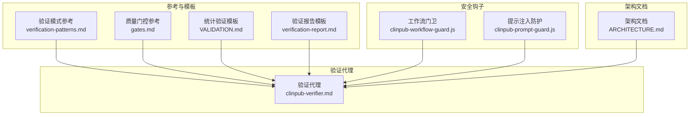
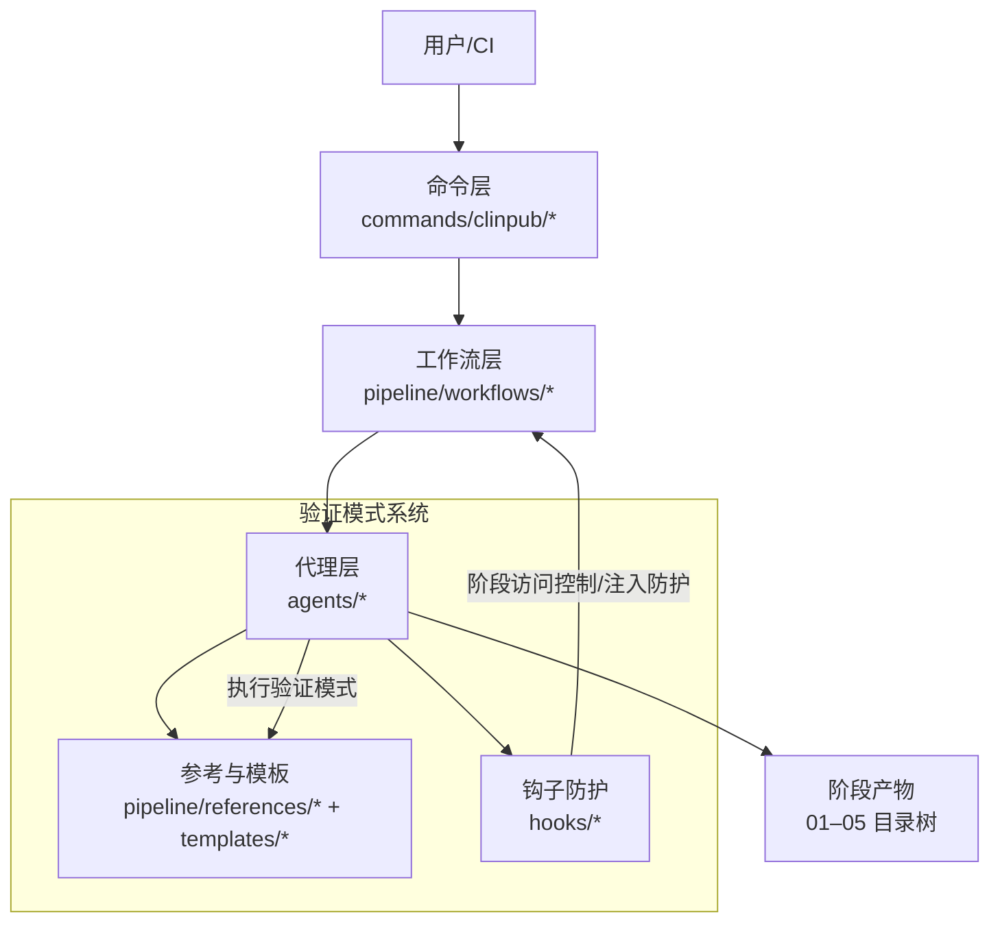
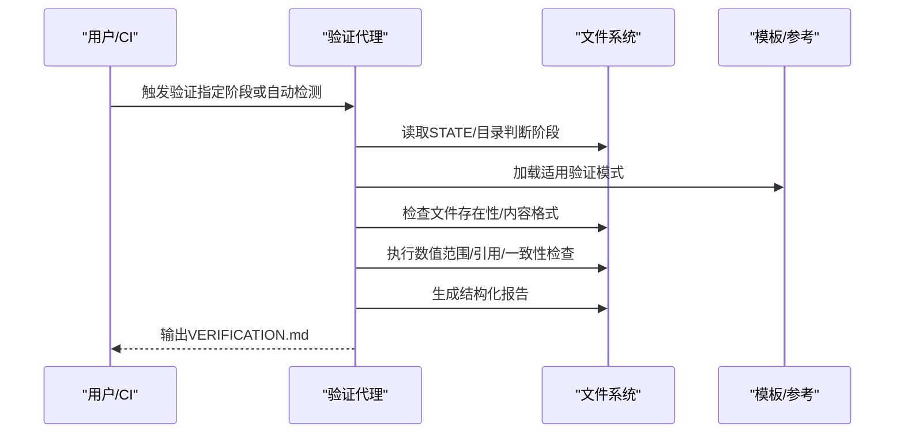
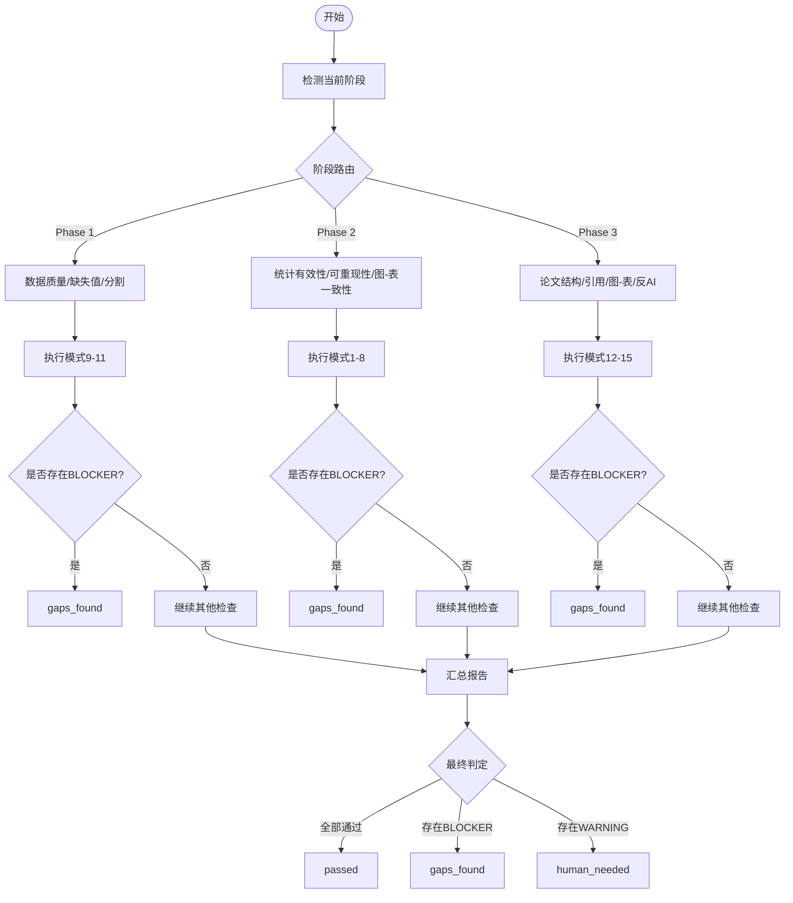
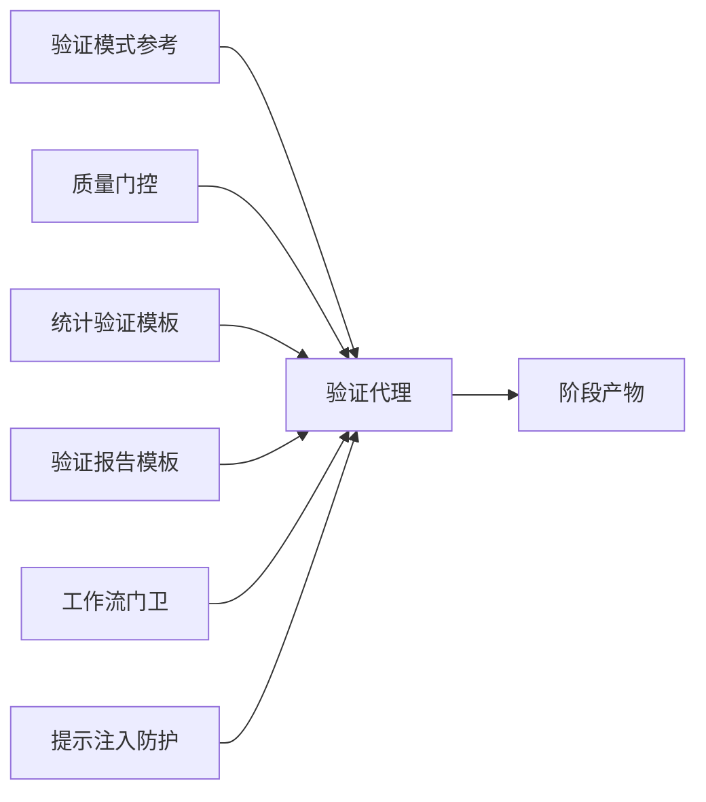

# 验证模式系统

<cite>
**本文档引用的文件**
- [verification-patterns.md](file://pipeline/references/verification-patterns.md)
- [clinpub-verifier.md](file://agents/clinpub-verifier.md)
- [gates.md](file://pipeline/references/gates.md)
- [VALIDATION.md](file://pipeline/templates/VALIDATION.md)
- [verification-report.md](file://pipeline/templates/verification-report.md)
- [clinpub-workflow-guard.js](file://hooks/clinpub-workflow-guard.js)
- [clinpub-prompt-guard.js](file://hooks/clinpub-prompt-guard.js)
- [ARCHITECTURE.md](file://docs/ARCHITECTURE.md)
</cite>

## 目录
1. [引言](#引言)
2. [项目结构](#项目结构)
3. [核心组件](#核心组件)
4. [架构总览](#架构总览)
5. [详细组件分析](#详细组件分析)
6. [依赖关系分析](#依赖关系分析)
7. [性能考虑](#性能考虑)
8. [故障排除指南](#故障排除指南)
9. [结论](#结论)
10. [附录](#附录)

## 引言
本文件系统化梳理验证模式系统的设计原理、实现机制与应用实践，覆盖15种验证模式（统计有效性、可重现性、数据质量、缺失值处理、数据分割、论文结构、引用完整性、图表引用、AI反模式检测等）。文档面向不同技术背景读者，既提供高层概览，也给出深入到代码级别的分析与图示，帮助使用者正确选择、组合与执行验证模式，建立稳健的质量保障体系。

## 项目结构
验证模式系统由“参考文档 + 代理执行 + 模板 + 钩子防护”构成，围绕 Phase 0–4 的阶段化流程提供自动化与人工相结合的验证能力。

**图表来源**
- [verification-patterns.md](file://pipeline/references/verification-patterns.md)
- [gates.md](file://pipeline/references/gates.md)
- [VALIDATION.md](file://pipeline/templates/VALIDATION.md)
- [verification-report.md](file://pipeline/templates/verification-report.md)
- [clinpub-verifier.md](file://agents/clinpub-verifier.md)
- [clinpub-workflow-guard.js](file://hooks/clinpub-workflow-guard.js)
- [clinpub-prompt-guard.js](file://hooks/clinpub-prompt-guard.js)
- [ARCHITECTURE.md](file://docs/ARCHITECTURE.md)

**章节来源**
- [ARCHITECTURE.md](file://docs/ARCHITECTURE.md)

## 核心组件
- 验证模式参考：定义15种验证模式的目的、步骤、失败指标与证据要求，是验证代理执行的权威依据。
- 验证代理：根据当前阶段自动路由到适用的验证模式，执行文件存在性、内容格式、数值范围、引用完整性等检查，并生成结构化报告。
- 质量门控：定义四道阶段门（IRB/伦理、数据质量、分析有效性、提交），明确通过条件与失败处置。
- 模板：提供统计验证清单与验证报告模板，统一验证过程与输出格式。
- 安全钩子：工作流门卫防止越阶操作，提示注入防护扫描数据文件中的异常模式。

**章节来源**
- [verification-patterns.md](file://pipeline/references/verification-patterns.md)
- [clinpub-verifier.md](file://agents/clinpub-verifier.md)
- [gates.md](file://pipeline/references/gates.md)
- [VALIDATION.md](file://pipeline/templates/VALIDATION.md)
- [verification-report.md](file://pipeline/templates/verification-report.md)
- [clinpub-workflow-guard.js](file://hooks/clinpub-workflow-guard.js)
- [clinpub-prompt-guard.js](file://hooks/clinpub-prompt-guard.js)

## 架构总览
验证模式系统采用“参考驱动 + 代理执行 + 模板标准化 + 钩子防护”的分层架构，贯穿 Phase 0–4 的全流程质量控制。

**图表来源**
- [ARCHITECTURE.md](file://docs/ARCHITECTURE.md)
- [clinpub-verifier.md](file://agents/clinpub-verifier.md)
- [clinpub-workflow-guard.js](file://hooks/clinpub-workflow-guard.js)
- [clinpub-prompt-guard.js](file://hooks/clinpub-prompt-guard.js)

## 详细组件分析

### 验证模式分类体系与优先级排序
- 分类维度
  - 统计有效性：描述性统计交叉检查、模型输出一致性、生存分析一致性、ROC/AUC有效性、多重比较校正。
  - 可重现性：代码可重现、数据链路完整性、图-表一致性。
  - 数据质量：数据质量验证、缺失值处理验证、数据分割完整性。
  - 论文质量：论文结构验证、引用完整性验证、图-表引用验证、人类写作反AI模式检查。
- 优先级排序（阶段内）
  - Phase 1（数据准备）：数据质量 > 缺失值处理 > 数据分割完整性；任何一项失败均阻断进入下一阶段。
  - Phase 2（统计分析）：统计有效性 > 可重现性 > 图-表一致性；统计错误或假设检验缺失直接阻断。
  - Phase 3（论文撰写）：论文结构 > 引用完整性 > 图-表引用 > 人类写作反AI模式；缺少DOI或AI痕迹直接阻断。
- 组合使用策略
  - 按阶段自动路由：验证代理根据当前阶段自动选择适用模式集合，避免跨阶段误用。
  - 失败分级：BLOCKER（阻断）、WARNING（需人工确认）、INFO（观察项）；多BLOCKER叠加时优先处理。

**章节来源**
- [verification-patterns.md](file://pipeline/references/verification-patterns.md)
- [clinpub-verifier.md](file://agents/clinpub-verifier.md)
- [gates.md](file://pipeline/references/gates.md)

### 验证模式1：描述性统计交叉检查
- 设计原理：独立计算数据摘要（N、均值、标准差、中位数、四分位距、比例）并与表1输出对比，容忍阈值用于浮点差异。
- 匹配规则：加载清洗后数据，逐变量计算统计量，与表1数值比对。
- 错误检测：样本量不一致、均值/标准差偏差超阈、比例舍入误差。
- 修复建议：修正统计计算脚本、统一舍入规则、核对表1生成逻辑。
- 证据要求：报告中包含统计量与差异说明。

**章节来源**
- [verification-patterns.md](file://pipeline/references/verification-patterns.md)
- [clinpub-verifier.md](file://agents/clinpub-verifier.md)

### 验证模式2：模型输出一致性检查
- 设计原理：验证OR/HR方向与系数符号一致、95%置信区间计算、p值与置信区间的自洽性、方差膨胀因子VIF阈值、样本量一致性。
- 匹配规则：读取回归输出，逐项比对方向、区间、显著性与VIF。
- 错误检测：方向相反、包含零点但p<0.05、VIF>10无说明、样本量不一致。
- 修复建议：修正建模流程、剔除高共线性变量、补充缺失说明。
- 证据要求：输出包含系数、SE、CI、p值、VIF与样本量。

**章节来源**
- [verification-patterns.md](file://pipeline/references/verification-patterns.md)
- [clinpub-verifier.md](file://agents/clinpub-verifier.md)

### 验证模式3：生存分析一致性检查
- 设计原理：Kaplan-Meier中位生存时间与原始事件/删失数据一致、风险表人数与估计一致、log-rank与单因素Cox一致性、PH假设检验报告、事件计数一致性。
- 匹配规则：比较中位生存、风险表、log-rank与Cox、PH检验、事件计数。
- 错误检测：中位生存超出观察范围、风险表人数不一致、p值差异过大、违反PH假设无敏感性分析。
- 修复建议：检查删失编码、调整分组、进行分层/时间依变协变量分析。
- 证据要求：KM曲线、风险表、log-rank与Cox输出、PH检验报告。

**章节来源**
- [verification-patterns.md](file://pipeline/references/verification-patterns.md)
- [clinpub-verifier.md](file://agents/clinpub-verifier.md)

### 验证模式4：ROC/AUC有效性检查
- 设计原理：AUC应在[0,1]范围内、Youden阈值下的敏感性和特异性、AUC置信区间对称性、威尔逊区间一致性、组合panel AUC与个体比较。
- 匹配规则：AUC范围、CI边界、阈值点、组合AUC。
- 错误检测：AUC越界、CI倒置、敏感性/特异性越界、组合AUC低于最佳单项。
- 修复建议：修正预测概率、调整阈值、重新计算置信区间。
- 证据要求：AUC、CI、阈值点、组合面板结果。

**章节来源**
- [verification-patterns.md](file://pipeline/references/verification-patterns.md)
- [clinpub-verifier.md](file://agents/clinpub-verifier.md)

### 验证模式5：多重比较校正检查
- 设计原理：统计测试数量计数、>3次测试时应用FDR或Bonferroni校正、校正后p值≤原始p值、方法说明文档化、显著结果是否仍显著。
- 匹配规则：统计文本中的p值计数、校正方法与结果。
- 错误检测：>3次测试未校正、校正后p更大、声称显著但未校正。
- 修复建议：补充校正步骤、更新方法说明、标注显著结果。
- 证据要求：README中包含校正方法与结果。

**章节来源**
- [verification-patterns.md](file://pipeline/references/verification-patterns.md)
- [clinpub-verifier.md](file://agents/clinpub-verifier.md)

### 验证模式6：代码可重现性检查
- 设计原理：脚本从清洗数据读取、无手工步骤、随机种子设置、包版本记录、相对路径引用。
- 匹配规则：脚本中硬编码绝对路径、随机种子、会话信息记录。
- 错误检测：使用绝对路径、未设置随机种子、未记录版本。
- 修复建议：改为相对路径、固定随机种子、捕获sessionInfo或requirements.txt。
- 证据要求：脚本可从头运行、输出与历史一致、版本信息齐全。

**章节来源**
- [verification-patterns.md](file://pipeline/references/verification-patterns.md)
- [clinpub-verifier.md](file://agents/clinpub-verifier.md)

### 验证模式7：数据链路完整性检查
- 设计原理：原始数据行列数与数据档案一致、清洗后行数=原始-已记录排除、变量变换可逆或有文档、训练/验证无泄露、缺失值标记或分离列。
- 匹配规则：行数对比、排除记录、变换文档、分割重叠、缺失值标记。
- 错误检测：行数不一致、训练/验证重叠、缺失值混用。
- 修复建议：完善排除记录、重新分割、分离缺失值列。
- 证据要求：数据质量报告与清洗代码。

**章节来源**
- [verification-patterns.md](file://pipeline/references/verification-patterns.md)
- [clinpub-verifier.md](file://agents/clinpub-verifier.md)

### 验证模式8：图-表一致性检查
- 设计原理：图注关键值与表数据一致、坐标轴范围覆盖所有数据点、图注N与分析一致、显著性标注与p值一致、颜色编码一致。
- 匹配规则：图注与表数据、坐标轴范围、显著性标注、颜色方案。
- 错误检测：显著性与p值不一致、N不一致、截断隐藏数据、颜色不一致。
- 修复建议：统一标注口径、补齐坐标轴、修正颜色方案。
- 证据要求：图注与表数据比对表。

**章节来源**
- [verification-patterns.md](file://pipeline/references/verification-patterns.md)
- [clinpub-verifier.md](file://agents/clinpub-verifier.md)

### 验证模式9：数据质量验证
- 设计原理：清洗后数据行列数符合预期、行数=原始-已记录排除、变量类型与配置一致、类别水平无意外值、派生变量可复现、数据质量报告存在且非空。
- 匹配规则：清洗后数据、项目配置、派生变量、报告存在性。
- 错误检测：行数不一致、类型不符、类别水平异常、派生变量不可复现、报告缺失。
- 修复建议：修正类型定义、清理类别水平、补充分析步骤、生成报告。
- 证据要求：cleaned.csv、项目配置、数据质量报告。

**章节来源**
- [verification-patterns.md](file://pipeline/references/verification-patterns.md)
- [clinpub-verifier.md](file://agents/clinpub-verifier.md)

### 验证模式10：缺失值处理验证
- 设计原理：>20%缺失变量有用户确认处理策略、MICE参数文档化、缺失值标记或跟踪、删除策略行数匹配、训练/测试使用同一模型无泄露、缺失报告与实际一致。
- 匹配规则：缺失率、处理策略、MICE参数、标记列、删除行数、报告一致性。
- 错误检测：>20%缺失未确认、MICE参数缺失、缺失值不可区分、训练/测试模型不同、删除数不符。
- 修复建议：补充确认标志、记录MICE参数、添加标记列、统一插补模型、核对删除逻辑。
- 证据要求：方法说明、插补日志或标记列、清洗代码。

**章节来源**
- [verification-patterns.md](file://pipeline/references/verification-patterns.md)
- [clinpub-verifier.md](file://agents/clinpub-verifier.md)

### 验证模式11：数据分割完整性检查
- 设计原理：分层变量分布在各分割中保持（±1%）、训练/验证/测试无重叠（唯一患者ID）、分割比例与配置一致（±1%）、设置并记录随机种子、分割文件命名清晰。
- 匹配规则：分层分布、重叠检测、比例对比、种子设置、文件命名。
- 错误检测：分层比例偏差>1%、分割重叠、比例不符、未设置种子、文件缺失。
- 修复建议：调整分层变量、重新分割、固定种子、补齐文件。
- 证据要求：分割文件与配置。

**章节来源**
- [verification-patterns.md](file://pipeline/references/verification-patterns.md)
- [clinpub-verifier.md](file://agents/clinpub-verifier.md)

### 验证模式12：论文结构验证
- 设计原理：IMRAD结构完整（摘要、引言、方法、结果、讨论）、引言遵循漏斗结构、讨论包含6要素、字数在目标期刊限制内、STROBE/CONSORT条目覆盖、中英语言分工。
- 匹配规则：章节存在性、引言结构、讨论要素、字数、清单覆盖、语言分工。
- 错误检测：缺少章节、引言无缺口、讨论缺要素、字数超限、清单未覆盖、语言混用。
- 修复建议：补齐章节、完善引言结构、补充讨论要素、精简文字、对照清单、统一语言。
- 证据要求：manuscript.md与项目配置。

**章节来源**
- [verification-patterns.md](file://pipeline/references/verification-patterns.md)
- [clinpub-verifier.md](file://agents/clinpub-verifier.md)

### 验证模式13：引用完整性验证
- 设计原理：每条参考文献有有效DOI、文中引用与参考文献一一对应、参考总数达标、无重复引用、格式为Vancouver、无DOI则禁止引用。
- 匹配规则：DOI存在性、引用映射、总数、重复、格式。
- 错误检测：无DOI、文中引用无条目、重复、总数不足、格式不符。
- 修复建议：补全DOI、修正映射、去重、调整格式。
- 证据要求：references.bib、citation_map.md、正文。

**章节来源**
- [verification-patterns.md](file://pipeline/references/verification-patterns.md)
- [clinpub-verifier.md](file://agents/clinpub-verifier.md)

### 验证模式14：图-表引用验证
- 设计原理：从正文中提取图/表引用、检查输出目录中文件存在、编号连续无跳跃、标题与表头为英文、分辨率≥300 DPI。
- 匹配规则：引用提取、文件存在性、编号连续性、分辨率、语言。
- 错误检测：引用文件不存在、编号跳跃、标题非英文、分辨率不足。
- 修复建议：补齐文件、修正编号、改写标题、提高分辨率。
- 证据要求：manuscript正文、输出目录。

**章节来源**
- [verification-patterns.md](file://pipeline/references/verification-patterns.md)
- [clinpub-verifier.md](file://agents/clinpub-verifier.md)

### 验证模式15：人类写作反AI模式检查
- 设计原理：段落开头序数词、过渡词重复、句式单调、结论空洞表述、过度解释标准术语、缺乏具体作者语境。
- 匹配规则：序数词使用频率、过渡词频次、句式多样性、结论内容、引用具体化程度。
- 错误检测：序数词连续使用、单一过渡词>3次、连续3句结构相同、结论空泛、过度解释。
- 修复建议：替换序数词、丰富过渡词、多样化句式、具体化结论、减少解释。
- 证据要求：manuscript正文。

**章节来源**
- [verification-patterns.md](file://pipeline/references/verification-patterns.md)
- [clinpub-verifier.md](file://agents/clinpub-verifier.md)

### 验证代理执行流程（序列图）

**图表来源**
- [clinpub-verifier.md](file://agents/clinpub-verifier.md)
- [verification-patterns.md](file://pipeline/references/verification-patterns.md)
- [verification-report.md](file://pipeline/templates/verification-report.md)

### 验证模式匹配与错误检测流程（流程图）

**图表来源**
- [clinpub-verifier.md](file://agents/clinpub-verifier.md)
- [gates.md](file://pipeline/references/gates.md)

## 依赖关系分析
- 组件耦合
  - 验证代理强依赖验证模式参考与质量门控，弱依赖模板与钩子。
  - 验证模式参考与质量门控共同决定通过/阻断条件。
  - 钩子提供阶段访问控制与数据安全前置保障。
- 外部依赖
  - 统计分析工具（R/Python）版本与包版本需在方法说明中记录。
  - 输出文件（figures/tables/manuscript）必须满足分辨率与语言要求。

**图表来源**
- [verification-patterns.md](file://pipeline/references/verification-patterns.md)
- [gates.md](file://pipeline/references/gates.md)
- [VALIDATION.md](file://pipeline/templates/VALIDATION.md)
- [verification-report.md](file://pipeline/templates/verification-report.md)
- [clinpub-verifier.md](file://agents/clinpub-verifier.md)
- [clinpub-workflow-guard.js](file://hooks/clinpub-workflow-guard.js)
- [clinpub-prompt-guard.js](file://hooks/clinpub-prompt-guard.js)

**章节来源**
- [verification-patterns.md](file://pipeline/references/verification-patterns.md)
- [gates.md](file://pipeline/references/gates.md)
- [clinpub-verifier.md](file://agents/clinpub-verifier.md)
- [clinpub-workflow-guard.js](file://hooks/clinpub-workflow-guard.js)
- [clinpub-prompt-guard.js](file://hooks/clinpub-prompt-guard.js)

## 性能考虑
- 快速扫描优先：使用文件存在性、行数、grep模式快速过滤问题，避免重跑分析。
- 并行化：对多方法/多文件场景，尽量并行执行模式检查，缩短验证周期。
- 缓存与增量：对重复检查（如版本号、分辨率）可缓存结果，减少IO开销。
- 交互式与自动化平衡：对明显错误（如无DOI、分辨率不足）立即阻断，对需要人工判断的（如句式多样性）标记WARNING。

## 故障排除指南
- 常见失败类型与处置
  - BLOCKER：统计错误、引用无DOI、AI模式检测、数据泄露、未设置随机种子 → 必须修复后方可推进。
  - WARNING：轻微格式问题、少量重复引用、句式轻微单调 → 需人工确认是否接受。
  - INFO：观察项（如分辨率接近阈值）→ 记录但不阻断。
- 自动修复流程
  - 缺失DOI：自动标记并提示补充；若无法补充则降级为WARNING。
  - 分辨率不足：自动提示提高分辨率。
  - 句式单调：自动提示多样化表达。
- 人工干预指导
  - 对于人类写作反AI检查，若出现1-2项警告，建议作者自行修订；3项及以上则必须人工复核。
  - 对于统计假设检验缺失或模型错误，建议回溯分析代码与方法说明，补充必要检验与文档。

**章节来源**
- [gates.md](file://pipeline/references/gates.md)
- [clinpub-verifier.md](file://agents/clinpub-verifier.md)

## 结论
验证模式系统通过15种模式覆盖统计有效性、可重现性、数据质量、论文质量与人类写作质量五大维度，配合质量门控与钩子防护，形成从自动化到人工复核的闭环。建议在项目实施中严格遵循阶段路由与优先级排序，优先解决BLOCKER问题，利用模板统一报告格式，持续优化验证效率与准确性。

## 附录
- 验证报告模板字段说明
  - 基本信息：阶段、日期、验证者、状态（PASS/FAIL/CONDITIONAL）。
  - 已执行检查：模式编号、检查描述、状态、备注。
  - 发现问题：严重性、模式、描述、证据、建议。
  - 可重现性确认：端到端可重现性、随机种子、包版本、输出一致性。
  - 数据流验证：原始→清洗→分析→论文引用的链路完整性。
  - 签署栏：关键问题已解决、警告已确认、可重现性已确认、数据流已验证。

**章节来源**
- [verification-report.md](file://pipeline/templates/verification-report.md)