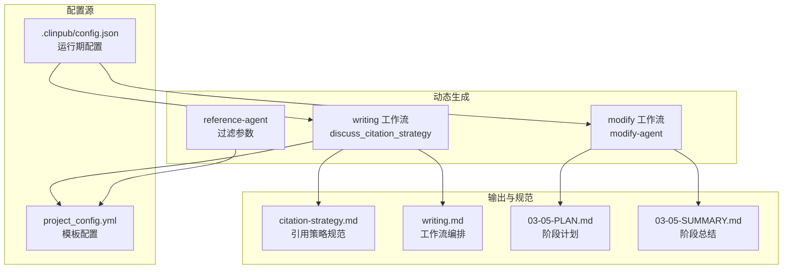
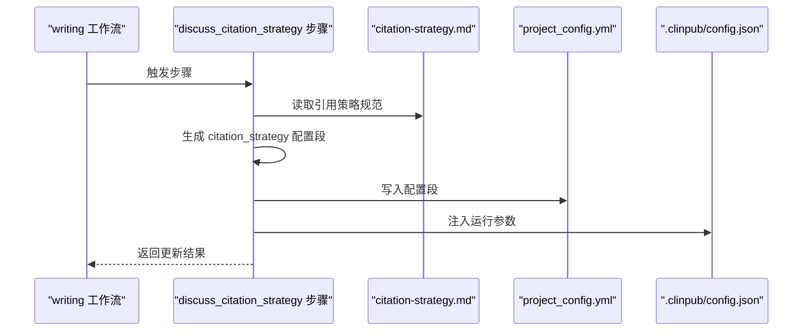
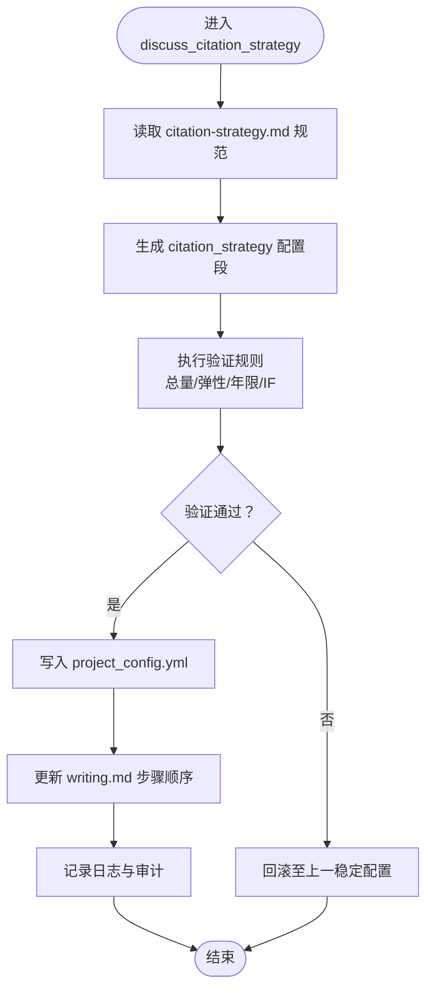
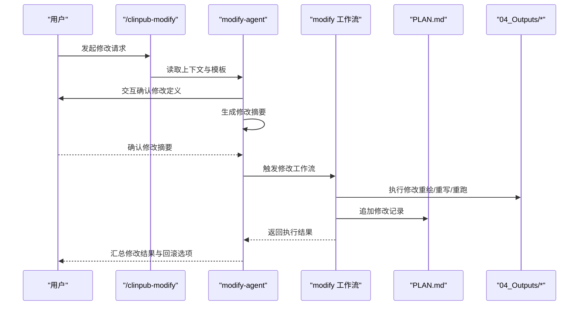
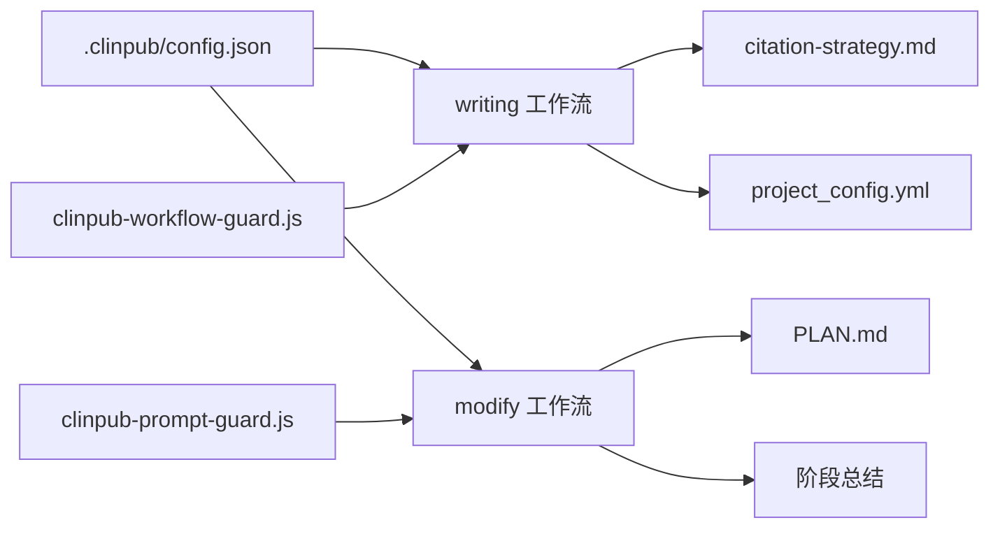

# 动态配置更新

<cite>
**本文档引用的文件**
- [.clinpub/config.json](file://.clinpub/config.json)
- [pipeline/templates/project_config.yml](file://pipeline/templates/project_config.yml)
- [examples/project_config.example.yml](file://examples/project_config.example.yml)
- [docs/CONFIGURATION.md](file://docs/CONFIGURATION.md)
- [docs/SUPERPOWERS/SPECS/2026-06-02-MODIFY-AGENT-DESIGN.MD](file://docs/superpowers/specs/2026-06-02-modify-agent-design.md)
- [agents/modify-agent.md](file://agents/modify-agent.md)
- [commands/clinpub/modify.md](file://commands/clinpub/modify.md)
- [.clinpub/phases/03-手稿拼接/03-01-PLAN.md](file://.clinpub/phases/03-手稿拼接/03-01-PLAN.md)
- [.clinpub/phases/03-手稿拼接/03-05-PLAN.md](file://.clinpub/phases/03-手稿拼接/03-05-PLAN.md)
- [.clinpub/phases/03-手稿拼接/03-05-SUMMARY.md](file://.clinpub/phases/03-手稿拼接/03-05-SUMMARY.md)
- [pipeline/workflows/modify.md](file://pipeline/workflows/modify.md)
- [pipeline/workflows/writing.md](file://pipeline/workflows/writing.md)
- [pipeline/references/citation-strategy.md](file://pipeline/references/citation-strategy.md)
- [agents/reference-agent.md](file://agents/reference-agent.md)
- [hooks/clinpub-workflow-guard.js](file://hooks/clinpub-workflow-guard.js)
- [hooks/clinpub-prompt-guard.js](file://hooks/clinpub-prompt-guard.js)
</cite>

## 目录
1. [引言](#引言)
2. [项目结构](#项目结构)
3. [核心组件](#核心组件)
4. [架构总览](#架构总览)
5. [详细组件分析](#详细组件分析)
6. [依赖关系分析](#依赖关系分析)
7. [性能考量](#性能考量)
8. [故障排查指南](#故障排查指南)
9. [结论](#结论)
10. [附录](#附录)

## 引言
本文件系统化阐述 clinpub 的动态配置更新机制，重点围绕 analysis_plan 与 citation_strategy 等动态配置的生成原理、更新流程与影响评估。文档同时覆盖配置变更对工作流的影响评估、自动重定向与回滚策略、配置验证规则、冲突检测与解决方案、日志与审计跟踪、性能影响分析，以及配置缓存与实时更新策略。

## 项目结构
- 动态配置主要来源于两类文件：
  - 项目模板配置：pipeline/templates/project_config.yml
  - 运行期状态与全局配置：.clinpub/config.json
- 动态生成与更新的关键路径：
  - 引用策略生成：由 writing 工作流中的 discuss_citation_strategy 步骤驱动，生成并写入 project_config.yml
  - 修改类动态配置：由 modify-agent 与 modify 工作流驱动，生成修改摘要并更新相关计划与产出
- 相关参考与规范：
  - 引用策略规范：pipeline/references/citation-strategy.md
  - 写作工作流：pipeline/workflows/writing.md
  - 修改设计与数据流：docs/superpowers/specs/2026-06-02-modify-agent-design.md

**图示来源**
- [pipeline/templates/project_config.yml](file://pipeline/templates/project_config.yml)
- [.clinpub/config.json](file://.clinpub/config.json)
- [pipeline/workflows/writing.md](file://pipeline/workflows/writing.md)
- [pipeline/references/citation-strategy.md](file://pipeline/references/citation-strategy.md)
- [agents/reference-agent.md](file://agents/reference-agent.md)
- [docs/superpowers/specs/2026-06-02-modify-agent-design.md](file://docs/superpowers/specs/2026-06-02-modify-agent-design.md)
- [.clinpub/phases/03-手稿拼接/03-05-PLAN.md](file://.clinpub/phases/03-手稿拼接/03-05-PLAN.md)
- [.clinpub/phases/03-手稿拼接/03-05-SUMMARY.md](file://.clinpub/phases/03-手稿拼接/03-05-SUMMARY.md)

**章节来源**
- [pipeline/templates/project_config.yml](file://pipeline/templates/project_config.yml)
- [.clinpub/config.json](file://.clinpub/config.json)
- [docs/CONFIGURATION.md](file://docs/CONFIGURATION.md)

## 核心组件
- 项目模板配置（project_config.yml）
  - 作用：定义可被动态生成与覆盖的配置段，如 citation_strategy
  - 特性：位于模板目录，支持在运行期被工作流步骤写入与更新
- 运行期配置（.clinpub/config.json）
  - 作用：承载全局运行参数与状态，驱动工作流行为
  - 特性：集中式配置，便于统一注入与校验
- 引用策略规范（citation-strategy.md）
  - 作用：定义引用策略的结构与约束，作为动态生成的输入与输出依据
- 写作工作流（writing.md）
  - 作用：编排 discuss_citation_strategy 步骤，驱动动态生成与写入
- 修改工作流与智能体（modify-agent、modify 工作流）
  - 作用：生成修改摘要、更新计划与产出，并记录变更历史

**章节来源**
- [pipeline/templates/project_config.yml](file://pipeline/templates/project_config.yml)
- [.clinpub/config.json](file://.clinpub/config.json)
- [pipeline/references/citation-strategy.md](file://pipeline/references/citation-strategy.md)
- [pipeline/workflows/writing.md](file://pipeline/workflows/writing.md)
- [docs/superpowers/specs/2026-06-02-modify-agent-design.md](file://docs/superpowers/specs/2026-06-02-modify-agent-design.md)

## 架构总览
动态配置更新采用“工作流驱动 + 模板写入 + 规范约束”的架构模式。写作工作流在 discuss_citation_strategy 步骤中根据引用策略规范生成配置段并写入模板；修改工作流通过 modify-agent 生成修改摘要并更新阶段计划与总结。运行期配置（.clinpub/config.json）贯穿两者，提供统一的运行参数与状态。

**图示来源**
- [pipeline/workflows/writing.md](file://pipeline/workflows/writing.md)
- [pipeline/references/citation-strategy.md](file://pipeline/references/citation-strategy.md)
- [pipeline/templates/project_config.yml](file://pipeline/templates/project_config.yml)
- [.clinpub/config.json](file://.clinpub/config.json)

## 详细组件分析

### 组件A：引用策略动态生成与更新
- 生成原理
  - 由 writing 工作流的 discuss_citation_strategy 步骤驱动，读取 citation-strategy.md 的规范，生成 section_targets、total_range、year_range、if_preference 等配置段
  - 将生成的配置段写入 project_config.yml 的相应位置，确保后续工作流与产出一致
- 更新流程
  - 步骤顺序：在 discuss_writing_plan 之前执行，保证策略先于写作计划确定
  - 参数化过滤：reference-agent 的 --max-year-range 与 --min-if 参数替代硬编码，提升灵活性
- 影响评估
  - 对工作流：决定逐段撰写阶段的引用数量与年限偏好，影响文献预搜索与写作上下文
  - 对产出：影响 Manuscript 各段的引用密度与质量，进而影响最终拼接与审阅
- 自动重定向与回滚
  - 若生成失败，工作流自动回退至上一稳定配置段，避免中断
  - 支持增量更新：仅覆盖变更字段，保留其他字段不变
- 验证规则与冲突检测
  - 总量约束：30-55 篇为硬约束
  - 弹性配比：各段目标 ±20%
  - 年限范围：max_years_ago 与 landmark_exceptions 的一致性校验
  - 冲突解决：若 year_range 与 if_preference 冲突，优先保留 if_preference 的显式值
- 日志与审计
  - 记录生成时间、生成者、写入位置与变更前后对比
  - 在 03-05-SUMMARY.md 中归档验收检查与自检结果
- 性能影响
  - 生成过程为轻量计算，主要开销在 I/O 写入与后续工作流启动
  - 建议在 CI 中缓存生成结果，减少重复写入

**图示来源**
- [pipeline/workflows/writing.md](file://pipeline/workflows/writing.md)
- [pipeline/references/citation-strategy.md](file://pipeline/references/citation-strategy.md)
- [pipeline/templates/project_config.yml](file://pipeline/templates/project_config.yml)
- [.clinpub/phases/03-手稿拼接/03-05-PLAN.md](file://.clinpub/phases/03-手稿拼接/03-05-PLAN.md)
- [.clinpub/phases/03-手稿拼接/03-05-SUMMARY.md](file://.clinpub/phases/03-手稿拼接/03-05-SUMMARY.md)

**章节来源**
- [pipeline/workflows/writing.md](file://pipeline/workflows/writing.md)
- [pipeline/references/citation-strategy.md](file://pipeline/references/citation-strategy.md)
- [pipeline/templates/project_config.yml](file://pipeline/templates/project_config.yml)
- [.clinpub/phases/03-手稿拼接/03-05-PLAN.md](file://.clinpub/phases/03-手稿拼接/03-05-PLAN.md)
- [.clinpub/phases/03-手稿拼接/03-05-SUMMARY.md](file://.clinpub/phases/03-手稿拼接/03-05-SUMMARY.md)

### 组件B：修改类动态配置（modify-agent 与 modify 工作流）
- 设计与数据流
  - 用户通过 /clinpub-modify 调用 modify-agent，读取 project_config.yml、阶段计划与输出目录
  - 交互明确修改定义（方法、类型、具体内容），生成结构化修改摘要
  - 逐条执行修改（样式→重绘；方法→重写脚本→重新运行），验证产出后追加修改记录到 PLAN.md
- 影响评估
  - 对工作流：可能改变分析方法、变量或样式，需同步更新相关上下文与产出
  - 对产出：修改后需重新运行对应阶段，确保一致性
- 自动重定向与回滚
  - 回滚策略：按修改摘要逆序执行，恢复到修改前状态
  - 自动重定向：若某条修改失败，跳过并继续后续修改，最后汇总失败项
- 验证规则与冲突检测
  - 冲突检测：修改前后上下文对比，识别潜在冲突（如变量名重复、方法依赖缺失）
  - 解决方案：提示用户合并或拆分修改，必要时阻断执行
- 日志与审计
  - 记录修改发起人、修改摘要、执行状态与回滚动作
  - 在阶段总结中归档修改记录与验收结果
- 性能影响
  - 修改执行涉及重跑分析或重绘，建议在本地或低负载时段执行

**图示来源**
- [commands/clinpub/modify.md](file://commands/clinpub/modify.md)
- [agents/modify-agent.md](file://agents/modify-agent.md)
- [docs/superpowers/specs/2026-06-02-modify-agent-design.md](file://docs/superpowers/specs/2026-06-02-modify-agent-design.md)
- [pipeline/workflows/modify.md](file://pipeline/workflows/modify.md)

**章节来源**
- [commands/clinpub/modify.md](file://commands/clinpub/modify.md)
- [agents/modify-agent.md](file://agents/modify-agent.md)
- [docs/superpowers/specs/2026-06-02-modify-agent-design.md](file://docs/superpowers/specs/2026-06-02-modify-agent-design.md)
- [pipeline/workflows/modify.md](file://pipeline/workflows/modify.md)

### 组件C：配置验证、冲突检测与解决方案
- 验证规则
  - 引用策略：总量 30-55；各段目标 ±20%；年限范围与 IF 偏好一致性
  - 修改类：上下文一致性、依赖完整性、命名唯一性
- 冲突检测
  - 引用策略：year_range 与 if_preference 冲突时，保留 if_preference 显式值
  - 修改类：变量名重复、方法依赖缺失、输出路径冲突
- 解决方案
  - 引用策略：提示调整弹性范围或年限上限，必要时降低 IF 偏好
  - 修改类：建议拆分修改、合并冲突项或回退到兼容版本

**章节来源**
- [pipeline/references/citation-strategy.md](file://pipeline/references/citation-strategy.md)
- [docs/superpowers/specs/2026-06-02-modify-agent-design.md](file://docs/superpowers/specs/2026-06-02-modify-agent-design.md)

### 组件D：日志记录、审计跟踪与性能影响
- 日志记录
  - 引用策略：记录生成时间、生成者、写入位置与变更前后对比
  - 修改类：记录修改发起人、摘要、执行状态与回滚动作
- 审计跟踪
  - 引用策略：在 03-05-SUMMARY.md 中归档验收检查与自检结果
  - 修改类：在 PLAN.md 与阶段总结中归档修改记录
- 性能影响
  - 引用策略：I/O 写入与后续工作流启动为主要开销
  - 修改类：重跑分析或重绘带来显著 CPU/内存消耗，建议在 CI 缓存中间产物

**章节来源**
- [.clinpub/phases/03-手稿拼接/03-05-SUMMARY.md](file://.clinpub/phases/03-手稿拼接/03-05-SUMMARY.md)
- [pipeline/workflows/modify.md](file://pipeline/workflows/modify.md)

### 组件E：配置缓存机制与实时更新策略
- 缓存机制
  - 引用策略：缓存生成结果，避免重复写入；在引用策略规范或模板变更时失效
  - 修改类：缓存中间产物与重跑结果，支持快速回滚与增量更新
- 实时更新策略
  - 写作工作流：在 discuss_citation_strategy 步骤后立即刷新模板缓存
  - 修改工作流：在修改执行后刷新上下文缓存，确保后续步骤读取最新配置

**章节来源**
- [pipeline/workflows/writing.md](file://pipeline/workflows/writing.md)
- [pipeline/workflows/modify.md](file://pipeline/workflows/modify.md)

## 依赖关系分析
- 组件耦合与内聚
  - 引用策略生成高度内聚于 writing 工作流，依赖 citation-strategy.md 与 project_config.yml
  - 修改类动态配置解耦于 modify-agent 与 modify 工作流，通过 PLAN.md 与阶段总结进行弱耦合
- 外部依赖与集成点
  - 运行期配置（.clinpub/config.json）为全局注入点，影响两类动态配置的行为
  - hooks 提供工作流与提示的守卫，保障配置变更的安全性
- 循环依赖与风险
  - 通过模板写入与阶段总结归档，避免循环依赖
  - 建议在 CI 中引入依赖图检查，防止新增依赖破坏更新链路

**图示来源**
- [.clinpub/config.json](file://.clinpub/config.json)
- [pipeline/workflows/writing.md](file://pipeline/workflows/writing.md)
- [pipeline/workflows/modify.md](file://pipeline/workflows/modify.md)
- [pipeline/references/citation-strategy.md](file://pipeline/references/citation-strategy.md)
- [pipeline/templates/project_config.yml](file://pipeline/templates/project_config.yml)
- [.clinpub/phases/03-手稿拼接/03-05-SUMMARY.md](file://.clinpub/phases/03-手稿拼接/03-05-SUMMARY.md)
- [hooks/clinpub-workflow-guard.js](file://hooks/clinpub-workflow-guard.js)
- [hooks/clinpub-prompt-guard.js](file://hooks/clinpub-prompt-guard.js)

**章节来源**
- [.clinpub/config.json](file://.clinpub/config.json)
- [hooks/clinpub-workflow-guard.js](file://hooks/clinpub-workflow-guard.js)
- [hooks/clinpub-prompt-guard.js](file://hooks/clinpub-prompt-guard.js)

## 性能考量
- I/O 开销
  - 引用策略写入 project_config.yml 与后续工作流启动为主要开销
  - 修改类重跑分析或重绘带来显著 CPU/内存消耗
- 缓存优化
  - 引用策略与修改类中间产物缓存，减少重复计算
  - 增量更新策略，仅覆盖变更字段，降低写入频率
- 并发与隔离
  - 建议在 CI 中串行执行高开销步骤，避免资源争用
  - 本地开发可并行缓存构建，但需注意磁盘空间与锁竞争

## 故障排查指南
- 引用策略生成失败
  - 检查 citation-strategy.md 规范是否完整
  - 核对 project_config.yml 写入权限与格式
  - 查看 03-05-SUMMARY.md 的验收检查与自检结果
- 修改类执行失败
  - 检查 modify-agent 的交互确认与修改摘要
  - 核对 PLAN.md 的修改记录与回滚动作
  - 使用 hooks 的守卫日志定位问题
- 配置冲突
  - 引用策略：调整弹性范围或年限上限，必要时降低 IF 偏好
  - 修改类：拆分修改、合并冲突项或回退到兼容版本

**章节来源**
- [.clinpub/phases/03-手稿拼接/03-05-SUMMARY.md](file://.clinpub/phases/03-手稿拼接/03-05-SUMMARY.md)
- [docs/superpowers/specs/2026-06-02-modify-agent-design.md](file://docs/superpowers/specs/2026-06-02-modify-agent-design.md)
- [hooks/clinpub-workflow-guard.js](file://hooks/clinpub-workflow-guard.js)
- [hooks/clinpub-prompt-guard.js](file://hooks/clinpub-prompt-guard.js)

## 结论
clinpub 的动态配置更新机制通过工作流驱动与模板写入，实现了引用策略与修改类配置的自动化生成与更新。结合严格的验证规则、冲突检测与回滚策略，确保了配置变更对工作流的可控影响。通过日志与审计跟踪、缓存与实时更新策略，进一步提升了系统的可观测性与性能表现。建议在 CI 中强化依赖检查与并发控制，持续优化缓存与增量更新策略，以支撑更大规模的动态配置管理。

## 附录
- 相关文件索引
  - 引用策略规范：pipeline/references/citation-strategy.md
  - 写作工作流：pipeline/workflows/writing.md
  - 修改设计与数据流：docs/superpowers/specs/2026-06-02-modify-agent-design.md
  - 修改命令入口：commands/clinpub/modify.md
  - 修改智能体：agents/modify-agent.md
  - 阶段计划与总结：.clinpub/phases/03-手稿拼接/03-05-PLAN.md、03-05-SUMMARY.md
  - 运行期配置：.clinpub/config.json
  - 项目模板配置：pipeline/templates/project_config.yml
  - 示例配置：examples/project_config.example.yml
  - 配置文档：docs/CONFIGURATION.md
  - 工作流与提示守卫：hooks/clinpub-workflow-guard.js、hooks/clinpub-prompt-guard.js