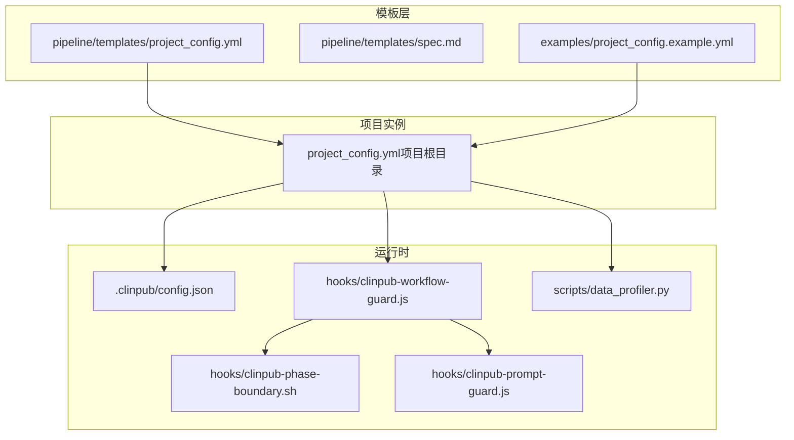
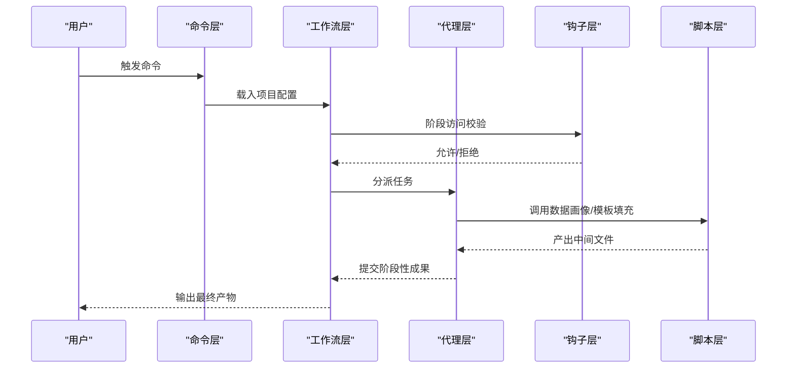
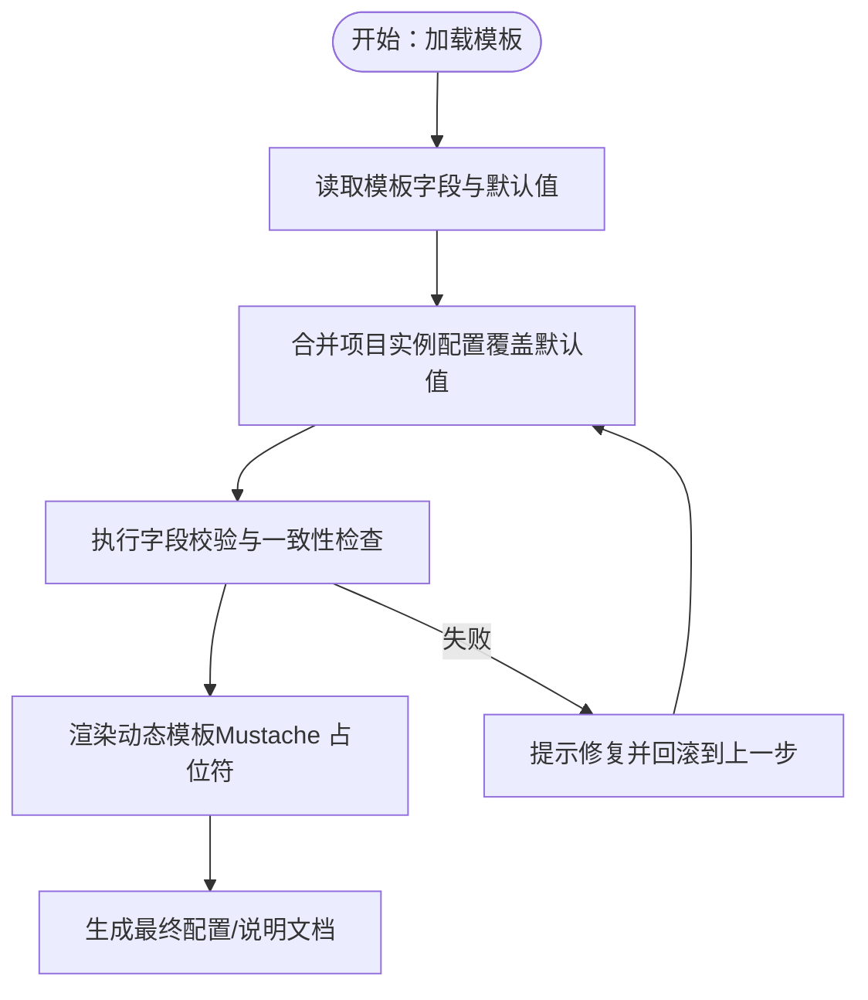
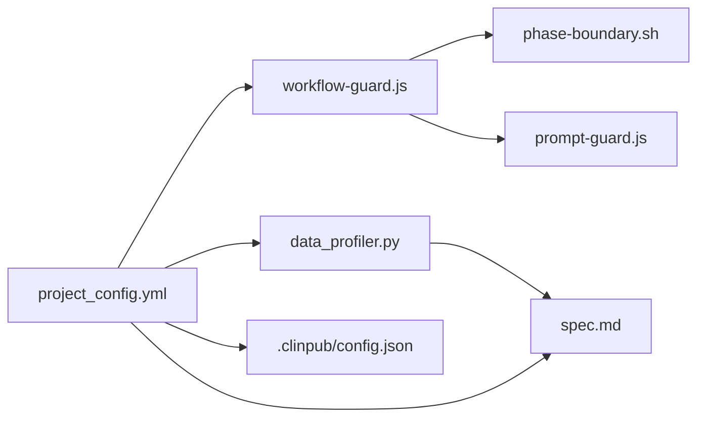

# 配置模板系统

<cite>
**本文引用的文件**
- [项目配置示例](file://examples/project_config.example.yml)
- [项目配置模板](file://pipeline/templates/project_config.yml)
- [配置指南](file://docs/CONFIGURATION.md)
- [架构文档](file://docs/ARCHITECTURE.md)
- [工作流防护钩子](file://hooks/clinpub-workflow-guard.js)
- [阶段边界钩子](file://hooks/clinpub-phase-boundary.sh)
- [提示注入防护钩子](file://hooks/clinpub-prompt-guard.js)
- [.clinpub 配置](file://.clinpub/config.json)
- [REVIEW.md（配置问题）](file://.clinpub/phases/03-手稿拼接/03-REVIEW.md)
- [数据画像脚本](file://scripts/data_profiler.py)
- [SPEC 模板](file://pipeline/templates/spec.md)
- [主题挖掘代理](file://agents/topic-miner-agent.md)
</cite>

## 目录
1. [简介](#简介)
2. [项目结构](#项目结构)
3. [核心组件](#核心组件)
4. [架构总览](#架构总览)
5. [详细组件分析](#详细组件分析)
6. [依赖分析](#依赖分析)
7. [性能考虑](#性能考虑)
8. [故障排查指南](#故障排查指南)
9. [结论](#结论)
10. [附录](#附录)

## 简介
本文件系统性阐述 clinpub 的“配置模板系统”，聚焦于项目配置模板的设计原理、继承与扩展机制、参数替换规则、标准模板使用方法、自定义模板开发流程、示例数据配置、集成检查清单模板应用、不同研究场景的模板选择指南，以及模板版本管理、模板验证与模板共享的最佳实践。目标是帮助使用者快速上手并安全地定制符合自身研究需求的配置模板。

## 项目结构
- 配置模板主要位于 pipeline/templates/ 与 examples/ 目录中，配合 hooks、agents、scripts 等模块共同构成端到端的配置驱动工作流。
- 配置模板与实际项目配置文件 project_config.yml 形成“模板-实例”的关系：模板提供字段骨架与默认值，实例在项目根目录落地并按需覆盖。

**图表来源**
- [项目配置模板](file://pipeline/templates/project_config.yml)
- [项目配置示例](file://examples/project_config.example.yml)
- [.clinpub 配置](file://.clinpub/config.json)
- [工作流防护钩子](file://hooks/clinpub-workflow-guard.js)
- [阶段边界钩子](file://hooks/clinpub-phase-boundary.sh)
- [提示注入防护钩子](file://hooks/clinpub-prompt-guard.js)
- [数据画像脚本](file://scripts/data_profiler.py)

**章节来源**
- [架构文档](file://docs/ARCHITECTURE.md)
- [配置指南](file://docs/CONFIGURATION.md)

## 核心组件
- 项目配置模板：提供标准化字段与默认值，支撑研究设计、变量映射、路径组织、分析策略、语言与质量控制等维度。
- 示例配置：演示典型研究场景（如 RCT）的字段取值与注释，便于快速迁移与校验。
- 运行时钩子：通过 hooks 保障配置文件的合规写入与阶段访问控制，防止越权或提前写入未来阶段产物。
- 数据画像与模板填充：通过 scripts/data_profiler.py 生成数据画像，结合 pipeline/templates/spec.md 等模板进行 Mustache 占位符填充，形成规范化的分析说明文档。

**章节来源**
- [项目配置模板](file://pipeline/templates/project_config.yml)
- [项目配置示例](file://examples/project_config.example.yml)
- [工作流防护钩子](file://hooks/clinpub-workflow-guard.js)
- [数据画像脚本](file://scripts/data_profiler.py)
- [SPEC 模板](file://pipeline/templates/spec.md)

## 架构总览
配置模板系统贯穿三层架构：
- Commands 层：用户通过命令触发工作流，命令文件定义入口与参数。
- Workflows 层：编排各阶段执行顺序，读取项目配置并驱动 Agents 与脚本。
- Agents 层：执行具体任务，如数据清洗、统计分析、文献检索、论文撰写等。

**图表来源**
- [架构文档](file://docs/ARCHITECTURE.md)
- [工作流防护钩子](file://hooks/clinpub-workflow-guard.js)
- [数据画像脚本](file://scripts/data_profiler.py)

## 详细组件分析

### 设计原理与继承机制
- 字段分层设计：配置模板按“项目基本信息、变量映射、路径组织、分析策略、语言与质量、分析计划、引文策略”等维度划分，确保覆盖研究全流程。
- 默认值与可覆盖性：模板提供默认值，项目实例可在不改变模板的前提下覆盖关键字段，实现“模板继承 + 实例定制”的组合模式。
- 动态生成与占位符：部分模板（如 SPEC 模板）采用 Mustache 风格占位符，由工作流在运行时注入变量上下文，实现参数化渲染。

**图表来源**
- [项目配置模板](file://pipeline/templates/project_config.yml)
- [SPEC 模板](file://pipeline/templates/spec.md)

**章节来源**
- [项目配置模板](file://pipeline/templates/project_config.yml)
- [SPEC 模板](file://pipeline/templates/spec.md)

### 参数替换规则
- 字段优先级：项目实例配置优先于模板默认值；未在实例中提供的字段保持模板默认值。
- 类型与取值约束：模板对字段类型（如枚举值）进行约束，实例必须满足这些约束，否则触发校验失败。
- 动态占位符：Mustache 风格占位符在运行时由工作流注入变量上下文，确保渲染结果与当前阶段一致。

**章节来源**
- [项目配置模板](file://pipeline/templates/project_config.yml)
- [SPEC 模板](file://pipeline/templates/spec.md)

### 标准配置模板使用方法
- 初始化项目：将示例配置复制到项目根目录并重命名为 project_config.yml，随后根据研究设计填写字段。
- 字段填写要点：
  - 项目基本信息：研究类型、样本量、报告标准等。
  - 变量映射：结局变量、暴露变量、协变量、时间变量、事件变量、分组变量、标识符等。
  - 路径组织：原始数据、预处理、方法、输出、参考文献、手稿等目录。
  - 分析策略：缺失率阈值、显著性水平、多重比较校正等。
  - 语言与质量：论文语言、图表语言、统计主语言、图表分辨率与格式等。
  - 分析计划：波次与方法列表（由工作流在 Phase 2 动态生成）。
  - 引文策略：各章节引用目标范围、总量范围、年份范围等。

**章节来源**
- [项目配置示例](file://examples/project_config.example.yml)
- [配置指南](file://docs/CONFIGURATION.md)

### 自定义模板开发
- 新增模板字段：在模板文件中新增字段，并提供合理的默认值与注释，确保字段语义清晰。
- 动态模板：为需要参数化的模板引入占位符，确保工作流在运行时能正确注入上下文。
- 与工作流集成：确保模板输出与工作流的预期输入/输出一致，避免字段错配导致的渲染失败。
- 钩子协同：通过 hooks 限制写入时机与目录范围，保证模板渲染产物的合规性。

**章节来源**
- [项目配置模板](file://pipeline/templates/project_config.yml)
- [SPEC 模板](file://pipeline/templates/spec.md)
- [工作流防护钩子](file://hooks/clinpub-workflow-guard.js)

### 示例数据集的配置方法
- 示例数据：examples/sample_data/ 提供示例数据文件，配合示例配置文件使用，便于快速验证配置正确性。
- 配置步骤：
  - 将示例配置复制到项目根目录并重命名为 project_config.yml。
  - 根据示例数据的变量结构填写变量映射（如 outcome、exposure、covariates 等）。
  - 运行数据准备与分析流程，观察输出是否符合预期。

**章节来源**
- [项目配置示例](file://examples/project_config.example.yml)

### 集成检查清单的模板应用
- 检查清单模板：在项目规划与里程碑评审阶段，使用模板生成标准化检查清单，确保关键节点的完成度。
- 应用流程：
  - 在工作流中调用模板渲染，注入项目状态与阶段信息。
  - 通过钩子机制限制检查清单的生成目录与时机，避免越权写入。
  - 将检查清单纳入阶段评审流程，作为质量门控的一部分。

**章节来源**
- [工作流防护钩子](file://hooks/clinpub-workflow-guard.js)

### 不同研究场景的模板选择指南
- RCT（随机对照试验）：启用 CONSORT 报告标准，配置随机化方法、对照组等字段。
- 队列研究：配置随访时间、删失变量等字段，关注时间轴与事件发生。
- 病例对照研究：配置匹配变量与匹配比例，确保分组均衡性。
- 横断面研究：配置抽样方法（如分层、集群），关注代表性与偏差控制。
- 生存分析：当检测到时间-事件变量时，自动识别为生存分析类型，模板中相应字段生效。

**章节来源**
- [配置指南](file://docs/CONFIGURATION.md)
- [主题挖掘代理](file://agents/topic-miner-agent.md)

### 模板版本管理
- 版本标识：在模板文件头部添加版本注释，记录模板版本与变更日期。
- 变更追踪：通过 Git 提交记录追踪模板变更，确保每次修改都有据可查。
- 向后兼容：新增字段时保持向后兼容，避免破坏现有实例配置。
- 发布策略：在发布前对模板进行回归测试，确保与工作流的集成稳定。

**章节来源**
- [项目配置模板](file://pipeline/templates/project_config.yml)

### 模板验证
- 字段完整性：校验关键字段是否存在且非空。
- 取值合法性：校验枚举值、数值范围、路径格式等是否符合模板约束。
- 一致性检查：校验变量映射与数据特征的一致性（如生存分析的事件变量与时间变量）。
- 渲染一致性：对动态模板进行渲染测试，确保占位符被正确替换。

**章节来源**
- [REVIEW.md（配置问题）](file://.clinpub/phases/03-手稿拼接/03-REVIEW.md)
- [项目配置模板](file://pipeline/templates/project_config.yml)

### 模板共享最佳实践
- 模板标准化：统一字段命名与取值规范，减少歧义。
- 文档配套：为模板提供使用说明与示例，降低学习成本。
- 权限控制：通过钩子限制模板渲染产物的写入目录，防止越权操作。
- 审核流程：在团队内建立模板审核流程，确保模板质量与一致性。

**章节来源**
- [工作流防护钩子](file://hooks/clinpub-workflow-guard.js)

## 依赖分析
配置模板系统的关键依赖关系如下：
- 项目配置模板与实例：模板提供默认值，实例覆盖关键字段。
- 钩子与阶段控制：workflow-guard.js 限制写入目录与阶段，phase-boundary.sh 与 prompt-guard.js 提供阶段边界与提示注入防护。
- 数据画像与模板渲染：data_profiler.py 生成数据画像，spec.md 等模板通过占位符渲染形成分析说明文档。

**图表来源**
- [项目配置模板](file://pipeline/templates/project_config.yml)
- [项目配置示例](file://examples/project_config.example.yml)
- [工作流防护钩子](file://hooks/clinpub-workflow-guard.js)
- [阶段边界钩子](file://hooks/clinpub-phase-boundary.sh)
- [提示注入防护钩子](file://hooks/clinpub-prompt-guard.js)
- [.clinpub 配置](file://.clinpub/config.json)
- [数据画像脚本](file://scripts/data_profiler.py)
- [SPEC 模板](file://pipeline/templates/spec.md)

**章节来源**
- [架构文档](file://docs/ARCHITECTURE.md)

## 性能考虑
- 模板渲染性能：尽量减少动态模板中的复杂计算，将计算移至脚本层或工作流层。
- 钩子开销：钩子在 PreToolUse 阶段执行，应保持逻辑简洁，避免阻塞用户编辑体验。
- 数据画像效率：对大型数据集进行采样或分块处理，缩短画像生成时间。

## 故障排查指南
- 阶段访问被拒：检查当前阶段与目标目录的对应关系，确保已完成前置阶段。
- 配置字段冲突：根据 REVIEW.md 中的问题提示修正字段取值，避免边界模糊（如缺失率阈值的边界值）。
- 模板渲染失败：检查占位符是否与上下文一致，确保工作流提供了完整的变量上下文。
- 钩子异常：若钩子解析错误，fallback 为允许，但需尽快修复以恢复严格控制。

**章节来源**
- [工作流防护钩子](file://hooks/clinpub-workflow-guard.js)
- [REVIEW.md（配置问题）](file://.clinpub/phases/03-手稿拼接/03-REVIEW.md)

## 结论
配置模板系统通过“模板-实例”的分层设计与严格的钩子控制，实现了配置的标准化、可定制与可验证。遵循本文提供的使用方法、参数替换规则、自定义开发流程与最佳实践，可以高效地为不同研究场景构建高质量的配置模板，并确保模板在整个生命周期内的稳定性与可维护性。

## 附录
- 术语表
  - 模板：提供字段骨架与默认值的配置文件。
  - 实例：项目根目录中的具体配置文件，覆盖模板默认值。
  - 占位符：动态模板中的变量标记，由工作流在运行时注入上下文。
  - 钩子：Claude Code 的 PreToolUse 机制，用于阶段访问控制与安全防护。